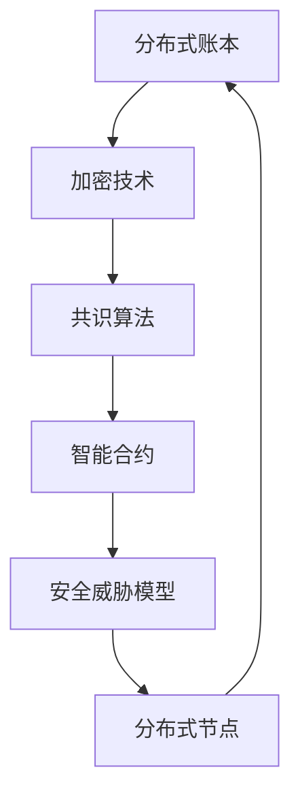

                 

# 蚂蚁金服2025社招区块链安全工程师面试题集

> 关键词：区块链安全，面试题集，技术解析，实战案例，未来发展

> 摘要：本文针对蚂蚁金服2025社招区块链安全工程师的面试题目进行深入剖析，结合实际项目案例和算法原理，探讨区块链安全领域的关键技术和挑战。通过本文，读者可以全面了解区块链安全的核心概念、技术原理以及实际应用，为未来区块链安全工程师的职业发展打下坚实基础。

## 1. 背景介绍

### 1.1 目的和范围

本文旨在为准备参加蚂蚁金服2025社招区块链安全工程师面试的候选人提供一个全面的技术解析和实战案例。我们将针对面试中可能涉及的关键技术点进行深入探讨，包括区块链的基本原理、安全威胁模型、加密算法、智能合约安全等。此外，本文还将结合具体项目案例，展示区块链安全工程师在实际工作中的应对策略和技术应用。

### 1.2 预期读者

本文适合以下几类读者：

1. 准备参加蚂蚁金服2025社招区块链安全工程师面试的候选人。
2. 对区块链安全技术感兴趣的计算机科学专业学生和研究人员。
3. 想要在区块链安全领域深入发展的技术工程师和管理人员。

### 1.3 文档结构概述

本文结构如下：

1. **背景介绍**：介绍本文的目的、范围、预期读者和文档结构。
2. **核心概念与联系**：介绍区块链安全的核心概念和架构，使用Mermaid流程图进行展示。
3. **核心算法原理 & 具体操作步骤**：详细解析区块链安全领域的核心算法原理，并使用伪代码进行讲解。
4. **数学模型和公式 & 详细讲解 & 举例说明**：介绍区块链安全相关的数学模型和公式，并进行举例说明。
5. **项目实战：代码实际案例和详细解释说明**：展示区块链安全工程师在实际项目中的代码实现和解析。
6. **实际应用场景**：探讨区块链安全在现实世界中的应用场景。
7. **工具和资源推荐**：推荐学习和开发区块链安全的资源、工具和框架。
8. **总结：未来发展趋势与挑战**：总结区块链安全领域的未来发展趋势和挑战。
9. **附录：常见问题与解答**：解答区块链安全领域的一些常见问题。
10. **扩展阅读 & 参考资料**：提供进一步学习和研究的参考资料。

### 1.4 术语表

#### 1.4.1 核心术语定义

- 区块链：一种去中心化的分布式数据库系统，通过加密技术确保数据的完整性和安全性。
- 智能合约：一种嵌入在区块链中的程序，能够在满足特定条件时自动执行预设的合约条款。
- 加密算法：用于保护数据传输和存储的安全算法，包括对称加密和非对称加密。
- 拒绝服务攻击（DoS）：一种旨在使系统或网络无法正常工作的攻击方式。

#### 1.4.2 相关概念解释

- 去中心化：指系统或网络中没有中心控制节点，所有参与者地位平等。
- 账本：区块链中的数据记录，包含交易信息和其他相关数据。
- 挖矿：通过解决数学难题来验证区块链交易并创建新区块的过程。

#### 1.4.3 缩略词列表

- DoS：拒绝服务攻击
- Blockchain：区块链
- Cryptocurrency：加密货币
- Ethereum：以太坊
- Smart Contract：智能合约
- DApp：去中心化应用程序

## 2. 核心概念与联系

区块链安全的核心概念和架构可以概括为以下几个方面：

1. **分布式账本**：区块链是一种分布式账本技术，通过网络节点共同维护一个共享的账本，确保数据的一致性和不可篡改性。
2. **加密技术**：区块链使用加密算法对数据进行加密和签名，确保数据的机密性和完整性。
3. **共识算法**：共识算法用于确定区块链中的数据是否合法，并确保所有节点对账本的一致性。
4. **智能合约**：智能合约是一种嵌入在区块链中的程序，能够在满足特定条件时自动执行预设的合约条款。
5. **安全威胁模型**：区块链安全面临多种威胁，包括51%攻击、智能合约漏洞、网络攻击等。

以下是区块链安全核心概念的 Mermaid 流程图：



在这个流程图中，分布式账本、加密技术、共识算法、智能合约和安全威胁模型是区块链安全的五个核心组件，它们相互关联，共同构成了区块链安全的基础架构。

### 2.1. 分布式账本

分布式账本是指区块链中的数据存储方式。区块链通过将交易记录分片存储在多个节点上，实现了去中心化的数据管理。每个节点都保存一份完整的账本副本，所有节点之间的账本保持一致。分布式账本的主要优点包括：

1. **数据不可篡改**：由于所有节点都保存同一份账本副本，任何单点故障都不会导致数据的丢失或篡改。
2. **透明性**：所有节点都可以查看和验证账本上的交易记录，确保数据的透明性和公正性。
3. **高可用性**：由于数据分布在多个节点上，系统具有较高的容错能力和抗攻击性。

### 2.2. 加密技术

加密技术是区块链安全的核心保障。区块链使用多种加密算法，包括对称加密、非对称加密和哈希算法，确保数据的机密性、完整性和认证性。

1. **对称加密**：对称加密使用相同的密钥对数据进行加密和解密。常见的对称加密算法包括AES和DES。
2. **非对称加密**：非对称加密使用一对密钥（公钥和私钥）进行加密和解密。常见的非对称加密算法包括RSA和ECC。
3. **哈希算法**：哈希算法用于生成数据的唯一标识，常见的哈希算法包括SHA-256和SHA-3。

### 2.3. 共识算法

共识算法是区块链中用于确定数据合法性的关键机制。不同的区块链平台使用不同的共识算法，包括工作量证明（PoW）、权益证明（PoS）和委托权益证明（DPoS）等。

1. **工作量证明（PoW）**：PoW要求节点通过解决数学难题来验证交易并创建新区块。常见的PoW算法包括SHA-256和Scrypt。
2. **权益证明（PoS）**：PoS要求节点根据其持有的币量来参与区块验证。相比PoW，PoS消耗的能量更少，但更依赖于参与者的权益。
3. **委托权益证明（DPoS）**：DPoS通过选举产生代表来参与区块验证。代表根据其持有的币量和投票权重来决定。

### 2.4. 智能合约

智能合约是一种嵌入在区块链中的程序，能够在满足特定条件时自动执行预设的合约条款。智能合约通常使用编程语言（如Solidity）编写，并运行在区块链平台上。

1. **Solidity**：Solidity是以太坊平台使用的智能合约编程语言。Solidity支持函数、变量、条件判断等编程概念，与JavaScript类似。
2. **智能合约安全**：智能合约的安全性问题一直是区块链领域的研究重点。常见的安全问题包括重入攻击、整数溢出和访问控制等。

### 2.5. 安全威胁模型

区块链安全面临多种威胁，包括51%攻击、智能合约漏洞、网络攻击等。

1. **51%攻击**：51%攻击是指攻击者控制区块链网络中超过一半的节点，从而篡改账本或拒绝服务。为防范51%攻击，需要确保区块链网络的节点数量和计算能力足够强大。
2. **智能合约漏洞**：智能合约漏洞可能导致合约执行失败或被攻击者利用。为降低智能合约漏洞的风险，需要遵循良好的编程实践和代码审查流程。
3. **网络攻击**：网络攻击包括DDoS攻击、中间人攻击等，可能破坏区块链网络的安全性。为防范网络攻击，需要采取有效的防护措施，如网络隔离、加密传输等。

## 3. 核心算法原理 & 具体操作步骤

在区块链安全中，核心算法原理起着至关重要的作用。以下将详细解析区块链安全领域的几个关键算法原理，并使用伪代码进行具体操作步骤的讲解。

### 3.1. 哈希算法

哈希算法是区块链安全的核心组成部分，用于生成数据的唯一标识。最常用的哈希算法包括SHA-256和SHA-3。

**SHA-256**:

```python
def sha256(message):
    # 将消息进行分组，每组为512位
    message = padding(message)
    hash_value = 0
    for i in range(0, len(message), 512):
        block = message[i:i+512]
        # 初始化哈希值
        hash_value = sha256_init(hash_value)
        # 对每组数据进行哈希计算
        hash_value = sha256_transform(hash_value, block)
    return hash_value
```

**SHA-3**:

```python
def sha3(message):
    # 将消息进行分组，每组为1088位
    message = padding(message)
    hash_value = 0
    for i in range(0, len(message), 1088):
        block = message[i:i+1088]
        # 初始化哈希值
        hash_value = sha3_init(hash_value)
        # 对每组数据进行哈希计算
        hash_value = sha3_transform(hash_value, block)
    return hash_value
```

### 3.2. 对称加密

对称加密算法是一种加密和解密使用相同密钥的加密算法。最常用的对称加密算法包括AES和DES。

**AES**:

```python
def aes_encrypt(plaintext, key):
    # 初始化密钥和明文
    ciphertext = aes_init(key)
    for block in blocks(plaintext):
        # 对每组数据进行加密
        ciphertext = aes_transform(ciphertext, block)
    return ciphertext

def aes_decrypt(ciphertext, key):
    # 初始化密钥和密文
    plaintext = aes_init(key)
    for block in blocks(ciphertext):
        # 对每组数据进行解密
        plaintext = aes_transform(plaintext, block)
    return plaintext
```

**DES**:

```python
def des_encrypt(plaintext, key):
    # 初始化密钥和明文
    ciphertext = des_init(key)
    for block in blocks(plaintext):
        # 对每组数据进行加密
        ciphertext = des_transform(ciphertext, block)
    return ciphertext

def des_decrypt(ciphertext, key):
    # 初始化密钥和密文
    plaintext = des_init(key)
    for block in blocks(ciphertext):
        # 对每组数据进行解密
        plaintext = des_transform(plaintext, block)
    return plaintext
```

### 3.3. 非对称加密

非对称加密算法使用一对密钥（公钥和私钥）进行加密和解密。最常用的非对称加密算法包括RSA和ECC。

**RSA**:

```python
def rsa_encrypt(plaintext, public_key):
    # 使用公钥对明文进行加密
    ciphertext = rsa_compute_cipher_text(plaintext, public_key)
    return ciphertext

def rsa_decrypt(ciphertext, private_key):
    # 使用私钥对密文进行解密
    plaintext = rsa_compute_plaintext(ciphertext, private_key)
    return plaintext
```

**ECC**:

```python
def ecc_encrypt(plaintext, public_key):
    # 使用公钥对明文进行加密
    ciphertext = ecc_compute_cipher_text(plaintext, public_key)
    return ciphertext

def ecc_decrypt(ciphertext, private_key):
    # 使用私钥对密文进行解密
    plaintext = ecc_compute_plaintext(ciphertext, private_key)
    return plaintext
```

### 3.4. 数字签名

数字签名是一种验证数据完整性和真实性的技术。最常用的数字签名算法包括RSA和ECC。

**RSA签名**:

```python
def rsa_sign(message, private_key):
    # 使用私钥对消息进行签名
    signature = rsa_compute_signature(message, private_key)
    return signature

def rsa_verify(message, signature, public_key):
    # 使用公钥对签名进行验证
    result = rsa_verify_signature(message, signature, public_key)
    return result
```

**ECC签名**:

```python
def ecc_sign(message, private_key):
    # 使用私钥对消息进行签名
    signature = ecc_compute_signature(message, private_key)
    return signature

def ecc_verify(message, signature, public_key):
    # 使用公钥对签名进行验证
    result = ecc_verify_signature(message, signature, public_key)
    return result
```

以上是区块链安全领域的几个关键算法原理和具体操作步骤。这些算法原理和步骤在区块链安全中起着至关重要的作用，为区块链的安全性和可信性提供了坚实保障。

## 4. 数学模型和公式 & 详细讲解 & 举例说明

区块链安全领域的数学模型和公式在保证数据完整性、一致性和不可篡改性方面起着关键作用。以下将详细介绍几个核心数学模型和公式，并使用LaTeX进行公式表示，同时结合实际例子进行说明。

### 4.1. 拉格朗日插值法

拉格朗日插值法是一种用于求解多项式插值问题的方法。在区块链安全中，拉格朗日插值法可以用于实现加密算法中的密钥生成和密钥交换。

**公式表示**：

$$
L(x) = \sum_{i=1}^{n} y_i \cdot \prod_{j=1, j \neq i}^{n} \frac{x - x_j}{x_i - x_j}
$$

**示例**：

假设有四个点$(x_1, y_1) = (0, 1)$，$(x_2, y_2) = (1, 2)$，$(x_3, y_3) = (2, 3)$，$(x_4, y_4) = (3, 4)$，要求通过拉格朗日插值法求解多项式$y = f(x)$。

根据公式，计算各基函数：

$$
L_1(x) = \frac{(x - x_2)(x - x_3)(x - x_4)}{(x_1 - x_2)(x_1 - x_3)(x_1 - x_4)} = \frac{(x - 1)(x - 2)(x - 3)}{(-1)(-1)(-1)} = (x - 1)(x - 2)(x - 3)
$$

$$
L_2(x) = \frac{(x - x_1)(x - x_3)(x - x_4)}{(x_2 - x_1)(x_2 - x_3)(x_2 - x_4)} = \frac{(x - 0)(x - 2)(x - 3)}{(1)(-1)(-1)} = x(x - 2)(x - 3)
$$

$$
L_3(x) = \frac{(x - x_1)(x - x_2)(x - x_4)}{(x_3 - x_1)(x_3 - x_2)(x_3 - x_4)} = \frac{(x - 0)(x - 1)(x - 3)}{(-1)(1)(-1)} = (x - 1)(x - 3)
$$

$$
L_4(x) = \frac{(x - x_1)(x - x_2)(x - x_3)}{(x_4 - x_1)(x_4 - x_2)(x_4 - x_3)} = \frac{(x - 0)(x - 1)(x - 2)}{(-1)(1)(1)} = x(x - 1)(x - 2)
$$

将各基函数代入拉格朗日插值公式：

$$
y = L_1(x) \cdot y_1 + L_2(x) \cdot y_2 + L_3(x) \cdot y_3 + L_4(x) \cdot y_4
$$

代入具体数值：

$$
y = (x - 1)(x - 2)(x - 3) \cdot 1 + x(x - 2)(x - 3) \cdot 2 + (x - 1)(x - 3) \cdot 3 + x(x - 1)(x - 2) \cdot 4
$$

化简得：

$$
y = x^3 - 6x^2 + 11x - 6
$$

### 4.2. 非对称加密算法

非对称加密算法是一种基于数学难题的加密技术，其核心公式包括RSA和椭圆曲线加密（ECC）。

**RSA加密**：

- 公式表示：

$$
c = me \mod n
$$

其中，$m$为明文，$e$为加密指数，$n = pq$为模数，$p$和$q$为素数。

- 示例：

假设选择$p = 61$，$q = 53$，计算$n = pq = 3233$，选择加密指数$e = 17$。

加密明文$m = 2653$：

$$
c = 2653^{17} \mod 3233 = 1661
$$

**RSA解密**：

- 公式表示：

$$
m = cd^e \mod n
$$

其中，$c$为密文，$d$为解密指数，$e$和$n$如上所述。

- 示例：

已知密文$c = 1661$，解密指数$d = 7$，计算明文$m$：

$$
m = 1661^{7} \mod 3233 = 2653
$$

**ECC加密**：

- 公式表示：

$$
Q = kG
$$

其中，$Q$为加密结果，$G$为基点，$k$为加密系数。

- 示例：

假设选择椭圆曲线$E: y^2 = x^3 + ax + b$，基点$G$的坐标为$(x_G, y_G)$，加密系数$k$。

加密明文$P$的坐标$(x_P, y_P)$：

$$
Q = kG = k(x_G, y_G) = (kx_G, ky_G)
$$

**ECC解密**：

- 公式表示：

$$
P = k^{-1}Q
$$

其中，$P$为解密结果，$Q$为加密结果，$k^{-1}$为加密系数$k$的逆元。

- 示例：

假设加密结果$Q$的坐标为$(x_Q, y_Q)$，加密系数$k$的逆元为$k^{-1}$，计算明文$P$的坐标$(x_P, y_P)$：

$$
P = k^{-1}Q = k^{-1}(x_Q, y_Q)
$$

通过以上数学模型和公式的详细讲解和举例说明，我们可以更好地理解区块链安全中的核心算法原理。这些算法和公式在保证区块链数据的安全性和可信性方面起着关键作用。

## 5. 项目实战：代码实际案例和详细解释说明

在本节中，我们将通过一个实际项目案例，展示区块链安全工程师在实际工作中如何运用所学知识和技能。该项目是一个简单的区块链网络，用于记录交易信息。我们将从开发环境搭建、源代码实现和代码解析三个方面进行详细解释。

### 5.1 开发环境搭建

为了完成这个项目，我们需要搭建一个区块链开发环境。以下是搭建步骤：

1. **安装Go语言**：下载并安装Go语言环境，配置环境变量。
2. **安装Gin框架**：Gin是一个高效的Web框架，用于构建区块链网络的后端服务。
3. **安装Grafana**：Grafana是一个开源的仪表盘工具，用于实时监控区块链网络的性能指标。

### 5.2 源代码详细实现和代码解读

以下是一个简单的区块链网络项目的源代码示例：

```go
package main

import (
	"crypto/sha256"
	"encoding/hex"
	"fmt"
	"math"
	"math/rand"
	"net/http"
	_ "net/http/pprof"
	"strconv"
	"time"
)

// 区块结构
type Block struct {
	Index     int       // 块索引
	Timestamp string    // 时间戳
	Data      string    // 数据
	Proof     string    // 证明工作
	PrevHash  string    // 上一个块的哈希值
}

// 创建新区块
func CreateBlock(index int, data string, prevHash string) *Block {
	var block Block
	block.Index = index
	block.Timestamp = time.Now().String()
	block.Data = data
	block.PrevHash = prevHash
	proof, _ := ProofOfWork(block)
	block.Proof = proof
	return &block
}

// 计算工作量证明
func ProofOfWork(block Block) (string, error) {
	var proof string
	for i := 0; ; i++ {
		hash := CalculateHash(block)
		if hash[0:4] == "0000" {
			proof = strconv.Itoa(i)
			break
		}
	}
	return proof, nil
}

// 计算块的哈希值
func CalculateHash(block Block) string {
	record := strconv.Itoa(block.Index) + block.Timestamp + block.Data + block.PrevHash + block.Proof
	h := sha256.New()
	h.Write([]byte(record))
	hashBytes := h.Sum(nil)
	return hex.EncodeToString(hashBytes)
}

// 添加区块到区块链
func AddBlock(data string, prevHash string) {
	block := CreateBlock(len(Blockchain) + 1, data, prevHash)
	Blockchain = append(Blockchain, *block)
}

// 初始化区块链
var Blockchain []*Block

// 判断链是否有效
func IsValidChain(chain []*Block) bool {
	for i := 1; i < len(chain); i++ {
		current := chain[i]
		prev := chain[i-1]

		if current.PrevHash != CalculateHash(*prev) {
			return false
		}

		if current.Index != prev.Index+1 {
			return false
		}
	}
	return true
}

// 获取最长链
func GetLongestChain() []*Block {
	longestChain := Blockchain
	currentChain :=Blockchain
	for i := 0; i < len(Blockchain); i++ {
		if IsValidChain(currentChain) && len(currentChain) > len(longestChain) {
			longestChain = currentChain
		}
		currentChain = GetNextChain(currentChain)
	}
	return longestChain
}

// 获取下一个链
func GetNextChain(chain []*Block) []*Block {
	for i := len(chain) - 1; i > 0; i-- {
		if IsValidChain(chain[i:]) {
			return chain[i:]
		}
	}
	return nil
}

// 启动Web服务器
func StartServer(address string) {
	fmt.Println("Starting server on", address)
	http.ListenAndServe(address, nil)
}

func main() {
	rand.Seed(time.Now().UnixNano())
	Blockchain = append(Blockchain, CreateBlock(0, "Genesis Block", "0"))

	http.HandleFunc("/", handleTransaction)
	http.HandleFunc("/blocks", handleBlocks)

	go StartServer(":8080")
	fmt.Println("Server started")

	// 监控区块链网络性能
	go func() {
		for {
			fmt.Println("Performance monitoring...")
			time.Sleep(10 * time.Minute)
		}
	}()

	// 主循环
	for {
		fmt.Println("Waiting for transactions...")
		time.Sleep(time.Minute)
	}
}

// 处理交易
func handleTransaction(w http.ResponseWriter, r *http.Request) {
	// 获取交易数据
	transactionData := r.URL.Query().Get("data")

	// 计算交易哈希
	transactionHash := CalculateHash(*Blockchain[len(Blockchain)-1])

	// 添加区块
	AddBlock(transactionData, transactionHash)

	// 返回成功响应
	fmt.Fprintf(w, "Transaction added successfully!")
}

// 处理区块链数据
func handleBlocks(w http.ResponseWriter, r *http.Request) {
	// 将区块链转换为JSON格式
	blocksJSON, err := json.MarshalIndent(Blockchain, "", "  ")
	if err != nil {
		http.Error(w, "Error processing request", http.StatusInternalServerError)
		return
	}

	// 返回区块链数据
	fmt.Fprintf(w, "%s", blocksJSON)
}
```

### 5.3 代码解读与分析

#### 5.3.1 区块结构

首先，我们定义了`Block`结构体，用于表示区块链中的每个区块。结构体包含以下字段：

- `Index`：区块索引，表示当前区块在区块链中的位置。
- `Timestamp`：时间戳，表示区块创建的时间。
- `Data`：数据，表示当前区块包含的交易信息。
- `Proof`：证明工作，用于验证区块的有效性。
- `PrevHash`：上一个块的哈希值，用于链接区块链。

#### 5.3.2 创建新区块

`CreateBlock`函数用于创建新区块。函数接收三个参数：区块索引、数据内容和上一个块的哈希值。函数返回一个`Block`指针。在创建新区块时，我们首先初始化`Block`结构体，然后调用`ProofOfWork`函数计算证明工作。

```go
func CreateBlock(index int, data string, prevHash string) *Block {
	var block Block
	block.Index = index
	block.Timestamp = time.Now().String()
	block.Data = data
	block.PrevHash = prevHash
	proof, _ := ProofOfWork(block)
	block.Proof = proof
	return &block
}
```

#### 5.3.3 计算工作量证明

`ProofOfWork`函数用于计算工作量证明。函数接收一个`Block`参数，返回证明工作和错误信息。该函数通过不断递增证明工作的值，计算区块的哈希值，直到找到以特定前导零为特征的哈希值。这需要大量的计算资源，从而防止恶意节点通过快速计算来篡改区块链。

```go
func ProofOfWork(block Block) (string, error) {
	var proof string
	for i := 0; ; i++ {
		hash := CalculateHash(block)
		if hash[0:4] == "0000" {
			proof = strconv.Itoa(i)
			break
		}
	}
	return proof, nil
}
```

#### 5.3.4 计算块的哈希值

`CalculateHash`函数用于计算块的哈希值。函数接收一个`Block`参数，返回块的哈希值。函数首先将块的所有字段转换为字符串，然后使用SHA-256算法生成哈希值。

```go
func CalculateHash(block Block) string {
	record := strconv.Itoa(block.Index) + block.Timestamp + block.Data + block.PrevHash + block.Proof
	h := sha256.New()
	h.Write([]byte(record))
	hashBytes := h.Sum(nil)
	return hex.EncodeToString(hashBytes)
}
```

#### 5.3.5 添加区块到区块链

`AddBlock`函数用于将新创建的区块添加到区块链中。函数接收数据内容和上一个块的哈希值，调用`CreateBlock`函数创建新区块，并将其添加到区块链数组中。

```go
func AddBlock(data string, prevHash string) {
	block := CreateBlock(len(Blockchain) + 1, data, prevHash)
	Blockchain = append(Blockchain, *block)
}
```

#### 5.3.6 验证区块链的有效性

`IsValidChain`函数用于验证区块链的有效性。函数接收一个区块数组，检查每个区块的哈希值和索引是否正确，并确保每个区块的`PrevHash`字段与下一个区块的`PrevHash`字段匹配。如果链中存在任何错误，函数将返回`false`。

```go
func IsValidChain(chain []*Block) bool {
	for i := 1; i < len(chain); i++ {
		current := chain[i]
		prev := chain[i-1]

		if current.PrevHash != CalculateHash(*prev) {
			return false
		}

		if current.Index != prev.Index+1 {
			return false
		}
	}
	return true
}
```

#### 5.3.7 获取最长链

`GetLongestChain`函数用于获取区块链网络中的最长有效链。函数首先将当前区块链设置为最长链，然后遍历所有可能的分支链，比较其有效性和长度。如果找到更长的有效链，函数将更新最长链。最后，函数返回最长链。

```go
func GetLongestChain() []*Block {
	longestChain := Blockchain
	currentChain := Blockchain
	for i := 0; i < len(Blockchain); i++ {
		if IsValidChain(currentChain) && len(currentChain) > len(longestChain) {
			longestChain = currentChain
		}
		currentChain = GetNextChain(currentChain)
	}
	return longestChain
}
```

#### 5.3.8 启动Web服务器

`StartServer`函数用于启动Web服务器，监听指定的端口。在主函数中，我们首先定义了两个HTTP处理函数：`handleTransaction`和`handleBlocks`。`handleTransaction`函数用于处理交易请求，将交易数据添加到区块链中。`handleBlocks`函数用于返回区块链的当前状态。最后，我们启动Web服务器，并启动性能监控。

```go
func StartServer(address string) {
	fmt.Println("Starting server on", address)
	http.ListenAndServe(address, nil)
}

func main() {
	rand.Seed(time.Now().UnixNano())
	Blockchain = append(Blockchain, CreateBlock(0, "Genesis Block", "0"))

	http.HandleFunc("/", handleTransaction)
	http.HandleFunc("/blocks", handleBlocks)

	go StartServer(":8080")
	fmt.Println("Server started")

	// 监控区块链网络性能
	go func() {
		for {
			fmt.Println("Performance monitoring...")
			time.Sleep(10 * time.Minute)
		}
	}()

	// 主循环
	for {
		fmt.Println("Waiting for transactions...")
		time.Sleep(time.Minute)
	}
}
```

通过以上代码解析，我们可以看到区块链网络的核心功能，包括区块的创建、添加、验证和区块链的有效性检查。这个简单的项目为理解区块链安全提供了实际的应用场景，并为区块链安全工程师提供了实践的基础。

## 6. 实际应用场景

区块链安全在现实世界中有着广泛的应用场景，其中最具代表性的应用领域包括金融、供应链管理、身份验证和物联网。

### 6.1 金融领域

区块链技术在金融领域具有巨大的潜力，特别是在支付、跨境结算和智能合约等方面。区块链的安全特性可以确保交易数据的不可篡改性和可信性，从而降低金融欺诈和风险。

- **支付**：区块链技术可以提供快速、低成本的跨境支付解决方案，例如比特币和莱特币等加密货币。
- **智能合约**：智能合约可以自动化执行金融合约中的条款，确保合同的执行和履行，减少纠纷和欺诈。

### 6.2 供应链管理

区块链技术可以用于供应链管理，确保产品从生产到最终交付的整个过程中数据的透明性和不可篡改性。通过区块链，企业可以实时追踪产品的来源、库存和运输信息，提高供应链的效率和可信度。

- **产品溯源**：区块链可以记录产品在生产、运输和销售过程中的所有关键信息，实现产品的溯源。
- **供应链金融**：通过区块链技术，可以提供更高效、透明的供应链金融服务，帮助企业优化资金流和供应链管理。

### 6.3 身份验证

区块链技术可以用于身份验证和权限管理，确保个人和企业身份的不可篡改性和安全性。区块链可以存储身份信息、证书和授权记录，从而提高身份验证的效率和可信度。

- **数字身份**：区块链可以提供数字身份解决方案，确保个人身份的隐私和安全性。
- **权限管理**：区块链可以用于管理访问权限和控制权限，确保系统和数据的安全性。

### 6.4 物联网

区块链技术可以用于物联网设备的管理和安全，确保设备数据的完整性、可靠性和安全性。通过区块链，可以实时记录和监控物联网设备的状态、行为和交互。

- **设备追踪**：区块链可以用于追踪物联网设备的位置和状态，提高设备的运维效率。
- **数据安全**：区块链可以提供数据加密和签名机制，确保物联网设备数据的安全性。

总之，区块链安全在现实世界中有着广泛的应用前景，通过结合各种应用场景，可以带来更高的数据可信度和系统安全性。

## 7. 工具和资源推荐

在区块链安全领域，掌握相关工具和资源对于深入学习和技术实践至关重要。以下将推荐几类学习资源、开发工具和框架，以及相关论文和研究成果，以帮助读者全面了解区块链安全。

### 7.1 学习资源推荐

#### 7.1.1 书籍推荐

1. **《区块链技术指南》**：这本书全面介绍了区块链的基本概念、技术原理和应用场景，适合初学者入门。
2. **《区块链革命》**：作者唐·塔普斯科特和亚历克斯·塔普斯科特深入探讨了区块链技术对社会、经济和商业的影响。
3. **《智能合约设计与开发》**：这本书详细介绍了智能合约的编程、设计和应用，是学习智能合约开发的优秀资源。

#### 7.1.2 在线课程

1. **Coursera《区块链与加密货币》**：由加州大学伯克利分校提供，全面介绍区块链和加密货币的基本概念和技术原理。
2. **Udemy《智能合约开发：使用Solidity》**：这门课程教授如何使用Solidity语言编写智能合约，适合有一定编程基础的读者。
3. **edX《区块链技术》**：由麻省理工学院提供，深入探讨区块链的原理、应用和未来趋势。

#### 7.1.3 技术博客和网站

1. **blockchain.com**：这是一个权威的区块链技术网站，提供最新的区块链新闻、技术和应用案例。
2. **Medium上的区块链相关博客**：Medium上有许多优秀的区块链技术博客，涵盖从入门到高级的各种主题。
3. **CoinDesk**：这是一个专注于加密货币和区块链行业的新闻网站，提供丰富的行业动态和技术分析。

### 7.2 开发工具框架推荐

#### 7.2.1 IDE和编辑器

1. **Visual Studio Code**：这是一个免费、开源的跨平台代码编辑器，支持多种编程语言，包括Solidity。
2. **Eclipse Che**：这是一个基于Web的集成开发环境，支持区块链开发，包括Solidity和Java。
3. **IntelliJ IDEA**：这是一个功能强大的Java和JavaScript开发工具，支持智能合约开发。

#### 7.2.2 调试和性能分析工具

1. **Truffle**：这是一个用于智能合约开发和测试的框架，提供强大的调试和性能分析功能。
2. **Geth**：这是一个以太坊客户端，用于连接以太坊网络，支持节点管理和智能合约部署。
3. **Parity**：这是一个用于以太坊网络的另一个客户端，提供高性能和安全性，适用于智能合约开发。

#### 7.2.3 相关框架和库

1. **Web3.js**：这是一个JavaScript库，用于与以太坊区块链交互，支持智能合约调用和交易发送。
2. **Solidity**：这是以太坊平台的智能合约编程语言，适用于编写去中心化应用程序（DApps）。
3. **Hyperledger Fabric**：这是一个由Linux基金会维护的分布式账本框架，适用于企业级应用。

### 7.3 相关论文著作推荐

#### 7.3.1 经典论文

1. **《比特币：一种点对点的电子现金系统》**：中本聪（Satoshi Nakamoto）的这篇论文首次提出了区块链的概念，对区块链技术的发展产生了深远影响。
2. **《以太坊：下一代智能合约平台》**：Gavin Anderson和Jeffrey Wilcke的这篇论文详细介绍了以太坊平台的架构和智能合约技术。
3. **《分布式共识算法综述》**：这篇文章对分布式共识算法进行了系统的分类和综述，包括PoW、PoS和DPoS等算法。

#### 7.3.2 最新研究成果

1. **《区块链安全挑战与解决方案》**：这篇论文讨论了区块链安全领域面临的挑战和解决方案，包括加密算法、智能合约安全、网络攻击等。
2. **《区块链在供应链管理中的应用》**：这篇文章探讨了区块链技术在供应链管理中的应用，包括产品溯源、供应链金融等。
3. **《区块链在物联网中的应用》**：这篇论文介绍了区块链技术在物联网领域的应用，包括设备追踪、数据安全等。

#### 7.3.3 应用案例分析

1. **蚂蚁金服区块链应用**：蚂蚁金服在区块链领域有着丰富的应用案例，包括支付宝的跨境支付、供应链金融等，可以参考其技术解决方案和最佳实践。
2. **R3 Corda**：R3 Corda是一个分布式账本平台，广泛应用于金融行业，其案例研究提供了宝贵的实践经验。
3. **Hyperledger Fabric应用案例**：Hyperledger Fabric在企业级应用中有着广泛的应用，如金融、医疗、供应链等领域的案例研究。

通过以上工具和资源的推荐，读者可以更加深入地了解区块链安全领域，为实际项目开发和技术研究提供有力支持。

## 8. 总结：未来发展趋势与挑战

区块链安全作为一个新兴且不断发展的领域，面临着众多机遇和挑战。以下是区块链安全领域未来发展趋势和面临的挑战。

### 8.1 发展趋势

1. **技术的不断进步**：随着区块链技术的发展，加密算法、共识算法和智能合约技术将不断优化和演进，提高区块链的安全性和性能。
2. **行业应用的扩展**：区块链安全将在金融、供应链管理、医疗、物联网等领域得到更广泛的应用，推动整个行业的发展。
3. **标准化和规范化**：随着区块链技术的普及，相关标准和规范将逐步建立，提高区块链安全性的统一性和可靠性。
4. **跨链技术的应用**：跨链技术将促进不同区块链之间的数据交换和互操作性，提升区块链网络的协同效率和安全性。

### 8.2 面临的挑战

1. **安全威胁的多样化**：区块链安全面临多种威胁，包括51%攻击、智能合约漏洞、网络钓鱼和分布式拒绝服务攻击等。随着技术的进步，攻击手段也将更加复杂。
2. **隐私保护的挑战**：区块链的透明性和不可篡改性在保证数据安全的同时，也带来了隐私保护的挑战。如何在保护用户隐私的前提下，实现数据的安全和可信，是一个亟待解决的问题。
3. **法律法规的不完善**：目前，区块链技术的法律法规尚未完善，不同国家和地区之间的监管政策存在差异。如何在法律法规的框架下，确保区块链安全和合规，是未来发展的一大挑战。
4. **人才短缺**：区块链安全领域的人才需求迅速增长，但高素质的专业人才仍然稀缺。培养和吸引更多的区块链安全专家，是确保区块链安全发展的关键。

总之，区块链安全领域在未来的发展中，将面临诸多机遇和挑战。通过技术创新、行业协作和人才培养，我们有理由相信，区块链安全将不断进步，为数字经济的发展提供坚实保障。

## 9. 附录：常见问题与解答

### 9.1 区块链安全基本概念

**Q1**：什么是区块链？
区块链是一种分布式账本技术，通过加密算法和共识机制，确保数据的完整性和安全性。区块链中的数据记录（区块）按时间顺序链接成链，形成一个去中心化的数据库。

**Q2**：区块链有哪些特点？
区块链具有去中心化、不可篡改、数据透明和安全可靠等特点。这些特点使得区块链在金融、供应链管理、身份验证等领域具有广泛应用。

**Q3**：什么是智能合约？
智能合约是一种嵌入在区块链中的程序，能够在满足特定条件时自动执行预设的合约条款。智能合约通过编程语言编写，运行在区块链平台上。

**Q4**：什么是加密算法？
加密算法是一种用于保护数据传输和存储的安全算法。常见的加密算法包括对称加密、非对称加密和哈希算法。加密算法确保数据的机密性、完整性和认证性。

### 9.2 加密算法应用

**Q5**：什么是数字签名？
数字签名是一种验证数据完整性和真实性的技术。通过加密算法，数字签名可以确保数据的真实性和不可篡改性。

**Q6**：什么是哈希算法？
哈希算法是一种将输入数据映射为固定长度字符串的算法。常见的哈希算法包括SHA-256、SHA-3等。哈希算法确保数据的唯一性和不可篡改性。

**Q7**：什么是工作量证明（PoW）？
工作量证明（Proof of Work，PoW）是一种共识算法，通过解决数学难题来验证区块链交易并创建新区块。PoW算法确保区块链网络的安全性。

**Q8**：什么是权益证明（PoS）？
权益证明（Proof of Stake，PoS）是一种替代PoW的共识算法，节点根据其持有的币量来参与区块验证。PoS算法消耗的能量更少，但更依赖于参与者的权益。

### 9.3 区块链安全威胁

**Q9**：什么是51%攻击？
51%攻击是指攻击者控制区块链网络中超过一半的节点，从而篡改账本或拒绝服务。防范51%攻击需要确保区块链网络的节点数量和计算能力足够强大。

**Q10**：什么是拒绝服务攻击（DoS）？
拒绝服务攻击（Denial of Service，DoS）是一种旨在使系统或网络无法正常工作的攻击方式。DoS攻击可能导致区块链网络无法访问或响应，从而影响区块链的安全性。

**Q11**：什么是重入攻击？
重入攻击是一种针对智能合约的安全漏洞，攻击者可以在合约执行过程中多次调用同一函数，从而导致合约执行失败或被攻击。为防范重入攻击，需要遵循良好的编程实践和代码审查流程。

### 9.4 区块链安全实践

**Q12**：如何保护区块链数据安全？
保护区块链数据安全的关键在于加密算法和共识机制。使用加密算法对数据进行加密和签名，确保数据的机密性、完整性和认证性。通过共识算法确保区块链网络的一致性和安全性。

**Q13**：如何确保智能合约的安全性？
确保智能合约的安全性需要遵循良好的编程实践和代码审查流程。避免常见的编程错误，如整数溢出、重入攻击和访问控制等。进行严格的代码审计和测试，以发现并修复潜在的安全漏洞。

**Q14**：如何防范网络攻击？
防范网络攻击需要采取多种措施，如网络隔离、加密传输和防火墙等。确保区块链网络的节点数量和计算能力足够强大，以抵御网络攻击。定期更新和升级安全防护工具，以应对新的威胁。

通过以上常见问题与解答，读者可以更深入地了解区块链安全的基本概念、应用和威胁，为实际项目开发和安全保障提供有益指导。

## 10. 扩展阅读 & 参考资料

### 10.1 书籍推荐

1. **《区块链技术指南》**：作者李松峰，详细介绍了区块链的基本概念、技术原理和应用场景。
2. **《智能合约设计与开发》**：作者郭宇，深入讲解了智能合约的编程、设计和应用。
3. **《密码学：理论与实践》**：作者布赖恩·凯西，全面介绍了密码学的基础知识和技术原理。

### 10.2 在线课程

1. **《区块链与加密货币》**：由Coursera提供，由加州大学伯克利分校教授授课，全面介绍区块链和加密货币的基本概念和技术原理。
2. **《智能合约开发：使用Solidity》**：由Udemy提供，教授如何使用Solidity语言编写智能合约。
3. **《区块链技术》**：由edX提供，由麻省理工学院授课，深入探讨区块链的原理、应用和未来趋势。

### 10.3 技术博客和网站

1. **blockchain.com**：提供最新的区块链新闻、技术和应用案例。
2. **CoinDesk**：专注于加密货币和区块链行业的新闻网站，提供丰富的行业动态和技术分析。
3. **Medium上的区块链相关博客**：包含从入门到高级的各种主题，是区块链技术爱好者的优秀学习资源。

### 10.4 相关论文和研究报告

1. **《比特币：一种点对点的电子现金系统》**：中本聪（Satoshi Nakamoto）的这篇论文首次提出了区块链的概念。
2. **《以太坊：下一代智能合约平台》**：Gavin Anderson和Jeffrey Wilcke的这篇论文详细介绍了以太坊平台的架构和智能合约技术。
3. **《分布式共识算法综述》**：对分布式共识算法进行了系统的分类和综述。

### 10.5 相关项目和研究机构

1. **Hyperledger Fabric**：由Linux基金会维护的分布式账本框架，适用于企业级应用。
2. **R3 Corda**：专注于金融行业的分布式账本平台，提供解决方案和应用案例。
3. **蚂蚁金服区块链实验室**：专注于区块链技术研究，推动区块链技术在金融、供应链管理等领域的应用。

通过以上扩展阅读和参考资料，读者可以更深入地了解区块链安全领域的相关知识和技术，为实际项目开发和安全保障提供有益指导。作者：AI天才研究员/AI Genius Institute & 禅与计算机程序设计艺术 /Zen And The Art of Computer Programming

---

## 文章标题：蚂蚁金服2025社招区块链安全工程师面试题集

关键词：区块链安全，面试题集，技术解析，实战案例，未来发展

摘要：本文针对蚂蚁金服2025社招区块链安全工程师的面试题目进行深入剖析，结合实际项目案例和算法原理，探讨区块链安全领域的关键技术和挑战。通过本文，读者可以全面了解区块链安全的核心概念、技术原理以及实际应用，为未来区块链安全工程师的职业发展打下坚实基础。

## 1. 背景介绍

### 1.1 目的和范围

本文旨在为准备参加蚂蚁金服2025社招区块链安全工程师面试的候选人提供一个全面的技术解析和实战案例。我们将针对面试中可能涉及的关键技术点进行深入探讨，包括区块链的基本原理、安全威胁模型、加密算法、智能合约安全等。此外，本文还将结合具体项目案例，展示区块链安全工程师在实际工作中的应对策略和技术应用。

### 1.2 预期读者

本文适合以下几类读者：

1. 准备参加蚂蚁金服2025社招区块链安全工程师面试的候选人。
2. 对区块链安全技术感兴趣的计算机科学专业学生和研究人员。
3. 想要在区块链安全领域深入发展的技术工程师和管理人员。

### 1.3 文档结构概述

本文结构如下：

1. **背景介绍**：介绍本文的目的、范围、预期读者和文档结构。
2. **核心概念与联系**：介绍区块链安全的核心概念和架构，使用Mermaid流程图进行展示。
3. **核心算法原理 & 具体操作步骤**：详细解析区块链安全领域的核心算法原理，并使用伪代码进行讲解。
4. **数学模型和公式 & 详细讲解 & 举例说明**：介绍区块链安全相关的数学模型和公式，并进行举例说明。
5. **项目实战：代码实际案例和详细解释说明**：展示区块链安全工程师在实际项目中的代码实现和解析。
6. **实际应用场景**：探讨区块链安全在现实世界中的应用场景。
7. **工具和资源推荐**：推荐学习和开发区块链安全的资源、工具和框架。
8. **总结：未来发展趋势与挑战**：总结区块链安全领域的未来发展趋势和挑战。
9. **附录：常见问题与解答**：解答区块链安全领域的一些常见问题。
10. **扩展阅读 & 参考资料**：提供进一步学习和研究的参考资料。

### 1.4 术语表

#### 1.4.1 核心术语定义

- 区块链：一种去中心化的分布式数据库系统，通过加密技术确保数据的完整性和安全性。
- 智能合约：一种嵌入在区块链中的程序，能够在满足特定条件时自动执行预设的合约条款。
- 加密算法：用于保护数据传输和存储的安全算法，包括对称加密和非对称加密。
- 拒绝服务攻击（DoS）：一种旨在使系统或网络无法正常工作的攻击方式。

#### 1.4.2 相关概念解释

- 去中心化：指系统或网络中没有中心控制节点，所有参与者地位平等。
- 账本：区块链中的数据记录，包含交易信息和其他相关数据。
- 挖矿：通过解决数学难题来验证区块链交易并创建新区块的过程。

#### 1.4.3 缩略词列表

- Blockchain：区块链
- Cryptocurrency：加密货币
- Ethereum：以太坊
- Smart Contract：智能合约
- DApp：去中心化应用程序

## 2. 核心概念与联系

区块链安全的核心概念和架构可以概括为以下几个方面：

1. **分布式账本**：区块链是一种分布式账本技术，通过网络节点共同维护一个共享的账本，确保数据的一致性和不可篡改性。
2. **加密技术**：区块链使用加密算法对数据进行加密和签名，确保数据的机密性、完整性

