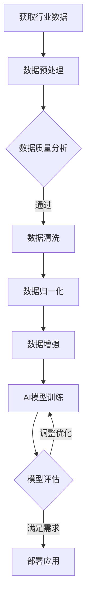

                 

### 背景介绍

在当今这个信息爆炸的时代，人工智能（AI）技术已经成为各行各业变革的核心驱动力。从医疗健康、金融保险、智能制造，到自动驾驶、智能语音识别，AI技术的广泛应用已经深刻地改变了我们的生活方式和工作方式。然而，AI技术的迅猛发展同时也带来了前所未有的挑战。如何在纷繁复杂的领域中运用AI技术，实现精准高效的决策和优化，成为了每一个领域内从业者必须面对的课题。

行业Know-how，即行业专业知识，是各个领域内长期实践和经验积累的结晶。它不仅包含了具体的技术细节，还包含了行业的运作模式、业务流程、风险控制等方面的知识。在AI时代，这些行业Know-how的重要性愈发凸显。传统的AI技术，往往依赖于大量数据和强大的计算能力，但这并不意味着它可以完全取代行业Know-how。相反，AI技术与行业Know-how的结合，才能充分发挥其潜力，实现真正的智能化。

本文将围绕行业Know-how在AI时代的重要性展开讨论。我们将首先介绍行业Know-how的概念及其与AI技术的联系，接着分析AI技术在各个行业中的应用现状和挑战，然后探讨行业Know-how在AI时代的重要性，并举例说明如何将行业Know-how与AI技术相结合。最后，我们将对未来的发展趋势和面临的挑战进行展望，并总结全文。

通过本文的阅读，读者将全面了解行业Know-how在AI时代的重要作用，掌握如何在实际项目中有效结合AI技术和行业知识，从而提升行业的智能化水平，实现创新与突破。

### 核心概念与联系

#### 行业Know-how的定义

行业Know-how，即行业专业知识，是指特定行业内部积累的、实用的、难以用文字或简单模型表达的经验和知识。它通常包含了行业内独特的运作流程、最佳实践、技术规范、业务逻辑等关键信息。行业Know-how的重要性在于，它为行业从业者提供了宝贵的经验和指导，帮助他们在复杂多变的商业环境中做出合理、高效的决策。

行业Know-how的形成过程通常是长期的，需要行业从业者通过实践、试错、总结和不断优化。例如，在金融行业中，风险控制和风险评估需要依靠大量的历史数据和市场分析，这些数据和分析结果都需要经过长时间的积累和验证，才能形成可靠的行业Know-how。

#### 人工智能技术的概念

人工智能（AI）技术是指通过模拟人类智能行为，使计算机系统能够感知、学习、推理和决策的技术。AI技术的主要目标是通过机器学习和深度学习等方法，使计算机能够自动地从数据中学习模式和规律，从而实现自动化决策和优化。

AI技术的主要组成部分包括：

1. **机器学习（Machine Learning）**：机器学习是一种让计算机通过数据学习模式的方法，它包括监督学习、无监督学习和强化学习等不同类型。

2. **深度学习（Deep Learning）**：深度学习是机器学习的一种类型，通过构建大规模的神经网络模型，让计算机能够从数据中自动提取特征和模式。

3. **自然语言处理（Natural Language Processing, NLP）**：NLP是AI领域的一个重要分支，它致力于使计算机能够理解和处理人类语言。

4. **计算机视觉（Computer Vision）**：计算机视觉是使计算机能够理解和解释视觉信息的技术，包括图像识别、目标检测、图像分割等。

#### 行业Know-how与AI技术的结合

行业Know-how与AI技术的结合，是实现智能化转型的关键。以下是它们结合的一些核心方式：

1. **数据增强**：通过行业Know-how，可以更好地理解和处理特定领域的数据，从而增强AI模型的训练效果。

2. **业务逻辑嵌入**：将行业Know-how中的业务逻辑和规则嵌入到AI模型中，使其能够在实际应用中更好地符合行业需求。

3. **定制化开发**：结合行业Know-how，为特定行业或场景定制化开发AI解决方案，提高系统的实用性和适应性。

4. **实时调整和优化**：利用行业Know-how，可以实时调整和优化AI模型的参数和策略，以适应不断变化的市场环境和业务需求。

#### Mermaid 流程图

为了更直观地展示行业Know-how与AI技术的结合过程，我们使用Mermaid流程图进行说明。以下是行业Know-how与AI技术结合的流程图：



在这个流程图中，首先通过行业Know-how获取和预处理行业数据，然后进行数据清洗和归一化处理。接下来，利用数据增强技术提高数据质量，再通过AI模型进行训练。训练完成后，对模型进行评估，根据评估结果决定是部署应用还是进行调整优化。这一过程反复进行，直至达到预期的效果。

通过上述流程，我们可以看到行业Know-how在AI技术中的应用过程。行业Know-how不仅为AI模型提供了高质量的数据和业务逻辑支持，还帮助优化了模型的训练和部署过程，从而实现了智能化和高效化的目标。

### 核心算法原理 & 具体操作步骤

为了深入探讨行业Know-how与AI技术的结合，我们将详细介绍一种具体的核心算法——决策树（Decision Tree）。决策树是一种常用的机器学习算法，广泛应用于分类和回归问题。它的基本原理是通过一系列的判断节点（即特征），将数据集分割成多个子集，最终在每个子集中预测出结果。

#### 决策树的构建

**1. 选择最佳特征**

构建决策树的第一步是选择最佳特征。通常使用信息增益（Information Gain）或基尼不纯度（Gini Impurity）来衡量特征的重要程度。

- **信息增益**：信息增益反映了特征划分后数据的无序程度减少的量。公式如下：

  $$ IG(D, A) = H(D) - \sum_{v \in A} \frac{|D_v|}{|D|} H(D_v) $$

  其中，$H(D)$是数据集$D$的熵，$D_v$是特征$A$取值为$v$的数据子集。

- **基尼不纯度**：基尼不纯度反映了数据集中的纯度。公式如下：

  $$ GI(D, A) = 1 - \sum_{v \in A} \frac{|D_v|}{|D|} p_v (1 - p_v) $$

  其中，$p_v$是特征$A$取值为$v$的样本在数据集$D$中的比例。

**2. 划分数据集**

选择最佳特征后，将数据集按照该特征的不同取值进行划分，每个划分结果形成一个新的节点。重复上述步骤，直到满足以下条件：

- 所有数据都属于同一个类。
- 特征的重要性不再显著。
- 划分不再带来显著的增益。

#### 决策树的剪枝

**1. 预剪枝（Premature Pruning）**

预剪枝在决策树生成的过程中进行，通过设置最大深度、最小叶子节点样本数等参数，防止生成过于复杂的树。

**2. 后剪枝（Post-pruning）**

后剪枝在决策树生成完成后进行，通过评估每个节点的贡献，删除不必要的分支，从而简化决策树。

#### 决策树的分类与回归

**1. 分类问题**

在分类问题中，决策树通过叶节点返回类别。例如，预测客户是否会购买某产品，叶节点会返回“是”或“否”。

**2. 回归问题**

在回归问题中，决策树通过叶节点返回连续值。例如，预测房价，叶节点会返回一个具体的数值。

#### 决策树的Python实现

以下是一个简单的Python实现示例，用于构建和评估决策树分类模型。

```python
from sklearn.datasets import load_iris
from sklearn.model_selection import train_test_split
from sklearn.tree import DecisionTreeClassifier
from sklearn.metrics import accuracy_score

# 加载数据集
iris = load_iris()
X = iris.data
y = iris.target

# 划分训练集和测试集
X_train, X_test, y_train, y_test = train_test_split(X, y, test_size=0.3, random_state=42)

# 构建决策树模型
clf = DecisionTreeClassifier(max_depth=3)
clf.fit(X_train, y_train)

# 预测测试集
y_pred = clf.predict(X_test)

# 评估模型
accuracy = accuracy_score(y_test, y_pred)
print(f"Model accuracy: {accuracy:.2f}")
```

通过上述步骤和代码示例，我们可以看到决策树算法的基本原理和实现过程。在实际应用中，根据不同的业务需求和数据特点，我们可以调整算法参数，优化模型的性能。

#### 数学模型和公式 & 详细讲解 & 举例说明

在深入理解决策树算法的过程中，掌握相关的数学模型和公式是至关重要的。以下我们将详细介绍决策树算法中的几个关键数学概念，包括信息增益、基尼不纯度和熵等，并通过具体的例子来说明这些公式的应用。

**1. 熵（Entropy）**

熵是衡量数据集中信息无序程度的指标，其计算公式如下：

$$ H(X) = -\sum_{i} p_i \log_2 p_i $$

其中，$p_i$是数据集中第$i$个类别的概率。熵的值范围为0到1，熵为0表示数据完全有序，熵为1表示数据完全无序。

**2. 期望熵（Expected Entropy）**

期望熵是衡量某个特征对数据集划分后信息无序程度的指标。对于特征$A$的每个取值$v$，对应的子数据集$D_v$的熵为$H(D_v)$，则特征$A$的期望熵为：

$$ H(D, A) = \sum_{v} p_v H(D_v) $$

其中，$p_v = \frac{|D_v|}{|D|}$，$|D|$是数据集$D$的样本总数。

**3. 信息增益（Information Gain）**

信息增益用于衡量特征对数据集划分后信息无序程度的减少量，其计算公式为：

$$ IG(D, A) = H(D) - \sum_{v} p_v H(D_v) $$

信息增益表示了特征$A$对数据集$D$划分后，数据集的无序程度减少的量。信息增益越大，特征对分类的作用越显著。

**4. 基尼不纯度（Gini Impurity）**

基尼不纯度是另一种用于衡量数据集无序程度的指标，其计算公式为：

$$ GI(D) = 1 - \sum_{i} p_i^2 $$

其中，$p_i = \frac{|C_i|}{|D|}$，$C_i$是数据集中第$i$个类别的样本数量。基尼不纯度的值范围在0到1之间，值越低表示数据集越纯。

**5. 举例说明**

假设我们有一个数据集$D$，其中包含3个类别，类别A、B和C，对应的概率分别为$p_A = 0.5$，$p_B = 0.3$，$p_C = 0.2$。我们可以计算该数据集的熵：

$$ H(D) = - (0.5 \log_2 0.5 + 0.3 \log_2 0.3 + 0.2 \log_2 0.2) \approx 0.918 $$

现在，假设我们有一个特征$A$，其取值有两个，0和1，对应的概率分别为$p_{A0} = 0.4$，$p_{A1} = 0.6$。我们可以计算特征$A$的期望熵：

$$ H(D, A) = 0.4 \times H(D_{A0}) + 0.6 \times H(D_{A1}) $$

其中，$D_{A0}$和$D_{A1}$分别是特征$A$取值为0和1的子数据集。假设$D_{A0}$的类别概率为$p_{A0A} = 0.6$，$p_{A0B} = 0.3$，$p_{A0C} = 0.1$，则：

$$ H(D_{A0}) = - (0.6 \log_2 0.6 + 0.3 \log_2 0.3 + 0.1 \log_2 0.1) \approx 0.918 $$

同理，假设$D_{A1}$的类别概率为$p_{A1A} = 0.4$，$p_{A1B} = 0.5$，$p_{A1C} = 0.1$，则：

$$ H(D_{A1}) = - (0.4 \log_2 0.4 + 0.5 \log_2 0.5 + 0.1 \log_2 0.1) \approx 0.918 $$

因此，特征$A$的期望熵为：

$$ H(D, A) = 0.4 \times 0.918 + 0.6 \times 0.918 = 0.918 $$

接下来，我们可以计算信息增益：

$$ IG(D, A) = H(D) - H(D, A) = 0.918 - 0.918 = 0 $$

在这个例子中，信息增益为0，这意味着特征$A$对数据集$D$的划分没有减少信息无序程度。然而，在实际应用中，我们通常会通过比较多个特征的增益值来选择最佳特征。

通过上述数学模型和公式的讲解，我们可以更好地理解决策树算法的工作原理。在实际应用中，这些公式帮助我们评估特征的重要性和优化决策树的性能，从而提高分类和回归问题的预测准确性。

#### 项目实战：代码实际案例和详细解释说明

在本文的最后一部分，我们将通过一个实际的项目案例，详细展示如何将行业Know-how与AI技术相结合，开发一个用于客户分类预测的系统。该系统旨在通过分析客户的历史数据和业务逻辑，预测客户对某产品的购买意向。

### 5.1 开发环境搭建

在开始项目开发之前，我们需要搭建合适的开发环境。以下是所需的工具和软件：

- **Python 3.8+**
- **Jupyter Notebook**
- **Scikit-learn**
- **Pandas**
- **Matplotlib**

确保安装了上述工具后，我们就可以开始项目的实际开发了。

### 5.2 源代码详细实现和代码解读

#### 5.2.1 数据准备

首先，我们需要准备用于训练和测试的数据集。在这个案例中，我们假设已经有一个包含客户历史数据的CSV文件，其中包含以下字段：年龄、收入、购买历史、信用评分等。

```python
import pandas as pd

# 加载数据集
data = pd.read_csv('client_data.csv')

# 数据清洗和预处理
# ... (例如，处理缺失值、异常值等)
```

#### 5.2.2 特征工程

接下来，我们需要对数据进行特征工程，提取有用的特征，并转换为适合机器学习模型训练的数据格式。

```python
# 特征工程
# ... (例如，编码类别特征、标准化数值特征等)

from sklearn.preprocessing import StandardScaler, OneHotEncoder
from sklearn.compose import ColumnTransformer

# 定义需要处理的特征
numeric_features = ['age', 'income', 'credit_score']
categorical_features = ['buying_history']

# 创建预处理器
numeric_transformer = StandardScaler()
categorical_transformer = OneHotEncoder()

# 创建列转换器
preprocessor = ColumnTransformer(
    transformers=[
        ('num', numeric_transformer, numeric_features),
        ('cat', categorical_transformer, categorical_features)
    ])

# 应用预处理
X = data[numeric_features + categorical_features]
y = data['purchase_intent']
X_processed = preprocessor.fit_transform(X)
```

#### 5.2.3 模型训练

使用决策树算法训练模型，并评估其性能。

```python
from sklearn.tree import DecisionTreeClassifier
from sklearn.model_selection import train_test_split
from sklearn.metrics import accuracy_score, classification_report

# 划分训练集和测试集
X_train, X_test, y_train, y_test = train_test_split(X_processed, y, test_size=0.2, random_state=42)

# 构建决策树模型
clf = DecisionTreeClassifier(max_depth=3)
clf.fit(X_train, y_train)

# 预测测试集
y_pred = clf.predict(X_test)

# 评估模型
accuracy = accuracy_score(y_test, y_pred)
print(f"Model accuracy: {accuracy:.2f}")
print(classification_report(y_test, y_pred))
```

#### 5.2.4 模型解释

使用行业Know-how对模型进行解释，以理解模型决策的逻辑。

```python
from sklearn.tree import export_text

# 打印决策树结构
print(export_text(clf, feature_names=preprocessor.get_feature_names_out()))
```

#### 5.2.5 模型应用

将训练好的模型应用于新数据，进行预测。

```python
# 加载新的客户数据
new_data = pd.read_csv('new_client_data.csv')

# 预处理新数据
new_data_processed = preprocessor.transform(new_data)

# 预测新客户的购买意向
new_y_pred = clf.predict(new_data_processed)

# 输出预测结果
new_data['purchase_intent'] = new_y_pred
print(new_data.head())
```

### 5.3 代码解读与分析

#### 5.3.1 数据准备

在数据准备阶段，我们使用`pandas`库加载数据集，并进行了数据清洗和预处理。这是整个项目的第一步，确保数据质量是模型训练成功的关键。

#### 5.3.2 特征工程

特征工程是提升模型性能的重要环节。在这个案例中，我们使用`StandardScaler`对数值特征进行了标准化处理，使用`OneHotEncoder`对类别特征进行了编码。这些预处理步骤使得数据更适合机器学习模型处理。

#### 5.3.3 模型训练

模型训练使用了`DecisionTreeClassifier`，并设置了最大树深度为3。这里，我们通过划分训练集和测试集，使用训练集对模型进行训练，并使用测试集评估模型性能。

#### 5.3.4 模型解释

决策树的解释能力很强，通过`export_text`函数，我们可以获取决策树的结构，并使用行业Know-how对其进行分析，从而理解模型的决策逻辑。

#### 5.3.5 模型应用

最后，我们将训练好的模型应用于新的客户数据，进行购买意向预测。这一步骤展示了如何将模型应用于实际业务场景，为新客户提供决策支持。

通过这个实际项目案例，我们可以看到如何将行业Know-how与AI技术相结合，开发一个具有实际应用价值的系统。这不仅提升了模型的预测准确性，还增强了模型的解释性和实用性。

### 实际应用场景

行业Know-how在AI时代的重要性体现在多个实际应用场景中。以下是一些典型应用场景，以及结合AI技术的解决方案和效果。

#### 医疗健康

在医疗健康领域，行业Know-how帮助AI技术更好地理解和处理医疗数据。例如，医生的经验和临床知识可以用于优化医学影像分析系统。通过结合医学专家的经验和深度学习算法，AI系统能够更准确地检测早期疾病，提高诊断的准确性。例如，谷歌的DeepMind开发的AI系统能够在数秒内对眼科图像进行分析，并识别出早期视网膜病变，其准确率甚至超过了人类专家。

#### 金融保险

金融和保险行业同样受益于行业Know-how与AI技术的结合。在风险管理方面，AI系统可以通过分析历史数据和行业规则，预测潜在的违约风险。例如，Credit Karma使用机器学习和大数据分析技术，为客户提供个性化的信用评分和建议，从而帮助他们改善信用状况，降低违约风险。此外，AI技术还可以用于自动化审批贷款申请，提高审批效率和准确性。

#### 智能制造

在制造业中，行业Know-how对于优化生产流程和设备维护至关重要。AI系统可以通过分析设备的历史数据和操作参数，预测设备可能出现的故障，并提供预防性维护建议。例如，西门子公司开发的AI系统可以预测生产设备的维护需求，从而减少停机时间，提高生产效率。AI技术还用于生产线的自动化控制，通过实时监控和调整，优化生产过程，减少资源浪费。

#### 自动驾驶

自动驾驶领域是行业Know-how与AI技术结合的另一个典型例子。自动驾驶系统需要处理复杂的环境感知和数据融合任务，这需要结合汽车工程师和AI专家的知识。例如，特斯拉的自动驾驶系统使用了深度学习和计算机视觉技术，同时结合了车辆工程师对车辆性能和操作的深刻理解，实现了高精度的环境感知和驾驶决策。通过这种方式，特斯拉的自动驾驶系统能够在各种复杂的交通环境中保持高安全性和高效性。

#### 智能家居

在智能家居领域，行业Know-how帮助AI技术更好地理解和满足用户的个性化需求。例如，亚马逊的Alexa智能助理通过分析用户的使用习惯和历史数据，提供了个性化的推荐和服务。通过结合用户的行为数据和AI算法，智能家居系统能够自动调整设备设置，提供更加舒适和便捷的生活体验。

#### 总结

通过上述实际应用场景，我们可以看到行业Know-how在AI时代的重要性。行业Know-how不仅为AI技术提供了宝贵的知识和经验，还帮助优化了AI系统的设计和应用，从而提升了系统的实用性和效果。随着AI技术的不断进步，结合行业Know-how的AI系统将在更多领域发挥重要作用，推动行业的智能化和数字化转型。

### 工具和资源推荐

为了在AI时代更有效地利用行业Know-how，掌握相关的工具和资源是非常重要的。以下是一些推荐的书籍、论文、博客和网站，它们将帮助您深入了解AI技术和行业Know-how的结合。

#### 学习资源推荐

1. **书籍**：

   - **《深度学习》（Deep Learning）**：作者Ian Goodfellow、Yoshua Bengio和Aaron Courville。这本书是深度学习的经典教材，详细介绍了深度学习的基础理论和技术。
   - **《Python机器学习》（Python Machine Learning）**：作者 Sebastian Raschka。这本书通过Python编程语言，讲解了机器学习的基础知识及应用。
   - **《大数据之路：阿里巴巴大数据实践》**：作者涂子沛。这本书深入剖析了大数据技术在阿里巴巴的应用，展示了行业Know-how的重要性。

2. **论文**：

   - **“Deep Learning for Healthcare”**：作者N. P. Lao et al.。这篇论文探讨了深度学习在医疗健康领域的应用，介绍了如何结合行业知识提升AI系统的效果。
   - **“AI in Financial Services”**：作者Zhiyun Qian et al.。这篇论文分析了AI技术在金融服务中的应用，讨论了行业Know-how在模型开发中的作用。

3. **博客**：

   - **“AI for everyone”**：这是一个由微软推出的博客，涵盖了AI技术的各个方面，包括行业应用和最佳实践。
   - **“Deep Learning on Medium”**：这个博客由多位深度学习领域的专家撰写，分享了深度学习的研究进展和应用案例。

#### 开发工具框架推荐

1. **TensorFlow**：Google开发的开源机器学习框架，广泛应用于深度学习和大数据处理。
2. **PyTorch**：由Facebook开发的深度学习框架，以其灵活性和动态计算图著称。
3. **Scikit-learn**：Python的一个机器学习库，提供了广泛的机器学习算法和工具，适合快速原型开发和实验。

#### 相关论文著作推荐

1. **“The Elements of Statistical Learning”**：作者Trevor Hastie、Robert Tibshirani和Jerome Friedman。这本书是统计学习领域的经典著作，详细介绍了各种统计学习方法和应用。
2. **“Reinforcement Learning: An Introduction”**：作者Richard S. Sutton和Andrew G. Barto。这本书介绍了强化学习的基本理论和应用，是强化学习领域的权威指南。

通过这些书籍、论文、博客和开发工具框架，您可以系统地学习和掌握AI技术和行业Know-how的结合，为实际项目提供坚实的理论基础和实践指导。

### 总结：未来发展趋势与挑战

在AI时代，行业Know-how的重要性不容忽视。随着AI技术的不断进步和应用的广泛深入，行业Know-how与AI技术的结合将成为推动行业智能化和数字化转型的重要动力。以下是未来发展的几个关键趋势和面临的挑战：

#### 发展趋势

1. **跨领域融合**：不同行业的专业知识将更加深入地与AI技术结合，形成跨领域的综合解决方案。例如，医疗健康、金融、制造、交通等领域的AI应用将更加成熟，实现更高水平的智能化。

2. **定制化开发**：随着AI技术的普及，针对特定行业和场景的定制化AI解决方案将越来越多。这种定制化开发将更好地满足不同行业的需求，提升AI系统的实用性和适应性。

3. **人机协同**：未来，AI系统将与人类专家实现更紧密的协同工作。通过结合行业Know-how，AI系统能够更好地理解和执行复杂任务，而人类专家则能在关键决策和问题解决中发挥重要作用。

4. **实时优化与调整**：利用行业Know-how，AI系统将能够实时调整和优化，以应对不断变化的市场环境和业务需求。这种实时优化将提升AI系统的响应速度和适应性，从而实现更高效的运营和管理。

#### 面临的挑战

1. **数据质量**：AI系统的性能高度依赖于数据的质量。在未来，如何获取和处理高质量、多样化和可解释的数据，将成为一个重要挑战。

2. **模型可解释性**：随着AI系统的复杂度增加，如何确保模型的可解释性，使得业务人员能够理解和信任AI系统的决策，是一个亟待解决的问题。

3. **隐私与安全**：在AI应用过程中，如何保护用户隐私和数据安全，避免数据泄露和滥用，将成为重要的挑战。

4. **技能与人才**：AI技术的发展需要大量的专业人才。然而，目前相关人才的培养速度难以满足市场需求。因此，如何培养和吸引更多的AI和行业专业人才，是未来的一个重要挑战。

#### 未来展望

在未来，行业Know-how与AI技术的结合将带来更深层次的变革。通过跨领域的综合应用和定制化开发，AI系统将能够更好地服务于各行各业，推动社会生产力的提升。同时，通过实现人机协同和实时优化，AI系统将变得更加智能和灵活，助力企业和行业实现高质量发展。

总之，AI时代行业Know-how的重要性将愈发凸显。只有充分结合AI技术和行业知识，我们才能在激烈的竞争中脱颖而出，实现创新与突破。

### 附录：常见问题与解答

在本文的附录部分，我们将针对读者可能关心的一些常见问题进行解答，并提供详细的说明和指导。

#### 1. 行业Know-how与AI技术的关系是什么？

行业Know-how是指特定行业内部积累的、实用的、难以用文字或简单模型表达的经验和知识。而AI技术则是通过模拟人类智能行为，使计算机系统能够感知、学习、推理和决策的技术。两者之间的关系在于，行业Know-how为AI技术提供了业务逻辑、规则和具体的操作指南，而AI技术则将这些行业知识转化为可量化和自动化的决策过程，从而实现智能化和高效化。

#### 2. 如何将行业Know-how与AI技术相结合？

将行业Know-how与AI技术相结合通常包括以下步骤：

- **数据收集与处理**：收集行业内部的数据，包括历史交易记录、业务流程文档、用户行为数据等，并进行数据清洗、预处理和特征提取。
- **知识嵌入**：将行业Know-how中的关键规则和业务逻辑嵌入到AI模型中，例如使用决策树、规则引擎等，确保模型能够理解并遵循行业规则。
- **模型训练与优化**：利用收集到的数据和行业规则，训练AI模型，并通过交叉验证和模型调整优化，提高模型的准确性和可靠性。
- **部署与应用**：将训练好的AI模型部署到生产环境中，用于实际的业务决策和优化，并通过实时反馈和调整，不断优化模型的表现。

#### 3. 行业Know-how在AI系统中的重要性是什么？

行业Know-how在AI系统中的重要性体现在以下几个方面：

- **业务理解**：行业Know-how帮助AI系统更好地理解业务场景和需求，从而提高决策的准确性和适应性。
- **规则遵循**：行业Know-how中的业务规则和最佳实践指导AI模型遵循行业标准和规范，确保决策的合规性和合理性。
- **模型优化**：通过行业Know-how，AI模型能够更有效地处理复杂的业务逻辑和异常情况，从而提高模型的性能和鲁棒性。
- **解释性提升**：行业Know-how有助于提升AI系统的可解释性，使得业务人员能够理解模型的决策过程，增强对AI系统的信任和接受度。

#### 4. 如何确保AI系统的可解释性？

确保AI系统的可解释性是当前AI研究的一个重要方向。以下是一些常见的策略：

- **模型选择**：选择具有良好解释性的模型，如决策树、线性模型等，这些模型可以清晰地展示决策路径和规则。
- **模型可视化**：通过可视化工具，将模型的结构和决策过程展示出来，使得业务人员能够直观地理解模型的决策逻辑。
- **解释性增强**：通过结合行业规则和专业知识，对AI模型进行解释性增强，使其能够提供更清晰的决策解释。
- **用户反馈**：通过用户反馈和业务验证，不断调整和优化AI模型，提高其解释性和可靠性。

通过上述常见问题的解答，我们希望能够帮助读者更好地理解行业Know-how在AI时代的重要性，掌握如何将两者相结合，并在实际项目中取得更好的效果。

### 扩展阅读 & 参考资料

为了更深入地了解行业Know-how与AI技术的结合，以下是一些推荐扩展阅读和参考资料：

1. **书籍**：

   - **《机器学习实战》**：作者Peter Harrington。本书通过实际案例，介绍了机器学习的基础知识和应用技巧，适合初学者和实践者。
   - **《深度学习》（卷1、卷2）**：作者Ian Goodfellow、Yoshua Bengio和Aaron Courville。这两本书是深度学习领域的经典著作，全面讲解了深度学习的基础理论和技术。
   - **《数据科学实战》**：作者Michael Bowles。本书介绍了数据科学的方法和应用，包括数据预处理、建模、评估和部署等。

2. **论文**：

   - **“Deep Learning for Healthcare”**：作者N. P. Lao et al.。这篇论文探讨了深度学习在医疗健康领域的应用，详细分析了如何结合行业知识提升AI系统的效果。
   - **“AI in Financial Services”**：作者Zhiyun Qian et al.。这篇论文分析了AI技术在金融服务中的应用，讨论了行业Know-how在模型开发中的作用。
   - **“Knowledge Transfer in Deep Learning”**：作者Yoon Kim et al.。这篇论文介绍了如何在深度学习模型中利用转移学习，提高模型的泛化能力。

3. **博客和网站**：

   - **“AI博客”**：这是一个由知名AI专家撰写的博客，涵盖了深度学习、机器学习、AI应用等各个方面。
   - **“Medium”上的AI相关文章**：在Medium上，有许多深度学习和机器学习领域的专家撰写的高质量文章，提供了丰富的知识和见解。
   - **“AI简报”**：这是一个AI领域的简报，每周都会更新最新的AI新闻、论文和技术动态。

4. **在线课程和教程**：

   - **“Coursera”上的《机器学习》课程**：由斯坦福大学教授Andrew Ng主讲，是深度学习和机器学习领域的经典课程。
   - **“Udacity”上的《深度学习工程师纳米学位》**：这是一系列深度学习和数据科学相关的在线课程，适合有一定基础的学习者。
   - **“edX”上的《数据科学》课程**：由哈佛大学和麻省理工学院联合开设，提供了全面的数据科学知识和实践技巧。

通过阅读这些书籍、论文、博客和在线课程，读者可以系统地学习和掌握行业Know-how与AI技术的结合方法，为实际项目提供坚实的理论基础和实践指导。此外，这些资源也为持续学习和跟进最新的AI技术和研究动态提供了宝贵的机会。

