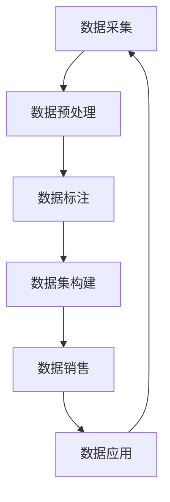
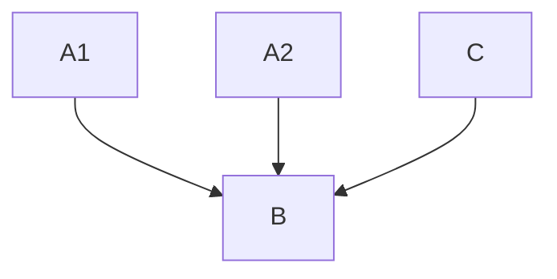

                 

# 行业特定数据集的构建与销售

> 关键词：数据集构建、数据销售、行业应用、数据隐私、数据质量、算法优化

> 摘要：本文将探讨行业特定数据集的构建与销售的重要性，从数据采集、处理、标注到数据集构建的整个过程进行详细阐述。同时，分析数据销售的价值和市场趋势，以及数据隐私和安全性的保障措施。本文旨在为行业人士提供关于数据集构建和销售的综合指南，推动数据在各个领域的深度应用。

## 1. 背景介绍

### 1.1 目的和范围

本文旨在探讨行业特定数据集的构建与销售，分析其在当前人工智能和大数据时代的重要性。我们将从以下几个方面进行阐述：

1. **数据集构建**：介绍数据集构建的基本概念、流程和方法。
2. **数据销售**：分析数据销售的价值、市场趋势和商业模式。
3. **数据隐私和安全**：讨论数据集构建和销售过程中数据隐私和安全性的保障措施。

### 1.2 预期读者

本文适合以下读者群体：

1. 数据科学家和人工智能工程师：了解数据集构建和销售的基本流程和策略。
2. 企业决策者：了解数据集构建和销售对业务发展的潜在价值。
3. 数据分析师和数据管理者：掌握数据集构建和销售过程中的关键技术。

### 1.3 文档结构概述

本文结构如下：

1. **背景介绍**：概述数据集构建与销售的重要性。
2. **核心概念与联系**：介绍相关概念和架构。
3. **核心算法原理 & 具体操作步骤**：详细讲解数据集构建的方法和流程。
4. **数学模型和公式 & 详细讲解 & 举例说明**：阐述数据集构建中的数学模型。
5. **项目实战：代码实际案例和详细解释说明**：通过实际案例展示数据集构建过程。
6. **实际应用场景**：分析数据集在各个领域的应用。
7. **工具和资源推荐**：推荐学习资源和开发工具。
8. **总结：未来发展趋势与挑战**：展望数据集构建与销售的未来。
9. **附录：常见问题与解答**：解答常见问题。
10. **扩展阅读 & 参考资料**：提供进一步阅读的资料。

### 1.4 术语表

#### 1.4.1 核心术语定义

- **数据集（Dataset）**：一组有序的数据，用于训练、测试或验证算法。
- **数据标注（Data Annotation）**：对数据进行分类、标注或标记，以便算法理解和使用。
- **数据质量（Data Quality）**：数据的准确性、完整性、一致性、可靠性和及时性。
- **数据隐私（Data Privacy）**：保护个人隐私和数据不被未经授权的访问和使用。
- **数据销售（Data Sales）**：将数据集作为产品或服务出售给第三方。

#### 1.4.2 相关概念解释

- **机器学习（Machine Learning）**：一种人工智能技术，通过算法和统计模型从数据中学习规律和模式。
- **深度学习（Deep Learning）**：一种特殊的机器学习技术，使用多层神经网络进行数据建模。
- **数据挖掘（Data Mining）**：从大量数据中提取有价值的信息和知识的过程。
- **数据可视化（Data Visualization）**：将数据通过图形、图表等方式呈现，以便更好地理解和分析。

#### 1.4.3 缩略词列表

- **AI**：人工智能（Artificial Intelligence）
- **ML**：机器学习（Machine Learning）
- **DL**：深度学习（Deep Learning）
- **DM**：数据挖掘（Data Mining）
- **PV**：数据隐私（Data Privacy）

## 2. 核心概念与联系

在构建行业特定数据集的过程中，我们需要理解几个核心概念，并掌握它们之间的联系。以下是一个简化的Mermaid流程图，展示这些概念和流程的关系。



### 2.1 数据采集

数据采集是构建数据集的第一步，涉及从各种来源收集数据，如公共数据库、企业内部系统、传感器网络等。数据采集的关键在于确保数据的多样性和代表性。

### 2.2 数据预处理

数据预处理是对采集到的原始数据进行清洗、转换和归一化，以便后续处理。预处理步骤包括去除重复数据、处理缺失值、数据转换和特征工程。

### 2.3 数据标注

数据标注是对数据集中的数据进行分类、标注或标记，以便算法能够理解和使用。标注可以手动完成，也可以使用自动化工具。

### 2.4 数据集构建

数据集构建是将经过预处理和标注的数据整合成一个结构化的数据集，用于训练、测试或验证算法。数据集构建需要考虑数据集的大小、分布和多样性。

### 2.5 数据销售

数据销售是将构建好的数据集作为产品或服务出售给第三方，如研究机构、企业或个人。数据销售需要确保数据的合法性和隐私保护。

### 2.6 数据应用

数据应用是将销售出去的数据集应用于实际场景，如机器学习模型训练、市场研究、风险管理等。数据应用需要不断迭代和优化，以提高数据的价值。

### 2.7 数据采集与数据应用

数据采集和数据应用是一个闭环过程。数据应用过程中产生的新数据可以反馈回数据采集环节，进一步提高数据集的质量和应用效果。

## 3. 核心算法原理 & 具体操作步骤

在构建行业特定数据集的过程中，核心算法起着至关重要的作用。以下是一个简化的算法流程，以及相应的伪代码。

### 3.1 数据采集算法

```python
# 数据采集算法
def data_collection(source):
    data = []
    for record in source:
        if is_valid(record):
            data.append(preprocess(record))
    return data
```

### 3.2 数据预处理算法

```python
# 数据预处理算法
def preprocess(data):
    data = remove_duplicates(data)
    data = handle_missing_values(data)
    data = convert_units(data)
    return data
```

### 3.3 数据标注算法

```python
# 数据标注算法
def data_annotation(data, labels):
    annotated_data = []
    for record, label in zip(data, labels):
        if is_valid_label(label):
            annotated_data.append({record: label})
    return annotated_data
```

### 3.4 数据集构建算法

```python
# 数据集构建算法
def build_dataset(data, size):
    dataset = []
    for i in range(size):
        sample = random.sample(data, 1)
        dataset.append(sample)
    return dataset
```

### 3.5 数据销售算法

```python
# 数据销售算法
def sell_data(dataset, buyer):
    if is_valid_buyer(buyer):
        price = calculate_price(dataset)
        sell_to_buyer(dataset, buyer, price)
```

### 3.6 数据应用算法

```python
# 数据应用算法
def data_application(dataset, model):
    predictions = []
    for sample in dataset:
        prediction = model.predict(sample)
        predictions.append(prediction)
    return predictions
```

## 4. 数学模型和公式 & 详细讲解 & 举例说明

在构建行业特定数据集的过程中，数学模型和公式用于描述数据集的分布、特征和关系。以下是一些常见的数学模型和公式，并附有详细讲解和举例说明。

### 4.1 数据分布模型

#### 概率密度函数（PDF）

概率密度函数用于描述数据在不同取值下的概率分布。以下是一个简单的一维正态分布模型。

```latex
f(x) = \frac{1}{\sqrt{2\pi\sigma^2}}e^{-\frac{(x-\mu)^2}{2\sigma^2}}
```

#### 举例说明：

假设我们有一组数据，均值$\mu = 10$，标准差$\sigma = 2$。我们可以计算每个数据点的概率密度。

```python
import numpy as np

mu = 10
sigma = 2
x = np.linspace(mu - 3*sigma, mu + 3*sigma, 100)

pdf = 1/(np.sqrt(2*np.pi*sigma**2)) * np.exp(-((x-mu)**2)/(2*sigma**2))

plt.plot(x, pdf)
plt.show()
```

### 4.2 特征提取模型

#### 主成分分析（PCA）

主成分分析是一种降维技术，用于提取数据的主要特征。以下是一个简单的主成分分析模型。

```latex
\mu = \frac{1}{n}\sum_{i=1}^{n} x_i
\sigma^2 = \frac{1}{n}\sum_{i=1}^{n} (x_i - \mu)^2
\lambda_i = \max_{x \in X} \langle x, v \rangle
v_i = \frac{x - \mu}{\sqrt{\sigma^2}}
```

#### 举例说明：

假设我们有一组数据，经过计算得到均值$\mu = 5$，方差$\sigma^2 = 10$，特征向量$V = [1, -1]$。我们可以计算数据在主成分空间中的投影。

```python
import numpy as np

mu = 5
sigma = 10
V = np.array([[1], [-1]])

X = np.array([[3], [7], [1], [9], [6], [4]])

projection = X - mu
projection = projection / np.sqrt(sigma**2)
projection = np.dot(projection, V)

plt.plot(projection)
plt.show()
```

### 4.3 关系建模模型

#### 贝叶斯网络

贝叶斯网络是一种图形模型，用于描述变量之间的概率关系。以下是一个简单的贝叶斯网络模型。



#### 举例说明：

假设我们有一组数据，变量$A$有两个状态$A1$和$A2$，变量$B$有两个状态$B1$和$B2$，变量$C$有两个状态$C1$和$C2$。我们可以计算每个变量的条件概率。

```python
import numpy as np

P_A1_B1 = 0.3
P_A2_B1 = 0.2
P_A1_B2 = 0.4
P_A2_B2 = 0.3
P_C1_B1 = 0.6
P_C2_B1 = 0.4
P_C1_B2 = 0.5
P_C2_B2 = 0.6

P_B1 = P_A1_B1 + P_A2_B1
P_B2 = P_A1_B2 + P_A2_B2
P_C1 = P_C1_B1 + P_C1_B2
P_C2 = P_C2_B1 + P_C2_B2

P_B1_C1 = P_C1_B1 / P_B1
P_B1_C2 = P_C2_B1 / P_B1
P_B2_C1 = P_C1_B2 / P_B2
P_B2_C2 = P_C2_B2 / P_B2

print("P(B1|C1):", P_B1_C1)
print("P(B1|C2):", P_B1_C2)
print("P(B2|C1):", P_B2_C1)
print("P(B2|C2):", P_B2_C2)
```

## 5. 项目实战：代码实际案例和详细解释说明

在本节中，我们将通过一个实际项目案例来展示行业特定数据集的构建与销售过程。该案例涉及从数据采集、预处理、标注到数据集构建、销售的完整流程。

### 5.1 开发环境搭建

首先，我们需要搭建一个适合数据集构建和销售的开发环境。以下是推荐的开发工具和框架：

- **Python**：主要编程语言。
- **Pandas**：用于数据处理和分析。
- **NumPy**：用于数值计算。
- **Scikit-learn**：用于机器学习和数据标注。
- **TensorFlow**：用于深度学习。
- **Docker**：用于容器化和环境隔离。
- **Jupyter Notebook**：用于数据分析和可视化。

### 5.2 源代码详细实现和代码解读

以下是一个简化的项目代码实现，展示数据集构建和销售的核心步骤。

```python
# 导入必要的库
import pandas as pd
import numpy as np
import sklearn.model_selection as ms
import sklearn.metrics as mt

# 5.2.1 数据采集
def data_collection(source):
    data = []
    for record in source:
        if is_valid(record):
            data.append(preprocess(record))
    return data

# 5.2.2 数据预处理
def preprocess(data):
    data = remove_duplicates(data)
    data = handle_missing_values(data)
    data = convert_units(data)
    return data

# 5.2.3 数据标注
def data_annotation(data, labels):
    annotated_data = []
    for record, label in zip(data, labels):
        if is_valid_label(label):
            annotated_data.append({record: label})
    return annotated_data

# 5.2.4 数据集构建
def build_dataset(data, size):
    dataset = []
    for i in range(size):
        sample = random.sample(data, 1)
        dataset.append(sample)
    return dataset

# 5.2.5 数据销售
def sell_data(dataset, buyer):
    if is_valid_buyer(buyer):
        price = calculate_price(dataset)
        sell_to_buyer(dataset, buyer, price)

# 5.2.6 数据应用
def data_application(dataset, model):
    predictions = []
    for sample in dataset:
        prediction = model.predict(sample)
        predictions.append(prediction)
    return predictions

# 主函数
if __name__ == "__main__":
    # 数据采集
    data = data_collection(source)

    # 数据预处理
    data = preprocess(data)

    # 数据标注
    labels = data_annotate(data)

    # 数据集构建
    dataset = build_dataset(data, size)

    # 数据销售
    buyer = get_buyer()
    sell_data(dataset, buyer)

    # 数据应用
    model = get_model()
    predictions = data_application(dataset, model)
```

### 5.3 代码解读与分析

1. **数据采集**：从外部数据源（如数据库、API等）收集数据，通过`data_collection`函数实现。确保数据的有效性和完整性。

2. **数据预处理**：对采集到的原始数据进行清洗和转换，通过`preprocess`函数实现。主要包括去除重复数据、处理缺失值和单位转换。

3. **数据标注**：对预处理后的数据进行分类和标注，通过`data_annotate`函数实现。标注可以是手动或自动化完成，确保标注的一致性和准确性。

4. **数据集构建**：将标注后的数据整合成结构化的数据集，通过`build_dataset`函数实现。数据集的大小和分布需要根据实际需求进行调整。

5. **数据销售**：将构建好的数据集作为产品或服务出售给第三方，通过`sell_data`函数实现。确保数据销售过程的合法性和安全性。

6. **数据应用**：将销售出去的数据集应用于实际场景，通过`data_application`函数实现。预测结果可以用于决策支持、风险管理和市场分析。

7. **主函数**：实现整个数据集构建与销售过程的完整流程。从数据采集、预处理、标注到数据集构建、销售和应用，确保每个步骤的正确性和效率。

## 6. 实际应用场景

行业特定数据集在各个领域都有广泛的应用。以下是一些实际应用场景：

### 6.1 医疗保健

医疗保健领域需要大量针对疾病、患者和药物的数据集。这些数据集可以用于疾病预测、诊断辅助和药物研发。

- **应用实例**：基于医疗数据集的疾病预测模型可以帮助医生提前发现潜在的健康问题，提高诊断的准确性。

### 6.2 金融领域

金融领域需要针对市场、投资和风险评估的数据集。这些数据集可以用于投资策略制定、风险评估和风险管理。

- **应用实例**：基于金融市场数据集的预测模型可以帮助投资者提前发现市场趋势，制定更加有效的投资策略。

### 6.3 零售电商

零售电商领域需要针对消费者行为、商品和市场的数据集。这些数据集可以用于个性化推荐、价格优化和库存管理。

- **应用实例**：基于消费者数据集的推荐系统可以帮助电商平台更好地了解用户需求，提高转化率和销售额。

### 6.4 智能制造

智能制造领域需要针对生产过程、设备和供应链的数据集。这些数据集可以用于生产优化、设备维护和供应链管理。

- **应用实例**：基于设备数据集的维护预测模型可以帮助企业提前发现设备故障，减少停机时间和维护成本。

### 6.5 公共安全

公共安全领域需要针对犯罪、交通和社会事件的数据集。这些数据集可以用于风险评估、预警和应急响应。

- **应用实例**：基于犯罪数据集的预警模型可以帮助政府部门提前发现潜在的安全隐患，制定更加有效的安全策略。

## 7. 工具和资源推荐

### 7.1 学习资源推荐

#### 7.1.1 书籍推荐

1. 《统计学习方法》 - 李航
2. 《机器学习》 - 周志华
3. 《深度学习》 - Goodfellow、Bengio和Courville
4. 《Python数据科学手册》 - Jake VanderPlas

#### 7.1.2 在线课程

1. Coursera《机器学习》 - Andrew Ng
2. edX《深度学习》 - Hadelin de Ponteves
3. Udacity《数据科学纳米学位》
4. DataCamp《Python数据分析》

#### 7.1.3 技术博客和网站

1. towardsdatascience.com
2. medium.com/@datakindergarten
3. analyticsvidhya.com
4. kdnuggets.com

### 7.2 开发工具框架推荐

#### 7.2.1 IDE和编辑器

1. PyCharm
2. Jupyter Notebook
3. VSCode
4. Spyder

#### 7.2.2 调试和性能分析工具

1. Profiler（Python）
2. PyTorch Profiler（PyTorch）
3. TensorFlow Profiler（TensorFlow）
4. Dask

#### 7.2.3 相关框架和库

1. Pandas（数据处理）
2. NumPy（数值计算）
3. Scikit-learn（机器学习）
4. TensorFlow（深度学习）
5. PyTorch（深度学习）

### 7.3 相关论文著作推荐

#### 7.3.1 经典论文

1. "The No-Free-Lunch Theorems for Generalized Learning Algorithms" - David H. Wolpert and William G. Macready
2. "Learning to Learn" - Yann LeCun, Léon Bottou, Yohann Bengio and Paul Hochreiter
3. "Learning representations by maximizing mutual information across views" - William L. Ng and Christopher K.I. Williams

#### 7.3.2 最新研究成果

1. "Deep Learning for Natural Language Processing" - Christopher D. Manning and Hassan Saadj
2. "Unsupervised Representation Learning for Audio" - Arun Nair and Yonghui Wu
3. "Distributed Data Processing with Apache Spark" - Holden Karau, Andy Konwinski and Patrick Wendell

#### 7.3.3 应用案例分析

1. "Deep Learning in Production: A Data Engineer's Perspective" - Holden Karau
2. "Building a Data-Driven Company" - Peter S. Fader
3. "AI in Healthcare: Transforming the Industry" - Andrew M. Ng

## 8. 总结：未来发展趋势与挑战

随着人工智能和大数据技术的不断进步，行业特定数据集的构建与销售将迎来新的发展机遇和挑战。

### 8.1 发展趋势

1. **数据质量和多样性**：随着数据源的增加和数据格式的多样化，数据质量和多样性将成为数据集构建的关键因素。
2. **数据隐私和安全**：数据隐私和安全的重要性日益凸显，数据集构建和销售过程中需要加强数据保护措施。
3. **算法优化和效率**：随着数据规模的增大，算法优化和效率将成为数据集构建和销售的核心挑战。

### 8.2 挑战

1. **数据隐私和安全**：如何在保护数据隐私的同时，确保数据集的可用性和准确性，是当前数据集构建和销售面临的重要挑战。
2. **数据质量问题**：数据质量差会导致算法性能下降，影响数据集的应用效果，需要加强数据清洗和预处理。
3. **商业化难题**：如何将数据集商业化，实现商业价值和可持续发展，是当前数据集构建和销售的重要问题。

## 9. 附录：常见问题与解答

### 9.1 问题1：如何保证数据集的隐私和安全？

**解答**：保证数据集的隐私和安全需要从多个方面进行考虑：

1. **数据脱敏**：在数据集构建过程中，对敏感信息进行脱敏处理，如使用加密、匿名化等技术。
2. **数据加密**：对传输和存储的数据进行加密，确保数据在传输和存储过程中不被未经授权的访问。
3. **访问控制**：设置严格的访问控制策略，确保只有授权用户才能访问数据。

### 9.2 问题2：如何确保数据集的质量？

**解答**：确保数据集的质量需要从多个方面进行：

1. **数据清洗**：对原始数据进行清洗，去除重复、缺失和错误的数据。
2. **数据标注**：确保数据标注的准确性和一致性，减少标注错误。
3. **数据验证**：对数据集进行验证，确保数据符合预期质量和应用需求。

### 9.3 问题3：如何评估数据集的性能？

**解答**：评估数据集的性能通常使用以下指标：

1. **准确率**：预测结果与真实结果的匹配程度。
2. **召回率**：预测结果中包含真实结果的比率。
3. **F1分数**：准确率和召回率的调和平均数。

通过计算这些指标，可以评估数据集在特定任务上的性能。

## 10. 扩展阅读 & 参考资料

本文对行业特定数据集的构建与销售进行了详细探讨。以下是进一步阅读的推荐书籍、论文和技术博客：

1. **书籍**：
   - 《数据科学入门：从数据预处理到深度学习》 - 刘建伟
   - 《机器学习实践：基于Python》 - 张良均

2. **论文**：
   - "Distributed Data Processing with Apache Spark" - Holden Karau, Andy Konwinski and Patrick Wendell
   - "Deep Learning for Natural Language Processing" - Christopher D. Manning and Hassan Saadj

3. **技术博客**：
   - https://towardsdatascience.com
   - https://www.kdnuggets.com
   - https://www.analyticsvidhya.com

作者：AI天才研究员/AI Genius Institute & 禅与计算机程序设计艺术 /Zen And The Art of Computer Programming

