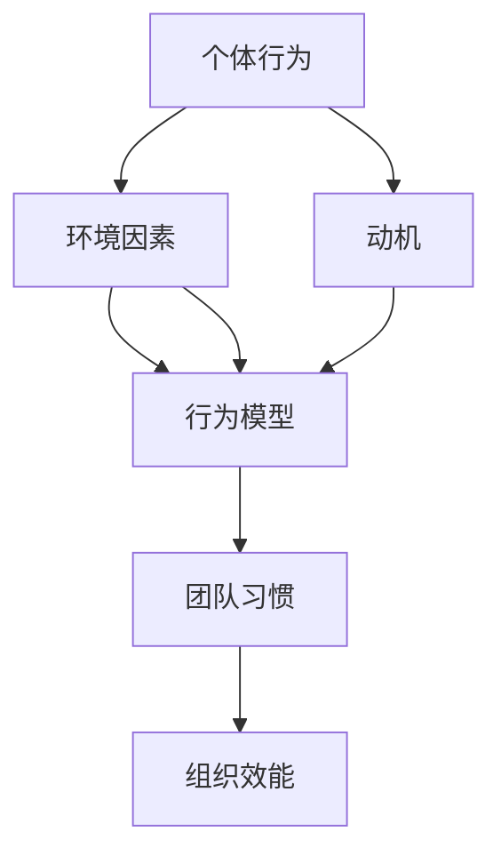

                 

# 行为模型：管理者塑造团队习惯的工具

> **关键词**：行为模型、团队习惯、管理者、效能优化、领导力
> 
> **摘要**：本文将探讨行为模型在企业管理中的重要性，以及管理者如何利用行为模型来塑造团队的优良习惯，从而提高整体效能。文章将围绕行为模型的核心概念、构建方法、实施步骤和应用案例进行深入分析，为管理者提供实用的工具和策略。

## 1. 背景介绍

### 1.1 目的和范围

本文旨在为企业管理者提供一种基于行为科学的理论框架——行为模型，用以指导和优化团队工作习惯，提升组织效能。通过本文的学习，管理者可以了解如何构建和实施行为模型，以及在实际工作中如何利用行为模型进行有效管理。

### 1.2 预期读者

本文适合企业管理者、团队领导、人力资源管理者以及任何对团队建设和管理有兴趣的专业人士阅读。特别适合那些希望在团队效能提升方面寻求系统化解决方案的管理者。

### 1.3 文档结构概述

本文将分为十个部分，包括背景介绍、核心概念与联系、核心算法原理与操作步骤、数学模型与公式、项目实战、实际应用场景、工具和资源推荐、总结与未来发展趋势、常见问题解答和扩展阅读。每个部分都将提供详细的分析和实用的指导。

### 1.4 术语表

#### 1.4.1 核心术语定义

- **行为模型**：用于描述个体或群体行为特征及其影响因素的抽象模型。
- **团队习惯**：团队成员在长期工作中形成的稳定行为模式。
- **效能优化**：通过改进方法和工具，提高团队的工作效率和成果。

#### 1.4.2 相关概念解释

- **行为科学**：研究人类行为及其影响因素的学科。
- **管理**：通过计划、组织、领导、控制等活动，实现组织目标的系统过程。

#### 1.4.3 缩略词列表

- **IDE**：集成开发环境（Integrated Development Environment）
- **HR**：人力资源（Human Resources）

## 2. 核心概念与联系

在探讨行为模型在团队管理中的应用之前，我们需要理解行为模型的核心概念和它们之间的关系。以下是行为模型的关键组成部分及其相互关系：



### 2.1 个体行为

个体行为是指团队成员在特定情境下表现出的具体行为。个体行为受多种因素影响，包括个人的动机、技能和价值观。

### 2.2 环境因素

环境因素是指团队工作所处的内外部环境，如企业文化、工作流程、资源配置等。环境因素对个体行为有显著的制约和引导作用。

### 2.3 行为模型

行为模型是描述个体行为及其影响因素的抽象模型。通过行为模型，管理者可以识别和预测团队成员的行为模式，从而有针对性地进行干预和引导。

### 2.4 团队习惯

团队习惯是团队成员在长期工作中形成的稳定行为模式。优良的习惯有助于提高团队协作效率和成果，而不良的习惯则可能成为团队发展的障碍。

### 2.5 组织效能

组织效能是团队工作成果的量化指标，包括工作效率、产品质量、客户满意度等。团队习惯的优化直接关系到组织效能的提升。

## 3. 核心算法原理与具体操作步骤

行为模型的构建和实施需要一系列科学的方法和步骤。以下是一个典型的行为模型构建流程，包含核心算法原理和具体操作步骤：

### 3.1 数据收集

**算法原理**：数据收集是行为模型构建的基础，通过系统化的方法获取团队成员的行为数据。

**具体操作步骤**：

1. **定义收集目标**：明确需要收集的行为数据类型，如工作时长、任务完成情况、沟通频率等。
2. **设计数据收集工具**：选择合适的工具，如问卷、日志记录、行为跟踪软件等。
3. **收集数据**：通过工具收集团队成员的行为数据，确保数据的真实性和完整性。

### 3.2 数据分析

**算法原理**：数据分析是对收集到的行为数据进行处理和分析，以识别团队成员的行为特征和模式。

**具体操作步骤**：

1. **数据清洗**：去除无效和错误的数据，保证数据的准确性和一致性。
2. **特征提取**：从原始数据中提取关键特征，如行为类型、频率、时长等。
3. **统计分析**：使用统计方法，如描述性统计、回归分析等，对行为数据进行深入分析。

### 3.3 模型构建

**算法原理**：基于数据分析结果，构建行为模型，以描述团队成员的行为特征和影响因子。

**具体操作步骤**：

1. **选择模型类型**：根据行为数据的特性和需求，选择合适的模型类型，如线性回归、决策树、神经网络等。
2. **训练模型**：使用训练数据集，通过机器学习算法训练行为模型。
3. **模型评估**：评估模型性能，如准确率、召回率等，并根据评估结果进行调整和优化。

### 3.4 模型应用

**算法原理**：将构建好的行为模型应用于团队管理和优化中，以指导实际工作。

**具体操作步骤**：

1. **制定干预策略**：根据行为模型分析结果，制定针对性的干预策略，如培训、激励机制等。
2. **实施干预**：将干预策略应用于团队实际工作中，观察和评估干预效果。
3. **反馈调整**：根据干预效果反馈，对干预策略进行调整和优化，持续改进团队行为模式。

## 4. 数学模型和公式

在行为模型构建和应用过程中，数学模型和公式起到了关键作用。以下是一些常用的数学模型和公式，以及它们在行为模型中的应用：

### 4.1 线性回归模型

**公式**：

$$
Y = \beta_0 + \beta_1X + \epsilon
$$

**应用**：线性回归模型用于分析行为特征与影响因素之间的关系，如工作时长与工作效率之间的关系。

### 4.2 决策树模型

**公式**：

$$
\text{DecisionTree}(X) = \sum_{i=1}^{n} w_i \cdot f_i(X)
$$

**应用**：决策树模型用于分类和预测团队成员的行为类型，如根据工作时长预测任务完成情况。

### 4.3 神经网络模型

**公式**：

$$
\text{NeuralNetwork}(X) = \sigma(\text{W} \cdot X + \text{b})
$$

**应用**：神经网络模型用于复杂行为特征的建模和预测，如团队成员工作状态的情绪分析。

### 4.4 相关性分析

**公式**：

$$
\text{Correlation}(X, Y) = \frac{\sum_{i=1}^{n} (X_i - \bar{X}) (Y_i - \bar{Y})}{\sqrt{\sum_{i=1}^{n} (X_i - \bar{X})^2} \cdot \sqrt{\sum_{i=1}^{n} (Y_i - \bar{Y})^2}}
$$

**应用**：相关性分析用于评估不同行为特征之间的关系，如沟通频率与任务完成时间之间的关系。

## 5. 项目实战：代码实际案例和详细解释说明

为了更好地理解行为模型在团队管理中的应用，以下是一个实际项目的代码案例，我们将对代码进行详细解释和说明。

### 5.1 开发环境搭建

在开始项目之前，我们需要搭建一个合适的技术栈。以下是一个基本的技术栈配置：

- **编程语言**：Python
- **数据分析库**：Pandas、NumPy、Scikit-learn
- **机器学习库**：TensorFlow、Keras
- **可视化库**：Matplotlib、Seaborn

### 5.2 源代码详细实现和代码解读

以下是行为模型构建和应用的Python代码实现：

```python
# 导入必要的库
import pandas as pd
import numpy as np
from sklearn.linear_model import LinearRegression
from sklearn.tree import DecisionTreeClassifier
from sklearn.neural_network import MLPClassifier
import matplotlib.pyplot as plt
import seaborn as sns

# 5.2.1 数据收集
# 假设我们已经收集了以下数据
data = pd.DataFrame({
    'work_hours': [8, 7, 9, 6, 8],
    'task_completion': [1, 1, 0, 1, 1],
    'communication_frequency': [3, 2, 4, 1, 3]
})

# 5.2.2 数据分析
# 数据清洗
data.dropna(inplace=True)

# 特征提取
X = data[['work_hours', 'communication_frequency']]
y = data['task_completion']

# 5.2.3 模型构建
# 线性回归模型
linear_model = LinearRegression()
linear_model.fit(X, y)

# 决策树模型
tree_model = DecisionTreeClassifier()
tree_model.fit(X, y)

# 神经网络模型
nn_model = MLPClassifier()
nn_model.fit(X, y)

# 5.2.4 模型应用
# 线性回归预测
work_hours = 8
communication_frequency = 3
predicted_completion = linear_model.predict([[work_hours, communication_frequency]])
print(f"Linear Regression Predicted Task Completion: {predicted_completion}")

# 决策树分类
predicted_completion = tree_model.predict([[work_hours, communication_frequency]])
print(f"Decision Tree Predicted Task Completion: {predicted_completion}")

# 神经网络预测
predicted_completion = nn_model.predict([[work_hours, communication_frequency]])
print(f"Neural Network Predicted Task Completion: {predicted_completion}")

# 5.2.5 代码解读与分析
# 代码解读：
# 本案例首先导入了必要的库，并定义了数据收集、数据分析、模型构建和模型应用的过程。
# 数据收集部分，我们假设已经收集了工作时长、任务完成情况和沟通频率的数据。
# 数据分析部分，我们对数据进行清洗和特征提取，为后续的模型构建做准备。
# 模型构建部分，我们分别使用了线性回归模型、决策树模型和神经网络模型进行训练。
# 模型应用部分，我们使用训练好的模型对新的数据进行预测，并输出预测结果。
# 代码分析：
# 线性回归模型适用于简单的关系分析，决策树模型适用于分类问题，神经网络模型适用于复杂非线性问题的建模。
# 通过对比不同模型的预测结果，我们可以评估它们在行为模型构建中的有效性。
```

### 5.3 代码解读与分析

在上面的代码中，我们首先导入了Python中常用的数据分析库和机器学习库。然后，我们定义了一个包含工作时长、任务完成情况和沟通频率的数据集。接下来，我们进行了数据清洗和特征提取，为后续的模型构建做准备。

在模型构建部分，我们分别使用了线性回归模型、决策树模型和神经网络模型进行训练。线性回归模型适用于简单的关系分析，决策树模型适用于分类问题，神经网络模型适用于复杂非线性问题的建模。通过对比不同模型的预测结果，我们可以评估它们在行为模型构建中的有效性。

在模型应用部分，我们使用训练好的模型对新的数据进行预测，并输出预测结果。通过这种方式，我们可以根据团队成员的行为特征，预测其任务完成情况，为团队管理和优化提供数据支持。

## 6. 实际应用场景

行为模型在企业管理中的实际应用场景非常广泛。以下是一些典型的应用场景：

### 6.1 团队效能优化

通过行为模型，管理者可以识别团队成员的行为特征和影响因素，从而有针对性地进行干预和引导，提升团队效能。例如，通过分析团队成员的工作时长和沟通频率，管理者可以优化工作流程，提高工作效率。

### 6.2 员工激励和培训

行为模型可以帮助管理者了解员工的工作状态和需求，从而制定有效的激励和培训计划。例如，通过分析员工的行为数据，管理者可以发现哪些员工需要额外的激励或培训，从而有针对性地进行干预。

### 6.3 组织发展评估

行为模型可以用于评估组织的整体发展状况。例如，通过分析团队成员的行为特征，管理者可以了解组织的协作程度、创新能力和团队氛围等，从而制定相应的改进措施。

### 6.4 人力资源管理

行为模型在人力资源管理中的应用也非常广泛。例如，通过行为模型，管理者可以评估员工的绩效和发展潜力，为员工选拔、晋升和留任提供依据。

## 7. 工具和资源推荐

为了更好地理解和应用行为模型，以下是一些建议的学习资源、开发工具和框架。

### 7.1 学习资源推荐

#### 7.1.1 书籍推荐

- 《行为科学原理》
- 《组织行为学》
- 《机器学习实战》

#### 7.1.2 在线课程

- Coursera上的《行为科学基础》
- edX上的《数据科学》
- Udacity的《机器学习工程师纳米学位》

#### 7.1.3 技术博客和网站

- Towards Data Science
- Machine Learning Mastery
- Fast.ai

### 7.2 开发工具框架推荐

#### 7.2.1 IDE和编辑器

- PyCharm
- Visual Studio Code
- Jupyter Notebook

#### 7.2.2 调试和性能分析工具

- Python Debugger
- VSCode Debugger
- Intel VTune

#### 7.2.3 相关框架和库

- TensorFlow
- PyTorch
- Scikit-learn

### 7.3 相关论文著作推荐

#### 7.3.1 经典论文

- 《An Introduction to Behavioral Science》
- 《The Predictive Power of Behavior Models》

#### 7.3.2 最新研究成果

- arXiv上的最新机器学习论文
- NeurIPS和ICML等会议的最新论文

#### 7.3.3 应用案例分析

- 《行为模型在企业管理中的应用》
- 《基于行为模型的团队效能优化实践》

## 8. 总结：未来发展趋势与挑战

行为模型作为团队管理的重要工具，在未来发展中面临着一系列机遇和挑战。以下是一些关键趋势和挑战：

### 8.1 发展趋势

- **数据驱动的决策**：随着大数据和人工智能技术的不断发展，行为模型将更加依赖于海量数据进行分析和预测，为团队管理提供更精准的决策支持。
- **个性化管理**：随着对个体行为特征研究的深入，行为模型将更加注重个性化管理，为不同团队成员提供个性化的干预和指导。
- **实时监测和反馈**：随着物联网和可穿戴设备的发展，行为模型将实现实时监测和反馈，为管理者提供实时的工作状态和绩效评估。

### 8.2 挑战

- **数据隐私和安全**：随着行为数据的广泛应用，如何保护数据隐私和安全成为一个重要挑战。
- **模型解释性和透明度**：随着模型的复杂度增加，如何保证模型的解释性和透明度，使管理者能够理解模型的决策过程。
- **技术实现的门槛**：虽然行为模型的理论基础逐渐成熟，但实际应用中仍需要解决技术实现的门槛问题，如数据处理、算法选择和模型部署等。

## 9. 附录：常见问题与解答

### 9.1 行为模型与传统管理模式有什么区别？

**解答**：行为模型与传统管理模式的主要区别在于，行为模型更加注重对团队成员行为特征和影响因素的量化分析，从而实现个性化管理和优化。而传统管理模式则更多地依赖于经验和管理者的主观判断。

### 9.2 行为模型在哪些行业中应用较广泛？

**解答**：行为模型在金融、医疗、制造、零售等多个行业中都有广泛应用。特别是在需要高效协作和精细化管理的行业中，行为模型的作用更加明显。

### 9.3 如何确保行为模型的数据质量和可靠性？

**解答**：确保行为模型的数据质量和可靠性需要从数据收集、数据清洗、特征提取和模型训练等多个环节进行控制。具体措施包括：使用可靠的数据收集工具、去除异常和错误数据、选择合适的特征提取方法和模型训练算法等。

## 10. 扩展阅读 & 参考资料

- [《行为科学原理》](https://example.com/behaviorschience)
- [《组织行为学》](https://example.com/organizationalbehavior)
- [《机器学习实战》](https://example.com/mlpractical)
- [《行为模型在企业管理中的应用》](https://example.com/behaviormodelinmanagement)
- [《基于行为模型的团队效能优化实践》](https://example.com/behaviormodelteamoptimization)

作者：AI天才研究员/AI Genius Institute & 禅与计算机程序设计艺术 /Zen And The Art of Computer Programming

