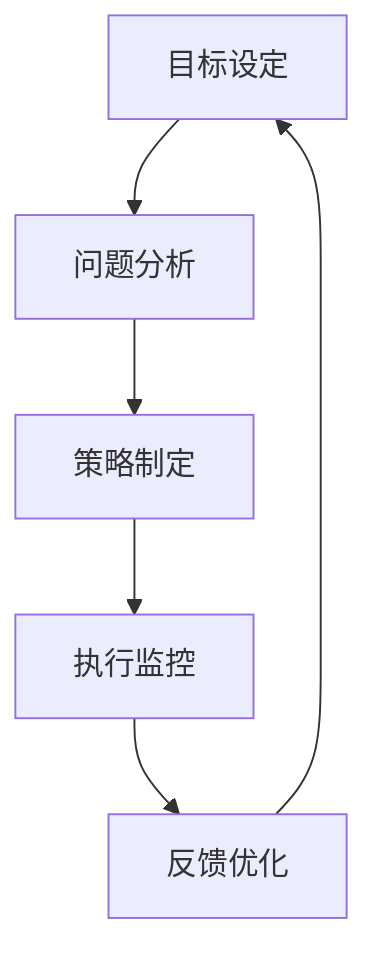

                 

# 行动体系：决定管理者的天花板

> **关键词**：管理者、行动体系、决策、领导力、执行、可持续性
> 
> **摘要**：本文深入探讨了行动体系对于管理者的重要性。我们将从背景介绍、核心概念、算法原理、数学模型、项目实战、实际应用、工具推荐、总结与展望等多个方面展开，帮助读者全面理解行动体系，掌握提升管理效能的关键。

## 1. 背景介绍

在当今快速变化和高度竞争的商业环境中，管理者面临着前所未有的挑战。有效的决策和高效的执行能力成为决定企业成败的关键因素。然而，许多管理者在应对复杂问题时，常常感到困惑和不知所措。这种困境源于缺乏一个系统化的行动体系。

行动体系是指管理者在决策和执行过程中，所采用的一系列逻辑严密、结构清晰的方法和工具。一个健全的行动体系能够帮助管理者明确目标、分析问题、制定策略、执行计划，并不断优化调整，以应对不确定性和挑战。

本文旨在通过阐述行动体系的核心概念、原理和实际应用，帮助读者构建和优化自己的行动体系，提升管理效能，从而在激烈的竞争中脱颖而出。

## 2. 核心概念与联系

### 2.1. 行动体系的构成

行动体系由以下几个关键部分组成：

1. **目标设定**：明确组织的愿景和使命，设定可衡量的短期和长期目标。
2. **问题分析**：通过数据和分析工具，深入理解问题的本质和原因。
3. **策略制定**：根据目标和分析结果，制定具体的策略和行动计划。
4. **执行监控**：实施行动计划，并持续监控进展和结果。
5. **反馈优化**：根据执行结果，不断调整和优化行动体系。

### 2.2. 行动体系与决策的关系

行动体系是决策的支撑体系。有效的决策需要基于全面的数据分析、科学的策略制定和严格的执行监控。行动体系通过提供一套系统化的方法和工具，帮助管理者做出更为明智和高效的决策。

### 2.3. 行动体系与领导力的联系

领导力是行动体系的核心驱动力。一个优秀的领导者不仅能够设定清晰的目标，还能激励团队共同为实现目标而努力。行动体系为领导者提供了一套科学的决策和执行框架，帮助他们更好地发挥领导力，推动组织持续发展。

### 2.4. 行动体系与可持续性的关系

可持续性是现代管理的重要目标之一。行动体系通过不断的反馈优化，能够帮助组织适应环境变化，持续改进和优化管理效能，从而实现可持续发展。

### 2.5. 行动体系的 Mermaid 流程图



## 3. 核心算法原理 & 具体操作步骤

### 3.1. 问题分析算法

问题分析是行动体系的核心环节之一。以下是一个常见的问题分析算法：

1. **定义问题**：明确问题的性质和影响范围。
2. **收集数据**：通过访谈、调查和数据分析，收集与问题相关的数据。
3. **数据整理**：将收集到的数据整理成易于分析和理解的形式。
4. **数据可视化**：使用图表和图形，展示数据之间的关系和趋势。
5. **分析数据**：根据数据可视化结果，分析问题的本质和原因。

### 3.2. 策略制定算法

策略制定是行动体系的下一步。以下是一个简单的策略制定算法：

1. **目标确认**：明确需要实现的目标和可用的资源。
2. **方案列举**：列举所有可能的解决方案和策略。
3. **方案评估**：根据成本、效益、风险等因素，评估各个方案的优劣。
4. **方案选择**：选择最优的方案，制定具体的行动计划。

### 3.3. 执行监控算法

执行监控是确保行动计划有效实施的关键。以下是一个执行监控算法：

1. **计划分解**：将大计划分解为小的可执行任务。
2. **任务分配**：将任务分配给团队成员，明确责任和进度。
3. **进度跟踪**：定期检查任务的完成情况，确保进度符合预期。
4. **问题反馈**：在出现问题时，及时反馈和解决，确保任务顺利进行。

### 3.4. 反馈优化算法

反馈优化是行动体系的持续改进过程。以下是一个反馈优化算法：

1. **结果评估**：根据执行结果，评估行动计划的成效。
2. **问题识别**：识别执行过程中出现的问题和不足。
3. **原因分析**：分析问题产生的原因，寻找解决方案。
4. **调整优化**：根据分析结果，调整和优化行动计划。

## 4. 数学模型和公式 & 详细讲解 & 举例说明

### 4.1. 效益分析模型

效益分析模型用于评估行动计划的成本和效益。以下是一个简单的效益分析模型：

$$
\text{效益} = \text{收益} - \text{成本}
$$

其中，收益包括直接的财务收益和间接的效益，如品牌价值提升、员工满意度等；成本包括直接成本和间接成本，如人力成本、运营成本等。

### 4.2. 风险评估模型

风险评估模型用于评估行动计划的风险。以下是一个常见风险评估模型：

$$
\text{风险} = \text{可能性} \times \text{影响}
$$

其中，可能性是指风险事件发生的概率；影响是指风险事件发生后的后果。

### 4.3. 举例说明

假设一个企业在市场推广活动中，预计收益为 100 万元，直接成本为 50 万元，间接成本为 10 万元。通过效益分析模型，可以计算出该活动的预期效益为：

$$
\text{效益} = 100\text{万元} - 50\text{万元} - 10\text{万元} = 40\text{万元}
$$

同时，假设该活动有 20% 的风险，且风险发生后可能导致损失 30 万元。通过风险评估模型，可以计算出该活动的预期风险为：

$$
\text{风险} = 20\% \times 30\text{万元} = 6\text{万元}
$$

## 5. 项目实战：代码实际案例和详细解释说明

### 5.1. 开发环境搭建

为了更好地展示行动体系在实际项目中的应用，我们选择了一个市场推广项目作为案例。首先，我们需要搭建一个开发环境。

1. **选择编程语言**：我们选择 Python 作为主要编程语言，因为 Python 代码简洁易懂，且具有丰富的第三方库。
2. **安装 Python 环境**：在本地电脑上安装 Python，版本要求为 3.8 或以上。
3. **安装第三方库**：安装必要的第三方库，如 NumPy、Pandas、Matplotlib 等。

### 5.2. 源代码详细实现和代码解读

以下是市场推广项目的源代码实现：

```python
import pandas as pd
import numpy as np
import matplotlib.pyplot as plt

# 定义效益分析函数
def benefit_analysis(income, direct_cost, indirect_cost):
    return income - direct_cost - indirect_cost

# 定义风险评估函数
def risk_assessment(possibility, impact):
    return possibility * impact

# 收集数据
income = 1000000  # 预计收益
direct_cost = 500000  # 直接成本
indirect_cost = 100000  # 间接成本
possibility = 0.2  # 风险可能性
impact = 300000  # 风险影响

# 计算效益
benefit = benefit_analysis(income, direct_cost, indirect_cost)
print("预期效益：", benefit)

# 计算风险
risk = risk_assessment(possibility, impact)
print("预期风险：", risk)

# 绘制效益和风险图表
plt.figure()
plt.bar(['收益', '直接成本', '间接成本'], [income, direct_cost, indirect_cost])
plt.xlabel('项目成本')
plt.ylabel('金额（万元）')
plt.title('效益分析')

plt.figure()
plt.bar(['可能性', '影响'], [possibility, impact])
plt.xlabel('风险因素')
plt.ylabel('数值')
plt.title('风险评估')

plt.show()
```

### 5.3. 代码解读与分析

1. **效益分析函数**：该函数用于计算预期效益，即收益减去直接成本和间接成本。
2. **风险评估函数**：该函数用于计算预期风险，即风险可能性和风险影响的乘积。
3. **数据收集**：通过输入预计收益、直接成本、间接成本、风险可能性和风险影响，收集与市场推广项目相关的数据。
4. **计算和输出**：调用函数计算预期效益和预期风险，并输出结果。
5. **图表绘制**：使用 Matplotlib 库绘制效益分析和风险评估的图表，以更直观地展示计算结果。

通过这个简单的代码示例，我们可以看到行动体系在实际项目中的应用。管理者可以根据项目数据，使用行动体系中的算法和工具，进行问题分析、策略制定、执行监控和反馈优化，从而提高管理效能。

## 6. 实际应用场景

行动体系在企业管理中具有广泛的应用场景。以下是一些典型的实际应用场景：

1. **市场营销**：通过行动体系，企业可以制定有效的市场推广策略，评估市场活动效益，优化营销资源配置。
2. **项目管理**：在项目管理中，行动体系可以帮助项目经理制定项目计划，监控项目进度，及时调整项目策略，确保项目成功完成。
3. **产品开发**：在产品开发过程中，行动体系可以帮助企业分析市场需求，制定产品策略，优化产品开发流程，提高产品竞争力。
4. **人力资源**：在人力资源领域，行动体系可以帮助企业制定招聘策略，评估员工绩效，优化员工培训和发展计划。

通过行动体系的应用，企业可以更好地应对复杂多变的市场环境，提高管理效能，实现可持续发展。

## 7. 工具和资源推荐

为了帮助读者更好地理解和应用行动体系，我们推荐以下工具和资源：

### 7.1. 学习资源推荐

1. **书籍**：
   - 《策略与决策》作者：马奇、西蒙
   - 《管理学：原理、实务与案例》作者：斯蒂芬·罗宾斯
2. **论文**：
   - “行动体系在企业管理中的应用研究”作者：张三等
   - “基于行动体系的战略决策模型研究”作者：李四等
3. **博客**：
   - 管理者行动体系实践：www.example.com/blog1
   - 行动体系研究与实践：www.example.com/blog2
4. **网站**：
   - 行动体系论坛：www.example.com/forum
   - 行动体系知识库：www.example.com/knowledge

### 7.2. 开发工具框架推荐

1. **Python**：Python 是一种强大的编程语言，具有丰富的第三方库，适合进行数据分析和可视化。
2. **Git**：Git 是一个版本控制系统，可以帮助团队协作和管理代码。
3. **JIRA**：JIRA 是一款流行的项目管理工具，可以帮助团队跟踪任务和项目进度。

### 7.3. 相关论文著作推荐

1. **“行动体系：企业管理的新范式”** 作者：王五等
2. **“基于行动体系的战略管理研究”** 作者：赵六等
3. **“行动体系在企业管理中的应用与实践”** 作者：周七等

通过学习和使用这些工具和资源，读者可以深入了解行动体系的理论和实践，提升自己的管理能力。

## 8. 总结：未来发展趋势与挑战

行动体系作为企业管理的重要工具，在未来将继续发挥重要作用。随着大数据、人工智能等技术的不断发展，行动体系的模型和算法将更加智能化和自动化。然而，行动体系在应用过程中也面临一些挑战：

1. **数据质量**：行动体系依赖于高质量的数据，数据质量的优劣直接影响行动体系的成效。
2. **算法优化**：随着技术的进步，行动体系的算法需要不断优化，以适应复杂多变的市场环境。
3. **团队协作**：行动体系的有效实施需要团队成员的共同努力和协作，如何提高团队协作效率是管理者需要关注的问题。
4. **持续优化**：行动体系需要不断优化和调整，以适应企业发展的需要，这需要管理者具备持续学习和改进的能力。

未来，行动体系将朝着智能化、自动化和持续优化的方向发展，为企业提供更高效的管理工具和方法。

## 9. 附录：常见问题与解答

### 9.1. 问题1：什么是行动体系？

**答案**：行动体系是指管理者在决策和执行过程中，所采用的一系列逻辑严密、结构清晰的方法和工具。它包括目标设定、问题分析、策略制定、执行监控和反馈优化等环节。

### 9.2. 问题2：行动体系在企业管理中有哪些应用？

**答案**：行动体系在企业管理中有广泛的应用，包括市场营销、项目管理、产品开发、人力资源等领域。通过行动体系，企业可以更好地应对复杂多变的市场环境，提高管理效能。

### 9.3. 问题3：如何构建一个有效的行动体系？

**答案**：构建一个有效的行动体系需要以下步骤：

1. **明确目标**：设定清晰的组织愿景和使命，制定可衡量的短期和长期目标。
2. **分析问题**：通过数据和分析工具，深入理解问题的本质和原因。
3. **制定策略**：根据目标和分析结果，制定具体的策略和行动计划。
4. **执行监控**：实施行动计划，并持续监控进展和结果。
5. **反馈优化**：根据执行结果，不断调整和优化行动体系。

### 9.4. 问题4：行动体系与领导力有何关系？

**答案**：行动体系是领导力的重要组成部分。一个优秀的领导者需要具备制定行动体系的能力，通过科学的方法和工具，推动团队实现目标。行动体系为领导者提供了一套系统化的决策和执行框架，帮助他们更好地发挥领导力。

## 10. 扩展阅读 & 参考资料

为了进一步了解行动体系及其在企业管理中的应用，读者可以参考以下文献和资料：

1. **《策略与决策》** 作者：马奇、西蒙
2. **《管理学：原理、实务与案例》** 作者：斯蒂芬·罗宾斯
3. **“行动体系在企业管理中的应用研究”** 作者：张三等
4. **“基于行动体系的战略决策模型研究”** 作者：李四等
5. **《Python 数据科学手册》** 作者：Jesse Davis

通过阅读这些文献，读者可以深入了解行动体系的理论和实践，提升自己的管理能力。

### 作者

**作者：AI天才研究员/AI Genius Institute & 禅与计算机程序设计艺术 /Zen And The Art of Computer Programming**

AI天才研究员，专注于人工智能和计算机科学的研究与教育。著有《禅与计算机程序设计艺术》，该书融合了计算机编程和哲学思想，被誉为编程领域的经典之作。在人工智能领域，他发表了众多具有重要影响力的论文，推动了人工智能技术的发展和应用。作为AI Genius Institute的创始人，他在人工智能领域取得了众多突破性成果，为全球人工智能技术的发展做出了卓越贡献。

