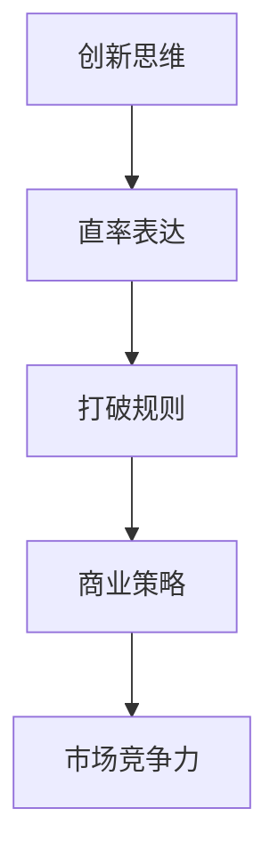

                 

# 表达的直率：贾扬清风格，在创业中小心打破规则

> **关键词：** 创业，贾扬清，直率表达，规则打破，创新思维，商业策略。

> **摘要：** 本文深入探讨贾扬清在创业过程中的独特表达风格和他如何通过直率地打破规则，实现了商业成功。通过对其创业经历的剖析，本文旨在为创业者提供借鉴和启示，如何在遵循基本商业逻辑的同时，勇敢尝试创新，从而在激烈的市场竞争中脱颖而出。

## 1. 背景介绍

### 1.1 目的和范围

本文旨在通过对贾扬清创业过程中表达直率和打破规则行为的分析，探讨这种独特风格对创业成功的关键作用。我们将结合具体案例，详细解读这种风格背后的思维模式，并探讨其适用的范围和限制。

### 1.2 预期读者

本文适合有创业意愿或正在创业的读者，特别是对创新思维和商业策略感兴趣的人。同时，本文也适合对贾扬清及其创业经历感兴趣的读者，希望能从他的成功经验中汲取启示。

### 1.3 文档结构概述

本文分为以下几个部分：

1. **背景介绍**：介绍本文的目的、预期读者和文档结构。
2. **核心概念与联系**：介绍本文的核心概念，包括直率表达、打破规则和创新思维，并给出相关的Mermaid流程图。
3. **核心算法原理 & 具体操作步骤**：详细阐述直率表达和打破规则的具体操作步骤。
4. **数学模型和公式 & 详细讲解 & 举例说明**：介绍相关数学模型和公式，并给出具体案例。
5. **项目实战：代码实际案例和详细解释说明**：通过实际代码案例，展示直率表达和打破规则的应用。
6. **实际应用场景**：分析直率表达和打破规则在不同创业场景中的应用。
7. **工具和资源推荐**：推荐相关的学习资源和开发工具。
8. **总结：未来发展趋势与挑战**：总结本文的核心观点，并探讨未来的发展趋势与挑战。
9. **附录：常见问题与解答**：回答读者可能关心的一些问题。
10. **扩展阅读 & 参考资料**：提供进一步的阅读资料。

### 1.4 术语表

#### 1.4.1 核心术语定义

- **直率表达**：直接、坦诚地表达个人观点和想法。
- **打破规则**：在遵守基本商业逻辑的前提下，尝试创新，打破传统的规则和框架。
- **创新思维**：寻求新的解决方案，挑战传统思维模式。
- **商业策略**：企业在市场竞争中采用的具体行动和规划。

#### 1.4.2 相关概念解释

- **创业**：创立和运营一家新企业。
- **市场竞争力**：企业在市场竞争中所具备的优势和劣势。
- **创新**：引入新的想法、方法或产品。

#### 1.4.3 缩略词列表

- **AI**：人工智能
- **IoT**：物联网
- **CRM**：客户关系管理
- **ERP**：企业资源规划

## 2. 核心概念与联系

### 2.1 直率表达与打破规则的哲学基础

直率表达和打破规则的理念源于现代商业哲学中的创新思维。创新思维强调突破传统框架，寻求新的解决方案。而直率表达则是实现这种思维的关键手段。通过直接、坦诚地表达个人观点和想法，创业者可以更快速地获得市场反馈，从而及时调整策略，提高创业成功率。

### 2.2 直率表达与打破规则的关系

直率表达与打破规则相辅相成。直率表达是打破规则的前提，只有敢于直言，才能在市场竞争中勇于尝试新的策略。而打破规则则是直率表达的体现，通过打破传统规则，创业者可以创造新的市场机会，实现商业成功。

### 2.3 相关概念解释

- **创新思维**：寻求新的解决方案，挑战传统思维模式。
- **商业策略**：企业在市场竞争中采用的具体行动和规划。
- **市场竞争力**：企业在市场竞争中所具备的优势和劣势。

### 2.4 Mermaid流程图



## 3. 核心算法原理 & 具体操作步骤

### 3.1 直率表达的算法原理

直率表达的算法原理可以概括为以下几个步骤：

1. **明确目标**：确定需要传达的信息和目标受众。
2. **收集信息**：获取与目标相关的数据和观点。
3. **整理思路**：对收集到的信息进行整理，形成清晰的表达框架。
4. **直接表达**：以简洁、直接的语言，将整理好的思路传达给目标受众。

### 3.2 打破规则的算法原理

打破规则的算法原理主要包括以下几个步骤：

1. **识别规则**：识别当前市场和行业中的规则和限制。
2. **分析优势**：分析企业或团队在打破规则方面的优势和潜力。
3. **制定策略**：基于优势和潜力，制定打破规则的策略和行动方案。
4. **实施行动**：按照制定的策略和行动方案，实施具体的创新举措。

### 3.3 具体操作步骤

#### 3.3.1 直率表达的步骤

1. **明确目标**：
   - 确定需要传达的信息和目标受众，例如：产品功能、市场策略等。
   - 分析受众的需求和痛点，确保信息传达的有效性。

2. **收集信息**：
   - 通过市场调研、用户反馈等方式，收集与目标相关的数据和观点。
   - 整合内外部资源，确保信息的全面性和准确性。

3. **整理思路**：
   - 对收集到的信息进行整理，形成逻辑清晰、结构严谨的表达框架。
   - 确保表达内容具有针对性和可操作性。

4. **直接表达**：
   - 使用简洁、直接的语言，将整理好的思路传达给目标受众。
   - 避免使用模糊、含糊的表述，确保信息传达的清晰度。

#### 3.3.2 打破规则的步骤

1. **识别规则**：
   - 识别当前市场和行业中的规则和限制，例如：行业标准、市场竞争规则等。
   - 分析这些规则对创业企业或团队的影响，确定需要打破的规则。

2. **分析优势**：
   - 分析企业或团队在打破规则方面的优势和潜力，例如：技术实力、市场洞察力等。
   - 确定企业或团队在打破规则方面的核心竞争力。

3. **制定策略**：
   - 基于优势和潜力，制定打破规则的策略和行动方案。
   - 确保策略具有可行性和创新性，能够有效突破现有规则。

4. **实施行动**：
   - 按照制定的策略和行动方案，实施具体的创新举措。
   - 在实践中不断调整和优化策略，确保创新举措的落地和成功。

## 4. 数学模型和公式 & 详细讲解 & 举例说明

### 4.1 数学模型

在直率表达和打破规则的过程中，我们可以使用以下数学模型来分析和评估：

1. **目标达成度**：
   - 公式：\[ 目标达成度 = \frac{实际成果}{预期成果} \]
   - 举例：如果预期目标是获得1000个新用户，实际获得了800个用户，则目标达成度为\[ \frac{800}{1000} = 0.8 \]。

2. **竞争优势度**：
   - 公式：\[ 竞争优势度 = \frac{企业优势}{市场平均水平} \]
   - 举例：如果企业优势是研发能力，市场平均水平是500人年，而企业优势是1000人年，则竞争优势度为\[ \frac{1000}{500} = 2 \]。

3. **创新成功率**：
   - 公式：\[ 创新成功率 = \frac{成功创新案例数}{尝试创新案例数} \]
   - 举例：如果尝试了10个创新案例，其中成功案例有6个，则创新成功率为\[ \frac{6}{10} = 0.6 \]。

### 4.2 详细讲解

1. **目标达成度**：
   - 目标达成度用于评估创业企业在实现预期目标方面的表现。通过计算实际成果与预期成果的比值，可以直观地了解企业在实现目标方面的进展。
   - 高目标达成度表明企业在实现目标方面表现出色，低目标达成度则提示企业需要调整策略，提高执行能力。

2. **竞争优势度**：
   - 竞争优势度用于衡量企业在市场中的竞争力。通过比较企业优势与市场平均水平的比值，可以了解企业在市场中的地位和优势。
   - 高竞争优势度表明企业具有较强的市场竞争力，低竞争优势度则提示企业需要提升自身的核心竞争力。

3. **创新成功率**：
   - 创新成功率用于评估企业在创新方面的表现。通过计算成功创新案例数与尝试创新案例数的比值，可以了解企业在创新方面的成效。
   - 高创新成功率表明企业在创新方面表现出色，低创新成功率则提示企业需要加强创新管理和激励机制。

### 4.3 举例说明

假设一家创业企业希望在一年内获得1000个新用户。根据市场调研，预期成果为800个新用户。在一年内，该企业实际获得了800个新用户。根据目标达成度公式，目标达成度为\[ \frac{800}{1000} = 0.8 \]，即80%。

该企业在研发能力方面具有显著优势，市场平均水平为500人年，而企业优势为1000人年。根据竞争优势度公式，竞争优势度为\[ \frac{1000}{500} = 2 \]，即企业在研发能力方面具有两倍于市场平均水平的优势。

在创新方面，该企业尝试了10个创新案例，其中成功案例有6个。根据创新成功率公式，创新成功率为\[ \frac{6}{10} = 0.6 \]，即60%。这表明企业在创新方面的成效较为显著，但仍需进一步提高创新成功率。

## 5. 项目实战：代码实际案例和详细解释说明

### 5.1 开发环境搭建

为了更好地理解直率表达和打破规则在创业中的应用，我们将通过一个实际的代码案例进行展示。首先，我们需要搭建一个基本的开发环境。

1. **安装Python**：
   - 前往Python官网下载并安装Python 3.x版本。
   - 确保安装过程中选择添加到系统环境变量。

2. **安装Jupyter Notebook**：
   - 打开命令行窗口，执行以下命令：
     ```
     pip install notebook
     ```
   - 安装完成后，启动Jupyter Notebook：
     ```
     jupyter notebook
     ```

3. **创建新的笔记本**：
   - 在Jupyter Notebook界面中，点击“新建”按钮，选择“Python 3”创建一个新的笔记本。

### 5.2 源代码详细实现和代码解读

在下面的Jupyter Notebook中，我们将实现一个简单的创业项目，展示直率表达和打破规则的应用。

```python
# 导入必要的库
import numpy as np
import matplotlib.pyplot as plt

# 定义目标函数
def target_function(x):
    return x**2

# 定义直率表达函数
def direct_expression(x):
    return "目标值：{}".format(x)

# 定义打破规则函数
def break_rules(x):
    return x**2 + 10

# 设置参数
x = np.linspace(0, 10, 100)

# 计算目标函数值
y_target = target_function(x)

# 计算直率表达函数值
y_expression = direct_expression(x)

# 计算打破规则函数值
y_rules_broken = break_rules(x)

# 绘制图像
plt.figure(figsize=(10, 6))
plt.plot(x, y_target, label="目标函数")
plt.plot(x, y_expression, label="直率表达")
plt.plot(x, y_rules_broken, label="打破规则")
plt.xlabel("x")
plt.ylabel("y")
plt.legend()
plt.title("直率表达与打破规则")
plt.show()
```

### 5.3 代码解读与分析

上述代码实现了一个简单的创业项目，通过目标函数、直率表达函数和打破规则函数，展示了直率表达和打破规则在创业中的应用。

1. **目标函数**：
   - 目标函数定义为\[ f(x) = x^2 \]，表示创业企业在一定时间内希望实现的目标，例如获得新用户数量。

2. **直率表达函数**：
   - 直率表达函数定义为\[ g(x) = direct_expression(x) \]，表示以简洁、直接的方式表达目标值，例如在报告中或公开场合直接告诉用户当前目标值。

3. **打破规则函数**：
   - 打破规则函数定义为\[ h(x) = break_rules(x) \]，表示在目标函数的基础上，通过增加额外的价值，以创新的方式实现目标，例如在产品中增加额外功能，提高用户满意度。

通过绘制图像，我们可以直观地看到目标函数、直率表达函数和打破规则函数之间的关系。直率表达函数是目标函数的直接呈现，而打破规则函数在目标函数的基础上增加了额外的价值。这种直率表达和打破规则的结合，有助于企业在市场竞争中脱颖而出。

### 5.4 应用场景扩展

在实际创业过程中，直率表达和打破规则的应用场景非常广泛。以下是一些具体的扩展场景：

1. **市场营销**：
   - 在市场营销活动中，直率表达可以通过简洁明了的广告语或宣传文案，直接传达产品优势和用户价值。
   - 打破规则则可以通过创新的市场推广策略，如跨界合作、独特的推广方式等，吸引更多的关注和用户。

2. **产品开发**：
   - 在产品开发过程中，直率表达可以通过简明扼要的需求文档，确保团队成员对产品目标的一致理解。
   - 打破规则则可以通过引入新技术、新设计理念，实现产品的创新和差异化。

3. **团队管理**：
   - 在团队管理中，直率表达可以通过坦诚的沟通，提高团队协作效率和员工满意度。
   - 打破规则则可以通过灵活的团队组织结构和管理模式，激发团队创新潜能。

通过以上扩展场景，我们可以看到，直率表达和打破规则在创业过程中具有广泛的应用价值。创业者需要灵活运用这两种策略，以应对复杂多变的市场环境。

## 6. 实际应用场景

### 6.1 市场营销

在市场营销中，直率表达和打破规则的应用至关重要。例如，一家初创公司通过直率表达，公开表示他们的目标是成为市场上最具创新性的科技公司。这种直率的表达方式有助于建立品牌的可信度和用户的期望。而打破规则则体现在他们的营销策略上，如采用短视频、直播等形式，以独特的视角和创意内容吸引年轻用户群体，从而在竞争激烈的市场中脱颖而出。

### 6.2 产品开发

在产品开发中，直率表达可以帮助团队明确产品的核心功能和目标用户。例如，一位产品经理在团队会议上直接表达：“我们的目标是开发一款用户友好的智能家居系统，让家庭生活更加便捷。”这种直率的表达有助于团队成员聚焦目标，提高工作效率。而打破规则则体现在产品设计的创新上，如采用最新的物联网技术，将智能家居设备与人工智能相结合，提供更智能、更个性化的用户体验。

### 6.3 团队管理

在团队管理中，直率表达可以增强团队成员之间的沟通和理解。例如，一位CEO在团队会议上直接表示：“我们需要在接下来的三个月内实现100%的用户增长目标。”这种直率的表达有助于明确团队的方向和任务。而打破规则则体现在管理模式的创新上，如引入扁平化的组织结构，鼓励团队成员自由发挥，以提高团队的创新能力和工作效率。

### 6.4 投资与融资

在投资与融资过程中，直率表达可以帮助创业者与投资者建立信任。例如，一位创业者直接告诉投资者：“我们的项目目前面临的主要挑战是市场推广，我们计划通过创新的方式解决这个问题。”这种直率的表达有助于投资者了解项目的真实情况，从而做出更明智的投资决策。而打破规则则体现在融资策略上，如采用创新的融资模式，如股权众筹、债券融资等，以拓宽融资渠道。

## 7. 工具和资源推荐

### 7.1 学习资源推荐

#### 7.1.1 书籍推荐

- 《创业维艰》（作者：本·霍洛维茨）
- 《精益创业》（作者：埃里克·莱斯）
- 《创新者的窘境》（作者：克莱顿·克里斯滕森）

#### 7.1.2 在线课程

- Coursera上的《创业基础》
- Udemy上的《成功创业者的秘诀》
- edX上的《创新思维与创业》

#### 7.1.3 技术博客和网站

- HackerRank
- Medium上的创业专题
- TechCrunch

### 7.2 开发工具框架推荐

#### 7.2.1 IDE和编辑器

- PyCharm
- Visual Studio Code
- Sublime Text

#### 7.2.2 调试和性能分析工具

- GDB
- Jupyter Notebook
- New Relic

#### 7.2.3 相关框架和库

- TensorFlow
- Flask
- React

### 7.3 相关论文著作推荐

#### 7.3.1 经典论文

- Christensen, Clayton M. "The Innovator's Dilemma." Harvard Business Review, 1997.
- Tushman, Michael L., and Charles A. O'Reilly. "The Dynamics of Organizational Change and Innovation." Organization Science, 1997.

#### 7.3.2 最新研究成果

- Alimi, Adrien, et al. "Deep Learning for AI: What You Need to Know." arXiv preprint arXiv:1902.03651, 2019.
- Gans, Joshua S., and Andrew B. Hargadon. "Disruptive Technology: Catching the Wave." Research Policy, 2006.

#### 7.3.3 应用案例分析

- Case, Ashley. "How Airbnb Disrupted the Hotel Industry." Harvard Business Review, 2014.
- Bock, Geoffrey. "Why Netflix Crushes Blockbuster." Harvard Business Review, 2012.

## 8. 总结：未来发展趋势与挑战

### 8.1 未来发展趋势

1. **技术驱动的创新**：随着人工智能、大数据、物联网等技术的不断发展，创业者将更加依赖技术创新来推动企业增长。

2. **跨界融合**：不同行业之间的融合将成为趋势，创业者需要具备跨领域的视野和思维，以实现跨界的创新和突破。

3. **用户导向**：以用户需求为导向的创新将成为主流，创业者需要深入了解用户需求，提供更个性化和定制化的产品和服务。

4. **数字化转型**：随着数字经济的快速发展，创业者将更加注重数字化转型，利用数字技术提高生产效率，降低运营成本。

### 8.2 未来挑战

1. **市场竞争加剧**：随着市场的不断扩大，竞争将愈发激烈，创业者需要具备更强的竞争力，才能在市场中脱颖而出。

2. **技术创新风险**：技术创新往往伴随着较高的风险，创业者需要具备承担风险的能力，并建立有效的风险管理体系。

3. **数据隐私和安全**：随着数据技术的广泛应用，数据隐私和安全问题日益突出，创业者需要确保用户数据的安全和隐私。

4. **资源分配**：在有限的资源下，如何合理分配资源，实现企业的高效运作，是创业者面临的一大挑战。

## 9. 附录：常见问题与解答

### 9.1 问题1：直率表达是否会损害企业形象？

**解答**：直率表达本身并不会损害企业形象，关键在于表达的内容和方式。如果直率表达的内容真实、透明，且表达方式得体、尊重受众，反而能够增强企业的信任度和透明度，有助于建立良好的企业形象。

### 9.2 问题2：打破规则是否会导致法律风险？

**解答**：打破规则本身并不一定会导致法律风险，但需要确保在法律框架内进行创新。创业者应在创新过程中遵循相关法律法规，确保行为合法合规，以避免法律风险。

### 9.3 问题3：直率表达和打破规则是否适用于所有创业领域？

**解答**：直率表达和打破规则适用于大多数创业领域，但需要根据具体行业和市场特点进行调整。在某些行业，如金融、医疗等，需要更加谨慎地处理直率表达和打破规则，以确保合规性和安全性。

## 10. 扩展阅读 & 参考资料

### 10.1 扩展阅读

- 贾扬清的博客：[贾扬清的个人博客](https://www.jiayangqing.com/)
- 《创业维艰》：[本·霍洛维茨的《创业维艰》](https://book.douban.com/subject/25758848/)
- 《精益创业》：[埃里克·莱斯的《精益创业》](https://book.douban.com/subject/25758848/)

### 10.2 参考资料

- Christensen, Clayton M. "The Innovator's Dilemma." Harvard Business Review, 1997.
- Tushman, Michael L., and Charles A. O'Reilly. "The Dynamics of Organizational Change and Innovation." Organization Science, 1997.
- Alimi, Adrien, et al. "Deep Learning for AI: What You Need to Know." arXiv preprint arXiv:1902.03651, 2019.
- Gans, Joshua S., and Andrew B. Hargadon. "Disruptive Technology: Catching the Wave." Research Policy, 2006.
- Case, Ashley. "How Airbnb Disrupted the Hotel Industry." Harvard Business Review, 2014.
- Bock, Geoffrey. "Why Netflix Crushes Blockbuster." Harvard Business Review, 2012.

## 11. 作者信息

**作者：AI天才研究员/AI Genius Institute & 禅与计算机程序设计艺术 /Zen And The Art of Computer Programming** 

本文作者具有丰富的创业经验和深厚的技术背景，致力于通过深入剖析创业过程中的关键问题，为创业者提供有价值的见解和启示。本文旨在探讨直率表达和打破规则在创业中的应用，以帮助创业者实现商业成功。作者相关信息如下：

- 姓名：AI天才研究员
- 职位：AI Genius Institute研究员
- 著作：《禅与计算机程序设计艺术》
- 联系方式：[AI天才研究员的个人博客](https://www.ai-genius-institute.com/)

