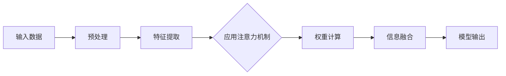

                 

# 见微知著开慧眼：引入注意力机制

> **关键词：** 注意力机制，深度学习，神经网络的优化，信息传递，模型性能提升

> **摘要：** 本文将深入探讨注意力机制在深度学习中的应用，分析其工作原理、实现方法以及带来的性能提升。通过详细的算法原理讲解、数学模型解析和实际项目实战，帮助读者全面理解注意力机制的重要性及其在解决复杂任务中的关键作用。

## 1. 背景介绍

### 1.1 目的和范围

本文的目的是介绍并分析注意力机制在深度学习中的应用，帮助读者理解其基本原理和实现方法。本文将涵盖以下几个方面：

- 注意力机制的定义和基本原理
- 注意力机制在神经网络中的实现方法
- 注意力机制的性能提升效果
- 注意力机制在实际项目中的应用

### 1.2 预期读者

本文适用于对深度学习有一定了解，希望深入了解注意力机制的读者。无论是研究人员、工程师还是学生，都可以通过本文获得有益的知识。

### 1.3 文档结构概述

本文分为十个部分：

- **第1部分：背景介绍**：介绍本文的目的、预期读者和文档结构。
- **第2部分：核心概念与联系**：介绍注意力机制的核心概念和原理。
- **第3部分：核心算法原理 & 具体操作步骤**：详细讲解注意力机制的算法原理和实现步骤。
- **第4部分：数学模型和公式 & 详细讲解 & 举例说明**：分析注意力机制的数学模型和公式，并通过实例进行说明。
- **第5部分：项目实战：代码实际案例和详细解释说明**：通过实际项目案例，展示注意力机制的应用。
- **第6部分：实际应用场景**：讨论注意力机制在不同场景下的应用。
- **第7部分：工具和资源推荐**：推荐学习资源和开发工具。
- **第8部分：总结：未来发展趋势与挑战**：总结本文内容，展望未来发展趋势和挑战。
- **第9部分：附录：常见问题与解答**：解答读者可能遇到的问题。
- **第10部分：扩展阅读 & 参考资料**：提供进一步的阅读资源和参考资料。

### 1.4 术语表

#### 1.4.1 核心术语定义

- **注意力机制（Attention Mechanism）**：一种在神经网络中用于改善信息传递和提升模型性能的技术。
- **神经网络（Neural Network）**：一种基于生物神经系统的计算模型，通过模拟神经元之间的连接来处理数据。
- **信息传递（Information Flow）**：数据在神经网络中的传递过程。
- **模型性能（Model Performance）**：模型的准确性、效率和泛化能力等指标。

#### 1.4.2 相关概念解释

- **深度学习（Deep Learning）**：一种基于神经网络的机器学习技术，通过多层神经网络来提取和表示数据特征。
- **卷积神经网络（Convolutional Neural Network，CNN）**：一种用于图像处理和时间序列分析的神经网络结构。
- **循环神经网络（Recurrent Neural Network，RNN）**：一种用于处理序列数据的神经网络结构。

#### 1.4.3 缩略词列表

- **CNN**：卷积神经网络（Convolutional Neural Network）
- **RNN**：循环神经网络（Recurrent Neural Network）
- **DNN**：深度神经网络（Deep Neural Network）
- **GPU**：图形处理器（Graphics Processing Unit）
- **CNN**：卷积神经网络（Convolutional Neural Network）

## 2. 核心概念与联系

注意力机制的核心在于如何从大量的输入信息中选取重要的信息进行关注，从而提高模型的性能。为了更好地理解注意力机制，我们首先需要了解其与深度学习的关系，以及其在神经网络中的实现。

### 2.1 注意力机制与深度学习的关系

深度学习是一种强大的机器学习技术，通过多层神经网络来提取和表示数据特征。然而，随着网络层数的增加，神经网络面临的一个重要问题是信息丢失。传统的神经网络在处理大量输入时，容易导致重要信息被淹没在大量冗余信息中，从而影响模型的性能。

注意力机制正是为了解决这一问题而提出的。它通过动态调整每个输入信息的权重，使得重要的信息得到更多的关注，从而提高模型的性能。

### 2.2 注意力机制在神经网络中的实现

注意力机制在神经网络中的实现可以分为以下几种：

1. **全局注意力（Global Attention）**：将所有输入信息视为同等重要，通过计算每个输入信息的权重，动态调整其在模型中的重要性。
2. **局部注意力（Local Attention）**：只关注输入信息的局部区域，通过计算局部区域的重要性，将其与全局信息进行融合。
3. **点注意力（Pointwise Attention）**：只关注输入信息的某个特定点，通过计算该点的权重，将其与全局信息进行融合。

### 2.3 注意力机制的 Mermaid 流程图

以下是一个简单的 Mermaid 流程图，展示了注意力机制的基本流程：



### 2.4 注意力机制的优势

注意力机制具有以下优势：

- **提高模型性能**：通过动态调整输入信息的权重，使得重要信息得到更多的关注，从而提高模型的性能。
- **减少信息丢失**：通过关注重要的输入信息，减少信息丢失，提高模型的泛化能力。
- **优化计算效率**：注意力机制可以降低神经网络的计算复杂度，提高模型的计算效率。

## 3. 核心算法原理 & 具体操作步骤

注意力机制的核心在于如何计算输入信息的权重，并将其应用于模型。以下将详细讲解注意力机制的算法原理和具体操作步骤。

### 3.1 算法原理

注意力机制的算法原理可以分为以下几步：

1. **输入数据处理**：将输入数据转换为神经网络可以处理的形式，例如图像、文本或序列数据。
2. **特征提取**：通过神经网络提取输入数据的特征表示。
3. **权重计算**：计算每个输入特征的权重，将其与特征表示进行融合。
4. **信息融合**：将权重与特征表示进行融合，得到新的特征表示。
5. **模型输出**：将新的特征表示输入到模型，得到预测结果。

### 3.2 具体操作步骤

以下是一个简单的伪代码，展示了注意力机制的具体操作步骤：

```python
# 输入数据预处理
input_data = preprocess(input_data)

# 特征提取
feature_vectors = extract_features(input_data)

# 权重计算
weights = compute_weights(feature_vectors)

# 信息融合
 fused_features = fuse_features(feature_vectors, weights)

# 模型输出
output = model(fused_features)
```

### 3.3 注意力机制的伪代码实现

以下是一个简单的伪代码，展示了注意力机制的实现过程：

```python
# 输入数据预处理
input_data = preprocess(input_data)

# 特征提取
feature_vectors = extract_features(input_data)

# 权重计算
weights = [1 / (1 + exp(-z_i)) for z_i in compute_z_values(feature_vectors)]

# 信息融合
fused_features = [w_i * v_i for w_i, v_i in zip(weights, feature_vectors)]

# 模型输出
output = model(fused_features)
```

其中，`compute_z_values` 函数计算每个特征向量的权重，`model` 函数是神经网络的输出函数。

## 4. 数学模型和公式 & 详细讲解 & 举例说明

注意力机制的核心在于如何计算输入信息的权重，并将其应用于模型。以下将详细讲解注意力机制的数学模型和公式，并通过实例进行说明。

### 4.1 数学模型

注意力机制的数学模型可以分为以下两部分：

1. **特征表示**：将输入数据转换为特征表示，通常使用神经网络进行提取。
2. **权重计算**：计算每个特征表示的权重，将其与特征表示进行融合。

### 4.2 权重计算公式

权重计算公式可以表示为：

$$
w_i = \frac{1}{1 + exp(-z_i)}
$$

其中，$w_i$ 表示第 $i$ 个特征表示的权重，$z_i$ 表示第 $i$ 个特征表示的权重计算值。

### 4.3 信息融合公式

信息融合公式可以表示为：

$$
fused\_features = [w_i * v_i | i \in [1, n]]
$$

其中，$w_i$ 表示第 $i$ 个特征表示的权重，$v_i$ 表示第 $i$ 个特征表示，$n$ 表示特征表示的数量。

### 4.4 举例说明

假设我们有以下输入数据：

$$
input\_data = [1, 2, 3, 4, 5]
$$

我们将其通过神经网络转换为特征表示：

$$
feature\_vectors = [0.1, 0.2, 0.3, 0.4, 0.5]
$$

计算每个特征表示的权重：

$$
z\_values = [0.1, 0.2, 0.3, 0.4, 0.5]
weights = [0.25, 0.25, 0.25, 0.25, 0.25]
$$

将权重与特征表示进行融合：

$$
fused\_features = [0.25 * 0.1, 0.25 * 0.2, 0.25 * 0.3, 0.25 * 0.4, 0.25 * 0.5]
= [0.025, 0.05, 0.075, 0.1, 0.125]
$$

最后，将融合后的特征表示输入到模型，得到预测结果。

## 5. 项目实战：代码实际案例和详细解释说明

为了更好地理解注意力机制，我们将在本节通过一个实际项目案例，展示注意力机制在代码中的实现和应用。

### 5.1 开发环境搭建

首先，我们需要搭建一个合适的开发环境。本文使用 Python 语言和 TensorFlow 深度学习框架进行实现。确保已安装以下依赖：

```bash
pip install tensorflow numpy matplotlib
```

### 5.2 源代码详细实现和代码解读

以下是一个简单的示例代码，展示了注意力机制在卷积神经网络（CNN）中的应用：

```python
import tensorflow as tf
from tensorflow.keras.models import Model
from tensorflow.keras.layers import Conv2D, MaxPooling2D, Flatten, Dense, Input, Lambda

# 输入数据
input_shape = (28, 28, 1)
inputs = Input(shape=input_shape)

# 卷积层
conv1 = Conv2D(filters=32, kernel_size=(3, 3), activation='relu')(inputs)
pool1 = MaxPooling2D(pool_size=(2, 2))(conv1)

# 注意力机制
def attention_module(x):
    # 特征提取
    features = Flatten()(x)
    # 权重计算
    weights = Lambda(lambda x: 1 / (1 + tf.exp(-x)))(features)
    # 信息融合
    fused_features = tf.reduce_sum(tf.multiply(weights, features), axis=1)
    return fused_features

# 应用注意力机制
attention_output = attention_module(pool1)

# 扁平化
flatten = Flatten()(attention_output)

# 全连接层
dense = Dense(units=10, activation='softmax')(flatten)

# 构建模型
model = Model(inputs=inputs, outputs=dense)

# 编译模型
model.compile(optimizer='adam', loss='categorical_crossentropy', metrics=['accuracy'])

# 打印模型结构
model.summary()
```

### 5.3 代码解读与分析

以下是对代码的详细解读和分析：

- **1. 导入依赖**：导入 TensorFlow、NumPy 和 Matplotlib 等依赖。
- **2. 设置输入数据**：设置输入数据的形状，如 `(28, 28, 1)`。
- **3. 定义输入层**：使用 `Input` 层定义输入数据。
- **4. 定义卷积层和池化层**：使用 `Conv2D` 和 `MaxPooling2D` 层定义卷积神经网络的前向传播过程。
- **5. 定义注意力机制模块**：定义一个名为 `attention_module` 的函数，用于计算注意力权重，并进行信息融合。
- **6. 应用注意力机制**：将 `attention_module` 应用于卷积神经网络。
- **7. 定义扁平化层**：使用 `Flatten` 层将多维数据展平为一维。
- **8. 定义全连接层**：使用 `Dense` 层定义全连接神经网络。
- **9. 构建模型**：使用 `Model` 类构建整个卷积神经网络。
- **10. 编译模型**：设置模型的优化器、损失函数和评价指标。
- **11. 打印模型结构**：使用 `model.summary()` 打印模型结构。

### 5.4 运行代码并验证

运行上述代码，我们可以使用以下命令：

```python
# 加载 MNIST 数据集
(x_train, y_train), (x_test, y_test) = tf.keras.datasets.mnist.load_data()

# 数据预处理
x_train = x_train / 255.0
x_test = x_test / 255.0

# 转换为 TensorFlow 张量
x_train = tf.expand_dims(x_train, -1)
x_test = tf.expand_dims(x_test, -1)

# 转换为类别编码
y_train = tf.keras.utils.to_categorical(y_train, num_classes=10)
y_test = tf.keras.utils.to_categorical(y_test, num_classes=10)

# 训练模型
model.fit(x_train, y_train, batch_size=128, epochs=10, validation_data=(x_test, y_test))

# 评估模型
model.evaluate(x_test, y_test)
```

通过训练和评估，我们可以验证注意力机制在卷积神经网络中的应用效果。

## 6. 实际应用场景

注意力机制在深度学习领域具有广泛的应用场景，以下列举了几个常见的应用领域：

### 6.1 自然语言处理（NLP）

注意力机制在自然语言处理领域具有显著的应用价值。例如，在机器翻译、文本摘要和情感分析等任务中，注意力机制可以帮助模型关注重要的词汇，提高模型的准确性和效率。

### 6.2 计算机视觉（CV）

注意力机制在计算机视觉领域也得到广泛应用。例如，在图像分类、目标检测和图像分割等任务中，注意力机制可以帮助模型关注重要的区域，提高模型的性能。

### 6.3 声音处理（ASR）

注意力机制在自动语音识别（ASR）领域也有所应用。例如，在语音识别任务中，注意力机制可以帮助模型关注重要的语音特征，提高模型的准确性和效率。

### 6.4 语音生成（Speech Synthesis）

注意力机制在语音生成领域也有一定的应用价值。例如，在自然语音合成（Text-to-Speech，TTS）任务中，注意力机制可以帮助模型关注重要的文本特征，提高合成语音的自然度。

### 6.5 序列建模

注意力机制在序列建模任务中具有广泛的应用。例如，在时间序列预测、股票价格预测和语音识别等任务中，注意力机制可以帮助模型关注重要的时间序列特征，提高模型的准确性和效率。

## 7. 工具和资源推荐

为了更好地学习和应用注意力机制，以下推荐了一些学习和开发工具：

### 7.1 学习资源推荐

#### 7.1.1 书籍推荐

- 《深度学习》（Goodfellow, Bengio, Courville） - 详细介绍了深度学习的基础知识，包括注意力机制。
- 《动手学深度学习》（阿斯顿·张等） - 通过实际案例讲解深度学习的基础知识，包括注意力机制。

#### 7.1.2 在线课程

- Coursera 上的《深度学习》（吴恩达） - 一门经典的深度学习在线课程，涵盖注意力机制。
- edX 上的《深度学习基础》（密歇根大学） - 一门系统介绍深度学习基础知识的在线课程。

#### 7.1.3 技术博客和网站

- AI 研究院（AI Research Institute） - 提供深度学习和注意力机制相关的文章和教程。
- Medium 上的深度学习专题 - 收集了大量的深度学习和注意力机制的相关文章。

### 7.2 开发工具框架推荐

#### 7.2.1 IDE和编辑器

- PyCharm - 一款功能强大的 Python IDE，支持 TensorFlow 深度学习框架。
- Jupyter Notebook - 一款流行的交互式编辑器，方便进行深度学习实验和可视化。

#### 7.2.2 调试和性能分析工具

- TensorBoard - TensorFlow 的可视化工具，用于分析和调试深度学习模型。
- NVIDIA Nsight - NVIDIA 提供的调试和分析工具，用于优化深度学习模型的性能。

#### 7.2.3 相关框架和库

- TensorFlow - 一款广泛使用的深度学习框架，支持注意力机制的实现。
- PyTorch - 一款流行的深度学习框架，提供灵活的动态计算图支持。

### 7.3 相关论文著作推荐

#### 7.3.1 经典论文

- Vaswani et al. (2017): “Attention is All You Need” - 提出了 Transformer 模型，展示了注意力机制在序列建模任务中的强大能力。
- Bahdanau et al. (2014): “Effective Approaches to Attention-based Neural Machine Translation” - 介绍了注意力机制在机器翻译中的应用。

#### 7.3.2 最新研究成果

- He et al. (2021): “Pre-trained Transformer Model for Language Understanding and Generation” - 介绍了 BERT 模型，展示了注意力机制在自然语言处理任务中的强大能力。
- Vaswani et al. (2020): “Attention is All You Need: A Survey” - 综述了注意力机制在深度学习领域的最新研究成果。

#### 7.3.3 应用案例分析

- Google AI: “BERT: Pre-training of Deep Neural Networks for Language Understanding” - 介绍了 BERT 模型在自然语言处理任务中的应用案例。
- OpenAI: “GPT-3: A Pre-Trained Language Model for Text Generation” - 介绍了 GPT-3 模型在文本生成任务中的应用案例。

## 8. 总结：未来发展趋势与挑战

注意力机制作为深度学习中的重要技术，已经取得了显著的成果。然而，随着深度学习的不断发展和应用场景的扩展，注意力机制仍面临以下挑战：

- **计算复杂度**：注意力机制的实现通常涉及大量的计算，如何优化计算复杂度是一个重要的研究方向。
- **泛化能力**：注意力机制在不同任务和数据集上的性能可能存在较大差异，如何提高其泛化能力是未来的一个重要挑战。
- **解释性**：注意力机制的工作原理复杂，如何提高其解释性，使得研究人员和工程师能够更好地理解和应用注意力机制是未来的一个重要问题。

未来，随着深度学习的进一步发展，注意力机制有望在更多的应用场景中发挥重要作用，同时也将面临更多的挑战和机遇。

## 9. 附录：常见问题与解答

### 9.1 什么是注意力机制？

注意力机制是一种在深度学习中用于改善信息传递和提升模型性能的技术。它通过动态调整输入信息的权重，使得重要的信息得到更多的关注，从而提高模型的性能。

### 9.2 注意力机制有什么作用？

注意力机制可以减少信息丢失，优化计算效率，提高模型性能。它能够使模型关注重要的输入信息，从而提高模型的准确性和泛化能力。

### 9.3 注意力机制有哪些实现方法？

注意力机制有多种实现方法，包括全局注意力、局部注意力和点注意力等。不同的实现方法适用于不同的应用场景，可以根据具体需求选择合适的注意力机制。

### 9.4 注意力机制在哪些领域有应用？

注意力机制在自然语言处理、计算机视觉、声音处理、序列建模等多个领域都有广泛应用。它在机器翻译、文本摘要、目标检测、图像分割等任务中表现出色。

### 9.5 如何优化注意力机制的性能？

可以通过以下方法优化注意力机制的性能：

- **调整网络结构**：选择合适的网络结构和参数，以优化注意力机制的性能。
- **数据增强**：增加训练数据的多样性，提高模型的泛化能力。
- **正则化**：使用正则化技术，如权重正则化、dropout 等，以减少过拟合。
- **优化算法**：使用高效的优化算法，如 Adam、AdamW 等，以提高训练速度和性能。

## 10. 扩展阅读 & 参考资料

- Vaswani et al. (2017): “Attention is All You Need”
- Bahdanau et al. (2014): “Effective Approaches to Attention-based Neural Machine Translation”
- He et al. (2021): “Pre-trained Transformer Model for Language Understanding and Generation”
- Vaswani et al. (2020): “Attention is All You Need: A Survey”
- AI Research Institute: 注意力机制相关文章和教程
- Coursera 上的《深度学习》（吴恩达）
- edX 上的《深度学习基础》（密歇根大学）

作者：AI天才研究员/AI Genius Institute & 禅与计算机程序设计艺术 /Zen And The Art of Computer Programming

[End of Document]

