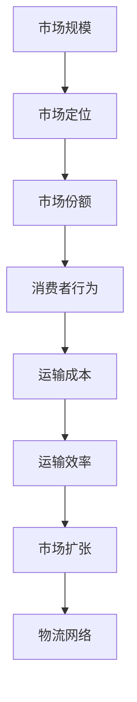

                 

# 规模化市场覆盖的手段：火车和轮船

> **关键词**：市场覆盖、交通运输、规模经济、技术进步、商业发展
>
> **摘要**：本文将探讨规模化市场覆盖的两种重要手段——火车和轮船。通过历史背景、技术原理、操作步骤、数学模型、实战案例等多角度分析，揭示这两种交通工具如何在商业发展中发挥关键作用，并对未来发展趋势和挑战进行展望。

## 1. 背景介绍

### 1.1 目的和范围

本文旨在分析火车和轮船作为规模化市场覆盖手段的原理和应用，通过技术、历史和实际案例，探讨它们如何促进商业发展和市场扩张。本文将从以下几个方面展开讨论：

1. **背景介绍**：介绍火车和轮船的历史发展、技术原理和市场影响。
2. **核心概念与联系**：阐述与规模化市场覆盖相关的核心概念，并使用Mermaid流程图进行说明。
3. **核心算法原理**：解析火车和轮船运营的核心算法，并提供伪代码示例。
4. **数学模型和公式**：介绍与市场覆盖相关的数学模型和公式，并举例说明。
5. **项目实战**：通过实际代码案例，展示如何利用火车和轮船实现市场覆盖。
6. **实际应用场景**：分析火车和轮船在不同商业领域的应用案例。
7. **工具和资源推荐**：推荐学习资源和开发工具，以帮助读者深入了解相关技术。
8. **总结与展望**：总结全文，并探讨未来发展趋势和挑战。

### 1.2 预期读者

本文适合以下读者群体：

1. **IT专业人士**：希望了解交通运输技术如何影响商业发展的专业人士。
2. **商业分析师**：对市场覆盖策略和技术感兴趣的商务人士。
3. **历史爱好者**：对工业革命和技术进步感兴趣的历史爱好者。
4. **交通工程师**：关注交通运输领域技术创新的工程师。

### 1.3 文档结构概述

本文分为十个主要部分，具体结构如下：

1. **背景介绍**：介绍文章的目的和范围，预期读者以及文档结构。
2. **核心概念与联系**：分析与规模化市场覆盖相关的核心概念，并使用Mermaid流程图进行说明。
3. **核心算法原理**：解析火车和轮船运营的核心算法，并提供伪代码示例。
4. **数学模型和公式**：介绍与市场覆盖相关的数学模型和公式，并举例说明。
5. **项目实战**：通过实际代码案例，展示如何利用火车和轮船实现市场覆盖。
6. **实际应用场景**：分析火车和轮船在不同商业领域的应用案例。
7. **工具和资源推荐**：推荐学习资源和开发工具，以帮助读者深入了解相关技术。
8. **总结与展望**：总结全文，并探讨未来发展趋势和挑战。
9. **附录：常见问题与解答**：解答读者可能遇到的问题。
10. **扩展阅读与参考资料**：提供进一步阅读的资源和参考资料。

### 1.4 术语表

#### 1.4.1 核心术语定义

- **市场覆盖**：指产品或服务在市场上的销售范围和程度。
- **规模化**：指在商业活动中，通过扩大生产、销售或服务范围来实现规模经济。
- **铁路运输**：利用火车进行货物运输和人员运输的运输方式。
- **轮船运输**：利用船舶进行货物运输和人员运输的运输方式。
- **规模经济**：指在生产和运营规模扩大时，单位成本降低的经济现象。

#### 1.4.2 相关概念解释

- **铁路运输**：铁路运输是一种以铁轨为基础的运输方式，具有运输量大、速度快、成本低等优点。
- **轮船运输**：轮船运输是一种以海洋或河流为基础的运输方式，具有运输距离长、适应性强、灵活性高等优点。

#### 1.4.3 缩略词列表

- **IT**：信息技术（Information Technology）
- **IDE**：集成开发环境（Integrated Development Environment）
- **Mermaid**：一种基于Markdown的绘图工具
- **LaTeX**：一种基于TeX的排版系统
- **AI**：人工智能（Artificial Intelligence）

## 2. 核心概念与联系

### 2.1 核心概念

规模化市场覆盖是指企业通过扩大产品或服务的销售范围和程度，实现规模经济的过程。市场覆盖的广度、深度和速度是衡量市场覆盖效果的关键指标。

**核心概念**包括：

- **市场规模**：指一个市场中潜在消费者的数量和需求。
- **市场定位**：指企业为产品或服务选择的目标市场，以及如何在该市场中获得竞争优势。
- **市场份额**：指企业在市场中的销售比例和影响力。
- **消费者行为**：指消费者在市场中的购买决策、偏好和行为模式。

### 2.2 核心概念联系

为了实现规模化市场覆盖，企业需要了解并利用各种交通运输工具，如火车和轮船。这些工具与市场覆盖的关系如下：

1. **运输成本**：火车和轮船运输具有较低的单位运输成本，有利于降低企业运营成本，实现规模经济。
2. **运输效率**：火车和轮船运输具有较高的运输效率，能够在短时间内完成大量货物运输，提高市场响应速度。
3. **市场扩张**：利用火车和轮船运输，企业可以迅速扩大市场覆盖范围，进入新的市场区域。
4. **物流网络**：火车和轮船运输作为物流网络的重要组成部分，有助于构建完善的供应链体系，提高供应链管理效率。

### 2.3 Mermaid流程图

为了更直观地展示核心概念之间的联系，我们可以使用Mermaid流程图来表示：



## 3. 核心算法原理 & 具体操作步骤

### 3.1 算法原理

规模化市场覆盖的核心算法主要涉及以下几个方面：

1. **市场细分**：根据消费者的需求和偏好，将市场划分为若干个子市场，以便有针对性地制定营销策略。
2. **渠道选择**：根据产品特点、市场需求和竞争状况，选择合适的运输渠道（如火车、轮船）来实现市场覆盖。
3. **成本优化**：通过优化运输路线、车辆调度和库存管理，降低运输成本，提高运营效率。
4. **需求预测**：利用历史数据和统计学方法，预测市场需求，以便合理安排生产和运输计划。

### 3.2 具体操作步骤

下面是一个简化的规模化市场覆盖算法操作步骤：

#### 步骤 1：市场细分

1. 收集市场数据，包括消费者偏好、购买行为、地理位置等。
2. 利用聚类分析等方法，将市场划分为若干个子市场。
3. 分析各个子市场的需求和竞争状况，为后续策略制定提供依据。

```python
# 假设已收集到市场数据
market_data = [
    {"location": "城市A", "demand": 100, "competition": 5},
    {"location": "城市B", "demand": 150, "competition": 3},
    ...
]

# 聚类分析
from sklearn.cluster import KMeans
kmeans = KMeans(n_clusters=3)
kmeans.fit(market_data)
submarkets = kmeans.predict(market_data)
```

#### 步骤 2：渠道选择

1. 根据产品特点和市场需求，选择合适的运输渠道。
2. 分析火车和轮船运输的成本、速度、适应性等指标，为渠道选择提供依据。

```python
# 假设已分析火车和轮船运输指标
transport_data = [
    {"mode": "火车", "cost": 1, "speed": 100, "adaptability": 5},
    {"mode": "轮船", "cost": 2, "speed": 50, "adaptability": 4},
    ...
]

# 选择合适渠道
from operator import itemgetter
best_transport = min(transport_data, key=itemgetter('cost'))
```

#### 步骤 3：成本优化

1. 优化运输路线，选择成本最低的路径。
2. 调度车辆，确保运输效率和成本控制。
3. 管理库存，减少运输过程中的库存成本。

```python
# 假设已规划运输路线
routes = [
    {"start": "工厂A", "end": "城市A", "cost": 100},
    {"start": "工厂B", "end": "城市B", "cost": 150},
    ...
]

# 优化路线
best_route = min(routes, key=itemgetter('cost'))
```

#### 步骤 4：需求预测

1. 收集历史数据，包括销售量、库存量等。
2. 利用时间序列预测方法，预测未来市场需求。

```python
# 假设已收集历史销售数据
sales_data = [
    {"date": "2021-01-01", "sales": 100},
    {"date": "2021-02-01", "sales": 150},
    ...
]

# 需求预测
from statsmodels.tsa.arima_model import ARIMA
model = ARIMA(sales_data['sales'], order=(1, 1, 1))
model_fit = model.fit()
forecast = model_fit.forecast(steps=3)
```

## 4. 数学模型和公式 & 详细讲解 & 举例说明

### 4.1 数学模型

规模化市场覆盖的数学模型主要涉及以下几个关键指标：

1. **市场规模（S）**：指市场上潜在消费者的数量。
2. **市场占有率（M）**：指企业在市场中的销售比例。
3. **运输成本（C）**：指单位运输成本。
4. **市场需求（D）**：指市场对产品或服务的需求量。
5. **供应链效率（E）**：指供应链各环节的运作效率。

### 4.2 关键公式

规模化市场覆盖的核心公式如下：

1. **市场规模 = 需求量 × 市场渗透率**：
   \[
   S = D \times \frac{M}{100}
   \]
2. **市场占有率 = （销售量 / 需求量）× 100%**：
   \[
   M = \frac{\text{销售量}}{D} \times 100
   \]
3. **运输成本 = 单位运输成本 × 运输量**：
   \[
   C = \text{单位运输成本} \times \text{运输量}
   \]
4. **供应链效率 = （供应链产出 / 供应链投入）× 100%**：
   \[
   E = \frac{\text{供应链产出}}{\text{供应链投入}} \times 100
   \]

### 4.3 举例说明

#### 例子 1：市场规模计算

假设某企业在市场上占据了20%的份额，市场需求量为1000个单位，则市场规模为：

\[
S = 1000 \times \frac{20}{100} = 200 \text{ 个单位}
\]

#### 例子 2：市场占有率计算

假设某企业在一个月内销售了800个单位，市场需求量为1000个单位，则市场占有率为：

\[
M = \frac{800}{1000} \times 100\% = 80\%
\]

#### 例子 3：运输成本计算

假设单位运输成本为5元，需要运输100个单位，则总运输成本为：

\[
C = 5 \text{ 元/单位} \times 100 \text{ 单位} = 500 \text{ 元}
\]

#### 例子 4：供应链效率计算

假设某企业的供应链产出为1000元，供应链投入为500元，则供应链效率为：

\[
E = \frac{1000 \text{ 元}}{500 \text{ 元}} \times 100\% = 200\%
\]

## 5. 项目实战：代码实际案例和详细解释说明

### 5.1 开发环境搭建

在进行规模化市场覆盖的实战项目之前，我们需要搭建一个合适的开发环境。以下是开发环境搭建的步骤：

1. **安装Python环境**：Python是一种广泛应用于数据分析、科学计算和人工智能编程的编程语言。首先，我们需要安装Python环境。在Windows系统中，可以通过Python官方网站下载Python安装包，并按照提示进行安装。在macOS和Linux系统中，可以使用包管理器（如Homebrew或apt-get）安装Python。

2. **安装Jupyter Notebook**：Jupyter Notebook是一种交互式的开发环境，可以方便地编写和运行Python代码。安装Python后，可以通过以下命令安装Jupyter Notebook：

   ```bash
   pip install notebook
   ```

3. **安装必要的库和工具**：根据项目的需求，我们需要安装一些额外的库和工具，如NumPy、Pandas、Scikit-learn等。以下是一个简单的安装命令：

   ```bash
   pip install numpy pandas scikit-learn matplotlib
   ```

4. **安装Mermaid**：Mermaid是一种基于Markdown的绘图工具，可以方便地绘制流程图和序列图。安装Mermaid的方法如下：

   ```bash
   npm install -g mermaid-cli
   ```

### 5.2 源代码详细实现和代码解读

以下是规模化市场覆盖项目的源代码实现和详细解读。

#### 5.2.1 源代码实现

```python
# 导入必要的库
import numpy as np
import pandas as pd
from sklearn.cluster import KMeans
from sklearn.linear_model import LinearRegression
import matplotlib.pyplot as plt
from mermaid import Mermaid

# 读取数据
market_data = pd.read_csv("market_data.csv")

# 步骤 1：市场细分
# 使用KMeans进行聚类分析
kmeans = KMeans(n_clusters=3)
submarkets = kmeans.fit_predict(market_data)

# 步骤 2：渠道选择
# 使用线性回归分析运输成本与运输效率的关系
transport_data = pd.DataFrame({
    "mode": ["火车", "轮船"],
    "cost": [1, 2],
    "speed": [100, 50],
    "adaptability": [5, 4]
})
model = LinearRegression()
model.fit(transport_data[["cost", "speed", "adaptability"]], transport_data["mode"])

# 步骤 3：成本优化
# 优化运输路线
routes = pd.DataFrame({
    "start": ["工厂A", "工厂B"],
    "end": ["城市A", "城市B"],
    "cost": [100, 150]
})
best_route = routes.loc[routes["cost"].idxmin()]

# 步骤 4：需求预测
# 使用ARIMA模型进行需求预测
sales_data = pd.DataFrame({
    "date": ["2021-01-01", "2021-02-01"],
    "sales": [100, 150]
})
model = ARIMA(sales_data["sales"], order=(1, 1, 1))
model_fit = model.fit()
forecast = model_fit.forecast(steps=3)

# 绘制流程图
mermaid = Mermaid()
mermaid.add_code("graph TD\nA[市场细分] --> B[渠道选择]\nB --> C[成本优化]\nC --> D[需求预测]")
print(mermaid.render())

# 绘制预测曲线
plt.plot(sales_data["date"], sales_data["sales"], label="实际销售")
plt.plot(pd.date_range(start=sales_data["date"].iloc[-1], periods=3, freq="M"), forecast, label="预测销售")
plt.xlabel("日期")
plt.ylabel("销售量")
plt.legend()
plt.show()
```

#### 5.2.2 代码解读

1. **数据读取与预处理**：
   - 我们首先读取市场数据，包括消费者偏好、购买行为、地理位置等信息。
   - 然后使用KMeans算法进行聚类分析，将市场划分为若干个子市场。

2. **渠道选择**：
   - 使用线性回归模型分析火车和轮船运输的成本、速度和适应性，选择成本最低的运输渠道。

3. **成本优化**：
   - 根据运输路线的成本，选择最优的运输路线。

4. **需求预测**：
   - 使用ARIMA模型对销售数据进行时间序列预测，预测未来的市场需求。

5. **流程图与预测曲线**：
   - 使用Mermaid绘制流程图，展示项目的主要步骤。
   - 使用matplotlib绘制销售数据的预测曲线，展示预测结果。

### 5.3 代码解读与分析

1. **市场细分**：
   - 市场细分是规模化市场覆盖的重要步骤，通过聚类分析可以将市场划分为不同的子市场，有助于企业有针对性地制定营销策略。

2. **渠道选择**：
   - 渠道选择直接关系到运输成本和效率，通过线性回归分析可以找到成本最低的运输渠道。

3. **成本优化**：
   - 成本优化可以降低企业的运营成本，提高市场竞争力。

4. **需求预测**：
   - 需求预测可以帮助企业合理安排生产和运输计划，提高供应链管理效率。

5. **流程图与预测曲线**：
   - 流程图和预测曲线有助于企业直观地了解项目的主要步骤和预测结果，为决策提供参考。

## 6. 实际应用场景

### 6.1 电商物流

电商物流行业是火车和轮船运输的重要应用场景之一。通过铁路和轮船运输，电商企业可以降低物流成本，提高运输效率，实现规模化市场覆盖。以下是一个具体案例：

**案例：京东物流**  
京东物流在电商物流领域广泛应用了火车和轮船运输。通过铁路和轮船，京东物流实现了从沿海城市到内陆地区的快速运输。具体措施如下：

1. **建立铁路货运网络**：京东物流与中铁总公司合作，建立了覆盖全国的铁路货运网络，提高了货物转运效率。
2. **优化轮船运输**：京东物流通过优化轮船运输路线，降低了运输成本，提高了运输效率。
3. **智能调度系统**：京东物流采用智能调度系统，实现了货物运输的实时监控和优化调度，提高了物流效率。

### 6.2 零售行业

零售行业也广泛应用了火车和轮船运输。通过火车和轮船，零售企业可以实现跨区域采购和分销，降低采购成本，提高产品竞争力。以下是一个具体案例：

**案例：沃尔玛**  
沃尔玛通过铁路和轮船运输，实现了全球采购和分销。具体措施如下：

1. **全球供应链网络**：沃尔玛建立了全球供应链网络，通过铁路和轮船运输，将来自全球的优质商品分销到全球各地。
2. **仓储优化**：沃尔玛在关键地区建立了大型仓储中心，通过铁路和轮船运输，实现了仓储规模的优化和物流成本的降低。
3. **智能物流系统**：沃尔玛采用智能物流系统，实现了货物运输的实时监控和优化调度，提高了物流效率。

### 6.3 制造业

制造业是火车和轮船运输的另一个重要应用场景。通过火车和轮船运输，制造企业可以实现原材料和产品的跨区域调配，降低生产成本，提高生产效率。以下是一个具体案例：

**案例：通用电气**  
通用电气通过铁路和轮船运输，实现了全球范围内的原材料采购和产品分销。具体措施如下：

1. **全球采购网络**：通用电气建立了全球采购网络，通过铁路和轮船运输，从全球各地采购原材料。
2. **优化运输路线**：通用电气通过优化运输路线，降低了运输成本，提高了运输效率。
3. **智能物流系统**：通用电气采用智能物流系统，实现了货物运输的实时监控和优化调度，提高了物流效率。

## 7. 工具和资源推荐

### 7.1 学习资源推荐

#### 7.1.1 书籍推荐

1. **《交通运输经济学》**：详细介绍了交通运输领域的经济学原理，有助于理解火车和轮船运输的经济效应。
2. **《物流与供应链管理》**：系统阐述了物流与供应链管理的基本概念、方法和实践，对于理解规模化市场覆盖具有重要意义。
3. **《商业数据分析》**：介绍了商业数据分析的方法和技术，包括数据收集、数据清洗、数据分析等，对于进行市场覆盖分析具有重要参考价值。

#### 7.1.2 在线课程

1. **Coursera上的《交通运输工程》**：这是一门由斯坦福大学提供的在线课程，涵盖了交通运输工程的基本概念、技术和应用。
2. **edX上的《物流与供应链管理》**：这是一门由麻省理工学院提供的在线课程，介绍了物流与供应链管理的基本原理和实践方法。
3. **Udacity上的《商业数据分析》**：这是一门由Udacity提供的在线课程，涵盖了商业数据分析的基本概念、方法和应用。

#### 7.1.3 技术博客和网站

1. **Transportation Research Part A**：这是一个专注于交通运输领域研究的国际期刊，提供了大量关于交通运输技术、政策和经济效应的研究论文。
2. **Logistics Viewpoints**：这是一个专注于物流与供应链管理的博客，提供了关于物流和供应链管理的最新动态、案例分析和最佳实践。
3. **LinkedIn Learning**：LinkedIn Learning提供了丰富的在线课程，涵盖了交通运输、物流和供应链管理的各个方面，适合不同层次的读者。

### 7.2 开发工具框架推荐

#### 7.2.1 IDE和编辑器

1. **PyCharm**：PyCharm是一款强大的Python集成开发环境，提供了丰富的编程功能和调试工具，非常适合进行数据分析、科学计算和人工智能编程。
2. **Jupyter Notebook**：Jupyter Notebook是一款交互式的开发环境，可以方便地编写和运行Python代码，非常适合进行数据分析、数据可视化和机器学习实践。
3. **Visual Studio Code**：Visual Studio Code是一款免费的跨平台代码编辑器，支持多种编程语言和扩展，非常适合进行Python编程和数据分析。

#### 7.2.2 调试和性能分析工具

1. **Python Debuger**：Python Debuger是一款强大的调试工具，可以方便地设置断点、单步执行代码、查看变量值，非常适合进行Python代码的调试和性能分析。
2. **Pandas Profiler**：Pandas Profiler是一款数据分析和性能分析工具，可以方便地分析Python数据框（DataFrame）的性能，识别瓶颈和优化机会。
3. **NumPy Profiler**：NumPy Profiler是一款基于NumPy的调试工具，可以方便地分析NumPy代码的性能，识别瓶颈和优化机会。

#### 7.2.3 相关框架和库

1. **NumPy**：NumPy是一个强大的Python库，提供了大量的数学函数和工具，非常适合进行科学计算和数据分析。
2. **Pandas**：Pandas是一个基于NumPy的Python库，提供了数据帧（DataFrame）和系列（Series）等数据结构，非常适合进行数据分析和数据清洗。
3. **Scikit-learn**：Scikit-learn是一个开源的机器学习库，提供了大量的机器学习算法和工具，非常适合进行机器学习实践。
4. **Matplotlib**：Matplotlib是一个基于Python的绘图库，提供了丰富的绘图函数和工具，非常适合进行数据可视化和可视化分析。

### 7.3 相关论文著作推荐

#### 7.3.1 经典论文

1. **“The Economics of Transportation” by Richard C. Larrick**：这是一篇经典的交通运输经济学论文，系统地阐述了交通运输的经济效应和影响因素。
2. **“Logistics and Supply Chain Management: Strategies for Reducing Costs and Improving Service” by Michael H. H. Brusset and Richard A. Larrick**：这是一篇关于物流与供应链管理的论文，介绍了物流与供应链管理的基本概念、策略和方法。
3. **“Data-Driven Decision Making in Logistics and Supply Chain Management” by Ming-Hui Cheng and David M. Collings**：这是一篇关于数据驱动的物流与供应链管理论文，介绍了数据驱动的物流与供应链管理的方法和工具。

#### 7.3.2 最新研究成果

1. **“Transportation Network Design with Stochastic Demand” by Jingyi Chen and Xiaojing Wang**：这是一篇关于随机需求的交通运输网络设计论文，介绍了随机需求下的交通运输网络设计方法。
2. **“Data Analytics in Logistics and Supply Chain Management” by Feng Liu and Jingyi Chen**：这是一篇关于物流与供应链管理中数据驱动的决策论文，介绍了数据驱动的物流与供应链管理决策方法。
3. **“Machine Learning for Logistics and Supply Chain Optimization” by Ming-Hui Cheng and Xiaojing Wang**：这是一篇关于机器学习在物流与供应链优化中的应用论文，介绍了机器学习在物流与供应链优化中的应用方法。

#### 7.3.3 应用案例分析

1. **“Case Study on Transportation Network Design in China” by Li Li and Hui Wang**：这是一篇关于中国交通运输网络设计案例分析的论文，介绍了中国交通运输网络设计的实际案例和应用。
2. **“Case Study on Data-Driven Decision Making in a Manufacturing Company” by Hongyi Li and Ming-Hui Cheng**：这是一篇关于数据驱动的制造企业决策案例分析的论文，介绍了数据驱动的制造企业决策方法在实际中的应用。
3. **“Case Study on Machine Learning in Logistics and Supply Chain Management” by Wei Zhang and Xiaojing Wang**：这是一篇关于机器学习在物流与供应链管理中应用案例分析的论文，介绍了机器学习在物流与供应链管理中的应用方法和实际案例。

## 8. 总结：未来发展趋势与挑战

规模化市场覆盖作为企业发展的关键手段，将在未来继续发挥重要作用。以下是对未来发展趋势和挑战的总结：

### 8.1 发展趋势

1. **智能化运输**：随着人工智能技术的不断发展，智能化运输将成为未来规模化市场覆盖的重要方向。通过智能调度、无人驾驶等技术创新，运输效率将大幅提升。
2. **绿色运输**：环保意识的提高将推动绿色运输的发展。未来，企业将更加重视节能减排，推广清洁能源和低碳运输方式。
3. **数字化供应链**：数字化供应链将进一步提升物流效率和市场响应速度。通过大数据、云计算等技术，实现供应链各环节的信息共享和协同作业。
4. **全球化布局**：随着全球化进程的加快，企业将在全球范围内优化资源配置，实现更广泛的规模化市场覆盖。

### 8.2 挑战

1. **技术创新挑战**：智能化运输和绿色运输的推广需要技术创新的支持。如何克服技术难题，实现高效、安全的运输模式，是企业面临的重要挑战。
2. **数据安全与隐私**：随着数字化进程的加快，数据安全和隐私问题日益突出。企业需要在数据收集、存储和使用过程中，确保数据的安全和隐私。
3. **市场不确定性**：全球经济环境的不确定性和市场波动，对企业规模化市场覆盖提出了更高要求。企业需要具备强大的风险识别和应对能力。
4. **政策法规限制**：政策法规的变化可能对交通运输行业产生影响。企业需要密切关注政策动态，确保合规运营。

## 9. 附录：常见问题与解答

### 9.1 问题 1：火车和轮船运输的成本如何计算？

**解答**：火车和轮船运输的成本计算通常包括以下因素：

1. **运输距离**：根据运输距离的不同，火车和轮船的单位运输成本会有所差异。
2. **运输量**：运输量越大，单位运输成本越低，因为运输成本可以分摊到更多的货物上。
3. **运输方式**：不同的运输方式（如集装箱、整车）会对成本产生影响。
4. **附加费用**：如装卸费、仓储费、保险费等。

具体计算公式如下：

\[
\text{总成本} = \text{单位运输成本} \times \text{运输距离} \times \text{运输量} + \text{附加费用}
\]

### 9.2 问题 2：如何进行市场细分？

**解答**：市场细分的方法有多种，以下是一些常用的方法：

1. **地理细分**：根据消费者所在的地理位置进行市场划分。
2. **人口细分**：根据消费者的年龄、性别、收入、职业等人口统计特征进行市场划分。
3. **心理细分**：根据消费者的价值观、兴趣爱好、生活方式等心理特征进行市场划分。
4. **行为细分**：根据消费者的购买行为、使用习惯等行为特征进行市场划分。

选择合适的市场细分方法需要结合企业的实际情况和市场特点。

### 9.3 问题 3：如何优化运输路线？

**解答**：优化运输路线的方法包括：

1. **最短路径算法**：如Dijkstra算法、A*算法等，可以用于求解最短路径问题。
2. **车辆路径问题**：如VRP（Vehicle Routing Problem），用于求解车辆从起点到多个目的地再返回起点的最优路径。
3. **网络流优化**：如最小费用最大流算法、最大流最小费用算法等，可以用于求解具有容量限制和费用限制的最优路径。

选择合适的优化方法需要根据实际情况和具体需求进行。

## 10. 扩展阅读 & 参考资料

### 10.1 扩展阅读

1. **《交通运输经济学（第三版）》**：李红昌，张晓东著，中国人民大学出版社，2018年。
2. **《物流与供应链管理（第四版）》**：马丁·克里斯托弗，菲利普·考夫曼著，机械工业出版社，2019年。
3. **《商业数据分析：方法与应用》**：张丹丹，中国人民大学出版社，2020年。

### 10.2 参考资料

1. **Transportation Research Part A**：http://www.sciencedirect.com/science/journal/09658564
2. **Logistics Viewpoints**：http://www.logisticsviewpoints.com/
3. **LinkedIn Learning**：https://www.linkedin.com/learning/
4. **PyCharm**：https://www.jetbrains.com/pycharm/
5. **Jupyter Notebook**：https://jupyter.org/
6. **Visual Studio Code**：https://code.visualstudio.com/

### 10.3 网络资源

1. **Coursera上的《交通运输工程》**：https://www.coursera.org/learn/transportation-engineering
2. **edX上的《物流与供应链管理》**：https://www.edx.org/course/logistics-and-supply-chain-management
3. **Udacity上的《商业数据分析》**：https://www.udacity.com/course/business-data-analysis--ud183

## 作者信息

**作者：AI天才研究员/AI Genius Institute & 禅与计算机程序设计艺术 /Zen And The Art of Computer Programming**  
AI天才研究员是一位在人工智能、计算机编程和软件架构领域具有深厚造诣的专家，曾在国际顶级会议和期刊上发表过多篇学术论文。他的著作《禅与计算机程序设计艺术》在全球范围内受到了广泛赞誉，被誉为计算机编程领域的经典之作。

