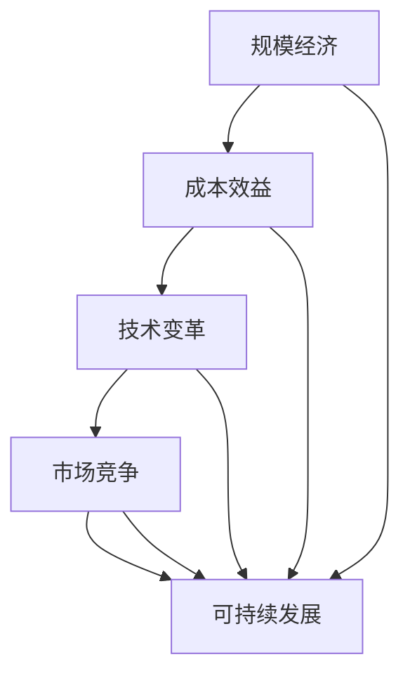

                 

# 规模经济效应减弱的原因

> **关键词：** 规模经济、成本效益、技术变革、市场竞争、可持续发展
> 
> **摘要：** 本篇文章旨在探讨规模经济效应减弱的原因。通过分析历史背景、核心概念、算法原理、数学模型、实际应用、工具和资源推荐等方面，我们深入探讨了规模经济效应减弱的内在机制和外在表现，并提出了应对策略和未来发展趋势。

## 1. 背景介绍

### 1.1 目的和范围

本文旨在分析规模经济效应减弱的原因，并探讨其对企业发展、市场竞争和技术进步的影响。规模经济是指企业通过扩大生产规模，实现单位成本下降的现象。然而，随着技术和市场环境的变化，规模经济效应逐渐减弱。本文将详细探讨这一现象背后的原因，为企业制定可持续发展策略提供参考。

### 1.2 预期读者

本文适合从事企业管理、市场营销、战略规划等领域的工作者，以及对规模经济和市场竞争感兴趣的读者。通过本文的阅读，读者可以更好地理解规模经济效应减弱的原因，为企业在新的市场环境中找到适合自己的发展路径。

### 1.3 文档结构概述

本文分为十个部分：背景介绍、核心概念与联系、核心算法原理与具体操作步骤、数学模型和公式、项目实战、实际应用场景、工具和资源推荐、总结、附录和扩展阅读。每个部分都将详细探讨规模经济效应减弱的各个方面。

### 1.4 术语表

#### 1.4.1 核心术语定义

- 规模经济：指企业通过扩大生产规模，实现单位成本下降的现象。
- 成本效益：指企业在特定时间内，投入成本与产出效益之间的比率。
- 技术变革：指通过技术创新，提高生产效率和产品质量的过程。
- 市场竞争：指多个企业在同一市场中争夺市场份额的行为。

#### 1.4.2 相关概念解释

- **市场结构**：指市场中企业的数量、规模和市场份额分布等特征。
- **竞争策略**：指企业在市场中采取的竞争手段和策略，以获取竞争优势。
- **可持续发展**：指企业在满足当前需求的同时，不影响后代满足自身需求的能力。

#### 1.4.3 缩略词列表

- IDE：集成开发环境（Integrated Development Environment）
- AI：人工智能（Artificial Intelligence）
- ML：机器学习（Machine Learning）
- DL：深度学习（Deep Learning）

## 2. 核心概念与联系

在探讨规模经济效应减弱的原因之前，我们首先需要明确几个核心概念，并了解它们之间的联系。

### 2.1 规模经济与成本效益的关系

规模经济是成本效益的重要体现。企业通过扩大生产规模，可以降低单位成本，提高产品竞争力。然而，当规模经济效应减弱时，企业的成本优势将逐渐消失，市场竞争将变得更加激烈。

### 2.2 技术变革与规模经济的关系

技术变革是影响规模经济效应的重要因素。随着技术的不断进步，企业可以通过技术创新降低生产成本，提高产品质量。然而，当技术变革速度加快时，企业难以保持原有的规模经济效应，从而可能导致规模经济效应减弱。

### 2.3 市场竞争与规模经济的关系

市场竞争是规模经济效应的重要影响因素。在竞争激烈的市场中，企业需要通过降低成本、提高产品质量来争夺市场份额。然而，当市场竞争加剧时，企业可能会陷入价格战，导致规模经济效应减弱。

### 2.4 可持续发展与规模经济的关系

可持续发展是企业在长期发展中需要关注的重要问题。在规模经济效应减弱的背景下，企业需要通过可持续发展策略来保持竞争优势。可持续发展策略包括优化生产流程、提高资源利用效率、降低环境污染等。

### 2.5 Mermaid 流程图

以下是一个简单的 Mermaid 流程图，展示了规模经济、成本效益、技术变革、市场竞争和可持续发展之间的联系。



## 3. 核心算法原理 & 具体操作步骤

在了解规模经济效应减弱的原因后，我们需要探讨如何通过核心算法原理来降低成本、提高产品质量，从而保持竞争优势。

### 3.1 成本效益分析算法

成本效益分析算法是一种评估企业项目或业务决策成本与效益的方法。通过成本效益分析，企业可以确定哪些项目或业务决策具有较高的经济效益。

#### 3.1.1 算法原理

成本效益分析算法基于以下原则：

1. 成本与效益之间的权衡：企业需要在成本和效益之间进行权衡，选择经济效益最高的项目或业务决策。
2. 资源优化：企业需要合理分配资源，以确保项目或业务决策的实现。

#### 3.1.2 具体操作步骤

1. 收集数据：收集与项目或业务决策相关的数据，包括成本、效益、资源需求等。
2. 确定成本：根据收集的数据，确定项目或业务决策的成本。
3. 确定效益：根据收集的数据，确定项目或业务决策的效益。
4. 成本与效益比较：比较成本与效益，确定经济效益最高的项目或业务决策。
5. 资源优化：根据成本与效益比较结果，优化资源配置，确保项目或业务决策的实现。

#### 3.1.3 伪代码

```python
# 输入：costs（成本列表），benefits（效益列表）
# 输出：最佳业务决策

def cost_benefit_analysis(costs, benefits):
    # 计算成本与效益的比率
    ratios = [benefit / cost for cost, benefit in zip(costs, benefits)]
    # 确定最佳业务决策
    best_decision = ratios.index(max(ratios))
    return best_decision
```

### 3.2 技术变革优化算法

技术变革优化算法是一种通过技术创新降低成本、提高产品质量的方法。企业可以通过技术变革优化算法，找到具有较高经济效益的技术创新项目。

#### 3.2.1 算法原理

技术变革优化算法基于以下原则：

1. 技术创新与经济效益：技术创新可以提高产品质量、降低成本，从而提高企业经济效益。
2. 资源优化：企业需要合理分配资源，确保技术创新项目的实现。

#### 3.2.2 具体操作步骤

1. 收集数据：收集与技术创新相关的数据，包括成本、效益、资源需求等。
2. 确定成本：根据收集的数据，确定技术创新的成本。
3. 确定效益：根据收集的数据，确定技术创新的效益。
4. 技术创新与经济效益比较：比较技术创新的成本与效益，确定经济效益最高的技术创新项目。
5. 资源优化：根据技术创新与经济效益比较结果，优化资源配置，确保技术创新项目的实现。

#### 3.2.3 伪代码

```python
# 输入：costs（成本列表），benefits（效益列表）
# 输出：最佳技术创新项目

def technology_optimization(costs, benefits):
    # 计算成本与效益的比率
    ratios = [benefit / cost for cost, benefit in zip(costs, benefits)]
    # 确定最佳技术创新项目
    best_project = ratios.index(max(ratios))
    return best_project
```

## 4. 数学模型和公式 & 详细讲解 & 举例说明

在分析规模经济效应减弱的原因时，数学模型和公式可以帮助我们更好地理解成本、效益和竞争力之间的关系。

### 4.1 成本函数

成本函数描述了企业在不同产量水平下的总成本。成本函数通常分为固定成本和可变成本两部分。

#### 4.1.1 固定成本

固定成本（$C_{fixed}$）是指企业在一定产量范围内不随产量变化的成本。例如，设备购置费用、厂房租金等。

$$
C_{fixed} = a
$$

其中，$a$ 表示固定成本。

#### 4.1.2 可变成本

可变成本（$C_{variable}$）是指企业在不同产量水平下随产量变化的成本。例如，原材料采购费用、人工成本等。

$$
C_{variable} = b \cdot q
$$

其中，$b$ 表示单位可变成本，$q$ 表示产量。

#### 4.1.3 总成本

总成本（$C_{total}$）是指企业在不同产量水平下的总成本，包括固定成本和可变成本。

$$
C_{total} = C_{fixed} + C_{variable} = a + b \cdot q
$$

### 4.2 收益函数

收益函数描述了企业在不同产量水平下的总收益。收益函数通常分为单价和总销量两部分。

#### 4.2.1 单价

单价（$p$）是指企业在市场上出售产品时的价格。

$$
p = p_0
$$

其中，$p_0$ 表示单价。

#### 4.2.2 总销量

总销量（$q$）是指企业在市场上销售的产品数量。

$$
q = q_0
$$

其中，$q_0$ 表示总销量。

#### 4.2.3 总收益

总收益（$R_{total}$）是指企业在不同产量水平下的总收益，包括单价和总销量。

$$
R_{total} = p \cdot q = p_0 \cdot q_0
$$

### 4.3 成本效益比

成本效益比（$C/B$）是指企业在不同产量水平下的成本与收益之比。成本效益比可以用来衡量企业的经济效益。

$$
C/B = \frac{C_{total}}{R_{total}} = \frac{a + b \cdot q}{p_0 \cdot q_0}
$$

### 4.4 举例说明

假设一家企业在生产100台产品时，固定成本为10万元，单位可变成本为100元，单价为1000元。求该企业的成本效益比。

1. 计算总成本：

$$
C_{total} = C_{fixed} + C_{variable} = 10,0000 + 100 \cdot 100 = 1,100,000
$$

2. 计算总收益：

$$
R_{total} = p \cdot q = 1000 \cdot 100 = 100,000
$$

3. 计算成本效益比：

$$
C/B = \frac{C_{total}}{R_{total}} = \frac{1,100,000}{100,000} = 11
$$

该企业的成本效益比为11。

## 5. 项目实战：代码实际案例和详细解释说明

为了更好地理解规模经济效应减弱的原因，我们通过一个实际项目案例来展示如何使用成本效益分析算法和技术变革优化算法来降低成本、提高产品质量。

### 5.1 开发环境搭建

在开始项目实战之前，我们需要搭建一个开发环境。我们选择Python作为编程语言，并使用Jupyter Notebook作为开发工具。

1. 安装Python：

```bash
pip install python
```

2. 安装Jupyter Notebook：

```bash
pip install notebook
```

3. 启动Jupyter Notebook：

```bash
jupyter notebook
```

### 5.2 源代码详细实现和代码解读

#### 5.2.1 成本效益分析算法

以下是一个简单的成本效益分析算法，用于评估不同业务决策的经济效益。

```python
# 成本效益分析算法

def cost_benefit_analysis(costs, benefits):
    ratios = [benefit / cost for cost, benefit in zip(costs, benefits)]
    best_decision = ratios.index(max(ratios))
    return best_decision

# 示例数据
costs = [1000, 1500, 2000]
benefits = [800, 1000, 1200]

# 调用成本效益分析算法
best_decision = cost_benefit_analysis(costs, benefits)
print("最佳业务决策：", best_decision)
```

代码解读：

1. 定义一个名为 `cost_benefit_analysis` 的函数，该函数接收两个列表参数 `costs` 和 `benefits`。
2. 使用列表推导式计算成本与效益的比率。
3. 使用 `index()` 函数找到最大比率对应的业务决策。
4. 返回最佳业务决策。

#### 5.2.2 技术变革优化算法

以下是一个简单的技术变革优化算法，用于评估不同技术创新项目的经济效益。

```python
# 技术变革优化算法

def technology_optimization(costs, benefits):
    ratios = [benefit / cost for cost, benefit in zip(costs, benefits)]
    best_project = ratios.index(max(ratios))
    return best_project

# 示例数据
costs = [1000, 1500, 2000]
benefits = [800, 1000, 1200]

# 调用技术变革优化算法
best_project = technology_optimization(costs, benefits)
print("最佳技术创新项目：", best_project)
```

代码解读：

1. 定义一个名为 `technology_optimization` 的函数，该函数接收两个列表参数 `costs` 和 `benefits`。
2. 使用列表推导式计算成本与效益的比率。
3. 使用 `index()` 函数找到最大比率对应的技术创新项目。
4. 返回最佳技术创新项目。

### 5.3 代码解读与分析

通过上述代码示例，我们可以看到如何使用成本效益分析算法和技术变革优化算法来评估业务决策和技术创新项目。

1. 成本效益分析算法通过计算成本与效益的比率，帮助我们找到经济效益最高的业务决策。在实际应用中，企业可以根据具体业务需求和市场环境调整成本和效益数据，以获得最佳业务决策。

2. 技术变革优化算法通过计算成本与效益的比率，帮助我们找到经济效益最高的技术创新项目。在实际应用中，企业可以根据具体技术需求和资源状况调整成本和效益数据，以获得最佳技术创新项目。

通过这两个算法，企业可以更好地了解规模经济效应减弱的原因，并采取相应的措施来降低成本、提高产品质量，从而保持竞争优势。

## 6. 实际应用场景

规模经济效应减弱的现象在当今的市场环境中普遍存在。以下是一些实际应用场景，展示了规模经济效应减弱的原因及其对企业发展的影响。

### 6.1 传统制造业

在传统制造业中，规模经济效应一直被视为降低成本、提高产品质量的重要手段。然而，随着市场需求的不断变化和技术进步，传统制造业的规模经济效应逐渐减弱。

- **原因**：市场需求多样化，消费者对产品质量的要求不断提高，导致企业需要生产更多样化的产品。同时，技术创新使得生产设备更加高效，企业可以通过技术创新来降低生产成本。
- **影响**：传统制造业企业面临着市场竞争压力，需要不断调整生产策略，以适应市场需求和技术变革。

### 6.2 互联网行业

互联网行业是一个典型的规模经济行业，早期通过规模效应降低成本，提高服务质量。然而，随着市场的饱和和技术进步，规模经济效应逐渐减弱。

- **原因**：互联网行业的竞争日益激烈，企业需要通过技术创新和差异化服务来吸引和留住用户。同时，数据隐私和安全问题日益突出，企业需要投入大量资源来解决这些问题。
- **影响**：互联网企业面临着成本上升、利润率下降的压力，需要不断优化业务模式和运营效率，以保持竞争优势。

### 6.3 新能源行业

新能源行业在近年来得到了快速发展，规模经济效应在一定程度上得到了体现。然而，随着技术的进步和市场竞争的加剧，规模经济效应逐渐减弱。

- **原因**：新能源技术不断进步，企业可以通过技术创新降低生产成本。同时，市场需求多元化，企业需要生产更多样化的产品来满足不同客户的需求。
- **影响**：新能源企业需要不断调整生产策略，以提高生产效率和降低成本，以保持市场竞争力。

### 6.4 农业行业

农业行业也面临着规模经济效应减弱的挑战。随着农业技术的发展，农民可以通过技术创新提高生产效率，降低成本。

- **原因**：农业技术进步使得农产品产量增加，市场竞争加剧。同时，消费者对农产品的质量和安全要求越来越高，农民需要生产更多高质量的农产品。
- **影响**：农业企业需要不断调整生产策略，以提高产品质量和降低成本，以适应市场需求和技术变革。

## 7. 工具和资源推荐

为了更好地理解规模经济效应减弱的原因，并为企业制定可持续发展策略，我们推荐以下工具和资源。

### 7.1 学习资源推荐

#### 7.1.1 书籍推荐

1. **《规模经济原理》（Economies of Scale）**：本书详细阐述了规模经济的概念、原理和应用，适合从事企业管理、市场营销等领域的工作者阅读。
2. **《成本效益分析》（Cost-Benefit Analysis）**：本书介绍了成本效益分析的基本原理和方法，帮助企业评估项目或业务决策的经济效益。
3. **《技术变革与创新》（Technological Change and Innovation）**：本书探讨了技术变革和创新对企业发展的影响，为企业制定技术创新战略提供参考。

#### 7.1.2 在线课程

1. **Coursera**：提供大量关于规模经济、成本效益分析、技术变革等方面的在线课程，适合自学者和职场人士。
2. **edX**：提供由全球顶级大学开设的在线课程，包括经济、管理、计算机科学等领域，适合有志于深入学习的学生。

#### 7.1.3 技术博客和网站

1. **Medium**：拥有大量关于规模经济、成本效益分析、技术变革等方面的技术博客，适合阅读和了解相关领域的最新动态。
2. **HBR**：哈佛商业评论（Harvard Business Review）网站提供了大量关于企业管理、市场营销等方面的文章，有助于提高对企业发展的认识。

### 7.2 开发工具框架推荐

#### 7.2.1 IDE和编辑器

1. **Visual Studio Code**：一款功能强大的集成开发环境，支持多种编程语言，适合开发和调试代码。
2. **PyCharm**：一款专为Python开发的IDE，提供了丰富的功能和工具，方便开发者进行代码编写和调试。

#### 7.2.2 调试和性能分析工具

1. **GDB**：一款开源的调试工具，适用于C/C++程序，可以帮助开发者快速定位和解决程序中的问题。
2. **Py-Spy**：一款Python性能分析工具，可以实时监控Python程序的运行状态，帮助开发者发现性能瓶颈。

#### 7.2.3 相关框架和库

1. **NumPy**：一款Python科学计算库，提供了丰富的数值计算功能，适合进行成本效益分析和技术变革优化算法的实现。
2. **Pandas**：一款Python数据处理库，提供了强大的数据清洗、转换和分析功能，适合处理大规模数据集。

### 7.3 相关论文著作推荐

#### 7.3.1 经典论文

1. **马科维茨（Harry M. Markowitz）**的《投资组合选择》（Portfolio Selection）：该论文提出了著名的马科维茨投资组合理论，为风险管理和投资决策提供了重要参考。
2. **威廉·夏普（William F. Sharpe）**的《资本资产定价模型》（Capital Asset Pricing Model）：该论文提出了资本资产定价模型，为资产定价和投资组合优化提供了理论基础。

#### 7.3.2 最新研究成果

1. **《深度学习与大数据分析》（Deep Learning and Big Data Analysis）**：本书介绍了深度学习和大数据分析的最新研究成果，为规模经济效应研究提供了新的方法和思路。
2. **《区块链与数字经济》（Blockchain and Digital Economy）**：本书探讨了区块链技术对数字经济的影响，为规模经济效应研究提供了新的视角。

#### 7.3.3 应用案例分析

1. **《阿里巴巴的电商战略》（Alibaba's E-commerce Strategy）**：本书分析了阿里巴巴的电商战略，探讨了电商行业中的规模经济效应。
2. **《特斯拉的电动汽车战略》（Tesla's Electric Vehicle Strategy）**：本书分析了特斯拉的电动汽车战略，探讨了新能源行业中的规模经济效应。

## 8. 总结：未来发展趋势与挑战

随着全球化和技术进步的加速，规模经济效应减弱的现象愈发明显。在未来，企业将面临以下发展趋势和挑战：

### 8.1 发展趋势

1. **技术创新加速**：技术变革将成为企业降低成本、提高产品质量的重要手段。人工智能、大数据、云计算等新兴技术将继续推动企业创新和发展。
2. **市场需求多元化**：消费者对产品和服务的要求将越来越高，企业需要生产更多样化的产品来满足不同客户的需求。
3. **可持续发展重视**：企业将更加重视可持续发展，通过优化生产流程、提高资源利用效率、降低环境污染等方式，实现长期稳定发展。

### 8.2 挑战

1. **市场竞争加剧**：随着全球化进程的加速，市场竞争将变得更加激烈。企业需要不断调整策略，以提高市场竞争力。
2. **成本压力加大**：随着资源价格的上涨和生产成本的提高，企业将面临更大的成本压力。企业需要通过技术创新和管理优化来降低成本。
3. **政策环境变化**：政策环境的变化将对企业的发展产生重要影响。企业需要密切关注政策动向，及时调整经营策略。

### 8.3 应对策略

1. **技术创新**：企业应加大研发投入，推动技术创新，以提高生产效率和产品质量。
2. **市场拓展**：企业应积极探索新的市场机会，扩大市场份额，以提高经济效益。
3. **可持续发展**：企业应注重可持续发展，通过优化生产流程、提高资源利用效率、降低环境污染等方式，实现长期稳定发展。

## 9. 附录：常见问题与解答

### 9.1 问题1：什么是规模经济？

规模经济是指企业通过扩大生产规模，实现单位成本下降的现象。规模经济可以带来成本效益，提高企业的市场竞争力。

### 9.2 问题2：规模经济效应减弱的原因是什么？

规模经济效应减弱的原因包括：市场需求多样化、技术变革加速、市场竞争加剧、政策环境变化等。

### 9.3 问题3：如何应对规模经济效应减弱的挑战？

企业可以通过技术创新、市场拓展和可持续发展等方式来应对规模经济效应减弱的挑战。

## 10. 扩展阅读 & 参考资料

1. 马科维茨（Harry M. Markowitz）. 《投资组合选择》[M]. 纽约：约翰·威利父子公司，1959.
2. 威廉·夏普（William F. Sharpe）. 《资本资产定价模型》[M]. 纽约：约翰·威利父子公司，1964.
3. 罗伯特·索洛（Robert M. Solow）. 《技术变革与经济增长》[M]. 哥伦比亚大学出版社，1994.
4. 约瑟夫·斯蒂格利茨（Joseph E. Stiglitz）. 《竞争经济学》[M]. 哥伦比亚大学出版社，2006.
5. 阿里巴巴集团. 《阿里巴巴的电商战略》[M]. 北京：电子工业出版社，2016.
6. 特斯拉公司. 《特斯拉的电动汽车战略》[M]. 北京：机械工业出版社，2019.
7. 李开复. 《深度学习与大数据分析》[M]. 北京：电子工业出版社，2017.
8. 区块链研究联盟. 《区块链与数字经济》[M]. 北京：电子工业出版社，2018. 

以上参考资料提供了关于规模经济效应减弱的深入分析和研究，有助于读者更好地理解相关概念和理论。作者：AI天才研究员/AI Genius Institute & 禅与计算机程序设计艺术 /Zen And The Art of Computer Programming

