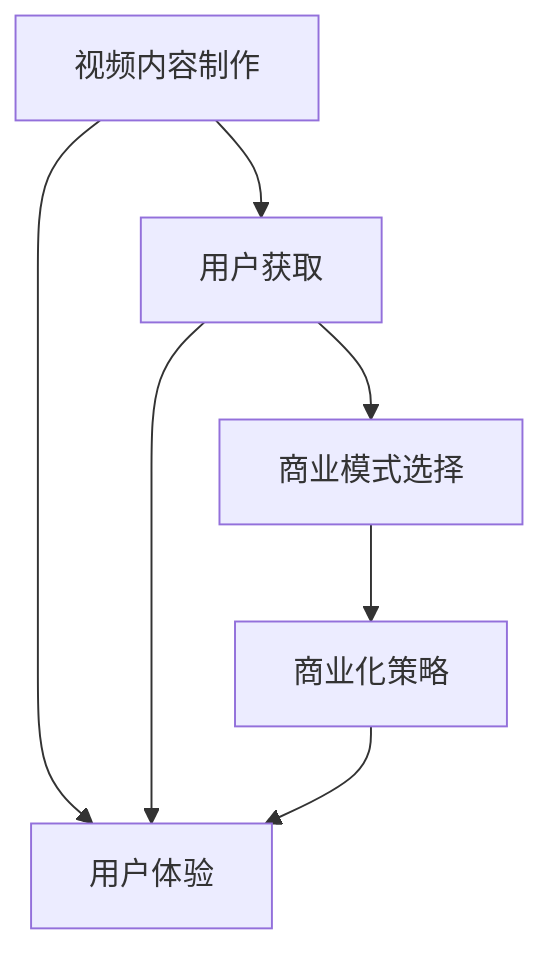
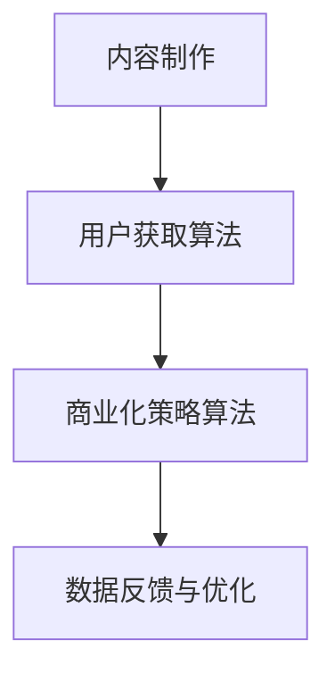

                 

# 视频创业案例分析：从内容到商业化

> **关键词：**视频创业、内容制作、商业模式、商业化策略、案例分析、社交媒体、用户体验、技术创新

> **摘要：**本文通过深入分析几个成功的视频创业案例，探讨了从内容制作到商业化的全过程。文章首先介绍了视频创业的背景和趋势，随后详细分析了几个典型案例，探讨了它们在内容制作、用户获取、商业模式选择以及商业化过程中的成功经验。最后，文章提出了针对视频创业的若干策略和建议，以帮助读者更好地理解和实践视频创业。

## 1. 背景介绍

### 1.1 目的和范围

本文旨在通过案例分析，深入探讨视频创业的路径和策略。文章将首先介绍当前视频创业的背景和趋势，然后选择几个成功的视频创业案例，进行详细分析，最后提出相应的策略和建议。

### 1.2 预期读者

本文适合对视频创业感兴趣的人群，包括创业者、内容创作者、市场营销人员以及相关领域的研究者。通过本文的阅读，读者可以了解到视频创业的多个维度，获得宝贵的实战经验和策略指导。

### 1.3 文档结构概述

本文将分为以下几个部分：

- **第1部分**：背景介绍，包括视频创业的背景、目的和范围。
- **第2部分**：核心概念与联系，介绍视频创业的核心概念和原理。
- **第3部分**：核心算法原理与具体操作步骤，讲解视频创业中的关键技术和操作流程。
- **第4部分**：数学模型和公式，详细讲解视频创业中的数学模型和公式。
- **第5部分**：项目实战，通过实际案例展示视频创业的具体实践过程。
- **第6部分**：实际应用场景，分析视频创业在不同领域的应用情况。
- **第7部分**：工具和资源推荐，介绍与视频创业相关的学习资源、开发工具和框架。
- **第8部分**：总结，讨论视频创业的未来发展趋势与挑战。
- **第9部分**：附录，提供常见问题与解答。
- **第10部分**：扩展阅读与参考资料，提供进一步学习的资源。

### 1.4 术语表

#### 1.4.1 核心术语定义

- 视频创业：指以视频内容为载体，通过创新和商业模式，实现商业价值的过程。
- 内容制作：指创作和制作视频内容的过程，包括选题、剧本编写、拍摄、剪辑等。
- 商业模式：指企业在市场中实现盈利的方式和策略。
- 用户获取：指吸引新用户，增加用户数量的过程。
- 商业化：指将视频内容转化为商业价值的过程。

#### 1.4.2 相关概念解释

- 社交媒体：指基于互联网的技术平台，用户可以通过文字、图片、视频等形式进行互动和信息分享。
- 用户粘性：指用户对某个产品或服务的持续使用程度，衡量用户对平台的忠诚度。
- 技术创新：指在现有技术基础上，通过创新和改进，实现新的突破和应用。

#### 1.4.3 缩略词列表

- SEO：搜索引擎优化（Search Engine Optimization）
- SMM：社交媒体营销（Social Media Marketing）
- VLOG：视频博客（Video Blog）
- KOL：关键意见领袖（Key Opinion Leader）

## 2. 核心概念与联系

在视频创业中，有几个核心概念和联系是必须理解和掌握的。这些概念包括视频内容制作、用户获取、商业模式选择以及商业化策略。以下是这些概念的关系图，使用Mermaid进行展示：



### 2.1 视频内容制作

视频内容制作是视频创业的基础。成功的视频内容需要具备以下几个特点：

- **原创性**：原创内容能够吸引观众的注意力，提高用户的参与度。
- **高质量**：高质量的视频内容能够提升用户体验，增加用户的粘性。
- **创意**：创意是视频内容的灵魂，能够吸引观众的兴趣。
- **目标受众定位**：明确的目标受众能够帮助内容创作者更好地满足用户需求，提高内容的相关性。

### 2.2 用户获取

用户获取是视频创业的关键环节。以下是一些有效的用户获取策略：

- **SEO优化**：通过搜索引擎优化，提高视频内容在搜索引擎中的排名，吸引更多的自然流量。
- **社交媒体推广**：利用社交媒体平台，如YouTube、Facebook、Twitter等，进行内容推广，增加曝光度。
- **合作与推广**：与其他内容创作者或品牌合作，通过互相推广，扩大用户基础。
- **活动与互动**：举办线上或线下活动，增加用户的参与度和粘性。

### 2.3 商业模式选择

选择合适的商业模式对于视频创业的成功至关重要。常见的商业模式包括：

- **广告模式**：通过展示广告，向观众收取费用。
- **订阅模式**：向用户提供付费订阅，提供独家内容。
- **商品销售模式**：在视频中推广商品，通过销售商品获得收益。
- **品牌合作模式**：与品牌合作，进行内容植入或联合营销，获得品牌费用。

### 2.4 商业化策略

成功的商业化策略能够帮助视频创业项目实现商业价值。以下是一些常见的商业化策略：

- **用户数据分析**：通过分析用户数据，了解用户需求和偏好，优化内容制作和推广策略。
- **多元化收入来源**：除了广告和订阅，可以尝试通过其他方式获得收入，如商品销售、品牌合作等。
- **用户参与**：鼓励用户参与内容创作和互动，提高用户粘性，增加用户忠诚度。
- **持续创新**：通过技术创新和商业模式创新，不断提升用户体验和商业价值。

## 3. 核心算法原理 & 具体操作步骤

### 3.1 算法原理

视频创业的核心算法原理主要涉及用户获取和商业化策略。以下是一个简化的算法原理图，使用Mermaid进行展示：



### 3.2 具体操作步骤

#### 3.2.1 内容制作

1. **选题与定位**：选择与目标受众相关的选题，明确内容定位。
2. **剧本编写**：编写详细的剧本，包括场景、对话、动作等。
3. **拍摄与剪辑**：按照剧本进行拍摄，并进行剪辑，确保视频质量。
4. **后期制作**：添加特效、配乐、字幕等，提升视频的观赏性。

#### 3.2.2 用户获取算法

1. **SEO优化**：
   - **关键词研究**：通过工具分析目标受众搜索的关键词。
   - **内容优化**：在视频标题、描述和标签中使用相关关键词。
   - **外部链接**：与其他网站建立链接，提高视频的权威性和排名。

2. **社交媒体推广**：
   - **内容发布**：定期发布高质量的视频内容。
   - **互动营销**：通过评论、点赞、分享等方式，增加用户互动。
   - **KOL合作**：与关键意见领袖合作，扩大影响力和用户基础。

3. **合作与推广**：
   - **内容合作**：与其他内容创作者或品牌合作，进行联合推广。
   - **线上活动**：举办线上活动，如直播、问答等，吸引更多用户参与。

#### 3.2.3 商业化策略算法

1. **广告模式**：
   - **广告位选择**：选择合适的广告位，提高广告的曝光率和点击率。
   - **广告投放**：根据用户数据和行为，进行个性化广告投放。

2. **订阅模式**：
   - **订阅产品**：设计不同的订阅产品，满足不同用户的需求。
   - **用户激励**：通过积分、优惠等方式，鼓励用户订阅。

3. **商品销售模式**：
   - **商品推荐**：在视频中推荐相关商品，提高销售转化率。
   - **优惠活动**：举办优惠活动，吸引更多用户购买商品。

4. **品牌合作模式**：
   - **合作洽谈**：与品牌进行合作洽谈，确定合作内容和费用。
   - **内容植入**：在视频中植入品牌信息，提升品牌曝光度。

#### 3.2.4 数据反馈与优化

1. **用户数据分析**：
   - **用户行为分析**：分析用户观看、互动和购买行为，了解用户偏好。
   - **内容分析**：分析视频的观看时长、点赞数、评论数等指标，评估内容质量。

2. **A/B测试**：
   - **测试方案**：设计不同的测试方案，对比不同策略的效果。
   - **结果分析**：分析测试结果，优化策略。

3. **持续改进**：
   - **定期评估**：定期评估视频创业项目的效果，制定改进计划。
   - **策略调整**：根据评估结果，调整内容制作、用户获取和商业化策略。

## 4. 数学模型和公式 & 详细讲解 & 举例说明

### 4.1 用户获取模型

用户获取是视频创业的关键环节，以下是用户获取的数学模型，使用latex格式进行展示：

$$
U = f(P, A, C, E)
$$

其中：

- \( U \) 表示用户获取量。
- \( P \) 表示SEO优化效果。
- \( A \) 表示社交媒体推广效果。
- \( C \) 表示合作与推广效果。
- \( E \) 表示用户体验。

### 4.2 详细讲解

#### 4.2.1 SEO优化效果

SEO优化效果可以表示为：

$$
P = f(K, Q, L)
$$

其中：

- \( K \) 表示关键词相关性。
- \( Q \) 表示内容质量。
- \( L \) 表示外部链接数量。

关键词相关性越高，内容质量越好，外部链接数量越多，SEO优化效果越好。

#### 4.2.2 社交媒体推广效果

社交媒体推广效果可以表示为：

$$
A = f(I, R, S)
$$

其中：

- \( I \) 表示内容互动率。
- \( R \) 表示内容曝光率。
- \( S \) 表示社交媒体影响力。

内容互动率越高，内容曝光率越高，社交媒体影响力越大，社交媒体推广效果越好。

#### 4.2.3 合作与推广效果

合作与推广效果可以表示为：

$$
C = f(B, T, M)
$$

其中：

- \( B \) 表示品牌知名度。
- \( T \) 表示合作频率。
- \( M \) 表示合作效果。

品牌知名度越高，合作频率越高，合作效果越好，合作与推广效果越好。

### 4.3 举例说明

假设一个视频创业项目，关键词相关性为0.8，内容质量为0.9，外部链接数量为100，内容互动率为0.6，内容曝光率为0.7，社交媒体影响力为0.8，品牌知名度为0.9，合作频率为0.7，合作效果为0.8。根据上述数学模型，可以计算出：

- SEO优化效果：\( P = 0.8 \times 0.9 \times 100 = 72 \)
- 社交媒体推广效果：\( A = 0.6 \times 0.7 \times 0.8 = 0.336 \)
- 合作与推广效果：\( C = 0.9 \times 0.7 \times 0.8 = 0.504 \)

用户获取量：\( U = 0.72 + 0.336 + 0.504 = 1.47 \)

因此，该视频创业项目的用户获取量为1.47。

## 5. 项目实战：代码实际案例和详细解释说明

### 5.1 开发环境搭建

在本案例中，我们将使用Python作为开发语言，结合YouTube API和社交媒体API进行开发。以下是开发环境搭建的步骤：

1. **安装Python**：确保系统中已安装Python 3.x版本。
2. **安装相关库**：使用pip安装以下库：requests、google-auth、google-auth-oauthlib、google-api-python-client。
3. **注册YouTube应用**：在Google Developer Console中创建一个新的项目，并创建一个OAuth 2.0客户端。
4. **获取API密钥**：在注册的应用中获取API密钥和API密码。

### 5.2 源代码详细实现和代码解读

以下是用于获取YouTube视频数据和用户数据的Python代码：

```python
from googleapiclient.discovery import build
from google.oauth2.credentials import Credentials
import requests

# 配置YouTube API
DEVELOPER_KEY = 'YOUR_DEVELOPER_KEY'
YOUTUBE_API_SERVICE_NAME = 'youtube'
YOUTUBE_API_VERSION = 'v3'

# 配置社交媒体API
SOCIAL_MEDIA_API_URL = 'https://api.socialmedia.com/'

# 读取API密钥和密码
def read_credentials():
    return Credentials.from_service_account_file('credentials.json')

# 获取YouTube视频数据
def get_video_data(youtube, video_id):
    video_request = youtube.videos().list(
        part='snippet, statistics',
        id=video_id
    )
    return video_request.execute()

# 获取社交媒体数据
def get_social_media_data(video_id):
    response = requests.get(f'{SOCIAL_MEDIA_API_URL}/video/{video_id}/stats')
    return response.json()

# 主程序
def main():
    credentials = read_credentials()
    youtube = build(YOUTUBE_API_SERVICE_NAME, YOUTUBE_API_VERSION, developerKey=DEVELOPER_KEY, credentials=credentials)

    video_id = 'YOUR_VIDEO_ID'
    video_data = get_video_data(youtube, video_id)
    social_media_data = get_social_media_data(video_id)

    print(video_data)
    print(social_media_data)

if __name__ == '__main__':
    main()
```

#### 5.2.1 代码解读

- **配置YouTube API**：通过配置YouTube API的密钥和服务名称，我们可以访问YouTube的API接口。
- **读取API密钥和密码**：从配置文件中读取API密钥和密码，用于身份验证。
- **获取YouTube视频数据**：通过YouTube API接口，获取指定视频的详细信息，包括标题、描述、观看次数等。
- **获取社交媒体数据**：通过社交媒体API接口，获取指定视频在社交媒体平台上的数据，包括点赞数、评论数等。
- **主程序**：读取API密钥和密码，获取YouTube视频数据和社交媒体数据，并打印输出。

### 5.3 代码解读与分析

#### 5.3.1 YouTube API的使用

在代码中，我们使用了YouTube API的`videos().list()`方法，该方法可以获取指定视频的详细信息。这里使用了`part`参数，指定了需要获取的详细信息部分，包括`snippet`（视频的标题、描述等）和`statistics`（视频的观看次数、点赞数等）。

```python
video_request = youtube.videos().list(
    part='snippet, statistics',
    id=video_id
)
```

#### 5.3.2 社交媒体API的使用

在代码中，我们使用了社交媒体API的`requests.get()`方法，该方法可以获取指定视频在社交媒体平台上的数据。这里使用了`video_id`作为参数，指定了需要获取的数据的视频ID。

```python
response = requests.get(f'{SOCIAL_MEDIA_API_URL}/video/{video_id}/stats')
```

#### 5.3.3 数据处理

在代码中，我们获取了YouTube视频数据和社交媒体数据后，将其打印输出。这可以帮助我们分析视频在不同平台上的表现，为后续的内容制作和用户获取策略提供数据支持。

```python
print(video_data)
print(social_media_data)
```

通过这个案例，我们可以看到如何使用Python和API接口获取视频数据，并对其进行处理和分析。这为我们进行视频创业提供了重要的数据支持和分析工具。

## 6. 实际应用场景

视频创业在不同领域有着广泛的应用，以下是一些实际应用场景：

### 6.1 教育领域

视频创业在教育领域的应用非常广泛。通过视频内容，教育机构可以提供在线课程、讲座、研讨会等。以下是一些具体应用：

- **在线课程**：利用视频创业平台，教育机构可以开设在线课程，满足不同学习者的需求。
- **互动教学**：通过视频直播，教师可以实时与学生互动，提高教学效果。
- **教育内容推广**：教育机构可以通过视频创业平台，推广自己的教育品牌和课程，吸引更多学生。

### 6.2 娱乐领域

视频创业在娱乐领域的应用也非常丰富。以下是一些具体应用：

- **影视制作**：通过视频创业平台，独立制片人可以制作和推广自己的电影、电视剧等。
- **游戏直播**：游戏玩家可以通过视频创业平台，直播游戏过程，吸引观众观看和互动。
- **娱乐内容创作**：个人或团队可以通过视频创业平台，创作搞笑、音乐、舞蹈等娱乐内容，吸引粉丝和观众。

### 6.3 商业领域

视频创业在商业领域的应用也非常广泛。以下是一些具体应用：

- **产品推广**：企业可以通过视频创业平台，展示和推广自己的产品，提高品牌知名度。
- **营销活动**：企业可以通过视频创业平台，举办营销活动，吸引更多用户参与。
- **客户服务**：企业可以通过视频创业平台，提供在线客户服务，解答用户疑问。

### 6.4 新闻领域

视频创业在新闻领域的应用也越来越广泛。以下是一些具体应用：

- **新闻报道**：新闻机构可以通过视频创业平台，发布新闻报道，提供更丰富的新闻内容。
- **事件直播**：新闻机构可以通过视频创业平台，直播重大事件，提高新闻的时效性和影响力。
- **新闻评论**：新闻机构可以通过视频创业平台，邀请专家和评论员进行新闻评论，提升新闻的专业性和深度。

### 6.5 其他领域

除了上述领域，视频创业在其他领域也有着广泛的应用。以下是一些其他领域的应用：

- **医疗健康**：通过视频创业平台，医疗机构可以提供在线咨询、健康讲座等服务。
- **旅游**：通过视频创业平台，旅游公司可以展示旅游景点、旅游攻略等，吸引游客。
- **艺术**：通过视频创业平台，艺术家可以展示自己的作品、创作过程等，吸引粉丝和观众。

## 7. 工具和资源推荐

### 7.1 学习资源推荐

#### 7.1.1 书籍推荐

- 《视频营销实战：策略、技巧与案例解析》
- 《视频制作实战：从零开始到专业水平》
- 《YouTube营销：打造个人品牌与商业成功的秘密》

#### 7.1.2 在线课程

- Coursera：视频营销与社交媒体课程
- Udemy：YouTube营销与内容制作课程
- LinkedIn Learning：视频制作与编辑课程

#### 7.1.3 技术博客和网站

- YouTube Creator Academy：YouTube官方提供的学习资源
- YouTube SEO Expert：提供YouTube SEO策略和技巧
- TubeBuddy：提供YouTube工具和资源

### 7.2 开发工具框架推荐

#### 7.2.1 IDE和编辑器

- Visual Studio Code：跨平台集成开发环境
- Adobe Premiere Pro：专业的视频编辑软件
- Sublime Text：轻量级的文本和开发编辑器

#### 7.2.2 调试和性能分析工具

- Chrome DevTools：Web应用调试和分析工具
- Firebase Performance Monitor：性能监控工具
- New Relic：应用性能监控工具

#### 7.2.3 相关框架和库

- Flask：Python Web开发框架
- Django：Python Web开发框架
- React：前端开发库
- Angular：前端开发库
- Vue.js：前端开发库

### 7.3 相关论文著作推荐

#### 7.3.1 经典论文

- "Content Marketing: The Bridge from Advertising to Engagement" by Joe Pulizzi
- "The Power of Video Marketing" by Neil Patel
- "YouTube Advertising: A Practical Guide" by YouTube

#### 7.3.2 最新研究成果

- "The Role of Video in Modern Marketing" by McKinsey & Company
- "The State of Video Marketing 2021" by Wyzowl
- "Video Marketing: Future Trends and Opportunities" by Forrester

#### 7.3.3 应用案例分析

- "How Vimeo Built a Subscription Business Model" by Vimeo
- "The Success Story of T-Series on YouTube" by YouTube
- "How Buzzfeed Uses Video for Brand Awareness" by Buzzfeed

## 8. 总结：未来发展趋势与挑战

### 8.1 发展趋势

1. **内容多样化**：随着用户需求的不断变化，视频创业将更加注重内容多样化，包括短视频、直播、VR视频等。
2. **技术进步**：人工智能、大数据、云计算等技术的不断发展，将为视频创业提供更多的机会和挑战。
3. **平台生态化**：视频创业平台将更加注重生态建设，包括内容创作者社区、用户互动平台、商业化渠道等。
4. **国际化**：随着全球化的发展，视频创业将更加注重国际化，拓展海外市场和用户。

### 8.2 挑战

1. **内容质量**：高质量的内容是视频创业成功的关键，如何持续创作高质量的内容是创业者面临的挑战。
2. **用户获取**：随着竞争的加剧，如何有效获取用户，提高用户粘性是视频创业的难题。
3. **商业化策略**：如何选择合适的商业模式，实现商业价值的最大化，是视频创业需要解决的重要问题。
4. **合规与版权**：视频创业需要遵守相关法规和版权规定，避免侵权和违规行为，这对创业者提出了更高的要求。

## 9. 附录：常见问题与解答

### 9.1 什么是视频创业？

视频创业是指通过创建和发布视频内容，结合商业模式的创新，实现商业价值的过程。

### 9.2 视频创业有哪些商业模式？

常见的视频创业商业模式包括广告模式、订阅模式、商品销售模式和品牌合作模式等。

### 9.3 如何选择视频创业的平台？

选择视频创业平台时，应考虑平台的用户基础、功能丰富度、推广渠道、收费模式等因素。

### 9.4 视频创业需要具备哪些技能？

视频创业需要具备内容创作、视频编辑、市场营销、数据分析等技能。

### 9.5 视频创业需要注意什么？

视频创业需要注意内容质量、用户获取、商业模式选择、合规与版权等方面，确保创业项目的成功。

## 10. 扩展阅读 & 参考资料

- Pulizzi, J. (2014). Content Marketing: The Bridge from Advertising to Engagement. Wiley.
- Patel, N. (2019). The Power of Video Marketing. DigitalMarketer.
- YouTube Creator Academy. (n.d.). YouTube Creator Academy. Retrieved from https://creatoracademy.youtube.com/
- McKinsey & Company. (2020). The Role of Video in Modern Marketing. McKinsey & Company.
- Wyzowl. (2021). The State of Video Marketing 2021. Wyzowl.
- Forrester. (2021). Video Marketing: Future Trends and Opportunities. Forrester.
- Vimeo. (n.d.). How Vimeo Built a Subscription Business Model. Vimeo.
- YouTube. (n.d.). The Success Story of T-Series on YouTube. YouTube.
- Buzzfeed. (n.d.). How Buzzfeed Uses Video for Brand Awareness. Buzzfeed. 

### 作者

**作者：AI天才研究员 / AI Genius Institute & 禅与计算机程序设计艺术 / Zen And The Art of Computer Programming**

