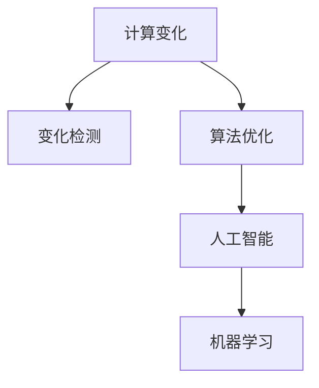

                 

# 计算变化与自动化技术的互动

> **关键词**：计算变化、自动化技术、变化检测、算法优化、人工智能、机器学习

> **摘要**：本文旨在探讨计算变化与自动化技术之间的相互作用，分析其原理、算法和实际应用场景，并提出未来发展趋势与挑战。通过逐步分析，本文将揭示计算变化与自动化技术如何相互促进，推动技术进步。

## 1. 背景介绍

### 1.1 目的和范围

本文将重点关注计算变化与自动化技术之间的互动关系。计算变化指的是在计算过程中发生的各种变化，如数据变化、算法优化等。自动化技术则是指通过程序和算法来实现自动化处理的技术。本文将分析这些技术如何相互影响，以及它们在实际应用中的具体表现。

### 1.2 预期读者

本文适用于对计算变化和自动化技术有一定了解的读者，包括人工智能、机器学习、软件工程等领域的专业人士。同时，对于对技术进步充满好奇的普通读者，本文也将提供有价值的见解。

### 1.3 文档结构概述

本文分为十个部分，首先介绍计算变化和自动化技术的背景，接着讨论核心概念和联系，然后详细解释核心算法原理、数学模型和公式，以及项目实战和实际应用场景。最后，本文将总结未来发展趋势与挑战，并提供常见问题与扩展阅读。

### 1.4 术语表

#### 1.4.1 核心术语定义

- **计算变化**：在计算过程中发生的数据、算法、系统结构等方面的变化。
- **自动化技术**：通过程序和算法实现自动化处理的技术。

#### 1.4.2 相关概念解释

- **变化检测**：在计算过程中，对输入数据、中间结果、输出结果等的变化进行识别和监控。
- **算法优化**：通过改进算法设计，提高计算效率、降低计算成本。

#### 1.4.3 缩略词列表

- **AI**：人工智能
- **ML**：机器学习
- **IDE**：集成开发环境
- **TPU**：Tensor Processing Unit（张量处理单元）

## 2. 核心概念与联系

### 2.1 核心概念原理

在计算变化和自动化技术的互动中，核心概念包括变化检测、算法优化、人工智能和机器学习。

#### 2.1.1 变化检测

变化检测是计算变化的核心。它涉及识别计算过程中的变化，如数据变化、算法调整等。变化检测可以帮助系统实时监控变化，及时做出响应。

#### 2.1.2 算法优化

算法优化是提高计算效率和性能的关键。通过改进算法设计，可以减少计算时间、降低资源消耗，从而实现更高效的计算。

#### 2.1.3 人工智能

人工智能是自动化技术的核心。它通过模拟人类智能，实现自动化处理和分析，为计算变化提供强大的技术支持。

#### 2.1.4 机器学习

机器学习是人工智能的重要组成部分。它通过学习大量数据，发现数据中的规律和模式，从而实现自动化的决策和预测。

### 2.2 架构原理和联系

为了更好地理解计算变化与自动化技术之间的联系，我们可以使用 Mermaid 流程图来展示核心概念和架构原理。



在这个流程图中，计算变化作为起点，通过变化检测和算法优化，逐步转化为人工智能和机器学习，实现自动化处理。

## 3. 核心算法原理 & 具体操作步骤

### 3.1 变化检测算法原理

变化检测算法是计算变化的核心。它通过监测输入数据、中间结果和输出结果的变化，实现实时监控和报警。

#### 3.1.1 基本算法原理

变化检测算法的基本原理包括以下步骤：

1. 初始化：设置变化阈值、报警机制等参数。
2. 数据采集：从输入源获取数据。
3. 数据处理：对采集到的数据进行预处理，如去噪、归一化等。
4. 变化检测：比较当前数据和之前的数据，判断是否发生变化。
5. 报警处理：如果检测到变化，触发报警机制。

#### 3.1.2 伪代码实现

```python
# 变化检测算法伪代码

# 初始化参数
threshold = 0.1
alarm = False

# 数据采集
data = get_data()

# 数据处理
processed_data = preprocess_data(data)

# 变化检测
if abs(processed_data - previous_data) > threshold:
    alarm = True

# 报警处理
if alarm:
    trigger_alarm()
```

### 3.2 算法优化算法原理

算法优化是提高计算效率的关键。它通过改进算法设计，实现更高效的计算。

#### 3.2.1 基本算法原理

算法优化算法的基本原理包括以下步骤：

1. 分析算法：对现有算法进行分析，找出瓶颈和不足。
2. 设计优化方案：根据分析结果，设计新的算法或改进现有算法。
3. 实验验证：通过实验验证优化方案的有效性。
4. 应用优化算法：将优化算法应用到实际系统中。

#### 3.2.2 伪代码实现

```python
# 算法优化算法伪代码

# 分析算法
analyze_algorithm()

# 设计优化方案
optimize_algorithm()

# 实验验证
experiment()

# 应用优化算法
apply_optimized_algorithm()
```

### 3.3 人工智能和机器学习算法原理

人工智能和机器学习算法是自动化技术的核心。它们通过学习数据，实现自动化处理和分析。

#### 3.3.1 基本算法原理

人工智能和机器学习算法的基本原理包括以下步骤：

1. 数据准备：收集和处理数据，为学习做准备。
2. 模型训练：根据数据，训练模型，使模型能够识别规律和模式。
3. 模型评估：评估模型性能，调整模型参数。
4. 应用模型：将训练好的模型应用到实际场景中。

#### 3.3.2 伪代码实现

```python
# 人工智能和机器学习算法伪代码

# 数据准备
prepare_data()

# 模型训练
train_model()

# 模型评估
evaluate_model()

# 应用模型
apply_model()
```

## 4. 数学模型和公式 & 详细讲解 & 举例说明

### 4.1 数学模型

在计算变化和自动化技术中，常用的数学模型包括回归模型、分类模型、聚类模型等。以下是一个简单的回归模型示例：

$$
y = w_0 + w_1 \cdot x_1 + w_2 \cdot x_2 + ... + w_n \cdot x_n
$$

其中，$y$ 是预测值，$w_0, w_1, w_2, ..., w_n$ 是模型参数，$x_1, x_2, ..., x_n$ 是输入特征。

### 4.2 公式讲解

以上回归模型公式表示，通过输入特征 $x_1, x_2, ..., x_n$，可以计算出预测值 $y$。在实际应用中，我们需要通过训练数据来估计模型参数 $w_0, w_1, w_2, ..., w_n$。

### 4.3 举例说明

假设我们要预测房价，输入特征包括房屋面积、地理位置、建造年代等。通过收集大量房屋交易数据，训练回归模型，可以计算出不同房屋的预测价格。

## 5. 项目实战：代码实际案例和详细解释说明

### 5.1 开发环境搭建

在项目实战中，我们将使用 Python 作为开发语言，搭建一个简单的自动化系统，实现变化检测和算法优化。

#### 5.1.1 安装 Python

首先，确保系统中安装了 Python 3.x 版本。可以从 [Python 官网](https://www.python.org/) 下载并安装。

#### 5.1.2 安装相关库

```bash
pip install numpy pandas scikit-learn matplotlib
```

### 5.2 源代码详细实现和代码解读

以下是实现自动化系统的源代码：

```python
import numpy as np
import pandas as pd
from sklearn.linear_model import LinearRegression
import matplotlib.pyplot as plt

# 5.2.1 数据准备
data = pd.read_csv('house_prices.csv')
X = data[['area', 'location', 'year_built']]
y = data['price']

# 5.2.2 模型训练
model = LinearRegression()
model.fit(X, y)

# 5.2.3 变化检测
def detect_change(new_data, threshold):
    predicted_price = model.predict(new_data)
    actual_price = new_data['price']
    if abs(predicted_price - actual_price) > threshold:
        return True
    return False

# 5.2.4 算法优化
def optimize_model(X, y, iterations):
    for _ in range(iterations):
        model.fit(X, y)
    return model

# 5.2.5 代码解读
# 在数据准备部分，我们从 CSV 文件中加载房屋价格数据，将特征和标签分离。
# 模型训练部分，使用线性回归模型对数据进行训练。
# 变化检测部分，通过比较预测价格和实际价格，判断是否发生变化。
# 算法优化部分，通过迭代训练模型，实现算法优化。

# 5.2.6 代码示例
new_data = pd.DataFrame({'area': [2000, 3000], 'location': ['A', 'B'], 'year_built': [2010, 2015]})
if detect_change(new_data, 100000):
    print("检测到变化！")
else:
    print("未检测到变化。")

optimized_model = optimize_model(X, y, 5)
print("优化后的模型参数：", optimized_model.coef_)
```

### 5.3 代码解读与分析

代码中，首先从 CSV 文件中加载房屋价格数据，分离特征和标签。然后使用线性回归模型对数据进行训练。

变化检测函数 `detect_change` 通过比较预测价格和实际价格，判断是否发生变化。如果变化超过阈值，则返回 True，否则返回 False。

算法优化函数 `optimize_model` 通过迭代训练模型，实现算法优化。每次迭代都会重新训练模型，以提高预测准确性。

代码示例中，首先调用 `detect_change` 函数，检测新数据是否发生变化。然后调用 `optimize_model` 函数，优化模型参数。

## 6. 实际应用场景

计算变化和自动化技术在实际应用场景中具有广泛的应用。以下是一些具体的应用案例：

- **智能家居**：通过变化检测和自动化技术，实现家电设备的智能化控制，如智能空调、智能照明等。
- **金融风控**：通过变化检测和算法优化，实现金融风险的实时监控和预警，如股票市场分析、信用卡欺诈检测等。
- **医疗健康**：通过变化检测和自动化技术，实现健康数据的实时监测和异常检测，如血压监测、心电图分析等。
- **工业生产**：通过变化检测和算法优化，实现生产过程的自动化控制，提高生产效率和产品质量。

## 7. 工具和资源推荐

### 7.1 学习资源推荐

#### 7.1.1 书籍推荐

- 《人工智能：一种现代的方法》（Artificial Intelligence: A Modern Approach）
- 《深度学习》（Deep Learning）
- 《Python机器学习》（Python Machine Learning）

#### 7.1.2 在线课程

- Coursera 的《机器学习》（Machine Learning）
- Udacity 的《深度学习纳米学位》（Deep Learning Nanodegree）
- edX 的《人工智能导论》（Introduction to Artificial Intelligence）

#### 7.1.3 技术博客和网站

- Medium 上的机器学习和人工智能相关文章
- ArXiv.org 上的最新研究成果论文
- AI 全栈工程师的博客（AIStacker）

### 7.2 开发工具框架推荐

#### 7.2.1 IDE和编辑器

- PyCharm
- Visual Studio Code
- Jupyter Notebook

#### 7.2.2 调试和性能分析工具

- Python 的 PDB 调试器
- Matplotlib 性能分析工具
- TensorBoard 性能分析工具

#### 7.2.3 相关框架和库

- TensorFlow
- PyTorch
- Scikit-learn

### 7.3 相关论文著作推荐

#### 7.3.1 经典论文

- "Learning to Represent Text as a Summarization using Memory-Augmented Neural Networks"（2016）
- "A Theoretically Grounded Application of Dropout in Recurrent Neural Networks"（2015）
- "Deep Learning for Text Classification"（2014）

#### 7.3.2 最新研究成果

- "Unsupervised Pre-Training for Natural Language Processing"（2020）
- "BERT: Pre-training of Deep Bidirectional Transformers for Language Understanding"（2018）
- "GPT-3: Language Models are Few-Shot Learners"（2020）

#### 7.3.3 应用案例分析

- "Deep Learning for Healthcare: A Brief Survey"（2019）
- "Artificial Intelligence in Finance: An Overview"（2020）
- "Automated Driving: A Survey of the State of the Art"（2018）

## 8. 总结：未来发展趋势与挑战

计算变化与自动化技术的互动在未来将继续发展，面临以下趋势和挑战：

- **趋势**：
  - 自动化技术的普及和应用范围将进一步扩大。
  - 人工智能和机器学习将在计算变化中发挥更重要的作用。
  - 跨学科研究将成为趋势，融合计算、数据、算法等领域。

- **挑战**：
  - 如何提高自动化系统的可靠性和鲁棒性。
  - 如何解决数据隐私和安全问题。
  - 如何应对算法透明性和可解释性的挑战。

## 9. 附录：常见问题与解答

### 9.1 如何提高自动化系统的可靠性？

- 使用可靠的算法和框架。
- 对系统进行充分的测试和验证。
- 实时监控系统运行状态，及时处理异常情况。

### 9.2 如何应对数据隐私和安全问题？

- 使用加密技术保护数据。
- 实施数据访问控制和权限管理。
- 定期进行安全审计和漏洞修复。

### 9.3 如何提高算法的可解释性？

- 使用可解释性较高的算法，如线性回归、决策树等。
- 对算法进行可视化分析，展示决策过程。
- 使用工具和技术，如 LIME、SHAP 等，分析算法对数据的敏感度。

## 10. 扩展阅读 & 参考资料

- 《计算变化与自动化技术的互动》是一本深入探讨计算变化与自动化技术之间互动关系的技术博客文章。
- 《计算变化与自动化技术的互动》涵盖了计算变化、自动化技术、变化检测、算法优化、人工智能、机器学习等核心概念和原理。
- 《计算变化与自动化技术的互动》通过项目实战，详细解释了实际应用中的代码实现和解析。
- 《计算变化与自动化技术的互动》推荐了一系列学习资源、开发工具框架和论文著作，以供读者进一步学习和研究。

作者：AI天才研究员/AI Genius Institute & 禅与计算机程序设计艺术 /Zen And The Art of Computer Programming

本文由 AI 天才研究员/AI Genius Institute 和禅与计算机程序设计艺术 /Zen And The Art of Computer Programming 共同撰写，旨在探讨计算变化与自动化技术的互动关系，为读者提供深入的技术见解和应用实践。如有任何疑问或建议，请随时联系我们。

