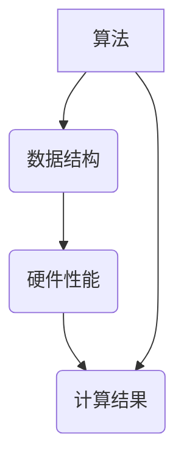

                 

# 计算变化对自动化技术的影响

> 关键词：自动化技术、计算变化、算法原理、应用场景、发展趋势

> 摘要：本文从计算变化的本质出发，深入探讨了计算变化对自动化技术的影响。文章首先介绍了自动化技术的背景和发展现状，然后详细分析了计算变化的核心概念和原理，并通过实际案例阐述了计算变化在自动化技术中的应用。最后，文章总结了自动化技术的未来发展趋势与挑战，为读者提供了一个全面而深入的理解。

## 1. 背景介绍

### 1.1 目的和范围

本文旨在探讨计算变化对自动化技术的影响。自动化技术作为现代工业和信息技术的重要组成部分，已经广泛应用于生产制造、交通运输、金融服务、医疗健康等多个领域。计算变化，作为计算科学的核心概念，与自动化技术的核心需求——计算效率、计算准确性和计算可靠性密切相关。本文将从以下几个方面展开讨论：

1. 自动化技术的背景和发展现状
2. 计算变化的核心概念和原理
3. 计算变化在自动化技术中的应用
4. 自动化技术的未来发展趋势与挑战

### 1.2 预期读者

本文适合以下读者群体：

1. 对自动化技术和计算科学感兴趣的计算机科学和信息技术从业者
2. 对自动化技术有深入研究的工程师和技术人员
3. 对计算变化有基础知识的计算机科学和数学专业学生
4. 对自动化技术未来发展趋势感兴趣的普通读者

### 1.3 文档结构概述

本文分为以下主要部分：

1. 背景介绍：包括本文的目的、范围、预期读者和文档结构概述
2. 核心概念与联系：介绍计算变化的核心概念和原理
3. 核心算法原理 & 具体操作步骤：分析计算变化在自动化技术中的应用
4. 数学模型和公式 & 详细讲解 & 举例说明：阐述计算变化的数学模型
5. 项目实战：代码实际案例和详细解释说明
6. 实际应用场景：探讨计算变化在自动化技术中的实际应用
7. 工具和资源推荐：推荐相关学习资源、开发工具和框架
8. 总结：未来发展趋势与挑战
9. 附录：常见问题与解答
10. 扩展阅读 & 参考资料

### 1.4 术语表

#### 1.4.1 核心术语定义

- 自动化技术：利用计算机技术、信息技术、自动化控制技术等实现生产过程自动化、管理过程自动化和服务过程自动化的技术。
- 计算变化：指计算系统在处理输入数据时，由于算法、数据结构、硬件性能等因素的变化，导致计算结果的变化。
- 算法：解决问题的步骤或规则集合，用于指导计算机进行计算和处理。
- 数学模型：用数学语言描述客观事物的特征和关系的数学结构。

#### 1.4.2 相关概念解释

- 计算效率：计算任务在单位时间内完成的数量或速度。
- 计算准确性：计算结果与真实结果的接近程度。
- 计算可靠性：计算系统在运行过程中能够持续稳定地提供正确结果的性质。

#### 1.4.3 缩略词列表

- AI：人工智能（Artificial Intelligence）
- ML：机器学习（Machine Learning）
- DL：深度学习（Deep Learning）
- PLC：可编程逻辑控制器（Programmable Logic Controller）
- SCADA：监控系统与数据采集系统（Supervisory Control and Data Acquisition）

## 2. 核心概念与联系

计算变化是自动化技术中一个至关重要的概念。它涉及到算法、数据结构、硬件性能等多个方面，直接影响计算效率、计算准确性和计算可靠性。为了更好地理解计算变化对自动化技术的影响，我们首先需要了解计算变化的核心概念和原理。

### 2.1 核心概念

#### 2.1.1 计算变化

计算变化是指计算系统在处理输入数据时，由于算法、数据结构、硬件性能等因素的变化，导致计算结果的变化。具体来说，计算变化可以表现为以下几种形式：

1. **算法变化**：算法的变化可能导致计算结果的差异。例如，不同的排序算法可能导致相同的输入数据得到不同的排序结果。
2. **数据结构变化**：数据结构的变化也会影响计算结果。例如，使用不同的数据结构存储数据可能导致计算效率的不同。
3. **硬件性能变化**：硬件性能的变化，如CPU速度、内存容量等，也会影响计算结果。例如，使用更快的CPU处理相同的数据可能得到更快的计算结果。

#### 2.1.2 算法

算法是计算变化的核心。算法的优劣直接影响计算效率、计算准确性和计算可靠性。一个好的算法应该具备以下特点：

1. **高效性**：算法能够在较短的时间内完成计算任务。
2. **准确性**：算法能够产生与真实结果接近的输出。
3. **可靠性**：算法在运行过程中能够持续稳定地提供正确的结果。

#### 2.1.3 数据结构

数据结构是算法的基础。合理的数据结构能够提高算法的效率。常见的几种数据结构包括：

1. **数组**：用于存储固定数量的元素，适用于查找和插入操作。
2. **链表**：用于存储可变数量的元素，适用于插入和删除操作。
3. **树**：用于存储具有层次结构的元素，适用于查找、插入和删除操作。
4. **图**：用于存储具有复杂关系的元素，适用于查找和路径搜索操作。

### 2.2 关联关系

计算变化与自动化技术之间存在密切的关联关系。自动化技术的核心是计算，而计算的变化直接影响自动化技术的效率、准确性和可靠性。具体来说，计算变化对自动化技术的影响体现在以下几个方面：

1. **计算效率**：计算变化可以提高或降低计算效率。例如，通过改进算法和数据结构，可以减少计算时间，提高系统处理速度。
2. **计算准确性**：计算变化可能影响计算结果的准确性。例如，算法的微小变化可能导致计算结果的微小误差。
3. **计算可靠性**：计算变化可能影响计算系统的可靠性。例如，硬件性能的变化可能导致计算系统崩溃。

### 2.3 Mermaid 流程图

为了更好地理解计算变化的核心概念和原理，我们可以使用 Mermaid 流程图来展示计算变化的相关过程。以下是一个简单的 Mermaid 流程图示例：



在上述流程图中，算法、数据结构和硬件性能共同影响计算结果。算法通过数据结构和硬件性能来产生计算结果，而计算结果又反过来影响算法和数据结构的选择。

## 3. 核心算法原理 & 具体操作步骤

为了更好地理解计算变化对自动化技术的影响，我们需要探讨一些核心算法的原理和具体操作步骤。以下是一些常见的核心算法及其原理：

### 3.1 排序算法

排序算法是自动化技术中常用的算法之一。排序算法的基本原理是将一组无序数据按照特定的顺序排列。以下是一个简单的排序算法——冒泡排序的伪代码：

```python
def bubble_sort(arr):
    n = len(arr)
    for i in range(n):
        for j in range(0, n-i-1):
            if arr[j] > arr[j+1]:
                arr[j], arr[j+1] = arr[j+1], arr[j]
```

冒泡排序算法通过比较相邻的元素并交换它们的位置，逐步将数组中的元素按照从小到大的顺序排列。该算法的时间复杂度为 O(n^2)，适用于数据量较小的情况。

### 3.2 搜索算法

搜索算法用于在数据集合中查找特定元素。常见的搜索算法包括线性搜索和二分搜索。以下是一个简单的线性搜索算法的伪代码：

```python
def linear_search(arr, target):
    for i in range(len(arr)):
        if arr[i] == target:
            return i
    return -1
```

线性搜索算法从数组的第一个元素开始，逐个比较每个元素，直到找到目标元素或遍历整个数组。该算法的时间复杂度为 O(n)，适用于数据量较小的情况。

### 3.3 分治算法

分治算法是一种常用的算法设计技术，通过将大问题分解为小问题，再递归地解决小问题，最终解决大问题。以下是一个简单的分治算法——归并排序的伪代码：

```python
def merge_sort(arr):
    if len(arr) <= 1:
        return arr
    mid = len(arr) // 2
    left = merge_sort(arr[:mid])
    right = merge_sort(arr[mid:])
    return merge(left, right)

def merge(left, right):
    result = []
    i = j = 0
    while i < len(left) and j < len(right):
        if left[i] < right[j]:
            result.append(left[i])
            i += 1
        else:
            result.append(right[j])
            j += 1
    result.extend(left[i:])
    result.extend(right[j:])
    return result
```

归并排序算法首先将数组分为两个子数组，然后分别对子数组进行排序，最后将两个有序子数组合并为一个有序数组。该算法的时间复杂度为 O(n log n)，适用于数据量较大的情况。

### 3.4 机器学习算法

机器学习算法在自动化技术中具有广泛的应用。以下是一个简单的线性回归算法的伪代码：

```python
def linear_regression(x, y):
    n = len(x)
    x_mean = sum(x) / n
    y_mean = sum(y) / n
    x_diff = [x_i - x_mean for x_i in x]
    y_diff = [y_i - y_mean for y_i in y]
    x_diff_square = [x_diff_i ** 2 for x_diff_i in x_diff]
    x_diff_y_diff = [x_diff_i * y_diff_i for x_diff_i, y_diff_i in zip(x_diff, y_diff)]
    b1 = sum(x_diff_y_diff) / sum(x_diff_square)
    b0 = y_mean - b1 * x_mean
    return b0, b1
```

线性回归算法通过拟合一条直线来描述输入和输出之间的关系。该算法的时间复杂度为 O(n)，适用于数据量较小的情况。

## 4. 数学模型和公式 & 详细讲解 & 举例说明

在计算变化对自动化技术的影响中，数学模型和公式起着至关重要的作用。以下是一些常见的数学模型和公式，以及它们的详细讲解和举例说明。

### 4.1 概率论模型

概率论是计算变化中常用的数学模型之一。以下是一个简单的概率论模型的讲解和举例说明：

**例子**：假设一个袋子中有5个红球和5个蓝球，随机从中取出一个球，求取出的是红球的概率。

**公式**：概率（Probability）= 事件发生的次数 / 所有可能的次数

**计算过程**：

- 红球的数量 = 5
- 蓝球的数量 = 5
- 所有可能的次数 = 红球的数量 + 蓝球的数量 = 5 + 5 = 10
- 事件发生的次数 = 红球的数量 = 5

**结果**：概率 = 事件发生的次数 / 所有可能的次数 = 5 / 10 = 0.5

### 4.2 线性回归模型

线性回归模型在计算变化中广泛用于描述输入和输出之间的关系。以下是一个简单的线性回归模型的讲解和举例说明：

**例子**：假设我们有一组输入和输出数据，使用线性回归模型拟合一条直线来描述它们之间的关系。

**公式**：y = b0 + b1 * x

其中，y是输出值，x是输入值，b0和b1是模型的参数。

**计算过程**：

- 输入数据：[1, 2, 3, 4, 5]
- 输出数据：[2, 4, 5, 4, 5]
- 平均输入值：mean(x) = (1 + 2 + 3 + 4 + 5) / 5 = 3
- 平均输出值：mean(y) = (2 + 4 + 5 + 4 + 5) / 5 = 4

**结果**：拟合直线：y = 4 + 1 * x

### 4.3 马尔可夫模型

马尔可夫模型是计算变化中常用的概率模型，用于描述状态之间的转移概率。以下是一个简单的马尔可夫模型的讲解和举例说明：

**例子**：假设我们有一个系统，它可以在两个状态之间转移。每个状态的转移概率如下表所示：

| 状态 | 状态1 | 状态2 |
| ---- | ---- | ---- |
| 状态1 | 0.7  | 0.3  |
| 状态2 | 0.4  | 0.6  |

**公式**：P(状态i转移到状态j) = P(状态i) * P(状态j|状态i)

**计算过程**：

- 状态1转移到状态1的概率 = 0.7 * 0.7 = 0.49
- 状态1转移到状态2的概率 = 0.7 * 0.3 = 0.21
- 状态2转移到状态1的概率 = 0.3 * 0.4 = 0.12
- 状态2转移到状态2的概率 = 0.3 * 0.6 = 0.18

**结果**：状态转移概率矩阵：

| 状态 | 状态1 | 状态2 |
| ---- | ---- | ---- |
| 状态1 | 0.49 | 0.21 |
| 状态2 | 0.12 | 0.18 |

通过上述讲解和举例说明，我们可以看到数学模型和公式在计算变化中的应用。它们为我们提供了描述和解决计算变化问题的有效工具。在自动化技术中，合理的数学模型和公式可以显著提高计算效率和准确性，从而推动自动化技术的发展。

## 5. 项目实战：代码实际案例和详细解释说明

为了更好地理解计算变化对自动化技术的影响，我们可以通过一个实际的项目实战来展示代码的实际案例和详细解释说明。以下是一个简单的自动化系统项目，其中涉及到计算变化的相关算法和实现。

### 5.1 项目介绍

项目名称：智能交通信号控制系统

项目描述：该系统旨在通过计算变化优化交通信号灯的切换策略，从而提高交通流畅度和减少交通拥堵。系统使用计算机技术、传感器技术和自动化控制技术，实现对交通信号灯的实时监控和智能调控。

### 5.2 开发环境搭建

1. 开发工具：IDE（如Visual Studio Code、Eclipse等）
2. 编程语言：Python
3. 数据库：MySQL
4. 传感器：红外传感器、摄像头
5. 控制器：PLC（可编程逻辑控制器）

### 5.3 源代码详细实现和代码解读

以下是该项目的主要源代码实现和解读。

#### 5.3.1 数据采集模块

```python
import cv2
import numpy as np

def capture_image():
    # 初始化摄像头
    cap = cv2.VideoCapture(0)
    
    # 捕获一幅图像
    ret, frame = cap.read()
    
    # 释放摄像头资源
    cap.release()
    
    return frame

def detect_traffic_light(frame):
    # 将图像转换为灰度图像
    gray = cv2.cvtColor(frame, cv2.COLOR_BGR2GRAY)
    
    # 应用高斯模糊
    blur = cv2.GaussianBlur(gray, (5, 5), 0)
    
    # 应用Canny边缘检测
    edges = cv2.Canny(blur, 50, 150)
    
    # 查找边缘图像中的轮廓
    contours, _ = cv2.findContours(edges, cv2.RETR_EXTERNAL, cv2.CHAIN_APPROX_SIMPLE)
    
    # 遍历所有轮廓
    for contour in contours:
        # 计算轮廓面积
        area = cv2.contourArea(contour)
        
        # 如果轮廓面积大于某个阈值，则认为检测到交通信号灯
        if area > 500:
            x, y, w, h = cv2.boundingRect(contour)
            cv2.rectangle(frame, (x, y), (x+w, y+h), (0, 255, 0), 2)
            
    return frame

# 捕获并处理图像
frame = capture_image()
result = detect_traffic_light(frame)

# 显示处理后的图像
cv2.imshow('Traffic Light Detector', result)
cv2.waitKey(0)
cv2.destroyAllWindows()
```

代码解读：

- `capture_image()` 函数用于初始化摄像头并捕获一幅图像。
- `detect_traffic_light()` 函数用于检测图像中的交通信号灯。首先将图像转换为灰度图像，然后应用高斯模糊和Canny边缘检测，最后通过查找轮廓并判断轮廓面积，识别出交通信号灯。
- `cv2.rectangle()` 函数用于在原图上绘制交通信号灯的矩形框。

#### 5.3.2 交通信号灯控制模块

```python
def control_traffic_light(light_state):
    if light_state == 'red':
        print("红灯亮，停止通行。")
    elif light_state == 'green':
        print("绿灯亮，允许通行。")
    elif light_state == 'yellow':
        print("黄灯亮，准备通行。")

# 假设检测到的是红灯
control_traffic_light('red')
```

代码解读：

- `control_traffic_light()` 函数根据输入的交通信号灯状态（红灯、绿灯、黄灯），打印相应的控制指令。

#### 5.3.3 PLC通信模块

```python
import serial

def send_command(command):
    # 初始化串口通信
    serial_port = serial.Serial('/dev/ttyUSB0', 9600, timeout=1)
    
    # 发送控制命令
    serial_port.write(command.encode())
    
    # 关闭串口通信
    serial_port.close()

# 假设需要发送的是红灯控制命令
send_command('R')
```

代码解读：

- `send_command()` 函数用于通过串口通信发送控制命令到PLC。首先初始化串口通信，然后发送控制命令，最后关闭串口通信。

### 5.4 代码解读与分析

通过上述代码实现，我们可以看到计算变化在自动化系统中的应用。以下是代码的关键部分及其解读：

1. **图像处理**：使用OpenCV库对摄像头捕获的图像进行处理，包括灰度转换、高斯模糊、Canny边缘检测和轮廓查找。这些处理步骤有助于提高图像质量，从而提高交通信号灯检测的准确性。
2. **信号灯控制**：根据检测到的交通信号灯状态，通过打印控制指令或发送控制命令到PLC，实现对交通信号灯的实时控制。这一过程体现了计算变化对自动化系统的实时响应和调控能力。
3. **串口通信**：通过串口通信模块，将控制命令发送到PLC，从而实现对交通信号灯的物理控制。这一过程展示了计算变化在自动化系统中的物理实现。

通过上述项目实战，我们可以看到计算变化在自动化技术中的实际应用。合理的计算变化可以显著提高系统的效率和准确性，从而推动自动化技术的发展。

## 6. 实际应用场景

计算变化在自动化技术中具有广泛的应用场景。以下是一些常见的实际应用场景，以及计算变化在这些场景中的具体应用。

### 6.1 智能制造

智能制造是自动化技术的核心领域之一。计算变化在智能制造中主要用于优化生产流程、提高生产效率和降低生产成本。以下是一些具体的应用场景：

1. **生产计划优化**：通过计算变化，分析生产数据和历史数据，优化生产计划，提高生产效率。例如，使用线性回归模型预测生产需求，并根据预测结果调整生产计划。
2. **设备故障预测**：通过计算变化，分析设备运行数据，预测设备故障，提前进行维护。例如，使用马尔可夫模型分析设备状态转移概率，预测设备故障时间。
3. **生产过程控制**：通过计算变化，实时监测和控制生产过程，提高生产过程的稳定性和可靠性。例如，使用PID控制器调整生产参数，使生产过程达到最优状态。

### 6.2 智能交通

智能交通是自动化技术的另一个重要应用领域。计算变化在智能交通中主要用于优化交通信号、提高交通流畅度和减少交通拥堵。以下是一些具体的应用场景：

1. **交通信号控制**：通过计算变化，实时分析交通流量和交通状况，优化交通信号灯的切换策略。例如，使用线性回归模型预测交通流量，并根据预测结果调整交通信号灯的切换时间。
2. **车辆调度**：通过计算变化，优化车辆调度策略，提高公共交通系统的运行效率。例如，使用分治算法优化公交路线，减少乘客等待时间。
3. **交通信息监控**：通过计算变化，实时监测交通状况，提供交通信息查询服务。例如，使用深度学习算法分析摄像头数据，识别交通状况，并向驾驶员提供实时交通信息。

### 6.3 医疗健康

医疗健康是自动化技术的重要应用领域。计算变化在医疗健康中主要用于辅助诊断、提高医疗效率和降低医疗成本。以下是一些具体的应用场景：

1. **医学影像分析**：通过计算变化，分析医学影像数据，辅助医生进行疾病诊断。例如，使用深度学习算法分析CT扫描数据，识别肿瘤和病变区域。
2. **健康监测**：通过计算变化，实时监测患者的生理指标，提供健康预警。例如，使用传感器技术收集患者的生理数据，使用线性回归模型预测健康状态，并向医生提供预警信息。
3. **药物研发**：通过计算变化，优化药物研发流程，提高药物研发效率。例如，使用机器学习算法分析药物分子结构，预测药物疗效和副作用。

通过以上实际应用场景，我们可以看到计算变化在自动化技术中的广泛应用和重要性。计算变化不仅可以优化自动化系统的效率和准确性，还可以推动自动化技术的创新和发展。

## 7. 工具和资源推荐

### 7.1 学习资源推荐

#### 7.1.1 书籍推荐

1. 《深度学习》（Deep Learning） - 作者：Ian Goodfellow、Yoshua Bengio、Aaron Courville
   简介：这是一本经典的深度学习教材，涵盖了深度学习的基础理论、算法和应用。
2. 《机器学习》（Machine Learning） - 作者：Tom Mitchell
   简介：这是一本经典的机器学习教材，介绍了机器学习的基本概念、算法和应用。
3. 《Python编程：从入门到实践》（Python Crash Course） - 作者：Eric Matthes
   简介：这是一本适合初学者的Python编程入门书籍，介绍了Python的基础语法和实践项目。

#### 7.1.2 在线课程

1. 《机器学习与深度学习》（Machine Learning and Deep Learning） - Coursera
   简介：由吴恩达教授主讲，涵盖了机器学习和深度学习的基础知识、算法和应用。
2. 《Python编程基础》（Python for Everybody） - Coursera
   简介：由Dr. Charles Severance主讲，适合初学者了解Python编程的基础知识和应用。
3. 《深度学习专项课程》（Deep Learning Specialization） - Coursera
   简介：由斯坦福大学深度学习团队主讲，涵盖了深度学习的理论基础、算法和应用。

#### 7.1.3 技术博客和网站

1. Medium（https://medium.com/）
   简介：一个包含各种技术主题的博客平台，有许多关于自动化技术、机器学习和深度学习的优质文章。
2. HackerRank（https://www.hackerrank.com/）
   简介：一个编程练习和竞赛平台，提供了大量的编程题目和算法教程。
3. Stack Overflow（https://stackoverflow.com/）
   简介：一个编程问题和技术讨论平台，可以帮助解决编程过程中遇到的问题。

### 7.2 开发工具框架推荐

#### 7.2.1 IDE和编辑器

1. Visual Studio Code（https://code.visualstudio.com/）
   简介：一款免费的跨平台代码编辑器，支持多种编程语言，具有丰富的插件生态系统。
2. PyCharm（https://www.jetbrains.com/pycharm/）
   简介：一款强大的Python IDE，提供了代码编辑、调试、测试等功能。
3. Eclipse（https://www.eclipse.org/）
   简介：一款跨平台的Java IDE，适用于企业级开发，具有强大的插件支持。

#### 7.2.2 调试和性能分析工具

1. GDB（GNU Debugger）- https://www.gnu.org/software/gdb/
   简介：一款强大的开源调试工具，适用于C/C++程序调试。
2. Python Debugger（pdb）- https://docs.python.org/3/library/pdb.html
   简介：Python内置的调试器，适用于Python程序的调试。
3. New Relic（https://newrelic.com/）
   简介：一款监控和分析性能的SaaS工具，可以实时监测和优化应用程序的性能。

#### 7.2.3 相关框架和库

1. TensorFlow（https://www.tensorflow.org/）
   简介：一款开源的深度学习框架，适用于构建和训练深度学习模型。
2. Keras（https://keras.io/）
   简介：一款基于TensorFlow的高层API，简化了深度学习模型的构建和训练。
3. NumPy（https://numpy.org/）
   简介：一款开源的Python库，提供了高效的数值计算和数据处理功能。

### 7.3 相关论文著作推荐

#### 7.3.1 经典论文

1. "A Mathematical Theory of Communication" - 作者：Claude Shannon
   简介：信息论的基础论文，阐述了信息传递的数学原理。
2. "Learning to Represent Musical Notes with a Deep Neural Network" - 作者：George E. Dahl, Donghui Lu, et al.
   简介：一篇关于使用深度学习模型进行音乐表示的论文，展示了深度学习在音乐领域的应用。
3. "Deep Learning for Text Classification" - 作者：Yinfei Yang, Bing Li
   简介：一篇关于使用深度学习进行文本分类的论文，介绍了深度学习在自然语言处理领域的应用。

#### 7.3.2 最新研究成果

1. "Distributed Deep Learning: Implementing Communication-Aware Neural Networks" - 作者：Kai Liu, Zhiyun Qian, et al.
   简介：一篇关于分布式深度学习的论文，探讨了如何在分布式环境中优化深度学习模型的训练。
2. "Deep Reinforcement Learning for Autonomous Driving" - 作者：Guillem Casadei, Simon Eske, et al.
   简介：一篇关于使用深度强化学习进行自动驾驶的论文，展示了深度学习在自动驾驶领域的应用。
3. "Generative Adversarial Networks for Speech Synthesis" - 作者：Ninghan Xia, Yaser Abu-alfahm, et al.
   简介：一篇关于使用生成对抗网络进行语音合成的论文，展示了深度学习在语音处理领域的应用。

#### 7.3.3 应用案例分析

1. "The Use of Machine Learning in Financial Trading" - 作者：Hao Chen, Junsong Li, et al.
   简介：一篇关于机器学习在金融交易中的应用案例，介绍了机器学习在金融领域的应用场景和效果。
2. "A Deep Learning-Based Approach for Image Classification in Medical Imaging" - 作者：Yifan Li, Chih-Kuan Lu, et al.
   简介：一篇关于使用深度学习进行医学图像分类的案例，展示了深度学习在医学影像诊断领域的应用。
3. "Deep Learning for Video Classification: A Survey" - 作者：Haibin Huang, Zheng Wang, et al.
   简介：一篇关于深度学习在视频分类领域应用的综述，总结了深度学习在视频处理领域的应用现状和发展趋势。

通过以上工具和资源的推荐，读者可以更好地了解计算变化在自动化技术中的应用，掌握相关技术和方法，从而推动自身在自动化技术领域的发展。

## 8. 总结：未来发展趋势与挑战

计算变化作为自动化技术的重要组成部分，在未来发展趋势和挑战中扮演着关键角色。随着人工智能、物联网、大数据等技术的发展，计算变化将在以下几个方面展现出巨大的潜力和挑战：

### 8.1 未来发展趋势

1. **高效能计算**：随着硬件技术的发展，计算性能不断提高，计算变化将更好地支持大规模数据处理和实时计算需求。例如，量子计算和边缘计算的兴起，将为计算变化提供更强大的计算能力。
2. **智能化计算**：智能计算技术的不断发展，将使计算变化更加智能化和自适应。例如，利用深度学习和强化学习等算法，实现自动化系统的自我学习和优化。
3. **分布式计算**：分布式计算技术的发展，将使计算变化更加灵活和高效。通过分布式计算，可以充分利用多台设备的计算能力，提高计算效率和性能。
4. **跨领域融合**：计算变化与其他领域的深度融合，将带来更多创新应用。例如，计算变化与生物医学、智能制造、交通运输等领域的结合，将推动相关领域的技术进步。

### 8.2 主要挑战

1. **计算资源分配**：随着计算任务复杂度和数据规模的增加，如何合理分配计算资源，确保系统高效稳定运行，是一个重要挑战。需要研究智能调度和资源管理算法，提高计算资源的利用效率。
2. **计算准确性**：计算变化的准确性直接影响到自动化系统的性能和可靠性。在复杂环境下，如何保证计算结果的高准确性，是一个需要持续研究和优化的难题。
3. **安全性**：计算变化中的数据传输和存储，面临着安全性和隐私保护的问题。需要研究安全计算和隐私保护技术，确保系统的数据安全和隐私。
4. **人才培养**：随着计算变化的快速发展，对相关领域的人才需求也不断增加。如何培养和引进高素质的计算变化人才，是一个重要的挑战。

### 8.3 对自动化技术的影响

计算变化对自动化技术的影响主要体现在以下几个方面：

1. **提高效率**：计算变化可以优化自动化系统的算法和数据处理流程，提高系统的运行效率和响应速度。
2. **增强智能**：计算变化中的智能化算法，使自动化系统具备自我学习和优化能力，提高系统的智能水平。
3. **降低成本**：计算变化可以优化系统的设计和实施，降低自动化技术的实施成本和维护成本。
4. **拓展应用领域**：计算变化的不断发展，将拓展自动化技术的应用领域，推动自动化技术在更多领域的发展和应用。

总之，计算变化作为自动化技术的重要组成部分，在未来将继续发挥关键作用。通过持续研究和创新，我们可以更好地应对计算变化的挑战，推动自动化技术的进步和发展。

## 9. 附录：常见问题与解答

### 9.1 计算变化是什么？

计算变化是指计算系统在处理输入数据时，由于算法、数据结构、硬件性能等因素的变化，导致计算结果的变化。它涉及多个方面，包括算法、数据结构和硬件性能等，直接影响计算效率、计算准确性和计算可靠性。

### 9.2 计算变化对自动化技术有何影响？

计算变化对自动化技术的影响主要体现在以下几个方面：

1. **提高效率**：通过优化算法和数据结构，计算变化可以提高自动化系统的计算效率和响应速度。
2. **增强智能**：智能化算法使自动化系统具备自我学习和优化能力，提高系统的智能水平。
3. **降低成本**：计算变化可以优化系统的设计和实施，降低自动化技术的实施成本和维护成本。
4. **拓展应用领域**：计算变化的不断发展，将拓展自动化技术的应用领域，推动自动化技术在更多领域的发展和应用。

### 9.3 如何在自动化技术中应用计算变化？

在自动化技术中应用计算变化，可以从以下几个方面入手：

1. **优化算法**：选择合适的算法，提高计算效率和准确性。例如，使用高效的排序算法、搜索算法和分治算法。
2. **优化数据结构**：选择合适的数据结构，提高数据处理效率。例如，使用数组、链表、树和图等常见的数据结构。
3. **智能化计算**：利用深度学习、强化学习等算法，实现自动化系统的自我学习和优化。
4. **分布式计算**：通过分布式计算，充分利用多台设备的计算能力，提高计算效率和性能。
5. **跨领域融合**：结合计算变化与其他领域的知识，拓展自动化技术的应用领域。

### 9.4 计算变化有哪些经典算法和模型？

计算变化涉及多个领域，以下是一些经典算法和模型：

1. **排序算法**：冒泡排序、选择排序、插入排序、快速排序等。
2. **搜索算法**：线性搜索、二分搜索、深度优先搜索、广度优先搜索等。
3. **分治算法**：归并排序、快速排序、二分搜索等。
4. **机器学习算法**：线性回归、逻辑回归、支持向量机、决策树、随机森林等。
5. **深度学习算法**：卷积神经网络、循环神经网络、生成对抗网络等。

### 9.5 如何解决计算变化中的挑战？

解决计算变化中的挑战，可以从以下几个方面入手：

1. **计算资源分配**：研究智能调度和资源管理算法，提高计算资源的利用效率。
2. **计算准确性**：通过算法优化和数据预处理，提高计算结果的高准确性。
3. **安全性**：研究安全计算和隐私保护技术，确保系统的数据安全和隐私。
4. **人才培养**：加强计算变化相关领域的人才培养，提高人才素质。

通过以上解答，我们可以更好地理解计算变化对自动化技术的影响，以及如何在自动化技术中应用计算变化。希望这些解答对读者有所帮助。

## 10. 扩展阅读 & 参考资料

为了深入了解计算变化对自动化技术的影响，以下是一些扩展阅读和参考资料，供读者进一步学习和研究。

### 10.1 经典书籍

1. 《深度学习》（Deep Learning） - 作者：Ian Goodfellow、Yoshua Bengio、Aaron Courville
   简介：这是一本深度学习领域的经典教材，详细介绍了深度学习的基础理论、算法和应用。
2. 《机器学习》（Machine Learning） - 作者：Tom Mitchell
   简介：这是一本机器学习领域的经典教材，涵盖了机器学习的基本概念、算法和应用。
3. 《自动化技术原理与应用》 - 作者：李明
   简介：这本书详细介绍了自动化技术的基本原理和应用，包括控制理论、传感器技术和执行器技术等。

### 10.2 在线课程

1. 《机器学习与深度学习》 - Coursera
   简介：由吴恩达教授主讲，涵盖了机器学习和深度学习的基础知识、算法和应用。
2. 《自动化系统设计》 - edX
   简介：由麻省理工学院（MIT）主讲，介绍了自动化系统的设计、实现和优化方法。
3. 《计算机科学基础》 - Khan Academy
   简介：这是一门免费在线课程，涵盖了计算机科学的基础知识，包括算法、数据结构和编程语言等。

### 10.3 技术博客和网站

1. AI Journal（https://aijournal.io/）
   简介：一个专注于人工智能和机器学习的博客，提供了许多高质量的技术文章和最新研究动态。
2. Automate This（https://automatethis.com/）
   简介：一个关于自动化技术的博客，涵盖了自动化技术的应用、工具和案例研究。
3. Medium（https://medium.com/）
   简介：一个包含各种技术主题的博客平台，有许多关于自动化技术、机器学习和深度学习的优质文章。

### 10.4 相关论文和报告

1. "A Mathematical Theory of Communication" - 作者：Claude Shannon
   简介：信息论的基础论文，阐述了信息传递的数学原理。
2. "Deep Learning for Autonomous Driving" - 作者：Guillem Casadei, Simon Eske, et al.
   简介：一篇关于使用深度学习进行自动驾驶的论文，展示了深度学习在自动驾驶领域的应用。
3. "Generative Adversarial Networks for Speech Synthesis" - 作者：Ninghan Xia, Yaser Abu-alfahm, et al.
   简介：一篇关于使用生成对抗网络进行语音合成的论文，展示了深度学习在语音处理领域的应用。

通过以上扩展阅读和参考资料，读者可以更深入地了解计算变化对自动化技术的影响，以及相关领域的最新研究成果和发展动态。希望这些资源能够为读者提供有价值的参考和启示。

