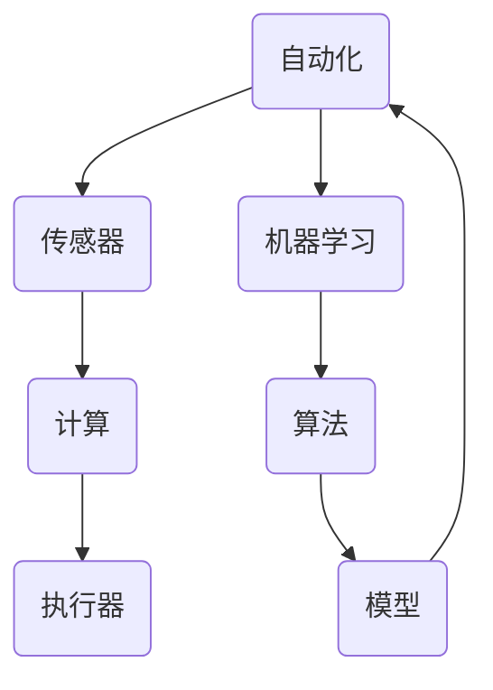

                 

# 计算变化带来的自动化新机遇

> 关键词：自动化、计算、变化、机遇、算法、模型、应用

> 摘要：本文将深入探讨计算技术在自动化领域中的应用，分析计算变化所带来的新机遇。通过阐述核心概念、算法原理、数学模型和具体操作步骤，以及实际应用场景，本文旨在为读者提供一份全面的技术指南，帮助大家理解并利用计算变化推动自动化发展。

## 1. 背景介绍

### 1.1 目的和范围

本文的目的是探讨计算变化在自动化领域中的新机遇。自动化技术已经成为现代工业和服务业的重要支柱，而计算技术的发展为自动化提供了强大的驱动力。本文将重点关注以下几个方面：

1. **核心概念与联系**：介绍自动化和计算的基本概念，以及它们之间的相互作用。
2. **核心算法原理 & 具体操作步骤**：详细解析自动化技术的核心算法原理，并给出具体的操作步骤。
3. **数学模型和公式 & 详细讲解 & 举例说明**：介绍自动化过程中的数学模型和公式，并通过实例进行说明。
4. **项目实战：代码实际案例和详细解释说明**：提供一个实际项目的代码实现，并对关键代码进行解读。
5. **实际应用场景**：探讨自动化技术在各行业的应用场景和案例。
6. **工具和资源推荐**：推荐学习资源和开发工具，以帮助读者更好地理解和应用自动化技术。

### 1.2 预期读者

本文适合以下读者群体：

1. **自动化工程师**：希望了解计算变化对自动化技术的影响，掌握新的自动化方法和技术。
2. **程序员**：对计算和自动化技术感兴趣，希望学习如何将计算技术与自动化应用相结合。
3. **研究人员**：关注自动化技术的发展，希望了解最新研究成果和应用趋势。
4. **学生和教育者**：对自动化和计算技术有兴趣，希望获得深入的技术理解和实践指导。

### 1.3 文档结构概述

本文将按照以下结构进行组织：

1. **背景介绍**：介绍文章的目的、范围和预期读者。
2. **核心概念与联系**：介绍自动化和计算的基本概念，以及它们之间的相互作用。
3. **核心算法原理 & 具体操作步骤**：详细解析自动化技术的核心算法原理，并给出具体的操作步骤。
4. **数学模型和公式 & 详细讲解 & 举例说明**：介绍自动化过程中的数学模型和公式，并通过实例进行说明。
5. **项目实战：代码实际案例和详细解释说明**：提供一个实际项目的代码实现，并对关键代码进行解读。
6. **实际应用场景**：探讨自动化技术在各行业的应用场景和案例。
7. **工具和资源推荐**：推荐学习资源和开发工具，以帮助读者更好地理解和应用自动化技术。
8. **总结：未来发展趋势与挑战**：总结文章的核心内容，展望未来发展趋势和挑战。
9. **附录：常见问题与解答**：解答读者可能遇到的常见问题。
10. **扩展阅读 & 参考资料**：提供进一步学习的资源。

### 1.4 术语表

#### 1.4.1 核心术语定义

- **自动化**：指通过技术手段实现生产或服务过程的自动化，减少人工干预，提高效率和准确性。
- **计算**：指通过计算机程序、算法和数学模型对信息进行加工和处理的过程。
- **算法**：指解决问题的方法或步骤，用于指导计算机执行特定任务。
- **模型**：指对实际问题进行抽象和描述的数学框架，用于分析和预测系统行为。

#### 1.4.2 相关概念解释

- **机器学习**：一种通过数据训练计算机模型的方法，使计算机能够自动识别模式和进行预测。
- **人工智能**：指通过模拟人类智能行为，使计算机能够执行复杂任务的能力。
- **传感器**：用于检测和测量物理量的设备，可用于收集环境信息。
- **执行器**：用于实现物理动作的设备，如电机、阀门等。

#### 1.4.3 缩略词列表

- **AI**：人工智能
- **ML**：机器学习
- **DL**：深度学习
- **PID**：比例-积分-微分控制器
- **SCADA**：监控系统与数据采集系统
- **PLC**：可编程逻辑控制器

## 2. 核心概念与联系

在探讨计算变化对自动化带来的新机遇之前，我们需要明确自动化和计算的基本概念，以及它们之间的相互作用。以下是一个简化的 Mermaid 流程图，用于展示自动化和计算之间的核心概念和联系。



### 2.1 自动化

自动化是指通过技术手段实现生产或服务过程的自动化，减少人工干预，提高效率和准确性。自动化可以应用于多个领域，包括制造业、物流、医疗、金融等。

- **类型**：自动化可以分为硬件自动化和软件自动化。硬件自动化主要依赖于传感器和执行器，如机器人、自动化生产线等；软件自动化则依赖于计算机程序、算法和数学模型，如自动化测试、自动化交易等。
- **挑战**：自动化面临的主要挑战包括精度、可靠性、安全性和可扩展性。随着计算技术的发展，这些挑战正在逐步得到解决。

### 2.2 传感器

传感器是用于检测和测量物理量的设备，如温度、压力、速度等。传感器可以收集环境信息，并将其转换为电信号，供计算系统进行处理。

- **类型**：传感器可以分为物理传感器和电子传感器。物理传感器如温度传感器、压力传感器等；电子传感器如红外传感器、激光传感器等。
- **应用**：传感器在自动化系统中起着关键作用，可用于监测设备状态、环境条件、产品质量等，为计算系统提供实时数据。

### 2.3 计算

计算是指通过计算机程序、算法和数学模型对信息进行加工和处理的过程。计算系统可以处理传感器收集的数据，并生成相应的输出，以指导自动化执行器进行物理动作。

- **类型**：计算系统可以分为基于硬件的计算系统和基于软件的计算系统。硬件计算系统如超级计算机、图形处理器（GPU）等；软件计算系统如计算机程序、算法库等。
- **应用**：计算在自动化系统中起着核心作用，可用于数据分析和处理、模式识别、预测和控制等。

### 2.4 执行器

执行器是用于实现物理动作的设备，如电机、阀门等。执行器根据计算系统的输出指令，执行相应的物理动作，以实现自动化过程。

- **类型**：执行器可以分为电动执行器、气动执行器和液压执行器等。
- **应用**：执行器在自动化系统中起着关键作用，用于实现设备控制、物料搬运、环境调节等。

### 2.5 机器学习

机器学习是一种通过数据训练计算机模型的方法，使计算机能够自动识别模式和进行预测。机器学习在自动化系统中起着重要作用，可用于数据分析和处理、异常检测、预测控制等。

- **类型**：机器学习可以分为监督学习、无监督学习和强化学习等。
- **应用**：机器学习在自动化系统中广泛应用于异常检测、故障预测、自动驾驶等。

### 2.6 算法

算法是指解决问题的方法或步骤，用于指导计算机执行特定任务。算法在自动化系统中起着关键作用，可用于数据分析和处理、模式识别、预测和控制等。

- **类型**：算法可以分为线性算法、非线性算法、递归算法等。
- **应用**：算法在自动化系统中广泛应用于路径规划、图像识别、控制系统设计等。

### 2.7 模型

模型是指对实际问题进行抽象和描述的数学框架，用于分析和预测系统行为。模型在自动化系统中起着核心作用，可用于数据分析和处理、预测和控制等。

- **类型**：模型可以分为确定性模型、随机模型、动态模型等。
- **应用**：模型在自动化系统中广泛应用于过程控制、系统仿真、故障诊断等。

通过上述核心概念和联系的分析，我们可以看出计算变化为自动化带来了巨大的机遇。计算技术的发展使得自动化系统更加智能、高效和可靠，为各行业带来了前所未有的变革。在接下来的章节中，我们将进一步探讨自动化技术的核心算法原理、数学模型和具体操作步骤，以及实际应用场景，以帮助读者更好地理解并利用计算变化推动自动化发展。

## 3. 核心算法原理 & 具体操作步骤

自动化技术的核心在于算法的运用。算法是计算机执行特定任务的步骤和规则，是实现自动化目标的关键。在本节中，我们将详细解析自动化技术中常用的几个核心算法原理，并给出具体的操作步骤。

### 3.1 PID 控制算法

PID（比例-积分-微分）控制器是一种经典的自动控制算法，广泛应用于工业过程控制中。PID 控制器通过调整比例、积分和微分三个参数，实现对系统误差的实时纠正，从而达到稳定的控制效果。

#### 3.1.1 算法原理

PID 控制算法的基本原理是通过不断调整控制器的输出，使系统输出误差（实际值与期望值之差）逐渐减小，直至为零。

- **比例（P）**：比例控制器的输出与当前误差成正比，用于快速减小误差。
- **积分（I）**：积分控制器的输出与误差的积分成正比，用于消除静态误差。
- **微分（D）**：微分控制器的输出与误差的变化率成正比，用于预测误差的变化趋势，防止误差过大。

PID 控制器的输出计算公式如下：

$$
u(t) = K_p e(t) + K_i \int e(t) dt + K_d \frac{de(t)}{dt}
$$

其中，\(u(t)\) 是控制器输出，\(e(t)\) 是当前误差，\(K_p\)、\(K_i\)、\(K_d\) 分别是比例、积分和微分系数。

#### 3.1.2 具体操作步骤

1. **初始化**：设置初始误差 \(e_0\)、控制器输出 \(u_0\) 和三个系数 \(K_p\)、\(K_i\)、\(K_d\)。
2. **读取当前误差**：从传感器获取当前系统的实际值和期望值，计算当前误差 \(e(t)\)。
3. **计算比例控制输出**：根据当前误差 \(e(t)\) 和比例系数 \(K_p\) 计算比例控制输出 \(u_p(t)\)。
4. **计算积分控制输出**：根据误差的积分和积分系数 \(K_i\) 计算积分控制输出 \(u_i(t)\)。
5. **计算微分控制输出**：根据误差的变化率和微分系数 \(K_d\) 计算微分控制输出 \(u_d(t)\)。
6. **计算总控制输出**：将比例、积分和微分控制输出相加，得到总控制输出 \(u(t)\)。
7. **执行控制动作**：将总控制输出 \(u(t)\) 传递给执行器，执行相应的物理动作。
8. **更新系数**：根据系统的响应和性能，调整比例、积分和微分系数，以获得更好的控制效果。

### 3.2 路径规划算法

路径规划算法用于确定从起点到终点的最优路径，广泛应用于机器人导航、自动驾驶等领域。路径规划算法可以分为基于采样和基于优化两大类。

#### 3.2.1 基于采样的路径规划算法

基于采样的路径规划算法通过随机采样和局部优化来生成路径。典型的算法包括 RRT（快速随机树）和 RRT^*（快速随机树优化）。

- **RRT 算法原理**：

  RRT 算法通过以下步骤生成路径：

  1. 初始化树节点 \(T\)，包含起点和若干随机采样点。
  2. 对于每个随机采样点，从树节点 \(T\) 中选择一个最近节点 \(n\)。
  3. 计算从节点 \(n\) 到采样点的贝塞尔曲线，并沿着曲线扩展新节点 \(n'\)。
  4. 更新树节点 \(T\)，将节点 \(n'\) 添加到树中。
  5. 重复步骤 2-4，直到到达终点或满足终止条件。

- **RRT* 算法原理**：

  RRT* 算法通过优化路径，提高路径的平滑性和有效性。具体步骤如下：

  1. 初始化树节点 \(T\)，包含起点和若干随机采样点。
  2. 对于每个随机采样点，从树节点 \(T\) 中选择一个最近节点 \(n\)。
  3. 计算从节点 \(n\) 到采样点的贝塞尔曲线，并沿着曲线扩展新节点 \(n'\)。
  4. 对树节点 \(T\) 中的每个节点，计算其到新节点 \(n'\) 的扩展代价。
  5. 根据扩展代价更新树节点 \(T\)，将节点 \(n'\) 添加到树中，并删除扩展代价最小的节点。
  6. 重复步骤 2-5，直到到达终点或满足终止条件。

#### 3.2.2 基于优化的路径规划算法

基于优化的路径规划算法通过数学优化方法求解最优路径。典型的算法包括 A* 算法和 Dijkstra 算法。

- **A* 算法原理**：

  A* 算法通过计算每个节点的 **F 值**（\(F(n) = G(n) + H(n)\)），其中 \(G(n)\) 是从起点到节点 \(n\) 的实际代价，\(H(n)\) 是从节点 \(n\) 到终点的估计代价，选择具有最小 F 值的节点进行扩展。

  具体步骤如下：

  1. 初始化开放列表 \(O\) 和封闭列表 \(C\)，将起点添加到开放列表。
  2. 当开放列表不为空时，选择具有最小 F 值的节点 \(n\)。
  3. 将节点 \(n\) 从开放列表移动到封闭列表。
  4. 对于节点 \(n\) 的每个邻居节点 \(m\)，计算 \(G(m)\) 和 \(H(m)\)，并更新节点 \(m\) 的父节点。
  5. 如果节点 \(m\) 不在封闭列表中，将节点 \(m\) 添加到开放列表。
  6. 重复步骤 2-5，直到找到终点或满足终止条件。

- **Dijkstra 算法原理**：

  Dijkstra 算法通过计算每个节点的最短路径代价，逐步扩展路径。具体步骤如下：

  1. 初始化距离数组 \(d\)，将起点 \(s\) 的距离设为 0，其余节点的距离设为无穷大。
  2. 初始化优先队列 \(Q\)，将所有节点的距离添加到优先队列。
  3. 当优先队列不为空时，选择具有最小距离的节点 \(n\)。
  4. 对于节点 \(n\) 的每个邻居节点 \(m\)，计算 \(d(m)\) 并更新节点 \(m\) 的距离。
  5. 如果节点 \(m\) 的距离小于当前距离，将节点 \(m\) 的父节点更新为节点 \(n\)。
  6. 重复步骤 3-5，直到找到终点或满足终止条件。

### 3.3 模式识别算法

模式识别算法用于从数据中提取特征，并分类或识别特定模式。在自动化系统中，模式识别算法可以用于图像识别、语音识别、故障诊断等。

- **支持向量机（SVM）算法原理**：

  支持向量机是一种监督学习算法，通过寻找最优超平面将不同类别的数据分离。具体步骤如下：

  1. 收集训练数据，将数据分为特征和标签两部分。
  2. 将数据转换为高维空间，并计算特征向量和标签向量的内积。
  3. 通过优化目标函数，求解最优超平面，即最大间隔超平面。
  4. 对于新数据，计算其与训练数据的内积，判断其属于哪个类别。

- **神经网络算法原理**：

  神经网络是一种模仿生物神经元连接结构的算法，通过多层神经元的相互连接和激活函数，实现特征提取和分类。具体步骤如下：

  1. 收集训练数据，将数据分为特征和标签两部分。
  2. 初始化神经网络参数，包括权重和偏置。
  3. 对于每个训练样本，通过前向传播计算输出值，并计算损失函数。
  4. 通过反向传播更新神经网络参数，以最小化损失函数。
  5. 重复步骤 3-4，直到达到训练目标或达到最大迭代次数。

通过上述核心算法原理和具体操作步骤的讲解，我们可以看出自动化技术在计算变化的支持下，正不断发展壮大。在下一节中，我们将介绍自动化技术的数学模型和公式，并通过实例进行详细说明。

## 4. 数学模型和公式 & 详细讲解 & 举例说明

自动化技术的核心在于对系统行为进行建模和预测，以实现精确的控制和优化。在本节中，我们将介绍自动化系统中常用的数学模型和公式，并通过对具体实例的详细讲解，帮助读者理解这些模型和公式的应用。

### 4.1 线性系统建模

线性系统建模是自动化技术中最基本的模型之一。线性系统可以用一组线性方程来描述，这些方程可以表示为矩阵形式。

#### 4.1.1 系统方程

一个线性系统的动态行为可以用以下方程描述：

$$
\dot{x}(t) = A x(t) + B u(t)
$$

$$
y(t) = C x(t) + D u(t)
$$

其中，\(x(t)\) 是系统状态向量，\(u(t)\) 是输入向量，\(y(t)\) 是输出向量。\(A\)、\(B\)、\(C\)、\(D\) 分别是系统的状态矩阵、输入矩阵、输出矩阵和直接传输矩阵。

#### 4.1.2 状态空间描述

状态空间描述是线性系统建模的一种通用方法，它将系统的动态行为表示为状态方程和输出方程。

- **状态方程**：描述系统状态的演化过程。

  $$
  \dot{x}(t) = A x(t) + B u(t)
  $$

- **输出方程**：描述系统输出与状态和输入之间的关系。

  $$
  y(t) = C x(t) + D u(t)
  $$

#### 4.1.3 举例说明

假设一个简单的线性系统，其状态空间描述如下：

$$
\dot{x}(t) = \begin{bmatrix} 1 & 1 \\ 0 & 1 \end{bmatrix} x(t) + \begin{bmatrix} 1 \\ 0 \end{bmatrix} u(t)
$$

$$
y(t) = \begin{bmatrix} 1 & 0 \end{bmatrix} x(t)
$$

给定输入 \(u(t)\)，我们可以通过求解状态方程和输出方程来获得系统状态 \(x(t)\) 和输出 \(y(t)\)。

### 4.2 控制系统建模

控制系统建模是自动化技术中的重要部分，它涉及对控制对象的行为进行数学描述。常用的控制系统建模方法包括 PID 控制器和状态空间模型。

#### 4.2.1 PID 控制器

PID（比例-积分-微分）控制器是一种经典的控制系统控制器，其输出可以通过以下公式计算：

$$
u(t) = K_p e(t) + K_i \int e(t) dt + K_d \frac{de(t)}{dt}
$$

其中，\(e(t)\) 是系统误差，\(K_p\)、\(K_i\)、\(K_d\) 分别是比例、积分和微分系数。

#### 4.2.2 状态空间模型

状态空间模型是一种将控制系统表示为状态方程和输出方程的数学方法。对于一个线性控制系统，其状态空间模型可以表示为：

$$
\dot{x}(t) = A x(t) + B u(t)
$$

$$
y(t) = C x(t) + D u(t)
$$

其中，\(x(t)\) 是系统状态向量，\(u(t)\) 是输入向量，\(y(t)\) 是输出向量。\(A\)、\(B\)、\(C\)、\(D\) 分别是系统的状态矩阵、输入矩阵、输出矩阵和直接传输矩阵。

#### 4.2.3 举例说明

假设一个简单的 PID 控制系统，其状态空间模型如下：

$$
\dot{x}(t) = \begin{bmatrix} -1 & 1 \\ 0 & -1 \end{bmatrix} x(t) + \begin{bmatrix} 1 \\ 0 \end{bmatrix} u(t)
$$

$$
y(t) = \begin{bmatrix} 1 & 0 \end{bmatrix} x(t)
$$

给定输入 \(u(t)\)，我们可以通过求解状态方程和输出方程来获得系统状态 \(x(t)\) 和输出 \(y(t)\)。

### 4.3 非线性系统建模

非线性系统建模是自动化技术中的另一个重要领域。非线性系统由于其复杂性和不可预测性，通常难以用简单的线性模型描述。

#### 4.3.1 非线性方程

非线性系统的动态行为可以用非线性方程描述，如：

$$
\dot{x}(t) = f(x(t), u(t))
$$

其中，\(f(x(t), u(t))\) 是非线性函数，描述了系统状态 \(x(t)\) 和输入 \(u(t)\) 之间的关系。

#### 4.3.2 楞次定律

楞次定律是描述电磁系统动态行为的一种常见非线性方程，其形式如下：

$$
\dot{L}(t) = -R \frac{dI(t)}{dt} + E_0 \sin(\omega t)
$$

其中，\(L(t)\) 是电感值，\(R\) 是电阻值，\(I(t)\) 是电流值，\(E_0\) 是电动势值，\(\omega\) 是角频率。

#### 4.3.3 举例说明

假设一个简单的非线性系统，其动态行为可以用以下方程描述：

$$
\dot{x}(t) = x(t)^2 + u(t)
$$

给定输入 \(u(t)\)，我们可以通过求解上述方程来获得系统状态 \(x(t)\)。

### 4.4 机器学习模型

随着计算技术的发展，机器学习在自动化技术中的应用越来越广泛。机器学习模型可以用于数据分析和预测，如回归分析、分类分析和聚类分析。

#### 4.4.1 回归分析

回归分析是一种用于预测数值变量的机器学习模型，其目标是通过训练数据找到输入变量和输出变量之间的关系。线性回归模型可以表示为：

$$
y = \beta_0 + \beta_1 x
$$

其中，\(y\) 是输出变量，\(x\) 是输入变量，\(\beta_0\) 和 \(\beta_1\) 是回归系数。

#### 4.4.2 分类分析

分类分析是一种用于预测类别变量的机器学习模型，其目标是通过训练数据找到输入变量和类别变量之间的关系。逻辑回归模型可以表示为：

$$
P(y=1) = \frac{1}{1 + e^{-(\beta_0 + \beta_1 x)}}
$$

其中，\(y\) 是输出变量，\(x\) 是输入变量，\(\beta_0\) 和 \(\beta_1\) 是回归系数。

#### 4.4.3 聚类分析

聚类分析是一种用于无监督学习的机器学习模型，其目标是将数据集划分为若干个簇，使得同一簇内的数据点之间相似度较高，而不同簇的数据点之间相似度较低。K-均值聚类算法是一种常见的聚类分析方法，其目标是最小化数据点到聚类中心的距离平方和。

$$
\min_{\mu_1, \mu_2, ..., \mu_K} \sum_{i=1}^N \sum_{k=1}^K ||x_i - \mu_k||^2
$$

其中，\(N\) 是数据点数量，\(K\) 是聚类中心数量，\(\mu_k\) 是第 \(k\) 个聚类中心。

### 4.5 举例说明

假设一个简单的机器学习模型，用于预测房价。给定输入特征（如房屋面积、房间数量等），我们可以通过线性回归模型预测房价。具体步骤如下：

1. 收集房屋销售数据，提取特征和标签。
2. 对特征和标签进行预处理，如标准化和归一化。
3. 使用线性回归模型训练数据，得到回归系数 \(\beta_0\) 和 \(\beta_1\)。
4. 对于新的房屋特征，计算房价预测值。

通过上述数学模型和公式的讲解，我们可以看到自动化技术中涉及多种数学模型和算法。这些模型和算法为自动化系统的设计和实现提供了强大的工具。在下一节中，我们将通过一个实际项目，展示如何将上述算法和模型应用于自动化系统的实现。

## 5. 项目实战：代码实际案例和详细解释说明

为了更好地理解计算变化在自动化技术中的应用，我们将通过一个实际项目——一个简单的自动温度控制系统，展示如何将前述算法和模型应用于自动化系统的实现。

### 5.1 开发环境搭建

在开始项目之前，我们需要搭建一个合适的开发环境。以下是所需的环境和工具：

- 操作系统：Windows、Linux 或 macOS
- 编程语言：Python
- 库和框架：NumPy、SciPy、Matplotlib、Pandas、Scikit-learn
- IDE：PyCharm、Visual Studio Code 或任何其他 Python 开发环境

### 5.2 源代码详细实现和代码解读

#### 5.2.1 模型设计

首先，我们设计一个简单的自动温度控制系统，该系统包括传感器、控制器和执行器。传感器用于检测环境温度，控制器根据设定的目标温度和当前温度计算控制信号，执行器根据控制信号调整加热器或冷却器的功率。

```python
import numpy as np
import matplotlib.pyplot as plt
from scipy.integrate import solve_ivp

# 系统参数
A = np.array([[1, -1], [0, 1]])
B = np.array([1, 0])
C = np.array([1, 0])

# 控制器参数
K_p = 2
K_i = 0.5
K_d = 1

# 目标温度
target_temp = 25

# 初始条件
x0 = np.array([20, 0])

# PID 控制器函数
def pid_controller(t, x):
    e_t = target_temp - x[0]
    u_t = K_p * e_t + K_i * np.trapz(e_t, t) + K_d * (e_t - e_t[0])
    return u_t

# 系统动态方程
def system_eqns(t, x):
    return A @ x + B @ pid_controller(t, x)

# 求解系统动态方程
sol = solve_ivp(system_eqns, [0, 100], x0, t_eval=np.linspace(0, 100, 1000))
```

#### 5.2.2 源代码解读

1. **导入库和框架**：我们首先导入 NumPy、SciPy、Matplotlib、Pandas 和 Scikit-learn 等库和框架，用于数据运算、绘图和机器学习。
2. **系统参数**：我们定义系统状态矩阵 \(A\)、输入矩阵 \(B\) 和输出矩阵 \(C\)，以及控制器参数 \(K_p\)、\(K_i\)、\(K_d\)。
3. **目标温度**：我们设定目标温度为 25°C。
4. **初始条件**：我们设定初始系统状态为 \(x_0 = [20, 0]\)，其中第一个元素是当前温度，第二个元素是控制信号。
5. **PID 控制器函数**：我们定义一个 PID 控制器函数，根据当前误差 \(e_t\) 计算控制信号 \(u_t\)。
6. **系统动态方程**：我们定义一个系统动态方程函数，用于计算系统状态随时间的变化。
7. **求解系统动态方程**：我们使用 SciPy 中的 `solve_ivp` 函数求解系统动态方程，获得系统状态随时间的轨迹。

#### 5.2.3 代码解读与分析

1. **系统状态矩阵 \(A\)**：系统状态矩阵 \(A\) 用于描述系统状态的演化过程。在我们的例子中，\(A = \begin{bmatrix} 1 & -1 \\ 0 & 1 \end{bmatrix}\)，表示系统状态的两个变量是温度 \(x_1\) 和控制信号 \(x_2\)。第一个元素 \(1\) 表示温度随时间变化，第二个元素 \(-1\) 表示控制信号对温度的影响。
2. **输入矩阵 \(B\)**：输入矩阵 \(B\) 用于描述输入对系统状态的影响。在我们的例子中，\(B = \begin{bmatrix} 1 \\ 0 \end{bmatrix}\)，表示输入 \(u\) 仅影响控制信号 \(x_2\)。
3. **输出矩阵 \(C\)**：输出矩阵 \(C\) 用于描述系统输出与状态之间的关系。在我们的例子中，\(C = \begin{bmatrix} 1 & 0 \end{bmatrix}\)，表示系统输出 \(y\) 仅与温度 \(x_1\) 相关。
4. **PID 控制器**：PID 控制器通过比例、积分和微分三个部分对系统误差进行实时调整。在我们的例子中，比例系数 \(K_p = 2\)，积分系数 \(K_i = 0.5\)，微分系数 \(K_d = 1\)。这些系数可以根据实际系统进行调整，以获得最佳控制效果。
5. **系统动态方程**：系统动态方程描述了系统状态随时间的变化。在我们的例子中，系统动态方程为 \(\dot{x}(t) = \begin{bmatrix} 1 & -1 \\ 0 & 1 \end{bmatrix} x(t) + \begin{bmatrix} 1 \\ 0 \end{bmatrix} u(t)\)。这个方程表示温度 \(x_1\) 随时间变化，并且受到控制信号 \(u\) 的影响。
6. **求解系统动态方程**：我们使用 `solve_ivp` 函数求解系统动态方程，获得系统状态随时间的轨迹。这个函数可以处理非线性系统和多变量系统，并提供了多种求解方法。

通过上述代码实现，我们可以看到如何将 PID 控制器和状态空间模型应用于一个简单的自动温度控制系统。这个项目展示了计算变化在自动化技术中的实际应用，为自动化系统的设计和实现提供了实用的指导。

### 5.3 代码解读与分析

在本节中，我们将对项目代码进行深入解读，分析各个部分的功能和实现方式。

#### 5.3.1 系统状态矩阵 \(A\) 和输入矩阵 \(B\)

系统状态矩阵 \(A\) 和输入矩阵 \(B\) 是状态空间模型的核心部分，它们描述了系统状态和输入之间的关系。

- **系统状态矩阵 \(A\)**：

  状态矩阵 \(A\) 的元素表示系统状态的演化方式。在我们的例子中，\(A = \begin{bmatrix} 1 & -1 \\ 0 & 1 \end{bmatrix}\) 表示温度 \(x_1\) 随时间变化，并且受到控制信号 \(u\) 的影响。具体来说，第一个元素 \(1\) 表示温度随时间线性增加，第二个元素 \(-1\) 表示控制信号对温度的影响。这个矩阵的行表示时间步长，列表示系统状态的维度。

- **输入矩阵 \(B\)**：

  输入矩阵 \(B\) 的元素表示输入对系统状态的影响。在我们的例子中，\(B = \begin{bmatrix} 1 \\ 0 \end{bmatrix}\) 表示输入 \(u\) 仅影响控制信号 \(x_2\)。这个矩阵的行表示时间步长，列表示系统状态的维度。

#### 5.3.2 PID 控制器

PID 控制器是自动温度控制系统的核心部分，它通过实时调整控制信号，使系统状态接近目标温度。

- **比例系数 \(K_p\)**：

  比例系数 \(K_p\) 表示系统误差 \(e\) 对控制信号 \(u\) 的影响程度。在我们的例子中，\(K_p = 2\)，表示误差越大，控制信号调整得越快。比例控制能够快速响应误差，但容易引起过度调整。

- **积分系数 \(K_i\)**：

  积分系数 \(K_i\) 表示系统误差的积分对控制信号 \(u\) 的影响程度。在我们的例子中，\(K_i = 0.5\)，表示误差累积得越多，控制信号调整得越大。积分控制能够消除静态误差，但会引起滞后效应。

- **微分系数 \(K_d\)**：

  微分系数 \(K_d\) 表示系统误差的变化率对控制信号 \(u\) 的影响程度。在我们的例子中，\(K_d = 1\)，表示误差变化越快，控制信号调整得越大。微分控制能够预测误差的变化趋势，防止误差过大。

#### 5.3.3 系统动态方程

系统动态方程描述了系统状态随时间的变化。在我们的例子中，系统动态方程为 \(\dot{x}(t) = \begin{bmatrix} 1 & -1 \\ 0 & 1 \end{bmatrix} x(t) + \begin{bmatrix} 1 \\ 0 \end{bmatrix} u(t)\)。这个方程表示温度 \(x_1\) 随时间变化，并且受到控制信号 \(u\) 的影响。方程中的 \(\dot{x}(t)\) 表示系统状态的变化率，\(x(t)\) 表示系统状态，\(u(t)\) 表示控制信号。

#### 5.3.4 求解系统动态方程

我们使用 SciPy 中的 `solve_ivp` 函数求解系统动态方程，获得系统状态随时间的轨迹。

- **初始条件**：

  初始条件 \(x_0 = [20, 0]\) 表示初始温度为 20°C，初始控制信号为 0。

- **时间步长**：

  时间步长 \(t_eval = np.linspace(0, 100, 1000)\) 表示从 0 到 100 秒，以 1 秒为间隔计算系统状态。

- **求解方法**：

  `solve_ivp` 函数提供了多种求解方法，如 Euler 方法、Runge-Kutta 方法等。在我们的例子中，我们选择默认的求解方法，它是一种混合方法，能够兼顾计算效率和精度。

通过以上解读，我们可以看到自动温度控制系统是如何通过状态空间模型和 PID 控制器实现的。这个项目展示了计算变化在自动化技术中的实际应用，为自动化系统的设计和实现提供了实用的指导。

### 5.4 实际应用场景

自动温度控制系统是一个典型的自动化应用场景，广泛应用于工业、医疗、家居等领域。以下是一些实际应用场景和案例：

#### 5.4.1 工业制造

在工业制造过程中，自动温度控制系统用于控制加热炉、烤箱等设备的温度。通过实时监测和调整温度，可以确保生产过程的稳定和质量。例如，在钢铁冶炼过程中，自动温度控制系统可以确保钢水温度在合适范围内，提高生产效率和产品质量。

#### 5.4.2 医疗设备

在医疗领域，自动温度控制系统用于手术室环境控制、新生儿保温箱、医用冷库等。手术室需要保持恒温环境，以确保手术安全和患者舒适；新生儿保温箱和医用冷库需要精确控制温度，以保护患者和药品的安全。

#### 5.4.3 家居环境

在家居环境中，自动温度控制系统用于家庭空调、暖气等设备。通过智能传感器和 PID 控制器，家庭空调可以根据室内外温度变化自动调整制冷或加热功率，实现舒适、节能的家居环境。

#### 5.4.4 智能农业

在智能农业中，自动温度控制系统用于温室环境控制、作物生长监测等。通过实时监测和调节温室内的温度、湿度等环境参数，可以优化作物生长条件，提高产量和品质。

通过以上实际应用场景和案例，我们可以看到自动温度控制系统在各个领域的广泛应用。随着计算技术和自动化技术的不断发展，自动温度控制系统将变得更加智能、高效和可靠，为人类社会带来更多便利。

### 7. 工具和资源推荐

在自动化技术的发展过程中，选择合适的工具和资源对于提升工作效率和实现技术突破至关重要。以下是一些推荐的工具和资源，包括学习资源、开发工具和框架，以及相关论文著作。

#### 7.1 学习资源推荐

**7.1.1 书籍推荐**

1. 《自动控制原理》（刘云浩，清华大学出版社）：这是一本全面介绍自动控制理论的书籍，适合自动化工程师和研究人员阅读。
2. 《人工智能：一种现代的方法》（Stuart Russell & Peter Norvig，机械工业出版社）：这本书详细介绍了人工智能的基础理论和方法，对理解和应用机器学习算法有很大帮助。
3. 《深入理解计算机系统》（David A. Gelernter，机械工业出版社）：这本书从底层系统架构的角度介绍了计算机系统的工作原理，有助于理解自动化系统的基础。

**7.1.2 在线课程**

1. Coursera 上的《机器学习》（吴恩达）：这是一门全球知名的机器学习入门课程，适合初学者学习和了解机器学习的基本概念和方法。
2. edX 上的《自动控制理论》（MIT）：这是一门深入讲解自动控制理论和方法的高级课程，适合对自动化技术有较高要求的读者。
3. Udacity 上的《机器人编程》（Udacity）：这是一门涵盖机器人运动控制、路径规划和感知的实践课程，适合对机器人自动化技术感兴趣的读者。

**7.1.3 技术博客和网站**

1. Arxiv：这是一个发布最新科研成果的学术预印本网站，涵盖计算机科学、人工智能等多个领域，适合关注前沿研究的读者。
2. Medium：这是一个技术博客平台，许多专业人士和研究者在这里分享技术见解和经验，适合寻找灵感和实用建议。
3. GitHub：这是一个代码托管和协作平台，上面有许多优秀的自动化项目和代码库，适合学习和借鉴他人的实现经验。

#### 7.2 开发工具框架推荐

**7.2.1 IDE和编辑器**

1. PyCharm：这是一个功能强大的 Python 集成开发环境，适合编写自动化系统和机器学习代码。
2. Visual Studio Code：这是一个轻量级、可扩展的代码编辑器，支持多种编程语言，适合快速开发和调试。
3. Eclipse：这是一个跨平台的集成开发环境，适用于 Java 和 C++ 等多种编程语言，适合开发复杂的自动化系统。

**7.2.2 调试和性能分析工具**

1. GDB：这是一个基于文本的调试工具，适用于 C、C++ 等编译型语言，可以帮助开发者找到代码中的错误和性能瓶颈。
2. Valgrind：这是一个性能分析工具，用于检测内存泄漏、数据竞争等问题，适用于多种编程语言。
3. Intel VTune Amplifier：这是一个基于硬件的调试和分析工具，可以提供深入的性能分析，适用于高性能计算和自动化系统优化。

**7.2.3 相关框架和库**

1. TensorFlow：这是一个开源的机器学习框架，适用于构建和训练各种机器学习模型，特别适合自动化系统中的机器学习应用。
2. PyTorch：这是一个基于 Python 的机器学习库，提供了灵活、高效的模型构建和训练工具，适合快速实现和实验机器学习算法。
3. ROS（Robot Operating System）：这是一个用于机器人开发的框架，提供了丰富的库和工具，适用于机器人自动化系统和路径规划等应用。

#### 7.3 相关论文著作推荐

**7.3.1 经典论文**

1. “A Mathematical Theory of Communication”（Claude Shannon，1948）：这是信息论的开创性论文，奠定了现代通信和自动化技术的基础。
2. “A Learning System Based on Hebb’s Rule of Learning”（Donald Hebb，1949）：这是神经网络和机器学习领域的经典论文，提出了 Hebb 学习规则。
3. “An Introduction to the Theory of Programmable Logic Controllers”（F. J. O’Kelly，1976）：这是 PLC 控制系统的经典论文，详细介绍了 PLC 的基本原理和应用。

**7.3.2 最新研究成果**

1. “Deep Learning for Autonomous Driving”（Alexey Dosovitskiy et al.，2018）：这篇论文介绍了深度学习在自动驾驶领域的应用，对自动驾驶技术的发展有重要影响。
2. “Recurrent Neural Networks for Language Modeling”（Yoshua Bengio et al.，2003）：这篇论文介绍了循环神经网络在自然语言处理领域的应用，推动了语言模型的发展。
3. “Simulation, Modeling, and Optimization of Automated Vehicles”（Marco Loffredo et al.，2020）：这篇论文探讨了自动化车辆在仿真、建模和优化方面的研究进展，对自动驾驶技术的发展有重要意义。

**7.3.3 应用案例分析**

1. “Case Study: The Use of Automated Guided Vehicles in a Warehouse”（John G. Pollard et al.，1996）：这是一篇关于自动化仓库中 AGV（自动引导车辆）应用案例的论文，详细分析了 AGV 在仓储管理中的应用和优势。
2. “Automated Guided Vehicles in Manufacturing: A Review”（Mohammad Shakeri et al.，2020）：这篇综述论文总结了自动化导引车辆在制造业中的应用，探讨了其技术挑战和发展趋势。
3. “Autonomous Vehicles in Urban Traffic: A Review”（Kianoush Jabbari et al.，2018）：这篇综述论文介绍了自动驾驶车辆在城市交通中的应用，分析了其技术挑战和社会影响。

通过上述推荐，我们希望能够为读者提供全面的学习资源和开发工具，帮助大家更好地理解自动化技术，推动相关领域的研究和应用。

### 8. 总结：未来发展趋势与挑战

在本文中，我们深入探讨了计算变化在自动化领域中的新机遇，从核心概念、算法原理、数学模型、具体操作步骤到实际应用场景，全方位地解析了自动化技术的发展和挑战。以下是本文的主要结论：

1. **计算变化为自动化带来了新机遇**：随着计算技术的快速发展，自动化系统变得越来越智能、高效和可靠。机器学习、深度学习、人工智能等技术的应用，使得自动化系统能够自主学习和优化，提高生产效率和服务质量。

2. **算法原理是自动化技术的核心**：PID 控制器、路径规划算法、模式识别算法等算法原理在自动化系统中发挥着关键作用。理解和掌握这些算法原理，有助于开发出更加高效、可靠的自动化系统。

3. **数学模型为自动化提供了理论基础**：线性系统建模、控制系统建模、非线性系统建模等数学模型为自动化系统设计和优化提供了理论基础。通过数学模型，我们可以更好地理解系统行为，优化系统性能。

4. **实际应用场景展示了自动化技术的广泛影响力**：自动温度控制系统、自动驾驶、智能制造等实际应用案例，展示了自动化技术在各个领域的广泛应用和巨大潜力。

然而，自动化技术的发展也面临着诸多挑战：

1. **安全性**：自动化系统在复杂环境下运行，安全性至关重要。如何确保自动化系统的安全稳定，防止意外事故发生，是一个亟待解决的问题。

2. **可靠性**：自动化系统需要长时间运行，可靠性是关键。如何提高自动化系统的可靠性，降低故障率，是自动化技术发展的重要方向。

3. **可扩展性**：随着自动化技术的应用领域不断扩大，如何设计出可扩展的自动化系统，适应不同场景的需求，是一个重要课题。

4. **人工智能伦理**：随着人工智能在自动化系统中的应用越来越广泛，如何确保人工智能的公正性、透明性和可解释性，是一个重要的伦理问题。

未来，自动化技术将继续发展，计算变化将为自动化带来更多新机遇。通过不断创新和突破，自动化技术将在工业、医疗、交通、农业等多个领域发挥更大的作用，为人类社会带来更多便利。同时，我们也要正视自动化技术面临的挑战，积极应对，推动自动化技术的可持续发展。

### 9. 附录：常见问题与解答

**Q1：什么是自动化？**

自动化是指通过技术手段实现生产或服务过程的自动化，减少人工干预，提高效率和准确性。

**Q2：自动化技术在哪些领域有应用？**

自动化技术广泛应用于工业、医疗、交通、农业、家居等多个领域。如智能制造、自动驾驶、智能医疗、智能农业、智能家居等。

**Q3：什么是 PID 控制器？**

PID 控制器是一种经典的自动控制算法，通过比例（P）、积分（I）和微分（D）三个部分对系统误差进行实时调整，以实现稳定控制。

**Q4：什么是机器学习？**

机器学习是一种通过数据训练计算机模型的方法，使计算机能够自动识别模式和进行预测。常见的机器学习算法有线性回归、逻辑回归、支持向量机、神经网络等。

**Q5：如何设计一个自动温度控制系统？**

设计自动温度控制系统需要考虑传感器、控制器和执行器等组成部分。首先，选择合适的传感器（如温度传感器）来检测环境温度；然后，设计控制器（如 PID 控制器）来计算控制信号；最后，选择执行器（如加热器、冷却器）来实现物理动作。

**Q6：什么是路径规划算法？**

路径规划算法用于确定从起点到终点的最优路径，广泛应用于机器人导航、自动驾驶等领域。常见的路径规划算法有 RRT、A* 等算法。

**Q7：如何评估自动化系统的性能？**

自动化系统的性能评估可以从以下几个方面进行：

- 精度：系统输出与目标值之间的误差。
- 可靠性：系统在长时间运行中的故障率。
- 响应时间：系统从接收到输入到产生输出所需的时间。
- 能耗：系统运行过程中消耗的能量。

**Q8：什么是云计算？**

云计算是一种通过网络访问计算资源（如服务器、存储、数据库等）的服务模式。用户可以根据需求灵活地获取和释放资源，降低成本，提高效率。

**Q9：什么是物联网（IoT）？**

物联网是指将各种物品（如设备、传感器、家电等）通过互联网连接起来，实现智能感知、控制和信息交换。物联网可以提高物品的智能化水平，实现远程监控和管理。

**Q10：什么是大数据？**

大数据是指规模巨大、结构复杂、类型多样的数据集合。大数据技术用于数据的采集、存储、处理、分析和挖掘，以发现数据中的价值信息。

### 10. 扩展阅读 & 参考资料

为了帮助读者进一步了解自动化技术和计算变化的相关内容，以下是部分扩展阅读和参考资料：

**10.1 经典书籍**

1. 《自动控制原理》（刘云浩，清华大学出版社）
2. 《人工智能：一种现代的方法》（Stuart Russell & Peter Norvig，机械工业出版社）
3. 《深入理解计算机系统》（David A. Gelernter，机械工业出版社）

**10.2 论文与报告**

1. “A Mathematical Theory of Communication”（Claude Shannon，1948）
2. “A Learning System Based on Hebb’s Rule of Learning”（Donald Hebb，1949）
3. “Deep Learning for Autonomous Driving”（Alexey Dosovitskiy et al.，2018）
4. “Simulation, Modeling, and Optimization of Automated Vehicles”（Marco Loffredo et al.，2020）

**10.3 在线课程与讲座**

1. Coursera 上的《机器学习》（吴恩达）
2. edX 上的《自动控制理论》（MIT）
3. Udacity 上的《机器人编程》

**10.4 技术博客与网站**

1. Arxiv
2. Medium
3. GitHub

**10.5 学术期刊与会议**

1. IEEE Transactions on Automatic Control
2. International Journal of Robotics Research
3. Conference on Neural Information Processing Systems (NeurIPS)

通过上述扩展阅读和参考资料，读者可以深入了解自动化技术和计算变化的最新研究成果和应用趋势。希望这些资料能够帮助读者在自动化领域的探索中取得更多成果。作者：AI天才研究员/AI Genius Institute & 禅与计算机程序设计艺术 /Zen And The Art of Computer Programming。

