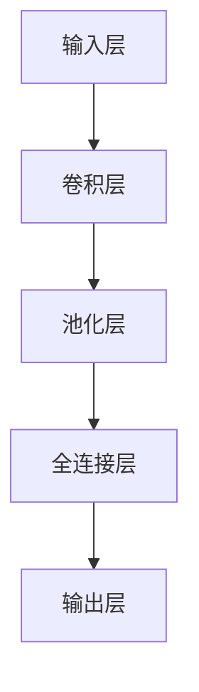

                 

# 计算机视觉任务中的模型选择

> **关键词**：计算机视觉、模型选择、深度学习、卷积神经网络、数据集、性能评估

> **摘要**：本文将详细探讨在计算机视觉任务中如何选择合适的模型。首先，我们将介绍计算机视觉的基本概念及其重要性，接着讨论深度学习模型在计算机视觉中的应用。然后，我们将分析如何选择合适的模型，包括数据集的准备、性能评估方法以及如何权衡不同模型的优缺点。通过实际案例和代码解析，我们将展示模型选择的实际操作步骤。最后，我们将探讨当前技术的发展趋势以及未来可能面临的挑战。

## 1. 背景介绍

### 1.1 目的和范围

本文的目的是帮助读者了解在计算机视觉任务中选择合适模型的过程。计算机视觉是人工智能领域的一个重要分支，涉及到从图像或视频中提取信息的技术。深度学习模型，尤其是卷积神经网络（CNN），在计算机视觉中取得了显著的成果。然而，如何选择一个既适用于特定任务又能达到高性能的模型，仍然是一个具有挑战性的问题。

本文将涵盖以下内容：
1. 计算机视觉的基本概念和重要性。
2. 深度学习模型在计算机视觉中的应用。
3. 模型选择的关键因素和性能评估方法。
4. 实际案例和代码解析，展示模型选择的具体步骤。
5. 当前技术发展趋势和未来挑战。

### 1.2 预期读者

本文适合对计算机视觉和深度学习有一定了解的读者，包括：
1. 计算机视觉研究人员。
2. 深度学习开发者。
3. AI领域的学生和专业人员。

### 1.3 文档结构概述

本文分为十个部分，如下所示：
1. 引言：介绍文章的目的、关键词和摘要。
2. 背景介绍：包括目的和范围、预期读者、文档结构概述。
3. 核心概念与联系：介绍计算机视觉和深度学习的基本概念，以及相关架构的流程图。
4. 核心算法原理 & 具体操作步骤：详细阐述模型选择的算法原理和操作步骤。
5. 数学模型和公式 & 详细讲解 & 举例说明：介绍与模型选择相关的数学模型和公式。
6. 项目实战：代码实际案例和详细解释说明。
7. 实际应用场景：讨论模型选择在不同场景中的应用。
8. 工具和资源推荐：推荐学习资源、开发工具和框架。
9. 总结：未来发展趋势与挑战。
10. 附录：常见问题与解答。
11. 扩展阅读 & 参考资料：提供进一步学习的资源。

### 1.4 术语表

#### 1.4.1 核心术语定义

- **计算机视觉**：使计算机能够像人类一样理解和解释图像或视频的技术。
- **深度学习**：一种机器学习技术，通过构建深度神经网络来模拟人类大脑处理信息的方式。
- **卷积神经网络（CNN）**：一种特殊的深度神经网络，主要用于处理图像数据。
- **模型选择**：在给定任务和数据集的基础上，选择一个最适合的深度学习模型。
- **数据集**：用于训练、验证和测试模型的图像或视频数据集合。
- **性能评估**：评估模型在特定任务上的表现，通常使用指标如准确率、召回率和F1分数。

#### 1.4.2 相关概念解释

- **过拟合**：模型在训练数据上表现很好，但在测试数据上表现较差，因为模型对训练数据过于“适应”。
- **欠拟合**：模型在训练数据上表现较差，因为模型过于简单，无法捕捉数据中的复杂模式。
- **数据增强**：通过变换、旋转、缩放等方式增加数据多样性，从而提高模型的泛化能力。
- **迁移学习**：利用预训练的模型在特定任务上进行微调，从而提高模型在新任务上的表现。

#### 1.4.3 缩略词列表

- **CNN**：卷积神经网络（Convolutional Neural Network）
- **GPU**：图形处理单元（Graphics Processing Unit）
- **AI**：人工智能（Artificial Intelligence）
- **DL**：深度学习（Deep Learning）
- **NLP**：自然语言处理（Natural Language Processing）

## 2. 核心概念与联系

### 2.1 计算机视觉的基本概念

计算机视觉是一门研究如何使计算机能够像人类一样理解和解释图像或视频的技术。它涉及多个领域，包括图像处理、计算机视觉、机器学习和人工智能。计算机视觉的目标是使计算机能够自动地识别、分析和理解图像或视频中的信息。

计算机视觉的主要任务包括：

1. **图像分类**：将图像分类到预定义的类别中。
2. **目标检测**：在图像中检测出特定目标的位置和范围。
3. **图像分割**：将图像分成不同的区域，每个区域对应于不同的对象或场景。
4. **姿态估计**：估计图像中人的姿势和运动。
5. **场景重建**：从图像中重建三维场景。

### 2.2 深度学习模型在计算机视觉中的应用

深度学习模型，特别是卷积神经网络（CNN），在计算机视觉中取得了显著的成果。CNN 是一种特殊的神经网络，通过卷积操作来提取图像中的局部特征。与传统的机器学习模型相比，CNN 具有更强的表达能力和适应性，可以处理复杂的图像数据。

CNN 的工作原理如下：

1. **输入层**：接收原始图像数据。
2. **卷积层**：通过卷积操作提取图像中的特征。
3. **池化层**：对卷积层的结果进行降维和特征提取。
4. **全连接层**：将池化层的结果映射到预定义的类别。
5. **输出层**：输出模型的预测结果。

### 2.3 相关架构的 Mermaid 流程图



## 3. 核心算法原理 & 具体操作步骤

### 3.1 模型选择的基本原则

在选择合适的模型时，需要考虑以下原则：

1. **任务类型**：不同的任务需要不同的模型。例如，目标检测通常使用 Faster R-CNN 或 YOLO，而图像分类通常使用 ResNet 或 VGG。
2. **数据集规模**：大型的数据集通常需要更复杂的模型，而小型数据集则可能需要简单的模型以避免过拟合。
3. **计算资源**：模型的计算复杂度不同，需要根据可用的计算资源进行选择。
4. **性能要求**：根据任务的要求，选择能够在特定指标上达到高性能的模型。

### 3.2 模型选择的算法原理

模型选择可以通过以下步骤进行：

1. **数据集划分**：将数据集划分为训练集、验证集和测试集。
2. **模型训练**：使用训练集对模型进行训练，并使用验证集进行模型调整。
3. **性能评估**：使用测试集对模型进行性能评估，并选择性能最佳的模型。
4. **模型调优**：对选定的模型进行进一步调优，以提高性能。

### 3.3 具体操作步骤

以下是一个模型选择的伪代码示例：

```python
# 初始化数据集
train_data, val_data, test_data = split_dataset(data, train_size=0.8, val_size=0.1, test_size=0.1)

# 初始化模型
model = initialize_model()

# 训练模型
for epoch in range(num_epochs):
    train_loss = train_model(model, train_data)
    val_loss = validate_model(model, val_data)

    # early stopping 或其他调优策略
    if is_early_stopping(val_loss):
        break

# 性能评估
test_loss, test_accuracy = evaluate_model(model, test_data)

# 打印结果
print(f"Test loss: {test_loss}, Test accuracy: {test_accuracy}")

# 模型调优
model = tune_model(model, test_data)

# 最终评估
final_test_loss, final_test_accuracy = evaluate_model(model, test_data)
print(f"Final test loss: {final_test_loss}, Final test accuracy: {final_test_accuracy}")
```

## 4. 数学模型和公式 & 详细讲解 & 举例说明

### 4.1 数学模型和公式

在计算机视觉任务中，选择模型时需要考虑多个数学模型和公式。以下是一些常见的数学模型和公式：

1. **交叉熵损失函数**：用于分类任务，公式为：
   $$ H(y, \hat{y}) = -\sum_{i} y_i \log(\hat{y}_i) $$
   其中，$y$ 是真实标签，$\hat{y}$ 是模型预测的概率分布。

2. **均方误差损失函数**：用于回归任务，公式为：
   $$ MSE(y, \hat{y}) = \frac{1}{n}\sum_{i}(y_i - \hat{y}_i)^2 $$
   其中，$y$ 是真实值，$\hat{y}$ 是模型预测的值。

3. **精度、召回率和F1分数**：用于评估分类任务性能的指标，公式为：
   $$ Precision = \frac{TP}{TP + FP} $$
   $$ Recall = \frac{TP}{TP + FN} $$
   $$ F1 = 2 \times \frac{Precision \times Recall}{Precision + Recall} $$
   其中，$TP$ 是真正例，$FP$ 是假正例，$TN$ 是真负例，$FN$ 是假负例。

### 4.2 举例说明

假设我们有一个二分类任务，目标是预测图像中是否包含特定目标。使用交叉熵损失函数进行模型训练和评估。

1. **训练过程**：

   - **数据集**：训练集包含1000个图像，每个图像都有一个真实标签（0或1）。
   - **模型**：使用一个简单的CNN模型进行训练。
   - **损失函数**：使用交叉熵损失函数。
   - **优化器**：使用Adam优化器进行优化。

   伪代码如下：

   ```python
   model = initialize_model()
   loss_function = CrossEntropyLoss()
   optimizer = Adam(model.parameters(), lr=0.001)

   for epoch in range(num_epochs):
       for image, label in train_data:
           optimizer.zero_grad()
           prediction = model(image)
           loss = loss_function(prediction, label)
           loss.backward()
           optimizer.step()

       print(f"Epoch {epoch}: Loss = {loss}")
   ```

2. **评估过程**：

   - **测试集**：包含500个图像，用于评估模型性能。
   - **指标**：计算精度、召回率和F1分数。

   伪代码如下：

   ```python
   model = initialize_model()
   loss_function = CrossEntropyLoss()
   test_loss = 0
   correct = 0
   total = 0

   for image, label in test_data:
       prediction = model(image)
       loss = loss_function(prediction, label)
       test_loss += loss

       predicted = prediction.argmax()
       total += 1
       if predicted == label:
           correct += 1

   accuracy = correct / total
   precision = correct / (correct + false_positives)
   recall = correct / (correct + false_negatives)
   f1 = 2 * (precision * recall) / (precision + recall)

   print(f"Test Loss: {test_loss}, Accuracy: {accuracy}, Precision: {precision}, Recall: {recall}, F1: {f1}")
   ```

通过上述示例，我们可以看到如何使用数学模型和公式来训练和评估模型。

## 5. 项目实战：代码实际案例和详细解释说明

### 5.1 开发环境搭建

在开始实际案例之前，我们需要搭建一个适合深度学习开发的开发环境。以下是一个简单的步骤：

1. 安装Python：确保安装了Python 3.x版本。
2. 安装深度学习框架：使用pip安装TensorFlow或PyTorch。
   ```shell
   pip install tensorflow
   # 或者
   pip install pytorch torchvision
   ```
3. 安装其他依赖库：例如 NumPy、Matplotlib 等。

### 5.2 源代码详细实现和代码解读

以下是一个简单的图像分类模型的实现，包括数据集加载、模型训练和性能评估。

```python
import tensorflow as tf
from tensorflow.keras import layers, models
from tensorflow.keras.preprocessing.image import ImageDataGenerator

# 加载数据集
train_data = ImageDataGenerator(rescale=1./255).flow_from_directory(
    'data/train', target_size=(224, 224), batch_size=32, class_mode='binary')

val_data = ImageDataGenerator(rescale=1./255).flow_from_directory(
    'data/val', target_size=(224, 224), batch_size=32, class_mode='binary')

# 构建模型
model = models.Sequential([
    layers.Conv2D(32, (3, 3), activation='relu', input_shape=(224, 224, 3)),
    layers.MaxPooling2D((2, 2)),
    layers.Conv2D(64, (3, 3), activation='relu'),
    layers.MaxPooling2D((2, 2)),
    layers.Conv2D(128, (3, 3), activation='relu'),
    layers.MaxPooling2D((2, 2)),
    layers.Flatten(),
    layers.Dense(128, activation='relu'),
    layers.Dense(1, activation='sigmoid')
])

# 编译模型
model.compile(optimizer='adam', loss='binary_crossentropy', metrics=['accuracy'])

# 训练模型
model.fit(train_data, epochs=10, validation_data=val_data)

# 评估模型
test_loss, test_accuracy = model.evaluate(val_data)
print(f"Test accuracy: {test_accuracy}")

# 保存模型
model.save('image_classification_model.h5')
```

### 5.3 代码解读与分析

1. **数据集加载**：使用 `ImageDataGenerator` 类加载和预处理图像数据。`flow_from_directory` 方法将图像数据按照目录结构自动划分到训练集和验证集。

2. **模型构建**：使用 `Sequential` 模型堆叠多个层，包括卷积层、池化层和全连接层。输入层的大小为 `(224, 224, 3)`，表示图像尺寸为224x224，通道数为3（RGB）。

3. **模型编译**：设置优化器和损失函数。在这里，我们使用 `adam` 优化器和 `binary_crossentropy` 损失函数，因为这是一个二分类任务。

4. **模型训练**：使用 `fit` 方法训练模型。在这里，我们设置了训练轮数为10，并使用验证数据集进行验证。

5. **模型评估**：使用 `evaluate` 方法评估模型在验证数据集上的性能。输出为损失和准确率。

6. **模型保存**：使用 `save` 方法将训练好的模型保存到文件中。

通过这个简单的案例，我们可以看到如何使用深度学习框架实现一个图像分类模型。实际项目中，可能需要更复杂的模型和数据处理步骤，但基本步骤是类似的。

## 6. 实际应用场景

### 6.1 医学图像分析

在医学图像分析中，模型选择至关重要。例如，在乳腺癌检测中，可以选择卷积神经网络（CNN）对乳腺X射线图像进行分类。模型需要具备高准确率，以减少误诊率。在实际应用中，通常需要进行大量的数据增强和模型调优，以提高模型的泛化能力。

### 6.2 智能交通系统

在智能交通系统中，模型选择用于车辆检测、行人检测和交通标志识别。这些任务通常需要高召回率，以确保不会遗漏重要的目标。因此，可以选择像 Faster R-CNN 或 YOLO 这样的目标检测模型。在实际应用中，需要考虑计算资源限制，选择合适的模型和算法。

### 6.3 人脸识别

在人脸识别领域，模型选择需要兼顾准确率和计算效率。例如，在智能手机中，可以使用基于 CNN 的人脸检测算法，同时保证低延迟。在实际应用中，可能需要使用迁移学习，利用预训练的模型进行快速识别。

### 6.4 自然语言处理

虽然本文主要关注计算机视觉任务，但模型选择同样适用于其他领域，如自然语言处理（NLP）。在 NLP 中，可以选择基于 CNN 或 Transformer 的模型，如 BERT 或 GPT，以实现文本分类、问答系统等任务。模型选择时需要考虑语言模型的大小和计算资源限制。

## 7. 工具和资源推荐

### 7.1 学习资源推荐

#### 7.1.1 书籍推荐

- **《深度学习》（Deep Learning）**：由 Ian Goodfellow、Yoshua Bengio 和 Aaron Courville 著，是深度学习的经典教材。
- **《计算机视觉：算法与应用》（Computer Vision: Algorithms and Applications）**：由 Richard Szeliski 著，涵盖了计算机视觉的多个方面。
- **《Python深度学习》（Python Deep Learning）**：由 FrancisHuwaire 和 AdeelM.Ali 著，介绍如何使用 Python 实现深度学习算法。

#### 7.1.2 在线课程

- **斯坦福大学《深度学习专项课程》（Stanford University Deep Learning Specialization）**：由 Andrew Ng 开设，涵盖深度学习的多个方面。
- **吴恩达《强化学习专项课程》（Andrew Ng Reinforcement Learning Specialization）**：介绍如何使用深度学习实现强化学习算法。
- **麻省理工学院《计算机视觉》（MIT OpenCourseWare Computer Vision）**：提供计算机视觉的免费课程和教材。

#### 7.1.3 技术博客和网站

- **Medium**：有大量关于深度学习和计算机视觉的文章。
- **ArXiv**：发布最新研究成果的预印本论文库。
- **GitHub**：许多开源项目和代码示例，供学习和参考。

### 7.2 开发工具框架推荐

#### 7.2.1 IDE和编辑器

- **PyCharm**：强大的Python IDE，支持深度学习和计算机视觉项目。
- **VS Code**：轻量级的代码编辑器，支持多种编程语言和扩展。

#### 7.2.2 调试和性能分析工具

- **TensorBoard**：TensorFlow 提供的调试和性能分析工具，用于可视化模型训练过程。
- **Wandb**：用于实验管理和模型性能监控的平台。

#### 7.2.3 相关框架和库

- **TensorFlow**：开源的深度学习框架，适用于多种任务。
- **PyTorch**：Python 首选的深度学习框架，具有动态计算图。
- **OpenCV**：开源的计算机视觉库，提供丰富的图像处理和计算机视觉功能。

### 7.3 相关论文著作推荐

#### 7.3.1 经典论文

- **“A Comprehensive Survey on Deep Learning for Image Classification”**：一篇全面综述深度学习在图像分类中的应用。
- **“Faster R-CNN: Towards Real-Time Object Detection with Region Proposal Networks”**：提出 Faster R-CNN 目标检测算法。
- **“You Only Look Once: Unified, Real-Time Object Detection”**：提出 YOLO 目标检测算法。

#### 7.3.2 最新研究成果

- **“Swin Transformer: Hierarchical Vision Transformer using Shifted Windows”**：提出 Swin Transformer，一种基于窗口的视觉 Transformer。
- **“ViT is All You Need: A Simple and Scalable Vision Transformer”**：证明 Vision Transformer 在图像分类任务中的有效性。

#### 7.3.3 应用案例分析

- **“Deep Learning for Human Pose Estimation: A Survey”**：综述深度学习在人体姿态估计中的应用。
- **“Deepfake Detection Using Vision and Audio Techniques”**：讨论深度伪造检测技术。

## 8. 总结：未来发展趋势与挑战

### 8.1 未来发展趋势

- **模型压缩与优化**：为了提高模型的实用性和部署效率，模型压缩和优化技术将得到更多关注，如量化、剪枝和蒸馏。
- **实时推理**：随着边缘计算和移动设备的发展，实时推理技术将成为热点，以支持实时应用。
- **多模态学习**：结合图像、文本、音频等多种模态的数据，将进一步提升模型的性能和泛化能力。
- **迁移学习与自适应学习**：通过迁移学习和自适应学习，模型可以在不同任务和数据集上快速适应，提高泛化能力。

### 8.2 未来挑战

- **计算资源限制**：随着模型复杂度的增加，对计算资源的需求也日益增长，如何在有限的资源下实现高效的模型训练和推理，仍然是一个挑战。
- **数据隐私与安全**：在数据驱动的模型训练过程中，数据隐私和安全问题日益凸显，如何保护用户隐私和数据安全，是一个亟待解决的问题。
- **模型解释性与可解释性**：随着深度学习模型在关键领域的应用，模型解释性和可解释性变得尤为重要，如何让模型的行为和决策更加透明，是一个挑战。
- **公平性与多样性**：深度学习模型可能存在偏见和歧视问题，如何确保模型的公平性和多样性，是一个重要的伦理和社会问题。

## 9. 附录：常见问题与解答

### 9.1 如何处理过拟合和欠拟合？

**过拟合**：过拟合是指模型在训练数据上表现良好，但在测试数据上表现较差，因为模型对训练数据过于“适应”。解决方法包括：
1. **数据增强**：通过变换、旋转、缩放等方式增加数据多样性，从而提高模型的泛化能力。
2. **正则化**：添加正则化项，如 L1 或 L2 正则化，以减少模型复杂度。
3. **提前停止**：在训练过程中，当验证损失不再降低时，提前停止训练。

**欠拟合**：欠拟合是指模型在训练数据上表现较差，因为模型过于简单，无法捕捉数据中的复杂模式。解决方法包括：
1. **增加模型复杂度**：增加网络的层数或神经元数量，以提高模型的表达能力。
2. **增加训练数据**：使用更多样化的数据集进行训练，以提高模型的泛化能力。
3. **减少正则化**：减少正则化强度，以降低模型复杂度。

### 9.2 如何选择合适的深度学习框架？

选择深度学习框架时，需要考虑以下因素：
1. **任务需求**：根据任务的类型和数据规模，选择适合的框架。例如，TensorFlow 适用于复杂任务和大规模数据，PyTorch 适用于研究和快速原型开发。
2. **社区支持**：选择有活跃社区和丰富资源的框架，以便在遇到问题时能够得到帮助。
3. **计算资源**：根据可用的计算资源，选择适合的框架。例如，使用 GPU 加速时，可以选择 TensorFlow 或 PyTorch。
4. **开发效率**：选择支持快速开发和迭代的框架，以提高开发效率。

### 9.3 如何评估模型的性能？

评估模型的性能通常包括以下步骤：
1. **准确率**：计算模型预测正确的样本数量与总样本数量的比例。
2. **召回率**：计算模型预测正确的样本数量与实际正样本数量的比例。
3. **F1 分数**：结合准确率和召回率，计算模型的综合性能指标。
4. **ROC 曲线和 AUC**：绘制接收者操作特征（ROC）曲线，计算曲线下的面积（AUC），以评估模型的分类能力。

## 10. 扩展阅读 & 参考资料

### 10.1 书籍推荐

- **《深度学习》（Deep Learning）**：Ian Goodfellow、Yoshua Bengio 和 Aaron Courville 著。
- **《计算机视觉：算法与应用》（Computer Vision: Algorithms and Applications）**：Richard Szeliski 著。
- **《Python深度学习》（Python Deep Learning）**：Francis Huwaire 和 Adeel M. Ali 著。

### 10.2 在线课程

- **斯坦福大学《深度学习专项课程》（Stanford University Deep Learning Specialization）**：由 Andrew Ng 开设。
- **吴恩达《强化学习专项课程》（Andrew Ng Reinforcement Learning Specialization）**：介绍如何使用深度学习实现强化学习算法。
- **麻省理工学院《计算机视觉》（MIT OpenCourseWare Computer Vision）**：提供计算机视觉的免费课程和教材。

### 10.3 技术博客和网站

- **Medium**：有大量关于深度学习和计算机视觉的文章。
- **ArXiv**：发布最新研究成果的预印本论文库。
- **GitHub**：许多开源项目和代码示例，供学习和参考。

### 10.4 开发工具框架推荐

- **TensorFlow**：适用于复杂任务和大规模数据。
- **PyTorch**：适用于研究和快速原型开发。
- **OpenCV**：适用于图像处理和计算机视觉功能。

### 10.5 相关论文著作推荐

- **“A Comprehensive Survey on Deep Learning for Image Classification”**：综述深度学习在图像分类中的应用。
- **“Faster R-CNN: Towards Real-Time Object Detection with Region Proposal Networks”**：提出 Faster R-CNN 目标检测算法。
- **“You Only Look Once: Unified, Real-Time Object Detection”**：提出 YOLO 目标检测算法。

### 10.6 最新研究成果

- **“Swin Transformer: Hierarchical Vision Transformer using Shifted Windows”**：提出 Swin Transformer。
- **“ViT is All You Need: A Simple and Scalable Vision Transformer”**：证明 Vision Transformer 在图像分类任务中的有效性。

### 10.7 应用案例分析

- **“Deep Learning for Human Pose Estimation: A Survey”**：综述深度学习在人体姿态估计中的应用。
- **“Deepfake Detection Using Vision and Audio Techniques”**：讨论深度伪造检测技术。

