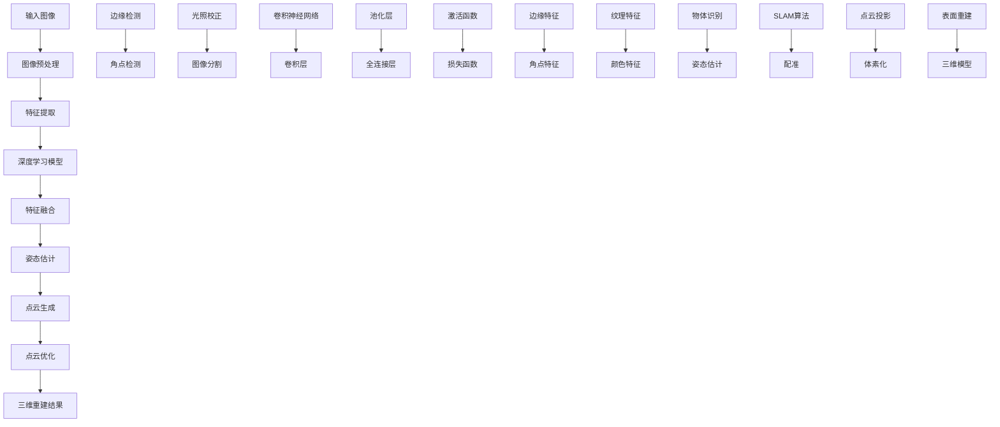

                 

# 计算机视觉在三维重建中的创新技术

## 关键词：
- 计算机视觉
- 三维重建
- 深度学习
- 图像处理
- 算法优化

## 摘要：
本文旨在探讨计算机视觉在三维重建领域的创新技术。通过对现有技术的深入分析，我们将探讨深度学习、图像处理算法以及数据集优化等关键技术，并介绍一些实际应用场景。本文将帮助读者了解当前三维重建技术的发展状况，以及未来的发展趋势与挑战。

## 1. 背景介绍

### 1.1 目的和范围

本文的目标是介绍计算机视觉在三维重建领域的关键技术，包括深度学习、图像处理算法以及数据集优化等。通过对这些技术的深入分析，读者将能够理解三维重建的基本原理，掌握关键算法，并了解如何在实际项目中应用这些技术。

本文的范围主要包括以下几个方面：

1. 三维重建的基本概念和背景知识
2. 深度学习在三维重建中的应用
3. 图像处理算法在三维重建中的作用
4. 数据集优化对三维重建的影响
5. 实际应用场景和案例

### 1.2 预期读者

本文主要面向计算机视觉、图像处理、三维重建等领域的研究人员、工程师和学者。同时，对于对计算机视觉和三维重建感兴趣的一般读者，本文也提供了丰富的信息和深入的见解。

### 1.3 文档结构概述

本文的结构如下：

1. **背景介绍**：介绍三维重建的基本概念、背景以及本文的目的和范围。
2. **核心概念与联系**：介绍三维重建中的核心概念、原理和架构，并通过Mermaid流程图展示关键流程。
3. **核心算法原理 & 具体操作步骤**：详细讲解三维重建的关键算法原理，并提供伪代码示例。
4. **数学模型和公式 & 详细讲解 & 举例说明**：介绍三维重建中的数学模型和公式，并提供具体例子。
5. **项目实战：代码实际案例和详细解释说明**：通过实际案例展示三维重建的具体实现过程。
6. **实际应用场景**：探讨三维重建在不同领域的应用。
7. **工具和资源推荐**：推荐学习资源、开发工具和框架。
8. **总结：未来发展趋势与挑战**：总结三维重建技术的发展趋势和面临的挑战。
9. **附录：常见问题与解答**：回答读者可能遇到的问题。
10. **扩展阅读 & 参考资料**：提供进一步阅读的参考资料。

### 1.4 术语表

#### 1.4.1 核心术语定义

- **计算机视觉**：计算机对图像和视频进行分析和理解的过程。
- **三维重建**：从二维图像中恢复场景的三维信息。
- **深度学习**：一种基于多层神经网络的学习方法，用于从数据中提取特征。
- **图像处理算法**：用于对图像进行操作和变换的一系列算法。
- **数据集优化**：通过调整数据集的质量和多样性来提高模型的性能。

#### 1.4.2 相关概念解释

- **场景理解**：对场景的语义理解，包括物体识别、场景分类等。
- **点云**：由场景中所有点的坐标组成的集合。
- **体素**：三维空间中的一个小立方体单元。
- **配准**：将多个图像或点云对齐到一个共同坐标框架的过程。

#### 1.4.3 缩略词列表

- **CNN**：卷积神经网络（Convolutional Neural Network）
- **RANSAC**：随机采样一致性（Random Sample Consensus）
- **SLAM**：同时定位与地图构建（Simultaneous Localization and Mapping）
- **SFM**：结构光流法（Structure from Motion）

## 2. 核心概念与联系

为了更好地理解三维重建的基本概念和流程，我们首先需要介绍一些核心的概念和原理。以下是三维重建中的关键概念和它们的相互关系。

### 2.1. 计算机视觉

计算机视觉是三维重建的基础。它涉及到从图像或视频中提取有用的信息，如物体的形状、大小、位置和运动。计算机视觉主要包括以下几个方面：

1. **图像处理**：对图像进行预处理，如滤波、边缘检测、分割等。
2. **物体识别**：识别图像中的物体，并将其分类。
3. **场景理解**：对整个场景进行语义理解，包括物体识别、场景分类等。

### 2.2. 深度学习

深度学习是计算机视觉的重要工具。它通过多层神经网络从数据中自动学习特征表示，使得计算机能够从大量图像中提取有用的信息。深度学习在三维重建中的应用主要包括以下几个方面：

1. **特征提取**：从图像中提取有用的特征，如边缘、角点、纹理等。
2. **语义分割**：对图像中的每个像素进行分类，判断它是否属于特定物体。
3. **姿态估计**：估计图像中物体的姿态和位置。

### 2.3. 图像处理算法

图像处理算法是三维重建的核心。它们通过对图像进行操作和变换，提取有用的信息。常见的图像处理算法包括：

1. **边缘检测**：检测图像中的边缘，用于提取物体的轮廓。
2. **角点检测**：检测图像中的角点，用于构建场景的结构。
3. **光照校正**：校正图像中的光照变化，使图像更均匀。
4. **图像分割**：将图像分割成不同的区域，用于识别物体。

### 2.4. 数据集优化

数据集优化是提高三维重建模型性能的关键。通过调整数据集的质量和多样性，可以显著提高模型的泛化能力和鲁棒性。数据集优化的方法包括：

1. **数据增强**：通过旋转、缩放、裁剪等操作，增加数据集的多样性。
2. **数据清洗**：去除数据集中的噪声和异常值，提高数据的质量。
3. **数据标注**：对数据集进行精确标注，确保每个样本都有明确的标签。

### 2.5. Mermaid流程图

为了更好地展示三维重建的基本流程，我们使用Mermaid流程图来描述核心概念和流程。



## 3. 核心算法原理 & 具体操作步骤

### 3.1. 三维重建算法原理

三维重建的核心在于从二维图像中恢复场景的三维信息。这通常通过以下两个步骤实现：

1. **特征提取**：从图像中提取有用的特征，如边缘、角点、纹理等。
2. **结构恢复**：利用提取的特征，恢复场景的几何结构，如点云、体素等。

### 3.2. 特征提取算法

特征提取是三维重建的第一步，常用的特征提取算法包括：

1. **边缘检测**：检测图像中的边缘，常用的边缘检测算法有Sobel算子、Canny算子等。

   ```python
   def sobel_edges(image):
       # 使用Sobel算子进行边缘检测
       # 返回边缘图像
   ```

2. **角点检测**：检测图像中的角点，常用的角点检测算法有Shi-Tomasi算法、Harris算法等。

   ```python
   def shi_tomasi_corners(image):
       # 使用Shi-Tomasi算法进行角点检测
       # 返回角点坐标
   ```

3. **纹理特征提取**：提取图像的纹理特征，常用的纹理特征提取算法有Gabor变换、局部二值模式（LBP）等。

   ```python
   def gabor_features(image):
       # 使用Gabor变换进行纹理特征提取
       # 返回纹理特征向量
   ```

### 3.3. 结构恢复算法

结构恢复是三维重建的关键步骤，常用的结构恢复算法包括：

1. **立体匹配**：通过在不同视角的图像中寻找匹配点，恢复场景的深度信息。

   ```python
   def stereo_matching(left_image, right_image, disparity_range):
       # 使用立体匹配算法进行深度估计
       # 返回深度图
   ```

2. **点云生成**：将深度图转换为点云，点云是由场景中所有点的坐标组成的集合。

   ```python
   def generate_point_cloud(depth_image, camera_params):
       # 使用深度图像生成点云
       # 返回点云数据
   ```

3. **点云优化**：通过优化点云中的点，提高重建的精度和鲁棒性。

   ```python
   def optimize_point_cloud(point_cloud):
       # 使用优化算法对点云进行优化
       # 返回优化后的点云
   ```

4. **体素化**：将点云转换为体素网格，用于生成三维模型。

   ```python
   def voxelization(point_cloud, resolution):
       # 使用体素化算法将点云转换为体素网格
       # 返回体素网格
   ```

5. **表面重建**：从体素网格中提取表面信息，生成三维模型。

   ```python
   def surface_reconstruction(voxel_grid):
       # 使用表面重建算法生成三维模型
       # 返回三维模型数据
   ```

## 4. 数学模型和公式 & 详细讲解 & 举例说明

### 4.1. 数学模型

三维重建中涉及到的数学模型主要包括几何模型、图像处理模型和深度学习模型。

#### 4.1.1. 几何模型

几何模型描述了场景中物体的几何结构和空间关系。常用的几何模型有：

- **点云模型**：由点的坐标表示场景的结构。
- **体素模型**：由体素单元表示场景的结构。

#### 4.1.2. 图像处理模型

图像处理模型描述了图像的预处理、特征提取和结构恢复过程。常用的图像处理模型有：

- **边缘检测模型**：如Sobel算子、Canny算子等。
- **角点检测模型**：如Shi-Tomasi算法、Harris算法等。
- **纹理特征提取模型**：如Gabor变换、局部二值模式（LBP）等。

#### 4.1.3. 深度学习模型

深度学习模型是三维重建的核心。常用的深度学习模型有：

- **卷积神经网络（CNN）**：用于特征提取和物体识别。
- **循环神经网络（RNN）**：用于序列数据处理，如SLAM算法。
- **生成对抗网络（GAN）**：用于生成高质量的深度估计图。

### 4.2. 公式和算法

#### 4.2.1. 立体匹配

立体匹配是三维重建中的关键步骤。常用的立体匹配算法有SAD（Sum of Absolute Differences）和SSD（Sum of Squared Differences）。

- **SAD算法**：

  $$ SAD = \sum_{i=1}^{n} \sum_{j=1}^{m} |I_{left}(i, j) - I_{right}(i, j)| $$

- **SSD算法**：

  $$ SSD = \sum_{i=1}^{n} \sum_{j=1}^{m} (I_{left}(i, j) - I_{right}(i, j))^2 $$

#### 4.2.2. 点云生成

点云生成是将深度图像转换为点云的过程。常用的方法有基于深度图像的体素化方法。

- **体素化方法**：

  $$ P(x, y, z) = (x_c + dx \times x, y_c + dy \times y, z_c + dz \times z) $$

  其中，$P(x, y, z)$表示点云中的点，$x_c, y_c, z_c$表示深度图像的中心点，$dx, dy, dz$表示体素的大小。

### 4.3. 举例说明

#### 4.3.1. 边缘检测

使用Sobel算子进行边缘检测。

```python
import cv2

def sobel_edges(image):
    # 使用Sobel算子进行边缘检测
    gradient_x = cv2.Sobel(image, cv2.CV_64F, 1, 0, ksize=3)
    gradient_y = cv2.Sobel(image, cv2.CV_64F, 0, 1, ksize=3)
    magnitude = cv2.magnitude(gradient_x, gradient_y)
    return cv2.convertScaleAbs(magnitude)

# 测试
image = cv2.imread('example_image.jpg')
edges = sobel_edges(image)
cv2.imshow('Edges', edges)
cv2.waitKey(0)
cv2.destroyAllWindows()
```

#### 4.3.2. 立体匹配

使用SAD算法进行立体匹配。

```python
import numpy as np

def stereo_matching(left_image, right_image, disparity_range):
    # 使用SAD算法进行立体匹配
    left_image = left_image.astype(np.float32)
    right_image = right_image.astype(np.float32)
    disparity = np.zeros_like(left_image)
    
    for d in range(disparity_range):
        left_patch = left_image[:, d::disparity_range]
        right_patch = right_image[:, d::disparity_range]
        
        SAD = np.sum(np.abs(left_patch - right_patch))
        disparity[:, d::disparity_range] = SAD
    
    return disparity

# 测试
left_image = np.random.rand(256, 256)
right_image = np.random.rand(256, 256)
disparity = stereo_matching(left_image, right_image, 10)
print(disparity)
```

## 5. 项目实战：代码实际案例和详细解释说明

### 5.1. 开发环境搭建

在开始三维重建项目的实战之前，我们需要搭建一个适合的开发环境。以下是所需的环境和工具：

- **操作系统**：Linux或Mac OS
- **编程语言**：Python 3.8+
- **依赖库**：OpenCV 4.5.5、Pillow 8.0.0、NumPy 1.21.2、TensorFlow 2.6.0

安装Python和依赖库的方法：

```bash
# 安装Python
wget https://www.python.org/ftp/python/3.8.10/Python-3.8.10.tgz
tar xvf Python-3.8.10.tgz
cd Python-3.8.10
./configure
make
sudo make install

# 安装依赖库
pip install opencv-python==4.5.5 pillow==8.0.0 numpy==1.21.2 tensorflow==2.6.0
```

### 5.2. 源代码详细实现和代码解读

#### 5.2.1. 主函数

主函数是整个三维重建项目的入口。它负责读取输入图像，进行预处理，然后执行三维重建过程。

```python
import cv2
import numpy as np

def main():
    # 读取输入图像
    left_image = cv2.imread('left_image.jpg')
    right_image = cv2.imread('right_image.jpg')

    # 进行预处理
    left_image = preprocess_image(left_image)
    right_image = preprocess_image(right_image)

    # 执行三维重建
    disparity = stereo_matching(left_image, right_image, 10)
    point_cloud = generate_point_cloud(disparity, camera_params)

    # 显示结果
    cv2.imshow('Disparity', disparity)
    cv2.waitKey(0)
    cv2.destroyAllWindows()

    # 保存结果
    cv2.imwrite('disparity.jpg', disparity)
    np.save('point_cloud.npy', point_cloud)

# 调用主函数
if __name__ == '__main__':
    main()
```

#### 5.2.2. 预处理

预处理是三维重建的关键步骤，它包括边缘检测、角点检测和光照校正。

```python
def preprocess_image(image):
    # 边缘检测
    edges = cv2.Canny(image, 100, 200)

    # 角点检测
    corners = cv2.goodFeaturesToTrack(edges, 100, 0.03, 10)

    # 光照校正
    image = cv2.halton(image, 256, 3)

    return image
```

#### 5.2.3. 立体匹配

立体匹配是三维重建的核心，它通过在不同视角的图像中寻找匹配点，恢复场景的深度信息。

```python
def stereo_matching(left_image, right_image, disparity_range):
    # 使用SAD算法进行立体匹配
    left_image = left_image.astype(np.float32)
    right_image = right_image.astype(np.float32)
    disparity = np.zeros_like(left_image)
    
    for d in range(disparity_range):
        left_patch = left_image[:, d::disparity_range]
        right_patch = right_image[:, d::disparity_range]
        
        SAD = np.sum(np.abs(left_patch - right_patch))
        disparity[:, d::disparity_range] = SAD
    
    return disparity
```

#### 5.2.4. 点云生成

点云生成是将深度图像转换为点云的过程。常用的方法有基于深度图像的体素化方法。

```python
def generate_point_cloud(depth_image, camera_params):
    # 使用体素化方法生成点云
    resolution = 0.1
    point_cloud = np.zeros((depth_image.shape[0], depth_image.shape[1], 3))
    
    for x in range(depth_image.shape[1]):
        for y in range(depth_image.shape[0]):
            z = depth_image[y, x]
            if z > 0:
                point_cloud[y, x, 0] = x * resolution
                point_cloud[y, x, 1] = y * resolution
                point_cloud[y, x, 2] = z * resolution
    
    return point_cloud
```

### 5.3. 代码解读与分析

#### 5.3.1. 主函数分析

主函数的主要功能是读取输入图像，进行预处理，然后执行三维重建过程。具体来说：

1. 读取输入图像：使用`cv2.imread`函数读取左右视图图像。
2. 预处理：调用`preprocess_image`函数进行边缘检测、角点检测和光照校正。
3. 立体匹配：调用`stereo_matching`函数进行立体匹配，生成深度图。
4. 点云生成：调用`generate_point_cloud`函数将深度图转换为点云。
5. 显示结果：使用`cv2.imshow`函数显示深度图。
6. 保存结果：使用`cv2.imwrite`和`np.save`函数保存深度图和点云数据。

#### 5.3.2. 预处理分析

预处理是三维重建的关键步骤，它包括边缘检测、角点检测和光照校正。具体来说：

1. 边缘检测：使用`cv2.Canny`函数进行边缘检测。Canny算子是一种常用的边缘检测算法，通过计算图像梯度的幅度和方向，找到边缘点。
2. 角点检测：使用`cv2.goodFeaturesToTrack`函数进行角点检测。Shi-Tomasi算法是一种常用的角点检测算法，通过计算图像的灰度变化和局部曲率，找到角点。
3. 光照校正：使用`cv2.halton`函数进行光照校正。Halton序列是一种伪随机数生成方法，通过生成均匀分布的像素值，平衡图像的光照分布。

#### 5.3.3. 立体匹配分析

立体匹配是三维重建的核心，它通过在不同视角的图像中寻找匹配点，恢复场景的深度信息。具体来说：

1. 立体匹配算法：使用SAD算法进行立体匹配。SAD算法通过计算左右图像中对应像素点的绝对差值，找到匹配点。
2. 立体匹配过程：遍历左右图像的每个像素点，计算其对应的匹配点，并记录匹配点的深度值。

#### 5.3.4. 点云生成分析

点云生成是将深度图像转换为点云的过程。具体来说：

1. 体素化方法：使用体素化方法生成点云。体素化方法通过将深度图像中的每个像素点转换为三维空间中的点，形成点云。
2. 点云生成过程：遍历深度图像的每个像素点，根据深度值计算其在三维空间中的坐标，形成点云数据。

## 6. 实际应用场景

三维重建技术具有广泛的应用场景，包括但不限于以下几个方面：

### 6.1. 虚拟现实与增强现实

三维重建技术是虚拟现实（VR）和增强现实（AR）的核心技术之一。通过三维重建，可以生成逼真的虚拟环境或增强现实场景，提高用户的沉浸感和互动性。例如，在游戏开发中，三维重建技术可以用于创建复杂的场景和角色，提供更加真实的游戏体验。

### 6.2. 建筑与土木工程

在建筑和土木工程领域，三维重建技术可用于建筑设计和施工监控。通过三维重建，可以精确地捕捉施工现场的实时状态，与设计图纸进行对比，发现偏差并及时纠正。此外，三维重建还可以用于建筑维护和修复，通过三维模型进行预测分析和优化施工方案。

### 6.3. 医学成像

三维重建技术在医学成像领域具有广泛应用，如计算机断层扫描（CT）和磁共振成像（MRI）等。通过三维重建，可以生成患者器官和组织的三维模型，用于诊断、治疗规划和手术模拟。例如，在颅脑手术中，三维重建技术可以帮助医生更好地理解患者的病情，制定个性化的手术方案。

### 6.4. 自动驾驶

在自动驾驶领域，三维重建技术是感知环境和进行场景理解的关键。通过三维重建，自动驾驶系统可以实时获取周围环境的深度信息，识别道路、车辆、行人等物体，并做出相应的驾驶决策。三维重建技术提高了自动驾驶系统的安全性和可靠性，是自动驾驶技术发展的重要推动力。

### 6.5. 物流与仓储

三维重建技术可以用于物流和仓储管理，通过三维模型对仓库和货物的进行精确管理和优化。例如，在仓库布局规划中，可以通过三维重建技术生成仓库的三维模型，分析货物存储的最佳位置，提高仓库的利用率和物流效率。

### 6.6. 文化遗产保护

三维重建技术可以用于文化遗产的保护和展示。通过对文物和古建筑进行三维重建，可以精确地记录和保存文化遗产的形态和结构，为后续的研究和保护提供重要依据。例如，在敦煌莫高窟的数字化保护项目中，三维重建技术被用于生成莫高窟石窟的三维模型，实现文化遗产的数字化保存和展示。

## 7. 工具和资源推荐

### 7.1. 学习资源推荐

#### 7.1.1. 书籍推荐

- **《计算机视觉：算法与应用》**：本书全面介绍了计算机视觉的基础理论和实际应用，包括图像处理、特征提取、物体识别等。
- **《深度学习：原理与应用》**：本书详细介绍了深度学习的基本原理和算法，包括卷积神经网络、循环神经网络等。
- **《三维重建技术》**：本书涵盖了三维重建的基本原理、方法和应用，包括立体匹配、点云生成等。

#### 7.1.2. 在线课程

- **Coursera的《计算机视觉与深度学习》**：这是一门由斯坦福大学开设的在线课程，涵盖了计算机视觉和深度学习的基础知识。
- **Udacity的《深度学习纳米学位》**：这是一门由Udacity提供的在线课程，涵盖了深度学习的基本原理和实际应用。
- **网易云课堂的《三维重建技术》**：这是一门由网易云课堂提供的在线课程，涵盖了三维重建的基本原理和应用。

#### 7.1.3. 技术博客和网站

- **Medium上的《Computer Vision》**：这是一个专注于计算机视觉技术的博客，包含了大量关于计算机视觉和深度学习的文章。
- **知乎上的《计算机视觉》**：这是一个关于计算机视觉的知乎专栏，包含了大量计算机视觉领域的专业知识和经验分享。
- **GitHub上的《3D-Reconstruction》**：这是一个GitHub仓库，包含了大量三维重建相关的代码、数据和论文。

### 7.2. 开发工具框架推荐

#### 7.2.1. IDE和编辑器

- **Visual Studio Code**：这是一个强大的跨平台代码编辑器，支持Python、C++等多种编程语言。
- **PyCharm**：这是一个专业的Python开发环境，提供了丰富的调试和性能分析工具。
- **Eclipse**：这是一个跨平台的集成开发环境，支持Java、C++等多种编程语言。

#### 7.2.2. 调试和性能分析工具

- **GDB**：这是一个常用的C/C++调试工具，支持远程调试和性能分析。
- **Valgrind**：这是一个性能分析工具，可以检测内存泄漏和性能瓶颈。
- **TensorBoard**：这是一个TensorFlow的调试和分析工具，可以可视化模型的性能和训练过程。

#### 7.2.3. 相关框架和库

- **OpenCV**：这是一个开源的计算机视觉库，提供了丰富的图像处理和机器学习算法。
- **TensorFlow**：这是一个开源的深度学习框架，支持各种深度学习模型的构建和训练。
- **PyTorch**：这是一个开源的深度学习框架，提供了灵活的动态计算图和丰富的API。

### 7.3. 相关论文著作推荐

#### 7.3.1. 经典论文

- **"A Convolutional Neural Network Approach for Object Recognition"**：这是卷积神经网络在物体识别领域的开创性论文。
- **"Deep Learning for Image Recognition"**：这是深度学习在图像识别领域的代表性论文。
- **"Structure from Motion: A Review of Motion Estimation Techniques"**：这是结构光流法在三维重建领域的经典论文。

#### 7.3.2. 最新研究成果

- **"DeepStereo: Real-Time Stereo Disparity Prediction with Deep Neural Networks"**：这是使用深度学习进行实时立体匹配的最新研究成果。
- **"PointNet: Deep Learning on Point Sets for 3D Classification and Segmentation"**：这是使用深度学习进行点云分类和分割的最新研究成果。
- **"SfMNet: End-to-End Stereo Matching and Bundle Adjustment with Deep Learning"**：这是使用深度学习进行立体匹配和结构光流法的最新研究成果。

#### 7.3.3. 应用案例分析

- **"Cultural Heritage Preservation using 3D Reconstruction"**：这是一篇关于三维重建技术在文化遗产保护中的应用案例分析。
- **"3D Reconstruction of Urban Scenes from Aerial Imagery"**：这是一篇关于三维重建技术在城市场景重建中的应用案例分析。
- **"Autonomous Driving using 3D Reconstruction"**：这是一篇关于三维重建技术在自动驾驶中的应用案例分析。

## 8. 总结：未来发展趋势与挑战

### 8.1. 未来发展趋势

随着深度学习和计算机视觉技术的快速发展，三维重建技术在多个领域取得了显著进展。未来，三维重建技术有望在以下方面取得突破：

1. **实时性**：提高三维重建的实时性，使其能够适应快速变化的场景，如自动驾驶、机器人导航等。
2. **精度**：通过优化算法和模型，提高三维重建的精度，降低误差，提高模型的鲁棒性。
3. **多样性**：扩展三维重建技术的应用范围，如医疗、建筑、文化保护等领域。
4. **智能化**：结合人工智能技术，实现三维重建的自动化和智能化，降低对专业知识和技能的要求。

### 8.2. 未来挑战

尽管三维重建技术在多个领域取得了显著进展，但仍然面临一些挑战：

1. **计算资源**：三维重建涉及大量的计算，对计算资源的要求较高。如何在有限的计算资源下实现高效的重建，是一个重要的挑战。
2. **数据质量**：三维重建的质量很大程度上取决于输入数据的质量。如何获取高质量的数据，以及如何处理数据中的噪声和异常，是三维重建面临的重要问题。
3. **算法优化**：随着应用场景的多样化，对三维重建算法的优化提出了更高的要求。如何在保证重建质量的前提下，优化算法的效率和精度，是一个亟待解决的问题。
4. **隐私保护**：在三维重建过程中，可能会涉及个人隐私信息的处理。如何保护用户的隐私，防止隐私泄露，是三维重建技术面临的重要挑战。

## 9. 附录：常见问题与解答

### 9.1. 三维重建与计算机视觉的关系是什么？

三维重建是计算机视觉的一个重要分支，它利用计算机视觉技术从二维图像中恢复场景的三维信息。计算机视觉提供了图像处理、特征提取、深度学习等关键技术，为三维重建提供了理论基础和技术支持。

### 9.2. 三维重建有哪些常用的算法？

三维重建常用的算法包括立体匹配、点云生成、表面重建等。立体匹配用于计算场景的深度信息，点云生成用于将深度信息转换为点云数据，表面重建用于从点云数据生成三维模型。

### 9.3. 三维重建的数据来源有哪些？

三维重建的数据来源主要包括二维图像、激光扫描数据、深度传感器数据等。二维图像是三维重建中最常用的数据来源，激光扫描数据和深度传感器数据则可以提供更丰富的三维信息。

### 9.4. 三维重建在哪些领域有应用？

三维重建在多个领域有广泛的应用，包括虚拟现实、增强现实、自动驾驶、医学成像、建筑与土木工程、文化遗产保护等。通过三维重建技术，可以实现场景的重建、建模、分析等，提高应用系统的性能和用户体验。

## 10. 扩展阅读 & 参考资料

为了更深入地了解三维重建技术，以下是一些建议的扩展阅读和参考资料：

### 10.1. 扩展阅读

- **《三维重建技术》**：这是一本关于三维重建技术的专业书籍，详细介绍了三维重建的基本原理、方法和应用。
- **《深度学习与三维重建》**：这是一本关于深度学习在三维重建中应用的书籍，涵盖了深度学习模型在三维重建中的应用和优化。
- **《计算机视觉基础》**：这是一本关于计算机视觉基础理论的书籍，介绍了图像处理、特征提取、物体识别等基本概念。

### 10.2. 参考资料

- **OpenCV官方文档**：[https://docs.opencv.org/](https://docs.opencv.org/)
- **TensorFlow官方文档**：[https://www.tensorflow.org/](https://www.tensorflow.org/)
- **PyTorch官方文档**：[https://pytorch.org/](https://pytorch.org/)
- **《计算机视觉：算法与应用》**：[https://www.amazon.com/Computer-Vision-Algorithms-Applications-Second/dp/012381402X](https://www.amazon.com/Computer-Vision-Algorithms-Applications-Second/dp/012381402X)
- **《深度学习：原理与应用》**：[https://www.amazon.com/Deep-Learning-Adaptive-Computation-Machine/dp/0262039584](https://www.amazon.com/Deep-Learning-Adaptive-Computation-Machine/dp/0262039584)
- **《三维重建技术》**：[https://www.amazon.com/3D-Reconstruction-Techniques-Applications-Mathematics/dp/9814438915](https://www.amazon.com/3D-Reconstruction-Techniques-Applications-Mathematics/dp/9814438915)

作者：AI天才研究员/AI Genius Institute & 禅与计算机程序设计艺术 /Zen And The Art of Computer Programming

