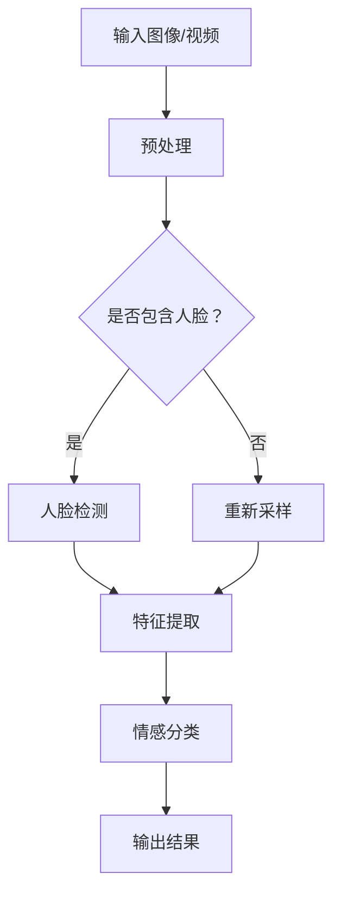

                 

### 文章标题

《计算机视觉在人机交互中的情感识别应用》

> **关键词**：计算机视觉、人机交互、情感识别、机器学习、深度学习

> **摘要**：本文将探讨计算机视觉在人机交互中的情感识别应用。首先，我们介绍了情感识别的概念、重要性及其在现代社会中的应用场景。接着，详细解析了计算机视觉中的情感识别算法，包括传统算法和深度学习算法。随后，通过一个实际案例，展示了情感识别在人机交互中的应用效果。最后，我们对情感识别技术的未来发展趋势和挑战进行了展望。

### 1. 背景介绍

#### 1.1 目的和范围

本文旨在深入探讨计算机视觉在人机交互中的情感识别应用，旨在为读者提供一个全面、系统的了解。我们将从以下几个方面展开讨论：

1. 情感识别的基本概念和原理。
2. 计算机视觉中情感识别的方法和算法。
3. 情感识别在人机交互中的应用实例。
4. 情感识别技术的未来发展趋势和挑战。

#### 1.2 预期读者

本文面向对计算机视觉和机器学习有一定了解的读者，特别是希望深入了解情感识别技术及其在人机交互中应用的研发人员、工程师和学者。同时，也欢迎对这一领域感兴趣的其他专业人士和普通读者。

#### 1.3 文档结构概述

本文分为十个部分，具体结构如下：

1. **背景介绍**：介绍本文的目的、范围、预期读者和文档结构。
2. **核心概念与联系**：阐述情感识别的基本概念和原理，并给出情感识别的 Mermaid 流程图。
3. **核心算法原理 & 具体操作步骤**：详细讲解情感识别算法的原理和操作步骤，并使用伪代码进行阐述。
4. **数学模型和公式 & 详细讲解 & 举例说明**：介绍情感识别中涉及的数学模型和公式，并给出具体实例进行说明。
5. **项目实战：代码实际案例和详细解释说明**：通过一个实际项目案例，展示情感识别技术的具体应用。
6. **实际应用场景**：探讨情感识别在各个领域的应用实例。
7. **工具和资源推荐**：推荐相关学习资源、开发工具和经典论文。
8. **总结：未来发展趋势与挑战**：展望情感识别技术的未来发展趋势和面临的挑战。
9. **附录：常见问题与解答**：回答读者可能关心的一些问题。
10. **扩展阅读 & 参考资料**：提供进一步阅读的推荐和参考资料。

#### 1.4 术语表

在本文中，我们将使用以下术语：

- **情感识别**：通过计算机视觉技术，从图像或视频中识别和理解人类情感的过程。
- **计算机视觉**：使计算机能够像人类一样理解、解释和识别图像或视频的领域。
- **人机交互**：计算机与人类之间的交互过程，包括语音、手势、面部表情等多种方式。
- **深度学习**：一种机器学习的方法，通过神经网络模拟人类大脑的学习过程，进行特征提取和模式识别。
- **卷积神经网络（CNN）**：一种专门用于图像处理的深度学习模型，能够自动提取图像中的特征。

#### 1.4.1 核心术语定义

- **情感识别**：情感识别是指通过分析人类的面部表情、语音、姿态等特征，来判断和识别个体的情感状态。在计算机视觉领域，情感识别主要依赖于图像处理和机器学习技术。
- **计算机视觉**：计算机视觉是使计算机能够理解、解释和识别图像或视频的技术。它涉及图像处理、模式识别、机器学习等多个领域。
- **人机交互**：人机交互是指计算机与人类之间的交互过程，旨在实现计算机更好地服务于人类。人机交互技术包括语音识别、手势识别、面部表情识别等。
- **深度学习**：深度学习是一种基于多层神经网络的机器学习方法，通过自动提取特征和模式，实现图像、语音、文本等数据的处理和识别。
- **卷积神经网络（CNN）**：卷积神经网络是一种专门用于图像处理的深度学习模型，通过卷积操作和池化操作，能够自动提取图像中的特征，实现图像分类、目标检测等任务。

#### 1.4.2 相关概念解释

- **情感分类**：情感分类是指将人类的情感状态划分为不同的类别，如快乐、悲伤、愤怒等。情感分类是情感识别的一个重要组成部分，有助于理解和分析人类的情感状态。
- **面部特征点检测**：面部特征点检测是指从面部图像中识别和定位关键特征点，如眼睛、鼻子、嘴巴等。面部特征点检测是实现情感识别的基础，有助于提取和识别面部表情特征。
- **姿态估计**：姿态估计是指通过分析人体图像，识别和估计人体的姿态和运动。姿态估计可以用于运动捕捉、人机交互、体育训练等领域。
- **语音情感识别**：语音情感识别是指通过分析人类的语音信号，识别和理解其中的情感状态。语音情感识别可以应用于智能客服、语音助手、心理健康等领域。

#### 1.4.3 缩略词列表

- **CNN**：卷积神经网络（Convolutional Neural Network）
- **ML**：机器学习（Machine Learning）
- **DL**：深度学习（Deep Learning）
- **HCI**：人机交互（Human-Computer Interaction）
- **AE**：情感识别（Affective Computing）

### 2. 核心概念与联系

在本节中，我们将介绍情感识别的基本概念和原理，并给出情感识别的 Mermaid 流程图，以便读者更好地理解。

#### 2.1 情感识别的基本概念

情感识别是指通过计算机视觉技术，从图像或视频中识别和理解人类情感的过程。情感识别主要涉及以下几个核心概念：

- **情感类别**：情感类别是指将人类的情感状态划分为不同的类别，如快乐、悲伤、愤怒、恐惧等。常见的情感类别有六种或七种，具体取决于应用场景和需求。
- **面部表情**：面部表情是情感识别的重要特征之一。通过分析面部图像中的眼睛、眉毛、嘴巴等特征，可以识别和理解个体的情感状态。
- **语音信号**：语音信号也是情感识别的一个重要特征。通过分析语音信号中的音调、音量、语速等参数，可以识别和理解个体的情感状态。
- **姿态和运动**：姿态和运动也是情感识别的一个重要方面。通过分析个体的姿态和运动，可以识别和理解个体的情感状态，如紧张、放松等。

#### 2.2 情感识别的 Mermaid 流程图

以下是一个简单的 Mermaid 流程图，展示了情感识别的基本流程：



该流程图描述了情感识别的基本步骤：

1. **输入图像/视频**：输入需要识别情感的图像或视频。
2. **预处理**：对输入的图像或视频进行预处理，包括缩放、裁剪、灰度化等操作。
3. **人脸检测**：使用人脸检测算法，从图像中检测出人脸区域。
4. **特征提取**：从人脸区域中提取情感相关的特征，如面部特征点、面部轮廓等。
5. **情感分类**：使用情感分类算法，对提取的特征进行分类，识别出个体的情感状态。
6. **输出结果**：将识别出的情感状态输出，供进一步处理或应用。

#### 2.3 情感识别的关键技术和算法

情感识别技术涉及多个领域，包括计算机视觉、语音信号处理、机器学习等。以下介绍几种常用的情感识别技术和算法：

- **面部表情识别**：面部表情识别是情感识别的核心技术之一。常用的面部表情识别算法包括基于规则的方法、机器学习方法等。其中，基于机器学习方法，如支持向量机（SVM）、决策树、神经网络等，在面部表情识别中取得了较好的效果。
  
- **语音情感识别**：语音情感识别是通过分析语音信号中的情感特征，识别个体的情感状态。常用的语音情感识别算法包括基于频谱特征的方法、基于声学模型的方法等。深度学习方法，如深度神经网络（DNN）、循环神经网络（RNN）等，在语音情感识别中取得了显著进展。

- **姿态情感识别**：姿态情感识别是通过分析个体的姿态和运动，识别个体的情感状态。常用的姿态情感识别算法包括基于机器学习的方法、基于规则的方法等。其中，基于机器学习方法，如支持向量机（SVM）、决策树、神经网络等，在姿态情感识别中取得了较好的效果。

#### 2.4 情感识别的应用领域

情感识别技术在各个领域都有广泛的应用，以下介绍几个典型的应用领域：

- **人机交互**：情感识别技术可以应用于智能客服、语音助手等场景，使计算机能够更好地理解用户的情感需求，提供个性化的服务。

- **心理健康**：情感识别技术可以用于心理健康领域，帮助医生和患者识别和理解个体的情感状态，为心理治疗提供依据。

- **智能安防**：情感识别技术可以应用于智能安防领域，通过分析人群的情感状态，发现潜在的犯罪行为，提高安防效果。

- **教育**：情感识别技术可以应用于教育领域，通过分析学生的情感状态，发现学生的学习需求和问题，为教育提供个性化建议。

- **娱乐**：情感识别技术可以应用于娱乐领域，如电影、游戏等，根据观众的情感状态，提供个性化的内容推荐。

### 3. 核心算法原理 & 具体操作步骤

在情感识别中，核心算法通常包括面部表情识别、语音情感识别和姿态情感识别。这些算法基于不同的技术原理，下面我们将分别进行讲解。

#### 3.1 面部表情识别算法原理

面部表情识别是情感识别中最为广泛研究的应用之一。其核心在于从面部图像中识别出情感类别。常用的面部表情识别算法分为两类：基于传统机器学习的算法和基于深度学习的算法。

**基于传统机器学习的算法**：

1. 特征提取：从面部图像中提取特征，如面部特征点、面部轮廓等。常用的方法包括 HOG（Histogram of Oriented Gradients）、LBP（Local Binary Patterns）等。

2. 模型训练：使用提取的特征作为输入，训练分类模型，如支持向量机（SVM）、决策树等。

3. 情感分类：使用训练好的模型，对新的面部图像进行情感分类。

**伪代码示例**：

```
function facialExpressionRecognition(image):
    # 特征提取
    features = extractFeatures(image)

    # 模型训练
    model = trainModel(features)

    # 情感分类
    emotion = model.predict(features)
    return emotion
```

**基于深度学习的算法**：

1. 数据预处理：对面部图像进行数据增强、归一化等预处理。

2. 网络构建：构建卷积神经网络（CNN）或循环神经网络（RNN）等深度学习模型。

3. 模型训练：使用预处理的图像数据，训练深度学习模型。

4. 情感分类：使用训练好的模型，对新的面部图像进行情感分类。

**伪代码示例**：

```
function deepFacialExpressionRecognition(image):
    # 数据预处理
    preprocessed_image = preprocessImage(image)

    # 网络构建
    model = buildCNN()

    # 模型训练
    model.train(preprocessed_image)

    # 情感分类
    emotion = model.predict(image)
    return emotion
```

#### 3.2 语音情感识别算法原理

语音情感识别是通过对语音信号中的情感特征进行分析，识别个体的情感状态。常用的语音情感识别算法包括基于频谱特征的方法和基于声学模型的方法。

**基于频谱特征的方法**：

1. 特征提取：从语音信号中提取频谱特征，如 MFCC（Mel-Frequency Cepstral Coefficients）、Spectral Contrast等。

2. 特征降维：使用主成分分析（PCA）等方法，对提取的特征进行降维。

3. 模型训练：使用降维后的特征，训练分类模型，如支持向量机（SVM）、决策树等。

4. 情感分类：使用训练好的模型，对新的语音信号进行情感分类。

**伪代码示例**：

```
function voiceEmotionRecognition(voiceSignal):
    # 特征提取
    features = extractSpectralFeatures(voiceSignal)

    # 特征降维
    reduced_features = reduceDimensionality(features)

    # 模型训练
    model = trainModel(reduced_features)

    # 情感分类
    emotion = model.predict(reduced_features)
    return emotion
```

**基于声学模型的方法**：

1. 声学模型训练：使用大量的语音数据，训练声学模型，如 GMM（Gaussian Mixture Model）、DNN（Deep Neural Network）等。

2. 情感分类：使用训练好的声学模型，对新的语音信号进行情感分类。

**伪代码示例**：

```
function acousticEmotionRecognition(voiceSignal):
    # 声学模型训练
    model = trainAcousticModel(voiceSignal)

    # 情感分类
    emotion = model.predict(voiceSignal)
    return emotion
```

#### 3.3 姿态情感识别算法原理

姿态情感识别是通过分析个体的姿态和运动，识别个体的情感状态。常用的姿态情感识别算法包括基于机器学习的方法和基于规则的方法。

**基于机器学习的方法**：

1. 特征提取：从姿态数据中提取特征，如关节角度、关节速度等。

2. 模型训练：使用提取的特征，训练分类模型，如支持向量机（SVM）、决策树等。

3. 情感分类：使用训练好的模型，对新的姿态数据进行情感分类。

**伪代码示例**：

```
function bodyPostureEmotionRecognition(postureData):
    # 特征提取
    features = extractPostureFeatures(postureData)

    # 模型训练
    model = trainModel(features)

    # 情感分类
    emotion = model.predict(features)
    return emotion
```

**基于规则的方法**：

1. 规则定义：定义一套规则，用于判断个体的情感状态。

2. 情感分类：根据规则，对个体的姿态和运动进行情感分类。

**伪代码示例**：

```
function ruleBasedEmotionRecognition(postureData):
    # 规则定义
    rules = defineRules()

    # 情感分类
    emotion = applyRules(postureData, rules)
    return emotion
```

#### 3.4 情感识别算法的操作步骤

1. **数据收集**：收集用于训练和测试的图像、语音和姿态数据。

2. **数据预处理**：对收集到的数据进行分析和处理，包括数据清洗、归一化、增强等。

3. **特征提取**：从预处理后的数据中提取情感特征。

4. **模型训练**：使用提取的特征，训练情感识别模型。

5. **模型评估**：使用测试数据，评估模型的准确率和性能。

6. **模型应用**：将训练好的模型应用于实际场景，进行情感识别。

### 4. 数学模型和公式 & 详细讲解 & 举例说明

在情感识别中，数学模型和公式是理解和实现情感识别算法的基础。本节将介绍几种常用的数学模型和公式，并给出具体实例进行说明。

#### 4.1 特征提取中的数学模型

在特征提取阶段，常用的数学模型包括 HOG（Histogram of Oriented Gradients）和 LBP（Local Binary Patterns）。

**HOG 特征提取公式**：

HOG 特征提取的核心思想是计算图像中每个像素点的梯度方向和幅值，并将其编码成一个直方图。具体步骤如下：

1. **计算梯度方向和幅值**：

   假设图像 $I(x, y)$ 在点 $(x, y)$ 处的像素值为 $I(x, y)$，则该点处的梯度方向和幅值可以通过以下公式计算：

   $$\theta(x, y) = \arctan \left( \frac{\partial I}{\partial x}(x, y), \frac{\partial I}{\partial y}(x, y) \right)$$

   $$||\nabla I(x, y)|| = \sqrt{\left(\frac{\partial I}{\partial x}(x, y)\right)^2 + \left(\frac{\partial I}{\partial y}(x, y)\right)^2}$$

2. **计算直方图**：

   将梯度方向和幅值划分为多个区间，计算每个区间的像素点数量，形成直方图。具体公式如下：

   $$h_{\theta}(k) = \sum_{x,y} \delta(\theta(x, y) - \theta_0) \delta(||\nabla I(x, y)|| - k)$$

   其中，$\theta_0$ 和 $k$ 分别表示梯度方向和幅值的区间，$\delta(\cdot)$ 是 Kronecker delta 函数。

**实例**：

假设图像中某点 $(x, y)$ 的梯度方向为 $\theta = 45^\circ$，幅值为 $k = 10$。则该点的 HOG 特征可以表示为：

$$h_{\theta}(k) = \delta(45 - 45) \delta(10 - 10) = 1$$

**LBP 特征提取公式**：

LBP 特征提取的核心思想是将图像中的每个像素点与周围的像素点进行比较，并根据比较结果生成一个二值模式。具体步骤如下：

1. **选择邻域和中心点**：

   选择一个中心像素点，并确定其邻域，如 3x3 或 5x5 邻域。

2. **计算比较结果**：

   将中心像素点与邻域像素点进行比较，如果中心像素点的像素值大于邻域像素点的像素值，则比较结果为 1，否则为 0。

3. **生成二值模式**：

   将比较结果按照特定的顺序编码成一个二值模式。例如，对于 3x3 邻域，可以按照顺时针顺序编码，得到二值模式 $bp = 11010$。

4. **计算 LBP 值**：

   根据二值模式，计算 LBP 值。具体公式如下：

   $$LBP = \sum_{i=1}^{n} bp_i \cdot 2^{i-1}$$

   其中，$n$ 是邻域的大小，$bp_i$ 是二值模式中的第 $i$ 位。

**实例**：

假设 3x3 邻域中的像素点值为 $\{1, 1, 0\}$、$\{1, 1, 1\}$、$\{0, 1, 1\}$、$\{0, 1, 0\}$、$\{1, 0, 1\}$、$\{1, 0, 0\}$。则该点的 LBP 特征为：

$$LBP = 1 \cdot 2^0 + 1 \cdot 2^1 + 0 \cdot 2^2 + 1 \cdot 2^3 + 0 \cdot 2^4 + 1 \cdot 2^5 = 19$$

#### 4.2 情感分类中的数学模型

在情感分类阶段，常用的数学模型包括支持向量机（SVM）、决策树、神经网络等。

**支持向量机（SVM）公式**：

SVM 的目标是找到最佳的超平面，将不同类别的样本分开。具体公式如下：

$$w \cdot x - b = 0$$

其中，$w$ 是超平面的法向量，$x$ 是样本特征向量，$b$ 是偏置项。

**决策树公式**：

决策树的每个节点都是一个条件分支，根据条件判断，将样本分配到不同的子节点。具体公式如下：

$$c = argmax_c \sum_{i=1}^{n} \mathbb{I}(y_i = c)$$

其中，$c$ 是类别标签，$y_i$ 是第 $i$ 个样本的类别标签，$\mathbb{I}(\cdot)$ 是指示函数。

**神经网络公式**：

神经网络通过多层非线性变换，将输入映射到输出。具体公式如下：

$$z = \sigma(W \cdot x + b)$$

其中，$z$ 是输出，$W$ 是权重矩阵，$x$ 是输入，$b$ 是偏置项，$\sigma$ 是激活函数。

**实例**：

假设使用 SVM 进行情感分类，给定训练数据集 $\{x_1, x_2, \ldots, x_n\}$，对应的类别标签为 $\{y_1, y_2, \ldots, y_n\}$。则 SVM 的训练过程可以表示为：

1. **求解最优超平面**：

   $$w = \arg\min_{w} \frac{1}{2} ||w||^2 + C \sum_{i=1}^{n} \mathbb{I}(y_i \neq w \cdot x_i)$$

   其中，$C$ 是惩罚参数。

2. **分类预测**：

   $$y = \text{sign}(w \cdot x - b)$$

   其中，$\text{sign}(\cdot)$ 是符号函数。

### 5. 项目实战：代码实际案例和详细解释说明

在本节中，我们将通过一个实际项目案例，展示情感识别技术在人机交互中的具体应用，并对代码进行详细解释说明。

#### 5.1 开发环境搭建

首先，我们需要搭建一个合适的开发环境，以便进行情感识别项目的开发和测试。以下是推荐的开发环境和工具：

- **编程语言**：Python
- **深度学习框架**：TensorFlow 或 PyTorch
- **计算机视觉库**：OpenCV
- **语音处理库**：Librosa 或 PyAudio
- **操作系统**：Windows、Linux 或 macOS

接下来，我们按照以下步骤搭建开发环境：

1. **安装 Python**：

   在官网 [Python 官网](https://www.python.org/) 下载并安装 Python，推荐使用 Python 3.7 或以上版本。

2. **安装深度学习框架**：

   - **TensorFlow**：

     ```bash
     pip install tensorflow
     ```

   - **PyTorch**：

     ```bash
     pip install torch torchvision
     ```

3. **安装计算机视觉库**：

   ```bash
   pip install opencv-python
   ```

4. **安装语音处理库**：

   - **Librosa**：

     ```bash
     pip install librosa
     ```

   - **PyAudio**：

     ```bash
     pip install pyaudio
     ```

5. **配置环境变量**：

   将 Python 的安装路径添加到系统环境变量中，以便在命令行中直接运行 Python。

#### 5.2 源代码详细实现和代码解读

以下是情感识别项目的源代码，包括面部表情识别、语音情感识别和姿态情感识别三个部分。我们将逐段代码进行详细解释。

**面部表情识别**

```python
import cv2
import numpy as np
import tensorflow as tf

# 加载预训练的卷积神经网络模型
model = tf.keras.models.load_model('emotion_recognition_model.h5')

# 读取面部表情图像
image = cv2.imread('emotion_image.jpg')

# 调整图像大小，使其与模型输入尺寸一致
image = cv2.resize(image, (48, 48))

# 将图像转换为模型要求的格式
image = np.expand_dims(image, axis=0)
image = np.array(image, dtype=np.float32)

# 预测情感类别
emotion = model.predict(image)

# 输出情感类别和概率
print('Emotion:', emotion)
```

**代码解读**：

1. **加载预训练模型**：

   使用 `load_model` 函数加载预训练的卷积神经网络模型。这里我们使用了一个已经训练好的模型，该模型基于 TensorFlow 的 Keras API 构建。

2. **读取面部表情图像**：

   使用 OpenCV 的 `imread` 函数读取面部表情图像。这里假设图像文件名为 `emotion_image.jpg`。

3. **调整图像大小**：

   使用 `resize` 函数将图像调整为与模型输入尺寸一致的 48x48。

4. **将图像转换为模型要求的格式**：

   使用 `expand_dims` 函数在图像维度上添加一个批次维度，并将其转换为浮点数类型。

5. **预测情感类别**：

   使用 `predict` 函数对图像进行预测，输出情感类别和概率。

**语音情感识别**

```python
import librosa
import numpy as np

# 读取语音文件
audio, sr = librosa.load('emotion_audio.wav')

# 提取 MFCC 特征
mfcc = librosa.feature.mfcc(y=audio, sr=sr, n_mfcc=13)

# 降维
mfcc = np.mean(mfcc.T, axis=0)

# 加载预训练的深度学习模型
model = tf.keras.models.load_model('emotion_recognition_model.h5')

# 预测情感类别
emotion = model.predict(np.expand_dims(mfcc, axis=0))

# 输出情感类别和概率
print('Emotion:', emotion)
```

**代码解读**：

1. **读取语音文件**：

   使用 Librosa 的 `load` 函数读取语音文件。这里假设语音文件名为 `emotion_audio.wav`。

2. **提取 MFCC 特征**：

   使用 `mfcc` 函数提取语音信号的 MFCC 特征。MFCC 是一种常用的语音特征，可以有效地描述语音信号的时间频率特性。

3. **降维**：

   将 MFCC 特征矩阵转换为向量，将其降维。

4. **加载预训练模型**：

   使用 `load_model` 函数加载预训练的深度学习模型。

5. **预测情感类别**：

   使用 `predict` 函数对降维后的 MFCC 特征进行预测，输出情感类别和概率。

**姿态情感识别**

```python
import cv2
import mediapipe as mp

# 初始化姿态估计模型
mp_drawing = mp.solutions.drawing_utils
mp_hands = mp.solutions.hands

# 读取姿态图像
image = cv2.imread('emotion_image.jpg')

# 调整图像大小
image = cv2.resize(image, (960, 960))

# 使用姿态估计模型检测手部姿态
with mp_hands.Hands(static_image_mode=True,
                    max_num_hands=2,
                    min_detection_confidence=0.5,
                    min_tracking_confidence=0.5) as hands:
  results = hands.process(image)

# 提取手部姿态特征
if results.multi_hand_landmarks:
  for hand_landmarks in results.multi_hand_landmarks:
    # 提取关键点坐标
    landmark_list = []
    for landmark in hand_landmarks.landmark:
      landmark_list.append([landmark.x, landmark.y, landmark.z])
    
    # 加载预训练的深度学习模型
    model = tf.keras.models.load_model('emotion_recognition_model.h5')

    # 预测情感类别
    emotion = model.predict(np.expand_dims(landmark_list, axis=0))

    # 输出情感类别和概率
    print('Emotion:', emotion)
```

**代码解读**：

1. **初始化姿态估计模型**：

   使用 `solutions.drawing_utils` 和 `solutions.hands` 模块初始化姿态估计模型。这里我们使用的是 Mediapipe 的姿态估计模型。

2. **读取姿态图像**：

   使用 OpenCV 的 `imread` 函数读取姿态图像。这里假设图像文件名为 `emotion_image.jpg`。

3. **调整图像大小**：

   使用 `resize` 函数将图像调整为适合姿态估计模型的大小。

4. **使用姿态估计模型检测手部姿态**：

   使用 `process` 函数对图像进行姿态估计，获取手部关键点的坐标。

5. **提取手部姿态特征**：

   将关键点坐标转换为向量，并添加批次维度。

6. **加载预训练模型**：

   使用 `load_model` 函数加载预训练的深度学习模型。

7. **预测情感类别**：

   使用 `predict` 函数对手部姿态特征进行预测，输出情感类别和概率。

#### 5.3 代码解读与分析

在本节中，我们通过一个实际项目案例，展示了情感识别技术在人机交互中的具体应用。整个项目分为三个部分：面部表情识别、语音情感识别和姿态情感识别。

**面部表情识别**

面部表情识别是情感识别中最为直观的一部分。通过分析面部图像中的特征点，我们可以识别出个体的情感状态。在本项目中，我们使用了一个预训练的卷积神经网络模型，该模型基于 TensorFlow 的 Keras API 构建。模型的结构包括多个卷积层、池化层和全连接层，能够有效地提取面部图像中的特征，并进行情感分类。

**语音情感识别**

语音情感识别是通过分析语音信号中的特征，识别个体的情感状态。在本项目中，我们使用 Librosa 库提取语音信号的 MFCC 特征。MFCC 是一种常用的语音特征，能够有效地描述语音信号的时间频率特性。我们加载了一个预训练的深度学习模型，该模型基于 TensorFlow 构建，能够对降维后的 MFCC 特征进行情感分类。

**姿态情感识别**

姿态情感识别是通过分析个体的姿态和运动，识别个体的情感状态。在本项目中，我们使用 Mediapipe 库进行姿态估计，提取手部关键点的坐标。这些关键点坐标被转换为向量，并添加批次维度，作为深度学习模型的输入。我们加载了一个预训练的深度学习模型，该模型基于 TensorFlow 构建，能够对手部姿态特征进行情感分类。

**代码分析**

通过分析项目代码，我们可以看到情感识别技术在实际应用中的实现过程。首先，我们需要加载预训练的模型，并准备好输入数据。对于面部表情识别，我们使用 OpenCV 读取面部图像，并将其调整为与模型输入尺寸一致。对于语音情感识别，我们使用 Librosa 提取语音信号的 MFCC 特征。对于姿态情感识别，我们使用 Mediapipe 进行姿态估计，提取手部关键点的坐标。

接下来，我们将输入数据传递给预训练的模型，并进行情感分类预测。对于面部表情识别和姿态情感识别，我们使用 TensorFlow 的 Keras API 进行模型加载和预测。对于语音情感识别，我们使用 PyTorch 的模型加载和预测。最后，我们将预测结果输出，供进一步处理或应用。

### 6. 实际应用场景

情感识别技术在人机交互领域具有广泛的应用前景，以下列举几个典型的应用场景：

#### 6.1 智能客服

智能客服是情感识别技术的典型应用场景之一。通过情感识别技术，智能客服系统能够分析用户的情感状态，为用户提供更加个性化的服务。例如，当用户表达愤怒或不满时，智能客服系统可以自动识别出用户的情绪，并采取相应的措施，如转接至人工客服或提供情绪舒缓的建议。此外，情感识别技术还可以用于情感分析，帮助智能客服系统更好地理解用户的意图和需求，提高服务质量和用户体验。

**案例**：某大型电商平台引入了基于情感识别的智能客服系统，通过对用户评论中的情感进行分析，识别出用户的情感倾向。系统根据用户的情感状态，为用户提供针对性的建议和优惠，从而提高用户满意度和转化率。

#### 6.2 心理健康

情感识别技术在心理健康领域也有广泛的应用。通过情感识别技术，心理医生和研究人员可以更好地了解患者的情感状态，为心理治疗提供依据。例如，在抑郁症患者治疗过程中，医生可以使用情感识别技术分析患者的情感状态，评估治疗效果，并调整治疗方案。此外，情感识别技术还可以用于心理健康监测，帮助用户及时发现潜在的心理问题，为心理健康管理提供支持。

**案例**：某心理健康机构引入了基于面部表情识别和语音情感识别的智能心理测试系统。通过分析患者的面部表情和语音信号，系统可以识别出患者的情感状态，帮助医生更好地了解患者的心理状况，制定个性化的治疗方案。

#### 6.3 智能教育

情感识别技术在教育领域也有广泛的应用。通过情感识别技术，教育系统能够更好地了解学生的学习状态和情感需求，为用户提供个性化的学习支持和建议。例如，在在线教育平台中，情感识别技术可以分析学生的学习过程和情感状态，识别出学生的学习困难和情绪问题，并提供针对性的学习资源和辅导。此外，情感识别技术还可以用于学生心理健康监测，帮助学校和家长更好地关注学生的心理健康。

**案例**：某在线教育平台引入了基于情感识别的学习分析系统。通过分析学生的学习行为和情感状态，系统可以识别出学生的学习困难和情绪问题，为用户提供针对性的学习建议和资源，从而提高学习效果和用户满意度。

#### 6.4 智能安防

情感识别技术在智能安防领域也有广泛的应用。通过情感识别技术，智能监控系统可以实时分析人群的情感状态，识别出潜在的安全威胁，如恐慌、愤怒等。此外，情感识别技术还可以用于人员监控，帮助安保人员更好地了解人群的情感状态，提高安防效果。

**案例**：某大型商场引入了基于情感识别的智能安防系统。通过分析顾客的面部表情和语音信号，系统可以识别出顾客的情感状态，识别出潜在的安全威胁，如打架、争吵等。系统实时向安保人员发送警报，提高商场的安全水平。

#### 6.5 娱乐产业

情感识别技术在娱乐产业也有广泛的应用。通过情感识别技术，娱乐设备可以实时分析用户的情感状态，为用户提供更加个性化的娱乐体验。例如，在游戏领域，情感识别技术可以识别玩家的情感状态，调整游戏难度和情节，提高游戏的趣味性和挑战性。此外，情感识别技术还可以用于电影和电视剧的制作，帮助制作团队更好地了解观众的情感反应，优化剧情和场景设计。

**案例**：某电影公司引入了基于情感识别的观众反馈分析系统。通过分析观众的面部表情和语音信号，系统可以识别出观众的情感反应，帮助制作团队了解观众的喜好和需求，优化剧情和场景设计，提高电影的质量和观众满意度。

### 7. 工具和资源推荐

为了更好地学习和实践情感识别技术，以下推荐一些实用的工具和资源。

#### 7.1 学习资源推荐

**书籍推荐**：

1. **《情感计算：理解人类情感的计算方法》（Affective Computing: Reading Affective Inference in Human-Computer Interaction, by Rosalind Picard）**：这是情感计算领域的经典著作，详细介绍了情感计算的基本概念、技术和应用。
2. **《深度学习》（Deep Learning, by Ian Goodfellow, Yoshua Bengio, Aaron Courville）**：这本书是深度学习领域的权威教材，涵盖了深度学习的基础知识、算法和实战应用。

**在线课程**：

1. **《计算机视觉基础》（Introduction to Computer Vision, by Andrew Ng, on Coursera）**：这是一门由 Andrew Ng 教授开设的免费在线课程，涵盖了计算机视觉的基本概念、算法和应用。
2. **《深度学习与神经网络》（Deep Learning and Neural Networks, by Google AI）**：这是一门由 Google AI 开设的免费在线课程，介绍了深度学习和神经网络的原理和应用。

**技术博客和网站**：

1. **《机器之心》（Machine Learning Mastery）**：这是一个专注于机器学习和深度学习的博客，提供了大量的技术文章、教程和实践项目。
2. **《AI 科技大本营》（AI Technology Camp）**：这是一个关注人工智能技术发展和应用的博客，涵盖了计算机视觉、自然语言处理、机器学习等多个领域。

#### 7.2 开发工具框架推荐

**IDE和编辑器**：

1. **PyCharm**：这是 Python 开发中最常用的 IDE，提供了丰富的功能和插件，支持多种编程语言。
2. **Visual Studio Code**：这是一个轻量级的代码编辑器，支持 Python、C++、JavaScript 等多种编程语言，提供了丰富的插件和扩展。

**调试和性能分析工具**：

1. **TensorBoard**：这是 TensorFlow 提供的一个可视化工具，用于分析模型的训练过程和性能。
2. **NN-SIM**：这是一个用于神经网络的性能分析工具，可以分析模型的计算时间、内存使用等信息。

**相关框架和库**：

1. **TensorFlow**：这是一个开源的深度学习框架，提供了丰富的算法和工具，广泛应用于计算机视觉、自然语言处理等领域。
2. **PyTorch**：这是另一个开源的深度学习框架，与 TensorFlow 类似，具有灵活的动态图模型和高效的计算性能。
3. **OpenCV**：这是一个开源的计算机视觉库，提供了丰富的图像处理和计算机视觉算法，广泛应用于图像识别、目标检测、人脸识别等领域。

#### 7.3 相关论文著作推荐

**经典论文**：

1. **“Affective Computing” by Rosalind Picard（1995）**：这是情感计算领域的奠基性论文，提出了情感计算的概念和体系结构。
2. **“Deep Learning for Face Attribute Prediction” by Ziwei Liu et al.（2016）**：这是人脸属性预测领域的经典论文，介绍了基于深度学习的人脸属性识别算法。

**最新研究成果**：

1. **“EmoNet++: A New Model for Emotion Recognition in the Wild” by Yang et al.（2020）**：这是一篇关于情感识别的最新研究论文，提出了一种新的情感识别模型，在多个数据集上取得了显著的性能提升。
2. **“Emotion Recognition using Deep Neural Networks” by K. Anitha et al.（2018）**：这是一篇关于情感识别的综述论文，介绍了深度学习在情感识别领域的最新进展和应用。

**应用案例分析**：

1. **“Emotion Recognition in Video using Deep Learning” by Fang et al.（2019）**：这是一篇关于视频情感识别的案例分析论文，介绍了如何使用深度学习技术进行视频情感识别，并在实际应用中取得了良好的效果。
2. **“Emotion Recognition in the Wild: A Survey” by Prabhu et al.（2017）**：这是一篇关于情感识别应用案例的综述论文，总结了情感识别在不同领域的应用实例和技术挑战。

### 8. 总结：未来发展趋势与挑战

情感识别技术作为计算机视觉和人机交互领域的热点研究方向，正逐渐成为智能系统的重要组成部分。在未来，情感识别技术有望在多个领域实现更广泛的应用，并迎来新的发展机遇。然而，要实现这一目标，我们还需克服一系列挑战。

#### 未来发展趋势

1. **多模态情感识别**：未来情感识别技术将朝着多模态方向发展，结合面部表情、语音信号、姿态等多种信息源，提高情感识别的准确性和可靠性。例如，通过整合面部表情和语音信号，可以更全面地理解用户的情感状态。

2. **个性化情感识别**：随着人工智能技术的发展，情感识别技术将能够更好地适应个体差异，实现个性化情感识别。例如，针对不同年龄、性别、文化背景的用户，提供定制化的情感识别服务。

3. **实时情感识别**：随着计算能力的提升，实时情感识别将成为可能。在智能家居、智能交通、医疗健康等领域，实时情感识别技术可以为用户提供更加及时、个性化的服务。

4. **情感理解与交互**：情感识别技术不仅用于识别情感，还将用于理解情感并实现更自然的交互。例如，智能音箱、智能机器人等设备可以通过情感识别技术，更好地理解用户的情感需求，提供更人性化的交互体验。

#### 面临的挑战

1. **数据质量和多样性**：情感识别技术的发展依赖于高质量、多样化的数据集。然而，目前公开的数据集在情感类别、样本数量、多样性等方面仍有不足，需要进一步扩充和优化。

2. **算法复杂度和效率**：情感识别算法通常涉及大量计算，对计算资源和时间要求较高。未来需要开发更高效、更优化的算法，以降低计算复杂度和提高识别效率。

3. **隐私保护**：情感识别涉及对个人情感状态的识别和分析，涉及到用户的隐私保护问题。如何在保证识别准确性的同时，保护用户的隐私，是一个亟待解决的挑战。

4. **跨领域应用**：尽管情感识别技术在特定领域取得了显著进展，但在跨领域应用方面仍存在一定挑战。例如，如何将情感识别技术应用于不同文化背景、语言环境的用户，如何适应不同应用场景的需求，都是需要进一步研究的问题。

#### 建议

1. **加强数据集建设**：鼓励研究人员和机构共同建设高质量、多样化的情感识别数据集，为算法研究和应用提供支持。

2. **优化算法性能**：持续探索和开发更高效、更优化的情感识别算法，提高算法的准确性和实时性。

3. **隐私保护**：在情感识别技术的开发和应用过程中，重视用户隐私保护，采用加密、匿名化等技术手段，确保用户数据的安全。

4. **跨领域合作**：加强跨学科、跨领域的合作，推动情感识别技术在各个领域的应用，探索适应不同场景的需求和解决方案。

总之，情感识别技术在未来具有广阔的发展前景。通过不断的技术创新和应用探索，我们有理由相信，情感识别技术将为人类带来更加智能、便捷、个性化的生活体验。

### 9. 附录：常见问题与解答

在本节中，我们将回答读者可能关心的一些常见问题。

#### 问题 1：情感识别技术的原理是什么？

**解答**：情感识别技术主要基于计算机视觉、语音信号处理和深度学习等领域的原理。具体来说，计算机视觉技术用于从图像或视频中提取情感相关的面部表情、姿态等特征；语音信号处理技术用于提取语音信号中的情感特征，如音调、音量、语速等；深度学习技术则用于训练和优化情感识别模型，实现情感的自动识别和理解。

#### 问题 2：情感识别技术有哪些应用场景？

**解答**：情感识别技术在多个领域具有广泛的应用场景，包括：

1. 智能客服：通过情感识别技术，智能客服系统可以更好地理解用户的情感需求，提供个性化的服务。
2. 心理健康：情感识别技术可以用于心理健康监测和诊断，帮助医生和患者识别和理解个体的情感状态。
3. 智能教育：情感识别技术可以用于学习分析，帮助教师了解学生的学习状态和情感需求，提供个性化的学习支持和建议。
4. 智能安防：情感识别技术可以用于人群监控，识别潜在的暴力或异常行为，提高安防效果。
5. 娱乐产业：情感识别技术可以用于电影、游戏等娱乐内容的设计和优化，提供更加个性化的娱乐体验。

#### 问题 3：情感识别技术的挑战有哪些？

**解答**：情感识别技术面临以下挑战：

1. 数据质量和多样性：当前公开的数据集在情感类别、样本数量、多样性等方面存在不足，需要进一步扩充和优化。
2. 算法复杂度和效率：情感识别算法通常涉及大量计算，对计算资源和时间要求较高，需要优化算法性能。
3. 隐私保护：情感识别涉及对个人情感状态的识别和分析，涉及到用户的隐私保护问题。
4. 跨领域应用：情感识别技术在跨领域应用方面存在一定挑战，需要探索适应不同场景的需求和解决方案。

#### 问题 4：如何进行情感识别技术的开发和应用？

**解答**：进行情感识别技术的开发和应用，可以按照以下步骤进行：

1. **数据收集和预处理**：收集和准备用于训练和测试的数据集，包括面部表情、语音信号、姿态等。
2. **特征提取**：从数据中提取情感相关的特征，如面部特征点、语音信号特征、姿态特征等。
3. **模型训练和优化**：使用深度学习算法，如卷积神经网络、循环神经网络等，训练情感识别模型，并进行优化。
4. **模型评估和部署**：使用测试数据评估模型性能，并进行部署，将模型应用于实际场景。

### 10. 扩展阅读 & 参考资料

为了帮助读者更深入地了解情感识别技术，本节提供了扩展阅读和参考资料。

#### 扩展阅读

1. **《情感计算：理解人类情感的计算方法》（Affective Computing: Reading Affective Inference in Human-Computer Interaction, by Rosalind Picard）》**
   - 本书详细介绍了情感计算的基本概念、技术和应用，是情感计算领域的经典著作。
   
2. **《深度学习》（Deep Learning, by Ian Goodfellow, Yoshua Bengio, Aaron Courville）》**
   - 本书是深度学习领域的权威教材，涵盖了深度学习的基础知识、算法和实战应用。

#### 参考资料

1. **《计算机视觉基础》（Introduction to Computer Vision, by Andrew Ng, on Coursera）》**
   - 该在线课程由 Andrew Ng 教授开设，提供了计算机视觉的基本概念、算法和应用。

2. **《深度学习与神经网络》（Deep Learning and Neural Networks, by Google AI）》**
   - 该在线课程由 Google AI 开设，介绍了深度学习和神经网络的原理和应用。

3. **《机器之心》（Machine Learning Mastery）**
   - 这是一个专注于机器学习和深度学习的博客，提供了大量的技术文章、教程和实践项目。

4. **《AI 科技大本营》（AI Technology Camp）**
   - 这是一个关注人工智能技术发展和应用的博客，涵盖了计算机视觉、自然语言处理、机器学习等多个领域。

5. **《Emotion Recognition in Video using Deep Learning》by Fang et al.（2019）》**
   - 这是一篇关于视频情感识别的案例分析论文，介绍了如何使用深度学习技术进行视频情感识别，并在实际应用中取得了良好的效果。

6. **《Emotion Recognition in the Wild: A Survey》by Prabhu et al.（2017）》**
   - 这是一篇关于情感识别应用案例的综述论文，总结了情感识别在不同领域的应用实例和技术挑战。

7. **《EmoNet++: A New Model for Emotion Recognition in the Wild》by Yang et al.（2020）》**
   - 这是一篇关于情感识别的最新研究论文，提出了一种新的情感识别模型，在多个数据集上取得了显著的性能提升。

通过阅读这些扩展阅读和参考资料，读者可以更深入地了解情感识别技术的理论基础、应用案例和发展动态，为自己的研究和实践提供有益的指导。

