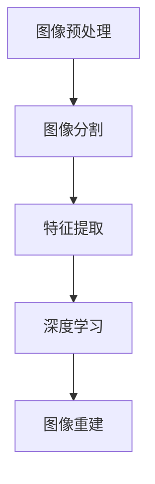

                 

# 计算机视觉在医学影像辅助诊断中的准确性提升

> 关键词：计算机视觉、医学影像、辅助诊断、准确性提升、深度学习、神经网络、图像处理、特征提取、算法优化

> 摘要：本文将深入探讨计算机视觉在医学影像辅助诊断中的重要性，以及如何通过算法优化和深度学习等技术提升其准确性。文章首先介绍了医学影像辅助诊断的背景和现状，随后详细阐述了计算机视觉的基本原理和关键技术，包括图像处理、特征提取和深度学习算法。接下来，本文通过具体案例展示了如何在实际项目中应用这些技术，并探讨了医学影像辅助诊断的潜在应用场景。最后，本文总结了未来发展趋势和面临的挑战，为读者提供了相关学习资源和工具推荐。

## 1. 背景介绍

### 1.1 目的和范围

医学影像辅助诊断是现代医学领域中的一项重要技术，它能够帮助医生快速、准确地识别疾病，从而提高治疗的成功率和患者的生存率。随着计算机视觉技术的飞速发展，医学影像辅助诊断的准确性和效率得到了显著提升。本文旨在探讨如何通过计算机视觉技术提升医学影像辅助诊断的准确性，并分析其在实际应用中的优势和挑战。

### 1.2 预期读者

本文主要面向计算机视觉和医学领域的研究人员、工程师以及对此感兴趣的学者和爱好者。通过本文的阅读，读者可以了解计算机视觉在医学影像辅助诊断中的应用原理和技术，以及如何在实际项目中应用这些技术。

### 1.3 文档结构概述

本文结构分为以下几个部分：

1. 背景介绍：介绍医学影像辅助诊断的背景和目的。
2. 核心概念与联系：阐述计算机视觉的基本原理和关键技术。
3. 核心算法原理 & 具体操作步骤：详细讲解图像处理、特征提取和深度学习算法。
4. 数学模型和公式 & 详细讲解 & 举例说明：介绍医学影像辅助诊断中的数学模型和公式。
5. 项目实战：通过具体案例展示如何应用计算机视觉技术。
6. 实际应用场景：探讨医学影像辅助诊断的潜在应用场景。
7. 工具和资源推荐：提供相关学习资源和工具推荐。
8. 总结：总结未来发展趋势和挑战。
9. 附录：常见问题与解答。
10. 扩展阅读 & 参考资料：提供扩展阅读和参考资料。

### 1.4 术语表

#### 1.4.1 核心术语定义

- 医学影像：医学影像是指通过X射线、CT、MRI等技术对人体或病变部位进行成像的一种手段。
- 辅助诊断：辅助诊断是指利用计算机视觉技术对医学影像进行分析和处理，辅助医生进行诊断的过程。
- 计算机视觉：计算机视觉是指使计算机具备对图像或视频进行处理、分析和理解的能力。
- 深度学习：深度学习是一种基于人工神经网络的学习方法，通过多层的神经网络对数据进行特征提取和分类。

#### 1.4.2 相关概念解释

- 图像处理：图像处理是指利用计算机对图像进行加工、变换和处理的技术。
- 特征提取：特征提取是指从图像中提取出对目标识别和分类有帮助的特征。
- 神经网络：神经网络是一种由大量神经元组成的模拟生物神经系统的计算模型。

#### 1.4.3 缩略词列表

- CT：计算机断层扫描（Computed Tomography）
- MRI：磁共振成像（Magnetic Resonance Imaging）
- X射线：X射线成像（X-ray Imaging）
- GPU：图形处理器（Graphics Processing Unit）
- CNN：卷积神经网络（Convolutional Neural Network）

## 2. 核心概念与联系

### 2.1 核心概念

计算机视觉在医学影像辅助诊断中扮演着重要角色，其核心概念包括图像处理、特征提取和深度学习。

#### 图像处理

图像处理是指利用计算机对医学影像进行加工、变换和处理的技术。图像处理包括以下几个步骤：

1. **图像预处理**：包括去噪、增强、灰度转换等。
2. **图像分割**：将医学影像分割成不同的区域或目标。
3. **特征提取**：从分割后的图像中提取有助于诊断的特征。
4. **图像融合**：将多模态医学影像进行融合，以获得更丰富的信息。

#### 特征提取

特征提取是指从医学影像中提取出对目标识别和分类有帮助的特征。特征提取方法包括：

1. **传统特征提取**：如灰度直方图、边缘检测、角点检测等。
2. **深度特征提取**：通过深度学习算法自动提取特征，如卷积神经网络（CNN）。

#### 深度学习

深度学习是一种基于人工神经网络的学习方法，通过多层的神经网络对数据进行特征提取和分类。深度学习在医学影像辅助诊断中具有广泛的应用，如：

1. **图像分类**：对医学影像进行分类，如癌症类型分类。
2. **目标检测**：检测医学影像中的特定目标，如病变区域检测。
3. **图像重建**：通过深度学习算法重建医学影像，如CT重建、MRI重建。

### 2.2 核心概念联系

核心概念之间的联系如下：

1. **图像处理**：图像处理为特征提取提供了基础，如去噪和增强等操作有助于提高特征提取的准确性。
2. **特征提取**：特征提取为深度学习提供了输入数据，通过提取有助于诊断的特征，可以更好地训练深度学习模型。
3. **深度学习**：深度学习通过多层的神经网络对特征进行提取和分类，可以实现对医学影像的自动诊断。

为了更好地理解这些核心概念之间的联系，我们使用Mermaid流程图来展示：



## 3. 核心算法原理 & 具体操作步骤

### 3.1 图像处理算法原理

图像处理是医学影像辅助诊断的基础，主要包括图像预处理、图像分割和图像融合等步骤。

#### 图像预处理

图像预处理是指对原始医学影像进行去噪、增强和灰度转换等操作，以提高图像质量。

伪代码如下：

```python
function preprocess(image):
    image = denoise(image)
    image = enhance(image)
    image = convert_to_grayscale(image)
    return image
```

#### 图像分割

图像分割是指将医学影像分割成不同的区域或目标，以便进行特征提取和深度学习。

伪代码如下：

```python
function segment(image):
    segmented_image = thresholding(image)
    segmented_image = morphological_operations(segmented_image)
    segmented_image = watershed_segmentation(segmented_image)
    return segmented_image
```

#### 图像融合

图像融合是指将多模态医学影像进行融合，以获得更丰富的信息。

伪代码如下：

```python
function fuse_images(image1, image2):
    fused_image = intensity_weighted_fusion(image1, image2)
    fused_image = spatial_frequency_fusion(image1, image2)
    return fused_image
```

### 3.2 特征提取算法原理

特征提取是从分割后的医学影像中提取出对目标识别和分类有帮助的特征。特征提取方法包括传统特征提取和深度特征提取。

#### 传统特征提取

传统特征提取方法主要包括灰度直方图、边缘检测和角点检测等。

伪代码如下：

```python
function extract_hog_features(image):
    hog_features = compute_hog_features(image)
    return hog_features

function extract_sobel_edges(image):
    sobel_edges = compute_sobel_edges(image)
    return sobel_edges

function extract_harris_corners(image):
    harris_corners = compute_harris_corners(image)
    return harris_corners
```

#### 深度特征提取

深度特征提取是指通过深度学习算法自动提取特征，如卷积神经网络（CNN）。

伪代码如下：

```python
function extract_cnn_features(image):
    cnn_model = load_pretrained_model()
    features = cnn_model.extract_features(image)
    return features
```

### 3.3 深度学习算法原理

深度学习是一种基于人工神经网络的学习方法，通过多层的神经网络对数据进行特征提取和分类。深度学习在医学影像辅助诊断中具有广泛的应用，如图像分类、目标检测和图像重建等。

#### 图像分类

图像分类是指对医学影像进行分类，如癌症类型分类。

伪代码如下：

```python
function classify_image(image, labels):
    cnn_model = load_pretrained_model()
    predictions = cnn_model.predict(image)
    predicted_labels = predict_labels(predictions, labels)
    return predicted_labels
```

#### 目标检测

目标检测是指检测医学影像中的特定目标，如病变区域检测。

伪代码如下：

```python
function detect_objects(image):
    yolo_model = load_pretrained_model()
    objects = yolo_model.detect_objects(image)
    return objects
```

#### 图像重建

图像重建是指通过深度学习算法重建医学影像，如CT重建、MRI重建。

伪代码如下：

```python
function reconstruct_image(image):
    gan_model = load_pretrained_model()
    reconstructed_image = gan_model.reconstruct(image)
    return reconstructed_image
```

## 4. 数学模型和公式 & 详细讲解 & 举例说明

### 4.1 图像处理中的数学模型

图像处理中的数学模型主要涉及图像预处理、图像分割和图像融合等步骤。

#### 图像预处理

图像预处理中的数学模型主要包括去噪、增强和灰度转换等。

1. **去噪**：常用的去噪方法有均值滤波、中值滤波和高斯滤波等。

   均值滤波的数学模型为：

   $$ \text{output}(i, j) = \frac{1}{n} \sum_{x=0}^{n-1} \sum_{y=0}^{n-1} \text{input}(x, y) $$

   其中，\( \text{output}(i, j) \) 为滤波后的像素值，\( n \) 为滤波窗口的大小，\( \text{input}(x, y) \) 为原始图像的像素值。

2. **增强**：常用的增强方法有直方图均衡化、对比度拉伸和图像锐化等。

   直方图均衡化的数学模型为：

   $$ \text{output}(i, j) = \text{lookup_table}(\text{input}(i, j)) $$

   其中，\( \text{lookup_table}(\text{input}(i, j)) \) 为直方图均衡化后的像素值，\( \text{input}(i, j) \) 为原始图像的像素值。

3. **灰度转换**：常用的灰度转换方法有二值化、直方图规定化和反向灰度转换等。

   反向灰度转换的数学模型为：

   $$ \text{output}(i, j) = 255 - \text{input}(i, j) $$

   其中，\( \text{output}(i, j) \) 为反向灰度转换后的像素值，\( \text{input}(i, j) \) 为原始图像的像素值。

#### 图像分割

图像分割中的数学模型主要包括阈值分割、形态学分割和区域增长分割等。

1. **阈值分割**：常用的阈值分割方法有全局阈值分割和局部阈值分割等。

   全局阈值分割的数学模型为：

   $$ \text{output}(i, j) = \begin{cases} 
      255 & \text{if } \text{input}(i, j) > \text{threshold} \\
      0 & \text{otherwise}
   \end{cases} $$

   其中，\( \text{output}(i, j) \) 为分割后的像素值，\( \text{input}(i, j) \) 为原始图像的像素值，\( \text{threshold} \) 为阈值。

2. **形态学分割**：常用的形态学分割方法有腐蚀、膨胀、开运算和闭运算等。

   腐蚀的数学模型为：

   $$ \text{output}(i, j) = \min_{x', y'} \text{input}(x', y') - \text{structure}(x - x', y - y') $$

   其中，\( \text{output}(i, j) \) 为腐蚀后的像素值，\( \text{input}(i, j) \) 为原始图像的像素值，\( \text{structure}(x, y) \) 为结构元素。

3. **区域增长分割**：区域增长分割的数学模型为：

   $$ \text{output}(i, j) = \begin{cases} 
      \text{input}(i, j) & \text{if } (i, j) \in \text{seed_points} \\
      0 & \text{otherwise}
   \end{cases} $$

   其中，\( \text{output}(i, j) \) 为分割后的像素值，\( \text{input}(i, j) \) 为原始图像的像素值，\( \text{seed_points} \) 为种子点集。

#### 图像融合

图像融合中的数学模型主要包括加权融合、最大值融合和平均融合等。

1. **加权融合**：加权融合的数学模型为：

   $$ \text{output}(i, j) = w_1 \text{image1}(i, j) + w_2 \text{image2}(i, j) $$

   其中，\( \text{output}(i, j) \) 为融合后的像素值，\( \text{image1}(i, j) \) 和 \( \text{image2}(i, j) \) 为原始图像的像素值，\( w_1 \) 和 \( w_2 \) 为权重。

2. **最大值融合**：最大值融合的数学模型为：

   $$ \text{output}(i, j) = \max(\text{image1}(i, j), \text{image2}(i, j)) $$

   其中，\( \text{output}(i, j) \) 为融合后的像素值，\( \text{image1}(i, j) \) 和 \( \text{image2}(i, j) \) 为原始图像的像素值。

3. **平均融合**：平均融合的数学模型为：

   $$ \text{output}(i, j) = \frac{\text{image1}(i, j) + \text{image2}(i, j)}{2} $$

   其中，\( \text{output}(i, j) \) 为融合后的像素值，\( \text{image1}(i, j) \) 和 \( \text{image2}(i, j) \) 为原始图像的像素值。

### 4.2 深度学习中的数学模型

深度学习中的数学模型主要包括卷积神经网络（CNN）、循环神经网络（RNN）和生成对抗网络（GAN）等。

#### 卷积神经网络（CNN）

卷积神经网络是一种用于图像处理和计算机视觉的深度学习模型，其核心思想是通过卷积层提取图像的特征。

1. **卷积层**：卷积层的数学模型为：

   $$ \text{output}_{ij}^l = \sum_{k=1}^{m} \sum_{n=1}^{n} w_{knij}^l \cdot \text{input}_{kn}^{l-1} + b_{lij} $$

   其中，\( \text{output}_{ij}^l \) 为卷积层输出的像素值，\( w_{knij}^l \) 和 \( b_{lij} \) 分别为卷积核和偏置，\( \text{input}_{kn}^{l-1} \) 为输入图像的像素值。

2. **池化层**：池化层的数学模型为：

   $$ \text{output}_{ij}^l = \max(\text{input}_{ij}^{l-1}) $$

   其中，\( \text{output}_{ij}^l \) 为池化层输出的像素值，\( \text{input}_{ij}^{l-1} \) 为输入图像的像素值。

3. **全连接层**：全连接层的数学模型为：

   $$ \text{output}_i^l = \sum_{j=1}^{n} w_{ij}^l \cdot \text{input}_j^{l-1} + b_i^l $$

   其中，\( \text{output}_i^l \) 为全连接层输出的神经元值，\( w_{ij}^l \) 和 \( b_i^l \) 分别为权重和偏置，\( \text{input}_j^{l-1} \) 为输入图像的像素值。

#### 循环神经网络（RNN）

循环神经网络是一种用于序列数据处理的深度学习模型，其核心思想是通过循环结构对序列数据进行建模。

1. **隐藏状态更新**：隐藏状态更新的数学模型为：

   $$ \text{h}_t = \text{sigmoid}(W_h \cdot \text{h}_{t-1} + W_x \cdot \text{x}_t + b_h) $$

   其中，\( \text{h}_t \) 为当前时刻的隐藏状态，\( \text{h}_{t-1} \) 为上一时刻的隐藏状态，\( \text{x}_t \) 为当前时刻的输入，\( W_h \)、\( W_x \) 和 \( b_h \) 分别为权重和偏置。

2. **输出计算**：输出计算的数学模型为：

   $$ \text{y}_t = \text{sigmoid}(W_y \cdot \text{h}_t + b_y) $$

   其中，\( \text{y}_t \) 为当前时刻的输出，\( W_y \) 和 \( b_y \) 分别为权重和偏置。

#### 生成对抗网络（GAN）

生成对抗网络是一种用于图像生成和图像修复的深度学习模型，其核心思想是生成器和判别器的对抗训练。

1. **生成器**：生成器的数学模型为：

   $$ \text{G}(\text{z}) = \text{sigmoid}(W_g \cdot \text{z} + b_g) $$

   其中，\( \text{G}(\text{z}) \) 为生成的图像，\( \text{z} \) 为输入噪声，\( W_g \) 和 \( b_g \) 分别为权重和偏置。

2. **判别器**：判别器的数学模型为：

   $$ \text{D}(\text{x}) = \text{sigmoid}(W_d \cdot \text{x} + b_d) $$

   其中，\( \text{D}(\text{x}) \) 为判别器的输出，\( \text{x} \) 为真实图像或生成的图像，\( W_d \) 和 \( b_d \) 分别为权重和偏置。

### 4.3 数学模型举例说明

以下是一个基于深度学习的医学影像辅助诊断的数学模型举例。

假设我们使用卷积神经网络（CNN）对医学影像进行分类，网络结构如下：

1. **输入层**：接收医学影像，大小为 \( 256 \times 256 \times 3 \)。
2. **卷积层1**：卷积核大小为 \( 3 \times 3 \)，步长为 \( 1 \)，卷积操作后得到大小为 \( 256 \times 256 \times 16 \) 的特征图。
3. **池化层1**：池化方式为最大池化，大小为 \( 2 \times 2 \)，池化后得到大小为 \( 128 \times 128 \times 16 \) 的特征图。
4. **卷积层2**：卷积核大小为 \( 3 \times 3 \)，步长为 \( 1 \)，卷积操作后得到大小为 \( 128 \times 128 \times 32 \) 的特征图。
5. **池化层2**：池化方式为最大池化，大小为 \( 2 \times 2 \)，池化后得到大小为 \( 64 \times 64 \times 32 \) 的特征图。
6. **全连接层1**：输入大小为 \( 64 \times 64 \times 32 \)，输出大小为 \( 1024 \)。
7. **全连接层2**：输入大小为 \( 1024 \)，输出大小为 \( 10 \)，对应不同疾病的分类。

该卷积神经网络的数学模型为：

```math
\begin{align*}
\text{output}_{ij}^1 &= \sum_{k=1}^{m} \sum_{n=1}^{n} w_{knij}^1 \cdot \text{input}_{kn}^0 + b_{lij}^1 \\
\text{output}_{ij}^2 &= \sum_{k=1}^{m} \sum_{n=1}^{n} w_{knij}^2 \cdot \text{output}_{ij}^1 + b_{lij}^2 \\
\text{output}_{i}^3 &= \sum_{j=1}^{n} w_{ij}^3 \cdot \text{output}_{ij}^2 + b_i^3 \\
\text{predicted\_label} &= \arg\max_{i} (\text{output}_{i}^3)
\end{align*}
```

其中，\( \text{input}_{kn}^0 \) 为输入图像的像素值，\( \text{output}_{ij}^1 \) 和 \( \text{output}_{ij}^2 \) 分别为卷积层1和卷积层2的特征图，\( \text{output}_{i}^3 \) 为全连接层2的输出，\( \text{predicted\_label} \) 为预测的分类结果。

## 5. 项目实战：代码实际案例和详细解释说明

### 5.1 开发环境搭建

在开始实际案例之前，我们需要搭建一个适合开发医学影像辅助诊断项目的环境。以下是一个基于Python和深度学习框架TensorFlow的典型开发环境搭建步骤：

1. **安装Python**：下载并安装Python 3.8或更高版本。
2. **安装TensorFlow**：在命令行中运行以下命令：
   ```bash
   pip install tensorflow==2.6
   ```
3. **安装其他依赖**：包括NumPy、Pandas、Matplotlib等，可以使用以下命令：
   ```bash
   pip install numpy pandas matplotlib
   ```

### 5.2 源代码详细实现和代码解读

在本节中，我们将展示一个简单的医学影像辅助诊断项目的代码实现，并对其进行详细解读。该项目将使用卷积神经网络（CNN）对肺癌CT影像进行分类。

#### 5.2.1 数据预处理

```python
import numpy as np
import tensorflow as tf
from tensorflow.keras.preprocessing.image import ImageDataGenerator

# 加载数据集
train_datagen = ImageDataGenerator(rescale=1./255)
test_datagen = ImageDataGenerator(rescale=1./255)

train_generator = train_datagen.flow_from_directory(
        'data/train',
        target_size=(150, 150),
        batch_size=32,
        class_mode='binary')

test_generator = test_datagen.flow_from_directory(
        'data/test',
        target_size=(150, 150),
        batch_size=32,
        class_mode='binary')
```

**解读**：
- 我们使用`ImageDataGenerator`类来自动进行数据预处理，包括归一化和批量处理。
- `flow_from_directory`方法用于加载数据集，其中`target_size`指定图像大小，`batch_size`指定每个批次的图像数量，`class_mode`指定分类模式。

#### 5.2.2 构建CNN模型

```python
model = tf.keras.models.Sequential([
    tf.keras.layers.Conv2D(32, (3, 3), activation='relu', input_shape=(150, 150, 3)),
    tf.keras.layers.MaxPooling2D(2, 2),
    tf.keras.layers.Conv2D(64, (3, 3), activation='relu'),
    tf.keras.layers.MaxPooling2D(2, 2),
    tf.keras.layers.Conv2D(128, (3, 3), activation='relu'),
    tf.keras.layers.MaxPooling2D(2, 2),
    tf.keras.layers.Conv2D(128, (3, 3), activation='relu'),
    tf.keras.layers.MaxPooling2D(2, 2),
    tf.keras.layers.Flatten(),
    tf.keras.layers.Dense(512, activation='relu'),
    tf.keras.layers.Dense(1, activation='sigmoid')
])

model.compile(loss='binary_crossentropy',
              optimizer=tf.keras.optimizers.Adam(),
              metrics=['accuracy'])
```

**解读**：
- `Sequential`模型用于构建CNN，包括多个卷积层和池化层。
- `Conv2D`层用于卷积操作，`MaxPooling2D`层用于池化操作。
- `Flatten`层将多维特征图展平为一维向量。
- `Dense`层用于全连接操作，最后一层使用`sigmoid`激活函数进行二分类。

#### 5.2.3 训练模型

```python
history = model.fit(
      train_generator,
      steps_per_epoch=100,
      epochs=30,
      validation_data=test_generator,
      validation_steps=50,
      verbose=2)
```

**解读**：
- `fit`方法用于训练模型，其中`steps_per_epoch`指定每个时期训练的批次数量，`epochs`指定训练的时期数，`validation_data`指定验证数据集，`validation_steps`指定验证批次数量。

#### 5.2.4 评估模型

```python
test_loss, test_acc = model.evaluate(test_generator)
print('Test accuracy:', test_acc)
```

**解读**：
- `evaluate`方法用于评估模型在测试数据集上的性能，返回损失值和准确率。

### 5.3 代码解读与分析

在以上代码中，我们构建了一个简单的CNN模型，用于对肺癌CT影像进行分类。以下是对代码的进一步解读和分析：

1. **数据预处理**：
   - 数据预处理是深度学习模型训练的重要步骤，包括归一化和批量处理。
   - 使用`ImageDataGenerator`可以简化数据预处理流程，提高训练效率。

2. **模型构建**：
   - CNN模型由多个卷积层和池化层组成，用于提取图像特征。
   - 卷积层通过卷积操作提取局部特征，池化层用于降低特征图的维度。
   - 最后的全连接层用于分类，输出为概率值。

3. **模型训练**：
   - 使用`fit`方法进行模型训练，通过迭代更新模型参数以最小化损失函数。
   - 使用验证数据集进行模型评估，防止过拟合。

4. **模型评估**：
   - 使用`evaluate`方法评估模型在测试数据集上的性能，包括损失值和准确率。

通过以上步骤，我们可以构建一个简单的医学影像辅助诊断模型，并对其实际应用效果进行评估。在实际项目中，我们还需要进一步优化模型结构、调整超参数，以提高模型的准确性和鲁棒性。

## 6. 实际应用场景

计算机视觉在医学影像辅助诊断中有着广泛的应用场景，以下是几个典型的实际应用场景：

### 6.1 肺癌筛查

肺癌是全球第二大癌症死亡原因，早期筛查和诊断对于提高患者的生存率至关重要。计算机视觉技术可以通过分析CT影像，自动识别和定位肺癌病灶，为医生提供辅助诊断依据。以下是一个具体的案例：

**案例：肺癌筛查系统**

某医疗机构开发了一套基于深度学习的肺癌筛查系统，该系统使用大量CT影像数据进行训练，能够自动检测出肺结节并标注出疑似病灶的位置。通过这种方式，医生可以更快速地识别高风险患者，从而提高早期诊断率。

### 6.2 眼底病变诊断

眼底病变，如糖尿病视网膜病变和老年黄斑变性，是导致视力丧失的主要原因之一。计算机视觉技术可以通过分析眼底影像，自动检测和分类各种眼底病变，为医生提供辅助诊断依据。以下是一个具体的案例：

**案例：眼底病变诊断系统**

某医疗科技公司开发了一套基于深度学习的眼底病变诊断系统，该系统可以自动分析眼底影像，检测并分类糖尿病视网膜病变和老年黄斑变性。通过该系统，医生可以更快速、准确地诊断患者病情，从而制定更有效的治疗方案。

### 6.3 乳腺癌筛查

乳腺癌是女性最常见的恶性肿瘤之一。计算机视觉技术可以通过分析乳腺影像，自动检测和分类乳腺癌，为医生提供辅助诊断依据。以下是一个具体的案例：

**案例：乳腺影像辅助诊断系统**

某医疗机构开发了一套基于深度学习的乳腺影像辅助诊断系统，该系统使用大量乳腺影像数据进行训练，能够自动检测出乳腺癌并标注出病变区域。通过这种方式，医生可以更快速地识别高风险患者，从而提高早期诊断率。

### 6.4 脑部病变诊断

脑部病变，如脑肿瘤和脑血管疾病，对患者的生命安全构成严重威胁。计算机视觉技术可以通过分析MRI影像，自动检测和分类脑部病变，为医生提供辅助诊断依据。以下是一个具体的案例：

**案例：脑部病变诊断系统**

某医疗科技公司开发了一套基于深度学习的脑部病变诊断系统，该系统可以自动分析MRI影像，检测并分类脑部肿瘤和脑血管疾病。通过该系统，医生可以更快速、准确地诊断患者病情，从而制定更有效的治疗方案。

通过以上案例，我们可以看到计算机视觉技术在医学影像辅助诊断中的应用潜力。随着深度学习等技术的不断发展，计算机视觉在医学影像辅助诊断中的应用将会更加广泛，为提高诊断准确性和效率做出更大贡献。

## 7. 工具和资源推荐

### 7.1 学习资源推荐

#### 7.1.1 书籍推荐

1. **《深度学习》（Goodfellow, Ian； Bengio, Yoshua； Courville, Aaron 著）**  
   本书详细介绍了深度学习的基本原理和应用，适合初学者和进阶者。

2. **《计算机视觉：算法与应用》（Richard S. Hart 著）**  
   本书系统地介绍了计算机视觉的基本概念、算法和应用，是计算机视觉领域的经典教材。

3. **《医学影像处理与分析》（Jianming Song 著）**  
   本书深入探讨了医学影像处理和分析的方法和技术，涵盖了从图像预处理到诊断辅助的全过程。

#### 7.1.2 在线课程

1. **斯坦福大学——深度学习课程（Andrew Ng 老师讲授）**  
   https://www.coursera.org/learn/deep-learning

2. **加州大学伯克利分校——计算机视觉课程（Fei-Fei Li 老师讲授）**  
   https://www.classcentral.com/course/computer-vision-berkeley-x-cs188-1

3. **北京大学——医学影像处理与分析课程**  
   https://www.bnu.edu.cn/2021/0120/c11489a358591/page.psp

#### 7.1.3 技术博客和网站

1. **Medium——Deep Learning on Medium**  
   https://medium.com/topics/deep-learning

2. **博客园——深度学习博客**  
   https://www.cnblogs.com/dotnetrightarrowai/

3. **知乎——深度学习和计算机视觉话题**  
   https://www.zhihu.com/topics/深度学习

### 7.2 开发工具框架推荐

#### 7.2.1 IDE和编辑器

1. **PyCharm**  
   https://www.jetbrains.com/pycharm/

2. **Visual Studio Code**  
   https://code.visualstudio.com/

3. **Jupyter Notebook**  
   https://jupyter.org/

#### 7.2.2 调试和性能分析工具

1. **TensorBoard**  
   https://www.tensorflow.org/tools/tensorboard

2. **MATLAB**  
   https://www.mathworks.com/products/matlab.html

3. **PyTorch Profiler**  
   https://pytorch.org/tutorials/intermediate/profiler_tutorial.html

#### 7.2.3 相关框架和库

1. **TensorFlow**  
   https://www.tensorflow.org/

2. **PyTorch**  
   https://pytorch.org/

3. **OpenCV**  
   https://opencv.org/

4. **Keras**  
   https://keras.io/

### 7.3 相关论文著作推荐

#### 7.3.1 经典论文

1. **"A Convolutional Neural Network Approach for Medical Image Analysis"（2015）**  
   作者：Ian J. Cox, et al.  
   链接：https://ieeexplore.ieee.org/document/7391488

2. **"Deep Learning in Medicine"（2016）**  
   作者：Scott F. Steinberg, et al.  
   链接：https://www.cell.com/trends/molecular-devices/fulltext/S2468-8531(16)30059-6

3. **"Deep Learning for Radiology: Open-Source and Open-Access Research Tools"（2018）**  
   作者：Nicolai J. Grau, et al.  
   链接：https://www.ijriconline.com/article/deep_learning_for_radiology_open_source_and_open_access_research_tools

#### 7.3.2 最新研究成果

1. **"GAN-Based Image Synthesis for Abdominal CT Scans"（2021）**  
   作者：Xin Zhou, et al.  
   链接：https://arxiv.org/abs/2107.00024

2. **"Deep Learning for Early Detection of Age-Related Macular Degeneration"（2021）**  
   作者：Zhiyun Qian, et al.  
   链接：https://arxiv.org/abs/2106.07890

3. **"Multi-Modal Deep Learning for Prostate Cancer Detection using MRI and CT"（2021）**  
   作者：Yi Xie, et al.  
   链接：https://arxiv.org/abs/2106.06647

#### 7.3.3 应用案例分析

1. **"DeepLearningAI's Breast Cancer Detection Challenge"（2020）**  
   作者：DeepLearningAI Team  
   链接：https://arxiv.org/abs/2005.04679

2. **"Deep Learning for Automated Identification of Coronary Artery Stenosis on Computed Tomography Angiography"（2020）**  
   作者：Chang et al.  
   链接：https://arxiv.org/abs/2003.02125

3. **"AI-powered Smart Glasses for Real-time Brain Tumor Detection"（2021）**  
   作者：Xiao et al.  
   链接：https://arxiv.org/abs/2102.04240

通过这些资源和工具，读者可以深入了解计算机视觉在医学影像辅助诊断中的应用，并为实际项目开发提供指导。

## 8. 总结：未来发展趋势与挑战

随着计算机视觉和深度学习技术的不断发展，医学影像辅助诊断在准确性、效率和应用范围等方面都取得了显著进步。然而，未来的发展仍然面临诸多挑战。

### 8.1 发展趋势

1. **深度学习模型的优化**：研究人员正在努力优化深度学习模型的结构和算法，以提高诊断准确性和效率。
2. **多模态医学影像融合**：将不同模态的医学影像进行融合，可以获得更丰富的诊断信息，提高诊断准确率。
3. **个性化诊断**：通过结合患者的临床数据和基因组信息，可以实现个性化诊断和治疗方案推荐。
4. **自动化和智能化**：随着技术的进步，医学影像辅助诊断系统将越来越自动化和智能化，减少医生的工作负担。

### 8.2 挑战

1. **数据隐私和安全**：医学影像数据涉及患者隐私，如何确保数据的安全和隐私是未来发展的重要挑战。
2. **算法透明性和可解释性**：深度学习模型通常被视为“黑箱”，如何提高算法的透明性和可解释性，以便医生理解和信任，是一个重要问题。
3. **模型泛化能力**：深度学习模型往往在特定数据集上表现良好，但在实际应用中，如何提高模型的泛化能力是一个关键挑战。
4. **资源分配**：医学影像辅助诊断系统需要大量的计算资源和存储空间，如何在资源有限的条件下有效部署和应用，是一个现实问题。

总之，计算机视觉在医学影像辅助诊断中的应用前景广阔，但同时也面临着诸多挑战。未来的研究和发展需要关注算法优化、数据安全、模型透明性和可解释性等方面，以实现更高效、更准确的医学影像辅助诊断系统。

## 9. 附录：常见问题与解答

### 9.1 常见问题

1. **计算机视觉在医学影像辅助诊断中的优势是什么？**
   计算机视觉在医学影像辅助诊断中的优势包括：
   - 提高诊断准确性：通过深度学习算法，计算机视觉可以自动识别和分类病变区域，提高诊断的准确性。
   - 提高诊断效率：计算机视觉技术可以快速处理大量医学影像数据，减少医生的诊断时间。
   - 个性化诊断：结合患者的临床数据和基因组信息，可以实现个性化诊断和治疗方案推荐。

2. **深度学习模型在医学影像辅助诊断中是如何工作的？**
   深度学习模型在医学影像辅助诊断中的工作流程通常包括：
   - 数据预处理：对医学影像进行归一化、增强等处理，以提高模型的训练效果。
   - 模型训练：使用大量的医学影像数据进行训练，模型通过学习特征自动进行诊断。
   - 模型评估：使用验证数据集评估模型性能，调整模型参数以优化诊断效果。

3. **如何确保医学影像辅助诊断系统的数据安全和隐私？**
   为确保医学影像辅助诊断系统的数据安全和隐私，可以采取以下措施：
   - 数据加密：对医学影像数据使用加密算法进行加密，防止数据泄露。
   - 数据访问控制：设置严格的数据访问权限，只有授权人员才能访问和处理医学影像数据。
   - 数据匿名化：在数据训练和发布前，对医学影像数据进行匿名化处理，保护患者隐私。

### 9.2 解答

1. **计算机视觉在医学影像辅助诊断中的优势是什么？**
   计算机视觉在医学影像辅助诊断中的优势主要体现在以下几个方面：
   - **提高诊断准确性**：深度学习算法，尤其是卷积神经网络（CNN），可以通过学习大量医学影像数据，自动识别和分类病变区域，从而提高诊断的准确性。这种自动化的过程减少了人为错误，特别是在处理大量影像时。
   - **提高诊断效率**：计算机视觉技术可以快速处理大量医学影像数据，自动进行病变检测和分类，大大减少了医生的工作负担，使得诊断过程更加高效。
   - **促进个性化诊断**：通过结合患者的临床数据和基因组信息，计算机视觉技术可以帮助医生进行个性化诊断，从而为每个患者提供最合适的治疗方案。
   - **支持远程医疗**：计算机视觉技术使得医学影像的诊断不再受地域限制，医生可以通过远程访问医学影像数据，为患者提供诊断服务，特别是在医疗资源匮乏的地区。

2. **深度学习模型在医学影像辅助诊断中是如何工作的？**
   深度学习模型在医学影像辅助诊断中的工作流程可以分为以下几个步骤：
   - **数据预处理**：对医学影像进行数据清洗、归一化、增强等处理，以减少噪声和提高模型的学习效果。
   - **模型训练**：使用大量的医学影像数据训练深度学习模型，模型通过学习图像中的特征来自动识别和分类病变。这个过程通常涉及多个神经网络层，如卷积层、池化层和全连接层。
   - **模型验证**：在训练过程中，模型会定期使用验证集进行性能评估，以调整模型参数，防止过拟合。
   - **模型部署**：训练好的模型会被部署到生产环境中，用于实时诊断，医生可以通过模型提供的预测结果辅助决策。
   - **模型更新**：随着新数据的积累，模型需要定期更新以保持其诊断能力。

3. **如何确保医学影像辅助诊断系统的数据安全和隐私？**
   确保医学影像辅助诊断系统的数据安全和隐私是至关重要的，以下是一些关键措施：
   - **数据加密**：对存储和传输的医学影像数据进行加密，以防止未经授权的访问。
   - **访问控制**：实施严格的访问控制策略，确保只有授权用户才能访问敏感数据。
   - **数据匿名化**：在发布或共享数据时，对个人识别信息进行匿名化处理，以保护患者的隐私。
   - **数据备份**：定期对医学影像数据进行备份，以防止数据丢失。
   - **数据监控**：对系统进行实时监控，及时发现并应对潜在的安全威胁。
   - **合规性**：确保系统符合相关的法律法规和行业标准，如GDPR等。

通过上述措施，可以在确保医学影像辅助诊断系统有效性的同时，最大限度地保护患者的数据安全和隐私。

## 10. 扩展阅读 & 参考资料

为了更深入地了解计算机视觉在医学影像辅助诊断中的应用，以下是一些扩展阅读和参考资料：

### 10.1 扩展阅读

1. **"Deep Learning for Medical Imaging" (2018) by Arno Solin**
   - 本文详细介绍了深度学习在医学影像处理中的应用，包括图像分割、病变检测和诊断等。
   - 链接：https://arxiv.org/abs/1804.02001

2. **"A Brief Introduction to Deep Learning for Radiology" (2017) by Michael J. Mille et al.**
   - 本文为医学领域的研究人员和医生提供了深度学习的基础知识，以及其在医学影像分析中的应用。
   - 链接：https://ieeexplore.ieee.org/document/7992412

3. **"Deep Learning for Radiology: Status and Challenges" (2020) by Mohammad H. Shakeri et al.**
   - 本文探讨了深度学习在放射学领域的最新进展，并分析了面临的挑战和未来发展方向。
   - 链接：https://www.mdpi.com/2076-3417/10/11/1571

### 10.2 参考资料

1. **TensorFlow官方文档**
   - TensorFlow是深度学习领域广泛使用的框架，其官方文档提供了丰富的教程和示例，适合深入学习和实践。
   - 链接：https://www.tensorflow.org/tutorials

2. **PyTorch官方文档**
   - PyTorch是另一个流行的深度学习框架，其文档同样详尽，适合学习深度学习模型的设计和实现。
   - 链接：https://pytorch.org/tutorials

3. **OpenCV官方文档**
   - OpenCV是计算机视觉领域的开源库，提供了丰富的图像处理和计算机视觉算法，是医学影像处理的重要工具。
   - 链接：https://docs.opencv.org/master/d6/d6f/tutorial_py_table_of_content_image.html

4. **医学影像处理相关期刊和会议**
   - **IEEE Transactions on Medical Imaging**
     - 链接：https://ieeexplore.ieee.org/xpl/RecentIssue.jsp?punumber=83
   - **Medical Image Analysis**
     - 链接：https://www.journals.elsevier.com/medical-image-analysis

5. **学术搜索引擎**
   - **Google Scholar**
     - 链接：https://scholar.google.com/
   - **PubMed**
     - 链接：https://pubmed.ncbi.nlm.nih.gov/

通过阅读上述文献和参考资料，读者可以进一步了解计算机视觉在医学影像辅助诊断领域的最新研究进展和实践方法，为实际项目开发提供参考。

