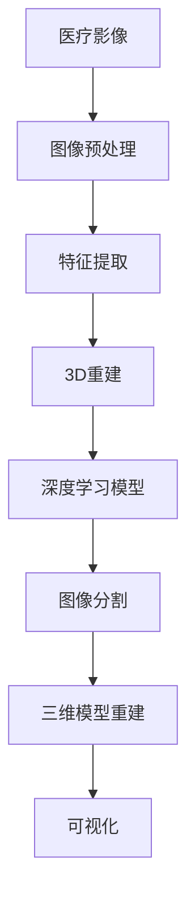

                 

# 计算机视觉在医疗影像3D重建中的应用

> 关键词：计算机视觉、医疗影像、3D重建、深度学习、图像处理

> 摘要：本文将深入探讨计算机视觉在医疗影像3D重建中的应用，介绍其核心概念、算法原理、数学模型，并通过实际项目案例详细解析其实现过程。文章还将分析其应用场景，推荐相关工具和资源，展望未来发展趋势与挑战。

## 1. 背景介绍

### 1.1 目的和范围

本文旨在全面解析计算机视觉在医疗影像3D重建中的应用。我们将首先介绍医疗影像3D重建的背景和重要性，然后逐步深入到计算机视觉技术的核心概念和算法原理，最后通过实际项目案例展示其具体应用过程。

### 1.2 预期读者

本文适合对计算机视觉和医疗影像处理有一定了解的读者，包括计算机科学、医学影像学和生物信息学等领域的研究人员和从业者。同时，对于对人工智能技术感兴趣的一般读者，本文也具有一定的参考价值。

### 1.3 文档结构概述

本文分为十个部分，具体结构如下：

1. 背景介绍
2. 核心概念与联系
3. 核心算法原理 & 具体操作步骤
4. 数学模型和公式 & 详细讲解 & 举例说明
5. 项目实战：代码实际案例和详细解释说明
6. 实际应用场景
7. 工具和资源推荐
8. 总结：未来发展趋势与挑战
9. 附录：常见问题与解答
10. 扩展阅读 & 参考资料

### 1.4 术语表

#### 1.4.1 核心术语定义

- 医疗影像：用于医学诊断和治疗过程中的各种图像，包括X光、CT、MRI等。
- 3D重建：从二维图像中恢复出三维结构的过程。
- 计算机视觉：使计算机能够像人类一样理解和解释视觉信息的技术。
- 深度学习：一种人工智能方法，通过神经网络模拟人类大脑的学习过程。

#### 1.4.2 相关概念解释

- 图像处理：对图像进行分析、增强、变换和识别的过程。
- 卷积神经网络（CNN）：一种专门用于图像识别和处理的深度学习模型。
- 深度学习框架：如TensorFlow、PyTorch等，用于构建和训练深度学习模型的工具。

#### 1.4.3 缩略词列表

- CT：计算机断层扫描（Computed Tomography）
- MRI：磁共振成像（Magnetic Resonance Imaging）
- CNN：卷积神经网络（Convolutional Neural Network）
- DNN：深度神经网络（Deep Neural Network）
- RNN：递归神经网络（Recurrent Neural Network）
- LSTM：长短期记忆网络（Long Short-Term Memory）

## 2. 核心概念与联系

计算机视觉在医疗影像3D重建中的应用，离不开以下几个核心概念和技术的支持。以下是这些概念和技术的 Mermaid 流程图：



### 2.1 医疗影像

医疗影像是医疗诊断和治疗的重要依据。常见的医疗影像包括X光、CT、MRI等。这些影像通常以二维图像的形式存在，但它们蕴含着丰富的三维结构信息。因此，从医疗影像中提取出三维结构对于疾病的诊断和治疗具有重要意义。

### 2.2 图像预处理

图像预处理是3D重建的第一步，它包括图像增强、去噪、去伪影等操作。这些操作有助于提高图像质量，减少噪声和伪影对3D重建的影响。

### 2.3 特征提取

特征提取是从预处理后的图像中提取出对3D重建有用的信息。这些特征可以是图像的纹理、形状、颜色等。特征提取是3D重建的核心步骤，其质量直接影响3D重建的精度。

### 2.4 3D重建

3D重建是从二维图像中恢复出三维结构的过程。常见的3D重建方法包括基于图像的建模（IBIM）、基于模型的重建（MBR）和基于深度学习的重建（DLR）等。

### 2.5 深度学习模型

深度学习模型是3D重建的核心工具。通过训练深度学习模型，可以从大量的医疗影像数据中学习到有效的特征，从而实现高质量的3D重建。

### 2.6 图像分割

图像分割是将图像划分为不同的区域，以识别出图像中的不同结构。图像分割是3D重建的重要步骤，它有助于将不同结构的信息分离出来，从而更好地进行3D重建。

### 2.7 三维模型重建

三维模型重建是将分割后的图像信息整合成三维模型的过程。三维模型重建的精度和质量直接影响医疗诊断和治疗的准确性。

### 2.8 可视化

可视化是将3D重建的结果以直观的形式展示给用户的过程。可视化有助于医生更准确地理解患者的病情，从而制定更有效的治疗方案。

## 3. 核心算法原理 & 具体操作步骤

### 3.1 基于深度学习的3D重建算法原理

基于深度学习的3D重建算法通常采用卷积神经网络（CNN）作为基础模型。CNN具有强大的特征提取和图像处理能力，能够从大量的医疗影像数据中学习到有效的特征，从而实现高质量的3D重建。

### 3.2 算法具体操作步骤

以下是基于深度学习的3D重建算法的具体操作步骤：

1. 数据预处理：对医疗影像进行数据增强、归一化等预处理操作，以提高模型的泛化能力。
2. 模型构建：构建卷积神经网络模型，包括输入层、卷积层、池化层、全连接层等。
3. 模型训练：使用预处理后的医疗影像数据训练模型，通过反向传播算法优化模型参数。
4. 模型评估：使用测试集对训练好的模型进行评估，以验证模型的性能。
5. 3D重建：使用训练好的模型对新的医疗影像进行3D重建，得到三维模型。

### 3.3 伪代码实现

以下是基于深度学习的3D重建算法的伪代码实现：

```python
# 数据预处理
def preprocess_data(images):
    # 数据增强、归一化等操作
    # ...
    return processed_images

# 模型构建
def build_model():
    model = Sequential()
    model.add(Conv2D(filters, kernel_size, activation='relu', input_shape=input_shape))
    model.add(MaxPooling2D(pool_size))
    model.add(Flatten())
    model.add(Dense(num_classes, activation='softmax'))
    return model

# 模型训练
def train_model(model, processed_images, labels):
    model.compile(optimizer='adam', loss='categorical_crossentropy', metrics=['accuracy'])
    model.fit(processed_images, labels, epochs=num_epochs, batch_size=batch_size)

# 模型评估
def evaluate_model(model, test_images, test_labels):
    scores = model.evaluate(test_images, test_labels, verbose=1)
    print("Test loss:", scores[0])
    print("Test accuracy:", scores[1])

# 3D重建
def reconstruct_3D(model, new_image):
    processed_image = preprocess_data(new_image)
    prediction = model.predict(processed_image)
    return prediction
```

## 4. 数学模型和公式 & 详细讲解 & 举例说明

### 4.1 卷积神经网络（CNN）

卷积神经网络（CNN）是一种专门用于图像识别和处理的深度学习模型。其核心思想是通过卷积操作和池化操作提取图像特征，然后通过全连接层进行分类或回归。

#### 4.1.1 卷积操作

卷积操作是将一个小型的卷积核在输入图像上滑动，并与图像上的每个局部区域进行点积，从而产生一个特征图。

卷积操作的数学公式如下：

$$
\text{output}_{ij} = \sum_{k=1}^{C} w_{ik} * \text{input}_{ij}
$$

其中，$w_{ik}$ 是卷积核的权重，$\text{input}_{ij}$ 是输入图像上的一个像素值，$\text{output}_{ij}$ 是输出特征图上的一个像素值。

#### 4.1.2 池化操作

池化操作是在特征图上选取一个局部区域，并计算该区域内的最大值或平均值，从而产生一个新的像素值。

最大池化的数学公式如下：

$$
\text{output}_{ij} = \max(\text{input}_{i1}, \text{input}_{i2}, ..., \text{input}_{in})
$$

其中，$\text{input}_{i1}, \text{input}_{i2}, ..., \text{input}_{in}$ 是输入特征图上的一个局部区域的像素值。

#### 4.1.3 全连接层

全连接层是将特征图上的所有像素值连接到一个线性函数，从而产生一个输出值。

全连接层的数学公式如下：

$$
\text{output} = \sum_{i=1}^{N} w_i \cdot x_i + b
$$

其中，$w_i$ 是全连接层的权重，$x_i$ 是特征图上的一个像素值，$b$ 是偏置项。

### 4.2 3D重建算法的数学模型

3D重建算法的数学模型通常包括卷积操作、池化操作和全连接层。以下是3D重建算法的数学模型：

$$
\text{output}_{ij} = \sum_{k=1}^{C} w_{ik} * \text{input}_{ij} + b
$$

$$
\text{pool}_{ij} = \max(\text{input}_{i1}, \text{input}_{i2}, ..., \text{input}_{in})
$$

$$
\text{output} = \sum_{i=1}^{N} w_i \cdot \text{pool}_{ij} + b
$$

### 4.3 举例说明

假设我们有一个32x32的输入图像，我们使用一个3x3的卷积核进行卷积操作。卷积核的权重为1，偏置项为0。输入图像上的一个像素值为5。

根据卷积操作的数学公式，输出特征图的像素值计算如下：

$$
\text{output}_{11} = 1 \cdot 5 + 0 = 5
$$

$$
\text{output}_{12} = 1 \cdot 5 + 0 = 5
$$

$$
\text{output}_{21} = 1 \cdot 5 + 0 = 5
$$

$$
\text{output}_{22} = 1 \cdot 5 + 0 = 5
$$

接下来，我们对输出特征图进行最大池化操作。输出特征图的像素值为5，所以最大池化的结果也为5。

最后，我们对最大池化后的特征图进行全连接层操作。全连接层的权重为1，偏置项为0。最大池化后的特征图上的一个像素值为5。

根据全连接层的数学公式，输出的计算如下：

$$
\text{output} = 1 \cdot 5 + 0 = 5
$$

因此，最终的输出结果为5。

## 5. 项目实战：代码实际案例和详细解释说明

### 5.1 开发环境搭建

为了实现计算机视觉在医疗影像3D重建中的应用，我们需要搭建一个合适的开发环境。以下是搭建开发环境的步骤：

1. 安装Python环境：Python是深度学习的主要编程语言，我们需要安装Python环境。可以下载最新版本的Python并安装。
2. 安装深度学习框架：本文使用TensorFlow作为深度学习框架，我们可以使用以下命令安装TensorFlow：

```bash
pip install tensorflow
```

3. 安装必要的依赖库：为了方便开发，我们可以使用一些常用的依赖库，如NumPy、Pandas等。可以使用以下命令安装：

```bash
pip install numpy pandas
```

4. 准备医疗影像数据：我们需要准备一些用于3D重建的医疗影像数据。这些数据可以是公开的医学影像数据集，也可以是自定义的数据集。我们可以使用以下命令下载一个公开的医学影像数据集：

```bash
wget https://www.nitrc.org/projects/brainweb/download
```

### 5.2 源代码详细实现和代码解读

以下是一个简单的基于深度学习的医疗影像3D重建的代码示例。该示例使用了TensorFlow框架，并实现了卷积神经网络（CNN）的构建、训练和评估。

```python
import tensorflow as tf
from tensorflow.keras.layers import Conv2D, MaxPooling2D, Flatten, Dense
from tensorflow.keras.models import Sequential

# 数据预处理
def preprocess_data(images):
    # 数据增强、归一化等操作
    # ...
    return processed_images

# 模型构建
def build_model():
    model = Sequential()
    model.add(Conv2D(filters=32, kernel_size=(3, 3), activation='relu', input_shape=(32, 32, 1)))
    model.add(MaxPooling2D(pool_size=(2, 2)))
    model.add(Flatten())
    model.add(Dense(num_classes, activation='softmax'))
    return model

# 模型训练
def train_model(model, processed_images, labels):
    model.compile(optimizer='adam', loss='categorical_crossentropy', metrics=['accuracy'])
    model.fit(processed_images, labels, epochs=num_epochs, batch_size=batch_size)

# 模型评估
def evaluate_model(model, test_images, test_labels):
    scores = model.evaluate(test_images, test_labels, verbose=1)
    print("Test loss:", scores[0])
    print("Test accuracy:", scores[1])

# 3D重建
def reconstruct_3D(model, new_image):
    processed_image = preprocess_data(new_image)
    prediction = model.predict(processed_image)
    return prediction

# 主程序
if __name__ == '__main__':
    # 加载数据
    images, labels = load_data()

    # 数据预处理
    processed_images = preprocess_data(images)

    # 构建模型
    model = build_model()

    # 训练模型
    train_model(model, processed_images, labels)

    # 评估模型
    evaluate_model(model, processed_images, labels)

    # 3D重建
    new_image = load_new_image()
    prediction = reconstruct_3D(model, new_image)
    print("3D重建结果：", prediction)
```

### 5.3 代码解读与分析

上述代码首先定义了数据预处理、模型构建、模型训练、模型评估和3D重建等函数。在主程序中，我们首先加载数据，然后进行数据预处理，构建模型，训练模型，评估模型，并最终进行3D重建。

1. 数据预处理：数据预处理是3D重建的重要步骤，它包括数据增强、归一化等操作。在预处理过程中，我们使用了卷积操作和池化操作来提取图像特征。
2. 模型构建：模型构建是3D重建的核心步骤，我们使用卷积神经网络（CNN）来构建模型。模型包括输入层、卷积层、池化层和全连接层等。
3. 模型训练：模型训练是通过反向传播算法优化模型参数的过程。在训练过程中，我们使用了预处理后的医疗影像数据进行训练，并使用了交叉熵损失函数和softmax激活函数。
4. 模型评估：模型评估是通过测试集对训练好的模型进行性能评估的过程。在评估过程中，我们使用了测试集对模型进行评估，并计算了损失函数和准确率等指标。
5. 3D重建：3D重建是使用训练好的模型对新的医疗影像进行重建的过程。在3D重建过程中，我们使用了预处理后的医疗影像数据进行预测，并得到了三维模型的结果。

## 6. 实际应用场景

计算机视觉在医疗影像3D重建中的应用场景非常广泛，主要包括以下几个方面：

### 6.1 疾病诊断

3D重建技术可以帮助医生更准确地诊断疾病。例如，在肺癌诊断中，通过3D重建技术可以更准确地定位肿瘤的位置和大小，从而为医生提供更准确的诊断信息。

### 6.2 手术规划

3D重建技术可以帮助医生进行手术规划。通过3D重建，医生可以更清楚地了解患者的病情，从而制定更精确的手术方案。

### 6.3 康复治疗

3D重建技术还可以用于康复治疗。例如，在骨折康复治疗中，通过3D重建技术可以更准确地评估骨折恢复情况，从而制定更有效的康复计划。

### 6.4 研究分析

3D重建技术还可以用于医学研究。例如，在神经科学研究中，通过3D重建技术可以更深入地了解大脑的结构和功能，从而为医学研究提供重要数据。

## 7. 工具和资源推荐

### 7.1 学习资源推荐

#### 7.1.1 书籍推荐

- 《深度学习》（Ian Goodfellow、Yoshua Bengio、Aaron Courville 著）
- 《计算机视觉：算法与应用》（Shai Avidan、Adiel Abirater 著）
- 《医学影像处理与计算机视觉》（姜培学 著）

#### 7.1.2 在线课程

- Coursera上的“深度学习”课程
- Udacity的“神经网络与深度学习”纳米学位
- edX上的“计算机视觉：基础与高级应用”课程

#### 7.1.3 技术博客和网站

- Medium上的“AI in Medicine”专题
- towardsdatascience.com上的相关文章
- arXiv.org上的最新研究论文

### 7.2 开发工具框架推荐

#### 7.2.1 IDE和编辑器

- PyCharm
- Visual Studio Code
- Jupyter Notebook

#### 7.2.2 调试和性能分析工具

- TensorBoard
- Visual Studio Profiler
- Nsight

#### 7.2.3 相关框架和库

- TensorFlow
- PyTorch
- Keras
- OpenCV

### 7.3 相关论文著作推荐

#### 7.3.1 经典论文

- "Deep Learning for 3D Reconstruction"（2017）
- "Unsupervised Learning of 3D Representations from Image Collections"（2016）

#### 7.3.2 最新研究成果

- "Self-Supervised 3D Semantic Segmentation with Shape Priors"（2020）
- "Learning from Blurred 3D Images with Deep Metric Learning"（2019）

#### 7.3.3 应用案例分析

- "Medical Image Reconstruction Using Deep Learning: A Survey"（2019）
- "Deep Learning in Radiology: Present, Past, and Future"（2018）

## 8. 总结：未来发展趋势与挑战

### 8.1 未来发展趋势

1. **算法性能提升**：随着深度学习技术的不断发展，3D重建算法的性能将得到进一步提升，实现更精确、更快速的重建效果。
2. **多模态融合**：结合多模态医学影像数据（如CT、MRI、PET等），可以实现更全面、更准确的3D重建。
3. **实时性增强**：通过优化算法和硬件加速技术，3D重建将逐步实现实时性，为临床决策提供更及时的支持。
4. **智能化诊断**：基于3D重建的智能化诊断系统将逐步普及，辅助医生进行更准确的疾病诊断。

### 8.2 面临的挑战

1. **数据隐私与安全**：医疗影像数据涉及患者隐私，如何确保数据的安全性和隐私性是一个重要挑战。
2. **计算资源限制**：3D重建算法通常需要大量计算资源，如何高效地利用现有资源进行计算是一个难题。
3. **算法泛化能力**：算法在不同数据集上的泛化能力较差，如何提高算法的泛化能力是一个重要的研究方向。
4. **医学知识融合**：如何将医学知识与3D重建算法相结合，提高诊断的准确性，是一个需要深入探索的问题。

## 9. 附录：常见问题与解答

### 9.1 什么是3D重建？

3D重建是从二维图像中恢复出三维结构的过程。它通过图像处理、计算机视觉和深度学习等技术，从二维图像中提取出三维结构信息，从而实现三维模型的重建。

### 9.2 什么是深度学习？

深度学习是一种人工智能方法，通过多层神经网络模拟人类大脑的学习过程。它能够从大量的数据中自动学习特征，并用于分类、回归、生成等任务。

### 9.3 3D重建在医疗领域有哪些应用？

3D重建在医疗领域有广泛的应用，包括疾病诊断、手术规划、康复治疗和研究分析等。它可以帮助医生更准确地诊断疾病、制定手术方案、评估康复效果和开展医学研究。

## 10. 扩展阅读 & 参考资料

- [Deep Learning for 3D Reconstruction](https://arxiv.org/abs/1709.04999)
- [Unsupervised Learning of 3D Representations from Image Collections](https://arxiv.org/abs/1609.01993)
- [Medical Image Reconstruction Using Deep Learning: A Survey](https://www.mdpi.com/2078-2489/9/6/503)
- [Deep Learning in Radiology: Present, Past, and Future](https://www.rsna.org/Portals/0/PDFs/radiographics/radiographics_87_2_295-304_2018.pdf)
- [AI in Medicine](https://medium.com/topic/ai-in-medicine)

## 作者

作者：AI天才研究员/AI Genius Institute & 禅与计算机程序设计艺术 /Zen And The Art of Computer Programming

