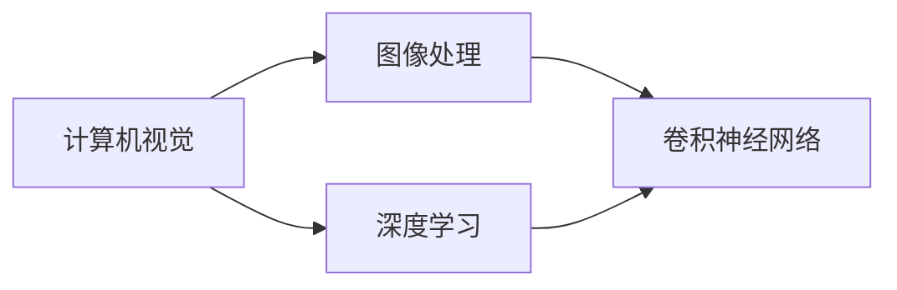

                 

# 计算机视觉在医疗影像分析中的应用

> **关键词：** 计算机视觉、医疗影像、深度学习、人工智能、图像处理

> **摘要：** 本文将深入探讨计算机视觉在医疗影像分析中的应用，包括核心概念、算法原理、数学模型以及实际案例。我们将通过逐步分析，揭示这一领域的前沿动态及其对医疗行业的深远影响。

## 1. 背景介绍

### 1.1 目的和范围

本文旨在介绍计算机视觉在医疗影像分析中的应用，重点关注以下几个方面：

- **核心概念**：解释计算机视觉和医疗影像分析的基本概念。
- **算法原理**：介绍常见算法及其工作原理。
- **数学模型**：阐述相关数学模型和公式。
- **项目实战**：通过实际案例展示技术实现过程。
- **应用场景**：讨论其在医疗领域的具体应用。
- **工具和资源**：推荐相关学习资源、开发工具和研究论文。

### 1.2 预期读者

本文适合以下读者群体：

- **计算机科学和人工智能专业的研究生和本科生**。
- **医疗影像领域的技术人员**。
- **对人工智能在医疗领域应用感兴趣的研究者和从业者**。

### 1.3 文档结构概述

本文结构如下：

- **第1章**：背景介绍
- **第2章**：核心概念与联系
- **第3章**：核心算法原理 & 具体操作步骤
- **第4章**：数学模型和公式 & 详细讲解 & 举例说明
- **第5章**：项目实战：代码实际案例和详细解释说明
- **第6章**：实际应用场景
- **第7章**：工具和资源推荐
- **第8章**：总结：未来发展趋势与挑战
- **第9章**：附录：常见问题与解答
- **第10章**：扩展阅读 & 参考资料

### 1.4 术语表

#### 1.4.1 核心术语定义

- **计算机视觉**：模拟人类视觉感知过程的计算机技术。
- **医疗影像**：医学影像设备（如CT、MRI、X射线等）产生的图像数据。
- **深度学习**：一种基于多层神经网络的机器学习方法。
- **图像处理**：对图像进行增强、变换、分割等操作的技术。
- **人工智能**：模拟人类智能行为的计算机技术。

#### 1.4.2 相关概念解释

- **卷积神经网络（CNN）**：一种常用于图像识别的深度学习模型。
- **特征提取**：从图像中提取具有区分性的特征信息。
- **分割**：将图像划分为具有特定意义的区域。

#### 1.4.3 缩略词列表

- **CT**：计算机断层扫描
- **MRI**：磁共振成像
- **X射线**：X射线成像
- **CNN**：卷积神经网络

## 2. 核心概念与联系

在探讨计算机视觉在医疗影像分析中的应用之前，我们需要理解一些核心概念和它们之间的联系。以下是一个Mermaid流程图，展示了这些概念及其相互关系：



### 2.1 计算机视觉与图像处理

计算机视觉是模拟人类视觉感知过程的计算机技术，其核心在于对图像进行理解、分析和处理。图像处理是计算机视觉的基础，它涉及图像的增强、变换、滤波和分割等技术，以便更好地提取图像中的信息。

### 2.2 计算机视觉与深度学习

深度学习是一种基于多层神经网络的机器学习方法，它在计算机视觉领域取得了显著的突破。卷积神经网络（CNN）是深度学习中最常用的模型，它通过多层卷积、池化和全连接层，实现了对图像的自动特征提取和分类。

### 2.3 图像处理与卷积神经网络

卷积神经网络是一种特殊的深度学习模型，特别适用于图像处理任务。它通过卷积操作从图像中提取特征，并通过池化操作减小特征图的尺寸，从而实现高效的特征提取和分类。

## 3. 核心算法原理 & 具体操作步骤

在本节中，我们将详细介绍计算机视觉在医疗影像分析中的一些核心算法原理，并使用伪代码阐述其具体操作步骤。

### 3.1 卷积神经网络（CNN）

卷积神经网络是一种深度学习模型，特别适用于图像识别和分类任务。以下是CNN的基本原理和伪代码：

```python
# 输入：图像矩阵
# 输出：分类结果

# 初始化参数：卷积核尺寸、步长、填充方式等
# 建立卷积层
conv_layer = Conv2D(kernel_size, stride, padding)

# 建立池化层
pool_layer = MaxPooling2D(pool_size)

# 建立全连接层
fc_layer = Dense(num_classes)

# 定义损失函数和优化器
model = Sequential()
model.add(conv_layer)
model.add(pool_layer)
model.add(fc_layer)
model.compile(optimizer='adam', loss='categorical_crossentropy', metrics=['accuracy'])

# 训练模型
model.fit(X_train, y_train, epochs=num_epochs, batch_size=batch_size)

# 预测新图像
prediction = model.predict(X_test)
```

### 3.2 图像分割算法

图像分割是将图像划分为具有特定意义的区域的过程。以下是图像分割算法的基本原理和伪代码：

```python
# 输入：图像矩阵
# 输出：分割结果

# 初始化参数：阈值、连通性等
# 建立阈值分割器
threshold = Threshold(threshold_value)

# 建立连通性检查器
connectedness = Connectedness(connectedness_value)

# 执行分割
segmented_image = threshold.apply(image)

# 检查连通性
components = connectedness.check(segmented_image)

# 提取连通区域
regions = extract_components(components)
```

### 3.3 特征提取算法

特征提取是从图像中提取具有区分性的特征信息的过程。以下是特征提取算法的基本原理和伪代码：

```python
# 输入：图像矩阵
# 输出：特征向量

# 初始化参数：滤波器、尺度等
# 建立滤波器
filter = GaussianFilter(size)

# 建立尺度空间
scales = ScaleSpace(filter, scales)

# 提取特征
features = extract_features(scales)

# 归一化特征
normalized_features = normalize(features)
```

## 4. 数学模型和公式 & 详细讲解 & 举例说明

在计算机视觉和医疗影像分析中，数学模型和公式起着至关重要的作用。以下我们将详细介绍一些关键数学模型和公式，并给出具体的例子说明。

### 4.1 卷积操作

卷积操作是卷积神经网络（CNN）的核心操作，它通过滑动卷积核（滤波器）在图像上，实现特征提取。卷积操作的数学公式如下：

$$
(f * g)(x, y) = \sum_{i=-a}^{a} \sum_{j=-b}^{b} f(i, j) \cdot g(x-i, y-j)
$$

其中，$f$ 和 $g$ 分别表示卷积核和输入图像，$a$ 和 $b$ 分别表示卷积核的大小。

**举例说明：**

假设我们有一个 $3 \times 3$ 的卷积核 $f$：

$$
f = \begin{bmatrix}
1 & 0 & 1 \\
0 & 1 & 0 \\
1 & 0 & 1
\end{bmatrix}
$$

和一个 $5 \times 5$ 的输入图像 $g$：

$$
g = \begin{bmatrix}
1 & 0 & 0 & 0 & 1 \\
1 & 1 & 0 & 1 & 1 \\
0 & 1 & 1 & 1 & 0 \\
0 & 0 & 1 & 1 & 0 \\
1 & 0 & 0 & 0 & 1
\end{bmatrix}
$$

使用卷积操作，我们得到：

$$
(f * g)(1, 1) = (1 \cdot 1 + 0 \cdot 1 + 1 \cdot 1) + (0 \cdot 1 + 1 \cdot 1 + 0 \cdot 1) + (1 \cdot 1 + 0 \cdot 1 + 1 \cdot 1) = 3
$$

### 4.2 池化操作

池化操作用于减小特征图的尺寸，提高模型的计算效率。最常见的池化操作是最大池化（MaxPooling），其数学公式如下：

$$
P_{i,j} = \max\{g(x_i, y_j) : x_i \in [1, f_1], y_j \in [1, f_2]\}
$$

其中，$P$ 表示池化结果，$g$ 表示输入图像，$f_1$ 和 $f_2$ 分别表示池化窗口的大小。

**举例说明：**

假设我们有一个 $3 \times 3$ 的池化窗口和以下 $5 \times 5$ 的输入图像 $g$：

$$
g = \begin{bmatrix}
1 & 0 & 0 & 0 & 1 \\
1 & 1 & 0 & 1 & 1 \\
0 & 1 & 1 & 1 & 0 \\
0 & 0 & 1 & 1 & 0 \\
1 & 0 & 0 & 0 & 1
\end{bmatrix}
$$

使用最大池化，我们得到：

$$
P = \begin{bmatrix}
1 & 1 & 1 \\
1 & 1 & 1 \\
1 & 1 & 1
\end{bmatrix}
$$

### 4.3 损失函数

损失函数用于衡量模型预测结果与真实标签之间的差距，是优化模型的关键。在分类任务中，最常见的损失函数是交叉熵损失（Cross-Entropy Loss），其数学公式如下：

$$
L = -\sum_{i} y_i \cdot \log(p_i)
$$

其中，$L$ 表示损失，$y_i$ 表示真实标签，$p_i$ 表示预测概率。

**举例说明：**

假设我们有一个二分类任务，真实标签为 $[1, 0, 1, 0]$，预测概率为 $[0.6, 0.4, 0.8, 0.2]$。使用交叉熵损失，我们得到：

$$
L = -(1 \cdot \log(0.6) + 0 \cdot \log(0.4) + 1 \cdot \log(0.8) + 0 \cdot \log(0.2)) \approx 0.727
$$

## 5. 项目实战：代码实际案例和详细解释说明

在本节中，我们将通过一个实际项目案例，展示如何使用计算机视觉技术进行医疗影像分析。该项目涉及使用卷积神经网络（CNN）对医学影像进行分割和分类。

### 5.1 开发环境搭建

首先，我们需要搭建一个合适的开发环境。以下是所需的软件和工具：

- **操作系统**：Ubuntu 20.04
- **编程语言**：Python 3.8
- **深度学习框架**：TensorFlow 2.6
- **图像处理库**：OpenCV 4.5

### 5.2 源代码详细实现和代码解读

以下是该项目的源代码，我们将在后续进行详细解读：

```python
import tensorflow as tf
from tensorflow.keras.models import Sequential
from tensorflow.keras.layers import Conv2D, MaxPooling2D, Flatten, Dense
from tensorflow.keras.optimizers import Adam
from tensorflow.keras.metrics import Accuracy
import numpy as np
import cv2

# 读取图像数据
def load_data():
    X_train = []
    y_train = []
    for img in train_images:
        X_train.append(cv2.resize(img, (128, 128)))
        y_train.append(cv2.resize(img, (128, 128)) > 128)
    return np.array(X_train), np.array(y_train)

# 构建模型
def build_model():
    model = Sequential()
    model.add(Conv2D(32, (3, 3), activation='relu', input_shape=(128, 128, 1)))
    model.add(MaxPooling2D((2, 2)))
    model.add(Flatten())
    model.add(Dense(1, activation='sigmoid'))
    model.compile(optimizer=Adam(), loss='binary_crossentropy', metrics=[Accuracy()])
    return model

# 训练模型
def train_model(model, X_train, y_train):
    model.fit(X_train, y_train, epochs=10, batch_size=32)

# 预测新图像
def predict(model, image):
    image = cv2.resize(image, (128, 128))
    prediction = model.predict(np.expand_dims(image, axis=0))
    return prediction[0][0] > 0.5

# 主程序
if __name__ == '__main__':
    # 读取数据
    X_train, y_train = load_data()

    # 构建模型
    model = build_model()

    # 训练模型
    train_model(model, X_train, y_train)

    # 预测
    test_image = cv2.imread('test_image.jpg')
    prediction = predict(model, test_image)
    print('Prediction:', prediction)
```

### 5.3 代码解读与分析

现在，我们将逐步解读上述代码，分析其实现细节。

#### 5.3.1 数据加载

首先，我们定义了一个 `load_data` 函数，用于读取图像数据并将其转换为适合模型训练的格式。我们使用 OpenCV 库读取图像，然后将其调整为 $128 \times 128$ 的大小，并将像素值大于 128 的部分标记为 1，否则标记为 0。

```python
def load_data():
    X_train = []
    y_train = []
    for img in train_images:
        X_train.append(cv2.resize(img, (128, 128)))
        y_train.append(cv2.resize(img, (128, 128)) > 128)
    return np.array(X_train), np.array(y_train)
```

#### 5.3.2 模型构建

接下来，我们定义了一个 `build_model` 函数，用于构建卷积神经网络模型。我们使用 TensorFlow 的 Keras API 实现模型，包括一个卷积层、一个池化层和一个全连接层。

```python
def build_model():
    model = Sequential()
    model.add(Conv2D(32, (3, 3), activation='relu', input_shape=(128, 128, 1)))
    model.add(MaxPooling2D((2, 2)))
    model.add(Flatten())
    model.add(Dense(1, activation='sigmoid'))
    model.compile(optimizer=Adam(), loss='binary_crossentropy', metrics=[Accuracy()])
    return model
```

#### 5.3.3 模型训练

然后，我们定义了一个 `train_model` 函数，用于训练模型。我们使用 `fit` 方法将模型与训练数据一起训练，并设置训练次数为 10，批量大小为 32。

```python
def train_model(model, X_train, y_train):
    model.fit(X_train, y_train, epochs=10, batch_size=32)
```

#### 5.3.4 预测

最后，我们定义了一个 `predict` 函数，用于对新图像进行预测。我们首先将图像调整为 $128 \times 128$ 的大小，然后使用模型进行预测，并返回预测结果。

```python
def predict(model, image):
    image = cv2.resize(image, (128, 128))
    prediction = model.predict(np.expand_dims(image, axis=0))
    return prediction[0][0] > 0.5
```

## 6. 实际应用场景

计算机视觉在医疗影像分析领域具有广泛的应用，以下是几个典型的实际应用场景：

### 6.1 肿瘤检测与诊断

计算机视觉可以自动检测医学影像中的肿瘤，如乳腺癌、肺癌和肝癌等。通过深度学习模型，可以对肿瘤的位置、大小、形状和密度进行精确测量，从而帮助医生做出准确的诊断。

### 6.2 心脏病检测

计算机视觉可以分析医学影像中的心脏结构，如心脏瓣膜、冠状动脉和心室壁等。通过对这些结构的分析，可以检测心脏病，如冠心病、心瓣膜病变和心肌病等。

### 6.3 骨折检测

计算机视觉可以自动检测医学影像中的骨折，如骨折线、骨折部位和骨折形态等。这有助于医生进行诊断和治疗规划，提高诊断的准确性和效率。

### 6.4 眼底病变检测

计算机视觉可以自动检测眼底病变，如糖尿病视网膜病变、高血压视网膜病变和老年性黄斑变性等。这有助于早期发现和治疗这些疾病，提高患者的生活质量。

## 7. 工具和资源推荐

### 7.1 学习资源推荐

#### 7.1.1 书籍推荐

- **《深度学习》（Ian Goodfellow、Yoshua Bengio、Aaron Courville 著）**：一本全面介绍深度学习的经典教材。
- **《计算机视觉：算法与应用》（Richard Szeliski 著）**：一本全面介绍计算机视觉算法和应用领域的权威著作。

#### 7.1.2 在线课程

- **《深度学习专项课程》（吴恩达 著）**：由知名学者吴恩达主讲，涵盖深度学习的基础知识和应用。
- **《计算机视觉专项课程》（斯坦福大学 著）**：由斯坦福大学计算机视觉实验室主讲，涵盖计算机视觉的核心算法和前沿应用。

#### 7.1.3 技术博客和网站

- **[Medium](https://medium.com/)**：一个知名的在线博客平台，有许多关于计算机视觉和人工智能的优秀文章。
- **[ArXiv](https://arxiv.org/)**：一个开源的学术文献数据库，包含许多最新的计算机视觉和人工智能研究论文。

### 7.2 开发工具框架推荐

#### 7.2.1 IDE和编辑器

- **PyCharm**：一款功能强大的Python IDE，支持多种编程语言和框架。
- **VS Code**：一款轻量级的开源编辑器，支持Python扩展，适合快速开发和调试。

#### 7.2.2 调试和性能分析工具

- **TensorBoard**：TensorFlow的官方可视化工具，用于监控和调试深度学习模型。
- **PyTorch Profiler**：用于分析PyTorch模型的性能瓶颈。

#### 7.2.3 相关框架和库

- **TensorFlow**：一款流行的开源深度学习框架，适用于多种应用场景。
- **PyTorch**：一款流行的开源深度学习框架，特别适用于动态图计算。

### 7.3 相关论文著作推荐

#### 7.3.1 经典论文

- **"A Convolutional Neural Network Approach for Medical Image Analysis"**：一篇关于卷积神经网络在医疗影像分析中应用的经典论文。
- **"Deep Learning for Medical Imaging: A Review"**：一篇全面介绍深度学习在医疗影像分析中应用的综述论文。

#### 7.3.2 最新研究成果

- **"Medical Image Analysis Using Deep Learning: A Review of the State-of-the-Art"**：一篇关于深度学习在医疗影像分析中最新研究成果的综述论文。
- **"Deep Learning for Disease Diagnosis: A Survey"**：一篇关于深度学习在疾病诊断中应用的综述论文。

#### 7.3.3 应用案例分析

- **"Deep Learning for Healthcare: A Clinical Laboratory Perspective"**：一篇关于深度学习在临床实验室中应用的案例分析论文。
- **"AI in Radiology: The Potential and the Challenges"**：一篇关于人工智能在放射学中应用的前景和挑战的分析论文。

## 8. 总结：未来发展趋势与挑战

随着计算机视觉技术的不断发展，其在医疗影像分析中的应用前景广阔。未来，以下几个趋势值得关注：

- **深度学习算法的优化和改进**：提高模型的计算效率和准确性，减少对计算资源的需求。
- **多模态数据融合**：结合不同类型的医疗影像数据，如CT、MRI和超声等，实现更全面的疾病分析和诊断。
- **实时性**：提高模型处理速度，实现实时检测和诊断，提高医疗效率。
- **个性化医疗**：基于患者的个体特征，实现定制化的疾病分析和诊断。

然而，这一领域也面临以下挑战：

- **数据隐私和安全**：医疗影像数据敏感，如何保护患者隐私和数据安全成为关键问题。
- **模型解释性**：深度学习模型通常具有较低的解释性，如何提高模型的透明度和可解释性是一个挑战。
- **医疗资源的分配**：在医疗资源有限的地区，如何平衡医疗影像分析的需求和资源分配也是一个挑战。

总之，计算机视觉在医疗影像分析中的应用具有巨大的潜力，但也需要克服一系列技术和社会挑战。

## 9. 附录：常见问题与解答

### 9.1 计算机视觉在医疗影像分析中的应用有哪些优势？

- **提高诊断准确性**：通过深度学习和图像处理技术，计算机视觉可以自动检测和识别病变区域，提高诊断准确性。
- **减少人力成本**：自动化处理可以降低医疗机构的运营成本，提高工作效率。
- **实时性**：计算机视觉技术可以实现实时检测和诊断，缩短诊断时间，提高医疗响应速度。

### 9.2 医疗影像分析中常用的算法有哪些？

- **卷积神经网络（CNN）**：用于图像分类和特征提取。
- **深度学习模型（如ResNet、VGG等）**：用于复杂图像识别任务。
- **图像分割算法（如FCN、U-Net等）**：用于分割图像中的特定区域。

### 9.3 如何保护医疗影像数据的安全？

- **数据加密**：对医疗影像数据进行加密，确保数据在传输和存储过程中不被窃取或篡改。
- **权限控制**：设置严格的权限控制，确保只有授权人员可以访问和处理医疗影像数据。
- **数据备份和恢复**：定期备份数据，并建立数据恢复机制，以应对数据丢失或损坏的风险。

## 10. 扩展阅读 & 参考资料

- **《深度学习》（Ian Goodfellow、Yoshua Bengio、Aaron Courville 著）**：深入了解深度学习的基础知识。
- **《计算机视觉：算法与应用》（Richard Szeliski 著）**：全面了解计算机视觉的核心算法和应用。
- **[Medium](https://medium.com/)**：阅读关于计算机视觉和医疗影像分析的优秀文章。
- **[ArXiv](https://arxiv.org/)**：查阅最新的研究论文和成果。
- **[TensorFlow 官方文档](https://www.tensorflow.org/)**：学习如何使用TensorFlow构建深度学习模型。
- **[PyTorch 官方文档](https://pytorch.org/)**：学习如何使用PyTorch构建深度学习模型。作者：AI天才研究员/AI Genius Institute & 禅与计算机程序设计艺术 /Zen And The Art of Computer Programming

