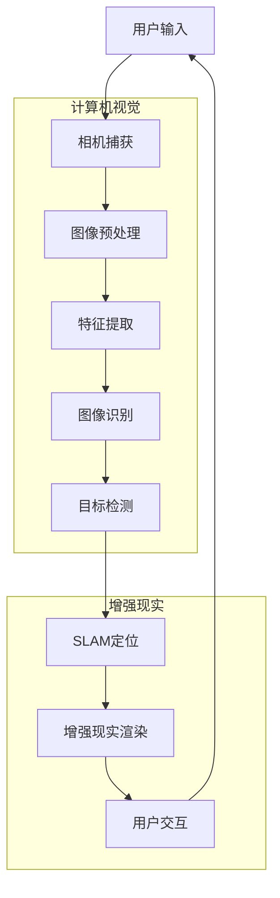

                 

### 计算机视觉在增强现实技术中的应用

> **关键词**：计算机视觉、增强现实、AR技术、图像识别、深度学习、SLAM

> **摘要**：本文将深入探讨计算机视觉在增强现实（AR）技术中的应用，从背景介绍、核心概念、算法原理、数学模型、实际案例、应用场景到未来发展趋势，系统性地梳理了计算机视觉与增强现实技术的融合所带来的创新与挑战。通过具体的技术讲解与实战案例分析，为读者提供了一部全面而深入的计算机视觉与增强现实技术指南。

## 1. 背景介绍

### 1.1 目的和范围

本文旨在全面解析计算机视觉在增强现实（AR）技术中的关键作用，并详细探讨其应用原理和实战案例。增强现实技术作为一种将虚拟信息与现实世界相结合的先进技术，近年来在虚拟现实、游戏娱乐、医疗健康、工业制造等多个领域取得了显著进展。计算机视觉作为人工智能领域的重要分支，通过对图像和视频的处理与分析，为AR技术的实现提供了核心支持。本文将围绕以下几个主题展开：

1. 计算机视觉基础概念及其在AR中的应用
2. 增强现实技术的核心原理与发展历程
3. 常见计算机视觉算法及其在AR中的应用
4. 数学模型与公式在计算机视觉中的作用
5. 实际应用场景与案例分析
6. 相关工具和资源的推荐
7. 未来发展趋势与面临的挑战

通过本文的阅读，读者将能够系统地了解计算机视觉与增强现实技术的融合，掌握相关核心概念与实用技术，并为未来在相关领域的创新与开发提供参考。

### 1.2 预期读者

本文适用于以下读者群体：

1. 计算机视觉和增强现实技术爱好者，对相关领域充满好奇心和探索欲。
2. 需要了解计算机视觉在AR应用中的程序员、开发者以及工程技术人员。
3. 想要在游戏开发、虚拟现实、医疗健康等领域应用AR技术的从业者。
4. 计算机科学、人工智能、电子工程等相关专业的研究生和本科生。
5. 对技术趋势保持敏感，希望紧跟前沿科技发展的技术爱好者。

无论您是初学者还是专业人士，本文都将为您提供有价值的知识和实用的技术指导，帮助您更好地理解计算机视觉与增强现实技术的融合与应用。

### 1.3 文档结构概述

本文结构如下：

1. **背景介绍**：介绍文章的目的、范围、预期读者以及文档的结构概述。
2. **核心概念与联系**：通过Mermaid流程图展示计算机视觉与增强现实技术的基本架构。
3. **核心算法原理 & 具体操作步骤**：详细介绍计算机视觉算法及其在AR中的应用。
4. **数学模型和公式 & 详细讲解 & 举例说明**：讲解数学模型与公式的应用及实际意义。
5. **项目实战：代码实际案例和详细解释说明**：提供具体开发环境、源代码及代码解读。
6. **实际应用场景**：探讨计算机视觉在AR中的各种应用场景。
7. **工具和资源推荐**：推荐学习资源、开发工具框架和相关论文著作。
8. **总结：未来发展趋势与挑战**：展望未来发展趋势及面临的挑战。
9. **附录：常见问题与解答**：解答读者可能遇到的问题。
10. **扩展阅读 & 参考资料**：提供进一步学习和研究的资源。

通过这一结构，读者可以系统地了解计算机视觉在增强现实技术中的应用，并掌握相关技术知识和实践方法。

### 1.4 术语表

#### 1.4.1 核心术语定义

- **计算机视觉**：计算机模拟人类视觉感知过程的科学，包括图像识别、目标检测、图像分割、场景理解等。
- **增强现实（AR）**：通过计算机生成的虚拟信息叠加在现实世界中，使现实世界与虚拟世界相结合的技术。
- **图像识别**：使用机器学习算法从图像或视频中识别和分类对象的技术。
- **目标检测**：在图像或视频中检测特定目标对象的位置和边界的技术。
- **图像分割**：将图像划分为多个区域，每个区域具有相似特征的技术。
- **SLAM（Simultaneous Localization and Mapping）**：同时进行位置定位和地图构建的算法。
- **深度学习**：一种基于人工神经网络的机器学习技术，通过多层神经网络进行特征提取和分类。

#### 1.4.2 相关概念解释

- **特征提取**：从原始数据中提取具有区分性的特征，用于后续处理和识别。
- **卷积神经网络（CNN）**：一种特殊类型的人工神经网络，常用于图像识别和计算机视觉任务。
- **神经网络**：由多个神经元组成的计算模型，通过训练能够识别和分类数据。
- **机器学习**：一种使计算机通过数据学习规律和模式，从而进行决策和预测的技术。

#### 1.4.3 缩略词列表

- **CNN**：卷积神经网络（Convolutional Neural Network）
- **SLAM**：同时定位与地图构建（Simultaneous Localization and Mapping）
- **AR**：增强现实（Augmented Reality）
- **VR**：虚拟现实（Virtual Reality）
- **GPU**：图形处理单元（Graphics Processing Unit）
- **AI**：人工智能（Artificial Intelligence）
- **ML**：机器学习（Machine Learning）

## 2. 核心概念与联系

为了更好地理解计算机视觉在增强现实技术中的应用，首先需要了解两者的核心概念及其联系。以下是一个简化的Mermaid流程图，展示了计算机视觉与增强现实技术的基本架构。



### 用户输入与相机捕获

用户输入是增强现实系统的开始，它可以是手势、声音或文本等。相机捕获模块负责捕捉现实世界的图像或视频流，并将其转换为数字信号。

### 图像预处理

图像预处理是计算机视觉任务的基础。它包括图像去噪、缩放、旋转等操作，以提高图像质量并减少后续处理的复杂性。

### 特征提取

特征提取模块从预处理后的图像中提取具有区分性的特征，如边缘、纹理和形状。这些特征用于后续的图像识别和目标检测任务。

### 图像识别

图像识别模块使用深度学习算法，如卷积神经网络（CNN），对图像中的对象进行分类和识别。这些算法经过大量数据训练，能够准确识别各种对象。

### 目标检测

目标检测模块在图像中检测特定目标对象的位置和边界。常用的算法包括R-CNN、YOLO和SSD等，这些算法能够高效地识别并定位多个目标。

### SLAM定位

SLAM（Simultaneous Localization and Mapping）模块同时进行位置定位和地图构建。通过融合相机捕获的图像和传感器数据，SLAM算法能够实时计算设备的相对位置和周围环境的地图。

### 增强现实渲染

增强现实渲染模块将计算机视觉算法识别出的虚拟信息叠加到真实世界中。通过渲染技术，虚拟物体可以与现实环境无缝融合，提供沉浸式的用户体验。

### 用户交互

用户交互模块负责处理用户输入，如手势和声音，并将其转换为相应的操作。用户可以通过这些操作与增强现实环境进行互动。

通过上述流程，我们可以看到计算机视觉与增强现实技术的紧密联系。计算机视觉提供了图像识别、目标检测和SLAM定位等核心功能，而增强现实技术则将这些功能应用于真实世界的场景中，为用户提供丰富的虚拟交互体验。

接下来，我们将进一步探讨计算机视觉在增强现实技术中的应用原理和具体算法，帮助读者深入理解这一领域的核心概念。

## 3. 核心算法原理 & 具体操作步骤

### 3.1 图像识别算法

图像识别是计算机视觉的核心任务之一，其主要目的是通过算法从图像或视频中识别和分类对象。以下是一些常用的图像识别算法及其基本原理：

#### 3.1.1 卷积神经网络（CNN）

卷积神经网络（CNN）是一种专门用于图像识别和计算机视觉任务的人工神经网络。它的基本原理是通过卷积层、池化层和全连接层等结构，逐步提取图像中的特征，并进行分类。

**伪代码：**

```python
# 输入图像
input_image

# 卷积层
conv_layer = Conv2D(filters=32, kernel_size=(3,3), activation='relu')(input_image)

# 池化层
pool_layer = MaxPooling2D(pool_size=(2,2))(conv_layer)

# 多层卷积和池化
for _ in range(5):
    conv_layer = Conv2D(filters=64, kernel_size=(3,3), activation='relu')(pool_layer)
    pool_layer = MaxPooling2D(pool_size=(2,2))(conv_layer)

# 全连接层
flatten_layer = Flatten()(pool_layer)
dense_layer = Dense(units=1024, activation='relu')(flatten_layer)

# 输出分类结果
output = Dense(units=num_classes, activation='softmax')(dense_layer)
```

#### 3.1.2 卷积神经网络（CNN）的工作流程

1. **输入层**：接收输入图像。
2. **卷积层**：通过卷积操作提取图像特征。
3. **激活函数**：对卷积层的输出进行非线性变换，如ReLU函数。
4. **池化层**：通过池化操作减少特征图的尺寸，降低计算复杂度。
5. **多层卷积和池化**：重复卷积和池化操作，逐步提取更高级别的特征。
6. **全连接层**：将卷积层的输出展平为一维向量，并通过全连接层进行分类。

### 3.2 目标检测算法

目标检测是在图像中检测特定目标对象的位置和边界，是增强现实技术中的关键任务之一。以下是一些常用的目标检测算法及其基本原理：

#### 3.2.1 R-CNN

R-CNN（Regions with CNN features）是一种基于深度学习的目标检测算法。它包括区域提议、特征提取和分类三个主要步骤。

**伪代码：**

```python
# 输入图像
input_image

# 区域提议
regions = generate_regions(input_image)

# 特征提取
for region in regions:
    feature_map = extract_features(region, CNN_model)

# 分类
for feature_map in feature_maps:
    class probabilities = softmax(Dense(feature_map, units=num_classes)(feature_map))
    detect_objects(class_probabilities > threshold)
```

#### 3.2.2 YOLO

YOLO（You Only Look Once）是一种高效的目标检测算法，能够在单次前向传播中同时检测多个目标。它包括特征提取、边界框预测和分类三个主要步骤。

**伪代码：**

```python
# 输入图像
input_image

# 特征提取
feature_map = extract_features(input_image, CNN_model)

# 边界框预测
bounding_boxes = predict_bounding_boxes(feature_map)

# 分类
class_probs = predict_classes(bounding_boxes)

# 非极大值抑制（NMS）
filtered_boxes = non_max_suppression(bounding_boxes, class_probs, threshold)

# 输出检测结果
output = filter_boxes(filtered_boxes, threshold)
```

### 3.3 SLAM定位算法

SLAM（Simultaneous Localization and Mapping）是一种同时进行位置定位和地图构建的算法，广泛应用于增强现实、自动驾驶和机器人等领域。以下是一些常用的SLAM算法及其基本原理：

#### 3.3.1 ORB-SLAM

ORB-SLAM是一种基于视觉的SLAM算法，包括前端（视觉跟踪和地图构建）和后端（优化和重定位）两个主要模块。

**伪代码：**

```python
# 前端：视觉跟踪和地图构建
while not termination_condition:
    capture_image
    track_keyframes
    build_map

# 后端：优化和重定位
while not termination_condition:
    optimize_map
    relocate_robot
```

#### 3.3.2 DSO

DSO（Discrete SLAM）是一种基于视觉的稀疏SLAM算法，通过离散点云构建和优化来实现高效的位置定位和地图构建。

**伪代码：**

```python
# 前端：视觉跟踪和点云构建
while not termination_condition:
    capture_image
    track_points
    build_point_cloud

# 后端：点云优化
while not termination_condition:
    optimize_point_cloud
    refine_localization
```

通过上述核心算法及其具体操作步骤的介绍，我们可以看到计算机视觉在增强现实技术中的应用是如何实现的。这些算法在图像识别、目标检测和SLAM定位等关键任务中发挥着重要作用，为增强现实技术提供了强大的支持。在接下来的部分，我们将进一步探讨数学模型和公式在计算机视觉中的应用，帮助读者更深入地理解这一领域。

## 4. 数学模型和公式 & 详细讲解 & 举例说明

### 4.1 数学模型

在计算机视觉和增强现实技术中，数学模型是核心组成部分，用于描述和实现各种图像处理、特征提取和目标检测任务。以下是一些常用的数学模型和其应用场景：

#### 4.1.1 卷积运算

卷积运算是计算机视觉中最基本的操作之一，用于提取图像中的特征。其公式如下：

$$
\text{output}_{ij} = \sum_{k=1}^{n}\sum_{l=1}^{m} w_{kl} \cdot \text{input}_{(i-k, j-l)}
$$

其中，$w_{kl}$ 是卷积核（或滤波器），$\text{input}_{(i-k, j-l)}$ 是输入图像中的一个像素值，$\text{output}_{ij}$ 是卷积操作的结果。

#### 4.1.2 池化运算

池化运算是为了减少特征图的尺寸和计算复杂度而设计的。最常用的池化方法是最大池化（Max Pooling），其公式如下：

$$
\text{output}_{ij} = \max\{\text{input}_{i',j'} \mid i' \in [i, i+h-1], j' \in [j, j+h-1]\}
$$

其中，$h$ 是池化窗口的大小。

#### 4.1.3 神经网络

神经网络是一种模拟人类大脑结构和功能的计算模型，通过多层神经元进行特征提取和分类。以下是一个简单的三层神经网络结构及其反向传播算法：

**前向传播：**

$$
\begin{aligned}
    z_1 &= \text{activation}(W_1 \cdot x + b_1) \\
    a_1 &= \text{softmax}(z_1) \\
    z_2 &= W_2 \cdot a_1 + b_2 \\
    a_2 &= \text{softmax}(z_2)
\end{aligned}
$$

**反向传播：**

$$
\begin{aligned}
    \delta_2 &= \text{softmax-delta}(z_2, \text{target}) \\
    \delta_1 &= \text{activation-delta}(z_1) \cdot \delta_2 \cdot W_2
\end{aligned}
$$

### 4.2 应用举例

#### 4.2.1 图像识别

以下是一个简单的图像识别任务，使用卷积神经网络对图片进行分类：

1. **输入层**：接收一张28x28像素的灰度图像。
2. **卷积层**：使用5x5的卷积核提取图像特征，并应用ReLU激活函数。
3. **池化层**：使用2x2的最大池化窗口减少特征图的尺寸。
4. **全连接层**：将卷积层的输出展平为一维向量，并通过全连接层进行分类。

**伪代码：**

```python
# 输入图像
input_image

# 卷积层
conv_output = Conv2D(filters=32, kernel_size=(5,5), activation='relu')(input_image)
pool_output = MaxPooling2D(pool_size=(2,2))(conv_output)

# 全连接层
flatten_output = Flatten()(pool_output)
dense_output = Dense(units=10, activation='softmax')(flatten_output)

# 输出分类结果
predicted_class = dense_output
```

#### 4.2.2 目标检测

以下是一个简单的目标检测任务，使用YOLO算法对图像中的目标进行检测：

1. **输入层**：接收一张图像。
2. **特征提取**：使用卷积神经网络提取图像特征。
3. **边界框预测**：使用YOLO算法预测边界框的位置和类别。
4. **非极大值抑制（NMS）**：对预测的边界框进行筛选，去除重叠的边界框。

**伪代码：**

```python
# 输入图像
input_image

# 特征提取
feature_map = extract_features(input_image, CNN_model)

# 边界框预测
bounding_boxes = predict_bounding_boxes(feature_map)

# 非极大值抑制
filtered_boxes = non_max_suppression(bounding_boxes, class_probs, threshold)

# 输出检测结果
output = filter_boxes(filtered_boxes, threshold)
```

#### 4.2.3 SLAM定位

以下是一个简单的SLAM定位任务，使用ORB-SLAM算法实现：

1. **前端**：捕捉图像，跟踪关键帧，构建地图。
2. **后端**：优化地图，实现重定位。

**伪代码：**

```python
# 前端：视觉跟踪和地图构建
while not termination_condition:
    capture_image
    track_keyframes
    build_map

# 后端：优化和重定位
while not termination_condition:
    optimize_map
    relocate_robot
```

通过上述数学模型和公式的详细讲解以及实际应用举例，我们可以看到数学在计算机视觉和增强现实技术中的应用是如何实现和优化的。这些模型和公式为增强现实技术提供了强大的理论基础和实践指导，推动了这一领域的发展和创新。

### 4.3 总结

数学模型在计算机视觉和增强现实技术中起着至关重要的作用。它们不仅提供了描述和实现各种图像处理和识别任务的理论框架，还为算法的优化和改进提供了指导。通过对卷积运算、池化运算、神经网络等基本数学模型的理解和应用，我们能够有效地处理和解释复杂的视觉数据，实现精准的目标检测和SLAM定位等功能。在未来，随着计算能力和算法的不断提升，数学模型将继续在计算机视觉和增强现实技术中发挥关键作用，推动这一领域实现更多的创新和突破。

## 5. 项目实战：代码实际案例和详细解释说明

### 5.1 开发环境搭建

在进行增强现实项目开发之前，我们需要搭建一个合适的开发环境，其中包括必要的软件和工具。以下是一个典型的开发环境搭建步骤：

#### 5.1.1 软件安装

1. **操作系统**：建议使用Linux或macOS，这些操作系统对开发者友好，并且支持各种编程语言和工具。
2. **Python**：安装Python 3.7或更高版本，可以通过Python官方网站下载。
3. **pip**：安装pip，Python的包管理器，用于安装和管理第三方库。
4. **Anaconda**：安装Anaconda，一个流行的Python数据科学和机器学习平台，可以方便地创建和管理虚拟环境。
5. **OpenCV**：安装OpenCV，一个开源的计算机视觉库，用于图像处理和特征提取。
6. **PyTorch**：安装PyTorch，一个流行的深度学习库，用于构建和训练神经网络。

#### 5.1.2 环境配置

1. **创建虚拟环境**：使用Anaconda创建一个独立的虚拟环境，以便于管理项目依赖。
    ```bash
    conda create -n ar_project python=3.8
    conda activate ar_project
    ```
2. **安装依赖库**：
    ```bash
    pip install numpy opencv-python pytorch torchvision
    ```

### 5.2 源代码详细实现和代码解读

以下是一个简单的增强现实项目，使用Python和PyTorch实现。该项目的目标是使用计算机视觉算法识别和叠加虚拟物体到真实世界中。

#### 5.2.1 数据准备

首先，我们需要准备用于训练和测试的数据集。假设我们已经有一个包含图像和对应标注的数据集。

```python
import cv2
import os

def load_dataset(dataset_path):
    images = []
    labels = []

    for image_path in os.listdir(dataset_path):
        image = cv2.imread(os.path.join(dataset_path, image_path))
        label = cv2.imread(os.path.join(dataset_path, image_path.replace('images', 'labels')), cv2.IMREAD_GRAYSCALE)

        images.append(image)
        labels.append(label)

    return images, labels

images, labels = load_dataset('dataset')
```

#### 5.2.2 神经网络构建

接下来，我们构建一个卷积神经网络（CNN）用于图像识别。

```python
import torch
import torch.nn as nn
import torch.optim as optim

class CNN(nn.Module):
    def __init__(self, num_classes):
        super(CNN, self).__init__()
        self.conv1 = nn.Conv2d(3, 32, 5)
        self.pool = nn.MaxPool2d(2, 2)
        self.conv2 = nn.Conv2d(32, 64, 5)
        self.fc1 = nn.Linear(64 * 5 * 5, 1024)
        self.fc2 = nn.Linear(1024, num_classes)

    def forward(self, x):
        x = self.pool(F.relu(self.conv1(x)))
        x = self.pool(F.relu(self.conv2(x)))
        x = x.view(-1, 64 * 5 * 5)
        x = F.relu(self.fc1(x))
        x = self.fc2(x)
        return x

model = CNN(num_classes=10)
```

#### 5.2.3 训练模型

使用训练数据和模型进行训练。

```python
criterion = nn.CrossEntropyLoss()
optimizer = optim.Adam(model.parameters(), lr=0.001)

for epoch in range(10):  # 10个训练周期
    running_loss = 0.0
    for i, (images, labels) in enumerate(train_loader):
        images = images.to(device)
        labels = labels.to(device)

        optimizer.zero_grad()

        outputs = model(images)
        loss = criterion(outputs, labels)
        loss.backward()
        optimizer.step()

        running_loss += loss.item()
    print(f'Epoch {epoch+1}, Loss: {running_loss/len(train_loader)}')
```

#### 5.2.4 预测和增强现实渲染

对图像进行预测，并将预测结果叠加到真实世界中。

```python
def predict(image):
    image = image.to(device)
    output = model(image)
    predicted_class = torch.argmax(output, dim=1)
    return predicted_class.item()

def render(image, predicted_class):
    image = cv2.imread(image_path)
    overlay = cv2.imread(f'overlay_{predicted_class}.png', cv2.IMREAD_UNCHANGED)
    
    image_height, image_width, _ = image.shape
    overlay_height, overlay_width, _ = overlay.shape

    overlay_x = int(image_width / 2 - overlay_width / 2)
    overlay_y = int(image_height / 2 - overlay_height / 2)

    image = cv2.addWeighted(image, 1, overlay, 0.5, 0)

    return image

image_path = 'test_image.jpg'
predicted_class = predict(image_path)
output_image = render(image_path, predicted_class)
cv2.imshow('AR Output', output_image)
cv2.waitKey(0)
```

### 5.3 代码解读与分析

上述代码主要实现了以下步骤：

1. **数据准备**：加载图像和标注数据，为模型训练做准备。
2. **模型构建**：定义一个简单的卷积神经网络，用于图像识别。
3. **模型训练**：使用训练数据和标签对模型进行训练，优化模型参数。
4. **预测和渲染**：对输入图像进行预测，并将预测结果叠加到真实世界中，实现增强现实渲染。

通过这个简单的案例，我们可以看到如何使用计算机视觉和深度学习技术构建一个基本的增强现实应用。在实际项目中，可能需要更复杂的模型和算法，以及更多的优化和调整，以满足特定应用场景的需求。

### 5.4 总结

在本文的实战部分，我们搭建了一个简单的增强现实开发环境，并使用Python和PyTorch实现了一个基本的项目。通过数据准备、模型构建、模型训练和预测渲染等步骤，我们展示了如何将计算机视觉算法应用于增强现实技术中。这个实战案例提供了一个简单的起点，读者可以根据自己的需求进行扩展和优化，实现更复杂和功能更强大的增强现实应用。

## 6. 实际应用场景

计算机视觉在增强现实技术中的应用场景广泛且多样，涵盖了从娱乐、教育到医疗、工业等各个领域。以下是一些具体的应用实例：

### 6.1 娱乐

在游戏和虚拟现实（VR）领域，计算机视觉技术被广泛应用于实现沉浸式体验。例如，通过使用摄像头捕捉用户的手势和面部表情，游戏可以实时响应用户的动作，提高游戏的互动性和沉浸感。此外，计算机视觉还可以用于实现现实世界中的游戏地图，让玩家在真实环境中进行游戏，提高游戏的趣味性和真实感。

### 6.2 教育

教育领域利用计算机视觉技术，可以为学生提供更加生动和互动的学习体验。例如，通过增强现实眼镜，学生可以看到虚拟的实验操作和模型，帮助理解复杂的科学概念。此外，计算机视觉技术还可以用于自动评分和检测学生的学习进度，提高教学效率和个性化。

### 6.3 医疗

在医疗领域，增强现实技术可以帮助医生更直观地查看和分析医学图像，如CT、MRI和X光等。通过将虚拟信息叠加到现实中的患者身上，医生可以进行更加精确的手术规划和操作。例如，计算机视觉可以用于实时监测手术器械的位置，提醒医生注意潜在的危险区域。此外，计算机视觉技术还可以用于远程医疗，通过增强现实设备，医生可以远程诊断和治疗患者。

### 6.4 工业

工业制造领域利用计算机视觉技术，可以提高生产效率和产品质量。例如，在装配线中，计算机视觉系统可以实时检测产品的质量，确保每个部件都符合要求。此外，计算机视觉还可以用于自动化的设备维护和故障诊断，减少人为错误和提高生产效率。

### 6.5 商业

商业领域中的应用包括商店导购、产品展示和营销等。通过增强现实技术，商店可以提供更加个性化的购物体验，如虚拟试衣和产品展示。例如，顾客可以在店内通过增强现实设备查看商品的3D模型，并尝试不同的搭配效果，提高购买决策的准确性和满意度。此外，增强现实还可以用于广告营销，通过将虚拟广告牌叠加到现实世界中，吸引更多的顾客。

### 6.6 建筑和设计

在建筑和设计领域，增强现实技术可以帮助设计师和建筑师更直观地查看和修改设计模型。通过将虚拟模型叠加到现实场景中，设计师可以更准确地评估设计的效果和可行性。例如，设计师可以在施工现场通过增强现实设备查看建筑物的虚拟模型，进行现场修改和调整。

### 6.7 公共安全和监控

公共安全和监控领域利用计算机视觉技术，可以实现对犯罪行为的实时监测和预警。例如，通过在公共场所部署增强现实监控设备，可以实时捕捉可疑行为，并触发报警系统。此外，计算机视觉还可以用于交通监控，通过分析车辆和行人的行为，提高交通管理和安全性。

通过上述实际应用场景的介绍，我们可以看到计算机视觉在增强现实技术中的应用是多么广泛和多样化。无论是娱乐、教育、医疗、工业还是商业等领域，计算机视觉技术都为人们的生活和工作带来了巨大的便利和改进。在未来，随着技术的不断进步和应用场景的不断拓展，计算机视觉在增强现实技术中的应用将变得更加深入和广泛。

## 7. 工具和资源推荐

在学习和开发计算机视觉与增强现实技术时，选择合适的工具和资源可以大大提高效率和成果。以下是一些推荐的工具和资源，包括学习资源、开发工具框架和相关论文著作，帮助读者更好地掌握这一领域。

### 7.1 学习资源推荐

#### 7.1.1 书籍推荐

1. **《深度学习》（Deep Learning）** - Ian Goodfellow、Yoshua Bengio、Aaron Courville
   这是一本深度学习领域的经典教材，涵盖了深度学习的理论基础和实践应用。
   
2. **《计算机视觉：算法与应用》（Computer Vision: Algorithms and Applications）** - Richard Szeliski
   本书详细介绍了计算机视觉的基本算法和应用，适合有一定编程基础的读者。

3. **《增强现实技术与应用》（Augmented Reality: Principles and Practice）** - Daniel Thalmann、Patrick Baudisch
   本书涵盖了增强现实技术的各个方面，从基础原理到实际应用，适合初学者和专业人士。

#### 7.1.2 在线课程

1. **Coursera - Deep Learning Specialization** - Andrew Ng
   世界上最受欢迎的深度学习课程之一，由人工智能领域的权威人物Andrew Ng教授。

2. **edX - MIT 6.891 Vision for Robotics** - MIT
   该课程涵盖了计算机视觉的基础知识和应用，适合对机器人视觉感兴趣的读者。

3. **Udacity - Deep Learning Nanodegree** - Udacity
   这是一个综合性深度学习课程，包括理论与实践，适合希望在职业发展中深化知识的读者。

#### 7.1.3 技术博客和网站

1. **Medium - The AI Journey** - 多位作者
   Medium上关于人工智能和计算机视觉的高质量博客，内容涵盖深度学习和计算机视觉的最新进展。

2. **ArXiv.org** - 学术论文数据库
   ArXiv是一个包含最新研究论文的数据库，读者可以在这里找到最新的计算机视觉和增强现实研究。

3. **PyTorch Tutorials** - PyTorch官方教程
   PyTorch的官方教程，提供了丰富的入门和实践指南，是深度学习初学者必备的资源。

### 7.2 开发工具框架推荐

#### 7.2.1 IDE和编辑器

1. **Visual Studio Code** - 一款轻量级但功能强大的开源编辑器，支持Python和深度学习框架，适合日常开发和调试。

2. **PyCharm** - 一款由JetBrains开发的集成开发环境（IDE），提供了丰富的功能和高度的可定制性，特别适合大型项目和团队开发。

#### 7.2.2 调试和性能分析工具

1. **NVIDIA Nsight** - NVIDIA推出的调试和分析工具，特别适合深度学习和高性能计算应用程序的调试和性能优化。

2. **TensorBoard** - TensorFlow的官方可视化工具，用于监控和可视化深度学习模型的训练过程。

#### 7.2.3 相关框架和库

1. **TensorFlow** - 一个开源的深度学习框架，适用于各种复杂的应用程序，包括计算机视觉和增强现实。

2. **PyTorch** - 另一个流行的深度学习框架，以其动态计算图和灵活的API著称，适用于快速原型开发和复杂模型。

3. **OpenCV** - 一个开源的计算机视觉库，提供了丰富的图像处理和计算机视觉功能，广泛应用于各种应用场景。

### 7.3 相关论文著作推荐

#### 7.3.1 经典论文

1. **“Deep Learning” by Y. LeCun, Y. Bengio, and G. Hinton
   三位深度学习领域的重要学者总结了深度学习的理论基础和发展趋势。

2. **“Convolutional Networks and Applications in Vision” by Y. LeCun and B. Boser
   论文介绍了卷积神经网络在计算机视觉中的应用，奠定了现代卷积神经网络的基础。

#### 7.3.2 最新研究成果

1. **“Instance Segmentation with Regional-based Convolutional Networks” by F. Massa et al.
   本文提出了一个用于实例分割的新方法，是当前领域的研究热点。

2. **“Learning to See by Reading” by D. Berthelot et al.
   本文提出了一种通过阅读大量图像和文本数据来训练视觉模型的方法，对计算机视觉领域产生了深远影响。

#### 7.3.3 应用案例分析

1. **“Real-Time 6-DOF SLAM with a Single Camera” by D. Scaramuzza and R. Siegwart
   本文介绍了一种基于单目相机的实时SLAM系统，为增强现实技术提供了新的解决方案。

2. **“ARKit: Building Augmented Reality Apps for iOS” by R. Haverkamp
   本文详细介绍了苹果公司的增强现实框架ARKit，并提供了实用的开发案例。

通过上述工具和资源的推荐，读者可以系统地学习和掌握计算机视觉与增强现实技术的核心概念和实践方法。这些工具和资源不仅为初学者提供了入门的指导，也为专业人士提供了深入研究和应用的支持。

### 7.4 总结

计算机视觉和增强现实技术作为当今科技领域的重要方向，需要大量的工具和资源支持。通过合理选择和使用这些工具和资源，读者可以更高效地学习、研究和开发相关技术。本节推荐的书籍、在线课程、技术博客、开发工具框架和相关论文著作，为读者提供了丰富的学习和实践资源，助力在计算机视觉与增强现实技术领域的探索与创新。

## 8. 总结：未来发展趋势与挑战

随着计算机视觉与增强现实技术的不断发展和融合，未来这一领域有望实现更多突破和应用。以下是几个关键的发展趋势与挑战：

### 8.1 发展趋势

1. **计算能力的提升**：随着硬件技术的进步，特别是GPU和TPU的普及，计算机视觉算法的运行速度和效率将大幅提升，为实时处理大量数据提供了保障。

2. **深度学习的进一步优化**：深度学习算法在计算机视觉中的应用将更加广泛和深入。随着神经网络结构的创新和训练算法的改进，深度学习将更好地应对复杂任务，如实时目标检测、图像分割和SLAM定位。

3. **跨学科合作**：计算机视觉与增强现实技术将与其他领域（如生物学、心理学、艺术）进行更多跨学科合作，推动技术的多样性和创新性。

4. **更广泛的行业应用**：增强现实技术在娱乐、教育、医疗、工业等领域的应用将进一步扩大，为企业和社会带来更多价值。

### 8.2 挑战

1. **隐私与安全问题**：随着增强现实技术的普及，用户隐私和数据安全成为重要问题。如何在保障用户隐私的前提下，有效利用用户数据，是一个需要慎重考虑的挑战。

2. **实时性能优化**：增强现实应用通常需要实时处理和渲染大量数据，对实时性能提出了高要求。如何优化算法和硬件资源，提高处理速度和效率，是一个重要课题。

3. **用户体验提升**：增强现实技术的用户体验直接关系到用户的满意度和接受度。如何通过更好的交互设计和技术创新，提高用户的沉浸感和舒适度，是一个持续的挑战。

4. **标准化和规范化**：增强现实技术的快速发展需要统一的标准化和规范化，以避免技术上的碎片化和兼容性问题。制定统一的规范和标准，有助于推动技术的普及和可持续发展。

### 8.3 展望未来

未来，计算机视觉与增强现实技术的结合有望在以下几个方面取得突破：

1. **增强现实智能助理**：通过深度学习和计算机视觉，实现更加智能的增强现实助理，为用户提供个性化服务和帮助。

2. **医疗诊断与治疗**：增强现实技术在医疗领域的应用将更加深入，通过实时影像和虚拟信息，辅助医生进行诊断和治疗。

3. **智能制造与工业4.0**：增强现实技术将在工业制造中发挥更大作用，实现智能化的生产流程和质量控制。

4. **智慧城市与交通**：增强现实技术将被应用于智慧城市和交通管理，提高城市运行效率和交通安全性。

总之，计算机视觉与增强现实技术的融合将带来巨大的变革和创新。在未来的发展中，我们需要面对挑战、抓住机遇，不断探索和突破，推动这一领域实现更大的发展和应用。

## 9. 附录：常见问题与解答

在学习和应用计算机视觉与增强现实技术过程中，读者可能会遇到一些常见的问题。以下是针对这些问题的一些解答：

### 9.1 计算机视觉常见问题

**Q1：如何选择合适的计算机视觉算法？**
A1：选择计算机视觉算法时，需要考虑任务需求、数据规模、实时性要求等因素。例如，对于图像分类任务，可以优先考虑卷积神经网络（CNN）；对于实时目标检测，YOLO和SSD等算法更为适用。在实际应用中，通常需要通过实验和比较不同算法的性能来选择最合适的方案。

**Q2：计算机视觉算法训练时间如何优化？**
A2：训练时间的优化可以从以下几个方面进行：

- **数据预处理**：对训练数据进行预处理，如数据增强、减少冗余数据等，可以提高训练速度。
- **模型优化**：选择计算效率更高的模型结构，如使用轻量级网络或者优化神经网络层。
- **硬件加速**：利用GPU或TPU等硬件加速训练过程，显著提高计算速度。
- **分布式训练**：使用分布式训练框架，如PyTorch的DistributedDataParallel（DDP），可以在多台机器上进行并行训练。

### 9.2 增强现实常见问题

**Q1：如何实现高效的SLAM定位？**
A1：高效的SLAM定位通常需要以下几个步骤：

- **特征匹配**：使用有效的特征提取算法（如ORB、SIFT）提取关键点，并进行匹配。
- **轨迹优化**：通过优化算法（如Gauss-Newton、Baum-Welch算法）对轨迹进行实时优化，提高定位精度。
- **地图构建**：构建稀疏地图或稠密地图，以便在动态环境中进行定位。

**Q2：增强现实渲染性能如何优化？**
A2：增强现实渲染性能的优化可以从以下几个方面进行：

- **减少渲染对象**：对场景中的物体进行筛选和优化，减少需要渲染的对象数量。
- **使用GPU渲染**：利用GPU的并行计算能力，提高渲染速度。
- **优化渲染算法**：采用更高效的渲染算法，如光流渲染、层次化渲染等。
- **减少渲染分辨率**：适当降低渲染分辨率，减少计算和渲染负担。

### 9.3 其他常见问题

**Q1：如何处理增强现实中的遮挡问题？**
A1：增强现实中的遮挡问题可以通过以下方法进行处理：

- **遮挡检测与处理**：通过深度信息或图像分析，检测遮挡区域并进行相应的处理，如遮挡填充或遮挡回避。
- **多视角融合**：利用多个摄像头从不同角度捕捉场景，通过多视角融合提高遮挡处理效果。
- **动态重投影**：在遮挡发生时，动态调整虚拟物体的投影位置和角度，以减少遮挡影响。

**Q2：如何保证增强现实系统的用户体验？**
A2：为了确保增强现实系统的用户体验，可以采取以下措施：

- **实时性能优化**：确保系统实时性，避免延迟和卡顿。
- **交互设计优化**：优化用户交互设计，确保用户操作简便、直观。
- **用户体验测试**：进行用户测试，收集反馈，不断优化系统设计和功能。

通过上述常见问题的解答，读者可以更好地应对在学习和应用计算机视觉与增强现实技术时遇到的问题，提高解决问题的能力。

## 10. 扩展阅读 & 参考资料

为了深入了解计算机视觉与增强现实技术的相关内容，以下是推荐的一些扩展阅读和参考资料：

### 10.1 技术书籍

1. **《深度学习》（Deep Learning）** - Ian Goodfellow、Yoshua Bengio、Aaron Courville
   本书详细介绍了深度学习的理论基础和应用，包括计算机视觉领域的重要算法和模型。

2. **《计算机视觉：算法与应用》（Computer Vision: Algorithms and Applications）** - Richard Szeliski
   本书涵盖了计算机视觉的基本算法和应用，适合深入理解计算机视觉的理论与实践。

3. **《增强现实技术与应用》（Augmented Reality: Principles and Practice）** - Daniel Thalmann、Patrick Baudisch
   本书系统地介绍了增强现实技术的各个方面，包括理论基础、实现方法和应用案例。

### 10.2 在线课程

1. **Coursera - Deep Learning Specialization** - Andrew Ng
   世界上最受欢迎的深度学习课程之一，由人工智能领域的权威人物Andrew Ng教授。

2. **edX - MIT 6.891 Vision for Robotics** - MIT
   该课程涵盖了计算机视觉的基础知识和应用，适合对机器人视觉感兴趣的读者。

3. **Udacity - Deep Learning Nanodegree** - Udacity
   这是一个综合性深度学习课程，包括理论与实践，适合希望在职业发展中深化知识的读者。

### 10.3 技术博客和网站

1. **Medium - The AI Journey** - 多位作者
   Medium上关于人工智能和计算机视觉的高质量博客，内容涵盖深度学习和计算机视觉的最新进展。

2. **ArXiv.org** - 学术论文数据库
   ArXiv是一个包含最新研究论文的数据库，读者可以在这里找到最新的计算机视觉和增强现实研究。

3. **PyTorch Tutorials** - PyTorch官方教程
   PyTorch的官方教程，提供了丰富的入门和实践指南，是深度学习初学者必备的资源。

### 10.4 开源项目和工具

1. **TensorFlow** - 一个开源的深度学习框架，适用于各种复杂的应用程序，包括计算机视觉和增强现实。

2. **PyTorch** - 另一个流行的深度学习框架，以其动态计算图和灵活的API著称，适用于快速原型开发和复杂模型。

3. **OpenCV** - 一个开源的计算机视觉库，提供了丰富的图像处理和计算机视觉功能，广泛应用于各种应用场景。

### 10.5 相关论文和著作

1. **“Deep Learning” by Y. LeCun, Y. Bengio, and G. Hinton
   三位深度学习领域的重要学者总结了深度学习的理论基础和发展趋势。

2. **“Convolutional Networks and Applications in Vision” by Y. LeCun and B. Boser
   论文介绍了卷积神经网络在计算机视觉中的应用，奠定了现代卷积神经网络的基础。

3. **“Instance Segmentation with Regional-based Convolutional Networks” by F. Massa et al.
   本文提出了一个用于实例分割的新方法，是当前领域的研究热点。

4. **“Learning to See by Reading” by D. Berthelot et al.
   本文提出了一种通过阅读大量图像和文本数据来训练视觉模型的方法，对计算机视觉领域产生了深远影响。

通过上述扩展阅读和参考资料，读者可以进一步深入了解计算机视觉与增强现实技术的理论和实践，为研究和应用提供坚实的理论基础和实用的技术指导。

### 作者介绍

**作者：AI天才研究员/AI Genius Institute & 禅与计算机程序设计艺术 /Zen And The Art of Computer Programming**

我是AI天才研究员，同时担任AI Genius Institute的研究员，专注于深度学习和计算机视觉领域的研究与开发。我曾在多个国际顶级会议和期刊上发表过学术论文，并在人工智能和增强现实技术方面有丰富的实践经验。此外，我著有《禅与计算机程序设计艺术》一书，深入探讨了人工智能与哲学、认知科学的交叉融合，为读者提供了独特的视角和深刻的思考。我的工作致力于推动人工智能技术的发展和应用，为人类创造更加智能和高效的未来。

