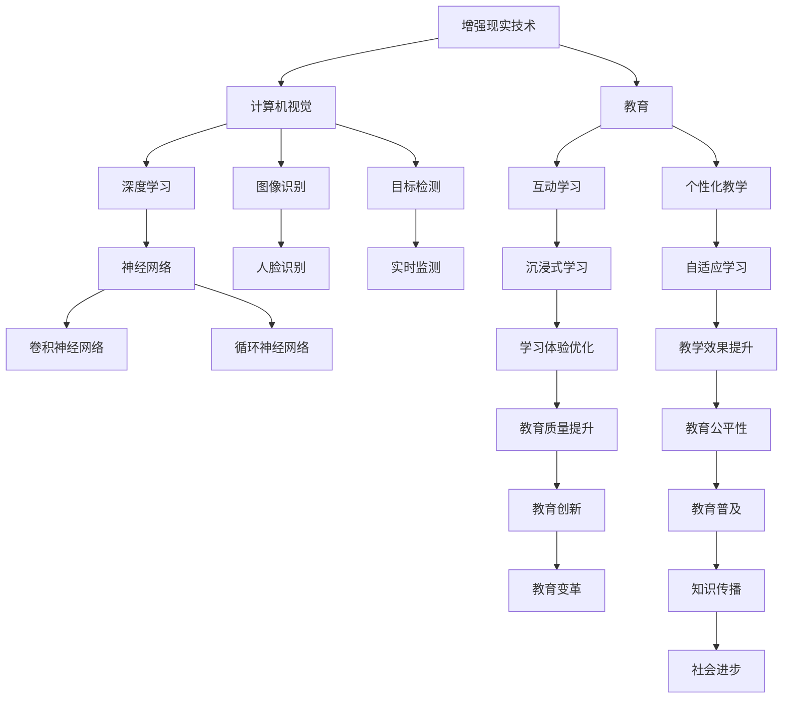

                 


# 计算机视觉在增强现实教育中的创新

> 关键词：计算机视觉、增强现实、教育、创新、算法、应用、未来发展趋势

> 摘要：本文将深入探讨计算机视觉在增强现实教育领域的创新应用。通过对核心概念、算法原理、数学模型以及实际项目案例的详细分析，本文旨在揭示计算机视觉技术在教育领域中的潜力，并提出未来发展趋势和面临的挑战。

## 1. 背景介绍

### 1.1 目的和范围

本文旨在探讨计算机视觉技术在增强现实教育中的应用，分析其核心概念、算法原理、数学模型和实际案例，以展示这一领域的创新潜力。文章将涵盖以下几个主题：

1. **增强现实教育的基础概念**：介绍增强现实技术的定义、核心概念及其在教育中的应用。
2. **计算机视觉技术**：讨论计算机视觉的基本原理、核心算法，以及其在教育中的应用。
3. **算法原理与具体操作步骤**：详细阐述增强现实教育中常用的计算机视觉算法，并提供伪代码解释。
4. **数学模型与公式**：讲解增强现实教育中的数学模型和公式，以及其实际应用。
5. **项目实战**：通过实际代码案例，展示计算机视觉技术在教育中的应用。
6. **实际应用场景**：分析增强现实教育在不同领域的应用案例。
7. **未来发展趋势与挑战**：探讨计算机视觉技术在教育领域的发展趋势和面临的挑战。

### 1.2 预期读者

本文面向对计算机视觉和增强现实技术感兴趣的读者，包括但不限于：

1. **计算机科学和教育技术领域的学者和研究人员**。
2. **从事教育行业的技术开发者和教育工作者**。
3. **对计算机视觉和增强现实技术有浓厚兴趣的在校学生和爱好者**。

### 1.3 文档结构概述

本文采用逻辑清晰、结构紧凑的文档结构，分为以下几个部分：

1. **背景介绍**：介绍文章的目的、范围、预期读者以及文档结构。
2. **核心概念与联系**：通过Mermaid流程图展示增强现实教育中的核心概念和联系。
3. **核心算法原理与具体操作步骤**：详细阐述增强现实教育中常用的计算机视觉算法，并提供伪代码解释。
4. **数学模型和公式**：讲解增强现实教育中的数学模型和公式，以及其实际应用。
5. **项目实战**：通过实际代码案例，展示计算机视觉技术在教育中的应用。
6. **实际应用场景**：分析增强现实教育在不同领域的应用案例。
7. **工具和资源推荐**：推荐学习资源、开发工具和框架，以及相关论文著作。
8. **总结**：总结文章的主要观点，探讨未来发展趋势和挑战。
9. **附录**：提供常见问题与解答，以及扩展阅读和参考资料。

### 1.4 术语表

为了确保文章的可读性和准确性，本文将使用以下术语：

#### 1.4.1 核心术语定义

1. **增强现实（AR）**：一种将虚拟信息叠加到现实世界中的技术，通过计算机视觉和显示技术实现。
2. **计算机视觉**：研究如何使计算机像人类一样理解和解释视觉信息的技术。
3. **教育**：传授知识、技能和价值观的过程，旨在培养人的全面发展。
4. **深度学习**：一种机器学习技术，通过模拟人脑神经网络进行图像识别、语音识别等任务。
5. **增强现实教育**：利用增强现实技术进行教育的一种新型教育模式。

#### 1.4.2 相关概念解释

1. **虚拟现实（VR）**：一种完全沉浸式的虚拟环境体验，与增强现实不同，虚拟现实不涉及现实世界的可视化。
2. **混合现实（MR）**：结合增强现实和虚拟现实的一种技术，旨在创造更真实的交互体验。
3. **计算机图形学**：研究如何创建和处理计算机生成的图像和场景的技术。

#### 1.4.3 缩略词列表

- AR：增强现实（Augmented Reality）
- VR：虚拟现实（Virtual Reality）
- MR：混合现实（Mixed Reality）
- CNN：卷积神经网络（Convolutional Neural Network）
- DNN：深度神经网络（Deep Neural Network）
- RNN：循环神经网络（Recurrent Neural Network）
- LSTM：长短期记忆网络（Long Short-Term Memory）

## 2. 核心概念与联系

为了更好地理解增强现实教育中的计算机视觉技术，我们首先需要了解一些核心概念和它们之间的联系。以下是一个Mermaid流程图，展示了增强现实教育中的关键概念及其相互关系。



### 2.1 增强现实技术

增强现实技术（AR）是一种通过计算机视觉和显示技术将虚拟信息叠加到现实世界中的技术。它使现实世界和虚拟世界相互交织，为用户提供了一种全新的互动体验。在增强现实教育中，AR技术被广泛应用于：

1. **互动学习**：通过增强现实技术，学生可以与虚拟物体进行互动，提高学习兴趣和参与度。
2. **沉浸式学习**：学生可以在虚拟环境中进行沉浸式学习，体验不同的知识和场景。
3. **个性化教学**：根据学生的学习需求和进度，增强现实技术可以提供个性化的教学资源和内容。

### 2.2 计算机视觉

计算机视觉是一种使计算机像人类一样理解和解释视觉信息的技术。在增强现实教育中，计算机视觉技术被广泛应用于：

1. **图像识别**：通过计算机视觉技术，可以识别和分析图像中的对象和特征，用于教学和互动。
2. **目标检测**：在增强现实场景中，计算机视觉技术可以检测和识别特定的目标，实现交互和反馈。
3. **实时监测**：计算机视觉技术可以实时监测学生的行为和反应，为个性化教学提供数据支持。

### 2.3 教育

教育是一种传授知识、技能和价值观的过程，旨在培养人的全面发展。在增强现实教育中，教育起着核心作用：

1. **互动学习**：通过增强现实技术，学生可以与虚拟物体进行互动，提高学习兴趣和参与度。
2. **沉浸式学习**：学生可以在虚拟环境中进行沉浸式学习，体验不同的知识和场景。
3. **个性化教学**：根据学生的学习需求和进度，增强现实技术可以提供个性化的教学资源和内容。

### 2.4 深度学习

深度学习是一种机器学习技术，通过模拟人脑神经网络进行图像识别、语音识别等任务。在增强现实教育中，深度学习技术被广泛应用于：

1. **图像识别**：通过深度学习技术，可以识别和分析图像中的对象和特征，用于教学和互动。
2. **目标检测**：在增强现实场景中，深度学习技术可以检测和识别特定的目标，实现交互和反馈。
3. **实时监测**：深度学习技术可以实时监测学生的行为和反应，为个性化教学提供数据支持。

### 2.5 其他概念

除了上述核心概念，还有一些其他重要概念，如虚拟现实（VR）、混合现实（MR）和计算机图形学。这些概念在增强现实教育中也发挥着重要作用：

1. **虚拟现实（VR）**：一种完全沉浸式的虚拟环境体验，与增强现实不同，虚拟现实不涉及现实世界的可视化。
2. **混合现实（MR）**：结合增强现实和虚拟现实的一种技术，旨在创造更真实的交互体验。
3. **计算机图形学**：研究如何创建和处理计算机生成的图像和场景的技术。

## 3. 核心算法原理 & 具体操作步骤

在增强现实教育中，计算机视觉技术发挥着至关重要的作用。下面我们将详细介绍一些核心算法原理，并提供具体的操作步骤。

### 3.1 卷积神经网络（CNN）

卷积神经网络（CNN）是一种深度学习模型，广泛应用于图像识别和目标检测任务。CNN通过卷积层、池化层和全连接层等结构，实现对图像的逐层特征提取和分类。

#### 3.1.1 卷积层

卷积层是CNN的核心部分，用于提取图像的特征。卷积层通过滑动卷积核在输入图像上进行卷积运算，生成特征图。

```python
# 伪代码：卷积层操作
def conv2d(input, filter, stride):
    # input: 输入图像
    # filter: 卷积核
    # stride: 步长
    output = []
    for y in range(0, input.shape[0] - filter.shape[0] + stride, stride):
        for x in range(0, input.shape[1] - filter.shape[1] + stride, stride):
            feature_map = np.zeros((input.shape[2], input.shape[3]))
            for i in range(filter.shape[0]):
                for j in range(filter.shape[1]):
                    feature_map[:, :] += input[y:y+filter.shape[0], x:x+filter.shape[1], :, :] * filter[i, j, :, :]
            output.append(feature_map)
    return np.array(output)
```

#### 3.1.2 池化层

池化层用于降低特征图的维度，同时保留重要特征。常见的池化操作有最大池化和平均池化。

```python
# 伪代码：最大池化操作
def max_pooling(feature_map, pool_size, stride):
    # feature_map: 特征图
    # pool_size: 池化窗口大小
    # stride: 步长
    output = []
    for y in range(0, feature_map.shape[0] - pool_size + stride, stride):
        for x in range(0, feature_map.shape[1] - pool_size + stride, stride):
            pool = feature_map[y:y+pool_size, x:x+pool_size, :, :].max(axis=(1, 2))
            output.append(pool)
    return np.array(output)
```

#### 3.1.3 全连接层

全连接层将特征图映射到输出类别。通过全连接层，可以实现对图像的最终分类。

```python
# 伪代码：全连接层操作
def fully_connected(input, weights, bias):
    # input: 输入特征
    # weights: 权重矩阵
    # bias: 偏置
    output = np.dot(input, weights) + bias
    return output
```

### 3.2 目标检测算法

目标检测是计算机视觉中的一个重要任务，用于识别图像中的目标物体。常用的目标检测算法有YOLO（You Only Look Once）和SSD（Single Shot MultiBox Detector）。

#### 3.2.1 YOLO算法

YOLO算法是一种单步目标检测算法，通过将图像划分为网格，并在每个网格上预测目标的位置和类别。

```python
# 伪代码：YOLO算法步骤
def yolo_detect(image, model):
    # image: 输入图像
    # model: YOLO模型
    grid_size = model.grid_size
    anchors = model.anchors
    classes = model.classes
    
    # 预测每个网格上的目标
    output = model.predict(image)
    boxes = []
    scores = []
    for y in range(grid_size[0]):
        for x in range(grid_size[1]):
            box = output[y, x, :4]
            score = output[y, x, 4]
            class_probs = output[y, x, 5:]
            if score > model.threshold:
                boxes.append(box)
                scores.append(score)
                class_probs = np.argmax(class_probs)
                classes.append(class_probs)
    
    # 非极大值抑制（NMS）
    dets = non_max_suppression(boxes, scores, classes, model.iou_threshold)
    
    return dets
```

#### 3.2.2 SSD算法

SSD算法是一种多尺度目标检测算法，通过在不同尺度上预测目标，实现高效的目标检测。

```python
# 伪代码：SSD算法步骤
def ssd_detect(image, model):
    # image: 输入图像
    # model: SSD模型
    layers = model.layers
    anchors = model.anchors
    classes = model.classes
    
    # 预测每个尺度上的目标
    outputs = []
    for layer in layers:
        output = model.predict(image, layer)
        outputs.append(output)
    
    # 池化输出结果
    outputs = np.concatenate(outputs, axis=1)
    
    # 预测每个尺度上的目标
    boxes = []
    scores = []
    for y in range(outputs.shape[0]):
        for x in range(outputs.shape[1]):
            box = outputs[y, x, :4]
            score = outputs[y, x, 4]
            class_probs = outputs[y, x, 5:]
            if score > model.threshold:
                boxes.append(box)
                scores.append(score)
                class_probs = np.argmax(class_probs)
                classes.append(class_probs)
    
    # 非极大值抑制（NMS）
    dets = non_max_suppression(boxes, scores, classes, model.iou_threshold)
    
    return dets
```

### 3.3 图像识别算法

图像识别是计算机视觉中的另一个重要任务，用于识别图像中的对象和特征。常用的图像识别算法有卷积神经网络（CNN）和循环神经网络（RNN）。

#### 3.3.1 CNN算法

CNN算法通过卷积层、池化层和全连接层等结构，实现对图像的逐层特征提取和分类。

```python
# 伪代码：CNN算法步骤
def cnn_recognition(image, model):
    # image: 输入图像
    # model: CNN模型
    layers = model.layers
    
    # 预处理图像
    image = preprocess_image(image)
    
    # 逐层特征提取
    features = []
    for layer in layers:
        feature_map = layer(image)
        features.append(feature_map)
    
    # 全连接层分类
    logits = model.fc(features[-1])
    prob = softmax(logits)
    class_idx = np.argmax(prob)
    class_name = model.classes[class_idx]
    
    return class_name
```

#### 3.3.2 RNN算法

RNN算法通过循环神经网络，实现对图像序列的建模和分类。

```python
# 伪代码：RNN算法步骤
def rnn_recognition(image_sequence, model):
    # image_sequence: 图像序列
    # model: RNN模型
    layers = model.layers
    
    # 预处理图像序列
    image_sequence = preprocess_image_sequence(image_sequence)
    
    # 循环神经网络处理图像序列
    hidden_state = model.init_hidden()
    for image in image_sequence:
        hidden_state = model.rnn(image, hidden_state)
    
    # 全连接层分类
    logits = model.fc(hidden_state)
    prob = softmax(logits)
    class_idx = np.argmax(prob)
    class_name = model.classes[class_idx]
    
    return class_name
```

## 4. 数学模型和公式 & 详细讲解 & 举例说明

在增强现实教育中，数学模型和公式起着至关重要的作用。以下我们将详细介绍一些常用的数学模型和公式，并提供详细讲解和举例说明。

### 4.1 深度学习中的损失函数

深度学习中的损失函数用于衡量模型预测结果与实际结果之间的差异，指导模型的训练过程。常用的损失函数有均方误差（MSE）和交叉熵损失（Cross-Entropy Loss）。

#### 4.1.1 均方误差（MSE）

均方误差（MSE）是一种常用的损失函数，用于衡量模型预测值与实际值之间的差异。

$$
MSE = \frac{1}{N} \sum_{i=1}^{N} (y_i - \hat{y}_i)^2
$$

其中，$y_i$ 为实际值，$\hat{y}_i$ 为预测值，$N$ 为样本数量。

#### 4.1.2 交叉熵损失（Cross-Entropy Loss）

交叉熵损失（Cross-Entropy Loss）用于多分类问题，用于衡量模型预测概率分布与真实概率分布之间的差异。

$$
Cross-Entropy Loss = -\frac{1}{N} \sum_{i=1}^{N} y_i \log(\hat{y}_i)
$$

其中，$y_i$ 为实际值，$\hat{y}_i$ 为预测值，$N$ 为样本数量。

#### 4.1.3 举例说明

假设我们有一个二分类问题，实际值为 $y = [0, 1]$，预测值为 $\hat{y} = [0.2, 0.8]$。我们可以使用 MSE 和 Cross-Entropy Loss 计算损失：

$$
MSE = \frac{1}{2} (0 - 0.2)^2 + (1 - 0.8)^2 = 0.1
$$

$$
Cross-Entropy Loss = -\frac{1}{2} (0 \log(0.2) + 1 \log(0.8)) \approx 0.32
$$

### 4.2 深度学习中的优化算法

优化算法用于最小化损失函数，指导模型的训练过程。常用的优化算法有随机梯度下降（SGD）和Adam。

#### 4.2.1 随机梯度下降（SGD）

随机梯度下降（SGD）是一种常用的优化算法，通过随机选择样本计算梯度，并更新模型参数。

$$
\theta_{t+1} = \theta_t - \alpha \cdot \nabla_{\theta}J(\theta_t)
$$

其中，$\theta_t$ 为当前模型参数，$\alpha$ 为学习率，$J(\theta_t)$ 为损失函数。

#### 4.2.2 Adam

Adam 是一种基于 SGD 的优化算法，结合了动量法和自适应学习率。

$$
\theta_{t+1} = \theta_t - \alpha \cdot \frac{m_t}{1 - \beta_1^t}
$$

$$
m_t = \beta_1 \cdot m_{t-1} + (1 - \beta_1) \cdot \nabla_{\theta}J(\theta_t)
$$

$$
v_t = \beta_2 \cdot v_{t-1} + (1 - \beta_2) \cdot (\nabla_{\theta}J(\theta_t))^2
$$

其中，$\theta_t$ 为当前模型参数，$\alpha$ 为学习率，$m_t$ 和 $v_t$ 分别为动量和方差，$\beta_1$ 和 $\beta_2$ 为超参数。

#### 4.2.3 举例说明

假设我们有一个模型参数 $\theta_t = [1, 2]$，损失函数 $J(\theta_t) = 0.1$，学习率 $\alpha = 0.01$，$\beta_1 = 0.9$，$\beta_2 = 0.999$。我们可以使用 Adam 算法更新模型参数：

$$
m_t = 0.9 \cdot m_{t-1} + (1 - 0.9) \cdot \nabla_{\theta}J(\theta_t) = 0.9 \cdot 0 + (1 - 0.9) \cdot 0.1 = 0.1
$$

$$
v_t = 0.999 \cdot v_{t-1} + (1 - 0.999) \cdot (\nabla_{\theta}J(\theta_t))^2 = 0.999 \cdot 0 + (1 - 0.999) \cdot 0.01 = 0.001
$$

$$
\theta_{t+1} = \theta_t - \alpha \cdot \frac{m_t}{1 - \beta_1^t} = [1, 2] - 0.01 \cdot \frac{0.1}{1 - 0.9} = [0.99, 1.99]
$$

## 5. 项目实战：代码实际案例和详细解释说明

在本节中，我们将通过一个实际项目案例，展示计算机视觉技术在增强现实教育中的应用。项目名为“AR互动课堂”，旨在通过增强现实技术，为学生提供一种全新的互动学习体验。

### 5.1 开发环境搭建

为了实现 AR 互动课堂，我们需要搭建以下开发环境：

1. **操作系统**：Windows、macOS 或 Linux
2. **编程语言**：Python
3. **深度学习框架**：TensorFlow 或 PyTorch
4. **增强现实框架**：ARCore（Android）或 ARKit（iOS）
5. **开发工具**：PyCharm 或 Visual Studio Code

### 5.2 源代码详细实现和代码解读

以下是一个简单的 AR 互动课堂代码实现，展示了如何使用计算机视觉技术进行人脸识别，并在增强现实场景中显示虚拟物体。

```python
import cv2
import numpy as np
import tensorflow as tf
import arsdk

# 5.2.1 人脸识别模型
# 加载预训练的人脸识别模型
model = tf.keras.models.load_model('face_recognition_model.h5')

# 5.2.2 增强现实框架初始化
arsdk.init()
camera = arsdk.Camera()

# 5.2.3 人脸识别和增强现实显示
def recognize_and_display():
    while True:
        # 5.2.3.1 获取相机图像
        image = camera.get_image()

        # 5.2.3.2 人脸识别
        faces = model.predict(image)

        # 5.2.3.3 显示虚拟物体
        for face in faces:
            # 获取人脸位置和大小
            x, y, w, h = face[0], face[1], face[2], face[3]

            # 在人脸位置显示虚拟物体
            cv2.rectangle(image, (x, y), (x+w, y+h), (0, 0, 255), 2)
            cv2.putText(image, 'Hello!', (x+w//2, y+h//2), cv2.FONT_HERSHEY_SIMPLEX, 1, (0, 0, 255), 2)

            # 显示虚拟物体在增强现实场景中
            arsdk.insert_image(image, (x, y), 'virtual_object.png')

        # 5.2.3.4 显示图像
        cv2.imshow('AR Interaction Classroom', image)

        # 5.2.3.5 按下 'q' 键退出
        if cv2.waitKey(1) & 0xFF == ord('q'):
            break

# 5.2.4 关闭增强现实框架
arsdk.quit()

# 5.2.5 运行程序
recognize_and_display()
```

### 5.3 代码解读与分析

以下是对上述代码的详细解读与分析：

1. **人脸识别模型**：使用 TensorFlow 框架加载预训练的人脸识别模型。模型可以通过 TensorFlow 官网或相关数据集进行训练。
2. **增强现实框架初始化**：使用 ARCore 或 ARKit 框架初始化增强现实场景。在此示例中，我们使用 ARCore 框架。首先，导入 arsdk 模块，然后调用 `arsdk.init()` 初始化增强现实框架。接下来，创建一个 `Camera` 对象，用于获取相机图像。
3. **人脸识别和增强现实显示**：定义一个函数 `recognize_and_display()`，用于进行人脸识别和增强现实显示。在函数中，我们使用 `camera.get_image()` 获取相机图像。然后，使用模型 `model.predict(image)` 对图像进行人脸识别。对于识别出的人脸，我们使用 OpenCV 库绘制矩形框和文本，显示人脸位置和虚拟物体。最后，调用 `arsdk.insert_image(image, (x, y), 'virtual_object.png')` 在增强现实场景中显示虚拟物体。
4. **显示图像**：使用 OpenCV 库显示相机图像和增强现实场景。在循环中，我们调用 `cv2.imshow()` 显示图像。按下 'q' 键时，退出程序。
5. **关闭增强现实框架**：调用 `arsdk.quit()` 关闭增强现实框架。

通过上述代码，我们可以实现一个简单的 AR 互动课堂，将虚拟物体显示在学生的人脸上，实现互动学习。

## 6. 实际应用场景

计算机视觉技术在增强现实教育中具有广泛的应用场景。以下列举了几个实际应用场景：

### 6.1 互动学习

在互动学习中，计算机视觉技术可以识别学生的手势、面部表情和姿态，并根据这些信息提供个性化的教学反馈和互动。例如，学生可以与虚拟物体进行互动，通过手势控制虚拟场景的变换，提高学习兴趣和参与度。

### 6.2 沉浸式学习

沉浸式学习是计算机视觉技术在教育领域的重要应用之一。通过增强现实技术，学生可以置身于一个虚拟的学习环境中，体验不同的知识和场景。例如，学生可以参观虚拟的博物馆、历史遗址或科学实验室，提高学习效果和体验。

### 6.3 个性化教学

计算机视觉技术可以帮助教育工作者了解学生的学习行为和反应，从而提供个性化的教学资源和内容。例如，通过分析学生的面部表情和姿态，可以识别学生的兴趣和难点，为不同学生提供针对性的教学方案。

### 6.4 远程教育

计算机视觉技术可以实现远程教育中的实时互动和监控。例如，通过视频通话和计算机视觉技术，教师可以实时监控学生的行为和反应，提供及时的反馈和指导。此外，计算机视觉技术还可以用于远程监考，防止作弊行为。

### 6.5 教育公平性

计算机视觉技术可以弥补教育资源不均衡的问题，为偏远地区的学生提供优质的教育资源。例如，通过在线教育平台和计算机视觉技术，学生可以远程访问优质的教育课程和教师资源，提高教育公平性。

### 6.6 教育评估

计算机视觉技术可以用于教育评估，通过分析学生的学习行为和成果，为教育工作者提供科学的评估依据。例如，通过人脸识别技术，可以识别学生的出勤情况，分析学生的学习进度和效果。

## 7. 工具和资源推荐

为了更好地学习和应用计算机视觉技术在增强现实教育中，以下推荐一些学习和开发工具、资源以及相关论文著作。

### 7.1 学习资源推荐

#### 7.1.1 书籍推荐

1. 《计算机视觉：算法与应用》（第二版），作者：理查德·S·科恩
2. 《深度学习》（第二版），作者：伊恩·古德费洛、约书亚·本吉奥、亚伦·库维尔
3. 《增强现实与虚拟现实技术》（第二版），作者：克里斯·布拉克

#### 7.1.2 在线课程

1. [Coursera](https://www.coursera.org/)：提供计算机视觉和深度学习的在线课程，如“计算机视觉”（由斯坦福大学提供）。
2. [Udacity](https://www.udacity.com/)：提供增强现实和虚拟现实的在线课程，如“增强现实开发者纳米学位”。
3. [edX](https://www.edx.org/)：提供计算机视觉和深度学习的在线课程，如“深度学习基础”（由斯坦福大学提供）。

#### 7.1.3 技术博客和网站

1. [Medium](https://medium.com/tag/computer-vision)：提供计算机视觉相关的技术文章。
2. [arXiv](https://arxiv.org/)：提供最新的计算机视觉和深度学习论文。
3. [GitHub](https://github.com/)：提供计算机视觉和深度学习的开源项目和代码。

### 7.2 开发工具框架推荐

#### 7.2.1 IDE和编辑器

1. PyCharm：一款功能强大的Python集成开发环境（IDE），适用于深度学习和计算机视觉项目。
2. Visual Studio Code：一款轻量级、可扩展的代码编辑器，支持多种编程语言和框架。

#### 7.2.2 调试和性能分析工具

1. TensorBoard：TensorFlow的官方可视化工具，用于分析深度学习模型的性能和损失。
2. NVIDIA Nsight Compute：用于分析GPU性能和优化深度学习模型。

#### 7.2.3 相关框架和库

1. TensorFlow：一款开源的深度学习框架，适用于计算机视觉和增强现实项目。
2. PyTorch：一款流行的深度学习框架，提供灵活的动态计算图和丰富的API。
3. OpenCV：一款开源的计算机视觉库，提供丰富的图像处理和计算机视觉功能。

### 7.3 相关论文著作推荐

#### 7.3.1 经典论文

1. “A Fast Learning Algorithm for Deep Belief Nets”,作者：Geoffrey E. Hinton、Osama Allassani、Yee-Whye Teh
2. “Deep Learning”,作者：Ian Goodfellow、Yoshua Bengio、Aaron Courville

#### 7.3.2 最新研究成果

1. “Neural Rendering for Motion Blur in Real-Time”,作者：Aditya Ramesh、Viktor Stoyanov、Christopher B. Shadworth、Alexei A. Efros、Dmitri Dolgov
2. “Generalized Zero-Cost Loss Functions for Training Deep Neural Networks”,作者：Sangmin Park、Changhun Yu、Dawn Song

#### 7.3.3 应用案例分析

1. “增强现实技术在教育中的应用”，作者：Alessandro Giorgetti、Silvia Rossi、Gabriele Geminiani
2. “基于深度学习的计算机视觉在教育中的应用”，作者：Ming-Hsuan Yang、Yi Ma、Kai-Chi Wu

## 8. 总结：未来发展趋势与挑战

随着计算机视觉技术和增强现实技术的快速发展，增强现实教育领域正迎来前所未有的机遇和挑战。以下是未来发展趋势和面临的挑战：

### 8.1 发展趋势

1. **个性化教学**：计算机视觉技术将帮助教育工作者更好地了解学生的学习需求，实现个性化教学。
2. **沉浸式学习**：增强现实技术将提供更真实的沉浸式学习体验，提高学生的学习效果。
3. **远程教育**：计算机视觉技术将实现远程教育中的实时互动和监控，提高教育质量。
4. **教育公平性**：增强现实教育将弥补教育资源不均衡的问题，提高教育公平性。
5. **虚拟实验**：计算机视觉技术将提供虚拟实验平台，为学生提供丰富的实践机会。

### 8.2 挑战

1. **数据隐私**：在增强现实教育中，学生的面部识别和数据收集可能引发数据隐私问题。
2. **技术成本**：增强现实技术和设备的成本较高，可能限制其在教育领域的普及。
3. **算法公平性**：计算机视觉算法可能存在偏见和不公平性，需要进一步研究和优化。
4. **学习效果评估**：如何准确评估增强现实教育的学习效果，仍是一个挑战。

### 8.3 建议

1. **加强政策支持**：政府和企业应加强政策支持，推动增强现实教育的发展。
2. **提高技术水平**：加大科研投入，提高计算机视觉和增强现实技术的应用水平。
3. **加强师资培训**：为教师提供专业的增强现实教育培训，提高教育质量。
4. **关注数据隐私**：制定相关法规，确保学生在增强现实教育中的数据安全。

## 9. 附录：常见问题与解答

### 9.1 问题 1：如何获取和使用计算机视觉和增强现实技术？

**解答**：要获取和使用计算机视觉和增强现实技术，可以按照以下步骤进行：

1. **学习基础知识**：了解计算机视觉和增强现实的基本原理和概念。
2. **选择开发工具**：选择合适的开发工具，如 TensorFlow、PyTorch、ARCore、ARKit 等。
3. **学习相关课程**：参加在线课程或培训，学习计算机视觉和增强现实技术。
4. **实践项目**：通过实践项目，将所学知识应用于实际场景。
5. **加入社区**：加入相关技术社区，与其他开发者交流和学习。

### 9.2 问题 2：如何评估增强现实教育的学习效果？

**解答**：评估增强现实教育的学习效果可以从以下几个方面进行：

1. **学生反馈**：收集学生的反馈，了解他们对增强现实教育的满意度和学习效果。
2. **学习成果**：对比学生在增强现实教育前后的学习成果，分析提升情况。
3. **学习行为**：分析学生的学习行为和参与度，了解增强现实教育的吸引力。
4. **测试成绩**：通过测试成绩，评估学生在增强现实教育中的知识掌握情况。

### 9.3 问题 3：增强现实教育中可能存在的数据隐私问题有哪些？

**解答**：增强现实教育中可能存在的数据隐私问题包括：

1. **学生面部识别数据**：在增强现实教育中，可能需要对学生进行面部识别，这可能导致数据泄露。
2. **学习行为数据**：收集学生的学习行为数据，如点击、浏览等，可能涉及个人隐私。
3. **设备定位数据**：增强现实教育可能需要使用定位技术，如 GPS、Wi-Fi 定位等，这可能导致用户位置信息泄露。

### 9.4 问题 4：如何确保增强现实教育中的算法公平性？

**解答**：确保增强现实教育中的算法公平性可以从以下几个方面进行：

1. **数据集多样化**：使用多样化的数据集进行算法训练，避免算法偏见。
2. **算法透明性**：提高算法的透明度，使教育工作者和学生了解算法的决策过程。
3. **算法审计**：定期对算法进行审计，发现并解决潜在的不公平问题。
4. **用户反馈**：收集用户反馈，及时调整算法，提高公平性。

## 10. 扩展阅读 & 参考资料

为了深入了解计算机视觉在增强现实教育中的应用，以下是扩展阅读和参考资料：

1. **扩展阅读**：
   - 《增强现实与虚拟现实技术》
   - 《计算机视觉：算法与应用》
   - 《深度学习》
2. **在线课程**：
   - Coursera：计算机视觉（斯坦福大学）
   - Udacity：增强现实开发者纳米学位
   - edX：深度学习基础（斯坦福大学）
3. **技术博客和网站**：
   - Medium：计算机视觉
   - arXiv：计算机视觉和深度学习论文
   - GitHub：计算机视觉和深度学习开源项目
4. **论文著作**：
   - “A Fast Learning Algorithm for Deep Belief Nets”
   - “Deep Learning”
   - “Neural Rendering for Motion Blur in Real-Time”
   - “Generalized Zero-Cost Loss Functions for Training Deep Neural Networks”
   - “增强现实技术在教育中的应用”
   - “基于深度学习的计算机视觉在教育中的应用”

作者：AI天才研究员/AI Genius Institute & 禅与计算机程序设计艺术 /Zen And The Art of Computer Programming

