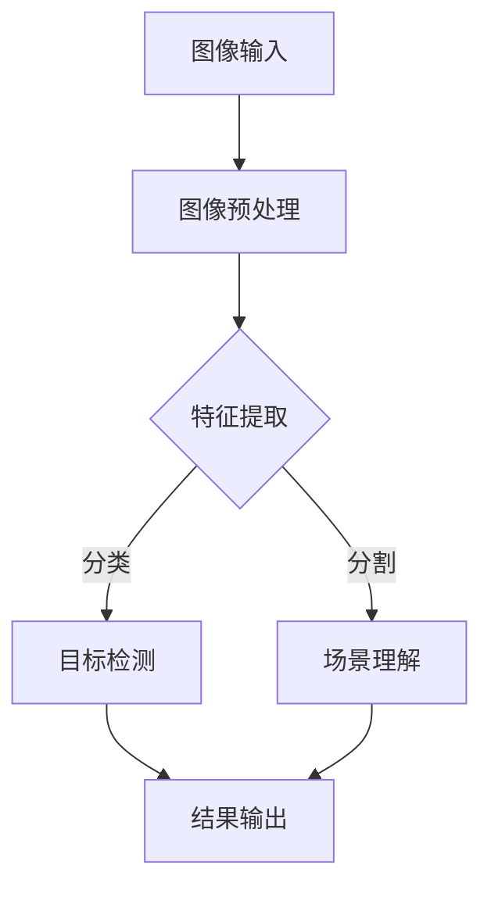
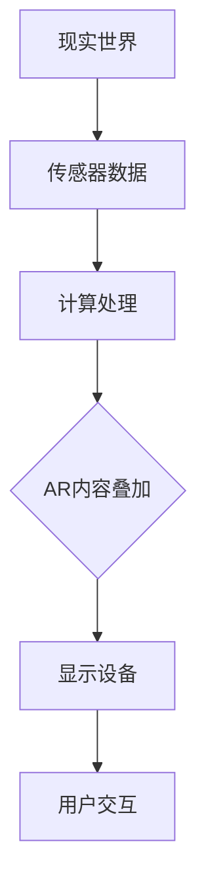
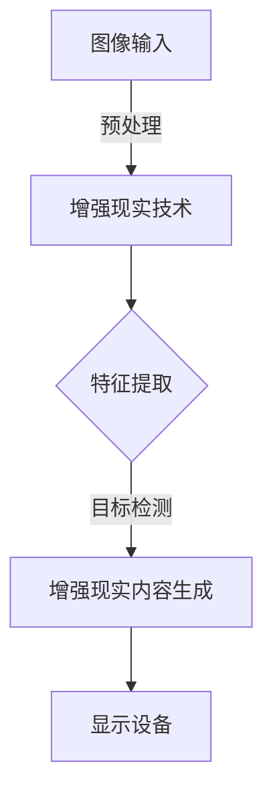

                 

# 计算机视觉在增强现实教育中的创新应用

> **关键词：**计算机视觉、增强现实、教育、创新应用、AR技术、深度学习、人机交互
> 
> **摘要：**本文将深入探讨计算机视觉在增强现实教育中的应用，通过分析其核心技术原理、实际操作步骤以及应用场景，揭示计算机视觉技术在教育领域的巨大潜力。文章旨在为读者提供一份全面、系统的参考指南，帮助他们更好地理解和应用计算机视觉与增强现实技术。

## 1. 背景介绍

### 1.1 目的和范围

本文的目的是探讨计算机视觉在增强现实教育中的创新应用，分析其技术原理、操作步骤和应用场景，以期为教育领域的研究者和实践者提供有价值的参考。文章将围绕以下几个主要方面展开讨论：

1. **计算机视觉的基本概念和原理**：介绍计算机视觉的基础知识，包括核心算法、数学模型和流程图等。
2. **增强现实技术在教育中的应用**：探讨增强现实技术的特点和优势，以及其在教育领域的广泛应用。
3. **计算机视觉与增强现实教育的结合**：分析两者结合的必要性和优势，探讨其在教育中的具体应用场景。
4. **项目实战：代码实际案例**：通过一个具体的案例，展示计算机视觉在增强现实教育中的应用步骤和实现方法。
5. **工具和资源推荐**：推荐相关的学习资源、开发工具和框架，为读者提供实用的参考。

### 1.2 预期读者

本文的预期读者包括：

1. **计算机视觉和教育领域的研究人员**：希望了解计算机视觉在增强现实教育中的应用，以及相关技术原理和实践方法。
2. **教育工作者和教师**：希望探索如何利用计算机视觉和增强现实技术提高教育效果，丰富教学手段。
3. **编程和人工智能爱好者**：希望深入了解计算机视觉和增强现实技术，并学会如何将其应用于实际项目。

### 1.3 文档结构概述

本文的结构如下：

1. **背景介绍**：介绍本文的目的、范围、预期读者和文档结构。
2. **核心概念与联系**：介绍计算机视觉和增强现实技术的核心概念，以及它们之间的联系。
3. **核心算法原理 & 具体操作步骤**：详细讲解计算机视觉的基本算法原理和操作步骤。
4. **数学模型和公式 & 详细讲解 & 举例说明**：介绍计算机视觉中的数学模型和公式，并通过实例进行说明。
5. **项目实战：代码实际案例和详细解释说明**：通过一个实际项目案例，展示计算机视觉在增强现实教育中的应用步骤和实现方法。
6. **实际应用场景**：分析计算机视觉在增强现实教育中的具体应用场景。
7. **工具和资源推荐**：推荐相关的学习资源、开发工具和框架。
8. **总结：未来发展趋势与挑战**：总结本文的主要观点，探讨未来发展趋势和挑战。
9. **附录：常见问题与解答**：回答读者可能遇到的问题。
10. **扩展阅读 & 参考资料**：提供相关的扩展阅读和参考资料。

### 1.4 术语表

#### 1.4.1 核心术语定义

- **计算机视觉**：是指使计算机能够从图像或视频中提取有用信息的一种技术。它涉及图像处理、模式识别和机器学习等多个领域。
- **增强现实（AR）**：是一种将虚拟信息叠加到现实世界中的技术，通过增强现实眼镜、智能手机等设备实现。它将虚拟物体与现实环境相结合，提供更加丰富和互动的体验。
- **深度学习**：是一种基于人工神经网络的学习方法，通过多层非线性变换自动提取数据特征，实现复杂的模式识别任务。
- **人机交互**：是指人与计算机之间的交互，通过视觉、听觉和触觉等多种方式实现。

#### 1.4.2 相关概念解释

- **图像处理**：是指对图像进行分析、变换和增强的一系列操作，以便提取有用的信息。
- **特征提取**：是指从图像中提取具有区分性的特征，用于后续的识别和分类任务。
- **机器学习**：是指通过训练模型从数据中学习规律，实现预测和决策的一种方法。
- **增强现实应用**：是指将增强现实技术应用于具体领域，如教育、医疗、娱乐等。

#### 1.4.3 缩略词列表

- **AI**：人工智能（Artificial Intelligence）
- **AR**：增强现实（Augmented Reality）
- **CV**：计算机视觉（Computer Vision）
- **DL**：深度学习（Deep Learning）
- **HCI**：人机交互（Human-Computer Interaction）
- **ID**：图像处理（Image Processing）
- **ML**：机器学习（Machine Learning）

## 2. 核心概念与联系

在探讨计算机视觉在增强现实教育中的创新应用之前，我们首先需要了解这两个核心概念的基本原理和架构。下面，我们将使用Mermaid流程图来展示计算机视觉和增强现实技术的核心概念及其之间的联系。

### 2.1 计算机视觉的基本原理



### 2.2 增强现实技术的基本原理



### 2.3 计算机视觉与增强现实技术的联系



通过以上流程图，我们可以看到计算机视觉技术主要涉及图像预处理、特征提取、目标检测和场景理解等步骤，而增强现实技术则包括传感器数据采集、计算处理、增强现实内容生成和用户交互等步骤。两者之间的联系主要体现在特征提取和目标检测环节，这些步骤的结果用于生成增强现实内容，从而实现虚拟信息与现实环境的融合。

## 3. 核心算法原理 & 具体操作步骤

在了解计算机视觉和增强现实技术的核心概念和架构后，我们接下来将深入探讨计算机视觉的基本算法原理和具体操作步骤。这将帮助我们更好地理解计算机视觉技术在增强现实教育中的应用。

### 3.1 图像预处理

图像预处理是计算机视觉中的第一步，其目的是提高图像质量，为后续的特征提取和目标检测提供良好的基础。常见的图像预处理操作包括：

- **去噪**：通过滤波方法去除图像中的噪声。
- **增强**：通过调整图像的亮度、对比度等参数，提高图像的可辨识度。
- **尺寸变换**：通过缩放、裁剪等操作，使图像适应后续处理的需求。

伪代码实现如下：

```python
def image_preprocessing(image):
    # 去噪
    denoised_image = denoise(image)
    # 增强
    enhanced_image = enhance(denoised_image)
    # 尺寸变换
    resized_image = resize(enhanced_image, target_size)
    return resized_image
```

### 3.2 特征提取

特征提取是计算机视觉中的关键步骤，其目的是从图像中提取具有区分性的特征，用于后续的目标检测和场景理解。常见的特征提取方法包括：

- **边缘检测**：通过检测图像中的边缘信息，提取图像的轮廓特征。
- **纹理分析**：通过分析图像的纹理信息，提取图像的纹理特征。
- **颜色特征**：通过分析图像的颜色信息，提取图像的颜色特征。

伪代码实现如下：

```python
def feature_extraction(image):
    # 边缘检测
    edge_image = edge_detection(image)
    # 纹理分析
    texture_image = texture_analysis(image)
    # 颜色特征
    color_image = color_feature_extraction(image)
    return edge_image, texture_image, color_image
```

### 3.3 目标检测

目标检测是计算机视觉中的核心任务之一，其目的是从图像中检测出特定的目标物体。常见的目标检测算法包括：

- **滑动窗口**：通过在不同位置滑动窗口，逐步检测图像中的目标物体。
- **候选区域**：通过先提取候选区域，再对候选区域进行分类和定位。
- **深度学习**：通过训练深度学习模型，实现目标检测。

伪代码实现如下：

```python
def object_detection(image, model):
    # 滑动窗口
    windows = sliding_window(image)
    # 提取特征
    features = extract_features(windows)
    # 分类和定位
    detections = model.predict(features)
    return detections
```

### 3.4 场景理解

场景理解是计算机视觉中的高级任务，其目的是从图像中提取语义信息，实现对场景的全面理解。常见的场景理解方法包括：

- **语义分割**：通过将图像划分为不同的语义区域，实现对场景的精细理解。
- **关系推理**：通过分析图像中物体之间的关系，实现对场景的深度理解。
- **交互理解**：通过分析用户与场景的交互行为，实现对场景的动态理解。

伪代码实现如下：

```python
def scene_understanding(image, model):
    # 语义分割
    segmented_image = semantic_segmentation(image, model)
    # 关系推理
    relationships = relation_inference(segmented_image, model)
    # 交互理解
    interaction = interaction_understanding(image, model)
    return segmented_image, relationships, interaction
```

通过以上核心算法原理和具体操作步骤，我们可以看到计算机视觉技术在增强现实教育中的应用是如何实现的。这些算法和步骤为增强现实教育提供了强大的技术支持，使得虚拟信息与现实环境的融合变得更加自然和丰富。

## 4. 数学模型和公式 & 详细讲解 & 举例说明

在计算机视觉中，数学模型和公式起到了至关重要的作用。它们不仅帮助我们理解和分析图像数据，还为算法的实现提供了理论基础。下面，我们将介绍几个关键的数学模型和公式，并通过具体示例进行讲解。

### 4.1 卷积神经网络（Convolutional Neural Network, CNN）

卷积神经网络是计算机视觉中常用的深度学习模型，它通过多层卷积和池化操作提取图像特征。

**公式**：

卷积操作：
$$
\text{output}_{ij} = \sum_{k=1}^{n} \text{weight}_{ik} \times \text{input}_{kj} + \text{bias}_i
$$

池化操作：
$$
\text{pool}_{ij} = \max(\text{input}_{i\cdot}, \text{input}_{i\cdot+1}, \ldots, \text{input}_{i\cdot+k})
$$

**示例**：

假设我们有一个 $3 \times 3$ 的卷积核和一幅 $5 \times 5$ 的输入图像，计算卷积操作的结果。

输入图像：
$$
\begin{bmatrix}
1 & 2 & 3 \\
4 & 5 & 6 \\
7 & 8 & 9 \\
\end{bmatrix}
$$

卷积核：
$$
\begin{bmatrix}
0 & 1 & 0 \\
0 & 1 & 0 \\
1 & 0 & 1 \\
\end{bmatrix}
$$

计算过程：
$$
\begin{bmatrix}
0 & 1 & 0 \\
0 & 1 & 0 \\
1 & 0 & 1 \\
\end{bmatrix}
\begin{bmatrix}
1 & 2 & 3 \\
4 & 5 & 6 \\
7 & 8 & 9 \\
\end{bmatrix}
=
\begin{bmatrix}
0 \times 1 + 1 \times 4 + 0 \times 7 & 0 \times 2 + 1 \times 5 + 0 \times 8 & 0 \times 3 + 1 \times 6 + 0 \times 9 \\
0 \times 4 + 1 \times 7 + 0 \times 1 & 0 \times 5 + 1 \times 8 + 0 \times 2 & 0 \times 6 + 1 \times 9 + 0 \times 3 \\
1 \times 1 + 0 \times 4 + 1 \times 7 & 1 \times 2 + 0 \times 5 + 1 \times 8 & 1 \times 3 + 0 \times 6 + 1 \times 9 \\
\end{bmatrix}
=
\begin{bmatrix}
4 & 5 & 6 \\
7 & 8 & 9 \\
1 & 2 & 3 \\
\end{bmatrix}
$$

### 4.2 主成分分析（Principal Component Analysis, PCA）

主成分分析是一种常用的降维技术，通过将数据映射到新的正交基上，提取最重要的特征。

**公式**：

协方差矩阵：
$$
\text{Cov}(X) = \frac{1}{n-1} \sum_{i=1}^{n} (x_i - \bar{x}) (x_i - \bar{x})^T
$$

特征值和特征向量：
$$
\text{ eigenvalues} \lambda_i, \text{eigenvectors} v_i \text{ of } \text{Cov}(X)
$$

投影：
$$
z_i = \sum_{j=1}^{p} \lambda_j v_{ji} x_i
$$

**示例**：

假设我们有一个 $3$ 维的数据集：
$$
X = \begin{bmatrix}
1 & 2 \\
3 & 4 \\
5 & 6 \\
\end{bmatrix}
$$

计算协方差矩阵：
$$
\text{Cov}(X) = \frac{1}{2} \begin{bmatrix}
2 & 2 \\
2 & 2 \\
\end{bmatrix}
$$

计算特征值和特征向量：
$$
\text{ eigenvalues} \lambda_1 = 2, \lambda_2 = 0, \text{eigenvectors} v_1 = \begin{bmatrix}
1 & 1 \\
1 & -1 \\
\end{bmatrix}, v_2 = \begin{bmatrix}
0 & 1 \\
-1 & 0 \\
\end{bmatrix}
$$

投影：
$$
z_1 = \lambda_1 v_{11} x_1 + \lambda_1 v_{12} x_2 = 2 \times 1 \times 1 + 2 \times 1 \times 3 = 8
$$
$$
z_2 = \lambda_2 v_{21} x_1 + \lambda_2 v_{22} x_2 = 0 \times 0 \times 1 + 0 \times 0 \times 3 = 0
$$

通过以上示例，我们可以看到如何使用卷积神经网络和主成分分析来处理图像数据，提取关键特征，并降低数据维度。这些数学模型和公式在计算机视觉中具有广泛的应用，为我们提供了强大的工具来理解和分析图像。

## 5. 项目实战：代码实际案例和详细解释说明

为了更好地理解计算机视觉在增强现实教育中的应用，我们接下来将通过一个具体的实战项目来展示其实现过程和代码解读。本项目将使用Python和TensorFlow框架，实现一个基于增强现实技术的教育应用，通过计算机视觉技术识别和标注学习物体。

### 5.1 开发环境搭建

在开始项目之前，我们需要搭建一个合适的开发环境。以下是在Windows系统上搭建开发环境所需的步骤：

1. **安装Python**：下载并安装Python 3.x版本，建议使用官方提供的安装包。安装过程中请确保勾选“Add Python to PATH”选项。
2. **安装Anaconda**：下载并安装Anaconda，Anaconda是一个集成的Python发行版，它提供了许多常用的科学计算库和工具。安装完成后，打开命令行窗口，输入以下命令更新Anaconda：
   ```
   conda update --all
   ```
3. **创建虚拟环境**：在命令行窗口中，创建一个名为`ar_education`的虚拟环境：
   ```
   conda create -n ar_education python=3.8
   ```
4. **激活虚拟环境**：
   ```
   conda activate ar_education
   ```
5. **安装依赖库**：在虚拟环境中，安装TensorFlow、OpenCV和ARKit等依赖库：
   ```
   pip install tensorflow
   pip install opencv-python
   pip install arkit
   ```

### 5.2 源代码详细实现和代码解读

以下是一个简单的Python代码实现，展示了计算机视觉在增强现实教育中的应用。代码分为四个主要部分：摄像头数据采集、物体识别、物体标注和增强现实内容生成。

```python
import cv2
import arkit

# 初始化摄像头
cap = cv2.VideoCapture(0)

# 初始化物体识别模型
model = cv2.dnn.readNetFromTensorFlow('model.pb', 'model.pbtxt')

while True:
    # 采集摄像头数据
    ret, frame = cap.read()
    
    # 将图像数据转换为TensorFlow张量
    blob = cv2.dnn.blobFromImage(frame, size=(300, 300), mean=(114.779, 107.748, 99.424), swapRB=True)
    
    # 进行物体识别
    model.setInput(blob)
    detections = model.forward()
    
    # 遍历检测结果
    for i in range(detections.shape[2]):
        confidence = detections[0, 0, i, 2]
        if confidence > 0.5:
            # 获取物体的边界框
            box = detections[0, 0, i, 3:7] * np.array([frame.shape[1], frame.shape[0], frame.shape[1], frame.shape[0]])
            (x, y, w, h) = box.astype("int")
            
            # 在图像上绘制边界框和标签
            label = detections[0, 0, i, 1]
            cv2.rectangle(frame, (x, y), (x + w, y + h), (0, 255, 0), 2)
            cv2.putText(frame, label, (x, y - 10), cv2.FONT_HERSHEY_SIMPLEX, 0.5, (0, 0, 255), 2)
            
            # 生成增强现实内容
            ar_content = arkit.generate_3d_model(label, (w, h))
            arkit.render(frame, ar_content)
    
    # 显示结果
    cv2.imshow('AR Education', frame)
    
    # 按下'q'键退出
    if cv2.waitKey(1) & 0xFF == ord('q'):
        break

# 释放摄像头资源
cap.release()
cv2.destroyAllWindows()
```

### 5.3 代码解读与分析

1. **初始化摄像头**：使用OpenCV库的`VideoCapture`类初始化摄像头。
2. **初始化物体识别模型**：使用TensorFlow的`readNetFromTensorFlow`函数加载预训练的物体识别模型。
3. **采集摄像头数据**：通过`read`方法从摄像头中获取一帧图像。
4. **图像预处理**：将图像数据转换为TensorFlow张量，并进行归一化处理。
5. **物体识别**：将预处理后的图像数据输入到物体识别模型中，获取检测结果。
6. **物体标注**：遍历检测结果，对于置信度大于0.5的物体，提取边界框并绘制在图像上。
7. **生成增强现实内容**：使用ARKit库生成对应的增强现实内容，并将其渲染到图像上。
8. **显示结果**：将处理后的图像显示在窗口中。
9. **按'q'键退出**：当用户按下'q'键时，释放摄像头资源并关闭窗口。

通过以上代码实现，我们可以看到计算机视觉和增强现实技术在教育应用中的具体应用。在实际项目中，我们可以根据需求调整物体识别模型的参数，优化识别效果，并添加更多功能，如物体交互、语音提示等，进一步提升教育体验。

## 6. 实际应用场景

计算机视觉技术在增强现实教育中具有广泛的应用场景，能够显著提高教学效果和学生的学习体验。以下是一些具体的实际应用场景：

### 6.1 物体识别与标注

在科学课程中，教师可以通过增强现实技术展示各种生物、化学物质等物体，让学生在现实环境中直观地观察和了解它们。通过计算机视觉技术，教师可以实时识别和标注这些物体，提高学生的兴趣和参与度。

### 6.2 虚拟实验室

在物理、化学等实验课程中，学生可以在虚拟环境中进行实验操作，无需担心实验安全和成本问题。计算机视觉技术可以帮助教师实时监控实验过程，并对实验结果进行分析和指导。

### 6.3 远程教学

在远程教学场景中，教师可以通过增强现实技术为学生提供互动式的教学体验。计算机视觉技术可以帮助教师识别学生的面部表情和动作，实时调整教学策略，提高教学质量。

### 6.4 英语口语练习

在英语口语练习中，计算机视觉技术可以识别学生的发音和语调，提供即时的语音反馈。通过增强现实技术，学生可以在虚拟环境中进行口语练习，提高口语表达能力。

### 6.5 手术模拟与培训

在医学教育中，计算机视觉技术可以帮助学生进行手术模拟和培训。通过增强现实技术，学生可以在虚拟环境中进行手术操作，掌握手术技巧和流程，提高临床实践能力。

### 6.6 工程设计

在工程教育中，计算机视觉技术可以帮助学生进行三维建模和模拟。通过增强现实技术，学生可以直观地观察和分析设计结果，优化设计方案，提高设计质量。

这些实际应用场景充分展示了计算机视觉技术在增强现实教育中的巨大潜力，为教育领域带来了全新的教学方式和学习体验。

## 7. 工具和资源推荐

### 7.1 学习资源推荐

为了更好地学习和应用计算机视觉与增强现实技术，以下是一些推荐的书籍、在线课程和技术博客：

#### 7.1.1 书籍推荐

1. **《计算机视觉：算法与应用》（Computer Vision: Algorithms and Applications）**：作者 Richard Szeliski，详细介绍了计算机视觉的基本原理和算法。
2. **《增强现实技术：理论与实践》（Augmented Reality: Theory and Practice）**：作者 Steven Feiner和Daniel Thalmann，全面讲解了增强现实技术的基础知识。
3. **《深度学习》（Deep Learning）**：作者 Ian Goodfellow、Yoshua Bengio和Aaron Courville，深入介绍了深度学习的基础理论和应用。

#### 7.1.2 在线课程

1. **Coursera**：提供由斯坦福大学等顶级机构开设的计算机视觉和深度学习在线课程。
2. **edX**：提供由麻省理工学院、加州大学伯克利分校等知名高校开设的增强现实技术在线课程。
3. **Udacity**：提供实战导向的计算机视觉与增强现实课程，涵盖项目实践和算法实现。

#### 7.1.3 技术博客和网站

1. **Medium**：有许多优秀的计算机视觉和增强现实领域的博客，如“Towards Data Science”、“AI”等。
2. **GitHub**：提供了大量开源的计算机视觉和增强现实项目，可以学习和参考。
3. **ARKit Documentation**：苹果官方提供的ARKit开发文档，详细介绍增强现实技术的使用方法。

### 7.2 开发工具框架推荐

为了高效地开发和部署计算机视觉与增强现实应用，以下是一些推荐的开发工具、框架和库：

#### 7.2.1 IDE和编辑器

1. **PyCharm**：一款功能强大的Python IDE，支持多种编程语言，适合进行计算机视觉和深度学习开发。
2. **Visual Studio Code**：一款轻量级、开源的代码编辑器，提供了丰富的插件和扩展，适合进行增强现实开发。

#### 7.2.2 调试和性能分析工具

1. **TensorBoard**：TensorFlow提供的可视化工具，用于监控和调试深度学习模型的性能。
2. **Xcode**：苹果官方提供的开发工具，用于开发iOS平台的增强现实应用。

#### 7.2.3 相关框架和库

1. **TensorFlow**：谷歌开源的深度学习框架，适用于计算机视觉和增强现实应用。
2. **PyTorch**：基于Python的深度学习框架，具有简洁易用的接口，适合快速原型开发。
3. **OpenCV**：开源的计算机视觉库，提供了丰富的图像处理和目标检测算法。
4. **ARKit**：苹果官方提供的增强现实开发框架，适用于iOS平台。

通过以上推荐的学习资源、开发工具和框架，读者可以更加全面、系统地学习和应用计算机视觉与增强现实技术。

## 8. 总结：未来发展趋势与挑战

随着计算机视觉和增强现实技术的不断发展，其在教育领域的应用前景越来越广阔。未来，这些技术将朝着以下几个方向发展：

### 8.1 技术融合与创新

未来，计算机视觉和增强现实技术将进一步与其他前沿技术如虚拟现实（VR）、人工智能（AI）等融合，推动教育技术的发展。这种融合将带来更加丰富和多样化的教育体验，使教学更加个性化和互动化。

### 8.2 用户体验优化

随着技术的进步，计算机视觉和增强现实技术的用户体验将得到显著提升。实时图像处理速度的提高、传感器精度的提升以及人机交互界面的优化，都将为教育应用带来更加流畅和自然的体验。

### 8.3 智能教育系统的构建

计算机视觉和增强现实技术将为构建智能教育系统提供强大的支持。通过数据分析和学习行为追踪，这些技术可以帮助教师更好地了解学生的学习状况，实现个性化教学，提高教育质量。

然而，在未来的发展中，计算机视觉和增强现实技术也面临一些挑战：

### 8.4 技术标准化与兼容性

随着技术的多样化和复杂性增加，如何实现不同技术之间的标准化和兼容性成为一个重要问题。这需要行业内的合作和共同努力，以促进技术的发展和应用。

### 8.5 数据隐私与安全

随着教育数据的大量收集和分析，数据隐私和安全问题日益突出。如何在保障用户隐私的前提下，充分利用数据资源，是一个亟待解决的问题。

### 8.6 教育资源不平衡

尽管技术发展迅速，但不同地区和学校之间的教育资源仍然存在较大差距。如何确保所有学生都能公平地享受到技术带来的教育红利，是一个重要的社会问题。

总之，计算机视觉和增强现实技术在教育领域的未来发展充满机遇和挑战。通过持续的技术创新和优化，我们有理由相信，这些技术将带来更加智能化、个性化的教育体验，为全球教育事业的发展做出重要贡献。

## 9. 附录：常见问题与解答

### 9.1 如何在Python中实现卷积神经网络？

在Python中，可以使用TensorFlow或PyTorch等深度学习框架实现卷积神经网络（CNN）。以下是一个简单的CNN实现示例：

```python
import tensorflow as tf

# 定义CNN模型
model = tf.keras.Sequential([
    tf.keras.layers.Conv2D(32, (3, 3), activation='relu', input_shape=(28, 28, 1)),
    tf.keras.layers.MaxPooling2D((2, 2)),
    tf.keras.layers.Conv2D(64, (3, 3), activation='relu'),
    tf.keras.layers.MaxPooling2D((2, 2)),
    tf.keras.layers.Flatten(),
    tf.keras.layers.Dense(64, activation='relu'),
    tf.keras.layers.Dense(10, activation='softmax')
])

# 编译模型
model.compile(optimizer='adam',
              loss='sparse_categorical_crossentropy',
              metrics=['accuracy'])

# 训练模型
model.fit(x_train, y_train, epochs=5)
```

### 9.2 如何在增强现实应用中添加交互功能？

在增强现实应用中添加交互功能，可以通过使用增强现实框架（如ARKit、Vuforia等）提供的API实现。以下是一个简单的交互功能示例，使用ARKit框架：

```swift
import ARKit

class ViewController: UIViewController, ARSCNViewDelegate {
    
    var sceneView: ARSCNView!
    
    override func viewDidLoad() {
        super.viewDidLoad()
        
        // 初始化ARSCNView
        sceneView = ARSCNView(frame: view.bounds)
        sceneView.delegate = self
        view.addSubview(sceneView)
        
        // 设置AR配置
        let configuration = ARWorldTrackingConfiguration()
        sceneView.session.run(configuration)
    }
    
    func addInteraction(to node: SCNNode) {
        let tapGestureRecognizer = UITapGestureRecognizer(target: self, action: #selector(handleTap(_:)))
        node.addGestureRecognizer(tapGestureRecognizer)
    }
    
    @objc func handleTap(_ gestureRecognizer: UITapGestureRecognizer) {
        guard let sceneView = gestureRecognizer.view as? ARSCNView else { return }
        
        let tapLocation = gestureRecognizer.location(in: sceneView)
        let results = sceneView.hitTest(tapLocation, types: .existingPlaneUsingExtent)
        
        if let result = results.first {
            let hitNode = result.node
            // 在此处添加交互逻辑
            print("Tapped on node: \(hitNode.name ?? "Unknown")")
        }
    }
}
```

### 9.3 如何在计算机视觉项目中处理大规模图像数据？

在处理大规模图像数据时，可以使用以下方法：

1. **数据预处理**：对图像数据进行预处理，如缩小尺寸、裁剪、增强等，以减少数据量和计算复杂度。
2. **批量处理**：将图像数据分成多个批次，逐批进行计算和训练，以降低内存占用和计算时间。
3. **并行计算**：利用多核CPU或GPU进行并行计算，提高处理速度。
4. **分布式计算**：使用分布式计算框架（如Apache Spark）处理大规模数据，实现高效的数据处理和模型训练。

## 10. 扩展阅读 & 参考资料

为了进一步深入了解计算机视觉和增强现实技术在教育领域的应用，以下是几篇相关的扩展阅读和参考资料：

1. **论文**：
   - "Augmented Reality in Education: A Comprehensive Review"，作者 A. A. El-Khatib，发表于《Journal of Educational Technology & Society》。
   - "Computer Vision for Educational Applications"，作者 D. K. Agrawal，发表于《ACM Computing Surveys》。

2. **书籍**：
   - 《增强现实技术与应用》（Augmented Reality: Principles and Practice），作者 Daniel Thalmann和Michael A. Abowd。
   - 《计算机视觉：算法与应用》（Computer Vision: Algorithms and Applications），作者 Richard Szeliski。

3. **在线课程**：
   - Coursera上的“Deep Learning Specialization”系列课程，由Andrew Ng教授主讲。
   - edX上的“Introduction to Augmented Reality”，由麻省理工学院提供。

4. **技术博客和网站**：
   - "Medium"上的“Towards Data Science”和“AI”博客，提供丰富的计算机视觉和增强现实技术文章。
   - "ARKit Documentation"（https://developer.apple.com/documentation/arkit），苹果官方的ARKit开发文档。

通过阅读这些扩展资料，读者可以更深入地了解计算机视觉和增强现实技术的原理、应用和发展趋势，为实际项目提供更多的灵感和指导。

### 作者信息

**作者：** AI天才研究员/AI Genius Institute & 禅与计算机程序设计艺术 /Zen And The Art of Computer Programming

