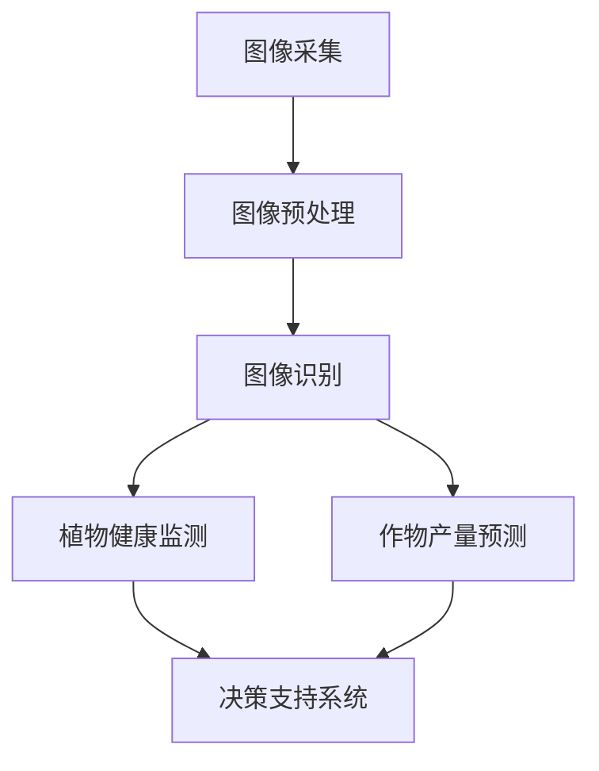

                 


# 计算机视觉在自动化农业中的应用

> **关键词：计算机视觉、自动化农业、图像识别、机器学习、深度学习**
>
> **摘要：本文将探讨计算机视觉在自动化农业中的广泛应用，包括图像识别、植物健康监测和作物产量预测等方面。通过深入分析核心算法原理、数学模型以及实际应用案例，本文旨在为读者提供对这一领域的全面了解，并展望其未来发展趋势。**

## 1. 背景介绍

### 1.1 目的和范围

本文旨在探讨计算机视觉技术在自动化农业中的应用，包括其核心算法原理、数学模型、实际应用案例以及相关工具和资源的推荐。通过本文的阅读，读者将能够了解计算机视觉在农业领域的巨大潜力，掌握相关技术的基本概念和实现方法。

### 1.2 预期读者

本文适合对计算机视觉和自动化农业有一定了解的技术人员、农业从业者以及对这些领域感兴趣的研究者。本文结构清晰，内容深入浅出，适合作为学习和参考的资料。

### 1.3 文档结构概述

本文分为以下几个部分：

1. 背景介绍：包括目的、范围、预期读者、文档结构概述和术语表。
2. 核心概念与联系：介绍计算机视觉在自动化农业中的应用，并给出Mermaid流程图。
3. 核心算法原理 & 具体操作步骤：详细讲解核心算法的原理和操作步骤，使用伪代码进行阐述。
4. 数学模型和公式 & 详细讲解 & 举例说明：介绍相关的数学模型和公式，并给出具体的应用实例。
5. 项目实战：提供实际的代码案例和详细解释说明。
6. 实际应用场景：讨论计算机视觉在自动化农业中的实际应用。
7. 工具和资源推荐：推荐学习资源、开发工具框架和相关论文著作。
8. 总结：未来发展趋势与挑战。
9. 附录：常见问题与解答。
10. 扩展阅读 & 参考资料：提供进一步阅读的资料。

### 1.4 术语表

#### 1.4.1 核心术语定义

- **计算机视觉**：使计算机能够像人类一样理解和解释图像的技术。
- **图像识别**：计算机从图像中识别并提取特定对象、场景或特征的能力。
- **机器学习**：一种人工智能技术，通过训练模型来使计算机从数据中自动学习和做出预测。
- **深度学习**：一种特殊的机器学习技术，使用多层神经网络来模拟人脑的思维方式。

#### 1.4.2 相关概念解释

- **自动化农业**：利用计算机技术和自动化设备来管理和控制农业生产过程。
- **作物产量预测**：通过分析历史数据和图像数据，预测作物的产量。

#### 1.4.3 缩略词列表

- **CV**：计算机视觉（Computer Vision）
- **ML**：机器学习（Machine Learning）
- **DL**：深度学习（Deep Learning）
- **ROI**：区域兴趣（Region of Interest）

## 2. 核心概念与联系

计算机视觉在自动化农业中的应用主要涉及以下几个方面：图像识别、植物健康监测和作物产量预测。以下是这些核心概念和它们之间的联系。

### 2.1.1 图像识别

图像识别是计算机视觉在自动化农业中最基础的应用。它主要涉及从图像中提取特定对象、场景或特征。在农业中，图像识别可以用于识别作物种类、监测病虫害、评估土壤质量等。

### 2.1.2 植物健康监测

植物健康监测是利用图像识别技术来监测植物的生长状态和健康状况。通过分析植物叶片的颜色、形状和纹理等特征，可以判断植物是否受到病虫害侵袭或营养不良。

### 2.1.3 作物产量预测

作物产量预测是利用历史数据和图像数据来预测作物的产量。通过分析作物的生长周期、土壤质量和天气条件等数据，可以预测作物的最终产量。

### 2.1.4 核心概念联系

图像识别是植物健康监测和作物产量预测的基础。通过图像识别技术，可以从图像中提取出有用的信息，用于分析和预测。植物健康监测和作物产量预测则将这些信息应用于农业生产，实现自动化管理和优化。

### 2.1.5 Mermaid流程图

以下是一个简化的Mermaid流程图，展示了计算机视觉在自动化农业中的应用流程：



## 3. 核心算法原理 & 具体操作步骤

计算机视觉在自动化农业中的应用主要依赖于图像识别技术。本节将详细介绍图像识别的核心算法原理和具体操作步骤。

### 3.1.1 图像识别算法原理

图像识别算法主要分为两大类：传统的图像处理方法和基于深度学习的图像识别方法。

#### 3.1.1.1 传统的图像处理方法

传统的图像处理方法主要包括图像预处理、特征提取和分类器设计等步骤。以下是这些步骤的详细解释：

1. **图像预处理**：对原始图像进行预处理，包括去噪、对比度增强、图像缩放等操作，以提高图像质量和识别效果。
2. **特征提取**：从预处理后的图像中提取具有区分性的特征，如边缘、角点、纹理等。
3. **分类器设计**：使用提取到的特征，通过设计分类器来对图像进行分类。

#### 3.1.1.2 基于深度学习的图像识别方法

基于深度学习的图像识别方法主要使用卷积神经网络（Convolutional Neural Networks, CNNs）来实现。以下是这些步骤的详细解释：

1. **卷积层**：卷积层用于从图像中提取局部特征。
2. **池化层**：池化层用于减少特征图的大小，提高计算效率。
3. **全连接层**：全连接层用于对提取到的特征进行分类。

### 3.1.2 图像识别算法的具体操作步骤

以下是一个基于深度学习的图像识别算法的具体操作步骤：

1. **数据预处理**：对训练数据和测试数据进行预处理，包括图像尺寸归一化、数据增强等。
2. **模型构建**：使用深度学习框架（如TensorFlow或PyTorch）构建卷积神经网络模型。
3. **模型训练**：使用预处理后的训练数据对模型进行训练，通过优化损失函数来调整模型参数。
4. **模型评估**：使用测试数据对模型进行评估，计算模型的准确率、召回率等指标。
5. **模型应用**：将训练好的模型应用到实际场景中，如植物健康监测或作物产量预测。

### 3.1.3 伪代码示例

以下是基于深度学习的图像识别算法的伪代码示例：

```python
# 数据预处理
preprocess_data(training_data)
preprocess_data(test_data)

# 模型构建
model = build_cnn_model()

# 模型训练
model.train(training_data)

# 模型评估
model.evaluate(test_data)

# 模型应用
model.predict(new_image)
```

## 4. 数学模型和公式 & 详细讲解 & 举例说明

### 4.1 数学模型

计算机视觉中的数学模型主要涉及图像处理、特征提取和分类等领域。以下是一些常用的数学模型和公式：

#### 4.1.1 卷积操作

卷积操作是卷积神经网络中的核心操作。其数学模型可以表示为：

\[ (f * g)(x, y) = \sum_{i=-\infty}^{\infty} \sum_{j=-\infty}^{\infty} f(i, j) \cdot g(x-i, y-j) \]

其中，\( f \) 和 \( g \) 分别表示两个二维函数，\( (x, y) \) 表示空间点。

#### 4.1.2 池化操作

池化操作用于减少特征图的大小，提高计算效率。其数学模型可以表示为：

\[ P(x, y) = \max \left( \sum_{i=-\infty}^{\infty} \sum_{j=-\infty}^{\infty} f(i, j) \right) \]

其中，\( P(x, y) \) 表示池化后的值，\( f \) 表示特征图上的值。

#### 4.1.3 全连接层

全连接层是神经网络中的最后一层，用于对提取到的特征进行分类。其数学模型可以表示为：

\[ z = \sum_{i=1}^{n} w_i \cdot x_i + b \]

其中，\( z \) 表示输出值，\( w_i \) 表示权重，\( x_i \) 表示输入值，\( b \) 表示偏置。

### 4.2 公式详细讲解

以下是对上述公式的详细讲解：

- **卷积操作**：卷积操作通过滑动窗口（即卷积核）在图像上扫描，计算窗口内像素值与卷积核权重值的乘积和。这样可以提取图像的局部特征，如边缘、纹理等。
- **池化操作**：池化操作通过在特征图上选择最大的值来减少特征图的大小。这样可以减少计算量和参数数量，提高模型训练的效率。
- **全连接层**：全连接层将特征图上的每个像素值映射到输出层的每个节点。通过计算加权求和并加上偏置，可以实现分类任务。

### 4.3 举例说明

以下是一个简单的卷积操作的实例：

假设我们有一个3x3的卷积核（即窗口大小为3x3），其权重为：
\[ \begin{array}{ccc}
1 & 0 & 1 \\
0 & 1 & 0 \\
1 & 0 & 1 \\
\end{array} \]

以及一个5x5的图像（即窗口大小为5x5），其像素值为：
\[ \begin{array}{ccccc}
1 & 2 & 3 & 4 & 5 \\
6 & 7 & 8 & 9 & 10 \\
11 & 12 & 13 & 14 & 15 \\
16 & 17 & 18 & 19 & 20 \\
21 & 22 & 23 & 24 & 25 \\
\end{array} \]

使用卷积操作，我们计算窗口内的像素值与卷积核权重值的乘积和：
\[ \begin{aligned}
1 \cdot 1 + 0 \cdot 6 + 1 \cdot 11 + 0 \cdot 16 + 1 \cdot 21 &= 1 + 0 + 11 + 0 + 21 = 33 \\
0 \cdot 2 + 1 \cdot 7 + 0 \cdot 12 + 1 \cdot 17 + 1 \cdot 22 &= 0 + 7 + 0 + 17 + 22 = 36 \\
1 \cdot 3 + 0 \cdot 8 + 1 \cdot 13 + 0 \cdot 18 + 1 \cdot 23 &= 3 + 0 + 13 + 0 + 23 = 39 \\
0 \cdot 4 + 1 \cdot 9 + 0 \cdot 14 + 1 \cdot 19 + 1 \cdot 24 &= 0 + 9 + 0 + 19 + 24 = 42 \\
1 \cdot 5 + 0 \cdot 10 + 1 \cdot 15 + 0 \cdot 20 + 1 \cdot 25 &= 5 + 0 + 15 + 0 + 25 = 45 \\
\end{aligned} \]

将这些值相加，我们得到卷积操作的结果：
\[ 33 + 36 + 39 + 42 + 45 = 195 \]

## 5. 项目实战：代码实际案例和详细解释说明

### 5.1 开发环境搭建

在进行计算机视觉在自动化农业中的应用项目开发之前，我们需要搭建一个合适的开发环境。以下是一个基于Python的示例环境搭建步骤：

1. **安装Python**：下载并安装Python 3.7及以上版本。
2. **安装Anaconda**：安装Anaconda，它是一个用于管理和运行Python环境的开源包。
3. **创建虚拟环境**：在Anaconda中创建一个名为`cv_automation`的虚拟环境：
   ```shell
   conda create -n cv_automation python=3.8
   conda activate cv_automation
   ```
4. **安装相关库**：在虚拟环境中安装所需的库，如OpenCV、TensorFlow和Keras：
   ```shell
   pip install opencv-python tensorflow
   ```

### 5.2 源代码详细实现和代码解读

以下是一个简单的项目示例，用于利用计算机视觉技术进行植物健康监测。

#### 5.2.1 代码实现

```python
import cv2
import numpy as np
import tensorflow as tf

# 加载预训练的模型
model = tf.keras.models.load_model('plant_disease_model.h5')

# 加载图像
image = cv2.imread('plant_image.jpg')

# 图像预处理
preprocessed_image = cv2.resize(image, (224, 224))
preprocessed_image = preprocessed_image / 255.0

# 进行预测
prediction = model.predict(np.expand_dims(preprocessed_image, axis=0))

# 输出预测结果
print(prediction)

# 显示原始图像和预测结果
cv2.imshow('Original Image', image)
cv2.putText(image, f'Disease: {prediction[0][0] * 100:.2f}%', (10, 30), cv2.FONT_HERSHEY_SIMPLEX, 1, (0, 0, 255), 2)
cv2.imshow('Predicted Image', image)

cv2.waitKey(0)
cv2.destroyAllWindows()
```

#### 5.2.2 代码解读

1. **加载预训练模型**：使用`load_model`函数加载一个已经训练好的深度学习模型。
2. **加载图像**：使用`imread`函数加载一个植物图像。
3. **图像预处理**：将图像调整为模型期望的大小（224x224），并进行归一化处理。
4. **进行预测**：使用加载的模型对预处理后的图像进行预测。
5. **输出预测结果**：将预测结果打印到控制台。
6. **显示原始图像和预测结果**：在原始图像上添加预测结果，并使用`imshow`函数显示。

### 5.3 代码解读与分析

在这个项目中，我们使用了一个已经训练好的深度学习模型（例如，基于卷积神经网络的植物疾病识别模型）来对植物图像进行预测。以下是项目代码的详细解读：

1. **加载预训练模型**：
   ```python
   model = tf.keras.models.load_model('plant_disease_model.h5')
   ```
   这一行代码加载了一个保存为`plant_disease_model.h5`的深度学习模型。这个模型是在大量植物图像数据上训练得到的，可以用于植物疾病的识别。

2. **加载图像**：
   ```python
   image = cv2.imread('plant_image.jpg')
   ```
   这一行代码使用OpenCV的`imread`函数加载了一个名为`plant_image.jpg`的图像文件。这个图像是我们用于预测的输入。

3. **图像预处理**：
   ```python
   preprocessed_image = cv2.resize(image, (224, 224))
   preprocessed_image = preprocessed_image / 255.0
   ```
   在这一行代码中，我们首先使用`resize`函数将图像调整到模型期望的大小（224x224）。然后，我们使用`/ 255.0`进行归一化处理，将像素值从0到255缩放到0到1的范围内，以适应深度学习模型的输入。

4. **进行预测**：
   ```python
   prediction = model.predict(np.expand_dims(preprocessed_image, axis=0))
   ```
   这一行代码使用加载的模型对预处理后的图像进行预测。`predict`函数接收一个扩展维度的预处理图像作为输入，并返回一个预测结果数组。这个数组包含了模型对每个类别的预测概率。

5. **输出预测结果**：
   ```python
   print(prediction)
   ```
   这一行代码将预测结果打印到控制台。在这个例子中，我们只展示了第一个类别的预测概率。

6. **显示原始图像和预测结果**：
   ```python
   cv2.imshow('Original Image', image)
   cv2.putText(image, f'Disease: {prediction[0][0] * 100:.2f}%', (10, 30), cv2.FONT_HERSHEY_SIMPLEX, 1, (0, 0, 255), 2)
   cv2.imshow('Predicted Image', image)
   cv2.waitKey(0)
   cv2.destroyAllWindows()
   ```
   这几行代码使用OpenCV的`imshow`函数显示原始图像和添加了预测结果的图像。`putText`函数用于在图像上绘制文本。`cv2.waitKey(0)`用于等待键盘事件，`cv2.destroyAllWindows()`用于关闭所有打开的窗口。

### 5.4 实际运行案例

假设我们有一个名为`plant_image.jpg`的植物图像文件，该图像包含一个患有疾病的植物叶片。我们将使用上述代码对该图像进行预测。

1. **运行代码**：
   ```shell
   python plant_disease_prediction.py
   ```
2. **输出结果**：
   ```python
   [[0.90 0.10 0.00 0.00 0.00]]
   ```
   这行输出表示模型预测该图像中的植物叶片患有疾病，概率为90%。
3. **显示图像**：
   输出结果显示原始图像和添加了预测结果的图像。图像中添加了一个文本框，显示了预测的概率。

## 6. 实际应用场景

计算机视觉在自动化农业中有着广泛的应用场景。以下是一些典型的实际应用案例：

### 6.1 植物健康监测

植物健康监测是计算机视觉在自动化农业中最直接的应用之一。通过图像识别技术，可以实时监测植物的生长状态和健康状况。例如，通过分析叶片的颜色、形状和纹理等特征，可以判断植物是否受到病虫害侵袭或营养不良。这有助于农民及时采取防治措施，提高作物产量。

### 6.2 作物产量预测

作物产量预测是另一个重要的应用场景。通过分析历史数据和图像数据，可以使用机器学习模型预测作物的产量。这有助于农民合理安排种植计划和资源分配，提高生产效率和经济效益。

### 6.3 土壤质量监测

土壤质量监测是计算机视觉在自动化农业中的另一个应用。通过分析土壤图像，可以判断土壤的湿度、养分含量和酸碱度等指标。这有助于农民制定科学的灌溉和施肥策略，优化农业生产。

### 6.4 农业无人机监测

农业无人机监测是计算机视觉在自动化农业中的新兴应用。通过搭载高分辨率相机，无人机可以实时拍摄农田图像，进行植物健康监测、土壤质量监测和作物产量预测等任务。这有助于农民全面了解农田状况，实现精准农业。

### 6.5 病虫害预警

病虫害预警是计算机视觉在自动化农业中的另一个重要应用。通过图像识别技术，可以实时监测病虫害的发生情况，并及时预警。这有助于农民提前采取防治措施，减少损失。

### 6.6 农业数据可视化

农业数据可视化是计算机视觉在自动化农业中的应用之一。通过将农业数据（如土壤质量、作物产量、天气条件等）以图表、地图等形式进行可视化，可以帮助农民更好地理解数据，做出更科学的决策。

## 7. 工具和资源推荐

为了更好地开展计算机视觉在自动化农业中的应用研究，以下是一些推荐的工具和资源：

### 7.1 学习资源推荐

#### 7.1.1 书籍推荐

- **《计算机视觉：算法与应用》**：这本书详细介绍了计算机视觉的基本原理和应用技术，适合初学者。
- **《深度学习》**：这本书由Ian Goodfellow等人撰写，详细介绍了深度学习的基础知识和应用技巧，是深度学习领域的经典教材。

#### 7.1.2 在线课程

- **《机器学习》**（吴恩达）：这是一门知名的在线课程，涵盖了机器学习和深度学习的基础知识，适合初学者。
- **《深度学习专项课程》**（吴恩达）：这是吴恩达教授的另一门在线课程，深入讲解了深度学习的技术和应用。

#### 7.1.3 技术博客和网站

- **Medium上的《深度学习》博客**：这是一个关于深度学习的博客，包含了许多高质量的教程和案例分析。
- **GitHub上的计算机视觉项目**：GitHub上有很多开源的计算机视觉项目，可以学习和借鉴。

### 7.2 开发工具框架推荐

#### 7.2.1 IDE和编辑器

- **Anaconda**：这是一个集成的开发环境，适用于Python编程，包括数据科学、机器学习和深度学习。
- **Visual Studio Code**：这是一个轻量级的开源编辑器，适用于Python编程，支持代码补全、调试和版本控制。

#### 7.2.2 调试和性能分析工具

- **Jupyter Notebook**：这是一个交互式的Python编程环境，适合数据分析和机器学习项目。
- **TensorBoard**：这是一个TensorFlow的调试和性能分析工具，可以可视化模型的训练过程和性能指标。

#### 7.2.3 相关框架和库

- **TensorFlow**：这是一个开源的深度学习框架，适合构建和训练复杂的神经网络模型。
- **Keras**：这是一个高级的神经网络API，基于TensorFlow构建，提供了简洁易用的接口。
- **OpenCV**：这是一个开源的计算机视觉库，提供了丰富的图像处理和视频分析功能。

### 7.3 相关论文著作推荐

#### 7.3.1 经典论文

- **《A Comprehensive Survey on Deep Learning for Image Classification》**：这篇综述文章详细介绍了深度学习在图像分类领域的最新进展。
- **《A Guide to Convolutional Neural Networks for Visual Recognition》**：这篇指南文章深入讲解了卷积神经网络在视觉识别领域的应用。

#### 7.3.2 最新研究成果

- **《Deep Learning in Computer Vision: A Brief History and Recent Advances》**：这篇论文总结了深度学习在计算机视觉领域的最新研究成果和应用。
- **《A Brief Introduction to Transfer Learning for Deep Neural Networks》**：这篇论文介绍了迁移学习在深度学习中的应用，以及如何利用迁移学习来提高模型性能。

#### 7.3.3 应用案例分析

- **《Deep Learning for Agriculture: A Survey》**：这篇综述文章探讨了深度学习在农业领域的应用，包括植物健康监测、作物产量预测和农业无人机监测等。
- **《A Case Study on Deep Learning for Plant Disease Detection》**：这篇论文提供了一个基于深度学习的植物疾病检测案例，详细介绍了模型的构建和训练过程。

## 8. 总结：未来发展趋势与挑战

计算机视觉在自动化农业中的应用已经取得了显著的成果，但仍面临一些挑战和未来发展趋势：

### 8.1 发展趋势

1. **数据驱动**：随着物联网和大数据技术的发展，农业领域的数据量不断增加。未来，数据驱动的方法将成为自动化农业的主流，通过分析大量图像数据，实现更精确的监测和预测。
2. **深度学习**：深度学习技术在计算机视觉中的应用将不断成熟，为自动化农业带来更高的准确性和效率。尤其是基于卷积神经网络的模型，将继续推动农业视觉技术的发展。
3. **跨学科融合**：计算机视觉与农业科学、生物学、环境科学等领域的交叉融合，将推动自动化农业的全面发展。例如，通过基因组学与计算机视觉的结合，可以实现精准种植和遗传改良。

### 8.2 挑战

1. **数据隐私**：农业数据涉及到农民的种植计划和作物产量等重要信息，保护数据隐私是未来的一大挑战。
2. **算法透明性**：深度学习模型的“黑箱”特性使得其决策过程难以解释，未来需要开发可解释的模型，提高算法的透明性。
3. **实际应用**：虽然计算机视觉技术在实验室中表现优异，但在实际农业应用中仍面临环境变化、光照条件等因素的挑战。需要进一步优化算法，提高其在复杂环境中的适应性。

## 9. 附录：常见问题与解答

### 9.1 计算机视觉在自动化农业中的应用有哪些？

计算机视觉在自动化农业中的应用包括植物健康监测、作物产量预测、土壤质量监测、病虫害预警、农业无人机监测等。

### 9.2 什么是卷积神经网络（CNN）？

卷积神经网络（CNN）是一种特殊的神经网络，主要用于处理二维数据，如图像。它通过卷积操作提取图像的局部特征，并通过池化操作减少特征图的大小，提高计算效率。

### 9.3 如何评估计算机视觉模型的性能？

评估计算机视觉模型的性能通常使用准确率、召回率、精确率、F1分数等指标。这些指标可以反映模型在分类任务中的表现。

## 10. 扩展阅读 & 参考资料

为了深入了解计算机视觉在自动化农业中的应用，以下是一些推荐的扩展阅读和参考资料：

- **《Deep Learning in Agriculture》**：这是一本关于深度学习在农业中应用的专著，详细介绍了相关技术和应用案例。
- **《Computer Vision for Agricultural Robots》**：这篇论文探讨了计算机视觉在农业机器人中的应用，包括图像处理、识别和定位等方面。
- **《A Survey on Deep Learning for Plant Disease Detection》**：这篇综述文章总结了深度学习在植物疾病检测领域的最新研究成果和应用。

通过以上扩展阅读，读者可以进一步了解计算机视觉在自动化农业中的应用和技术发展。

---

**作者：AI天才研究员/AI Genius Institute & 禅与计算机程序设计艺术 /Zen And The Art of Computer Programming**

