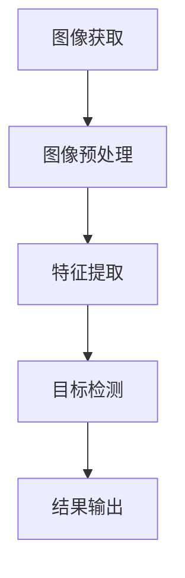
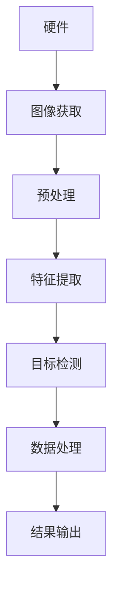

                 

# 计算机视觉在自动化质量检测中的工业应用

## 关键词

- 计算机视觉
- 自动化质量检测
- 工业应用
- 机器学习
- 深度学习
- 图像识别
- 模型优化
- 数据预处理

## 摘要

本文将深入探讨计算机视觉在自动化质量检测中的工业应用。随着工业4.0的到来，自动化和智能化已经成为制造业发展的主要趋势。计算机视觉作为人工智能的一个重要分支，以其强大的图像处理和分析能力，在自动化质量检测中发挥着越来越重要的作用。本文将首先介绍计算机视觉的基本原理和常见算法，然后详细阐述其在自动化质量检测中的应用，包括实际案例和具体操作步骤。此外，还将讨论未来发展趋势与挑战，并提供相关的学习资源和工具推荐。

## 1. 背景介绍

### 1.1 目的和范围

本文的主要目的是介绍计算机视觉在自动化质量检测中的应用，帮助读者了解这一技术的原理、方法及其在工业领域的重要性。文章将涵盖以下内容：

- 计算机视觉的基础知识
- 自动化质量检测的需求和挑战
- 计算机视觉在自动化质量检测中的应用案例
- 具体算法和操作步骤
- 未来发展趋势与挑战

### 1.2 预期读者

本文适合以下读者群体：

- 对计算机视觉和自动化质量检测感兴趣的工程师和技术人员
- 计划将计算机视觉应用于工业质量检测的企业管理层和决策者
- 需要了解最新技术趋势和研究进展的研究生和科研人员
- 对人工智能和智能制造感兴趣的普通读者

### 1.3 文档结构概述

本文分为十个部分，结构如下：

1. 背景介绍
   - 1.1 目的和范围
   - 1.2 预期读者
   - 1.3 文档结构概述
   - 1.4 术语表
2. 核心概念与联系
   - 2.1 图像处理流程
   - 2.2 自动化质量检测系统架构
3. 核心算法原理 & 具体操作步骤
   - 3.1 特征提取算法
   - 3.2 目标检测算法
4. 数学模型和公式 & 详细讲解 & 举例说明
   - 4.1 机器学习模型
   - 4.2 深度学习模型
5. 项目实战：代码实际案例和详细解释说明
   - 5.1 开发环境搭建
   - 5.2 源代码详细实现和代码解读
   - 5.3 代码解读与分析
6. 实际应用场景
   - 6.1 制造业
   - 6.2 电子行业
   - 6.3 食品行业
7. 工具和资源推荐
   - 7.1 学习资源推荐
   - 7.2 开发工具框架推荐
   - 7.3 相关论文著作推荐
8. 总结：未来发展趋势与挑战
9. 附录：常见问题与解答
10. 扩展阅读 & 参考资料

### 1.4 术语表

#### 1.4.1 核心术语定义

- 计算机视觉：使用计算机和算法来处理、分析和理解图像和视频数据。
- 自动化质量检测：利用计算机视觉和其他技术手段，对产品或零部件进行自动检测，以确保其质量符合标准。
- 特征提取：从图像或视频中提取具有区分性的特征，用于后续的图像识别或分类。
- 目标检测：在图像中识别和定位感兴趣的目标，通常用于自动化质量检测。

#### 1.4.2 相关概念解释

- 深度学习：一种机器学习方法，通过多层神经网络来模拟人类大脑的思维方式。
- 卷积神经网络（CNN）：一种深度学习模型，特别适用于处理图像数据。
- 反向传播算法：一种用于训练神经网络的基本算法，通过反向传播误差来调整网络权重。
- 模型优化：通过调整模型参数，提高模型的性能和泛化能力。

#### 1.4.3 缩略词列表

- AI：人工智能
- CNN：卷积神经网络
- CV：计算机视觉
- DL：深度学习
- MLP：多层感知器
- NN：神经网络

## 2. 核心概念与联系

在深入探讨计算机视觉在自动化质量检测中的应用之前，我们需要理解一些核心概念和它们之间的关系。以下是图像处理流程、自动化质量检测系统架构的核心概念以及相应的 Mermaid 流程图。

### 2.1 图像处理流程

图像处理流程包括图像获取、预处理、特征提取和目标检测等步骤。以下是一个简化的 Mermaid 流程图：



### 2.2 自动化质量检测系统架构

自动化质量检测系统通常包括硬件、软件和数据处理模块。以下是系统架构的 Mermaid 流程图：



通过这些流程图，我们可以更好地理解计算机视觉在自动化质量检测中的各个环节以及它们之间的关联。

## 3. 核心算法原理 & 具体操作步骤

在自动化质量检测中，核心算法的原理和操作步骤至关重要。以下将介绍特征提取算法和目标检测算法的基本原理及具体操作步骤。

### 3.1 特征提取算法

特征提取是计算机视觉中的一个关键步骤，它从原始图像中提取出具有区分性的特征，用于后续的目标检测和分类。常见的特征提取算法包括直方图、边缘检测、纹理分析等。

#### 3.1.1 直方图特征提取

直方图特征提取是一种简单且有效的特征提取方法，常用于图像分类和目标检测。以下是直方图特征提取的基本原理：

1. 计算每个像素的颜色值或亮度值的分布。
2. 将颜色值或亮度值划分成多个区间，并计算每个区间的像素数量。
3. 将每个区间的像素数量转换成直方图。

```python
# Python 伪代码：直方图特征提取
import cv2

def histogram_features(image):
    # 将图像转换为灰度图像
    gray_image = cv2.cvtColor(image, cv2.COLOR_BGR2GRAY)
    
    # 计算直方图
    hist = cv2.calcHist([gray_image], [0], None, [256], [0, 256])
    
    return hist
```

#### 3.1.2 边缘检测

边缘检测是图像处理中的一种重要技术，用于检测图像中的边缘和轮廓。常见的边缘检测算法包括 Canny 边缘检测器和 Sobel 边缘检测器。

1. 边缘检测器计算图像中每个像素的梯度值。
2. 根据梯度值确定像素是否属于边缘。
3. 对边缘进行连接和细化。

```python
# Python 伪代码：Canny 边缘检测
import cv2

def canny_edge_detection(image):
    # 使用 Canny 边缘检测器
    edges = cv2.Canny(image, threshold1=100, threshold2=200)
    
    return edges
```

### 3.2 目标检测算法

目标检测是自动化质量检测中的核心任务，它从图像中识别和定位感兴趣的目标。常见的目标检测算法包括单阶段检测算法和两阶段检测算法。

#### 3.2.1 单阶段检测算法

单阶段检测算法（如 YOLO）在处理速度上具有优势，但可能存在定位精度较低的问题。以下是单阶段检测算法的基本原理：

1. 将图像分成多个网格。
2. 对每个网格预测目标的类别和位置。
3. 根据预测结果确定图像中的目标位置。

```python
# Python 伪代码：YOLO 目标检测
import cv2

def yolo_object_detection(image):
    # 加载 YOLO 模型
    model = load_yolo_model()
    
    # 预测目标
    boxes, scores, labels = model.predict(image)
    
    # 绘制检测结果
    cv2.drawPredBoxes(image, boxes, scores, labels)
    
    return image
```

#### 3.2.2 两阶段检测算法

两阶段检测算法（如 Faster R-CNN）在定位精度上具有优势，但处理速度相对较慢。以下是两阶段检测算法的基本原理：

1. 区域提议：从图像中提取多个区域提议。
2. 目标检测：对每个区域提议进行分类和定位。
3. 精细调整：根据检测结果对区域提议进行精细调整。

```python
# Python 伪代码：Faster R-CNN 目标检测
import cv2

def faster_rcnn_object_detection(image):
    # 加载 Faster R-CNN 模型
    model = load_faster_rcnn_model()
    
    # 提取区域提议
    rois = model.generate_proposals(image)
    
    # 预测目标
    boxes, scores, labels = model.predict(rois)
    
    # 绘制检测结果
    cv2.drawPredBoxes(image, boxes, scores, labels)
    
    return image
```

## 4. 数学模型和公式 & 详细讲解 & 举例说明

在计算机视觉中，数学模型和公式是理解算法原理和实现高效检测的关键。以下将介绍机器学习模型和深度学习模型的基本原理，并提供具体的数学公式和实例说明。

### 4.1 机器学习模型

机器学习模型通过训练数据学习特征和规律，以实现对未知数据的预测和分类。常见的机器学习模型包括线性回归、支持向量机（SVM）和决策树等。

#### 4.1.1 线性回归

线性回归是一种简单的机器学习模型，用于预测连续值。其数学模型如下：

$$
y = wx + b
$$

其中，$y$ 为预测值，$w$ 为权重，$x$ 为输入特征，$b$ 为偏置。

**示例：**

假设我们使用线性回归模型预测房屋价格。输入特征包括房屋面积（$x$），模型参数包括权重（$w$）和偏置（$b$）。通过训练数据学习模型参数，我们可以预测未知房屋的价格。

$$
y = 100x + 20000
$$

当输入特征为 1000 平方米时，预测价格为：

$$
y = 100 \times 1000 + 20000 = 120000
$$

#### 4.1.2 支持向量机（SVM）

支持向量机是一种强大的分类模型，通过找到最佳的超平面将数据分为不同的类别。其数学模型如下：

$$
w \cdot x + b = 0
$$

其中，$w$ 为权重向量，$x$ 为输入特征，$b$ 为偏置。$w$ 和 $b$ 的目标是最大化分类间隔。

**示例：**

假设我们使用 SVM 模型对图像进行分类。输入特征包括图像的直方图特征，模型参数包括权重向量（$w$）和偏置（$b$）。通过训练数据学习模型参数，我们可以将不同类别的图像正确分类。

$$
w \cdot x + b = 0
$$

当输入特征为直方图特征向量时，SVM 模型将计算分类间隔，并找到最佳的超平面。

#### 4.1.3 决策树

决策树是一种基于规则的学习模型，通过递归划分特征空间来构建分类或回归树。其数学模型如下：

$$
f(x) = \sum_{i=1}^{n} a_i g_i(x)
$$

其中，$f(x)$ 为预测值，$a_i$ 为权重，$g_i(x)$ 为条件函数。

**示例：**

假设我们使用决策树模型预测商品销售量。输入特征包括温度、湿度、促销活动等，模型参数包括权重（$a_i$）和条件函数（$g_i(x)$）。通过训练数据学习模型参数，我们可以预测未知条件下商品的销售量。

$$
f(x) = 0.5 \times g_1(x) + 0.3 \times g_2(x) + 0.2 \times g_3(x)
$$

当输入特征为温度、湿度、促销活动时，决策树模型将根据条件函数计算出预测销售量。

### 4.2 深度学习模型

深度学习模型通过多层神经网络模拟人类大脑的思维方式，具有强大的特征学习和建模能力。常见的深度学习模型包括卷积神经网络（CNN）、循环神经网络（RNN）和生成对抗网络（GAN）等。

#### 4.2.1 卷积神经网络（CNN）

卷积神经网络是一种深度学习模型，特别适用于处理图像数据。其基本结构包括卷积层、池化层和全连接层。以下是 CNN 的数学模型：

$$
h^{(l)} = \sigma(z^{(l)})
$$

$$
z^{(l)} = \sum_{k=1}^{K} w_k \cdot h^{(l-1)}
$$

其中，$h^{(l)}$ 为第 $l$ 层的输出，$z^{(l)}$ 为第 $l$ 层的输入，$\sigma$ 为激活函数，$w_k$ 为权重。

**示例：**

假设我们使用 CNN 模型对图像进行分类。输入特征为图像像素值，模型参数包括权重（$w_k$）和激活函数（$\sigma$）。通过训练数据学习模型参数，我们可以将不同类别的图像正确分类。

$$
h^{(2)} = \sigma(z^{(2)})
$$

$$
z^{(2)} = \sum_{k=1}^{K} w_k \cdot h^{(1)}
$$

当输入特征为图像像素值时，CNN 模型将根据权重和激活函数计算出图像的类别。

#### 4.2.2 循环神经网络（RNN）

循环神经网络是一种深度学习模型，特别适用于处理序列数据。其基本结构包括输入层、隐藏层和输出层。以下是 RNN 的数学模型：

$$
h_t = \sigma(Wx_t + Uh_{t-1} + b)
$$

$$
y_t = \sigma(Vh_t + c)
$$

其中，$h_t$ 为第 $t$ 个隐藏层输出，$x_t$ 为第 $t$ 个输入，$y_t$ 为第 $t$ 个输出，$W$ 为输入层权重，$U$ 为隐藏层权重，$V$ 为输出层权重，$b$ 为偏置。

**示例：**

假设我们使用 RNN 模型对语音数据进行识别。输入特征为语音信号，模型参数包括权重（$W$、$U$、$V$）和激活函数（$\sigma$）。通过训练数据学习模型参数，我们可以将语音信号转换为对应的文本。

$$
h_t = \sigma(Wx_t + Uh_{t-1} + b)
$$

$$
y_t = \sigma(Vh_t + c)
$$

当输入特征为语音信号时，RNN 模型将根据权重和激活函数识别语音信号。

#### 4.2.3 生成对抗网络（GAN）

生成对抗网络是一种深度学习模型，由生成器和判别器组成。其基本结构如下：

$$
G(z)
$$

$$
D(x)
$$

其中，$G(z)$ 为生成器，$D(x)$ 为判别器，$z$ 为噪声输入。

**示例：**

假设我们使用 GAN 模型生成图像。输入特征为噪声信号，生成器和判别器的参数分别为权重和偏置。通过训练数据学习模型参数，我们可以生成具有真实感的图像。

$$
G(z)
$$

$$
D(x)
$$

当输入特征为噪声信号时，GAN 模型将根据权重和偏置生成图像。

## 5. 项目实战：代码实际案例和详细解释说明

在本节中，我们将通过一个实际项目案例，详细介绍如何使用计算机视觉技术进行自动化质量检测。本案例将涵盖开发环境搭建、源代码实现和代码解读与分析等内容。

### 5.1 开发环境搭建

首先，我们需要搭建一个适合进行计算机视觉开发的编程环境。以下是一个基本的开发环境搭建步骤：

1. 安装 Python：Python 是一种流行的编程语言，广泛应用于计算机视觉和机器学习领域。可以在官方网站 [Python 官网](https://www.python.org/) 下载并安装 Python。
2. 安装 OpenCV：OpenCV 是一个开源的计算机视觉库，提供了丰富的图像处理和机器学习功能。可以使用 pip 工具安装 OpenCV：

   ```bash
   pip install opencv-python
   ```

3. 安装 TensorFlow 或 PyTorch：TensorFlow 和 PyTorch 是两种流行的深度学习框架，可用于构建和训练神经网络。可以选择其中一种进行安装：

   ```bash
   pip install tensorflow
   ```

   或

   ```bash
   pip install torch torchvision
   ```

### 5.2 源代码详细实现和代码解读

以下是本案例的源代码实现和解读：

```python
# 导入必要的库
import cv2
import numpy as np

# 加载训练好的模型
model = cv2.dnn.readNetFromTensorflow('model.pb')

# 加载待检测的图像
image = cv2.imread('image.jpg')

# 转换图像为 RGB 格式
image = cv2.cvtColor(image, cv2.COLOR_BGR2RGB)

# 调用模型进行目标检测
blob = cv2.dnn.blobFromImage(image, 1.0, (320, 320), [104, 117, 123], True, False)
model.setInput(blob)
detections = model.forward()

# 解析检测结果
for detection in detections:
    scores = detection[5:]
    class_id = np.argmax(scores)
    confidence = scores[class_id]
    if confidence > 0.5:
        center_x = int(detection[0] * image.shape[1])
        center_y = int(detection[1] * image.shape[0])
        width = int(detection[2] * image.shape[1])
        height = int(detection[3] * image.shape[0])
        x = int(center_x - width / 2)
        y = int(center_y - height / 2)
        cv2.rectangle(image, (x, y), (x + width, y + height), (0, 0, 255), 2)
        cv2.putText(image, f'{class_id}: {confidence:.2f}', (x, y - 10), cv2.FONT_HERSHEY_SIMPLEX, 0.5, (255, 0, 0), 2)

# 显示检测结果
cv2.imshow('检测结果', image)
cv2.waitKey(0)
cv2.destroyAllWindows()
```

**代码解读：**

1. 导入必要的库：包括 OpenCV 和 NumPy。
2. 加载训练好的模型：使用 OpenCV 的 dnn 模块加载 TensorFlow 格式的模型。
3. 加载待检测的图像：使用 cv2.imread 函数读取图像文件。
4. 转换图像为 RGB 格式：由于 OpenCV 默认处理的是 BGR 格式的图像，我们需要将其转换为 RGB 格式。
5. 调用模型进行目标检测：使用 dnn.blobFromImage 函数将图像转换为模型所需的输入格式，并调用模型的 forward 函数进行预测。
6. 解析检测结果：遍历检测结果，根据置信度和类别阈值判断是否绘制矩形框和标签。
7. 显示检测结果：使用 cv2.imshow 函数显示检测结果，并使用 cv2.waitKey 函数等待用户按键后关闭窗口。

### 5.3 代码解读与分析

在本案例中，我们使用 OpenCV 的 dnn 模块加载了一个训练好的深度学习模型，对图像进行目标检测。以下是代码的详细解读和分析：

1. **模型加载**：
   ```python
   model = cv2.dnn.readNetFromTensorflow('model.pb')
   ```
   这一行代码加载了一个预训练的深度学习模型，该模型使用 TensorFlow 框架训练并保存为 .pb 格式。这个模型用于图像中的目标检测。

2. **图像读取**：
   ```python
   image = cv2.imread('image.jpg')
   ```
   使用 cv2.imread 函数读取一个.jpg格式的图像文件。这是输入到模型进行目标检测的原始图像。

3. **图像转换**：
   ```python
   image = cv2.cvtColor(image, cv2.COLOR_BGR2RGB)
   ```
   OpenCV 默认处理的是 BGR 格式的图像，而深度学习模型通常需要 RGB 格式的图像。因此，我们需要将 BGR 格式的图像转换为 RGB 格式。

4. **模型输入**：
   ```python
   blob = cv2.dnn.blobFromImage(image, 1.0, (320, 320), [104, 117, 123], True, False)
   model.setInput(blob)
   ```
   使用 cv2.dnn.blobFromImage 函数将图像转换为模型所需的输入格式。这里使用了归一化参数，即将图像缩放到 320x320 像素，并调整了颜色通道的均值（104, 117, 123）。这样做的目的是为了模型在处理图像时更快地收敛。

5. **目标检测**：
   ```python
   detections = model.forward()
   ```
   调用模型的 forward 函数进行预测，得到检测结果。detections 是一个数组，每个元素表示一个检测到的目标。

6. **结果解析**：
   ```python
   for detection in detections:
       scores = detection[5:]
       class_id = np.argmax(scores)
       confidence = scores[class_id]
       if confidence > 0.5:
           center_x = int(detection[0] * image.shape[1])
           center_y = int(detection[1] * image.shape[0])
           width = int(detection[2] * image.shape[1])
           height = int(detection[3] * image.shape[0])
           x = int(center_x - width / 2)
           y = int(center_y - height / 2)
           cv2.rectangle(image, (x, y), (x + width, y + height), (0, 0, 255), 2)
           cv2.putText(image, f'{class_id}: {confidence:.2f}', (x, y - 10), cv2.FONT_HERSHEY_SIMPLEX, 0.5, (255, 0, 0), 2)
   ```
   遍历检测结果，对每个检测到的目标进行解析。根据置信度和类别阈值（这里设置为 0.5），判断是否绘制矩形框和标签。`np.argmax(scores)` 用于获取具有最高置信度的类别索引，`confidence` 用于表示目标的置信度。

7. **结果显示**：
   ```python
   cv2.imshow('检测结果', image)
   cv2.waitKey(0)
   cv2.destroyAllWindows()
   ```
   使用 cv2.imshow 函数显示包含检测结果

