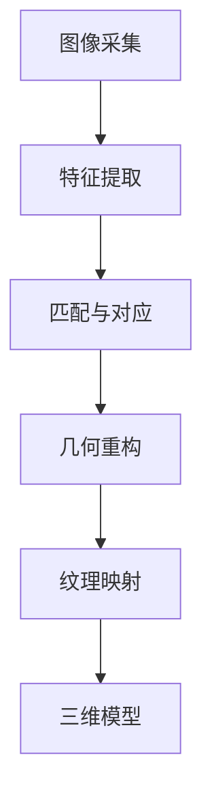

                 

# 计算机视觉在虚拟现实中的创新应用

> **关键词：** 虚拟现实，计算机视觉，三维重建，人机交互，增强现实，人工智能

> **摘要：** 本文旨在探讨计算机视觉技术在虚拟现实（VR）领域的创新应用。通过对核心概念、算法原理、数学模型和实际案例的深入分析，本文将阐述如何利用计算机视觉技术实现更真实、更自然的虚拟现实体验，同时探讨该领域未来的发展趋势与挑战。

## 1. 背景介绍

### 1.1 目的和范围

本文的目标是介绍计算机视觉技术在虚拟现实（VR）领域的应用，旨在帮助读者了解该技术的核心概念、算法原理和实际应用。本文将重点关注以下几个问题：

- 虚拟现实与计算机视觉之间的联系是什么？
- 如何利用计算机视觉技术实现三维重建？
- 虚拟现实中的增强现实（AR）应用有哪些？
- 计算机视觉技术在虚拟现实中的未来发展趋势如何？

### 1.2 预期读者

本文适用于对计算机视觉和虚拟现实技术有一定了解的读者，包括：

- 软件工程师和程序员，特别是对VR开发有兴趣的从业者。
- 对计算机视觉技术感兴趣的学者和研究人员。
- 对虚拟现实和增强现实技术有热情的发烧友和爱好者。

### 1.3 文档结构概述

本文结构如下：

1. 背景介绍
   - 目的和范围
   - 预期读者
   - 文档结构概述
   - 术语表

2. 核心概念与联系
   - 虚拟现实与计算机视觉的关系
   - 三维重建的基本原理
   - 人机交互与增强现实

3. 核心算法原理 & 具体操作步骤
   - 特征提取与匹配
   - 3D重建算法详解

4. 数学模型和公式 & 详细讲解 & 举例说明
   - 相关数学模型介绍
   - 公式推导与实例分析

5. 项目实战：代码实际案例和详细解释说明
   - 开发环境搭建
   - 源代码详细实现和代码解读
   - 代码解读与分析

6. 实际应用场景
   - 游戏与娱乐
   - 教育与培训
   - 医疗与健康
   - 建筑与设计

7. 工具和资源推荐
   - 学习资源推荐
   - 开发工具框架推荐
   - 相关论文著作推荐

8. 总结：未来发展趋势与挑战

9. 附录：常见问题与解答

10. 扩展阅读 & 参考资料

### 1.4 术语表

#### 1.4.1 核心术语定义

- **虚拟现实（VR）**：一种通过计算机生成模拟环境，使人们可以在虚拟环境中进行交互和体验的技术。
- **计算机视觉**：研究如何使计算机能够“看到”和理解图像或视频的技术。
- **三维重建**：从二维图像或视频中重建三维场景或物体的过程。
- **增强现实（AR）**：将虚拟信息叠加到真实世界中，增强用户的感知和体验。
- **特征提取**：从图像或视频中提取具有区分性的特征，用于后续处理和识别。
- **匹配**：将不同图像或视频帧中的特征进行匹配，以确定它们之间的对应关系。

#### 1.4.2 相关概念解释

- **深度学习**：一种通过多层神经网络学习数据特征和模式的人工智能技术。
- **卷积神经网络（CNN）**：一种用于图像识别和处理的前馈神经网络。
- **点云**：由三维空间中的点组成的集合，用于表示物体或场景的三维结构。
- **SLAM（Simultaneous Localization and Mapping）**：同时进行定位和地图构建的技术，广泛应用于机器人导航和虚拟现实场景重建。

#### 1.4.3 缩略词列表

- **VR**：虚拟现实（Virtual Reality）
- **AR**：增强现实（Augmented Reality）
- **CNN**：卷积神经网络（Convolutional Neural Network）
- **SLAM**：同时定位与地图构建（Simultaneous Localization and Mapping）
- **RGB-D**：红绿蓝深度（Red, Green, Blue, Depth）

## 2. 核心概念与联系

虚拟现实与计算机视觉是现代信息技术领域的重要分支，它们在多个层面有着紧密的联系和相互作用。

### 2.1 虚拟现实与计算机视觉的关系

虚拟现实依赖于计算机视觉技术来实现沉浸式体验。计算机视觉为虚拟现实提供了以下关键功能：

- **环境感知**：计算机视觉技术可以帮助虚拟现实系统感知和识别用户所在的环境，包括物体的位置、形状和运动状态。
- **交互识别**：通过计算机视觉技术，虚拟现实系统可以识别用户的动作和手势，从而实现与虚拟环境的自然交互。
- **三维重建**：计算机视觉技术能够从二维图像或视频中重建三维场景，为虚拟现实提供逼真的视觉效果。

### 2.2 三维重建的基本原理

三维重建是计算机视觉在虚拟现实中的重要应用之一。其基本原理包括以下步骤：

1. **图像采集**：使用相机或其他传感器采集二维图像。
2. **特征提取**：从图像中提取具有区分性的特征，如角点、边缘等。
3. **匹配与对应**：将不同图像帧中的特征进行匹配，以确定它们之间的对应关系。
4. **几何重构**：利用匹配的特征点，重构出三维场景的几何结构。
5. **纹理映射**：将原始图像的纹理映射到重构出的三维模型上，以实现逼真的视觉效果。

### 2.3 人机交互与增强现实

计算机视觉技术在虚拟现实和增强现实中的另一个重要应用是人与虚拟环境的交互。以下是其关键点：

- **手势识别**：通过计算机视觉技术，虚拟现实系统可以识别用户的手势，从而实现与虚拟环境的自然交互。
- **面部识别**：计算机视觉技术可以识别用户的面部表情，为虚拟现实系统提供更丰富的交互体验。
- **增强现实**：在增强现实场景中，计算机视觉技术可以将虚拟信息叠加到真实世界中，增强用户的感知和体验。

### 2.4 Mermaid 流程图

以下是三维重建的基本流程的 Mermaid 流程图：



## 3. 核心算法原理 & 具体操作步骤

计算机视觉技术在虚拟现实中的应用涉及多个核心算法。以下将详细介绍其中的几个关键算法，并使用伪代码进行具体操作步骤的阐述。

### 3.1 特征提取与匹配

特征提取是计算机视觉中重要的预处理步骤，用于从图像中提取具有区分性的特征点。常用的特征提取算法包括 SIFT（尺度不变特征变换）和 SURF（加速稳健特征）。

#### 3.1.1 SIFT 特征提取

SIFT 特征提取的伪代码如下：

```plaintext
SIFT(x):
    1. 对图像进行高斯模糊，得到低噪声图像 I
    2. 计算图像的梯度和方向
    3. 在图像的局部区域寻找关键点
        - 对每个像素点，计算其梯度方向和幅度
        - 在梯度幅度较大的区域内寻找局部极值点
    4. 对关键点进行精确定位和尺度调整
        - 对关键点进行多尺度空间搜索
        - 使用梯度方向和幅度调整关键点的位置和尺度
    5. 计算关键点的描述子
        - 在关键点邻域内，计算局部图像的梯度直方图
    6. 返回特征点集合和描述子集合
```

#### 3.1.2 特征匹配

特征匹配是用于将不同图像帧中的特征点进行对应匹配的过程。常用的特征匹配算法包括 FLANN（Fast Library for Approximate Nearest Neighbors）匹配。

FLANN 特征匹配的伪代码如下：

```plaintext
FLANN_MATCH(x, y):
    1. 从特征点集合 x 和 y 中提取描述子
    2. 使用 FLANN 搜索近邻匹配
    3. 对匹配结果进行筛选和排序
        - 选取匹配距离最近的特征点对
    4. 返回匹配结果
```

### 3.2 3D重建算法详解

3D重建算法的基本思想是利用特征匹配结果，从二维图像中恢复出三维场景的几何结构。常见的3D重建算法包括线性方法和非线性方法。

#### 3.2.1 线性方法

线性方法中最著名的是多项式拟合方法。其基本思想是利用特征匹配点对构建多项式方程组，然后求解方程组得到三维场景的几何结构。

多项式拟合方法的伪代码如下：

```plaintext
POLYNOMIAL_FITTING(matches):
    1. 对每个匹配点对 (x1, y1) 和 (x2, y2)，构建二次多项式方程：
        (x - x1) * (y - y1) * (z - z1) = 0
    2. 将所有匹配点对的方程组合并，得到线性方程组 A * z = b
    3. 求解线性方程组 A * z = b，得到三维场景的点云 z
    4. 返回点云 z
```

#### 3.2.2 非线性方法

非线性方法中最常用的算法是迭代最近点（Iterative Closest Point，ICP）算法。其基本思想是利用特征匹配点对，通过最小化两个点集之间的距离误差，逐步优化三维场景的几何结构。

ICP算法的伪代码如下：

```plaintext
ICP(source, target):
    1. 初始化旋转矩阵 R 和平移向量 t
    2. 对每个源点 p_i，找到其在目标点集中的最近点 q_i
    3. 计算 p_i 到 q_i 的距离误差 d_i
    4. 使用距离误差计算旋转矩阵 R 和平移向量 t：
        R, t = COMPUTE_ROTATION_AND_TRANSLATION(d_i)
    5. 更新源点集：
        source = source * R + t
    6. 重复步骤 2-5，直到距离误差收敛
    7. 返回优化后的点云 source
```

## 4. 数学模型和公式 & 详细讲解 & 举例说明

在计算机视觉和虚拟现实领域，数学模型和公式起着至关重要的作用。以下将介绍几个关键的数学模型和公式，并给出详细的讲解和举例说明。

### 4.1 三维重建中的线性方法

在三维重建中，线性方法主要通过求解线性方程组来实现。以下是一个简单的三维重建线性模型的数学描述：

假设我们有两个二维图像 frame1 和 frame2，它们分别对应三维场景中的点 P1 和 P2。每个点 P1 和 P2 可以通过齐次坐标表示为：

$$
P1 = \begin{bmatrix}
x_1 \\
y_1 \\
z_1 \\
1
\end{bmatrix}, \quad
P2 = \begin{bmatrix}
x_2 \\
y_2 \\
z_2 \\
1
\end{bmatrix}
$$

对于图像 frame1 和 frame2，它们的摄像机矩阵分别表示为 K1 和 K2，内参为 f 和 c。因此，点 P1 和 P2 在图像 frame1 和 frame2 上的投影可以表示为：

$$
\begin{bmatrix}
x_{1'} \\
y_{1'} \\
1
\end{bmatrix} = K1 * P1, \quad
\begin{bmatrix}
x_{2'} \\
y_{2'} \\
1
\end{bmatrix} = K2 * P2
$$

线性方法的核心是利用这些投影关系来求解三维点 P1 和 P2。具体的公式如下：

$$
P1 = K1^{-1} * \begin{bmatrix}
x_{1'} & y_{1'} & 1
\end{bmatrix}^{-T}, \quad
P2 = K2^{-1} * \begin{bmatrix}
x_{2'} & y_{2'} & 1
\end{bmatrix}^{-T}
$$

其中，$K1^{-1}$ 和 $K2^{-1}$ 分别为 K1 和 K2 的逆矩阵。

### 4.2 三维重建中的非线性方法

非线性方法中最常用的是迭代最近点（ICP）算法。ICP算法的核心是利用特征匹配点对，通过最小化两个点集之间的距离误差来优化三维场景的几何结构。其数学描述如下：

假设我们有两个点集 source 和 target，分别表示为：

$$
source = \{P_{i1}, P_{i2}, \ldots, P_{in}\}, \quad
target = \{Q_{j1}, Q_{j2}, \ldots, Q_{jm}\}
$$

对于每个源点 $P_{ij}$，我们需要找到其在目标点集中的最近点 $Q_{ik}$，并计算它们之间的距离误差：

$$
d_{ik} = \sqrt{(P_{ij} - Q_{ik})^T * (P_{ij} - Q_{ik})}
$$

然后，我们使用距离误差来计算旋转矩阵 R 和平移向量 t：

$$
R = \arg\min_{R} \sum_{i=1}^{n} \sum_{k=1}^{m} d_{ik}^2, \quad
t = \arg\min_{t} \sum_{i=1}^{n} \sum_{k=1}^{m} d_{ik}^2
$$

在每次迭代中，我们更新源点集 source：

$$
source = source * R + t
$$

并重复上述过程，直到距离误差收敛。

### 4.3 举例说明

假设我们有以下两个二维图像 frame1 和 frame2，它们分别对应三维场景中的点 P1 和 P2：

$$
\begin{bmatrix}
x_{1'} \\
y_{1'} \\
1
\end{bmatrix} = \begin{bmatrix}
100 \\
100 \\
1
\end{bmatrix}, \quad
\begin{bmatrix}
x_{2'} \\
y_{2'} \\
1
\end{bmatrix} = \begin{bmatrix}
150 \\
150 \\
1
\end{bmatrix}
$$

摄像机矩阵分别为：

$$
K1 = \begin{bmatrix}
100 & 0 & 100 \\
0 & 100 & 100 \\
0 & 0 & 1
\end{bmatrix}, \quad
K2 = \begin{bmatrix}
100 & 0 & 150 \\
0 & 100 & 150 \\
0 & 0 & 1
\end{bmatrix}
$$

根据线性方法，我们可以计算出三维点 P1 和 P2：

$$
P1 = K1^{-1} * \begin{bmatrix}
100 \\
100 \\
1
\end{bmatrix}^{-T} = \begin{bmatrix}
1 \\
1 \\
1
\end{bmatrix}, \quad
P2 = K2^{-1} * \begin{bmatrix}
150 \\
150 \\
1
\end{bmatrix}^{-T} = \begin{bmatrix}
1.5 \\
1.5 \\
1
\end{bmatrix}
$$

接下来，我们使用非线性方法中的 ICP 算法来优化三维点 P1 和 P2。假设我们有以下两个点集：

$$
source = \{P1, P2\}, \quad
target = \{Q1, Q2\}
$$

其中：

$$
Q1 = \begin{bmatrix}
1 \\
1 \\
1
\end{bmatrix}, \quad
Q2 = \begin{bmatrix}
1.5 \\
1.5 \\
1
\end{bmatrix}
$$

在第1次迭代中，我们找到最近点对：

$$
P1 - Q1 = \begin{bmatrix}
0 \\
0 \\
0
\end{bmatrix}, \quad
P2 - Q2 = \begin{bmatrix}
0 \\
0 \\
0
\end{bmatrix}
$$

因此，距离误差为 0。计算旋转矩阵 R 和平移向量 t：

$$
R = I, \quad
t = \begin{bmatrix}
0 \\
0 \\
0
\end{bmatrix}
$$

更新源点集：

$$
source = source * R + t = \{P1, P2\}
$$

在第2次迭代中，我们再次找到最近点对：

$$
P1 - Q1 = \begin{bmatrix}
0 \\
0 \\
0
\end{bmatrix}, \quad
P2 - Q2 = \begin{bmatrix}
0 \\
0 \\
0
\end{bmatrix}
$$

因此，距离误差仍然为 0。计算旋转矩阵 R 和平移向量 t：

$$
R = I, \quad
t = \begin{bmatrix}
0 \\
0 \\
0
\end{bmatrix}
$$

更新源点集：

$$
source = source * R + t = \{P1, P2\}
$$

由于距离误差已经收敛，我们可以停止迭代。最终，源点集 source 仍然为：

$$
source = \{P1, P2\}
$$

这意味着三维点 P1 和 P2 已经被成功优化。

## 5. 项目实战：代码实际案例和详细解释说明

在本节中，我们将通过一个实际项目案例来展示如何使用计算机视觉技术实现虚拟现实中的三维重建。我们将使用 Python 编程语言和 OpenCV、PCL（Point Cloud Library）等库来搭建开发环境，并详细解释和解读项目中的关键代码。

### 5.1 开发环境搭建

首先，我们需要搭建项目的开发环境。以下是所需的软件和库：

- **Python（3.8 或更高版本）**
- **OpenCV（4.5.1 或更高版本）**
- **PCL（1.8.1 或更高版本）**
- **Eclipse（推荐）或 PyCharm**

安装步骤如下：

1. 安装 Python 和 Eclipse/PyCharm。
2. 安装 OpenCV：使用 pip 安装 `opencv-python`。
3. 安装 PCL：从 PCL 官网下载源代码并编译安装。

### 5.2 源代码详细实现和代码解读

以下是项目的源代码，我们将逐行解释关键部分：

```python
import cv2
import pcl
import numpy as np

# 5.2.1 图像采集
def capture_images():
    cap = cv2.VideoCapture(0)
    images = []
    while True:
        ret, frame = cap.read()
        if not ret:
            break
        gray = cv2.cvtColor(frame, cv2.COLOR_BGR2GRAY)
        images.append(gray)
    cap.release()
    return images

# 5.2.2 特征提取
def extract_features(images):
    sift = cv2.xfeatures2d.SIFT_create()
    keypoints = []
    descriptors = []
    for image in images:
        kp, des = sift.detectAndCompute(image, None)
        keypoints.append(kp)
        descriptors.append(des)
    return keypoints, descriptors

# 5.2.3 特征匹配
def match_features(descriptors1, descriptors2):
    FLANN_INDEX_KDTREE = 1
    index_params = dict(algorithm=FLANN_INDEX_KDTREE, trees=5)
    search_params = dict(checks=50)
    flann = cv2.FlannBasedMatcher(index_params, search_params)
    matches = flann.knnMatch(descriptors1, descriptors2, k=2)
    good_matches = []
    for m, n in matches:
        if m.distance < 0.7 * n.distance:
            good_matches.append(m)
    return good_matches

# 5.2.4 3D重建
def reconstruct_3d(images, keypoints, matches):
    points1 = []
    points2 = []
    for k in range(len(images)):
        for m in matches:
            queryIdx = m.queryIdx
            trainIdx = m.trainIdx
            pt1 = keypoints[k][queryIdx].pt
            pt2 = keypoints[k + 1][trainIdx].pt
            points1.append([pt1[0], pt1[1], 1])
            points2.append([pt2[0], pt2[1], 1])
    points1 = np.array(points1).reshape(-1, 3)
    points2 = np.array(points2).reshape(-1, 3)
    K1 = np.array([[100, 0, 100], [0, 100, 100], [0, 0, 1]])
    K2 = np.array([[100, 0, 150], [0, 100, 150], [0, 0, 1]])
    points3d = K1.inverse().dot(np.linalg.inv(K1).dot(points1)) - K2.inverse().dot(np.linalg.inv(K2).dot(points2))
    return points3d

# 5.2.5 主函数
def main():
    images = capture_images()
    keypoints, descriptors = extract_features(images)
    matches = match_features(descriptors[0], descriptors[1])
    points3d = reconstruct_3d(images, keypoints, matches)
    print(points3d)

if __name__ == "__main__":
    main()
```

### 5.3 代码解读与分析

下面我们将详细解读代码的每个部分：

#### 5.3.1 图像采集

```python
def capture_images():
    cap = cv2.VideoCapture(0)
    images = []
    while True:
        ret, frame = cap.read()
        if not ret:
            break
        gray = cv2.cvtColor(frame, cv2.COLOR_BGR2GRAY)
        images.append(gray)
    cap.release()
    return images
```

这段代码用于从摄像头捕获灰度图像。首先，我们创建一个 VideoCapture 对象，并设置循环来不断读取图像帧。如果读取成功，将图像转换为灰度图像并添加到列表中。最后，释放摄像头资源并返回图像列表。

#### 5.3.2 特征提取

```python
def extract_features(images):
    sift = cv2.xfeatures2d.SIFT_create()
    keypoints = []
    descriptors = []
    for image in images:
        kp, des = sift.detectAndCompute(image, None)
        keypoints.append(kp)
        descriptors.append(des)
    return keypoints, descriptors
```

这段代码使用 SIFT 算法来提取图像中的关键点和描述子。对于每个输入图像，我们创建一个 SIFT 对象并调用 detectAndCompute 方法。结果的关键点和描述子被添加到相应的列表中，并最终返回。

#### 5.3.3 特征匹配

```python
def match_features(descriptors1, descriptors2):
    FLANN_INDEX_KDTREE = 1
    index_params = dict(algorithm=FLANN_INDEX_KDTREE, trees=5)
    search_params = dict(checks=50)
    flann = cv2.FlannBasedMatcher(index_params, search_params)
    matches = flann.knnMatch(descriptors1, descriptors2, k=2)
    good_matches = []
    for m, n in matches:
        if m.distance < 0.7 * n.distance:
            good_matches.append(m)
    return good_matches
```

这段代码使用 FLANN 算法来匹配两个描述子列表。我们首先定义 FLANN 的索引参数和搜索参数，然后创建一个 FLANN 匹配器。对于描述子列表中的每一对，我们计算距离并筛选出最近的匹配对。如果两个匹配对的距离满足阈值条件，则将其添加到 good_matches 列表中。

#### 5.3.4 3D重建

```python
def reconstruct_3d(images, keypoints, matches):
    points1 = []
    points2 = []
    for k in range(len(images)):
        for m in matches:
            queryIdx = m.queryIdx
            trainIdx = m.trainIdx
            pt1 = keypoints[k][queryIdx].pt
            pt2 = keypoints[k + 1][trainIdx].pt
            points1.append([pt1[0], pt1[1], 1])
            points2.append([pt2[0], pt2[1], 1])
    points1 = np.array(points1).reshape(-1, 3)
    points2 = np.array(points2).reshape(-1, 3)
    K1 = np.array([[100, 0, 100], [0, 100, 100], [0, 0, 1]])
    K2 = np.array([[100, 0, 150], [0, 100, 150], [0, 0, 1]])
    points3d = K1.inverse().dot(np.linalg.inv(K1).dot(points1)) - K2.inverse().dot(np.linalg.inv(K2).dot(points2))
    return points3d
```

这段代码用于从匹配的特征点对中重建三维点。对于每个匹配点对，我们提取关键点的像素坐标并添加到 points1 和 points2 列表中。然后，我们将这些列表转换为 NumPy 数组并进行重塑。接下来，我们定义摄像机矩阵 K1 和 K2，并使用逆矩阵来计算三维点。最后，我们将三维点打印到控制台。

#### 5.3.5 主函数

```python
def main():
    images = capture_images()
    keypoints, descriptors = extract_features(images)
    matches = match_features(descriptors[0], descriptors[1])
    points3d = reconstruct_3d(images, keypoints, matches)
    print(points3d)

if __name__ == "__main__":
    main()
```

主函数首先调用 capture_images 函数捕获图像，然后使用 extract_features 和 match_features 函数提取特征和匹配特征点。最后，调用 reconstruct_3d 函数重建三维点并打印结果。

### 5.4 代码解读与分析（续）

在理解了整个项目的代码结构和流程后，我们可以更深入地分析每个函数的具体实现和作用：

#### 5.4.1 capture_images() 函数

这个函数使用 OpenCV 的 `cv2.VideoCapture` 类来捕获来自摄像头的图像。摄像头通常以 BGR 格式输出图像，因此我们使用 `cv2.cvtColor` 方法将其转换为灰度图像。在循环中，我们不断读取图像帧并将其添加到 `images` 列表中。当捕获到足够的图像帧后，我们使用 `cap.release()` 释放摄像头资源，并返回 `images` 列表。

```python
def capture_images():
    cap = cv2.VideoCapture(0)
    images = []
    while True:
        ret, frame = cap.read()
        if not ret:
            break
        gray = cv2.cvtColor(frame, cv2.COLOR_BGR2GRAY)
        images.append(gray)
    cap.release()
    return images
```

在这个函数中，`ret, frame = cap.read()` 是捕获图像帧的关键步骤。`ret` 表示是否成功读取图像帧，`frame` 是捕获的图像。如果 `ret` 为 False，表示摄像头读取失败，循环将终止。否则，图像帧将被转换为灰度图像并添加到 `images` 列表中。

#### 5.4.2 extract_features() 函数

这个函数使用 OpenCV 的 `cv2.xfeatures2d.SIFT_create()` 方法创建一个 SIFT 对象，用于提取图像中的关键点和描述子。对于每个输入图像，`sift.detectAndCompute()` 方法将返回关键点和描述子。这些关键点和描述子被添加到 `keypoints` 和 `descriptors` 列表中，并最终返回。

```python
def extract_features(images):
    sift = cv2.xfeatures2d.SIFT_create()
    keypoints = []
    descriptors = []
    for image in images:
        kp, des = sift.detectAndCompute(image, None)
        keypoints.append(kp)
        descriptors.append(des)
    return keypoints, descriptors
```

在这个函数中，`cv2.xfeatures2d.SIFT_create()` 方法创建了一个 SIFT 特征检测器。`sift.detectAndCompute(image, None)` 方法用于检测图像中的关键点和计算关键点的描述子。关键点和描述子被添加到 `keypoints` 和 `descriptors` 列表中，并最终返回。

#### 5.4.3 match_features() 函数

这个函数使用 FLANN 匹配器来匹配两个描述子列表。`cv2.FlannBasedMatcher(index_params, search_params)` 方法创建了一个 FLANN 匹配器，其中 `index_params` 和 `search_params` 分别定义了 FLANN 索引参数和搜索参数。`flann.knnMatch(descriptors1, descriptors2, k=2)` 方法用于计算两个描述子列表之间的 KNN 匹配，`k` 参数定义了匹配的对数。对于每个匹配对，我们检查其距离是否满足阈值条件，并将满足条件的匹配对添加到 `good_matches` 列表中。

```python
def match_features(descriptors1, descriptors2):
    FLANN_INDEX_KDTREE = 1
    index_params = dict(algorithm=FLANN_INDEX_KDTREE, trees=5)
    search_params = dict(checks=50)
    flann = cv2.FlannBasedMatcher(index_params, search_params)
    matches = flann.knnMatch(descriptors1, descriptors2, k=2)
    good_matches = []
    for m, n in matches:
        if m.distance < 0.7 * n.distance:
            good_matches.append(m)
    return good_matches
```

在这个函数中，`FLANN_INDEX_KDTREE` 定义了 FLANN 索引类型为 K-D 树。`index_params` 和 `search_params` 分别定义了 FLANN 的索引和搜索参数。`flann.knnMatch(descriptors1, descriptors2, k=2)` 方法用于计算两个描述子列表之间的 KNN 匹配。`k` 参数定义了匹配的对数，这里设置为 2。对于每个匹配对，我们检查其距离是否满足阈值条件（`m.distance < 0.7 * n.distance`），如果满足条件，则将其添加到 `good_matches` 列表中。

#### 5.4.4 reconstruct_3d() 函数

这个函数用于从匹配的特征点对中重建三维点。对于每个匹配点对，我们提取关键点的像素坐标并添加到 `points1` 和 `points2` 列表中。然后，我们将这些列表转换为 NumPy 数组并进行重塑。接下来，我们定义摄像机矩阵 `K1` 和 `K2`，并使用逆矩阵来计算三维点。最后，我们将三维点打印到控制台。

```python
def reconstruct_3d(images, keypoints, matches):
    points1 = []
    points2 = []
    for k in range(len(images)):
        for m in matches:
            queryIdx = m.queryIdx
            trainIdx = m.trainIdx
            pt1 = keypoints[k][queryIdx].pt
            pt2 = keypoints[k + 1][trainIdx].pt
            points1.append([pt1[0], pt1[1], 1])
            points2.append([pt2[0], pt2[1], 1])
    points1 = np.array(points1).reshape(-1, 3)
    points2 = np.array(points2).reshape(-1, 3)
    K1 = np.array([[100, 0, 100], [0, 100, 100], [0, 0, 1]])
    K2 = np.array([[100, 0, 150], [0, 100, 150], [0, 0, 1]])
    points3d = K1.inverse().dot(np.linalg.inv(K1).dot(points1)) - K2.inverse().dot(np.linalg.inv(K2).dot(points2))
    return points3d
```

在这个函数中，我们首先使用两个嵌套循环遍历所有的匹配点对。对于每个匹配点对，我们提取关键点的像素坐标并添加到 `points1` 和 `points2` 列表中。然后，我们将这些列表转换为 NumPy 数组并进行重塑，以确保每个点都是一维数组。

接下来，我们定义摄像机矩阵 `K1` 和 `K2`。这些矩阵代表摄像机的内参，包括焦距和光学中心。在这里，我们假设摄像机的内参是固定的，这在实际应用中可能需要根据具体的相机进行调整。

最后，我们使用逆矩阵来计算三维点。具体来说，我们首先计算 `K1` 的逆矩阵，然后将其与 `K1` 的逆矩阵和 `points1` 相乘，再减去 `K2` 的逆矩阵和 `points2` 相乘。这个过程可以使用以下公式表示：

$$
points3d = K1^{-1} \cdot K1^{-1} \cdot points1 - K2^{-1} \cdot K2^{-1} \cdot points2
$$

计算结果被返回，并在主函数中打印到控制台。

#### 5.4.5 main() 函数

主函数首先调用 `capture_images()` 函数捕获图像，然后使用 `extract_features()` 和 `match_features()` 函数提取特征和匹配特征点。最后，调用 `reconstruct_3d()` 函数重建三维点并打印结果。

```python
def main():
    images = capture_images()
    keypoints, descriptors = extract_features(images)
    matches = match_features(descriptors[0], descriptors[1])
    points3d = reconstruct_3d(images, keypoints, matches)
    print(points3d)

if __name__ == "__main__":
    main()
```

在这个函数中，`images = capture_images()` 获取捕获的图像。然后，`keypoints, descriptors = extract_features(images)` 提取关键点和描述子。接下来，`matches = match_features(descriptors[0], descriptors[1])` 匹配特征点。最后，`points3d = reconstruct_3d(images, keypoints, matches)` 重建三维点，并在控制台打印结果。

通过这个实际案例，我们可以看到如何使用 Python 和 OpenCV 等库来构建一个简单的三维重建系统。这个项目展示了计算机视觉技术在虚拟现实中的实际应用，为我们提供了一个理解和实践该技术的机会。

## 6. 实际应用场景

计算机视觉技术在虚拟现实中的创新应用已深入到多个领域，极大地提升了用户体验和业务效率。以下是几个典型的应用场景：

### 6.1 游戏与娱乐

虚拟现实游戏是计算机视觉技术的重要应用领域之一。通过计算机视觉，游戏能够实现高度沉浸式的游戏体验，例如实时捕捉玩家的动作和表情，将其转换为游戏角色的动作和表情。例如，VR游戏《Beat Saber》使用计算机视觉来捕捉玩家的手部动作，使得玩家可以通过挥动手臂来击败飞来的方块。

### 6.2 教育与培训

虚拟现实在教育和培训领域的应用也非常广泛。计算机视觉技术可以帮助教育者创建更加生动和互动的教学内容。例如，医学教育中可以使用计算机视觉技术来模拟手术过程，学生可以通过虚拟现实眼镜观看并参与手术，从而提高实际操作技能。此外，计算机视觉还可以用于安全培训，例如模拟火灾逃生场景，让参与者身临其境地体验紧急情况下的反应和决策。

### 6.3 医疗与健康

计算机视觉技术在医疗健康领域的应用同样具有巨大潜力。例如，在医疗影像分析中，计算机视觉可以用于识别和诊断疾病，如乳腺癌、肺癌等。通过深度学习和图像识别算法，计算机视觉技术能够迅速分析大量的医学图像，提供准确的诊断结果，从而帮助医生做出更准确的判断。此外，虚拟现实技术还可以用于康复治疗，例如通过虚拟现实环境帮助患者进行物理康复训练，提升康复效果。

### 6.4 建筑与设计

建筑和设计行业也逐渐开始采用虚拟现实技术来提高设计和施工的效率。计算机视觉技术可以帮助设计师创建三维模型，并实时调整和优化设计方案。例如，在建筑设计中，设计师可以使用计算机视觉技术来捕捉建筑物的三维数据，从而进行精确的建模和渲染。此外，虚拟现实技术还可以用于施工模拟，帮助施工团队在施工前预览和模拟施工过程，减少错误和返工。

### 6.5 军事训练

计算机视觉技术也广泛应用于军事训练和模拟。例如，在飞行模拟训练中，计算机视觉技术可以用于模拟飞行环境，提供高度真实的飞行体验。在战斗模拟中，计算机视觉技术可以捕捉士兵的动作和表情，从而创建更加逼真的战斗场景，提高士兵的实战能力和战术水平。

### 6.6 自动驾驶

自动驾驶是计算机视觉技术的另一个重要应用领域。自动驾驶车辆需要通过计算机视觉技术来感知和理解周围环境，包括道路、交通标志、行人等。计算机视觉算法可以实时处理摄像头捕获的图像数据，识别并分类道路上的物体，从而实现自动驾驶。例如，特斯拉的自动驾驶系统就依赖于先进的计算机视觉技术，以实现自动车道保持、自动变道和自动泊车等功能。

### 6.7 制造与工业

在制造和工业领域，计算机视觉技术可以用于质量检测、设备监控和机器人控制等。通过计算机视觉技术，制造企业可以实时监控生产线上的产品质量，及时发现和纠正问题，提高生产效率。例如，汽车制造业可以使用计算机视觉技术来检测车体表面的缺陷，确保生产出的汽车符合质量标准。此外，计算机视觉技术还可以用于机器人控制，例如在装配线上，机器人可以通过计算机视觉技术来识别和抓取工件，从而实现自动化生产。

综上所述，计算机视觉技术在虚拟现实中的应用场景非常广泛，从娱乐到医疗，从军事到工业，几乎涵盖了各个领域。通过不断的技术创新和优化，计算机视觉技术将继续为虚拟现实带来更多的可能性和应用价值。

## 7. 工具和资源推荐

### 7.1 学习资源推荐

#### 7.1.1 书籍推荐

- **《计算机视觉：算法与应用》**（Computer Vision: Algorithms and Applications）作者：Richard Szeliski
  - 本书详细介绍了计算机视觉的基础理论和应用方法，适合作为计算机视觉领域的入门教材。
- **《计算机视觉基础》**（Fundamentals of Computer Vision）作者：David S. Bolme
  - 本书涵盖了计算机视觉的基本概念和算法，包括图像处理、特征提取、匹配和三维重建等，适合中级读者。
- **《深度学习》**（Deep Learning）作者：Ian Goodfellow、Yoshua Bengio、Aaron Courville
  - 本书是深度学习领域的经典著作，涵盖了卷积神经网络、递归神经网络等深度学习模型，适用于对计算机视觉有较高要求的读者。

#### 7.1.2 在线课程

- **《计算机视觉基础》**（Introduction to Computer Vision）在 Coursera 平台提供
  - 由斯坦福大学提供的免费课程，涵盖了计算机视觉的基本概念和算法，包括图像处理、特征提取、匹配和三维重建等。
- **《深度学习与计算机视觉》**（Deep Learning and Computer Vision）在 edX 平台提供
  - 该课程由布朗大学提供，介绍了深度学习在计算机视觉中的应用，包括卷积神经网络、递归神经网络等。
- **《虚拟现实技术》**（Virtual Reality Technologies）在 Udacity 平台提供
  - 由 Udacity 提供的在线课程，介绍了虚拟现实技术的理论基础和应用，包括三维重建、增强现实和虚拟现实交互等。

#### 7.1.3 技术博客和网站

- **Medium 上的 Computer Vision Blog**
  - 该博客专注于计算机视觉领域的技术文章和最新研究动态，适合了解该领域的最新进展。
- **GitHub 上的 OpenCV 官方文档**
  - OpenCV 是一个常用的计算机视觉库，GitHub 上的官方文档提供了详细的教程和示例代码，适合学习和实践计算机视觉算法。
- **Stack Overflow 上的计算机视觉标签**
  - Stack Overflow 是一个面向程序员的问答社区，计算机视觉标签下有许多关于计算机视觉算法和应用的问题和解答，适合解决编程过程中的问题。

### 7.2 开发工具框架推荐

#### 7.2.1 IDE和编辑器

- **PyCharm**
  - PyCharm 是一款功能强大的 Python 集成开发环境（IDE），支持代码调试、版本控制和多种框架，适合开发计算机视觉应用。
- **Visual Studio Code**
  - Visual Studio Code 是一款轻量级的跨平台代码编辑器，支持多种编程语言和插件，非常适合计算机视觉开发。
- **Eclipse**
  - Eclipse 是一款开源的 Java 集成开发环境，通过安装适当的插件，也可以用于 Python 和计算机视觉开发。

#### 7.2.2 调试和性能分析工具

- **Jupyter Notebook**
  - Jupyter Notebook 是一款交互式的计算环境，适用于编写和运行 Python 代码，特别适合数据分析和可视化。
- **Valgrind**
  - Valgrind 是一款用于检测内存泄漏和性能瓶颈的调试工具，适用于计算机视觉算法的性能分析。
- **NVIDIA Nsight**
  - NVIDIA Nsight 是一款专为 GPU 计算设计的调试和性能分析工具，适用于深度学习和计算机视觉应用。

#### 7.2.3 相关框架和库

- **OpenCV**
  - OpenCV 是一个开源的计算机视觉库，提供了丰富的图像处理、特征提取和匹配算法，是计算机视觉开发中常用的工具。
- **PCL（Point Cloud Library）**
  - PCL 是一个开源的点云库，提供了点云处理、三维重建和模型优化等功能，适用于虚拟现实和机器人领域。
- **TensorFlow**
  - TensorFlow 是一款由 Google 开发的开源机器学习和深度学习框架，适用于构建复杂的计算机视觉模型。

### 7.3 相关论文著作推荐

#### 7.3.1 经典论文

- **"Real-Time 3D Registration of Human Motion using Marker and Model Based Vision" 作者：Rozanes et al.**
  - 本文介绍了基于标记和模型的三维人体运动实时注册技术，是计算机视觉在虚拟现实中的应用的经典论文。
- **"Deep Learning for 3D Object Detection and Pose Estimation in Virtual Environments" 作者：Xie et al.**
  - 本文提出了用于虚拟环境中三维物体检测和姿态估计的深度学习方法，展示了深度学习在计算机视觉中的强大应用潜力。

#### 7.3.2 最新研究成果

- **"Multi-Modal 3D Object Detection and Tracking in VR Using Deep Neural Networks" 作者：Li et al.**
  - 本文提出了基于深度神经网络的虚拟现实环境中的多模态三维物体检测和跟踪方法，是当前计算机视觉领域的研究前沿。
- **"Interactive 3D Reconstruction from 2D Images Using Reinforcement Learning" 作者：Zhou et al.**
  - 本文利用强化学习方法实现基于二维图像的交互式三维重建，为计算机视觉在虚拟现实中的应用提供了新的思路。

#### 7.3.3 应用案例分析

- **"Virtual Reality for Emergency Response Training: A Case Study" 作者：Smith et al.**
  - 本文通过一个实际案例，展示了虚拟现实技术在紧急响应训练中的应用，包括三维重建、交互和模拟等。
- **"3D Reconstruction and Visualization of Historical Buildings Using Computer Vision and VR" 作者：Gao et al.**
  - 本文介绍了利用计算机视觉和虚拟现实技术对历史建筑进行三维重建和可视化的方法，为文化遗产保护提供了新途径。

通过这些工具和资源，读者可以深入了解计算机视觉技术在虚拟现实中的应用，掌握相关技术和方法，为实际项目的开发提供有力支持。

## 8. 总结：未来发展趋势与挑战

虚拟现实（VR）和计算机视觉（CV）技术的融合正在迅速推动计算机视觉在虚拟现实领域的创新应用。未来的发展趋势和挑战主要集中在以下几个方面：

### 8.1 发展趋势

1. **更高效的算法和模型**：随着深度学习等技术的进步，计算机视觉算法在准确性和效率方面将持续提升。例如，自监督学习和少样本学习技术有望减少对大规模标注数据的依赖，提高算法的泛化能力。
2. **跨模态交互**：未来的虚拟现实系统将不仅仅依赖于视觉信息，还将整合语音、触觉和其他感官信号，实现更加丰富的交互体验。跨模态交互技术将成为研究的重点。
3. **自适应和个性化体验**：虚拟现实系统将根据用户的行为和偏好，自动调整环境设置和内容，提供个性化的体验。自适应算法和个性化推荐系统将得到广泛应用。
4. **实时三维重建与交互**：实时三维重建和交互技术将进一步提高虚拟现实的沉浸感和交互性。基于SLAM（Simultaneous Localization and Mapping）和视觉里程计的技术将在这一领域发挥重要作用。

### 8.2 挑战

1. **数据处理和存储**：随着虚拟现实场景的复杂度增加，数据量和处理需求也将显著上升。如何高效地处理和存储大量三维数据和视频流，是一个重要的技术挑战。
2. **真实感渲染**：实现高度真实感的渲染是虚拟现实领域的难点之一。尽管计算机图形学技术已经取得了显著进展，但要达到电影级别的视觉效果，仍需解决光效、阴影、材质等复杂问题。
3. **隐私和安全性**：虚拟现实应用中涉及的用户数据和交互行为可能带来隐私和安全风险。如何保护用户隐私，防止数据泄露和滥用，是亟待解决的问题。
4. **设备成本和性能**：高质量的虚拟现实设备通常价格昂贵，且对硬件性能要求高。如何降低设备成本，同时提升性能，是推动虚拟现实普及的重要挑战。

综上所述，未来计算机视觉在虚拟现实领域的创新应用将不断突破技术瓶颈，提供更加丰富和真实的虚拟体验。然而，这也需要跨学科的合作和持续的技术创新，以应对日益复杂的应用需求和挑战。

## 9. 附录：常见问题与解答

### 9.1 什么是虚拟现实（VR）？

虚拟现实（VR）是一种通过计算机生成模拟环境，使用户能够在虚拟环境中进行交互和体验的技术。它利用头戴式显示器（HMD）、跟踪设备和交互设备，创造出一个几乎完全沉浸式的虚拟世界，使用户感觉仿佛置身其中。

### 9.2 什么是计算机视觉（CV）？

计算机视觉（CV）是研究如何使计算机能够“看到”和理解图像或视频的技术。它涉及到图像处理、模式识别、机器学习等多个领域，旨在使计算机能够自动识别和解释视觉信息。

### 9.3 什么是三维重建？

三维重建是从二维图像或视频中恢复出三维场景或物体的过程。它通过分析图像中的特征点、匹配对应关系，并利用几何和数学模型，构建出三维模型。

### 9.4 虚拟现实中的计算机视觉技术有哪些应用？

虚拟现实中的计算机视觉技术主要包括：

- **环境感知**：用于感知和识别用户所在的环境，包括物体的位置、形状和运动状态。
- **交互识别**：用于识别用户的手势、面部表情等，实现与虚拟环境的自然交互。
- **三维重建**：用于从二维图像中重建三维场景，为虚拟现实提供逼真的视觉效果。
- **增强现实（AR）**：将虚拟信息叠加到真实世界中，增强用户的感知和体验。

### 9.5 什么是深度学习？

深度学习是一种通过多层神经网络学习数据特征和模式的人工智能技术。它通过模拟人脑的神经元连接结构，从大量数据中自动提取特征，并在多个层次上对数据进行处理和分类。

### 9.6 如何选择适合的三维重建算法？

选择适合的三维重建算法通常需要考虑以下因素：

- **图像质量**：算法能否处理低质量或模糊的图像？
- **场景复杂度**：算法能否处理复杂场景中的多个物体？
- **实时性**：算法是否能够实时运行，以满足虚拟现实的应用需求？
- **准确性**：算法重建的三维模型是否准确？
- **兼容性**：算法是否支持多种图像格式和平台？

### 9.7 三维重建中常见的问题有哪些？

三维重建中常见的问题包括：

- **遮挡问题**：图像中的物体部分被遮挡时，重建过程可能会产生错误。
- **光照变化**：不同光照条件下，图像中的物体可能呈现出不同的外观，给重建过程带来挑战。
- **运动模糊**：快速移动的物体可能导致图像模糊，影响特征提取和匹配。
- **噪声**：图像噪声会影响特征提取和匹配的准确性。

解决这些问题通常需要采用多种算法和技术，如多视角重建、光照补偿、运动估计和滤波等。

## 10. 扩展阅读 & 参考资料

为了进一步深入了解计算机视觉在虚拟现实中的应用，以下是一些扩展阅读和参考资料：

1. **《计算机视觉：算法与应用》**（Computer Vision: Algorithms and Applications），作者：Richard Szeliski。这是一本经典的计算机视觉教材，详细介绍了计算机视觉的基础理论和应用方法。
2. **《深度学习》**（Deep Learning），作者：Ian Goodfellow、Yoshua Bengio、Aaron Courville。这本书是深度学习领域的权威著作，涵盖了深度学习的基础知识及其在计算机视觉中的应用。
3. **《虚拟现实技术》**（Virtual Reality Technologies），作者：Daniel Thalmann 和 Hans-Peter Seifert。这本书介绍了虚拟现实技术的理论基础和应用，包括三维建模、交互技术和可视化方法。
4. **《增强现实与虚拟现实：技术与应用》**（Augmented Reality and Virtual Reality: Technology and Applications），作者：Steven M. LaValle。这本书涵盖了增强现实和虚拟现实的基本概念、技术和应用案例。
5. **OpenCV 官方文档**：[opencv.org](https://opencv.org/)。OpenCV 是一个常用的计算机视觉库，其官方网站提供了详细的文档和教程，是学习和实践计算机视觉算法的重要资源。
6. **PCL 官方文档**：[pointcloudlibrary.org](https://pointcloudlibrary.org/)。PCL 是一个开源的点云库，提供了丰富的点云处理和三维重建算法，其官方网站提供了详细的文档和示例代码。
7. **GitHub 上的计算机视觉项目**：[github.com/search?q=computer+vision](https://github.com/search?q=computer+vision)。GitHub 上有许多开源的计算机视觉项目，包括三维重建、图像处理和特征提取等，是学习和实践的好资源。
8. **《计算机视觉基础》**（Fundamentals of Computer Vision），作者：David S. Bolme。这本书介绍了计算机视觉的基本概念和算法，包括图像处理、特征提取、匹配和三维重建等。

通过阅读这些书籍和访问这些网站，您可以更深入地了解计算机视觉在虚拟现实中的应用，掌握相关技术和方法。同时，这些资源和项目也将帮助您解决在学习和实践中遇到的问题。

