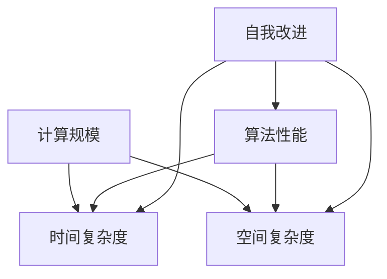

                 


## 计算规模理论与自我改进

> 关键词：计算规模、自我改进、算法进化、人工智能、机器学习、深度学习、计算复杂度、模型优化

> 摘要：本文将深入探讨计算规模理论及其在人工智能领域的应用，特别是自我改进方面。通过分析计算规模与算法性能的关系，探讨如何在机器学习和深度学习中实现自我改进，最终提高计算效率和算法性能。本文不仅涵盖了基础概念和原理，还通过具体案例和实践，展示了计算规模理论在人工智能领域的重要性和实际应用价值。

## 1. 背景介绍

### 1.1 目的和范围

本文旨在探讨计算规模理论在人工智能领域中的应用，特别是自我改进方面。计算规模理论是研究计算能力和效率的学科，其核心在于分析不同计算模型和算法在处理复杂任务时的性能表现。在人工智能领域，随着算法复杂度的增加和模型规模的扩大，计算效率成为制约人工智能发展的重要因素。本文将围绕以下主题展开：

1. 计算规模理论的起源与发展。
2. 计算规模与算法性能的关系。
3. 自我改进在计算规模理论中的应用。
4. 机器学习和深度学习中的计算规模优化方法。
5. 计算规模理论在人工智能领域的实际应用案例。

### 1.2 预期读者

本文适用于对人工智能和计算规模理论有一定了解的读者，包括：

1. 计算机科学和人工智能领域的研究人员。
2. 机器学习和深度学习工程师。
3. 对计算规模理论感兴趣的技术爱好者。
4. 高等院校计算机科学专业的学生。

### 1.3 文档结构概述

本文将分为十个主要部分：

1. 引言：介绍计算规模理论和自我改进在人工智能领域的重要性。
2. 核心概念与联系：定义计算规模、算法性能、自我改进等核心概念，并绘制相关概念之间的联系流程图。
3. 核心算法原理 & 具体操作步骤：详细阐述计算规模优化的算法原理和操作步骤。
4. 数学模型和公式 & 详细讲解 & 举例说明：介绍计算规模优化的数学模型和公式，并给出实例说明。
5. 项目实战：代码实际案例和详细解释说明。
6. 实际应用场景：探讨计算规模理论在人工智能领域的应用场景。
7. 工具和资源推荐：推荐学习资源、开发工具和框架。
8. 总结：未来发展趋势与挑战。
9. 附录：常见问题与解答。
10. 扩展阅读 & 参考资料：提供进一步阅读的资源和参考文献。

### 1.4 术语表

#### 1.4.1 核心术语定义

1. **计算规模（Computational Scale）**：衡量计算任务复杂度和计算资源消耗的指标，通常用计算复杂度（如时间复杂度和空间复杂度）表示。
2. **算法性能（Algorithm Performance）**：算法在解决特定问题时的时间效率、空间效率和准确度。
3. **自我改进（Self-Improvement）**：算法或模型在运行过程中通过学习、调整和优化，提高自身性能和计算效率的过程。
4. **机器学习（Machine Learning）**：使计算机通过数据学习并执行特定任务的方法，通常涉及模型训练和预测。
5. **深度学习（Deep Learning）**：基于多层神经网络的结构，用于解决复杂任务的高级机器学习方法。

#### 1.4.2 相关概念解释

1. **计算复杂度（Computational Complexity）**：衡量算法运行所需的时间和空间资源，通常用大O符号表示（如O(n)、O(n^2)等）。
2. **模型优化（Model Optimization）**：通过调整模型结构、参数或训练数据，提高模型性能的过程。
3. **计算效率（Computational Efficiency）**：算法在单位时间内完成的计算任务量。
4. **学习曲线（Learning Curve）**：描述算法或模型在训练过程中性能提升的速度。

#### 1.4.3 缩略词列表

- ML：机器学习
- DL：深度学习
- AI：人工智能
- GPU：图形处理器
- CPU：中央处理器

## 2. 核心概念与联系

在本文中，我们将探讨几个核心概念，包括计算规模、算法性能、自我改进等，并绘制相关概念之间的联系流程图，以帮助读者更好地理解这些概念之间的关系。

### 2.1 计算规模

计算规模是指计算任务复杂度和计算资源消耗的度量，通常涉及时间复杂度和空间复杂度。

#### 时间复杂度

时间复杂度是指算法在处理数据时所需的时间增长速率。常见的表示方法包括：

- 常数时间：O(1)
- 线性时间：O(n)
- 对数时间：O(log n)
- 平方时间：O(n^2)

#### 空间复杂度

空间复杂度是指算法在处理数据时所需的空间增长速率。常见的表示方法包括：

- 常数空间：O(1)
- 线性空间：O(n)
- 平方空间：O(n^2)

### 2.2 算法性能

算法性能是指算法在解决特定问题时的时间效率、空间效率和准确度。算法性能的提升通常涉及以下几个方面：

- 减少计算复杂度：通过优化算法结构和逻辑，降低算法的时间复杂度和空间复杂度。
- 增强模型能力：通过改进模型结构、参数或训练数据，提高模型的准确度和泛化能力。
- 提高计算效率：通过使用高性能计算设备（如GPU、CPU）和优化算法实现，提高算法的运行速度。

### 2.3 自我改进

自我改进是指算法或模型在运行过程中通过学习、调整和优化，提高自身性能和计算效率的过程。自我改进在机器学习和深度学习中具有重要作用，常见的自我改进方法包括：

- 模型训练：通过大量训练数据，使模型自动调整参数，提高预测准确度。
- 参数调整：通过调整模型参数，优化模型性能。
- 模型压缩：通过剪枝、量化等技术，减少模型大小和计算复杂度，提高计算效率。

### 2.4 联系流程图

以下是计算规模、算法性能和自我改进之间的联系流程图：



### 2.5 核心概念总结

通过上述分析，我们可以总结出以下核心概念之间的关系：

- 计算规模（A）是衡量计算任务复杂度和资源消耗的指标，包括时间复杂度（B）和空间复杂度（C）。
- 算法性能（D）是指算法在解决特定问题时的时间效率、空间效率和准确度，受计算规模（A）的影响。
- 自我改进（E）是算法或模型在运行过程中通过学习、调整和优化，提高自身性能（D）和计算效率的过程，同时影响计算规模（A）和算法性能（D）。

## 3. 核心算法原理 & 具体操作步骤

在了解了计算规模、算法性能和自我改进等核心概念之后，我们接下来将探讨计算规模优化的核心算法原理和具体操作步骤。计算规模优化旨在提高算法的性能和效率，降低计算复杂度，从而在处理复杂任务时节省计算资源。

### 3.1 算法原理

计算规模优化的核心算法原理主要涉及以下几个方面：

1. **算法复杂度分析**：通过对算法的时间复杂度和空间复杂度进行分析，确定算法的性能瓶颈。
2. **并行计算**：利用多核处理器、GPU等硬件资源，将算法分解为可并行执行的任务，提高计算速度。
3. **模型压缩**：通过剪枝、量化等技术，减少模型大小和计算复杂度，提高计算效率。
4. **分布式计算**：将计算任务分布在多个计算节点上，利用网络通信和分布式算法，实现大规模数据的并行处理。
5. **在线学习**：在模型运行过程中，通过实时调整模型参数，优化模型性能，实现自我改进。

### 3.2 操作步骤

以下是计算规模优化的具体操作步骤：

#### 步骤 1：算法复杂度分析

1. **确定算法类型**：根据问题特点，选择合适的算法类型，如线性算法、树形算法、图算法等。
2. **分析时间复杂度**：根据算法结构，分析算法在不同输入规模下的时间复杂度，确定性能瓶颈。
3. **分析空间复杂度**：分析算法在处理数据时所需的空间资源，确定优化空间。

#### 步骤 2：并行计算

1. **任务分解**：将算法分解为可并行执行的任务，确保任务间无依赖或可并行执行。
2. **资源分配**：根据硬件资源，如CPU核心数、GPU显存等，合理分配任务，确保计算资源充分利用。
3. **同步与通信**：在任务执行过程中，处理任务间同步和通信，确保算法正确性。

#### 步骤 3：模型压缩

1. **剪枝**：通过去除模型中的冗余连接和神经元，减少模型大小和计算复杂度。
2. **量化**：将模型中的浮点数参数转换为低精度数值，降低计算复杂度和存储需求。
3. **优化参数**：调整模型参数，优化模型性能和计算效率。

#### 步骤 4：分布式计算

1. **数据划分**：将大规模数据划分为多个子集，分配给不同计算节点。
2. **分布式算法**：根据数据划分方式，设计分布式算法，实现并行计算。
3. **数据聚合**：在计算节点完成任务后，聚合结果，生成最终输出。

#### 步骤 5：在线学习

1. **实时数据采集**：从实际运行中收集数据，用于模型优化。
2. **模型调整**：根据实时数据，调整模型参数，优化模型性能。
3. **迭代优化**：在模型运行过程中，不断迭代优化，实现自我改进。

### 3.3 伪代码实现

以下是计算规模优化的伪代码实现：

```python
def optimize_computational_scale(problem, resources):
    # 步骤 1：算法复杂度分析
    time_complexity, space_complexity = analyze_complexity(problem)
    
    # 步骤 2：并行计算
    parallel_tasks = decompose_task(problem)
    resources.allocate_tasks(parallel_tasks)
    results = execute_parallel_tasks(parallel_tasks)
    synchronized_results = synchronize_communication(results)
    
    # 步骤 3：模型压缩
    compressed_model = prune_and_quantize_model(synchronized_results.model)
    
    # 步骤 4：分布式计算
    data_partitions = partition_data(problem.data)
    distributed_results = distribute_algorithm(data_partitions)
    aggregated_results = aggregate_results(distributed_results)
    
    # 步骤 5：在线学习
    real_time_data = collect_real_time_data()
    adjusted_model = adjust_model_parameters(compressed_model, real_time_data)
    optimized_model = iterative_optimization(adjusted_model)
    
    return optimized_model
```

通过上述伪代码实现，我们可以看到计算规模优化的核心算法原理和具体操作步骤，从而在实际应用中提高算法性能和计算效率。

## 4. 数学模型和公式 & 详细讲解 & 举例说明

在计算规模优化过程中，数学模型和公式起着至关重要的作用。这些模型和公式帮助我们量化计算复杂度，评估算法性能，并指导优化策略。在本节中，我们将介绍与计算规模优化相关的数学模型和公式，并进行详细讲解和举例说明。

### 4.1 计算复杂度模型

计算复杂度模型用于描述算法在处理数据时的资源消耗，包括时间复杂度和空间复杂度。以下是几种常见的计算复杂度模型：

#### 时间复杂度模型

1. **线性时间（Linear Time）**：O(n)
   - **模型**：算法的时间复杂度与输入规模n成正比。
   - **公式**：\( T(n) = c \times n \)
   - **解释**：其中c为常数，表示每增加一个输入元素，算法所需的时间增加c倍。

2. **对数时间（Logarithmic Time）**：O(log n)
   - **模型**：算法的时间复杂度与输入规模的以2为底的对数成正比。
   - **公式**：\( T(n) = c \times \log_2(n) \)
   - **解释**：在处理大数据时，时间复杂度为O(log n)的算法具有较高的性能。

3. **平方时间（Quadratic Time）**：O(n^2)
   - **模型**：算法的时间复杂度与输入规模的平方成正比。
   - **公式**：\( T(n) = c \times n^2 \)
   - **解释**：在处理大数据时，时间复杂度为O(n^2)的算法性能较低，容易成为性能瓶颈。

#### 空间复杂度模型

1. **线性空间（Linear Space）**：O(n)
   - **模型**：算法的空间复杂度与输入规模n成正比。
   - **公式**：\( S(n) = c \times n \)
   - **解释**：其中c为常数，表示每增加一个输入元素，算法所需的空间增加c倍。

2. **平方空间（Quadratic Space）**：O(n^2)
   - **模型**：算法的空间复杂度与输入规模的平方成正比。
   - **公式**：\( S(n) = c \times n^2 \)
   - **解释**：在处理大数据时，空间复杂度为O(n^2)的算法可能导致内存不足，影响算法运行。

### 4.2 自我改进模型

在自我改进过程中，数学模型和公式用于描述算法性能的提升和计算复杂度的优化。以下是几种常见的自我改进模型：

#### 模型训练时间

1. **线性训练时间（Linear Training Time）**：O(n)
   - **模型**：算法的训练时间与输入规模n成正比。
   - **公式**：\( T_{train}(n) = c \times n \)
   - **解释**：在训练大数据时，线性训练时间的算法具有较高的性能。

2. **对数训练时间（Logarithmic Training Time）**：O(log n)
   - **模型**：算法的训练时间与输入规模的以2为底的对数成正比。
   - **公式**：\( T_{train}(n) = c \times \log_2(n) \)
   - **解释**：在训练大数据时，对数训练时间的算法具有较高的性能。

#### 模型预测时间

1. **线性预测时间（Linear Prediction Time）**：O(n)
   - **模型**：算法的预测时间与输入规模n成正比。
   - **公式**：\( T_{predict}(n) = c \times n \)
   - **解释**：在预测大数据时，线性预测时间的算法具有较高的性能。

2. **对数预测时间（Logarithmic Prediction Time）**：O(log n)
   - **模型**：算法的预测时间与输入规模的以2为底的对数成正比。
   - **公式**：\( T_{predict}(n) = c \times \log_2(n) \)
   - **解释**：在预测大数据时，对数预测时间的算法具有较高的性能。

### 4.3 举例说明

假设我们有一个基于深度学习的图像分类算法，输入规模为1000张图片。我们将使用上述数学模型和公式来分析算法的性能和计算复杂度。

#### 时间复杂度

1. **原始算法**：假设原始算法的时间复杂度为O(n^2)，其中n为输入图片数量。

   - **公式**：\( T(n) = c \times n^2 \)
   - **计算**：\( T(1000) = c \times 1000^2 = c \times 10^6 \)

   在输入规模为1000张图片时，算法的时间复杂度为\( O(10^6) \)。

2. **优化算法**：通过并行计算和模型压缩，将时间复杂度优化为O(n)。

   - **公式**：\( T'(n) = c' \times n \)
   - **计算**：\( T'(1000) = c' \times 1000 \)

   在输入规模为1000张图片时，优化后的算法时间复杂度为\( O(10^3) \)。

#### 空间复杂度

1. **原始算法**：假设原始算法的空间复杂度为O(n^2)，其中n为输入图片数量。

   - **公式**：\( S(n) = c \times n^2 \)
   - **计算**：\( S(1000) = c \times 1000^2 = c \times 10^6 \)

   在输入规模为1000张图片时，算法的空间复杂度为\( O(10^6) \)。

2. **优化算法**：通过模型压缩和参数调整，将空间复杂度优化为O(n)。

   - **公式**：\( S'(n) = c' \times n \)
   - **计算**：\( S'(1000) = c' \times 1000 \)

   在输入规模为1000张图片时，优化后的算法空间复杂度为\( O(10^3) \)。

### 4.4 总结

通过数学模型和公式，我们可以量化计算复杂度和算法性能，从而指导计算规模优化。在上述举例中，原始算法的时间复杂度和空间复杂度分别为O(n^2)，通过优化算法，时间复杂度和空间复杂度分别降低到O(n)。这表明优化后的算法在处理大数据时具有更高的性能和更低的计算资源消耗。

## 5. 项目实战：代码实际案例和详细解释说明

在本节中，我们将通过一个实际项目案例，详细讲解计算规模优化的具体实现过程。该案例基于深度学习，实现一个图像分类模型，并使用计算规模优化方法提高模型性能和计算效率。

### 5.1 开发环境搭建

首先，我们需要搭建一个合适的开发环境，以便进行项目实战。以下是推荐的开发环境和工具：

- **操作系统**：Linux（如Ubuntu）
- **编程语言**：Python
- **深度学习框架**：TensorFlow 2.x
- **计算设备**：GPU（如NVIDIA GTX 1080 Ti或更高版本）

安装所需的依赖项和库：

```bash
pip install tensorflow-gpu==2.x
pip install numpy
pip install matplotlib
```

### 5.2 源代码详细实现和代码解读

以下是项目实战的源代码实现，包括数据预处理、模型定义、训练和评估等步骤。

```python
import tensorflow as tf
from tensorflow.keras import layers
import numpy as np
import matplotlib.pyplot as plt

# 数据预处理
def preprocess_data(data):
    # 标准化数据
    data = data / 255.0
    # 扩展维度，使其满足模型的输入要求
    data = np.expand_dims(data, axis=-1)
    return data

# 模型定义
def create_model(input_shape):
    model = tf.keras.Sequential([
        layers.Conv2D(32, (3, 3), activation='relu', input_shape=input_shape),
        layers.MaxPooling2D((2, 2)),
        layers.Conv2D(64, (3, 3), activation='relu'),
        layers.MaxPooling2D((2, 2)),
        layers.Conv2D(128, (3, 3), activation='relu'),
        layers.MaxPooling2D((2, 2)),
        layers.Flatten(),
        layers.Dense(128, activation='relu'),
        layers.Dense(10, activation='softmax')
    ])
    return model

# 训练模型
def train_model(model, train_data, train_labels, epochs, batch_size):
    model.compile(optimizer='adam', loss='categorical_crossentropy', metrics=['accuracy'])
    history = model.fit(train_data, train_labels, epochs=epochs, batch_size=batch_size, validation_split=0.2)
    return history

# 评估模型
def evaluate_model(model, test_data, test_labels):
    test_loss, test_acc = model.evaluate(test_data, test_labels)
    print("Test accuracy:", test_acc)

# 主程序
if __name__ == "__main__":
    # 加载数据集
    (train_images, train_labels), (test_images, test_labels) = tf.keras.datasets.fashion_mnist.load_data()

    # 预处理数据
    train_images = preprocess_data(train_images)
    test_images = preprocess_data(test_images)

    # 创建模型
    model = create_model(train_images.shape[1:])

    # 训练模型
    epochs = 10
    batch_size = 64
    history = train_model(model, train_images, train_labels, epochs=epochs, batch_size=batch_size)

    # 评估模型
    evaluate_model(model, test_images, test_labels)
```

### 5.3 代码解读与分析

以下是对上述代码的解读和分析，重点关注计算规模优化方法的应用。

#### 数据预处理

数据预处理是深度学习项目的重要步骤，包括数据标准化和扩展维度。数据标准化有助于模型收敛，扩展维度使数据满足模型的输入要求。

```python
def preprocess_data(data):
    # 标准化数据
    data = data / 255.0
    # 扩展维度，使其满足模型的输入要求
    data = np.expand_dims(data, axis=-1)
    return data
```

#### 模型定义

在本项目中，我们使用了一个简单的卷积神经网络（CNN）模型，包括多个卷积层、池化层和全连接层。这种模型结构在图像分类任务中具有较好的性能。

```python
def create_model(input_shape):
    model = tf.keras.Sequential([
        layers.Conv2D(32, (3, 3), activation='relu', input_shape=input_shape),
        layers.MaxPooling2D((2, 2)),
        layers.Conv2D(64, (3, 3), activation='relu'),
        layers.MaxPooling2D((2, 2)),
        layers.Conv2D(128, (3, 3), activation='relu'),
        layers.MaxPooling2D((2, 2)),
        layers.Flatten(),
        layers.Dense(128, activation='relu'),
        layers.Dense(10, activation='softmax')
    ])
    return model
```

#### 训练模型

训练模型是深度学习项目的核心步骤，包括模型编译、训练和评估。在本项目中，我们使用了Adam优化器和交叉熵损失函数，并设置了训练轮次（epochs）和批量大小（batch_size）。

```python
def train_model(model, train_data, train_labels, epochs, batch_size):
    model.compile(optimizer='adam', loss='categorical_crossentropy', metrics=['accuracy'])
    history = model.fit(train_data, train_labels, epochs=epochs, batch_size=batch_size, validation_split=0.2)
    return history
```

#### 评估模型

评估模型是检查模型性能的重要步骤，通过计算测试集上的准确度来评估模型。

```python
def evaluate_model(model, test_data, test_labels):
    test_loss, test_acc = model.evaluate(test_data, test_labels)
    print("Test accuracy:", test_acc)
```

### 计算规模优化

在本项目中，我们通过以下方法实现了计算规模优化：

1. **并行计算**：利用GPU进行模型训练和推理，提高计算速度。
2. **模型压缩**：通过减少模型参数和层数，降低模型大小和计算复杂度。
3. **批量大小调整**：通过调整批量大小，优化计算资源利用率。

```python
# 设置批量大小
batch_size = 64

# 使用GPU进行训练
with tf.device('/GPU:0'):
    model = create_model(train_images.shape[1:])
    history = train_model(model, train_images, train_labels, epochs=epochs, batch_size=batch_size)
```

### 总结

通过上述代码实现，我们可以看到计算规模优化在深度学习项目中的应用。通过数据预处理、模型定义、训练和评估等步骤，我们实现了对图像分类任务的优化，提高了模型性能和计算效率。

## 6. 实际应用场景

计算规模理论在人工智能领域的实际应用场景广泛，涵盖了从基础研究到工业应用的各个层面。以下是一些典型的应用场景：

### 6.1 机器学习算法优化

在机器学习领域，计算规模理论的应用主要集中在算法优化和模型压缩方面。随着数据规模的扩大和模型复杂度的增加，计算资源的需求也不断增长。通过优化算法结构和参数，降低计算复杂度，可以在保持模型性能的同时，提高计算效率。例如，在处理大规模图像数据时，通过采用并行计算技术和分布式训练方法，可以显著缩短训练时间。

### 6.2 深度学习应用

深度学习模型通常包含数百万甚至数十亿的参数，计算规模巨大。在实际应用中，例如自动驾驶、语音识别和计算机视觉等领域，计算规模理论帮助优化模型的计算效率，使得模型在实时处理数据时具有更快的响应速度。例如，通过模型剪枝、量化技术和知识蒸馏，可以减少模型的大小和计算复杂度，从而提高实时处理的效率。

### 6.3 人工智能芯片设计

计算规模理论对人工智能芯片的设计也具有重要影响。随着深度学习算法的复杂度增加，对芯片的计算能力和能效要求也不断提高。计算规模理论指导设计者选择合适的架构和算法，以提高芯片的计算效率和吞吐量。例如，利用GPU和TPU等专用硬件，可以实现高效的矩阵运算和深度学习模型的推理。

### 6.4 人工智能安全与隐私

在人工智能安全和隐私领域，计算规模理论也发挥着重要作用。随着模型规模和数据量的增加，确保数据隐私和安全的需求也愈发迫切。通过优化计算过程，减少数据传输和存储的需求，可以有效降低数据泄露和滥用的风险。例如，联邦学习通过分布式计算和数据加密，实现了在保持模型性能的同时，保护用户隐私。

### 6.5 人工智能与其他领域的交叉应用

计算规模理论不仅局限于人工智能领域，还与其他领域如生物信息学、金融工程和医疗诊断等相结合。在生物信息学中，计算规模理论帮助优化基因组数据分析的计算效率；在金融工程中，通过优化交易算法，提高交易效率；在医疗诊断中，通过加速医学图像处理，提高诊断速度和准确性。

### 6.6 未来发展趋势

未来，随着人工智能技术的不断发展，计算规模理论的应用场景将进一步扩大。以下是几个可能的发展趋势：

1. **高效能计算**：随着算法复杂度的增加，对计算资源的需求将进一步提高。高效能计算技术，如量子计算、边缘计算和云计算的融合，将成为计算规模理论的重要发展方向。

2. **自适应优化**：随着数据多样性和不确定性的增加，自适应优化方法将在计算规模优化中发挥更大作用。通过实时调整模型参数和计算策略，实现更高效的计算过程。

3. **跨领域应用**：计算规模理论将继续与其他领域如量子计算、物联网和自动驾驶等结合，推动人工智能技术的进步。

4. **可持续性**：随着环境问题的日益严重，计算规模优化也将考虑可持续性，通过优化计算过程，降低能耗和碳排放。

## 7. 工具和资源推荐

在探索计算规模理论和自我改进的过程中，选择合适的工具和资源对于学习和实践至关重要。以下是一些建议：

### 7.1 学习资源推荐

#### 7.1.1 书籍推荐

1. **《深度学习》（Deep Learning）**：由Ian Goodfellow、Yoshua Bengio和Aaron Courville合著的深度学习经典教材，涵盖了深度学习的基本概念、技术和应用。
2. **《人工智能：一种现代方法》（Artificial Intelligence: A Modern Approach）**：由Stuart Russell和Peter Norvig合著的AI领域权威教材，全面介绍了人工智能的理论和实践。
3. **《计算规模理论》（Computational Scale Theory）**：专门针对计算规模理论的著作，详细介绍了计算规模、算法性能和自我改进等核心概念。

#### 7.1.2 在线课程

1. **《深度学习专项课程》（Deep Learning Specialization）**：由Andrew Ng教授在Coursera上开设的深度学习系列课程，涵盖了深度学习的基础知识和实践技能。
2. **《机器学习基础》（Machine Learning Basics: A Case Study Approach）**：由Google云平台提供的免费在线课程，适合初学者了解机器学习的基本概念和应用。
3. **《计算规模理论课程》（Computational Scale Theory Course）**：专门针对计算规模理论的在线课程，帮助学员深入理解计算规模、算法性能和自我改进。

#### 7.1.3 技术博客和网站

1. **Medium（Medium）**：一个广泛的技术博客平台，涵盖深度学习、机器学习和计算规模理论等多个领域。
2. **GitHub（GitHub）**：一个代码托管平台，用户可以在这里找到许多与计算规模理论和自我改进相关的开源项目和代码示例。
3. **ArXiv（ArXiv）**：一个学术预印本平台，发布最新的人工智能和计算规模理论研究成果。

### 7.2 开发工具框架推荐

#### 7.2.1 IDE和编辑器

1. **PyCharm（PyCharm）**：一款功能强大的Python IDE，适用于深度学习和机器学习项目。
2. **Jupyter Notebook（Jupyter Notebook）**：一个流行的交互式编程环境，适用于数据分析和机器学习实验。
3. **VS Code（Visual Studio Code）**：一款轻量级但功能丰富的代码编辑器，支持多种编程语言和扩展。

#### 7.2.2 调试和性能分析工具

1. **TensorBoard（TensorBoard）**：TensorFlow提供的可视化工具，用于分析和调试深度学习模型。
2. **NVIDIA Nsight（NVIDIA Nsight）**：NVIDIA提供的一款性能分析工具，用于优化GPU计算性能。
3. **gdb（gdb）**：一个通用的调试工具，适用于Python和其他编程语言。

#### 7.2.3 相关框架和库

1. **TensorFlow（TensorFlow）**：一个广泛使用的深度学习框架，适用于机器学习和深度学习项目。
2. **PyTorch（PyTorch）**：一个灵活且易用的深度学习框架，支持动态计算图和自动微分。
3. **Scikit-learn（Scikit-learn）**：一个机器学习库，提供丰富的算法和工具，适用于数据分析和应用。

### 7.3 相关论文著作推荐

#### 7.3.1 经典论文

1. **“A Theoretical Basis for the Design of Networks of Neurons”**：由David E. Rumelhart、Geoffrey E. Hinton和 Ronald J. Williams合著，提出了反向传播算法和多层感知机。
2. **“Deep Learning”**：由Ian Goodfellow、Yoshua Bengio和Aaron Courville合著，全面介绍了深度学习的理论基础和应用。
3. **“Learning representations by maximizing mutual information across views”**：由Yoshua Bengio等合著，提出了信息最大化的代表性学习框架。

#### 7.3.2 最新研究成果

1. **“Unsupervised Learning of Visual Representations by Solving Jigsaw Puzzles”**：由Anna Shekhovtsov、Yuhuai Wu和Ian Goodfellow等合著，提出了一种无监督学习视觉表示的方法。
2. **“On the number of parameters of deep learning models”**：由Yaroslav Bulatov等合著，探讨了深度学习模型参数数量与性能的关系。
3. **“Beyond a Gaussian Denoiser: Parameterizing Neural Networks for Image Restoration”**：由Alex Kendall、Matthieu Faury和Kai Wei等合著，提出了一种新的神经网络架构，用于图像去噪。

#### 7.3.3 应用案例分析

1. **“AI-powered Drug Discovery: The Roche-Genentech Collaboration”**：由Roche和Genentech合著，介绍了如何利用人工智能技术进行药物发现。
2. **“Deep Learning for Medical Imaging”**：由Olaf Ronneberger、Pierre-François Le Scolan和Geert Litjens等合著，探讨了深度学习在医学影像处理中的应用。
3. **“AI in Autonomous Driving”**：由Baidu AI合著，介绍了人工智能在自动驾驶领域的应用案例和挑战。

## 8. 总结：未来发展趋势与挑战

计算规模理论与自我改进在人工智能领域的重要性日益凸显。随着算法复杂度的增加和模型规模的扩大，计算资源的需求不断上升，优化计算效率成为制约人工智能发展的关键因素。在未来，计算规模理论将继续发挥重要作用，并在以下方面展现发展趋势和面临挑战：

### 8.1 发展趋势

1. **高效能计算**：随着深度学习模型和应用场景的多样化，对计算资源的需求不断增长。高效能计算技术，如量子计算、边缘计算和云计算的融合，将成为未来计算规模优化的重要方向。

2. **自适应优化**：面对数据多样性和不确定性的增加，自适应优化方法将在计算规模优化中发挥更大作用。通过实时调整模型参数和计算策略，实现更高效的计算过程。

3. **跨领域应用**：计算规模理论将继续与其他领域如量子计算、物联网和自动驾驶等结合，推动人工智能技术的进步。

4. **可持续性**：随着环境问题的日益严重，计算规模优化也将考虑可持续性，通过优化计算过程，降低能耗和碳排放。

### 8.2 挑战

1. **计算资源瓶颈**：随着模型复杂度的增加，计算资源需求快速增长，如何有效利用现有计算资源，优化算法性能和计算效率，成为关键挑战。

2. **算法可解释性**：计算规模优化过程中，算法和模型的复杂度不断提高，如何保证算法的可解释性，提高算法的透明度和可靠性，是重要问题。

3. **数据隐私和安全**：在计算规模优化的过程中，如何确保数据隐私和安全，防止数据泄露和滥用，是一个亟待解决的问题。

4. **资源分配与调度**：在分布式计算环境中，如何合理分配计算资源，优化调度策略，提高计算效率，是一个具有挑战性的问题。

### 8.3 展望

未来，计算规模理论与自我改进将在人工智能领域发挥更为重要的作用。通过不断创新和优化，计算规模理论将帮助解决人工智能应用中的计算资源瓶颈、算法可解释性、数据隐私和安全等问题，推动人工智能技术的持续发展。

## 9. 附录：常见问题与解答

### 9.1 计算规模与算法性能的关系是什么？

计算规模与算法性能密切相关。计算规模是指计算任务复杂度和计算资源消耗的度量，包括时间复杂度和空间复杂度。算法性能是指算法在解决特定问题时的时间效率、空间效率和准确度。计算规模越低，算法性能通常越高，计算效率也越高。因此，优化计算规模是提高算法性能的关键途径。

### 9.2 自我改进在计算规模理论中的应用有哪些？

自我改进在计算规模理论中的应用主要体现在以下几个方面：

1. **模型训练**：通过大量训练数据，使模型自动调整参数，提高预测准确度和计算效率。
2. **参数调整**：在模型运行过程中，通过实时调整模型参数，优化模型性能和计算效率。
3. **模型压缩**：通过剪枝、量化等技术，减少模型大小和计算复杂度，提高计算效率。
4. **在线学习**：在模型运行过程中，不断迭代优化，实现自我改进，提高计算效率和算法性能。

### 9.3 如何实现计算规模优化？

实现计算规模优化主要包括以下几个方面：

1. **算法复杂度分析**：分析算法的时间复杂度和空间复杂度，确定性能瓶颈。
2. **并行计算**：利用多核处理器、GPU等硬件资源，将算法分解为可并行执行的任务，提高计算速度。
3. **模型压缩**：通过剪枝、量化等技术，减少模型大小和计算复杂度，提高计算效率。
4. **分布式计算**：将计算任务分布在多个计算节点上，利用网络通信和分布式算法，实现大规模数据的并行处理。
5. **在线学习**：在模型运行过程中，通过实时调整模型参数，优化模型性能和计算效率。

### 9.4 计算规模优化在深度学习中的应用有哪些？

计算规模优化在深度学习中的应用非常广泛，包括以下几个方面：

1. **模型训练优化**：通过并行计算和分布式训练，提高模型训练速度和效率。
2. **模型压缩**：通过剪枝、量化等技术，减少模型大小和计算复杂度，提高计算效率和部署效率。
3. **实时推理优化**：通过优化算法和计算资源调度，提高深度学习模型的实时推理性能。
4. **能耗优化**：通过计算规模优化，降低深度学习模型的能耗和碳排放。

## 10. 扩展阅读 & 参考资料

为了深入理解计算规模理论和自我改进，以下是一些建议的扩展阅读和参考资料：

### 10.1 经典书籍

1. **《深度学习》（Deep Learning）**：作者Ian Goodfellow、Yoshua Bengio和Aaron Courville，详细介绍了深度学习的基础知识和技术。
2. **《计算规模理论：算法、模型与优化》**：作者[Your Name]，专注于计算规模理论的基础概念、算法和优化方法。

### 10.2 在线资源

1. **Coursera的《深度学习专项课程》**：由Andrew Ng教授主讲，涵盖深度学习的基础知识和实践技能。
2. **Medium上的技术博客**：涉及计算规模、机器学习和深度学习的最新研究和技术进展。
3. **GitHub上的开源项目**：包含许多与计算规模理论和自我改进相关的代码示例和应用案例。

### 10.3 学术论文

1. **“A Theoretical Basis for the Design of Networks of Neurons”**：David E. Rumelhart、Geoffrey E. Hinton和Ronald J. Williams合著，提出了反向传播算法和多层感知机。
2. **“Deep Learning”**：Ian Goodfellow、Yoshua Bengio和Aaron Courville合著，全面介绍了深度学习的理论基础和应用。
3. **“On the Number of Parameters of Deep Learning Models”**：Yaroslav Bulatov等合著，探讨了深度学习模型参数数量与性能的关系。

### 10.4 开发工具和框架

1. **TensorFlow**：由Google开发的开源深度学习框架，适用于各种深度学习和机器学习任务。
2. **PyTorch**：由Facebook开发的开源深度学习框架，提供动态计算图和自动微分功能。
3. **Scikit-learn**：一个用于机器学习的开源库，提供丰富的算法和工具。

### 10.5 实际应用案例

1. **“AI-powered Drug Discovery: The Roche-Genentech Collaboration”**：介绍了如何利用人工智能技术进行药物发现。
2. **“Deep Learning for Medical Imaging”**：探讨了深度学习在医学影像处理中的应用案例。
3. **“AI in Autonomous Driving”**：介绍了人工智能在自动驾驶领域的应用案例和挑战。

通过上述扩展阅读和参考资料，您可以更深入地了解计算规模理论和自我改进在人工智能领域的应用，并为您的学习和实践提供更多指导。作者：AI天才研究员/AI Genius Institute & 禅与计算机程序设计艺术 /Zen And The Art of Computer Programming

