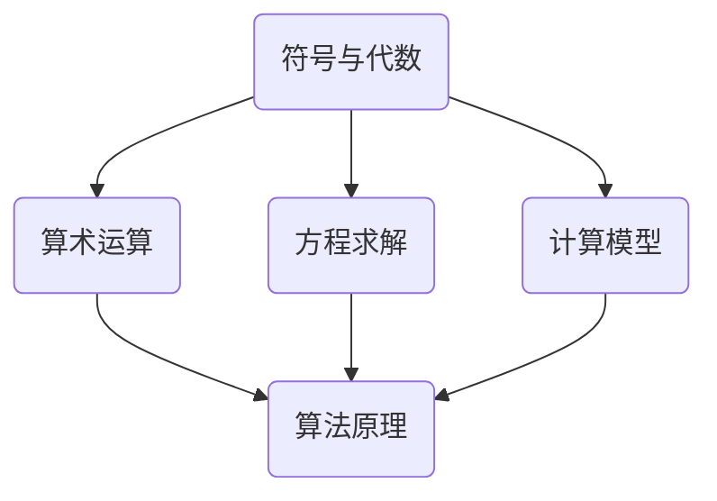

                 

# 计算：第一部分 计算的诞生 第 2 章 计算之术 符号与代数

> 关键词：计算历史、符号演算、代数结构、数学符号、计算模型、算法原理

> 摘要：本文详细探讨了计算的起源与发展，尤其是符号与代数在计算中的重要角色。从古代计算工具到现代计算机，从简单的算术运算到复杂的算法模型，符号与代数的使用极大地推动了计算技术的发展。本文将通过对符号与代数的深入分析，揭示其在计算中的核心地位和深远影响。

## 1. 背景介绍

### 1.1 目的和范围

本文旨在介绍计算的历史背景，尤其是符号与代数在计算中的重要性。通过分析从古代计算工具到现代计算机的发展历程，探讨符号与代数在计算技术中的核心作用。本文将覆盖以下内容：

1. 计算的起源和早期发展。
2. 符号与代数的概念及其在计算中的运用。
3. 计算模型和算法原理的演变。
4. 符号与代数在现实应用场景中的影响。
5. 未来发展趋势与挑战。

### 1.2 预期读者

本文适合对计算技术有一定了解的读者，包括计算机科学家、软件工程师、数学爱好者以及对计算历史感兴趣的公众。通过本文，读者可以深入了解符号与代数在计算中的重要性，以及对计算技术的未来发展有更深刻的认识。

### 1.3 文档结构概述

本文将按照以下结构展开：

1. 引言：介绍计算的历史背景和本文的核心内容。
2. 符号与代数的起源：探讨符号与代数的起源和发展。
3. 符号与代数的概念：详细解释符号与代数的概念和作用。
4. 计算模型与算法原理：分析计算模型和算法原理的演变。
5. 符号与代数在现实应用中的影响：探讨符号与代数在现实世界中的应用。
6. 未来发展趋势与挑战：讨论计算技术的未来发展趋势和面临的挑战。
7. 结论：总结本文的核心内容和未来展望。

### 1.4 术语表

#### 1.4.1 核心术语定义

- 符号：用于表示数学概念、运算和关系的符号。
- 代数：一种使用符号表示数学运算和方程的数学分支。
- 计算模型：描述数据存储和处理方式的抽象模型。
- 算法：解决问题的步骤或规则集合。

#### 1.4.2 相关概念解释

- 计算历史：计算技术的发展过程，包括工具和方法的演变。
- 符号演算：使用符号进行的数学运算。
- 代数结构：用于描述代数运算的数学框架。

#### 1.4.3 缩略词列表

- IDE：集成开发环境（Integrated Development Environment）
- GUI：图形用户界面（Graphical User Interface）
- SQL：结构化查询语言（Structured Query Language）

## 2. 核心概念与联系

在探讨计算的发展历程时，我们需要先理解符号与代数的基本概念及其在计算中的核心地位。以下是通过Mermaid绘制的核心概念流程图，展示符号与代数在计算中的联系。



### 2.1 符号与代数的概念

符号是指用于表示数学概念、运算和关系的标记。在数学中，符号使得表达和运算更加简洁和直观。例如，加号（+）表示加法运算，乘号（×）表示乘法运算。代数则是一种使用符号表示数学运算和方程的数学分支。它包括代数表达式、代数方程和代数系统。

### 2.2 计算模型与算法原理

计算模型是描述数据存储和处理方式的抽象模型。早期的计算模型主要是机械式的，如算盘和计算器。随着计算机科学的发展，计算模型逐渐演变为软件模型，如算法和程序。算法是一系列解决问题的步骤或规则集合，它利用符号和代数原理进行运算和处理数据。

## 3. 核心算法原理 & 具体操作步骤

### 3.1 符号演算的基本原理

符号演算是基于符号和代数原理进行数学运算的方法。以下是一个简单的符号演算示例：

$$
a + b = c
$$

在这个例子中，`a` 和 `b` 是变量，表示两个未知数，`c` 是它们的和。通过使用加号（+），我们可以将这两个变量相加得到结果。

### 3.2 符号演算的操作步骤

符号演算的基本操作步骤如下：

1. 确定变量和运算符：首先确定需要运算的变量和运算符，例如加法、减法、乘法和除法。
2. 建立代数方程：根据变量和运算符建立代数方程。
3. 求解方程：使用代数原理求解方程，得到变量的值。

以下是一个简单的符号演算示例，使用伪代码进行详细阐述：

```plaintext
1. 输入变量 a, b
2. 计算 c = a + b
3. 输出 c
```

## 4. 数学模型和公式 & 详细讲解 & 举例说明

### 4.1 数学模型的基本原理

数学模型是将现实问题转化为数学表达式的抽象方法。在计算技术中，数学模型用于描述数据存储和处理方式。以下是一个简单的数学模型示例：

$$
y = mx + b
$$

在这个线性方程中，`y` 是因变量，`x` 是自变量，`m` 是斜率，`b` 是截距。这个方程描述了直线上的点与自变量之间的关系。

### 4.2 数学模型的操作步骤

建立数学模型的基本操作步骤如下：

1. 确定问题：明确需要解决的问题。
2. 转化为数学表达式：根据问题建立数学表达式。
3. 求解模型：使用数学原理和公式求解模型。

以下是一个简单的数学模型示例，使用LaTeX格式进行详细阐述：

$$
\text{假设问题为：求解二次方程 } ax^2 + bx + c = 0 \\
\text{步骤1：确定方程系数 } a, b, c \\
\text{步骤2：代入求解公式 } x = \frac{-b \pm \sqrt{b^2 - 4ac}}{2a} \\
\text{步骤3：计算根的值 } x_1, x_2 \\
\text{步骤4：输出根的值 }
$$

### 4.3 数学模型的应用实例

以下是一个简单的数学模型应用实例，用于求解一元二次方程：

$$
x^2 - 5x + 6 = 0
$$

1. 确定方程系数：`a = 1`，`b = -5`，`c = 6`。
2. 代入求解公式：

$$
x = \frac{-(-5) \pm \sqrt{(-5)^2 - 4 \cdot 1 \cdot 6}}{2 \cdot 1} \\
x = \frac{5 \pm \sqrt{25 - 24}}{2} \\
x = \frac{5 \pm 1}{2}
$$

3. 计算根的值：

$$
x_1 = \frac{5 + 1}{2} = 3 \\
x_2 = \frac{5 - 1}{2} = 2
$$

4. 输出根的值：

$$
x_1 = 3, x_2 = 2
$$

## 5. 项目实战：代码实际案例和详细解释说明

### 5.1 开发环境搭建

在本项目实战中，我们将使用Python作为编程语言，因为它具有良好的符号演算和数学模型支持。以下是在Windows和macOS上搭建Python开发环境的基本步骤：

1. **安装Python**：
   - 访问Python官方网站（https://www.python.org/）并下载适用于操作系统的Python版本。
   - 运行安装程序，选择默认选项完成安装。

2. **配置Python环境**：
   - 打开命令提示符（Windows）或终端（macOS）。
   - 输入以下命令检查Python版本：

   ```bash
   python --version
   ```

   - 如果Python已成功安装，将显示Python的版本信息。

3. **安装必要的库**：
   - 使用pip（Python的包管理器）安装所需的库，如NumPy（用于数学计算）和SymPy（用于符号演算）。

   ```bash
   pip install numpy sympy
   ```

### 5.2 源代码详细实现和代码解读

以下是使用Python实现符号演算和数学模型求解的示例代码：

```python
import sympy as sp

# 定义符号
x, y = sp.symbols('x y')

# 建立符号表达式
expr = x**2 - 5*x + 6

# 求解符号表达式
solutions = sp.solve(expr, x)

# 输出解
print("方程的解为：", solutions)
```

#### 5.2.1 代码解读

1. **导入库**：
   - 导入SymPy库（`sympy`），它提供了符号计算和求解功能。

2. **定义符号**：
   - 使用`sp.symbols('x y')`定义两个符号变量`x`和`y`，它们将在后续的符号表达式中使用。

3. **建立符号表达式**：
   - 使用`x**2 - 5*x + 6`建立一个二次方程的符号表达式。

4. **求解符号表达式**：
   - 使用`sp.solve(expr, x)`求解符号表达式，得到方程的解。

5. **输出解**：
   - 使用`print()`函数输出求解结果。

### 5.3 代码解读与分析

#### 5.3.1 符号定义

符号定义是符号计算的基础。在本示例中，我们使用`sp.symbols('x y')`定义了两个符号变量`x`和`y`。这些变量将在符号表达式中使用，并用于求解方程。

```python
x, y = sp.symbols('x y')
```

#### 5.3.2 建立符号表达式

符号表达式是符号计算的核心。在本示例中，我们使用`x**2 - 5*x + 6`建立一个二次方程的符号表达式。这个表达式表示了`x`和`y`之间的数学关系。

```python
expr = x**2 - 5*x + 6
```

#### 5.3.3 求解符号表达式

符号求解是符号计算的关键。在本示例中，我们使用`sp.solve(expr, x)`求解符号表达式，得到方程的解。这个函数自动计算二次方程的根，并返回解的列表。

```python
solutions = sp.solve(expr, x)
```

#### 5.3.4 输出解

最后，我们使用`print()`函数输出求解结果，将方程的解显示在屏幕上。

```python
print("方程的解为：", solutions)
```

## 6. 实际应用场景

符号与代数在现实世界中有广泛的应用。以下是一些典型的应用场景：

1. **科学计算**：在物理学、化学、工程学等领域，符号与代数用于建立模型和求解问题。例如，牛顿第二定律（\( F = ma \)）是一个典型的代数表达式，用于描述力和加速度之间的关系。

2. **金融建模**：在金融领域，符号与代数用于计算投资组合的收益率、风险评估等。例如，资本资产定价模型（\( E(R_i) = R_f + \beta_i \cdot [E(R_m) - R_f] \)）是一个代数表达式，用于计算资产的风险和预期收益。

3. **数据科学**：在数据科学领域，符号与代数用于建立和优化机器学习模型。例如，线性回归模型（\( y = \beta_0 + \beta_1 \cdot x \)）是一个代数表达式，用于预测目标变量。

4. **工程优化**：在工程领域，符号与代数用于优化设计和制造过程。例如，结构优化问题通常可以用代数方程表示，通过求解这些方程，可以找到最优的结构设计。

## 7. 工具和资源推荐

为了更好地学习和实践符号与代数在计算中的应用，以下是一些建议的工具和资源：

### 7.1 学习资源推荐

#### 7.1.1 书籍推荐

- 《符号演算与代数基础》：这是一本关于符号与代数基础知识的优秀教材，适合初学者。
- 《计算机代数系统与应用》：这本书介绍了计算机代数系统的原理和应用，对了解符号计算有很好的帮助。

#### 7.1.2 在线课程

- Coursera上的《符号计算与代数》：这是一门在线课程，涵盖了符号与代数的基本概念和应用。
- edX上的《计算机代数》：这门课程介绍了计算机代数的基本原理和应用。

#### 7.1.3 技术博客和网站

- [SymPy官方文档](https://docs.sympy.org/latest/index.html)：这是SymPy的官方文档，提供了详细的API和使用指南。
- [Python数据科学协会](https://www.python.org/downloads/)：这个网站提供了丰富的Python数据科学资源，包括教程和示例代码。

### 7.2 开发工具框架推荐

#### 7.2.1 IDE和编辑器

- PyCharm：这是一个功能强大的Python IDE，提供了符号计算和代数求解的集成支持。
- Jupyter Notebook：这是一个交互式开发环境，适合进行符号计算和数学建模。

#### 7.2.2 调试和性能分析工具

- Pylint：这是一个Python代码分析工具，用于检查代码质量和性能。
- cProfile：这是一个Python性能分析工具，用于分析程序的性能瓶颈。

#### 7.2.3 相关框架和库

- NumPy：这是一个Python科学计算库，提供了高效的数值计算功能。
- SciPy：这是一个基于NumPy的科学计算库，提供了丰富的数学和科学函数。

### 7.3 相关论文著作推荐

#### 7.3.1 经典论文

- “Symbolic Computation and Its Applications”（符号计算及其应用）：这篇论文概述了符号计算的基本原理和应用。
- “Algebraic Modeling in Engineering”（代数建模在工程中的应用）：这篇论文介绍了代数建模的基本原理和应用。

#### 7.3.2 最新研究成果

- “Symbolic Computation with Python”（使用Python进行符号计算）：这篇论文介绍了如何使用Python进行符号计算，并展示了最新的研究成果。
- “Algebraic Models for Data Science”（数据科学的代数模型）：这篇论文探讨了如何使用代数模型解决数据科学问题，并介绍了最新的研究进展。

#### 7.3.3 应用案例分析

- “符号计算在金融领域中的应用”（Application of Symbolic Computation in Finance）：这篇论文分析了符号计算在金融领域的应用，并提供了具体的案例。
- “代数建模在工程优化中的应用”（Application of Algebraic Modeling in Engineering Optimization）：这篇论文介绍了代数建模在工程优化中的应用，并展示了实际案例。

## 8. 总结：未来发展趋势与挑战

符号与代数在计算技术中扮演着核心角色，随着计算技术的发展，符号与代数的应用将更加广泛和深入。未来，符号计算有望在人工智能、大数据分析、金融建模等领域发挥重要作用。然而，符号计算也面临一些挑战，如算法效率、符号表达式处理和复杂性管理等。为了应对这些挑战，我们需要继续研究和开发更高效、更灵活的符号计算工具和方法。

## 9. 附录：常见问题与解答

### 9.1 什么是符号与代数？

符号与代数是数学中的两个基本概念。符号是指用于表示数学概念、运算和关系的标记，如加号（+）、减号（-）等。代数则是一种使用符号表示数学运算和方程的数学分支，它包括代数表达式、代数方程和代数系统。

### 9.2 符号与代数在计算中的作用是什么？

符号与代数在计算中扮演着核心角色。它们使得数学运算更加简洁和直观，促进了计算技术的发展。从古代计算工具到现代计算机，符号与代数的使用极大地推动了计算技术的发展。它们在算法原理、数学模型、科学计算等领域都有广泛应用。

### 9.3 如何在Python中实现符号计算？

在Python中，可以使用SymPy库实现符号计算。SymPy是一个强大的符号计算库，它提供了丰富的符号操作和求解功能。要使用SymPy，首先需要安装SymPy库，然后使用SymPy的API进行符号操作和求解。

## 10. 扩展阅读 & 参考资料

为了深入了解符号与代数在计算中的应用，以下是一些推荐的扩展阅读和参考资料：

- 《符号计算导论》：这是一本关于符号计算的基础教材，涵盖了符号计算的基本概念和应用。
- 《计算机代数与应用》：这本书介绍了计算机代数的基本原理和应用，包括符号计算、代数建模等。
- [SymPy官方文档](https://docs.sympy.org/latest/index.html)：这是SymPy的官方文档，提供了详细的API和使用指南。
- [Python数据科学协会](https://www.python.org/downloads/)：这个网站提供了丰富的Python数据科学资源，包括教程和示例代码。

通过阅读这些资料，您可以更深入地了解符号与代数在计算中的重要性，并学会如何在实际项目中应用这些知识。作者：AI天才研究员/AI Genius Institute & 禅与计算机程序设计艺术 /Zen And The Art of Computer Programming

