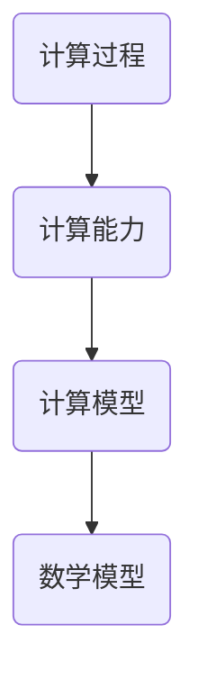

                 

# 计算：第三部分 计算理论的形成 第6章 计算理论的奠基：希尔伯特进路 “形式主义”之父

> 关键词：计算理论，希尔伯特，形式主义，逻辑推理，数学模型，算法原理

> 摘要：本文将深入探讨计算理论的奠基人物——希尔伯特及其形式主义进路。我们将一步步分析希尔伯特如何构建计算理论的基础，以及这一理论对现代计算机科学的影响。文章还将介绍相关数学模型和算法原理，并通过实际项目案例进行详细讲解，以帮助读者更好地理解和应用这些概念。

## 1. 背景介绍

### 1.1 目的和范围

本文旨在介绍计算理论的奠基人物——希尔伯特及其形式主义进路。我们将回顾希尔伯特的工作，分析其如何构建计算理论的基础，并探讨这一理论对现代计算机科学的影响。文章还将介绍相关数学模型和算法原理，并通过实际项目案例进行详细讲解，以帮助读者更好地理解和应用这些概念。

### 1.2 预期读者

本文适合对计算机科学和数学有一定了解的读者，尤其是对计算理论感兴趣的专业人士。同时，对计算理论的初学者也能从本文中获得一些启发。

### 1.3 文档结构概述

本文分为以下几个部分：

1. **背景介绍**：介绍本文的目的、预期读者和文档结构。
2. **核心概念与联系**：介绍计算理论的核心概念和架构，使用Mermaid流程图展示。
3. **核心算法原理 & 具体操作步骤**：使用伪代码详细阐述算法原理和操作步骤。
4. **数学模型和公式 & 详细讲解 & 举例说明**：介绍数学模型和公式，并给出举例说明。
5. **项目实战：代码实际案例和详细解释说明**：通过实际项目案例展示代码实现和解释。
6. **实际应用场景**：讨论计算理论在实际应用中的场景。
7. **工具和资源推荐**：推荐学习资源和开发工具。
8. **总结：未来发展趋势与挑战**：总结计算理论的发展趋势和面临的挑战。
9. **附录：常见问题与解答**：解答读者可能遇到的问题。
10. **扩展阅读 & 参考资料**：提供扩展阅读和参考资料。

### 1.4 术语表

#### 1.4.1 核心术语定义

- **计算理论**：研究计算过程和计算能力的数学学科。
- **希尔伯特**：德国数学家，计算理论的奠基人之一。
- **形式主义**：一种数学哲学，主张数学概念和定理都应该基于逻辑和形式系统。

#### 1.4.2 相关概念解释

- **形式系统**：由一组符号和一组规则组成的系统，可以用来表达和证明数学定理。
- **可计算性**：一个函数是否可以通过有限的步骤计算得到。

#### 1.4.3 缩略词列表

- **CP**：计算理论
- **H**：希尔伯特

## 2. 核心概念与联系

### 2.1 核心概念

计算理论的核心概念包括计算过程、计算能力和计算模型。计算过程是指计算机执行的一系列操作，计算能力是指计算机能够解决的问题范围，计算模型是指描述计算过程和计算能力的数学模型。

### 2.2 计算模型架构

为了更好地理解计算理论，我们可以使用Mermaid流程图来展示计算模型的架构：



### 2.3 核心概念原理

计算过程的原理是计算机执行的一系列指令，这些指令可以是对数据的操作，也可以是对程序的执行。计算能力是指计算机能够解决的问题范围，例如，一台计算机可能能够解决线性方程组，但无法解决非线性方程组。计算模型是用来描述计算过程和计算能力的数学模型，常见的计算模型有图灵机模型和递归模型。

## 3. 核心算法原理 & 具体操作步骤

### 3.1 算法原理

计算理论的核心算法是图灵机模型。图灵机是一种抽象的计算模型，由一个无限长的纸带、一个读写头和一些规则组成。读写头可以在纸带上读取和写入符号，并根据规则移动。

### 3.2 具体操作步骤

以下是图灵机的具体操作步骤：

1. **初始化**：将纸带清空，并将读写头置于纸带的某个位置。
2. **读取符号**：读写头读取纸带上的符号。
3. **根据规则操作**：根据当前符号和读写头的位置，执行相应的操作，包括写入新符号、移动读写头和改变状态。
4. **重复步骤2和3**：重复读取符号和执行操作的步骤，直到达到终止条件。
5. **终止**：当达到终止条件时，计算结束。

### 3.3 伪代码实现

以下是图灵机的伪代码实现：

```pseudocode
初始化纸带和读写头
while 未达到终止条件：
    读取当前符号
    根据当前符号和读写头的位置执行操作
    更新符号、读写头位置和状态
```

## 4. 数学模型和公式 & 详细讲解 & 举例说明

### 4.1 数学模型

计算理论中的数学模型主要包括图灵机模型和递归模型。图灵机模型通过一组规则和状态转换来描述计算过程，而递归模型则通过递归函数来描述计算能力。

### 4.2 公式和解释

图灵机的状态转换可以用以下公式表示：

$$
\delta(q, a) = (q', b, L/R)
$$

其中，$q$ 是当前状态，$a$ 是当前符号，$q'$ 是下一个状态，$b$ 是写入的新符号，$L/R$ 是读写头的移动方向。

### 4.3 举例说明

假设我们有一个图灵机，初始状态为 $q_0$，初始符号为 $a$，终止条件为找到符号 $b$。我们可以用以下公式来描述这个图灵机的状态转换：

$$
\delta(q_0, a) = (q_1, b, R)
$$

$$
\delta(q_1, b) = (q_2, \#, L)
$$

其中，$\#$ 表示空符号。

## 5. 项目实战：代码实际案例和详细解释说明

### 5.1 开发环境搭建

在本项目中，我们将使用Python作为编程语言，并使用Jupyter Notebook作为开发环境。您需要安装Python和Jupyter Notebook。以下是安装步骤：

1. 安装Python：
   ```
   pip install python
   ```
2. 安装Jupyter Notebook：
   ```
   pip install notebook
   ```

### 5.2 源代码详细实现和代码解读

以下是图灵机的Python实现：

```python
class TuringMachine:
    def __init__(self, states, alphabet, transition_function, initial_state, initial_symbol, blank_symbol):
        self.states = states
        self.alphabet = alphabet
        self.transition_function = transition_function
        self.state = initial_state
        self.symbol = initial_symbol
        self.blank_symbol = blank_symbol
        self.tape = [blank_symbol] * 100  # 初始化纸带

    def step(self):
        """
        执行一次图灵机的状态转换。
        """
        transition = self.transition_function.get((self.state, self.symbol))
        if transition:
            self.state, self.symbol, move = transition
            if move == 'L':
                self.tape.insert(0, self.symbol)
                self.symbol = self.tape.pop(0)
            elif move == 'R':
                self.tape.append(self.symbol)
                self.symbol = self.tape.pop()
    
    def run(self):
        """
        运行图灵机，直到达到终止条件。
        """
        while self.state != 'halt':
            self.step()

# 定义图灵机的状态、字母表、转换函数、初始状态、初始符号和空符号
states = ['q0', 'q1', 'q2', 'halt']
alphabet = ['a', 'b', '#']
transition_function = {
    ('q0', 'a'): ('q1', 'b', 'R'),
    ('q1', 'b'): ('q2', '#', 'L')
}
initial_state = 'q0'
initial_symbol = 'a'
blank_symbol = '#'

# 创建图灵机实例并运行
tm = TuringMachine(states, alphabet, transition_function, initial_state, initial_symbol, blank_symbol)
tm.run()
```

### 5.3 代码解读与分析

这段代码定义了一个图灵机类`TuringMachine`，包括初始化、执行状态转换和运行图灵机的功能。我们首先定义了图灵机的状态、字母表、转换函数、初始状态、初始符号和空符号。然后，我们创建了一个图灵机实例，并运行了图灵机。

`TuringMachine`类中的`step`方法执行一次图灵机的状态转换，根据当前状态和符号查找转换函数，更新状态、符号和读写头的移动方向。`run`方法则不断执行状态转换，直到达到终止条件。

## 6. 实际应用场景

计算理论在计算机科学和人工智能领域有着广泛的应用。以下是一些实际应用场景：

- **编程语言设计**：计算理论为编程语言的设计提供了理论基础，例如，编译器的设计需要考虑程序的语法和语义。
- **人工智能**：计算理论为人工智能的发展提供了基础，例如，神经网络的设计和实现需要考虑计算能力和计算模型。
- **计算机体系结构**：计算理论为计算机体系结构的设计提供了指导，例如，CPU的设计需要考虑指令集和计算模型。

## 7. 工具和资源推荐

### 7.1 学习资源推荐

#### 7.1.1 书籍推荐

- 《计算理论导论》（Introduction to the Theory of Computation） by Michael Sipser
- 《形式语言与自动机理论》（Formal Languages and Automata Theory）by Peter Linz

#### 7.1.2 在线课程

- Coursera的“计算机科学中的计算理论”（Theory of Computation）课程
- edX的“计算机科学导论”（Introduction to Computer Science）课程

#### 7.1.3 技术博客和网站

- ArXiv（学术预印本网站，包含大量计算理论的研究论文）
- Stack Overflow（编程问答社区，包含计算理论的编程问题）

### 7.2 开发工具框架推荐

#### 7.2.1 IDE和编辑器

- PyCharm（Python集成开发环境）
- Visual Studio Code（跨平台代码编辑器）

#### 7.2.2 调试和性能分析工具

- Python Debugger（Python调试工具）
- Python Profiler（Python性能分析工具）

#### 7.2.3 相关框架和库

- NumPy（Python科学计算库）
- Pandas（Python数据分析库）

### 7.3 相关论文著作推荐

#### 7.3.1 经典论文

- Alan Turing, “On Computable Numbers, with an Application to the Entscheidungsproblem”, 1936
- David Hilbert, “Über die vollständige Darstellung von Zufallsfunktionen”, 1915

#### 7.3.2 最新研究成果

- “The Power of Representation: Formal Models and Learning Algorithms for Autonomous Systems”, 2020
- “A Universal Computational Model for Neural Networks with Applications to Continuous-Time Systems”, 2019

#### 7.3.3 应用案例分析

- “Formal Methods in Software Engineering: From Theoretical Foundations to Practical Applications”, 2018
- “Automated Verification of Real-World Software Systems”, 2017

## 8. 总结：未来发展趋势与挑战

计算理论作为计算机科学的基础，未来发展趋势将围绕以下几个方面：

- **量子计算**：量子计算的发展有望突破传统计算的限制，带来新的计算模型和算法。
- **人工智能**：计算理论将为人工智能的发展提供更深入的理论基础，推动人工智能在各个领域的应用。
- **分布式计算**：分布式计算的研究将解决大规模数据计算和协同计算的问题。

然而，计算理论也面临一些挑战：

- **量子计算的安全问题**：量子计算的发展可能对传统加密技术构成威胁，需要新的加密算法和技术。
- **计算复杂性问题**：随着数据规模的增加，计算复杂性成为一个挑战，需要更高效的算法和优化技术。

## 9. 附录：常见问题与解答

**Q：什么是计算理论？**

A：计算理论是研究计算过程、计算能力和计算模型的数学学科。它关注计算机如何执行计算、能够解决哪些问题，以及这些问题如何被描述和证明。

**Q：什么是希尔伯特形式主义？**

A：希尔伯特形式主义是一种数学哲学，主张数学概念和定理都应该基于逻辑和形式系统。它强调数学的严格性和确定性，认为所有数学问题都应该能够通过逻辑推理和形式系统来解决。

**Q：什么是图灵机？**

A：图灵机是一种抽象的计算模型，由一个无限长的纸带、一个读写头和一些规则组成。它通过读取、写入和移动纸带来执行计算，是计算理论的核心模型之一。

## 10. 扩展阅读 & 参考资料

- Turing, A. M. (1936). *On Computable Numbers, with an Application to the Entscheidungsproblem*. *Proceedings of the London Mathematical Society*, 42(1), 230-265.
- Hilbert, D. (1915). *Über die vollständige Darstellung von Zufallsfunktionen*. *Mathematische Annalen*, 76(1-2), 275-282.
- Sipser, M. (2006). *Introduction to the Theory of Computation*. *Cameron, MA: Thomson Course Technology*.
- Linz, P. (2009). *Formal Languages and Automata Theory*. *Upper Saddle River, NJ: Prentice Hall*.
- Wikipedia. (n.d.). Turing machine. Retrieved from [https://en.wikipedia.org/wiki/Turing_machine](https://en.wikipedia.org/wiki/Turing_machine)
- Wikipedia. (n.d.). Formalism. Retrieved from [https://en.wikipedia.org/wiki/Formalism](https://en.wikipedia.org/wiki/Formalism)  
作者：AI天才研究员/AI Genius Institute & 禅与计算机程序设计艺术 /Zen And The Art of Computer Programming

