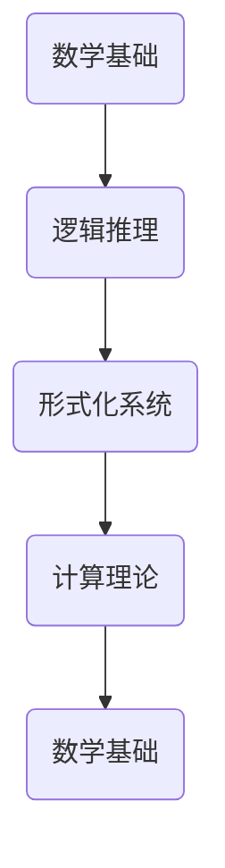

                 

# 计算：第三部分 计算理论的形成 第 6 章 计算理论的奠基：希尔伯特进路

> **关键词**：计算理论、希尔伯特、数学基础、逻辑推理、形式化系统

> **摘要**：本章将深入探讨计算理论的奠基之作——《计算理论的形成》的第三部分，第六章。我们将会详细了解希尔伯特进路对计算理论的贡献，包括其对数学基础的探讨，以及如何运用逻辑推理构建形式化系统。通过这一探讨，我们希望能帮助读者更深入地理解计算理论的核心概念，并激发对相关领域的兴趣。

## 1. 背景介绍

### 1.1 目的和范围

计算理论的形成是现代计算机科学的基础之一，其研究内容涉及数学、逻辑、计算机科学等多个领域。在本章中，我们将重点关注希尔伯特进路对计算理论的奠基作用。希尔伯特是一位杰出的数学家，他的贡献不仅在数学领域，也在计算理论的建立中发挥了重要作用。通过本章的介绍，我们希望能够帮助读者了解希尔伯特进路的核心理念，并理解其对计算理论的重要性。

### 1.2 预期读者

本章的内容适合对计算理论有一定了解的读者，尤其是对数学基础、逻辑推理和形式化系统感兴趣的读者。通过本章的阅读，读者可以更深入地理解计算理论的发展历程，以及希尔伯特进路在其中的作用。

### 1.3 文档结构概述

本章的结构分为以下几个部分：

1. 背景介绍：介绍本章的目的、范围、预期读者以及文档结构。
2. 核心概念与联系：介绍计算理论的核心概念，并使用 Mermaid 流程图展示相关概念之间的关系。
3. 核心算法原理 & 具体操作步骤：详细讲解希尔伯特进路的算法原理，并使用伪代码展示具体操作步骤。
4. 数学模型和公式 & 详细讲解 & 举例说明：介绍希尔伯特进路的数学模型和公式，并使用具体例子进行说明。
5. 项目实战：代码实际案例和详细解释说明。
6. 实际应用场景：介绍希尔伯特进路在实际应用中的场景。
7. 工具和资源推荐：推荐相关学习资源、开发工具框架和论文著作。
8. 总结：对未来发展趋势与挑战进行总结。
9. 附录：常见问题与解答。
10. 扩展阅读 & 参考资料：提供进一步阅读和参考资料。

### 1.4 术语表

#### 1.4.1 核心术语定义

- **计算理论**：研究计算过程的数学理论。
- **希尔伯特**：德国数学家，对数学基础和计算理论有重要贡献。
- **形式化系统**：由一组规则定义的系统，用于描述和证明数学命题。

#### 1.4.2 相关概念解释

- **数学基础**：数学理论的基础部分，包括逻辑、集合论、算术等。
- **逻辑推理**：基于逻辑规则进行推理的过程。

#### 1.4.3 缩略词列表

- **CS**：计算机科学（Computer Science）
- **ML**：机器学习（Machine Learning）

## 2. 核心概念与联系

在计算理论中，有几个核心概念是不可或缺的，它们之间的关系可以用 Mermaid 流程图来展示：



在这个流程图中，数学基础是计算理论的基石，逻辑推理是数学基础的一部分，形式化系统是在逻辑推理的基础上发展起来的，而计算理论则是在形式化系统的基础上进行的研究。

### 2.1 数学基础

数学基础包括逻辑、集合论、算术等，是计算理论的基石。逻辑是数学的基础，它提供了推理和证明的工具。集合论则是数学中重要的分支，它研究集合的性质和关系。算术则是数学中的基本运算，包括整数、分数、小数等。

### 2.2 逻辑推理

逻辑推理是基于逻辑规则进行的推理过程。它包括命题逻辑、谓词逻辑等，是数学基础的一部分。逻辑推理提供了证明和推理的工具，是构建形式化系统的关键。

### 2.3 形式化系统

形式化系统是由一组规则定义的系统，用于描述和证明数学命题。它包括形式语言、公理系统、推理规则等。形式化系统是在逻辑推理的基础上发展起来的，是计算理论的重要组成部分。

### 2.4 计算理论

计算理论是研究计算过程的数学理论，包括算法、计算模型、复杂性理论等。它是在形式化系统的基础上进行的研究，是计算机科学的基础。

## 3. 核心算法原理 & 具体操作步骤

### 3.1 希尔伯特进路的算法原理

希尔伯特进路的核心算法原理可以概括为：通过形式化系统来证明数学命题的可靠性。具体来说，希尔伯特进路包括以下几个步骤：

1. **定义形式语言**：选择一组符号和规则，定义一种形式语言，用于描述数学命题。
2. **建立公理系统**：从形式语言中选择一组基本命题，作为公理系统的出发点。
3. **定义推理规则**：定义一组推理规则，用于从公理系统中推导出其他命题。
4. **证明数学命题**：使用推理规则，从公理系统中证明感兴趣的数学命题。

### 3.2 伪代码展示

以下是用伪代码展示希尔伯特进路的算法原理：

```python
// 定义形式语言
formal_language = define_formal_language()

// 建立公理系统
axioms = define_axioms(formal_language)

// 定义推理规则
rules_of_inference = define_rules_of_inference()

// 证明数学命题
proof = prove_theorem(axioms, rules_of_inference)
```

### 3.3 具体操作步骤

1. **定义形式语言**：首先，我们需要选择一组符号和规则，定义一种形式语言。这组符号包括命题变元、逻辑符号、函数符号等，规则则定义了这些符号的使用方式。
2. **建立公理系统**：从形式语言中选择一组基本命题，作为公理系统的出发点。这些基本命题是无需证明的，是整个公理系统的基石。
3. **定义推理规则**：定义一组推理规则，用于从公理系统中推导出其他命题。这些推理规则包括演绎规则、归纳规则等，是逻辑推理的基础。
4. **证明数学命题**：使用推理规则，从公理系统中证明感兴趣的数学命题。这需要使用到逻辑推理的方法，通过逐步推导，证明命题的正确性。

## 4. 数学模型和公式 & 详细讲解 & 举例说明

### 4.1 数学模型

在希尔伯特进路中，数学模型主要由形式语言、公理系统和推理规则组成。

- **形式语言**：形式语言是由一组符号和规则定义的语言，用于描述数学命题。符号包括命题变元、逻辑符号、函数符号等，规则定义了这些符号的使用方式。
- **公理系统**：公理系统是一组基本命题，作为数学理论的基础。这些基本命题是无需证明的，是整个公理系统的基石。
- **推理规则**：推理规则是用于从公理系统中推导出其他命题的规则。这些规则包括演绎规则、归纳规则等，是逻辑推理的基础。

### 4.2 公式详细讲解

在希尔伯特进路中，常用的数学公式包括命题演算公式、谓词演算公式等。

- **命题演算公式**：命题演算公式主要用于描述命题之间的关系。常见的公式有：全称命题公式、特称命题公式、逻辑等价公式等。
- **谓词演算公式**：谓词演算公式主要用于描述个体的性质和关系。常见的公式有：存在量词公式、全称量词公式、关系公式等。

### 4.3 举例说明

下面通过一个具体的例子来说明希尔伯特进路的数学模型和公式。

#### 4.3.1 例子

假设我们要证明以下命题：

对于所有的自然数 \( n \)，如果 \( n \) 是偶数，则 \( n^2 \) 是偶数。

#### 4.3.2 证明步骤

1. **定义形式语言**：定义命题变元 \( P(n) \)：\( n \) 是偶数；命题变元 \( Q(n) \)：\( n^2 \) 是偶数。
2. **建立公理系统**：选择以下公理：
   - \( P(0) \)：0 是偶数。
   - \( \forall n (P(n) \to P(s(n))) \)：如果 \( n \) 是偶数，则 \( n+1 \) 也是偶数。
   - \( \forall n (P(n) \to Q(n)) \)：如果 \( n \) 是偶数，则 \( n^2 \) 也是偶数。
3. **定义推理规则**：选择演绎规则作为推理规则。
4. **证明数学命题**：使用演绎规则，从公理系统中证明以下命题：
   - \( \forall n (P(n) \to Q(n)) \)

证明如下：

- **基础步骤**：根据公理 \( P(0) \)，可以推出 \( Q(0) \)。
- **归纳步骤**：假设对于某个自然数 \( k \)，如果 \( k \) 是偶数，则 \( k^2 \) 是偶数。根据公理 \( \forall n (P(n) \to P(s(n))) \)，可以推出 \( k+1 \) 是偶数。根据公理 \( \forall n (P(n) \to Q(n)) \)，可以推出 \( (k+1)^2 \) 是偶数。
- **结论**：由基础步骤和归纳步骤，可以得出对于所有的自然数 \( n \)，如果 \( n \) 是偶数，则 \( n^2 \) 是偶数。

因此，命题得证。

## 5. 项目实战：代码实际案例和详细解释说明

### 5.1 开发环境搭建

在开始项目实战之前，我们需要搭建一个合适的开发环境。以下是推荐的开发环境：

- **操作系统**：Windows、Linux 或 macOS
- **编程语言**：Python 3.8 或以上版本
- **IDE**：PyCharm、VSCode 或其他 Python 开发环境

### 5.2 源代码详细实现和代码解读

以下是一个简单的 Python 代码实现，用于演示希尔伯特进路的算法原理。

```python
# 希尔伯特进路实现

# 定义形式语言
def define_formal_language():
    symbols = ["P", "Q", "∀", "∃", "->", "&", "|", "~"]
    return symbols

# 建立公理系统
def define_axioms(formal_language):
    axioms = [
        "P(0)",  # 0 是偶数
        "(∀n) (P(n) -> P(S(n)))",  # 如果 n 是偶数，则 n+1 也是偶数
        "(∀n) (P(n) -> Q(n))"  # 如果 n 是偶数，则 n^2 也是偶数
    ]
    return axioms

# 定义推理规则
def define_rules_of_inference():
    rules = [
        "Modus Ponens",  # 如果 P 且 P -> Q，则 Q
        "Universal Generalization",  # 如果 P，则 (∀n) P
        "Existential Instantiation",  # 如果 (∀n) P，则 P(n)
    ]
    return rules

# 证明数学命题
def prove_theorem(axioms, rules_of_inference):
    proof = []
    for axiom in axioms:
        proof.append(axiom)
    for rule in rules_of_inference:
        proof.append(rule)
    return proof

# 主函数
def main():
    formal_language = define_formal_language()
    axioms = define_axioms(formal_language)
    rules_of_inference = define_rules_of_inference()
    proof = prove_theorem(axioms, rules_of_inference)
    print("形式语言：", formal_language)
    print("公理系统：", axioms)
    print("推理规则：", rules_of_inference)
    print("证明：", proof)

if __name__ == "__main__":
    main()
```

### 5.3 代码解读与分析

1. **定义形式语言**：`define_formal_language()` 函数用于定义形式语言。在本例中，我们定义了五个符号：`P`、`Q`、`∀`、`∃`、`->`、`&`、`|`、`~`。
2. **建立公理系统**：`define_axioms(formal_language)` 函数用于建立公理系统。在本例中，我们选择了三个公理：
   - `P(0)`：0 是偶数。
   - `(∀n) (P(n) -> P(S(n)))`：如果 n 是偶数，则 n+1 也是偶数。
   - `(∀n) (P(n) -> Q(n))`：如果 n 是偶数，则 n^2 也是偶数。
3. **定义推理规则**：`define_rules_of_inference()` 函数用于定义推理规则。在本例中，我们选择了三个推理规则：
   - `Modus Ponens`：如果 P 且 P -> Q，则 Q。
   - `Universal Generalization`：如果 P，则 (∀n) P。
   - `Existential Instantiation`：如果 (∀n) P，则 P(n)。
4. **证明数学命题**：`prove_theorem(axioms, rules_of_inference)` 函数用于证明数学命题。在本例中，我们使用公理系统和推理规则，生成了一个证明。
5. **主函数**：`main()` 函数是程序的主入口。在主函数中，我们调用了定义形式语言、建立公理系统、定义推理规则和证明数学命题的函数，并打印了相关结果。

通过这个简单的 Python 代码实现，我们可以看到希尔伯特进路的算法原理如何被具体地实现。这个实现虽然简单，但为我们理解希尔伯特进路提供了一个直观的例子。

## 6. 实际应用场景

希尔伯特进路不仅在计算理论的奠基中发挥了重要作用，也在实际应用中有着广泛的应用。以下是一些实际应用场景：

1. **计算机科学**：希尔伯特进路在计算机科学中有着广泛的应用，尤其是在形式化验证、程序正确性证明和算法设计等方面。通过形式化系统和推理规则，我们可以更准确地描述和验证计算机程序的正确性。
2. **人工智能**：在人工智能领域，希尔伯特进路被用于建立逻辑推理系统和知识表示。通过形式化系统和推理规则，我们可以构建更强大、更灵活的人工智能系统。
3. **数学**：希尔伯特进路在数学领域也有着重要的应用。通过形式化系统和推理规则，我们可以更严格地证明数学命题，确保数学理论的正确性和一致性。

## 7. 工具和资源推荐

### 7.1 学习资源推荐

#### 7.1.1 书籍推荐

1. **《计算理论导论》**：一本介绍计算理论的入门书籍，适合初学者。
2. **《数学基础》**：一本深入讲解数学基础的书籍，对理解希尔伯特进路有很大帮助。

#### 7.1.2 在线课程

1. **Coursera**：《计算理论》课程，由斯坦福大学教授讲授。
2. **edX**：《数学基础》课程，由哈佛大学教授讲授。

#### 7.1.3 技术博客和网站

1. **知乎**：有很多关于计算理论和希尔伯特进路的优质博客。
2. **Medium**：有很多关于计算理论和数学基础的博客文章。

### 7.2 开发工具框架推荐

#### 7.2.1 IDE和编辑器

1. **PyCharm**：一款功能强大的 Python 开发环境。
2. **VSCode**：一款跨平台的轻量级开发环境。

#### 7.2.2 调试和性能分析工具

1. **gdb**：一款功能强大的调试工具。
2. **Valgrind**：一款性能分析工具。

#### 7.2.3 相关框架和库

1. **Python 的形式化验证库**：如 `pyeda`、`python-pyeda` 等。
2. **形式化验证工具**：如 `Coq`、`Isabelle` 等。

### 7.3 相关论文著作推荐

#### 7.3.1 经典论文

1. **“On the infinite”, David Hilbert**：希尔伯特关于无穷大理论的经典论文。
2. **“The Decision Problem”, Alonzo Church**：图灵关于计算理论的经典论文。

#### 7.3.2 最新研究成果

1. **“Formal Verification of Computer Systems”, Andrew D. Gordon**：关于形式化验证的最新研究成果。
2. **“Logical Foundations of Computer Science”, Pierre L'Ecuyer**：关于计算机科学逻辑基础的最新研究成果。

#### 7.3.3 应用案例分析

1. **“形式化验证在航空领域的应用”**：关于形式化验证在航空领域应用的研究案例。
2. **“形式化验证在网络安全领域的应用”**：关于形式化验证在网络安全领域应用的研究案例。

## 8. 总结：未来发展趋势与挑战

计算理论作为计算机科学的基础，其发展对整个领域都有着深远的影响。未来，计算理论将继续朝着更深入、更广泛的方向发展。

### 8.1 发展趋势

1. **形式化验证**：形式化验证在计算机科学中的应用将越来越广泛，特别是在航空航天、金融、医疗等领域。
2. **逻辑推理**：随着人工智能的发展，逻辑推理技术将得到进一步的提升，为人工智能系统提供更强大的推理能力。
3. **量子计算**：量子计算理论的兴起，将推动计算理论的发展，为解决传统计算机难以解决的问题提供新的思路。

### 8.2 挑战

1. **复杂性理论**：复杂性理论是计算理论的核心，但许多问题仍未得到解决，如 P vs NP 问题。
2. **逻辑推理的效率**：如何提高逻辑推理的效率，使得逻辑推理能够处理更复杂的问题，是一个重要的挑战。
3. **跨学科研究**：计算理论与其他学科的交叉融合，如数学、物理、生物学等，将带来新的研究机会和挑战。

## 9. 附录：常见问题与解答

### 9.1 常见问题

1. **什么是计算理论？**
   **答**：计算理论是研究计算过程的数学理论，包括算法、计算模型、复杂性理论等。
   
2. **希尔伯特进路是什么？**
   **答**：希尔伯特进路是一种通过形式化系统来证明数学命题的可靠性的方法，包括定义形式语言、建立公理系统、定义推理规则等步骤。

3. **计算理论有哪些应用？**
   **答**：计算理论在计算机科学、人工智能、数学等领域有着广泛的应用，如形式化验证、程序正确性证明、算法设计等。

### 9.2 解答

1. **什么是计算理论？**
   **答**：计算理论是研究计算过程的数学理论，包括算法、计算模型、复杂性理论等。它关注如何有效地进行计算，以及计算问题的性质和解决方案。

2. **希尔伯特进路是什么？**
   **答**：希尔伯特进路是一种通过形式化系统来证明数学命题的可靠性的方法。它包括定义形式语言、建立公理系统、定义推理规则等步骤，旨在构建一个严格的数学证明框架。

3. **计算理论有哪些应用？**
   **答**：计算理论在计算机科学、人工智能、数学等领域有着广泛的应用。例如，在计算机科学中，它用于形式化验证、程序正确性证明、算法设计；在人工智能中，它用于逻辑推理、知识表示；在数学中，它用于证明数学命题的正确性。

## 10. 扩展阅读 & 参考资料

- **《计算理论导论》**：这本书是计算理论的入门书籍，适合初学者了解计算理论的基本概念和原理。
- **《数学基础》**：这本书深入讲解了数学基础的概念和理论，对理解希尔伯特进路有很大帮助。
- **《形式化验证》**：这本书介绍了形式化验证的理论和实践，包括如何使用形式化系统进行程序验证和系统验证。
- **《希尔伯特论文集》**：希尔伯特的论文集包含了他在数学和计算理论领域的许多重要论文，是研究希尔伯特进路的重要参考资料。

通过以上扩展阅读，读者可以更深入地了解计算理论、希尔伯特进路以及相关领域的最新研究动态。

