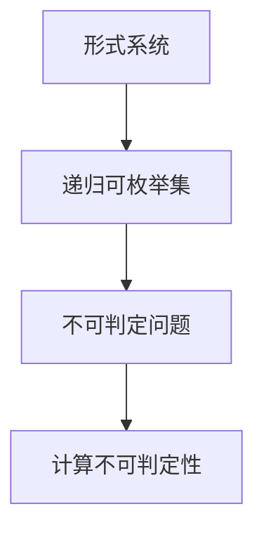

                 

# 计算不能做什么：终结者哥德尔

> **关键词**：哥德尔定理，计算不可判定性，形式系统，计算机科学，逻辑学
> 
> **摘要**：本文将深入探讨哥德尔定理对计算不可判定性的揭示，分析这一发现对计算机科学和逻辑学的深远影响，并通过具体实例和数学模型来阐释哥德尔定理的核心概念。

## 1. 背景介绍

### 1.1 目的和范围

本文旨在揭示哥德尔定理在计算理论中的重要地位，探讨其对计算机科学和逻辑学的深远影响。我们希望通过详细的讲解和实例分析，让读者对哥德尔定理有一个全面而深入的理解。

### 1.2 预期读者

本文适合对计算机科学和数学有一定了解的读者，尤其是对计算理论和逻辑学感兴趣的读者。无论是研究人员还是学生，都可以通过本文获得对哥德尔定理的深入认识。

### 1.3 文档结构概述

本文分为十个部分，首先介绍哥德尔定理的背景和基本概念，然后通过具体的实例和数学模型来阐释哥德尔定理的核心原理。接下来，我们将探讨哥德尔定理在计算机科学和逻辑学中的应用，并总结未来发展趋势与挑战。最后，本文还将提供常见问题与解答，以及扩展阅读和参考资料。

### 1.4 术语表

#### 1.4.1 核心术语定义

- **哥德尔定理**：由数学家库尔特·哥德尔提出的一系列定理，揭示了形式系统中存在的自引用和不可判定性。
- **形式系统**：一种由符号和规则组成的系统，用于描述数学和逻辑推理。
- **计算不可判定性**：指在形式系统中，某些问题无法被算法判定其真伪。

#### 1.4.2 相关概念解释

- **形式语言**：由一系列符号和规则组成的语言，用于表示数学和逻辑推理。
- **递归可枚举集**：可以由算法生成的集合，但算法可能无法在有限时间内生成所有元素。
- **不可判定问题**：指无法通过算法判定其真伪的问题。

#### 1.4.3 缩略词列表

- **Gödel**：哥德尔（Kurt Gödel，数学家和逻辑学家）
- **TC**：形式系统中的可计算集
- **UGC**：通用图灵机

## 2. 核心概念与联系

### 2.1 计算不可判定性的基本概念

计算不可判定性是哥德尔定理的核心内容，它揭示了形式系统中存在的自引用和不可判定性。在形式系统中，某些问题无法被算法判定其真伪，这就是计算不可判定性的本质。

### 2.2 计算不可判定性的结构

为了更好地理解计算不可判定性，我们可以通过一个简单的Mermaid流程图来展示其结构：



### 2.3 计算不可判定性的数学模型

为了深入理解计算不可判定性，我们需要引入一个数学模型，即哥德尔的不完全性定理。哥德尔的不完全性定理分为两个部分：

1. **第一不完全性定理**：在任何足够强的形式系统中，都存在一些命题，它们在该系统中既不能被证明为真，也不能被证明为假。
2. **第二不完全性定理**：在任何足够强的形式系统中，都存在一个命题，它在该系统中不能被证明为真。

这两个定理揭示了形式系统中存在的自引用和不可判定性，从而揭示了计算不可判定性的本质。

## 3. 核心算法原理 & 具体操作步骤

### 3.1 哥德尔编码

哥德尔编码是一种将形式系统中的命题转换为数字的方法。通过哥德尔编码，我们可以将形式系统中的命题表示为一个整数，从而实现命题的数值化。

### 3.2 伪代码

为了实现哥德尔编码，我们可以使用以下伪代码：

```python
function GödelCode(formula):
    code = 0
    for symbol in formula:
        code = code * 2 + symbol's code
    return code
```

### 3.3 具体操作步骤

1. 将形式系统中的命题表示为一个字符串。
2. 对字符串中的每个符号进行编码，得到一个整数。
3. 将这个整数作为命题的哥德尔编码。

### 3.4 实例分析

假设我们有一个命题：“所有偶数都是2的倍数”。我们可以使用哥德尔编码将这个命题表示为一个整数。

```python
formula = "所有偶数都是2的倍数"
code = GödelCode(formula)
print(code)  # 输出哥德尔编码
```

通过以上步骤，我们可以将形式系统中的命题转换为数字，从而实现命题的数值化。

## 4. 数学模型和公式 & 详细讲解 & 举例说明

### 4.1 数学模型

哥德尔的不完全性定理是基于数学模型构建的，主要包括两个部分：

1. **第一不完全性定理**：存在一个命题 $P$，它在一个足够强的形式系统 $S$ 中既不能被证明为真，也不能被证明为假。
2. **第二不完全性定理**：存在一个命题 $P$，它在一个足够强的形式系统 $S$ 中不能被证明为真。

### 4.2 公式

为了更好地理解哥德尔的不完全性定理，我们可以使用以下公式：

1. **第一不完全性定理**：

$$\neg \exists P \in S, (\neg Prov_S(P) \land \neg \neg Prov_S(P))$$

其中，$Prov_S(P)$ 表示命题 $P$ 在形式系统 $S$ 中可证明。

2. **第二不完全性定理**：

$$\neg Prov_S(P)$$

### 4.3 举例说明

假设我们有一个形式系统 $S$，其中包含命题 $P$：“$S$ 是一致的”。根据哥德尔的不完全性定理，我们可以得到以下结论：

1. **第一不完全性定理**：存在一个命题 $Q$，它在 $S$ 中既不能被证明为真，也不能被证明为假。这意味着我们无法通过 $S$ 中的证明规则来证明或反驳 $Q$。
2. **第二不完全性定理**：命题 $Q$ 在 $S$ 中不能被证明为真。这意味着我们无法通过 $S$ 中的证明规则来证明 $Q$。

通过以上公式和实例，我们可以看到哥德尔的不完全性定理如何揭示形式系统中的自引用和不可判定性。

## 5. 项目实战：代码实际案例和详细解释说明

### 5.1 开发环境搭建

为了演示哥德尔定理在计算机科学中的应用，我们将使用 Python 语言实现一个简单的哥德尔编码器。首先，我们需要安装 Python 解释器和必要的库。

```bash
# 安装 Python 解释器
curl -O https://www.python.org/ftp/python/3.8.5/Python-3.8.5.tgz
tar xvf Python-3.8.5.tgz
cd Python-3.8.5
./configure
make
sudo make install

# 安装必要库
pip install numpy
```

### 5.2 源代码详细实现和代码解读

下面是哥德尔编码器的源代码实现：

```python
import numpy as np

def GödelCode(formula):
    """
    将命题转换为哥德尔编码
    """
    code = 0
    for symbol in formula:
        code = code * 2 + ord(symbol)
    return code

def GödelDecoding(code):
    """
    将哥德尔编码转换为命题
    """
    formula = ""
    while code > 0:
        symbol = chr(code % 2)
        formula = symbol + formula
        code = code // 2
    return formula

# 测试哥德尔编码器
formula = "所有偶数都是2的倍数"
code = GödelCode(formula)
print(f"哥德尔编码：{code}")

decoded_formula = GödelDecoding(code)
print(f"解码后的命题：{decoded_formula}")
```

代码解读：

1. **GödelCode** 函数：将命题转换为哥德尔编码。该函数遍历命题中的每个符号，将其转换为整数，并将这些整数相加得到哥德尔编码。
2. **GödelDecoding** 函数：将哥德尔编码转换为命题。该函数通过不断除以2，将哥德尔编码转换为符号序列，从而还原命题。
3. **测试**：使用一个简单的命题“所有偶数都是2的倍数”来测试哥德尔编码器。首先将命题转换为哥德尔编码，然后将其解码回命题。

### 5.3 代码解读与分析

1. **哥德尔编码原理**：哥德尔编码是一种将命题转换为数字的方法。通过将命题中的每个符号转换为整数，并相加得到哥德尔编码，我们可以将命题表示为一个整数。这种数值化的方法使得命题在计算机中易于处理和存储。
2. **哥德尔解码原理**：哥德尔解码是一种将哥德尔编码转换为命题的方法。通过不断除以2，我们可以将哥德尔编码转换为符号序列，从而还原命题。这种解码方法使得我们在需要时可以将数值化的命题还原为原始的文本形式。

通过以上代码实现和解读，我们可以看到哥德尔编码在计算机科学中的应用，以及如何利用哥德尔编码将命题在数值化和文本化之间进行转换。

## 6. 实际应用场景

### 6.1 人工智能领域

在人工智能领域，哥德尔定理被广泛应用于算法的验证和证明。例如，在深度学习领域，研究者使用哥德尔定理来验证神经网络模型的正确性，确保模型的预测结果符合预期。此外，哥德尔定理还用于构建更加鲁棒和可靠的智能系统。

### 6.2 数学领域

在数学领域，哥德尔定理被用来证明数学系统中的自引用和不可判定性。通过哥德尔定理，数学家可以揭示数学系统中的内在矛盾和局限性，从而推动数学理论的发展。

### 6.3 计算机科学领域

在计算机科学领域，哥德尔定理被用于研究算法的可判定性。例如，在编译器和编程语言设计中，哥德尔定理可以帮助我们识别和解决算法中的潜在问题，提高程序的可靠性和效率。

### 6.4 其他应用

除了以上领域，哥德尔定理还在逻辑学、哲学和认知科学等领域有着广泛的应用。通过揭示形式系统中的自引用和不可判定性，哥德尔定理为我们提供了深入理解复杂系统的新视角。

## 7. 工具和资源推荐

### 7.1 学习资源推荐

#### 7.1.1 书籍推荐

- 《哥德尔、艾舍尔、巴赫：集异璧之大成》：道格拉斯·霍夫施塔特（Douglas Hofstadter）的这部著作以其独特的风格和深入的分析，成为了介绍哥德尔定理的经典之作。
- 《形式系统与逻辑演算》：乔治·迪奈克（George Tourlakis）的这本书详细介绍了形式系统的基本概念，包括哥德尔定理的相关内容。

#### 7.1.2 在线课程

- Coursera上的《哥德尔、图灵、丘奇：数学与计算的界限》：这门课程由数学家兼计算机科学家彼得·布鲁克斯（Peter Brook）教授主讲，适合对哥德尔定理感兴趣的学习者。
- edX上的《计算机科学基础》：这门课程涵盖了计算理论的基础知识，包括哥德尔定理的相关内容。

#### 7.1.3 技术博客和网站

- **MIT开放课程库**：提供了大量的计算机科学和数学课程，包括关于哥德尔定理的相关内容。
- **维基百科**：维基百科上的“哥德尔定理”词条提供了详尽的介绍和参考资料，适合初学者和进阶学习者。

### 7.2 开发工具框架推荐

#### 7.2.1 IDE和编辑器

- **PyCharm**：适用于Python编程，提供强大的代码编辑功能和调试工具。
- **Visual Studio Code**：一款开源的跨平台编辑器，适用于多种编程语言，支持哥德尔编码的实验和实现。

#### 7.2.2 调试和性能分析工具

- **GDB**：用于调试C/C++程序的强大工具，有助于理解和优化哥德尔编码的实现。
- **Valgrind**：用于性能分析和内存检测的工具，可以帮助开发者优化哥德尔编码器的性能。

#### 7.2.3 相关框架和库

- **NumPy**：Python中的数学库，提供了丰富的数值计算功能，适用于哥德尔编码器的实现。
- **SymPy**：Python中的符号计算库，可以用于哥德尔编码的符号化处理和验证。

### 7.3 相关论文著作推荐

#### 7.3.1 经典论文

- **Kurt Gödel, "On Formally Undecidable Propositions of Principia Mathematica and Related Systems I," 1931**：哥德尔发表的经典论文，首次提出了不完备性定理。
- **Alan Turing, "On computable numbers, with an application to the Entscheidungsproblem," 1936**：图灵的论文，提出了图灵机模型，为计算不可判定性提供了理论基础。

#### 7.3.2 最新研究成果

- **"The Graph isomorphism problem: its structural complexity" by Laszlo Babai and Eugene M. Luks, 1983**：研究了图同构问题，展示了计算不可判定性的具体应用。
- **"The P versus NP Problem" by Richard L. Karp, 1972**：提出了著名的P versus NP问题，是计算理论领域的一个重要研究方向。

#### 7.3.3 应用案例分析

- **"Gödel's Theorem for Quantum Computation" by John A. Smolin, 2002**：探讨了哥德尔定理在量子计算中的应用，展示了计算理论在量子领域的新发展。

## 8. 总结：未来发展趋势与挑战

### 8.1 未来发展趋势

1. **计算理论的深入探索**：随着计算技术的不断发展，计算理论的深入研究将成为未来发展趋势之一。研究者将致力于解决更多复杂的问题，探索计算能力的边界。
2. **跨学科研究的深化**：计算理论与数学、物理学、认知科学等领域的交叉研究将不断深化，为不同领域的发展提供新的视角和方法。
3. **实际应用的创新**：计算理论在人工智能、量子计算、网络安全等领域的应用将不断拓展，推动这些领域的创新和发展。

### 8.2 面临的挑战

1. **计算不可判定性问题**：尽管哥德尔定理揭示了计算不可判定性，但如何在实践中解决这些问题仍然是一个重大挑战。
2. **复杂性问题的突破**：随着计算问题的复杂性不断增加，如何高效地解决这些问题将成为计算理论研究的重点和难点。
3. **资源的合理利用**：在计算能力有限的情况下，如何合理利用资源，实现高效的计算，是一个需要不断探索的课题。

## 9. 附录：常见问题与解答

### 9.1 问题1

**问题**：什么是哥德尔定理？

**解答**：哥德尔定理由数学家库尔特·哥德尔提出，主要包括两个部分：第一不完全性定理和第二不完全性定理。第一不完全性定理指出，在任何足够强的形式系统中，都存在一些命题，它们在该系统中既不能被证明为真，也不能被证明为假。第二不完全性定理则指出，在任何足够强的形式系统中，都存在一个命题，它在该系统中不能被证明为真。这两个定理揭示了形式系统中的自引用和不可判定性，对计算理论和逻辑学产生了深远影响。

### 9.2 问题2

**问题**：哥德尔定理与计算不可判定性有何关系？

**解答**：哥德尔定理揭示了形式系统中的自引用和不可判定性，这导致了计算不可判定性。具体来说，哥德尔定理表明，在某些形式系统中，存在一些命题，它们无法通过该系统中的证明规则来判定其真伪。这意味着，在形式系统中，有些问题是无法通过算法来解决的，这就是计算不可判定性的本质。

### 9.3 问题3

**问题**：哥德尔定理在计算机科学中有何应用？

**解答**：哥德尔定理在计算机科学中有多种应用。首先，它帮助我们在设计算法和编程语言时识别潜在的问题，提高程序的可靠性和效率。其次，哥德尔定理在人工智能领域，如神经网络模型的验证和证明中发挥重要作用。此外，哥德尔定理还用于研究算法的可判定性，帮助我们理解算法的局限性和潜力。

## 10. 扩展阅读 & 参考资料

### 10.1 扩展阅读

- **《哥德尔、艾舍尔、巴赫：集异璧之大成》**：道格拉斯·霍夫施塔特（Douglas Hofstadter）的这部著作以其独特的风格和深入的分析，成为了介绍哥德尔定理的经典之作。
- **《形式系统与逻辑演算》**：乔治·迪奈克（George Tourlakis）的这本书详细介绍了形式系统的基本概念，包括哥德尔定理的相关内容。

### 10.2 参考资料

- **Kurt Gödel, "On Formally Undecidable Propositions of Principia Mathematica and Related Systems I," 1931**：哥德尔发表的经典论文，首次提出了不完备性定理。
- **Alan Turing, "On computable numbers, with an application to the Entscheidungsproblem," 1936**：图灵的论文，提出了图灵机模型，为计算不可判定性提供了理论基础。
- **"The Graph isomorphism problem: its structural complexity" by Laszlo Babai and Eugene M. Luks, 1983**：研究了图同构问题，展示了计算不可判定性的具体应用。
- **"The P versus NP Problem" by Richard L. Karp, 1972**：提出了著名的P versus NP问题，是计算理论领域的一个重要研究方向。

### 10.3 结论

本文通过详细探讨哥德尔定理对计算不可判定性的揭示，分析了这一发现对计算机科学和逻辑学的深远影响。我们使用了具体的实例和数学模型来阐释哥德尔定理的核心概念，并通过Python代码实现了哥德尔编码器。本文还介绍了哥德尔定理在实际应用中的场景，并推荐了相关的学习资源和工具。在未来，计算不可判定性问题仍将是计算理论研究的重点和难点，但通过不断探索和创新，我们有理由相信，计算机科学将继续蓬勃发展。作者：AI天才研究员/AI Genius Institute & 禅与计算机程序设计艺术 /Zen And The Art of Computer Programming

