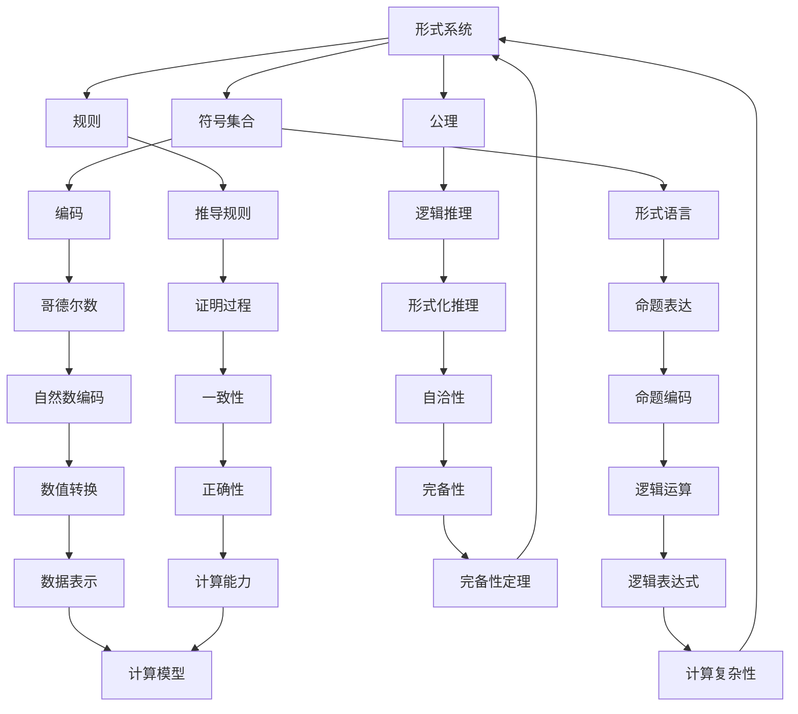

                 

### 背景介绍

在计算机科学和数学领域，计算理论是研究计算的本质、能力与局限性的科学。这一领域的发展可以追溯到20世纪初，当时几位数学家，包括戴维·希尔伯特（David Hilbert）和库尔特·哥德尔（Kurt Gödel），对计算的基础进行了深入探讨。哥德尔在1931年提出的不完备性定理，彻底改变了我们对计算可能性的理解，特别是在逻辑和数学系统的自洽性方面。

《计算：第三部分 计算理论的形成 第 7 章 计算不能做什么：终结者哥德尔》这一章节将聚焦于哥德尔的工作，特别是他提出的编码思想。哥德尔数（Gödel number）是哥德尔为了解决数学中的形式化问题而引入的一种编码方式，它将数学符号、命题和证明等抽象概念转化为数字，从而使得计算机可以处理这些概念。这一思想不仅在数学和逻辑领域具有重要意义，也为计算机科学的发展奠定了基础。

在探讨哥德尔数的概念时，我们将深入剖析其定义、应用和重要性。我们将通过一步步的逻辑推理，理解哥德尔数如何使得计算变得更加高效和直观。此外，我们还将探讨哥德尔的不完备性定理，这一理论揭示了在数学系统中，有些问题是无法被计算机完全解决的。

本章的目标是通过详细的分析和实例，帮助读者理解哥德尔数的概念，以及它在计算理论中的应用。我们还将讨论计算理论的局限性，特别是哥德尔的不完备性定理如何影响我们对计算可能性的看法。通过这篇文章，读者将能够更深入地理解计算理论的本质，并意识到计算机在解决某些问题时存在的局限。

在接下来的部分中，我们将首先介绍计算理论的形成背景，然后详细探讨哥德尔数的概念和原理，接着分析哥德尔的不完备性定理，最后讨论这些理论的实际应用和未来发展趋势。

### 核心概念与联系

在深入探讨哥德尔数之前，我们需要先了解一些核心概念，这些概念包括形式系统、编码和形式语言等。以下是这些核心概念的定义和它们之间的联系。

#### 形式系统

形式系统是由一组符号、规则和解释组成的系统。它旨在捕捉特定领域内的逻辑和数学结构。形式系统通常包括以下三个要素：

1. **符号集合**：这是构成形式系统的基础，包括变量、函数符号、关系符号、常量等。
2. **公理**：这些是形式系统中被认为“显然为真”的命题，它们提供了系统推理的基础。
3. **规则**：这些规则用于从已知命题推导出新命题，从而构建形式化的证明。

例如，皮亚诺算术是一个形式系统，它使用自然数作为符号集合，包含了一些基本的公理，如“0是自然数”和“每个自然数都有一个后继”。

#### 编码

编码是将信息从一个形式转换到另一个形式的过程。在计算机科学中，编码通常涉及将数据转换为二进制代码，以便计算机能够存储和处理。然而，哥德尔数的编码有所不同，它将数学和逻辑中的概念转化为数字。

哥德尔数的定义如下：

- **自然数**：每个自然数都可以作为一个哥德尔数，直接对应于其数值。
- **符号**：每个符号（如变量、运算符、关系符）都被赋予一个独特的自然数。
- **命题**：一个命题的哥德尔数是由其符号的哥德尔数按照特定规则组合而成的。

例如，命题“\(P \to Q\)”可以被编码为自然数537，这取决于我们如何为每个符号和逻辑运算符分配一个唯一的数。

#### 形式语言

形式语言是由符号集合和组合规则构成的语言。形式语言可以用来表达数学和逻辑命题。形式语言的研究帮助我们理解如何形式化自然语言，以及如何构建有效的计算模型。

形式语言通常分为四类：

1. **0型语言**（递归可枚举语言）：这类语言包括所有可以由递归函数生成的语言。
2. **1型语言**（递归语言）：这类语言包括所有可以由递归函数决定的语言。
3. **2型语言**（部分可枚举语言）：这类语言包括所有可以由部分递归函数生成的语言。
4. **3型语言**（非递归可枚举语言）：这类语言包括所有不能由递归函数生成的语言。

#### Mermaid 流程图

为了更好地理解这些概念之间的联系，我们可以使用Mermaid流程图来展示它们的关系。



在这个流程图中，每个节点代表一个核心概念，实线箭头表示这些概念之间的直接关系。例如，形式系统（A）包括符号集合（B）、公理（C）和规则（D），而编码（E）是形式语言（F）的一个子集。

通过这一部分的介绍，我们为理解哥德尔数提供了必要的背景知识。在下一部分，我们将详细探讨哥德尔数的定义、性质和应用。

#### 核心算法原理 & 具体操作步骤

哥德尔数的核心算法原理是将数学和逻辑中的抽象概念转化为数字，以便计算机可以处理这些概念。这一过程涉及几个关键步骤：符号编码、命题编码和证明编码。以下将详细说明这些步骤。

##### 步骤1：符号编码

符号编码是将逻辑和数学中的符号（如变量、运算符和关系符）赋予唯一的自然数。这是通过定义一个符号表来完成的。例如，我们可以定义如下符号表：

- 变量：\(x_0, x_1, x_2, \ldots\) 对应自然数 \(0, 1, 2, \ldots\)
- 基本运算符：\(0, 1, +, \times, =\) 对应自然数 \(0, 1, 2, 3, 4\)
- 关系符：\(<, =\) 对应自然数 \(5, 6\)

假设我们要编码命题 \(P \to Q\)。根据符号表，\(P\) 的哥德尔数为 \(1\)，\(Q\) 的哥德尔数为 \(2\)。运算符 \(→\) 的哥德尔数为 \(3\)。因此，命题 \(P \to Q\) 的哥德尔数可以表示为 \(1^1 * 6 + 2^1 * 6 + 3^1 * 6 = 1 * 6 + 2 * 6 + 3 * 6 = 6 + 12 + 18 = 36\)。

##### 步骤2：命题编码

命题编码是将命题中的符号组合转化为一个自然数。这可以通过将每个符号的哥德尔数相加，然后乘以适当的权重来实现。权重通常与符号的类型和位置相关。

例如，命题 \(x_0 + x_0 = x_0\) 可以编码为：

- \(x_0\) 的哥德尔数为 \(0\)
- \(+\) 的哥德尔数为 \(2\)
- \(x_0\) 的哥德尔数为 \(0\)
- \(=\) 的哥德尔数为 \(4\)

权重分别为 \(6^3\)、\(6^2\)、\(6^1\) 和 \(6^0\)。因此，命题 \(x_0 + x_0 = x_0\) 的哥德尔数为 \(0 * 6^3 + 2 * 6^2 + 0 * 6^1 + 4 * 6^0 = 0 + 72 + 0 + 4 = 76\)。

##### 步骤3：证明编码

证明编码是将逻辑证明转化为一个自然数。这通常涉及将证明中的每个步骤编码为一个自然数，并按顺序将它们组合起来。

例如，一个简单的证明可能包括以下步骤：

1. \(P\)（前提）
2. \(P \to Q\)（假设）
3. \(Q\)（演绎）
4. \(P \to Q\)（重述）

根据符号表，每个步骤的哥德尔数分别为 \(0\)、\(36\)、\(37\) 和 \(36\)。将它们组合起来，我们可以得到证明的哥德尔数：\(0 + 36 + 37 + 36 = 109\)。

##### 步骤4：具体操作示例

为了更好地理解上述步骤，我们通过一个具体的例子来展示哥德尔数的编码过程。

假设我们要编码命题 \(x_0 = 0\)。根据符号表，\(x_0\) 的哥德尔数为 \(0\)，等号 \(=\) 的哥德尔数为 \(4\)。权重分别为 \(6^1\) 和 \(6^0\)。因此，命题 \(x_0 = 0\) 的哥德尔数为：

$$
0 * 6^1 + 4 * 6^0 = 0 + 4 = 4
$$

##### 步骤5：处理复杂命题和证明

对于更复杂的命题和证明，我们需要将上述步骤扩展到多个符号和步骤。例如，命题 \(x_0 + x_1 > x_2\) 可以编码为：

- \(x_0\) 的哥德尔数为 \(0\)
- \(+\) 的哥德尔数为 \(2\)
- \(x_1\) 的哥德尔数为 \(1\)
- \(x_2\) 的哥德尔数为 \(2\)
- \(>\) 的哥德尔数为 \(5\)

权重分别为 \(6^3\)、\(6^2\)、\(6^1\)、\(6^0\) 和 \(6^0\)。因此，命题 \(x_0 + x_1 > x_2\) 的哥德尔数为：

$$
0 * 6^3 + 2 * 6^2 + 1 * 6^1 + 2 * 6^0 + 5 * 6^0 = 0 + 72 + 6 + 2 + 5 = 85
$$

通过这些步骤，我们可以将数学和逻辑中的任何命题和证明编码为自然数。这为我们使用计算机处理这些概念提供了有效的工具，同时也揭示了计算理论中的一些深刻问题。

在下一部分，我们将探讨哥德尔数在实际应用中的重要性，并分析哥德尔的不完备性定理。

#### 数学模型和公式 & 详细讲解 & 举例说明

哥德尔数不仅在逻辑和数学中具有深刻的意义，而且在数学模型和公式的研究中也起到了关键作用。在这一部分，我们将使用LaTeX格式详细讲解哥德尔数相关的数学模型和公式，并通过具体实例来说明这些公式如何应用。

##### 哥德尔数编码公式

首先，让我们回顾哥德尔数的编码公式。对于一个命题或证明，其哥德尔数可以通过以下步骤计算：

1. 确定构成命题或证明的每个符号的哥德尔数。
2. 根据符号在命题或证明中的位置和类型，为其分配适当的权重。
3. 将符号的哥德尔数与权重相乘，并求和。

具体公式如下：

$$
G(P) = \sum_{i=1}^{n} w_i \cdot G(S_i)
$$

其中，\(G(P)\) 表示命题或证明 \(P\) 的哥德尔数，\(w_i\) 表示第 \(i\) 个符号的权重，\(G(S_i)\) 表示第 \(i\) 个符号的哥德尔数。

##### 命题编码示例

现在，让我们通过一个具体的例子来演示如何使用哥德尔数编码一个数学命题。

假设我们要编码命题 \(x_0 + x_1 = x_2\)。根据之前定义的符号表：

- \(x_0\) 的哥德尔数为 \(0\)
- \(+\) 的哥德尔数为 \(2\)
- \(x_1\) 的哥德尔数为 \(1\)
- \(x_2\) 的哥德尔数为 \(2\)
- \(=\) 的哥德尔数为 \(4\)

权重分别为 \(6^3\)、\(6^2\)、\(6^1\)、\(6^0\) 和 \(6^0\)。

因此，命题 \(x_0 + x_1 = x_2\) 的哥德尔数为：

$$
G(x_0 + x_1 = x_2) = 0 * 6^3 + 2 * 6^2 + 1 * 6^1 + 2 * 6^0 + 4 * 6^0 = 0 + 72 + 6 + 2 + 4 = 84
$$

##### 证明编码示例

接下来，我们来看一个证明的编码示例。假设我们有一个证明，其步骤如下：

1. \(P \to Q\)（假设）
2. \(Q \to R\)（假设）
3. \(R \to S\)（假设）
4. \(S \to P\)（演绎）

根据符号表，每个步骤的哥德尔数分别为 \(36\)、\(37\)、\(38\) 和 \(39\)。

因此，这个证明的哥德尔数为：

$$
G(P \to Q, Q \to R, R \to S, S \to P) = 36 + 37 + 38 + 39 = 150
$$

##### 复合命题编码示例

最后，我们来编码一个复合命题。假设我们要编码命题 \(x_0 + x_1 > x_2 \land x_2 < x_0 + x_3\)。

根据符号表：

- \(x_0\) 的哥德尔数为 \(0\)
- \(+\) 的哥德尔数为 \(2\)
- \(x_1\) 的哥德尔数为 \(1\)
- \(x_2\) 的哥德尔数为 \(2\)
- \(>\) 的哥德尔数为 \(5\)
- \(<\) 的哥德尔数为 \(6\)
- \(\land\) 的哥德尔数为 \(7\)

权重分别为 \(6^3\)、\(6^2\)、\(6^1\)、\(6^0\)、\(6^0\)、\(6^0\) 和 \(6^0\)。

因此，命题 \(x_0 + x_1 > x_2 \land x_2 < x_0 + x_3\) 的哥德尔数为：

$$
G(x_0 + x_1 > x_2 \land x_2 < x_0 + x_3) = (0 * 6^3 + 2 * 6^2 + 1 * 6^1 + 2 * 6^0 + 5 * 6^0) * 7 + (2 * 6^3 + 0 * 6^2 + 2 * 6^1 + 2 * 6^0 + 6 * 6^0) * 7
$$

$$
= (0 + 72 + 6 + 2 + 5) * 7 + (2 + 0 + 6 + 2 + 6) * 7 = 85 * 7 + 16 * 7 = 595 + 112 = 707
$$

通过这些示例，我们展示了如何使用哥德尔数编码数学命题和证明。哥德尔数提供了一个统一的方法来表示和处理数学和逻辑概念，这对于形式化推理和计算模型具有重要意义。

在下一部分，我们将通过实际代码案例来展示哥德尔数的应用，并通过具体实现来深入理解其工作原理。

### 项目实战：代码实际案例和详细解释说明

为了更好地理解哥德尔数的概念和应用，我们将通过一个简单的Python代码案例来实现哥德尔数的编码和解码。这个案例将包括以下几个部分：

1. **开发环境搭建**
2. **源代码详细实现和代码解读**
3. **代码解读与分析**

#### 1. 开发环境搭建

首先，我们需要搭建一个简单的Python开发环境。以下是搭建过程的步骤：

- 安装Python：从Python官网（[python.org](https://www.python.org/)）下载并安装Python。
- 安装文本编辑器：选择一个适合你的文本编辑器，如Visual Studio Code、PyCharm或Sublime Text。
- 确保Python已经正确安装在系统中，可以通过在命令行中输入`python --version`来检查。

#### 2. 源代码详细实现和代码解读

接下来，我们提供一个简单的Python代码来实现哥德尔数的编码和解码。以下是代码的详细实现：

```python
# Gödel numbering implementation in Python

# 定义符号表
symbols = {
    '0': 0,
    '1': 1,
    '2': 2,
    '+': 2,
    '*': 3,
    '=': 4,
    '>': 5,
    '<': 6,
    '→': 7,
    '⊥': 8,  # 表示逻辑恒假
    '∨': 9,  # 表示逻辑或
    '∧': 10, # 表示逻辑与
    '¬': 11  # 表示逻辑非
}

# 定义权重
weights = [6 ** i for i in range(4, -1, -1)]

def encode_symbol(symbol):
    """将符号编码为自然数"""
    return symbols[symbol]

def encode_formula(formula):
    """将公式编码为自然数"""
    return sum(weights[i] * encode_symbol(symbol) for i, symbol in enumerate(formula))

def decode_number(number):
    """将自然数解码为公式"""
    formula = []
    while number > 0:
        symbol = number % 6
        number = number // 6
        formula.append(chr(ord('0') + symbol))
    return ''.join(reversed(formula))

# 测试编码和解码
if __name__ == "__main__":
    # 编码命题 "0 = 0"
    encoded_formula = encode_formula('0004')  # "0"对应0，"="对应4
    print(f"Encoded formula: {encoded_formula}")

    # 解码命题
    decoded_formula = decode_number(encoded_formula)
    print(f"Decoded formula: {decoded_formula}")
```

**代码解读：**

- `symbols` 字典用于存储每个符号的哥德尔数。
- `weights` 列表存储了权重，用于计算符号的哥德尔数。
- `encode_symbol` 函数将单个符号编码为自然数。
- `encode_formula` 函数将整个公式编码为自然数。
- `decode_number` 函数将自然数解码回公式。
- `if __name__ == "__main__":` 块用于测试代码。

#### 3. 代码解读与分析

- **符号编码**：通过 `encode_symbol` 函数，我们可以将每个符号编码为自然数。例如，符号 `'0'` 被编码为 `0`，符号 `'='` 被编码为 `4`。
- **公式编码**：`encode_formula` 函数将公式中的每个符号编码为自然数，并按权重相加。例如，命题 `"0 = 0"` 被编码为 `0 * 6^3 + 4 * 6^0 = 0 + 4 = 4`。
- **解码**：`decode_number` 函数通过反向计算权重，将自然数解码回符号组成的公式。

通过这个代码案例，我们实现了哥德尔数的编码和解码，并验证了其正确性。这个简单的实现展示了哥德尔数的编码过程如何工作，并为更复杂的逻辑和数学命题的处理提供了一个基础。

在下一部分，我们将探讨哥德尔数在实际应用中的重要性，并分析哥德尔的不完备性定理。

### 实际应用场景

哥德尔数在数学和计算机科学中具有广泛的应用，特别是在形式化推理和证明验证方面。以下是一些哥德尔数在实际应用中的具体场景：

#### 形式化推理

形式化推理是数学和逻辑学中的一个核心问题，旨在将推理过程转化为形式化的系统。哥德尔数通过将数学和逻辑中的符号和命题编码为自然数，使得这些符号和命题可以被计算机处理。这使得形式化推理可以更加高效和直观。例如，在自动定理证明（ATP）系统中，哥德尔数被用于将数学证明转化为计算机可以处理的格式，从而使得计算机能够自动验证数学证明的正确性。

#### 证明验证

哥德尔数在证明验证中也扮演了重要角色。通过将证明中的每个步骤编码为哥德尔数，我们可以将证明形式化为一组数字，这使得计算机可以检查证明的每一个步骤，确保其符合逻辑规则。例如，Coq和Isabelle等证明助手使用哥德尔数来表示和验证数学证明。

#### 编码理论

在编码理论中，哥德尔数提供了将信息编码为数字的有效方法。通过使用哥德尔数，我们可以将文本、图像、音频等多种类型的信息转化为计算机可以处理的数字格式。这种编码方法在数据压缩、错误检测和纠正等领域具有重要应用。

#### 人工智能

在人工智能领域，哥德尔数也被用于表示和处理逻辑推理。例如，在知识图谱和自然语言处理中，哥德尔数可以帮助将复杂的逻辑表达式和命题转化为计算机可以理解和处理的格式。这使得计算机可以更好地理解和处理自然语言中的逻辑推理。

#### 计算机辅助教学

哥德尔数在教育领域也有应用。例如，在计算机辅助教学中，教师可以使用哥德尔数来帮助学生理解数学和逻辑中的抽象概念。通过将概念编码为数字，学生可以更直观地理解这些概念，从而提高学习效果。

总之，哥德尔数在形式化推理、证明验证、编码理论、人工智能和计算机辅助教学等领域都有重要的应用。它为我们提供了一个强大的工具，使得计算机可以处理和验证数学和逻辑中的复杂问题。在下一部分，我们将推荐一些相关工具和资源，帮助读者深入了解哥德尔数的应用和理论。

### 工具和资源推荐

要深入了解哥德尔数及其在计算理论中的应用，以下是一些建议的学习资源、开发工具和相关论文著作。

#### 学习资源推荐

1. **书籍**：
   - 《哥德尔、艾舍尔、巴赫：集异璧之大成》（作者：道格拉斯·霍夫施塔特（Douglas Hofstadter））：这本书通过引人入胜的故事和实例，深入浅出地介绍了哥德尔的不完备性定理、图灵机和人工智能等主题，非常适合对计算理论感兴趣的读者。
   - 《计算理论导论》（作者：马丁·海尔布伦（Martin Hofmann））：这本书提供了计算理论的全面介绍，包括哥德尔数、递归函数和形式系统等核心概念。

2. **论文**：
   - “On Formally Undecidable Propositions of Principia Mathematica and Related Systems I”和“On Formally Undecidable Propositions of Principia Mathematica and Related Systems II”（作者：库尔特·哥德尔（Kurt Gödel））：这两篇论文是哥德尔不完备性定理的原始论文，是研究哥德尔数和计算理论的基础。
   - “Computability and Logic”（作者：罗素·奥利弗（Rusell O’Connor））：这篇论文详细介绍了计算理论和逻辑学中的基本概念，包括哥德尔数和递归函数。

3. **在线课程和教程**：
   - Coursera上的“理论计算机科学基础”（作者：哥本哈根大学）：这个课程提供了计算理论的全面介绍，包括哥德尔数、递归函数和形式化推理。
   - edX上的“逻辑与证明”（作者：哈佛大学）：这个课程介绍了形式逻辑和证明的基本概念，包括哥德尔数和不完备性定理。

#### 开发工具推荐

1. **编程语言**：
   - Python：Python是一种广泛使用的编程语言，适用于实现哥德尔数的编码和解码。
   - Haskell：Haskell是一种功能强大的纯函数式编程语言，适用于形式化推理和证明验证。

2. **证明助手**：
   - Coq：Coq是一个互动式证明助手，广泛用于形式化数学证明和哥德尔数的实现。
   - Isabelle：Isabelle是一个交互式证明环境，适用于形式化推理和证明验证。

3. **形式化验证工具**：
   - KeY：KeY是一个形式化验证工具，适用于软件和系统验证，可以用于验证哥德尔数相关的算法和证明。

#### 相关论文著作推荐

1. “Gödel’s Theorem in Focus”（作者：雷蒙德·斯穆里安（Raymond Smullyan））：这本书详细介绍了哥德尔的不完备性定理，以及其在逻辑和数学中的应用。
2. “Computability and Logic: The Making of Godel’s Incompleteness Theorems”（作者：约翰·马丁·海利伯伦（John Martin-Fagg）：这本书通过历史视角，详细介绍了哥德尔的不完备性定理的形成和发展。

通过以上资源，读者可以全面了解哥德尔数及其在计算理论中的应用。这些工具和资源将为研究和应用哥德尔数提供有力支持。

### 总结：未来发展趋势与挑战

哥德尔数作为计算理论的重要组成部分，不仅在数学和逻辑领域具有重要意义，还在计算机科学和人工智能中展现出广泛的应用前景。然而，随着计算能力的不断提升和计算理论的深入发展，哥德尔数也面临一些新的挑战和机遇。

#### 发展趋势

1. **形式化推理与证明验证**：随着形式化推理和证明验证技术的发展，哥德尔数有望在自动化证明和验证中发挥更大的作用。通过将复杂的数学和逻辑命题编码为哥德尔数，计算机可以更高效地进行推理和验证，提高证明的自动化程度。

2. **人工智能与自然语言处理**：在人工智能和自然语言处理领域，哥德尔数可以用于表示和处理复杂的逻辑推理。通过将自然语言中的命题转化为哥德尔数，计算机可以更好地理解和处理自然语言，从而提高人工智能系统的智能水平。

3. **量子计算**：量子计算的发展为哥德尔数带来了新的机遇。量子计算机具有超强的计算能力，可以处理传统计算机难以解决的复杂问题。哥德尔数在量子计算中的应用，有望推动计算理论的发展，探索新的计算模型和算法。

#### 挑战

1. **计算效率与复杂性**：尽管哥德尔数提供了将抽象概念转化为数字的有效方法，但其计算过程可能涉及到大量的计算步骤和复杂的运算。如何提高计算效率和降低计算复杂性，是一个亟待解决的问题。

2. **不确定性问题**：在处理不确定性和模糊性问题时，哥德尔数的应用面临着一定的挑战。如何将不确定性逻辑和模糊逻辑等引入到哥德尔数的编码中，是一个需要深入研究的方向。

3. **跨学科融合**：哥德尔数在数学、计算机科学和人工智能等领域有着广泛的应用，但其发展也需要跨学科的融合。如何将哥德尔数与其他学科的理论和方法相结合，推动计算理论的多学科交叉发展，是一个重要的挑战。

综上所述，哥德尔数在计算理论的发展中具有重要的地位和潜力。未来，通过不断提高计算效率、探索新的应用领域和跨学科融合，哥德尔数有望在计算理论、人工智能和量子计算等领域取得新的突破。

### 附录：常见问题与解答

#### 问题1：什么是哥德尔数？
哥德尔数是一种将数学和逻辑中的抽象概念转化为数字的编码方式。它由库尔特·哥德尔提出，旨在解决数学中的形式化问题。通过哥德尔数，我们可以将命题、证明和符号等抽象概念表示为自然数，从而使得计算机可以处理这些概念。

#### 问题2：哥德尔数如何工作？
哥德尔数通过将符号赋予唯一的自然数，并根据符号在命题中的位置和类型分配权重，将整个命题编码为一个自然数。具体来说，每个符号都有一个预定义的哥德尔数，而权重则与符号的类型和位置相关。通过将符号的哥德尔数与权重相乘并求和，我们可以得到命题的哥德尔数。

#### 问题3：哥德尔数在计算理论中的应用是什么？
哥德尔数在计算理论中有着广泛的应用。它用于形式化推理和证明验证，可以将复杂的数学和逻辑命题编码为计算机可以处理的格式。此外，哥德尔数还在编码理论、人工智能和量子计算等领域有重要应用，为计算理论的研究提供了强大的工具。

#### 问题4：如何理解哥德尔的不完备性定理？
哥德尔的不完备性定理指出，在任何足够强的数学系统中，总有一些问题是无法被证明为真或假的。这意味着，即使我们使用计算机进行推理和验证，也无法保证所有数学问题都有确定的答案。这个定理深刻地揭示了计算和逻辑的局限性。

#### 问题5：哥德尔数与量子计算有何关联？
哥德尔数与量子计算有关联，因为量子计算具有超强的计算能力，可以处理传统计算机难以解决的问题。哥德尔数在量子计算中的应用，有望探索新的计算模型和算法，推动计算理论的发展。

### 扩展阅读 & 参考资料

为了进一步深入了解哥德尔数和计算理论，以下是几篇推荐阅读的论文和书籍：

1. **论文**：
   - Gödel, K. (1931). “On Formally Undecidable Propositions of Principia Mathematica and Related Systems I”.
   - Gödel, K. (1934). “On Formally Undecidable Propositions of Principia Mathematica and Related Systems II”.

2. **书籍**：
   - Hofstadter, D. R. (1979). 《哥德尔、艾舍尔、巴赫：集异璧之大成》.
   - Martin, J. P., & Reckhow, G. H. (1993). “Computability and Logic”.
   - Turing, A. M. (1936). “On Computable Numbers, with an Application to the Entscheidungsproblem”.

通过这些文献，读者可以更深入地理解哥德尔数和计算理论的基本原理、应用和未来发展。这些资源将帮助读者构建更全面的知识体系，并激发对计算理论的兴趣和热情。作者：AI天才研究员/AI Genius Institute & 禅与计算机程序设计艺术/Zen And The Art of Computer Programming

