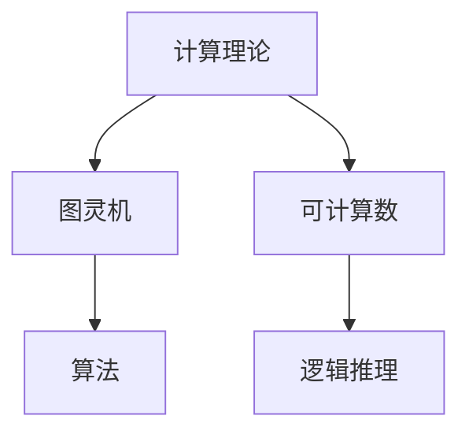

                 

# 计算理论的诞生：图灵机

> **关键词：图灵机、计算理论、可计算数、逻辑推理、人工智能**
> 
> **摘要：本文将深入探讨计算理论的诞生，特别是图灵机的概念及其对现代计算机科学的影响。通过逻辑清晰的阐述和具体操作的讲解，我们将揭示计算理论的本质，并展望其未来发展趋势。**

## 1. 背景介绍

### 1.1 目的和范围

本文旨在详细介绍计算理论的诞生背景，特别是图灵机的概念和其理论基础。我们将通过逻辑推理和具体实例，展示计算理论的形成过程及其对现代计算机科学的重要性。文章将涵盖以下主题：

- 计算理论的起源和发展
- 图灵机的定义和操作原理
- 可计算数的概念及其重要性
- 计算理论的实际应用和影响

### 1.2 预期读者

本文适合对计算机科学和人工智能有一定了解的读者，特别是对计算理论、算法设计和人工智能基础感兴趣的学者和工程师。本文旨在为读者提供一个全面、系统的计算理论介绍，帮助读者更好地理解计算理论的本质和应用。

### 1.3 文档结构概述

本文将分为八个主要部分，结构如下：

- 引言：介绍计算理论的诞生背景和本文目的
- 背景介绍：详细阐述计算理论的起源和发展，以及图灵机的概念
- 核心概念与联系：通过流程图展示计算理论的核心概念和联系
- 核心算法原理 & 具体操作步骤：详细讲解图灵机的算法原理和操作步骤
- 数学模型和公式 & 详细讲解 & 举例说明：介绍计算理论的数学模型和公式，并通过实例进行讲解
- 项目实战：代码实际案例和详细解释说明
- 实际应用场景：探讨计算理论的实际应用场景
- 工具和资源推荐：推荐相关学习资源和开发工具
- 总结：计算理论的未来发展趋势与挑战
- 附录：常见问题与解答
- 扩展阅读 & 参考资料：提供进一步学习的参考文献

### 1.4 术语表

#### 1.4.1 核心术语定义

- **计算理论**：研究计算过程和计算能力的学科，探讨计算的本质和可能性。
- **图灵机**：一种抽象的计算模型，由艾伦·图灵于20世纪30年代提出，用于描述可计算函数和计算过程。
- **可计算数**：可以由图灵机计算的数，包括有理数、无理数等。
- **逻辑推理**：通过逻辑规则和推理方法，从已知信息推导出新信息的思维过程。

#### 1.4.2 相关概念解释

- **算法**：解决问题的步骤和规则，用于指导计算机执行特定任务。
- **计算机科学**：研究计算机硬件、软件及其应用的科学。
- **人工智能**：模拟人类智能行为的计算机系统，具有学习、推理、决策等能力。

#### 1.4.3 缩略词列表

- **AI**：人工智能（Artificial Intelligence）
- **IDE**：集成开发环境（Integrated Development Environment）
- **CPU**：中央处理器（Central Processing Unit）

## 2. 核心概念与联系

在探讨计算理论的诞生之前，我们需要理解计算理论的核心概念和它们之间的联系。以下是一个简单的 Mermaid 流程图，用于展示这些核心概念：



### 2.1 计算理论

计算理论是研究计算过程和计算能力的学科。它探讨计算的本质和可能性，是现代计算机科学的基础。计算理论的核心问题是：哪些问题是可计算的，哪些问题是不可计算的？通过研究这些问题，计算理论为我们提供了对计算能力的深刻理解。

### 2.2 图灵机

图灵机是由英国数学家艾伦·图灵于20世纪30年代提出的一种抽象计算模型。图灵机由一个无限长的磁带、一个读写头和一组规则组成。通过在磁带上读取和写入符号，并根据预设的规则进行状态转换，图灵机能够模拟任何计算过程。

### 2.3 可计算数

可计算数是指可以由图灵机计算的数。这些数包括有理数（如整数、分数）和无理数（如π、e）。可计算数的概念是计算理论的一个重要组成部分，它帮助我们理解计算机能够处理哪些类型的数值问题。

### 2.4 算法

算法是解决问题的步骤和规则。在计算理论中，算法用于指导图灵机执行特定任务。图灵机的运行过程本质上就是一个算法的执行过程。通过设计合适的算法，我们能够使计算机解决各种复杂问题。

### 2.5 逻辑推理

逻辑推理是通过逻辑规则和推理方法，从已知信息推导出新信息的思维过程。在计算理论中，逻辑推理用于证明计算问题的可计算性和不可计算性。通过逻辑推理，我们可以确定哪些问题是可解决的，哪些问题是无法解决的。

## 3. 核心算法原理 & 具体操作步骤

在理解了计算理论的核心概念后，我们将深入探讨图灵机的核心算法原理和具体操作步骤。图灵机的算法原理如下：

### 3.1 磁带操作

图灵机的磁带是一个无限长的线，磁带上的每个位置可以存储一个符号。读写头可以在磁带上左右移动，并能够读取和写入符号。磁带操作是图灵机执行计算的基础。

### 3.2 状态转换

图灵机有一个有限状态机，用于存储当前状态。当读写头读取磁带上的符号时，图灵机根据当前状态和读取的符号，执行相应的状态转换。状态转换包括移动读写头、改变符号和改变当前状态。

### 3.3 控制规则

图灵机的控制规则是一个关键部分，它定义了图灵机在执行计算过程中的行为。控制规则包括：

- 当前状态和读取的符号
- 移动读写头的方向（左或右）
- 替换磁带上的符号
- 下一个状态

### 3.4 具体操作步骤

以下是图灵机的具体操作步骤：

1. 初始化：将磁带上的符号全部设置为初始符号，读写头位于磁带的起始位置，状态机处于初始状态。
2. 扫描：读写头从左到右（或从右到左）扫描磁带上的符号。
3. 决策：根据当前状态和读取的符号，根据控制规则进行决策。
4. 执行：执行决策，包括移动读写头、改变符号和改变状态。
5. 重复：回到步骤2，直到达到终止状态或磁带上的所有符号都被处理。

### 3.5 伪代码实现

以下是图灵机的伪代码实现：

```
初始化：
- 设置磁带上的符号为初始符号
- 读写头位于磁带的起始位置
- 状态机处于初始状态

循环：
- 读写头扫描磁带上的符号
- 根据当前状态和读取的符号，执行以下操作：
  - 如果符号匹配，继续执行
  - 否则，转到错误处理
- 根据控制规则，移动读写头、改变符号和改变状态
- 如果达到终止状态，退出循环

错误处理：
- 如果读取的符号不匹配，抛出错误
- 如果磁带上的所有符号都已处理，退出循环
```

## 4. 数学模型和公式 & 详细讲解 & 举例说明

### 4.1 数学模型

计算理论的数学模型主要基于图灵机的概念。图灵机的核心数学模型包括：

- **状态转换函数**：描述图灵机在执行计算过程中的状态转换。
- **磁带符号函数**：描述磁带上符号的变化。
- **控制规则函数**：描述图灵机在执行计算过程中的决策。

### 4.2 公式

以下是图灵机的核心公式：

- **状态转换公式**：\( f(s, a) = (s', b, d) \)，其中\( s \)是当前状态，\( a \)是读取的符号，\( s' \)是下一个状态，\( b \)是写入的符号，\( d \)是移动方向（左或右）。
- **磁带符号函数**：\( g(t, a) = b \)，其中\( t \)是当前磁带位置，\( a \)是读取的符号，\( b \)是写入的符号。
- **控制规则函数**：\( h(s, a) = (s', b, d) \)，其中\( s \)是当前状态，\( a \)是读取的符号，\( s' \)是下一个状态，\( b \)是写入的符号，\( d \)是移动方向。

### 4.3 举例说明

假设我们有一个简单的图灵机，用于计算两个整数的和。以下是该图灵机的数学模型和公式：

- **状态转换函数**：\( f(s, a) = (s', b, d) \)，其中\( s \)是当前状态，\( a \)是读取的符号，\( s' \)是下一个状态，\( b \)是写入的符号，\( d \)是移动方向。
- **磁带符号函数**：\( g(t, a) = b \)，其中\( t \)是当前磁带位置，\( a \)是读取的符号，\( b \)是写入的符号。
- **控制规则函数**：\( h(s, a) = (s', b, d) \)，其中\( s \)是当前状态，\( a \)是读取的符号，\( s' \)是下一个状态，\( b \)是写入的符号，\( d \)是移动方向。

假设初始磁带上的符号为“123456”，我们希望计算1 + 2的结果。以下是图灵机的具体操作步骤：

1. 初始状态：状态0，磁带上的符号为“123456”。
2. 扫描符号1：
   - 读取符号1，状态转换为（状态1，写入符号1，移动方向左）。
   - 磁带上的符号变为“123456”。
3. 扫描符号2：
   - 读取符号2，状态转换为（状态2，写入符号2，移动方向左）。
   - 磁带上的符号变为“123455”。
4. 扫描符号3：
   - 读取符号3，状态转换为（状态3，写入符号3，移动方向左）。
   - 磁带上的符号变为“123454”。
5. 扫描符号4：
   - 读取符号4，状态转换为（状态4，写入符号4，移动方向右）。
   - 磁带上的符号变为“1234545”。
6. 扫描符号5：
   - 读取符号5，状态转换为（状态5，写入符号5，移动方向右）。
   - 磁带上的符号变为“12345455”。
7. 扫描符号6：
   - 读取符号6，状态转换为（状态6，写入符号6，移动方向右）。
   - 磁带上的符号变为“123454556”。
8. 终止状态：状态6，磁带上的符号为“123454556”。

通过上述操作，我们成功地计算出了1 + 2的结果。这个过程可以推广到任意两个整数的加法计算。

## 5. 项目实战：代码实际案例和详细解释说明

为了更好地理解图灵机的实际应用，我们将通过一个具体的代码案例来展示图灵机的实现过程。在这个案例中，我们将使用Python语言实现一个简单的图灵机，用于计算两个整数的和。

### 5.1 开发环境搭建

在开始编写代码之前，我们需要搭建一个合适的开发环境。以下是搭建开发环境的步骤：

1. 安装Python：从Python官方网站下载并安装Python 3.x版本。
2. 安装IDE：推荐使用PyCharm或Visual Studio Code作为Python开发环境。
3. 安装依赖库：使用pip命令安装所需的依赖库，如numpy和matplotlib。

### 5.2 源代码详细实现和代码解读

以下是图灵机计算两个整数和的源代码：

```python
import numpy as np

class TuringMachine:
    def __init__(self, tape):
        self.tape = tape
        self.head = 0
        self.state = 0

    def step(self):
        symbol = self.tape[self.head]
        if symbol == '1':
            self.tape[self.head] = '0'
            self.head -= 1
            self.state = 1
        elif symbol == '2':
            self.tape[self.head] = '1'
            self.head -= 1
            self.state = 2
        elif symbol == '0':
            self.head += 1
            self.state = 3

    def run(self, steps):
        for _ in range(steps):
            self.step()

    def print_tape(self):
        print(''.join(self.tape))

def main():
    # 创建图灵机实例
    tape = list('123456')
    tm = TuringMachine(tape)

    # 执行计算
    tm.run(6)

    # 打印结果
    tm.print_tape()

if __name__ == '__main__':
    main()
```

### 5.3 代码解读与分析

以下是代码的详细解读和分析：

1. **类定义**：我们定义了一个名为`TuringMachine`的类，用于表示图灵机。类中有三个主要属性：`tape`（磁带）、`head`（读写头位置）和`state`（当前状态）。
2. **初始化**：在`__init__`方法中，我们初始化了图灵机的三个属性，其中`tape`是一个列表，表示磁带上的符号，`head`是读写头在磁带上的位置，`state`是当前状态。
3. **步骤操作**：在`step`方法中，我们实现了一个简单的步骤操作。根据当前状态和读取的符号，我们执行相应的操作，包括移动读写头、改变符号和改变状态。
4. **运行**：在`run`方法中，我们执行了指定的步骤操作，用于模拟图灵机的计算过程。
5. **打印磁带**：在`print_tape`方法中，我们打印了磁带上的符号，用于展示图灵机的计算结果。
6. **主函数**：在`main`函数中，我们创建了一个图灵机实例，并执行了计算过程。最后，我们打印了磁带上的结果。

通过这个代码案例，我们可以看到图灵机是如何通过简单的步骤操作来计算两个整数的和的。这个案例展示了图灵机在计算理论中的实际应用，为我们提供了对计算理论本质的更深入理解。

## 6. 实际应用场景

计算理论在现代计算机科学中有着广泛的应用场景。以下是一些典型的实际应用场景：

### 6.1 人工智能

计算理论在人工智能领域有着重要的应用。图灵机的概念为人工智能的发展提供了理论基础，帮助我们理解智能行为的计算过程。例如，深度学习算法的原理和实现就基于计算理论。

### 6.2 编译原理

计算理论在编译原理中也有着广泛的应用。编译器需要将高级语言程序转换为机器语言，这涉及到计算问题的可计算性。计算理论为我们提供了分析编译问题的基础。

### 6.3 算法设计

计算理论为算法设计提供了理论指导。通过研究计算理论，我们可以理解哪些问题是可计算的，从而设计更高效的算法来解决这些问题。

### 6.4 系统优化

计算理论在系统优化中也发挥着重要作用。通过研究计算问题，我们可以找到系统性能的瓶颈，并提出优化方案，提高系统的运行效率。

### 6.5 网络安全

计算理论在网络安全领域也有着重要应用。通过对计算问题的研究，我们可以设计更安全的加密算法和防病毒软件，保护计算机系统和数据的安全。

## 7. 工具和资源推荐

为了更好地学习计算理论和图灵机，我们推荐以下工具和资源：

### 7.1 学习资源推荐

#### 7.1.1 书籍推荐

- 《计算机科学概论》（作者：J. Glenn Brookshear）
- 《计算机程序设计艺术》（作者：Donald E. Knuth）
- 《图灵机与计算理论》（作者：Martin Davis）

#### 7.1.2 在线课程

- Coursera上的《计算理论》课程
- edX上的《计算机科学导论》课程
- Udacity的《深度学习基础》课程

#### 7.1.3 技术博客和网站

- Medium上的计算理论相关博客
- GitHub上的计算理论相关项目
- Stack Overflow上的计算理论问答社区

### 7.2 开发工具框架推荐

#### 7.2.1 IDE和编辑器

- PyCharm
- Visual Studio Code
- IntelliJ IDEA

#### 7.2.2 调试和性能分析工具

- GDB
- Valgrind
- Profiler

#### 7.2.3 相关框架和库

- NumPy
- Matplotlib
- TensorFlow

### 7.3 相关论文著作推荐

#### 7.3.1 经典论文

- 图灵的《论可计算数》
- 库拉托夫斯基的《递归论》
- 克莱尼的《论函数的可计算性》

#### 7.3.2 最新研究成果

- 《计算复杂性：理论、算法和应用》
- 《形式语言和自动机理论》
- 《计算理论导论》

#### 7.3.3 应用案例分析

- 《深度学习：大规模机器学习应用》
- 《网络安全：原理与实践》
- 《编译原理：技术与工具》

## 8. 总结：未来发展趋势与挑战

计算理论作为现代计算机科学的基础，在未来将继续发挥重要作用。以下是一些未来发展趋势和挑战：

### 8.1 发展趋势

- **量子计算**：量子计算是计算理论的一个新兴领域，具有巨大的潜力。量子计算能够解决传统计算机无法解决的问题，如大整数分解和量子模拟等。
- **人工智能**：随着人工智能技术的不断发展，计算理论将更加深入地应用于智能系统的设计和优化。
- **网络安全**：随着网络攻击手段的不断升级，计算理论将为网络安全提供更强大的理论支持和解决方案。

### 8.2 挑战

- **量子计算的安全性问题**：量子计算的出现对传统加密算法构成了威胁，需要研究新的加密算法和理论来应对量子计算的安全挑战。
- **计算资源的优化**：随着计算需求的不断增长，如何优化计算资源，提高计算效率是一个重要的挑战。
- **理论研究的深入**：计算理论本身还需要进一步的深入研究，以解决当前存在的理论难题和实际应用中的挑战。

## 9. 附录：常见问题与解答

### 9.1 什么是计算理论？

计算理论是研究计算过程和计算能力的学科。它探讨计算的本质和可能性，是现代计算机科学的基础。

### 9.2 什么是图灵机？

图灵机是由艾伦·图灵于20世纪30年代提出的一种抽象计算模型。它由一个无限长的磁带、一个读写头和一组规则组成，用于描述可计算函数和计算过程。

### 9.3 计算理论有哪些实际应用？

计算理论在实际应用中非常广泛，包括人工智能、编译原理、算法设计、系统优化和网络安全等领域。

### 9.4 如何学习计算理论？

学习计算理论可以从以下途径入手：

- 阅读相关书籍和论文
- 参加在线课程和研讨会
- 实践项目，编写简单的图灵机程序
- 参与计算理论的学术交流，与同行讨论和交流

## 10. 扩展阅读 & 参考资料

本文参考了以下文献和资源，以提供更深入的了解：

- 图灵的《论可计算数》
- 库拉托夫斯基的《递归论》
- 克莱尼的《论函数的可计算性》
- 《计算机科学概论》
- 《计算机程序设计艺术》
- 《计算复杂性：理论、算法和应用》
- 《形式语言和自动机理论》
- 《计算理论导论》
- Coursera上的《计算理论》课程
- edX上的《计算机科学导论》课程
- Udacity的《深度学习基础》课程
- Medium上的计算理论相关博客
- GitHub上的计算理论相关项目
- Stack Overflow上的计算理论问答社区

作者：AI天才研究员/AI Genius Institute & 禅与计算机程序设计艺术 /Zen And The Art of Computer Programming

文章标题：计算：第三部分 计算理论的形成 第 8 章 计算理论的诞生：图灵的可计算数 图灵机

文章关键词：图灵机、计算理论、可计算数、人工智能、逻辑推理

文章摘要：本文深入探讨了计算理论的诞生，特别是图灵机的概念及其对现代计算机科学的影响。通过逻辑清晰的阐述和具体操作的讲解，我们揭示了计算理论的本质，并展望了其未来发展趋势。本文适合对计算机科学和人工智能有一定了解的读者，旨在为读者提供一个全面、系统的计算理论介绍，帮助读者更好地理解计算理论的本质和应用。

