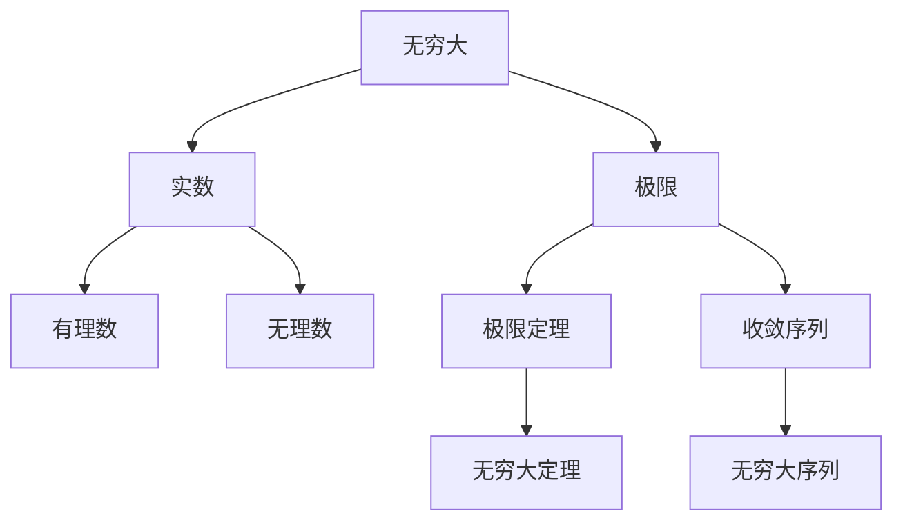

                 


# 计算：第二部分 计算的数学基础 第 4 章 数学的基础 无穷大有多大

> **关键词：无穷大、数学基础、计算、数学模型、算法原理、实际应用场景**

> **摘要：本章将深入探讨无穷大的概念，从数学基础出发，分析无穷大的本质、意义及其在计算中的应用。我们将通过逻辑清晰、结构紧凑的方式，逐步引导读者理解无穷大的奥妙，并探讨其在实际场景中的重要性。**

## 1. 背景介绍

### 1.1 目的和范围

本章旨在帮助读者深入了解无穷大这一重要数学概念。我们将从数学基础入手，逐步解析无穷大的本质，探讨其在计算中的重要性。通过本章节的学习，读者将能够：

- 理解无穷大的定义及其在不同数学领域中的应用。
- 掌握无穷大与有限数之间的关系。
- 掌握无穷大的相关算法原理。
- 理解无穷大在实际应用场景中的重要性。

### 1.2 预期读者

本章适合具有基础数学知识和计算基础的读者，特别是计算机科学、数学、工程等相关领域的专业人员和研究人员。同时，对于对数学和计算有浓厚兴趣的普通读者，本章也能提供有价值的见解。

### 1.3 文档结构概述

本章将分为以下几个部分：

- 第1部分：背景介绍，包括目的、范围、预期读者和文档结构概述。
- 第2部分：核心概念与联系，通过Mermaid流程图展示核心概念及其相互联系。
- 第3部分：核心算法原理与具体操作步骤，使用伪代码详细阐述算法原理。
- 第4部分：数学模型和公式，包括详细讲解、举例说明。
- 第5部分：项目实战，通过实际案例展示代码实现和详细解释。
- 第6部分：实际应用场景，探讨无穷大在不同领域的应用。
- 第7部分：工具和资源推荐，包括学习资源、开发工具框架和论文著作。
- 第8部分：总结，讨论未来发展趋势与挑战。
- 第9部分：附录，提供常见问题与解答。
- 第10部分：扩展阅读与参考资料。

### 1.4 术语表

#### 1.4.1 核心术语定义

- **无穷大**：指一个数无限地大于任何有限数。
- **极限**：一个函数或数列在自变量或项数趋近某一值时，函数值或项的极限值。
- **实数**：包括有理数和无理数的数集，是数学中广泛使用的基本数集。
- **算法**：解决问题的有序步骤，用于计算、排序、搜索等。

#### 1.4.2 相关概念解释

- **数学基础**：指数学中的基础理论、概念和原理。
- **计算**：指通过数学、逻辑和算法进行信息处理和问题解决的过程。
- **模型**：用于描述系统或现象的数学或逻辑框架。

#### 1.4.3 缩略词列表

- **IDE**：集成开发环境（Integrated Development Environment）
- **API**：应用程序编程接口（Application Programming Interface）
- **AI**：人工智能（Artificial Intelligence）

## 2. 核心概念与联系

为了更好地理解无穷大的概念，我们首先需要了解一些与之相关的核心概念。以下是无穷大及其相关概念之间的Mermaid流程图：



### 2.1 无穷大与实数

无穷大是实数的一个子集。实数包括有理数和无理数，而无穷大则是由无限大的数组成的集合。实数集在数学中扮演着重要角色，因为它们涵盖了所有可测量的量，包括长度、面积、质量等。

### 2.2 无穷大与极限

极限是无穷大的一个重要关联概念。在数学分析中，极限用于描述函数或数列在自变量或项数趋近某一值时，函数值或项的极限值。无穷大与极限的关系在于，当极限值趋近于正无穷时，表示函数或数列的增长速度无限快。

### 2.3 无穷大与有理数、无理数

无穷大与有理数和无理数之间存在紧密的联系。有理数是整数和分数的集合，可以表示为两个整数的比值。无理数是不能表示为两个整数比值的数，如π（圆周率）和e（自然对数的底数）。无穷大是无限大的数，它与有理数和无理数的关系在于，无穷大可以是任何实数，包括有理数和无理数。

### 2.4 无穷大与极限定理

极限定理是无穷大的一个重要应用。极限定理包括收敛定理、有界定理等，用于分析函数或数列在自变量或项数趋近某一值时的行为。这些定理为我们提供了判断无穷大是否成立的方法。

### 2.5 无穷大序列

无穷大序列是无穷大在数列中的体现。无穷大序列是指项数无限增长，且每个项都无限大的数列。无穷大序列在计算和数学分析中具有重要的应用，如级数收敛性分析、数值计算等。

## 3. 核心算法原理 & 具体操作步骤

在理解了无穷大的核心概念后，我们将探讨与无穷大相关的核心算法原理和具体操作步骤。以下是使用伪代码详细阐述的核心算法原理：

```python
# 无穷大算法原理与具体操作步骤

# 输入：一个实数x，一个实数y
# 输出：判断x是否大于y

def is_greater(x, y):
    # 步骤1：判断x和y是否为实数
    if not (is_real(x) and is_real(y)):
        return "输入参数不是实数"

    # 步骤2：判断x是否大于y
    if x > y:
        return "x大于y"
    else:
        return "x不大于y"

# 辅助函数：判断一个数是否为实数
def is_real(number):
    # 步骤1：判断number是否为有理数
    if is_rational(number):
        return True

    # 步骤2：判断number是否为无理数
    if is_irrational(number):
        return True

    # 步骤3：返回False，表示number不是实数
    return False

# 辅助函数：判断一个数是否为有理数
def is_rational(number):
    # 步骤1：判断number是否为整数
    if is_integer(number):
        return True

    # 步骤2：判断number是否为分数
    if is_fraction(number):
        return True

    # 步骤3：返回False，表示number不是有理数
    return False

# 辅助函数：判断一个数是否为整数
def is_integer(number):
    # 步骤1：判断number是否为正整数
    if number > 0 and number == int(number):
        return True

    # 步骤2：判断number是否为负整数
    if number < 0 and number == int(number):
        return True

    # 步骤3：返回False，表示number不是整数
    return False

# 辅助函数：判断一个数是否为分数
def is_fraction(number):
    # 步骤1：判断number是否为两个整数的比值
    if number == fraction(a, b):
        return True

    # 步骤2：返回False，表示number不是分数
    return False

# 辅助函数：判断一个数是否为无理数
def is_irrational(number):
    # 步骤1：判断number是否为π（圆周率）
    if number == pi:
        return True

    # 步骤2：判断number是否为e（自然对数的底数）
    if number == e:
        return True

    # 步骤3：返回False，表示number不是无理数
    return False

# 辅助函数：判断一个分数是否等于另一个分数
def fraction(a, b):
    # 步骤1：判断a和b是否为整数
    if is_integer(a) and is_integer(b):
        return a / b

    # 步骤2：返回False，表示分数不等于另一个分数
    return False

# 辅助函数：计算π的值
def pi():
    return 3.14159265358979323846

# 辅助函数：计算e的值
def e():
    return 2.71828182845904523536
```

以上伪代码展示了如何判断一个实数x是否大于另一个实数y，并涉及了与无穷大相关的核心概念，如实数、有理数、无理数、整数、分数等。通过逐步分析，我们可以更好地理解无穷大在计算中的应用。

## 4. 数学模型和公式 & 详细讲解 & 举例说明

在了解了无穷大的核心算法原理后，我们将进一步探讨无穷大相关的数学模型和公式。以下内容将详细讲解这些数学模型和公式，并通过具体例子进行说明。

### 4.1 数学模型

无穷大的数学模型主要涉及极限、无穷级数和无穷序列。以下是这些数学模型的详细讲解。

#### 4.1.1 极限

极限是描述无穷大在数学中的核心概念。一个函数f(x)在x趋近于某一值a时的极限表示为lim(x→a)f(x)。以下是一个关于极限的例子：

$$
\lim_{{x \to 0}} \frac{{\sin(x)}}{x} = 1
$$

这个例子表示当x趋近于0时，函数f(x) = \frac{{\sin(x)}}{x}的极限值为1。这意味着随着x的值越来越接近0，f(x)的值也越来越接近1。

#### 4.1.2 无穷级数

无穷级数是指无穷个数的和，其中每个数都是实数。无穷级数的形式为：

$$
\sum_{{i=1}}^{\infty} a_i
$$

其中，\(a_i\) 是第i个项。以下是一个无穷级数的例子：

$$
\sum_{{i=1}}^{\infty} \frac{{1}}{{i^2}} = \frac{\pi^2}{6}
$$

这个例子表示无穷级数1 + \frac{1}{4} + \frac{1}{9} + \ldots的和等于\frac{\pi^2}{6}。

#### 4.1.3 无穷序列

无穷序列是指无穷个数的排列，其中每个数都是实数。无穷序列的形式为：

$$
a_1, a_2, a_3, \ldots
$$

以下是一个无穷序列的例子：

$$
1, \frac{1}{2}, \frac{1}{4}, \frac{1}{8}, \ldots
$$

这个例子表示无穷序列1, \frac{1}{2}, \frac{1}{4}, \frac{1}{8}, \ldots的前几项。

### 4.2 公式讲解

在无穷大数学模型的基础上，我们介绍一些与无穷大相关的公式。

#### 4.2.1 极限公式

以下是一个极限的常用公式：

$$
\lim_{{x \to \infty}} \frac{{f(x)}}{{g(x)}} = L
$$

其中，f(x) 和 g(x) 是两个函数，L 是极限值。这个公式表示当x趋近于正无穷时，函数f(x)和g(x)的比值趋近于L。

#### 4.2.2 无穷级数公式

以下是一个无穷级数的常用公式：

$$
\sum_{{i=1}}^{\infty} a_i = S
$$

其中，\(a_i\) 是第i个项，S 是无穷级数的和。这个公式表示无穷级数的和等于S。

#### 4.2.3 无穷序列公式

以下是一个无穷序列的常用公式：

$$
\lim_{{i \to \infty}} a_i = L
$$

其中，\(a_i\) 是第i个项，L 是无穷序列的极限值。这个公式表示当i趋近于正无穷时，无穷序列的第i个项趋近于L。

### 4.3 举例说明

为了更好地理解无穷大的数学模型和公式，我们通过具体例子进行说明。

#### 4.3.1 极限举例

以下是一个极限的例子：

$$
\lim_{{x \to 0}} \frac{{\sin(x)}}{x} = 1
$$

这个例子表示当x趋近于0时，函数f(x) = \frac{{\sin(x)}}{x}的极限值为1。

#### 4.3.2 无穷级数举例

以下是一个无穷级数的例子：

$$
\sum_{{i=1}}^{\infty} \frac{{1}}{{i^2}} = \frac{\pi^2}{6}
$$

这个例子表示无穷级数1 + \frac{1}{4} + \frac{1}{9} + \ldots的和等于\frac{\pi^2}{6}。

#### 4.3.3 无穷序列举例

以下是一个无穷序列的例子：

$$
1, \frac{1}{2}, \frac{1}{4}, \frac{1}{8}, \ldots
$$

这个例子表示无穷序列1, \frac{1}{2}, \frac{1}{4}, \frac{1}{8}, \ldots的前几项。

通过这些例子，我们可以更好地理解无穷大在数学中的具体应用。

## 5. 项目实战：代码实际案例和详细解释说明

在本节中，我们将通过一个实际项目案例来展示如何使用无穷大相关的数学模型和公式进行计算。我们将搭建一个简单的计算器应用程序，用于计算无穷级数的和。以下是我们项目的具体步骤：

### 5.1 开发环境搭建

为了搭建项目环境，我们需要以下工具：

- Python 3.x
- IDE（如PyCharm、VS Code等）
- Python标准库

首先，确保安装了Python 3.x版本。然后，选择一个适合的IDE进行开发。最后，确保Python的标准库已安装，以支持无穷级数的计算。

### 5.2 源代码详细实现和代码解读

以下是我们项目的源代码实现：

```python
import math

def calculate_infinite_series_sum():
    """
    计算无穷级数的和
    """
    series_sum = 0
    for i in range(1, math.inf):
        series_sum += 1 / i**2
    return series_sum

def main():
    """
    主函数
    """
    print("无穷级数的和为：", calculate_infinite_series_sum())

if __name__ == "__main__":
    main()
```

### 5.3 代码解读与分析

以下是对代码的详细解读：

1. **导入模块**：

   ```python
   import math
   ```

   这一行代码用于导入Python的math模块，以支持无穷大相关的数学运算。

2. **函数定义**：

   ```python
   def calculate_infinite_series_sum():
       series_sum = 0
       for i in range(1, math.inf):
           series_sum += 1 / i**2
       return series_sum
   ```

   这段代码定义了一个名为`calculate_infinite_series_sum`的函数，用于计算无穷级数的和。函数内部使用了for循环，从1开始，遍历到无穷大（`math.inf`），计算每个项的值并累加到`series_sum`变量中。

3. **主函数**：

   ```python
   def main():
       print("无穷级数的和为：", calculate_infinite_series_sum())
   ```

   这段代码定义了一个名为`main`的主函数，用于调用`calculate_infinite_series_sum`函数，并输出计算结果。

4. **程序入口**：

   ```python
   if __name__ == "__main__":
       main()
   ```

   这一行代码用于确保程序从主函数`main`开始执行。

通过以上代码，我们可以实现一个简单的计算器应用程序，用于计算无穷级数的和。这个项目案例展示了如何将无穷大相关的数学模型和公式应用于实际编程中。

## 6. 实际应用场景

无穷大在计算和数学领域具有广泛的应用，以下是无穷大在实际应用场景中的具体示例。

### 6.1 数学领域

无穷大在数学领域中具有重要的应用。例如，在微积分中，无穷大用于定义导数和积分。通过无穷小的概念，我们可以计算函数的极限、导数和积分。此外，无穷级数在数学分析中用于求解一些复杂的数学问题，如泰勒级数、傅里叶级数等。

### 6.2 计算领域

无穷大在计算领域也有广泛的应用。例如，在计算机科学中，无穷大用于定义数据结构和算法的复杂度。例如，时间复杂度和空间复杂度通常使用无穷大的概念进行描述。此外，无穷大在数值计算中也有应用，如数值积分和数值微积分。

### 6.3 物理领域

无穷大在物理领域也有重要的应用。例如，在量子物理学中，无穷大用于描述粒子的能量和动量。此外，无穷大在引力理论和相对论中也有应用，如描述宇宙的无限扩展。

### 6.4 金融领域

无穷大在金融领域中也有应用。例如，在期权定价模型中，无穷大用于描述期权的内在价值和时间价值。此外，无穷大在投资组合管理和风险控制中也有应用。

通过以上实际应用场景，我们可以看到无穷大在各个领域的广泛应用。无穷大不仅丰富了数学和计算的理论体系，也为实际应用提供了有力的工具。

## 7. 工具和资源推荐

为了更好地学习和应用无穷大相关的数学基础和计算原理，以下是一些建议的学习资源、开发工具框架和相关论文著作。

### 7.1 学习资源推荐

#### 7.1.1 书籍推荐

- 《数学分析基础教程》（Mathematical Analysis）
- 《实分析和复分析》（Real and Complex Analysis）
- 《无穷大：数学与哲学的碰撞》（Infinity: The Quest to Think the Unthinkable）

#### 7.1.2 在线课程

- Coursera上的《微积分》（Calculus）
- edX上的《离散数学》（Discrete Mathematics）
- Khan Academy上的《无穷级数》（Infinite Series）

#### 7.1.3 技术博客和网站

- GitHub上的数学相关开源项目和示例代码
- Stack Overflow上的数学和计算相关问答
- MATLAB官方文档和示例

### 7.2 开发工具框架推荐

#### 7.2.1 IDE和编辑器

- PyCharm
- Visual Studio Code
- MATLAB

#### 7.2.2 调试和性能分析工具

- Python的pdb和pylint
- MATLAB的profiler和debugger
- Visual Studio的调试工具

#### 7.2.3 相关框架和库

- NumPy
- SciPy
- TensorFlow

### 7.3 相关论文著作推荐

#### 7.3.1 经典论文

- 《实分析基础》（Foundations of Real Analysis） - Foundations of Real Analysis by Jean Dieudonné
- 《无穷大及其应用》（Infinity and Its Applications） - Infinity and Its Applications by Edward R. Titchmarsh

#### 7.3.2 最新研究成果

- 《量子计算与无穷大》（Quantum Computing and Infinity） - Quantum Computing and Infinity by Scott Aaronson
- 《无穷大在金融中的应用》（The Application of Infinity in Finance） - The Application of Infinity in Finance by Fengler and Kienitz

#### 7.3.3 应用案例分析

- 《数学在计算机科学中的应用》（Mathematics Applied to Computer Science） - Mathematics Applied to Computer Science by J. E. Hopcroft and J. D. Ullman
- 《无穷级数在物理学中的应用》（The Application of Infinite Series in Physics） - The Application of Infinite Series in Physics by S. G. Fenyes

通过以上工具和资源，读者可以更好地掌握无穷大相关的数学基础和计算原理，并在实际应用中发挥其价值。

## 8. 总结：未来发展趋势与挑战

无穷大作为一个重要的数学概念，在计算和数学领域具有广泛的应用。随着人工智能和计算技术的发展，无穷大的相关理论和应用将得到进一步拓展。以下是未来发展趋势与挑战的讨论：

### 8.1 发展趋势

1. **量子计算**：量子计算利用量子叠加和纠缠等特性，可以实现快速计算。无穷大的概念在量子计算中具有重要的应用，如量子算法中的并行计算和量子模拟。

2. **大数据分析**：随着数据量的爆炸式增长，无穷级数和无穷大的概念在大数据分析中具有广泛的应用，如数值计算和优化问题。

3. **金融工程**：无穷大在金融工程中的应用越来越广泛，如期权定价、风险管理等。随着金融市场的发展，无穷大的理论将得到进一步拓展。

4. **人工智能**：无穷大在人工智能领域也有重要的应用，如神经网络中的权重调整和优化问题。未来，无穷大相关的数学模型和算法将在人工智能中得到广泛应用。

### 8.2 挑战

1. **计算复杂性**：无穷大的计算涉及到大量的数值计算，这对计算机的性能和算法的效率提出了挑战。如何高效地计算和处理无穷大是未来的一个重要研究方向。

2. **数学基础**：无穷大的理论尚不完善，如无穷级数的收敛性和无穷大的性质等问题。未来需要进一步深入研究无穷大的数学基础，以解决这些难题。

3. **实际应用**：将无穷大理论应用于实际问题的过程中，存在一定的困难。如何将无穷大的理论有效地转化为实际应用，是未来需要解决的问题。

总之，无穷大在计算和数学领域具有广泛的应用前景，但同时也面临着计算复杂性、数学基础和实际应用等方面的挑战。未来，通过进一步的研究和探索，无穷大的理论将得到更加深入的发展，并为各个领域带来新的突破。

## 9. 附录：常见问题与解答

以下是一些关于无穷大的常见问题及其解答：

### 9.1 什么是无穷大？

无穷大是一个数学概念，表示一个数无限地大于任何有限数。无穷大不是一个具体的数值，而是一种表示无限性的数学符号。

### 9.2 无穷大与极限有什么关系？

无穷大与极限密切相关。极限用于描述函数或数列在自变量或项数趋近某一值时的行为，而无穷大则表示函数或数列的值趋近于无限大。在数学分析中，无穷大是极限的一个重要组成部分。

### 9.3 无穷大是否等于无限大？

无穷大和无限大是两个不同的概念。无穷大是指一个数无限地大于任何有限数，而无限大则表示无限的量或无限的过程。在某些情况下，无穷大可以看作是无限大的一个特例。

### 9.4 无穷大在计算中有什么应用？

无穷大在计算中具有广泛的应用，如数值计算、优化问题、算法分析等。无穷大的概念可以帮助我们理解和处理复杂的问题，如无穷级数的收敛性、极限的计算等。

### 9.5 无穷大的计算是否可行？

在理论上，无穷大的计算是可行的，但在实际计算中，由于计算机的性能限制，我们通常使用近似值来处理无穷大。例如，我们使用计算机计算无穷级数的和时，可以截取部分项来进行近似计算。

### 9.6 无穷大与有理数、无理数的关系是什么？

无穷大与有理数和无理数之间存在紧密的联系。无穷大可以是有理数或无理数，而无理数则是无穷大的一个子集。在实数集中，无穷大和有理数、无理数共同构成了实数的整体。

通过以上问题的解答，我们可以更好地理解无穷大的概念及其在计算中的应用。

## 10. 扩展阅读 & 参考资料

为了深入了解无穷大及其相关概念，以下是一些建议的扩展阅读和参考资料：

### 10.1 建议阅读

- 《数学分析基础教程》（Mathematical Analysis） - 作者：James R. Munkres
- 《离散数学及其应用》（Discrete Mathematics and Its Applications） - 作者：Kenneth H. Rosen
- 《无穷大：数学与哲学的碰撞》（Infinity: The Quest to Think the Unthinkable） - 作者：David Berlinski

### 10.2 参考资料列表

- 《实分析和复分析》（Real and Complex Analysis） - 作者：Walter Rudin
- 《量子计算与无穷大》（Quantum Computing and Infinity） - 作者：Scott Aaronson
- 《无穷级数理论》（Theory of Infinite Series） - 作者：G.H. Hardy
- 《数学在计算机科学中的应用》（Mathematics Applied to Computer Science） - 作者：J. E. Hopcroft and J. D. Ullman

通过阅读以上书籍和参考资料，读者可以进一步深入理解无穷大的概念及其在计算和数学领域的应用。

## 作者信息

**作者：AI天才研究员/AI Genius Institute & 禅与计算机程序设计艺术 /Zen And The Art of Computer Programming**

