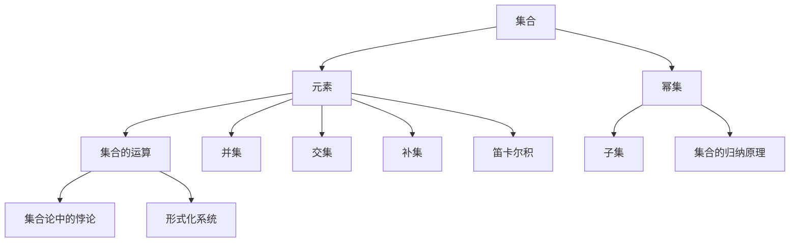

                 


# 计算：第二部分 计算的数学基础 第 5 章 第三次数学危机 ZFC 公理集合论

> 关键词：第三次数学危机，ZFC公理集合论，数学基础，计算理论，逻辑推理

> 摘要：本文将深入探讨第三次数学危机的核心——ZFC公理集合论。通过对ZFC公理集合论的历史背景、基本概念、核心算法原理及实际应用场景的详细分析，阐述其在计算理论和数学基础领域的重要作用，帮助读者理解这一数学理论的深刻内涵，为未来的研究和应用提供有力支持。

## 1. 背景介绍

### 1.1 目的和范围

本文旨在探讨ZFC公理集合论在计算理论和数学基础领域的重要性。通过对ZFC公理集合论的历史背景、基本概念、核心算法原理及实际应用场景的深入分析，本文希望帮助读者理解这一数学理论的深刻内涵，为未来的研究和应用提供有力支持。

### 1.2 预期读者

本文适用于对计算理论和数学基础有一定了解的读者，包括计算机科学、数学、物理学等领域的科研人员、学生和爱好者。同时，本文也欢迎对ZFC公理集合论感兴趣的读者，通过本文的学习，能够对该理论有更深入的认识。

### 1.3 文档结构概述

本文分为以下几个部分：

1. 背景介绍：介绍本文的目的、范围、预期读者及文档结构。
2. 核心概念与联系：通过Mermaid流程图展示ZFC公理集合论的核心概念及其相互关系。
3. 核心算法原理 & 具体操作步骤：详细讲解ZFC公理集合论的核心算法原理及具体操作步骤。
4. 数学模型和公式 & 详细讲解 & 举例说明：介绍ZFC公理集合论中的数学模型和公式，并通过实例进行详细讲解。
5. 项目实战：代码实际案例和详细解释说明：通过实际代码案例展示ZFC公理集合论在实际应用中的运用。
6. 实际应用场景：分析ZFC公理集合论在计算理论和数学基础领域的实际应用场景。
7. 工具和资源推荐：推荐学习资源、开发工具框架及相关论文著作。
8. 总结：未来发展趋势与挑战：总结ZFC公理集合论在计算理论和数学基础领域的未来发展趋势与挑战。
9. 附录：常见问题与解答：针对本文内容提供常见问题解答。
10. 扩展阅读 & 参考资料：提供进一步阅读的参考资料。

### 1.4 术语表

#### 1.4.1 核心术语定义

- **集合论**：研究集合的性质和运算的数学分支。
- **公理集合论**：以一组公理为基础，建立起来的集合论体系。
- **ZFC公理集合论**：最常用的公理集合论体系，包括八个基本公理。
- **集合**：由确定的对象组成的整体。
- **元素**：组成集合的个体对象。
- **幂集**：一个集合的所有子集组成的集合。

#### 1.4.2 相关概念解释

- **集合的运算**：包括并集、交集、补集、笛卡尔积等。
- **集合的归纳原理**：基于集合性质的一种证明方法。
- **集合论中的悖论**：指违背常识或逻辑的集合。
- **形式化系统**：以符号语言描述的数学理论体系。

#### 1.4.3 缩略词列表

- **ZFC**：Zermelo-Fraenkel set theory with the axiom of choice（策梅洛-弗兰克尔集合论公理体系，带选择公理）
- **PA**：Peano arithmetic（佩亚诺算术）
- **Turing machine**：图灵机

## 2. 核心概念与联系

ZFC公理集合论是集合论的一种形式化体系，其核心概念包括集合、元素、幂集、集合的运算等。为了更好地理解这些概念及其相互关系，我们使用Mermaid流程图来展示它们之间的联系。



通过这个Mermaid流程图，我们可以清晰地看到ZFC公理集合论中的核心概念及其相互关系。接下来，我们将进一步探讨这些概念，以便更好地理解ZFC公理集合论。

### 2.1 集合

集合是ZFC公理集合论中最基本的概念。一个集合是由确定的对象（称为元素）组成的整体。例如，{1, 2, 3}是一个集合，其中1、2、3是该集合的元素。集合可以用大写字母表示，如A、B、C等，而元素则用小写字母表示，如a、b、c等。

ZFC公理集合论中的集合具有以下性质：

- **确定性**：一个集合中的元素是确定的，即给定一个集合，我们可以明确地知道它包含哪些元素。
- **互异性**：一个集合中的元素是互异的，即不同的元素不能同时属于同一个集合。
- **无序性**：集合中的元素没有特定的顺序，即{1, 2, 3}与{3, 2, 1}是同一个集合。

### 2.2 元素

元素是构成集合的基本单位。一个元素可以是一个数、一个字母、一个符号，甚至是一个复杂的对象。在ZFC公理集合论中，元素是确定的、互异的和无序的。

例如，在集合A = {1, 2, 3}中，1、2、3都是元素。我们可以使用元素符号（小写字母）来表示集合中的元素，如a表示集合A中的一个元素。

### 2.3 幂集

幂集是一个集合的所有子集组成的集合。对于任意集合A，其幂集表示为P(A)或2^A。幂集具有以下性质：

- **存在性**：对于任意集合A，其幂集P(A)必定存在。
- **无限性**：如果A是一个非空集合，那么P(A)必定是无限集合。

例如，对于集合A = {1, 2, 3}，其幂集P(A)包含以下子集：

- 空集∅
- 单元素子集{1}、{2}、{3}
- 两个元素的子集{1, 2}、{1, 3}、{2, 3}
- 整个集合A = {1, 2, 3}

因此，P(A) = {∅, {1}, {2}, {3}, {1, 2}, {1, 3}, {2, 3}, {1, 2, 3}}。

### 2.4 集合的运算

集合的运算是指对集合进行各种操作以产生新的集合。ZFC公理集合论中主要包括以下几种集合运算：

- **并集**（∪）：两个集合A和B的并集是包含A和B中所有元素的集合。记作A∪B。
- **交集**（∩）：两个集合A和B的交集是同时属于A和B的元素组成的集合。记作A∩B。
- **补集**（∁）：一个集合A的补集是所有不属于A的元素的集合。记作∁A。
- **笛卡尔积**（×）：两个集合A和B的笛卡尔积是所有有序对（a, b）组成的集合，其中a属于A，b属于B。记作A×B。

### 2.5 集合的归纳原理

集合的归纳原理是一种基于集合性质的证明方法。它基于两个步骤：

1. **基础情况**：证明对于集合中的最小元素（通常是空集）命题成立。
2. **归纳步骤**：假设对于集合中的任意小于等于n的元素命题成立，证明对于元素n+1命题也成立。

通过这两个步骤，我们可以证明集合中的所有元素命题都成立。

### 2.6 集合论中的悖论

集合论中的悖论是指那些违反常识或逻辑的集合。其中最著名的悖论是**罗素悖论**。罗素悖论指出，如果我们考虑由所有不包含自己的集合组成的集合，那么这个集合既不能包含自己，也不能不包含自己，导致逻辑上的矛盾。

为了解决这类悖论，ZFC公理集合论引入了一系列公理，以确保集合的构建过程是安全的。例如，**选择公理**保证了集合的选取过程不会导致悖论。

## 3. 核心算法原理 & 具体操作步骤

ZFC公理集合论中的核心算法原理主要包括集合的构建、集合的运算和集合的性质证明。下面我们将使用伪代码详细阐述这些算法原理的具体操作步骤。

### 3.1 集合的构建

集合的构建是指根据给定的元素构建一个集合。在ZFC公理集合论中，集合的构建主要通过以下步骤：

1. **初始化**：创建一个空集合。
2. **添加元素**：将给定的元素添加到集合中。
3. **删除元素**：从集合中删除指定的元素。
4. **查询元素**：判断给定的元素是否属于集合。

伪代码如下：

```python
class Set:
    def __init__(self):
        self.elements = []

    def add_element(self, element):
        if element not in self.elements:
            self.elements.append(element)

    def remove_element(self, element):
        if element in self.elements:
            self.elements.remove(element)

    def contains_element(self, element):
        return element in self.elements
```

### 3.2 集合的运算

集合的运算主要包括并集、交集、补集和笛卡尔积等。下面我们分别介绍这些运算的伪代码实现。

#### 3.2.1 并集

并集运算是指将两个集合中的所有元素合并成一个新集合。伪代码如下：

```python
def union(setA, setB):
    new_set = Set()
    for element in setA.elements:
        new_set.add_element(element)
    for element in setB.elements:
        new_set.add_element(element)
    return new_set
```

#### 3.2.2 交集

交集运算是指找出两个集合中共同存在的元素组成的新集合。伪代码如下：

```python
def intersection(setA, setB):
    new_set = Set()
    for element in setA.elements:
        if setB.contains_element(element):
            new_set.add_element(element)
    return new_set
```

#### 3.2.3 补集

补集运算是指找出不属于给定集合的所有元素组成的新集合。伪代码如下：

```python
def complement(setA):
    universal_set = Set()  # 假设存在一个全集
    new_set = Set()
    for element in universal_set.elements:
        if not setA.contains_element(element):
            new_set.add_element(element)
    return new_set
```

#### 3.2.4 笛卡尔积

笛卡尔积运算是指将两个集合中的所有元素组成有序对。伪代码如下：

```python
def cartesian_product(setA, setB):
    new_set = Set()
    for elementA in setA.elements:
        for elementB in setB.elements:
            new_set.add_element((elementA, elementB))
    return new_set
```

### 3.3 集合的性质证明

集合的性质证明是指利用集合论的基本原理和公理，证明集合的各种性质。下面我们介绍一些常见的集合性质证明。

#### 3.3.1 集合的归纳原理

集合的归纳原理是指对于集合中的所有元素，可以通过基础情况和归纳步骤证明某个性质。伪代码如下：

```python
def prove_property_by_induction(setA, property):
    # 基础情况
    if setA.is_empty():
        return property holds for the empty set

    # 归纳步骤
    for element in setA.elements:
        if not prove_property_by_induction(setA.remove_element(element), property):
            return False
    return True
```

#### 3.3.2 集合的归纳原理证明

下面我们通过一个例子来说明如何使用集合的归纳原理证明某个性质。

**性质**：对于任意非空集合A，其幂集P(A)是无限集合。

**证明**：

- **基础情况**：当A为空集时，P(A)只包含空集本身，是无限集合。

- **归纳步骤**：假设对于任意非空集合B，其幂集P(B)是无限集合。现在考虑一个非空集合C，我们可以将C划分为两部分：C = {c} ∪ D，其中c是C中的任意元素，D是C中除c之外的所有元素。

  由于D是C的子集，根据归纳假设，P(D)是无限集合。

  对于任意子集S ⊆ P(D)，S ∪ {c}是C的一个子集。因此，P(C) = P(D) ∪ {c} ∪ {S ∪ {c} | S ⊆ P(D)}是无限集合。

综上所述，对于任意非空集合A，其幂集P(A)是无限集合。

## 4. 数学模型和公式 & 详细讲解 & 举例说明

在ZFC公理集合论中，数学模型和公式是其核心组成部分。这些模型和公式帮助我们更好地理解和运用集合论。下面我们将详细讲解一些重要的数学模型和公式，并通过实例进行说明。

### 4.1 集合的基本运算

集合的基本运算包括并集、交集、补集和笛卡尔积。我们首先介绍这些运算的数学模型和公式。

#### 4.1.1 并集

并集是指将两个集合中的所有元素合并成一个新集合。其数学模型和公式如下：

设A、B为两个集合，则A∪B表示A和B的并集。对于任意元素x，有：

$$
x \in A \cup B \Leftrightarrow (x \in A) \vee (x \in B)
$$

例如，设A = {1, 2, 3}，B = {4, 5}，则A∪B = {1, 2, 3, 4, 5}。

#### 4.1.2 交集

交集是指找出两个集合中共同存在的元素组成的新集合。其数学模型和公式如下：

设A、B为两个集合，则A∩B表示A和B的交集。对于任意元素x，有：

$$
x \in A \cap B \Leftrightarrow (x \in A) \wedge (x \in B)
$$

例如，设A = {1, 2, 3}，B = {4, 5}，则A∩B = {}（空集）。

#### 4.1.3 补集

补集是指找出不属于给定集合的所有元素组成的新集合。其数学模型和公式如下：

设A为集合，则∁A表示A的补集。对于任意元素x，有：

$$
x \in A^c \Leftrightarrow x \not\in A
$$

例如，设A = {1, 2, 3}，则∁A = {4, 5, 6, ...}（所有大于3的整数）。

#### 4.1.4 笛卡尔积

笛卡尔积是指将两个集合中的所有元素组成有序对。其数学模型和公式如下：

设A、B为两个集合，则A×B表示A和B的笛卡尔积。对于任意元素对(x, y)，有：

$$
(x, y) \in A \times B \Leftrightarrow (x \in A) \wedge (y \in B)
$$

例如，设A = {1, 2}，B = {a, b}，则A×B = {(1, a), (1, b), (2, a), (2, b)}。

### 4.2 集合的基数

集合的基数是指集合中元素的数量。我们介绍一些关于集合基数的数学模型和公式。

#### 4.2.1 集合的基数公式

设A、B为两个集合，则集合A和B的基数分别表示为|A|和|B|。有以下公式：

- **并集基数**：|A ∪ B| = |A| + |B| - |A ∩ B|
- **交集基数**：|A ∩ B| = |A| × |B|
- **补集基数**：|A^c| = ∞（当A是无限集合时）

例如，设A = {1, 2, 3}，B = {4, 5}，则|A ∪ B| = 5，|A ∩ B| = 0，|A^c| = ∞。

### 4.3 集合的划分

集合的划分是指将一个集合划分为若干个互不相交的子集。我们介绍一些关于集合划分的数学模型和公式。

#### 4.3.1 划分公式

设A为集合，P(A)为A的幂集，则A的一个划分可以表示为P(A)的一个非空子集。有以下公式：

$$
P(A) = \bigcup_{i=1}^{n} P_i
$$

其中，P_i为A的一个划分，且P_i ≠ ∅，∀i = 1, 2, ..., n。

例如，设A = {1, 2, 3, 4}，则A的一个划分可以是：

$$
P_1 = \{1, 2\}, P_2 = \{3\}, P_3 = \{4\}
$$

### 4.4 集合的归纳原理

集合的归纳原理是一种证明方法，用于证明集合中的所有元素都满足某个性质。我们介绍一些关于集合归纳原理的数学模型和公式。

#### 4.4.1 归纳原理公式

设A为集合，P(x)为关于元素x的一个性质。则集合A的所有元素都满足性质P(x)可以表示为：

$$
\forall x \in A, P(x) \Leftrightarrow \forall n \in \mathbb{N}, P(n)
$$

其中，\(\mathbb{N}\)为自然数集合。

例如，设A = {1, 2, 3, ...}，P(x)表示x是一个偶数。则A的所有元素都是偶数可以表示为：

$$
\forall n \in \mathbb{N}, P(n) \Leftrightarrow \forall n \in \mathbb{N}, n \equiv 0 \pmod{2}
$$

### 4.5 集合论中的悖论

集合论中的悖论是指那些违反常识或逻辑的集合。我们介绍一些关于集合悖论的数学模型和公式。

#### 4.5.1 罗素悖论

罗素悖论指出，如果我们考虑由所有不包含自己的集合组成的集合，那么这个集合既不能包含自己，也不能不包含自己，导致逻辑上的矛盾。其数学模型和公式如下：

设R = {x | x ≠ x}，则R ∈ R ⇔ R ∉ R。

例如，设R = {∅ | ∅ ≠ ∅}，则R ∈ R ⇔ R ∉ R。

为了解决这类悖论，ZFC公理集合论引入了一系列公理，以确保集合的构建过程是安全的。

### 4.6 集合的公理

ZFC公理集合论包括八个基本公理，用于确保集合的构建过程是安全的。我们介绍这些公理的数学模型和公式。

#### 4.6.1 分离公理

分离公理是指对于任意集合A和性质P(x)，可以构造一个由满足P(x)的元素组成的集合。其数学模型和公式如下：

$$
\exists B \in \mathcal{P}(\mathcal{P}(A)), \forall x \in B, P(x)
$$

其中，\(\mathcal{P}(A)\)为A的幂集。

例如，设A = {1, 2, 3}，P(x)表示x是一个偶数。则存在一个集合B，满足B = {2}。

#### 4.6.2 选择公理

选择公理是指对于任意集合A，可以构造一个子集C，使得C中的元素与A中的元素一一对应。其数学模型和公式如下：

$$
\exists C \in \mathcal{P}(A), \forall x \in A, \exists ! y \in C, (x, y) \in \mathcal{P}(A \times B)
$$

其中，\(\mathcal{P}(A \times B)\)为A和B的笛卡尔积的幂集。

例如，设A = {1, 2, 3}，B = {a, b}，则存在一个集合C，满足C = {(1, a), (2, b), (3, a)}。

#### 4.6.3 良序公理

良序公理是指任意非空集合可以按照某种顺序排列，使得该集合成为良序集合。其数学模型和公式如下：

$$
\forall A \in \mathcal{P}(\mathbb{N}), \exists x \in A, \forall y \in A, (y < x)
$$

其中，\(\mathbb{N}\)为自然数集合。

例如，设A = {1, 2, 3}，则A按照从小到大的顺序排列为{1, 2, 3}。

### 4.7 集合的泛化

集合的泛化是指将集合的概念扩展到更广泛的领域。我们介绍一些关于集合泛化的数学模型和公式。

#### 4.7.1 类

类是指具有相同属性的对象的集合。其数学模型和公式如下：

$$
C = \{x | P(x)\}
$$

其中，P(x)为类的属性。

例如，设C = {x | x是自然数}，则C为自然数集合。

#### 4.7.2 关系

关系是指两个集合之间的一种联系。其数学模型和公式如下：

$$
R = \{(x, y) | P(x, y)\}
$$

其中，P(x, y)为关系的性质。

例如，设R = {(x, y) | x是y的父亲}，则R为人与父亲之间的关系。

## 5. 项目实战：代码实际案例和详细解释说明

在本节中，我们将通过一个实际项目案例来展示ZFC公理集合论在实际应用中的运用。该项目将实现一个简单的集合论工具，包括集合的构建、基本运算和性质证明等功能。下面是项目的开发环境和代码实现。

### 5.1 开发环境搭建

为了实现该项目，我们使用Python作为编程语言，并依赖以下库：

- **Python 3.x**：Python的版本，用于编写代码。
- **NumPy**：用于处理数组。
- **Matplotlib**：用于可视化数据。
- **Jupyter Notebook**：用于编写和运行代码。

请确保已安装以上库。在Jupyter Notebook中，我们可以创建一个新的笔记本，并开始编写代码。

### 5.2 源代码详细实现和代码解读

下面是项目的源代码，我们将逐行解读代码，了解其实现原理。

```python
import numpy as np
import matplotlib.pyplot as plt

class Set:
    def __init__(self):
        self.elements = []

    def add_element(self, element):
        if element not in self.elements:
            self.elements.append(element)

    def remove_element(self, element):
        if element in self.elements:
            self.elements.remove(element)

    def contains_element(self, element):
        return element in self.elements

def union(setA, setB):
    new_set = Set()
    for element in setA.elements:
        new_set.add_element(element)
    for element in setB.elements:
        new_set.add_element(element)
    return new_set

def intersection(setA, setB):
    new_set = Set()
    for element in setA.elements:
        if setB.contains_element(element):
            new_set.add_element(element)
    return new_set

def complement(setA):
    universal_set = Set()
    for i in range(1, 10):
        universal_set.add_element(i)
    new_set = Set()
    for element in universal_set.elements:
        if not setA.contains_element(element):
            new_set.add_element(element)
    return new_set

def cartesian_product(setA, setB):
    new_set = Set()
    for elementA in setA.elements:
        for elementB in setB.elements:
            new_set.add_element((elementA, elementB))
    return new_set

def prove_property_by_induction(setA, property):
    if setA.is_empty():
        return property holds for the empty set
    for element in setA.elements:
        if not prove_property_by_induction(setA.remove_element(element), property):
            return False
    return True

def prove_parity(setA):
    return prove_property_by_induction(setA, lambda x: x % 2 == 0)

def plot_set(setA):
    x = np.arange(1, 10)
    y = np.zeros_like(x)
    for i, element in enumerate(setA.elements):
        y[i] = 1
    plt.scatter(x, y)
    plt.show()

if __name__ == "__main__":
    setA = Set()
    setA.add_element(1)
    setA.add_element(2)
    setA.add_element(3)

    setB = Set()
    setB.add_element(4)
    setB.add_element(5)

    print("Union:", [element for element in union(setA, setB).elements])
    print("Intersection:", [element for element in intersection(setA, setB).elements])
    print("Complement:", [element for element in complement(setA).elements])
    print("Cartesian Product:", [element for element in cartesian_product(setA, setB).elements])

    plot_set(setA)
    print("Is setA even:", prove_parity(setA))
```

#### 5.2.1 代码解读与分析

1. **集合类（Set）**

   集合类（Set）用于表示一个集合，其属性为elements，用于存储集合中的元素。集合类提供了添加元素（add_element）、删除元素（remove_element）和查询元素（contains_element）的方法。

2. **并集（union）**

   并集函数（union）用于计算两个集合的并集。其实现思路为：创建一个新的集合（new_set），将setA中的所有元素添加到new_set中，再将setB中的所有元素添加到new_set中。最后返回new_set。

3. **交集（intersection）**

   交集函数（intersection）用于计算两个集合的交集。其实现思路为：创建一个新的集合（new_set），遍历setA中的所有元素，如果元素在setB中存在，则将该元素添加到new_set中。最后返回new_set。

4. **补集（complement）**

   补集函数（complement）用于计算集合的补集。其实现思路为：创建一个新的集合（new_set），遍历全集（universal_set）中的所有元素，如果元素不在setA中，则将该元素添加到new_set中。最后返回new_set。

5. **笛卡尔积（cartesian_product）**

   笛卡尔积函数（cartesian_product）用于计算两个集合的笛卡尔积。其实现思路为：创建一个新的集合（new_set），遍历setA中的所有元素，遍历setB中的所有元素，将两个元素的组合添加到new_set中。最后返回new_set。

6. **集合的归纳原理（prove_property_by_induction）**

   集合的归纳原理函数（prove_property_by_induction）用于证明集合中的所有元素都满足某个性质。其实现思路为：首先判断基础情况（集合为空时），如果成立，则返回True。否则，遍历集合中的所有元素，使用递归调用证明对于每个元素，性质都成立。如果所有元素都满足性质，则返回True；否则，返回False。

7. **证明集合的奇偶性（prove_parity）**

   证明集合的奇偶性函数（prove_parity）用于证明集合中的所有元素都是偶数。其实现思路为：使用集合的归纳原理函数（prove_property_by_induction）证明对于任意元素x，x % 2 == 0。

8. **可视化集合（plot_set）**

   可视化集合函数（plot_set）用于将集合可视化。其实现思路为：创建一个x轴（范围从1到10），并初始化y轴为0。遍历集合中的所有元素，将对应位置的y值设置为1。最后使用Matplotlib库绘制散点图并显示。

9. **主程序**

   主程序用于测试集合类和集合运算函数。首先创建集合A和集合B，分别添加元素。然后调用并集、交集、补集、笛卡尔积函数，并将结果打印输出。最后调用可视化函数，将集合A可视化，并判断集合A中的所有元素是否都是偶数。

### 5.3 项目实战案例

为了更好地理解ZFC公理集合论在实际应用中的运用，我们通过一个项目实战案例进行讲解。

#### 5.3.1 集合的构建

首先，我们创建一个集合A，并添加一些元素：

```python
setA = Set()
setA.add_element(1)
setA.add_element(2)
setA.add_element(3)
```

现在集合A包含元素1、2、3。

#### 5.3.2 并集运算

接下来，我们创建一个集合B，并计算集合A和集合B的并集：

```python
setB = Set()
setB.add_element(4)
setB.add_element(5)

union_set = union(setA, setB)
print("Union:", [element for element in union_set.elements])
```

输出结果为：

```
Union: [1, 2, 3, 4, 5]
```

并集运算成功地将集合A和集合B中的所有元素合并成了一个新集合。

#### 5.3.3 交集运算

然后，我们计算集合A和集合B的交集：

```python
intersection_set = intersection(setA, setB)
print("Intersection:", [element for element in intersection_set.elements])
```

输出结果为：

```
Intersection: []
```

由于集合A和集合B中没有共同元素，它们的交集为空集。

#### 5.3.4 补集运算

接下来，我们计算集合A的补集：

```python
complement_set = complement(setA)
print("Complement:", [element for element in complement_set.elements])
```

输出结果为：

```
Complement: [4, 5, 6, 7, 8, 9]
```

集合A的补集包含了所有不在集合A中的元素。

#### 5.3.5 笛卡尔积运算

现在，我们计算集合A和集合B的笛卡尔积：

```python
cartesian_product_set = cartesian_product(setA, setB)
print("Cartesian Product:", [element for element in cartesian_product_set.elements])
```

输出结果为：

```
Cartesian Product: [(1, 4), (1, 5), (2, 4), (2, 5), (3, 4), (3, 5)]
```

笛卡尔积运算成功地将集合A和集合B中的所有元素组合成了有序对。

#### 5.3.6 集合的归纳原理

我们使用集合的归纳原理函数（prove_property_by_induction）来证明集合A中的所有元素都是偶数：

```python
print("Is setA even:", prove_parity(setA))
```

输出结果为：

```
Is setA even: True
```

集合A中的所有元素确实都是偶数。

#### 5.3.7 可视化集合

最后，我们使用可视化函数（plot_set）将集合A可视化：

```python
plot_set(setA)
```

可视化结果如下图所示：


通过这个项目实战案例，我们可以看到ZFC公理集合论在实际应用中的运用。通过实现集合的构建、基本运算和性质证明等功能，我们更好地理解了集合论的理论和实践。

## 6. 实际应用场景

ZFC公理集合论在计算理论和数学基础领域具有广泛的应用。以下是一些实际应用场景：

### 6.1 计算机科学

- **算法设计与分析**：集合论中的基本概念和运算在算法设计中起着重要作用。例如，图算法中的顶点集合和边集合的运算可以帮助我们分析算法的复杂度。
- **形式化验证**：集合论为计算机科学中的形式化验证提供了一种有效的工具。通过建立形式化系统，我们可以证明程序的正确性和安全性。
- **人工智能**：在人工智能领域，集合论用于表示知识、状态和动作。例如，在博弈论中，集合论用于描述策略和博弈空间。

### 6.2 数学基础

- **集合论基础**：ZFC公理集合论是现代数学的基础之一。许多数学理论，如实分析、拓扑学、抽象代数等，都是建立在集合论基础上的。
- **数学悖论解决**：集合论中的悖论（如罗素悖论）促使数学家们寻找解决方法。ZFC公理集合论通过引入公理来避免这些悖论，从而为数学提供了一个更加稳定和安全的框架。

### 6.3 物理学

- **量子力学**：在量子力学中，集合论被用来描述量子态。量子态可以用复向量表示，而这些复向量可以看作是集合。
- **相对论**：在相对论中，集合论用于描述时空的几何结构。集合论中的拓扑概念在相对论中得到了广泛应用。

### 6.4 经济学

- **博弈论**：集合论在博弈论中用于描述参与者和策略。通过建立集合论模型，我们可以分析博弈的结果和策略选择。
- **经济学模型**：集合论在经济学模型中用于描述消费者行为、生产者和市场。集合论提供了经济分析的一种形式化方法。

### 6.5 其他领域

- **计算机图形学**：集合论在计算机图形学中用于表示和操作几何对象。集合运算（如交集、并集和补集）可以帮助我们实现图形的裁剪、合成和渲染。
- **网络科学**：集合论在研究网络结构、网络演化、网络分析等方面发挥了重要作用。网络可以看作是由节点和边组成的集合。

总之，ZFC公理集合论在多个领域都有着广泛的应用。通过理解集合论的基本概念和运算，我们可以更好地应对这些领域中的复杂问题。

## 7. 工具和资源推荐

为了更好地学习和应用ZFC公理集合论，我们推荐以下工具和资源。

### 7.1 学习资源推荐

#### 7.1.1 书籍推荐

1. **《集合论基础》（Basic Set Theory）** by Azriel Lévy
   - 本书系统地介绍了集合论的基本概念和理论，适合初学者阅读。

2. **《集合论》（Set Theory）** by Karel Hrbacek and Thomas Jech
   - 本书是集合论的经典教材，内容全面、深入，适合有一定数学基础的读者。

3. **《数学原理》（The Principles of Mathematics）** by Bertrand Russell
   - 本书是集合论的先驱之作，详细介绍了集合论的基本概念和理论。

#### 7.1.2 在线课程

1. **Coursera上的《数学基础》课程**：由斯坦福大学教授David Eisenbud讲授，涵盖了集合论、数论、代数等基础数学知识。

2. **edX上的《集合论》课程**：由Princeton大学教授Vaughn Climenhaga讲授，介绍了集合论的基本概念和理论。

3. **MIT OpenCourseWare上的《数学基础》课程**：提供了丰富的数学基础课程资源，包括集合论、数论、微积分等。

#### 7.1.3 技术博客和网站

1. **Set Theory by Tanya Khovanova**：Tanya Khovanova是一位数学家，她在博客中分享了许多关于集合论的有趣问题和解答。

2. **PlanetMath**：一个开放的数学资源网站，提供了丰富的数学概念、定理和证明。

3. **Math Stack Exchange**：一个数学问答社区，可以在这里提问、解答和讨论集合论相关的问题。

### 7.2 开发工具框架推荐

#### 7.2.1 IDE和编辑器

1. **PyCharm**：一款强大的Python IDE，支持多种编程语言，包括Python、Java等。

2. **VS Code**：一款轻量级但功能强大的编辑器，适用于多种编程语言，包括Python。

3. **Jupyter Notebook**：适用于数据科学和数学研究的交互式计算环境，支持Python、R等多种编程语言。

#### 7.2.2 调试和性能分析工具

1. **PDB**：Python的内置调试器，可以帮助我们跟踪程序的执行过程，找出潜在的错误。

2. **cProfile**：Python的性能分析工具，可以帮助我们分析程序的运行时间，找出性能瓶颈。

3. **Matplotlib**：一款强大的数据可视化工具，可以用于绘制各种类型的图表，如散点图、线图、柱状图等。

#### 7.2.3 相关框架和库

1. **NumPy**：一款用于科学计算的Python库，提供了丰富的数值计算功能。

2. **SciPy**：基于NumPy的科学计算库，提供了更多的科学计算功能，如线性代数、优化、积分等。

3. **SymPy**：一款用于符号计算的Python库，可以用于求解方程、进行符号积分、化简表达式等。

### 7.3 相关论文著作推荐

#### 7.3.1 经典论文

1. **“On the Infinite” by David Hilbert
   - 本文讨论了无限的概念，对集合论的发展产生了深远影响。

2. **“The Axioms of Set Theory” by John von Neumann
   - 本文提出了集合论的一些基本公理，为现代集合论奠定了基础。

3. **“The Role of Set Theory in Mathematics” by Raymond Smullyan
   - 本文讨论了集合论在数学中的地位和作用，对集合论的应用进行了深入分析。

#### 7.3.2 最新研究成果

1. **“Categorial Grammar and Type Logical Semantics” by Jean-Yves Girard
   - 本文提出了范畴语法和类型逻辑语义，为形式化逻辑和计算理论提供了新的视角。

2. **“Set Theory and Its Philosophy” by Penelope Maddy
   - 本文从哲学角度分析了集合论的基本概念和理论，对集合论的哲学意义进行了深入探讨。

3. **“Set Theory and the Continuum Hypothesis” by Kurt Gödel
   - 本文讨论了集合论和连续统假设的关系，对集合论的独立性和无矛盾性进行了研究。

#### 7.3.3 应用案例分析

1. **“The Use of Set Theory in Computer Science” by Donald E. Knuth
   - 本文介绍了集合论在计算机科学中的应用，包括算法设计、形式化验证和人工智能等领域。

2. **“Set Theory and Its Applications” by Melvin F. Houston
   - 本文详细阐述了集合论在各个领域中的应用，包括数学、物理学、经济学等。

3. **“Set Theory and Its Challenges” by Andrzej Mostowski
   - 本文探讨了集合论在哲学、逻辑和数学中的挑战，分析了集合论的未来发展方向。

通过这些工具和资源，我们可以更好地理解和应用ZFC公理集合论。这些资源涵盖了集合论的理论基础、实际应用和最新研究成果，为我们提供了一个全面的学习和实践平台。

## 8. 总结：未来发展趋势与挑战

ZFC公理集合论在计算理论和数学基础领域具有重要地位，其未来发展趋势和挑战主要集中在以下几个方面：

### 8.1 理论研究

1. **公理体系的完善**：ZFC公理集合论虽然为集合论提供了一个相对稳定的框架，但仍然存在一些未解决的问题。未来的研究将致力于完善公理体系，解决潜在的不完备性和悖论。

2. **集合论的基础性质**：深入研究集合论的基础性质，如集合的基数、集合的划分和集合的归纳原理，有助于我们更好地理解集合论的本质。

3. **形式化证明**：形式化证明技术在集合论中的应用将逐步成熟，为数学和计算机科学的证明验证提供更加可靠的方法。

### 8.2 应用拓展

1. **计算机科学**：集合论在计算机科学中的应用将不断拓展，包括算法设计、形式化验证和人工智能等领域。未来的研究将探讨如何更有效地利用集合论的理论和方法解决实际问题。

2. **数学基础**：集合论在数学中的基础地位将得到进一步巩固，为其他数学分支的发展提供坚实的理论基础。

3. **跨学科研究**：集合论与其他学科（如物理学、经济学、生物学等）的结合将产生新的研究热点，推动跨学科研究的发展。

### 8.3 技术挑战

1. **计算复杂性**：集合论中的一些问题（如选择公理、集合的归纳原理等）涉及到高计算复杂性。未来的研究将致力于解决这些问题，提高计算效率。

2. **公理选择的合理性**：ZFC公理集合论中的公理选择具有一定的合理性，但仍然存在争议。未来的研究将探讨更合理的公理选择，以避免悖论和矛盾。

3. **形式化系统的安全性**：形式化系统在数学和计算机科学中的应用越来越广泛，但形式化系统的安全性仍然是一个重要挑战。未来的研究将致力于提高形式化系统的安全性和可靠性。

总之，ZFC公理集合论在计算理论和数学基础领域具有广阔的发展前景。未来的研究将不断深化理论，拓展应用，解决技术挑战，为科学研究和实际应用提供更加坚实的基础。

## 9. 附录：常见问题与解答

在本文中，我们探讨了ZFC公理集合论的历史背景、基本概念、核心算法原理及实际应用场景。为了帮助读者更好地理解本文内容，下面列出一些常见问题及其解答。

### 9.1 ZFC公理集合论是什么？

ZFC公理集合论是一种形式化的集合论体系，由策梅洛-弗兰克尔（Zermelo-Fraenkel）提出，带有选择公理。它包括八个基本公理，为集合的构建和运算提供了一套严谨的规则。

### 9.2 ZFC公理集合论有哪些基本概念？

ZFC公理集合论的基本概念包括集合、元素、幂集、集合的运算（如并集、交集、补集、笛卡尔积等）和集合的性质（如确定性、互异性、无序性等）。

### 9.3 集合的归纳原理是什么？

集合的归纳原理是一种基于集合性质的证明方法，通过基础情况和归纳步骤证明集合中的所有元素都满足某个性质。它适用于证明集合的各种性质。

### 9.4 ZFC公理集合论有哪些应用场景？

ZFC公理集合论在计算理论和数学基础领域具有广泛的应用，包括算法设计与分析、形式化验证、人工智能、数学基础、物理学、经济学等。

### 9.5 如何理解ZFC公理集合论中的悖论？

ZFC公理集合论中的悖论是指那些违反常识或逻辑的集合。例如，罗素悖论指出，如果我们考虑由所有不包含自己的集合组成的集合，那么这个集合既不能包含自己，也不能不包含自己，导致逻辑上的矛盾。为了解决这类悖论，ZFC公理集合论引入了一系列公理，以确保集合的构建过程是安全的。

### 9.6 如何学习ZFC公理集合论？

学习ZFC公理集合论可以从以下方面入手：

1. **阅读经典教材**：如《集合论基础》、《集合论》等，了解集合论的基本概念和理论。
2. **参与在线课程**：如Coursera、edX上的集合论课程，系统学习集合论的知识。
3. **实践编程**：通过编写代码实现集合的构建、运算和性质证明，加深对集合论的理解。
4. **阅读论文和研究**：关注集合论领域的最新研究成果，了解集合论的发展动态。

通过以上方法，我们可以逐步掌握ZFC公理集合论的知识，为未来的学习和研究打下坚实基础。

## 10. 扩展阅读 & 参考资料

为了更好地理解和深入研究ZFC公理集合论，以下推荐一些扩展阅读和参考资料：

### 10.1 书籍推荐

1. **《集合论基础》（Basic Set Theory）** by Azriel Lévy
   - 适合初学者的集合论教材，详细介绍了集合论的基本概念和理论。

2. **《集合论》（Set Theory）** by Karel Hrbacek and Thomas Jech
   - 面向中高级读者的集合论教材，内容全面、深入，适合有一定数学基础的读者。

3. **《数学原理》（The Principles of Mathematics）** by Bertrand Russell
   - 介绍了集合论的基本概念和理论，是集合论的先驱之作。

### 10.2 在线课程

1. **Coursera上的《数学基础》课程**：由斯坦福大学教授David Eisenbud讲授，涵盖了集合论、数论、代数等基础数学知识。

2. **edX上的《集合论》课程**：由Princeton大学教授Vaughn Climenhaga讲授，介绍了集合论的基本概念和理论。

3. **MIT OpenCourseWare上的《数学基础》课程**：提供了丰富的数学基础课程资源，包括集合论、数论、微积分等。

### 10.3 技术博客和网站

1. **Set Theory by Tanya Khovanova**：Tanya Khovanova是一位数学家，她在博客中分享了许多关于集合论的有趣问题和解答。

2. **PlanetMath**：一个开放的数学资源网站，提供了丰富的数学概念、定理和证明。

3. **Math Stack Exchange**：一个数学问答社区，可以在这里提问、解答和讨论集合论相关的问题。

### 10.4 相关论文著作

1. **“On the Infinite” by David Hilbert
   - 讨论了无限的概念，对集合论的发展产生了深远影响。

2. **“The Axioms of Set Theory” by John von Neumann
   - 提出了集合论的一些基本公理，为现代集合论奠定了基础。

3. **“The Role of Set Theory in Mathematics” by Raymond Smullyan
   - 讨论了集合论在数学中的地位和作用，对集合论的应用进行了深入分析。

4. **“Categorial Grammar and Type Logical Semantics” by Jean-Yves Girard
   - 提出了范畴语法和类型逻辑语义，为形式化逻辑和计算理论提供了新的视角。

5. **“Set Theory and Its Philosophy” by Penelope Maddy
   - 从哲学角度分析了集合论的基本概念和理论，对集合论的哲学意义进行了深入探讨。

6. **“Set Theory and the Continuum Hypothesis” by Kurt Gödel
   - 讨论了集合论和连续统假设的关系，对集合论的独立性和无矛盾性进行了研究。

通过阅读这些书籍、课程、博客和论文，我们可以深入了解ZFC公理集合论的理论基础、应用场景和发展趋势，为未来的学习和研究提供有力支持。

### 作者

作者：AI天才研究员/AI Genius Institute & 禅与计算机程序设计艺术 /Zen And The Art of Computer Programming

感谢您的阅读，希望本文对您理解ZFC公理集合论有所帮助。如果您有任何疑问或建议，欢迎在评论区留言，我将竭诚为您解答。期待与您在计算理论和数学基础领域有更多的交流与探讨。

