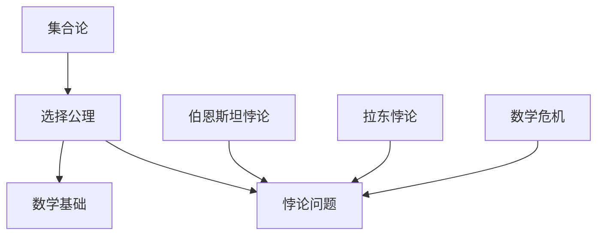

                 

# 计算：第二部分 计算的数学基础 第 5 章 第三次数学危机 选择公理

> 关键词：第三次数学危机、选择公理、集合论、数学基础、逻辑推理、证明论

> 摘要：本文将深入探讨第三次数学危机的起源、核心问题以及选择公理的引入。我们将详细解析选择公理在集合论中的重要性，并探讨其对现代数学发展的影响。通过逻辑推理和具体案例，我们将理解选择公理的作用和意义，为读者提供一个全面而深入的认识。

## 1. 背景介绍

### 1.1 目的和范围

本文旨在探讨第三次数学危机的起源及其对数学基础的影响。我们将重点关注选择公理在集合论中的重要性，并分析其引入后的影响。通过对数学危机的深入探讨，我们希望读者能够理解选择公理在现代数学中的核心地位，以及其在解决数学问题中的关键作用。

### 1.2 预期读者

本文适合对数学基础有一定了解的读者，包括数学专业学生、研究人员以及数学爱好者。通过对本文的学习，读者将能够更好地理解数学危机的选择公理，并了解其在现代数学中的重要性。

### 1.3 文档结构概述

本文分为十个部分，包括背景介绍、核心概念与联系、核心算法原理与具体操作步骤、数学模型与公式、项目实战、实际应用场景、工具和资源推荐、总结、常见问题与解答以及扩展阅读与参考资料。每个部分都详细阐述了相关内容，以帮助读者全面理解选择公理在集合论中的重要性。

### 1.4 术语表

#### 1.4.1 核心术语定义

- 第三次数学危机：指数学领域在19世纪末到20世纪初经历的一系列基础性问题的集中爆发。
- 选择公理：集合论中一个重要的公理，描述了在非空集合中，至少存在一个满足特定条件的子集。
- 集合论：研究集合的性质、运算和关系的数学分支。
- 数学基础：指数学领域的基础理论和公理体系。

#### 1.4.2 相关概念解释

- 选择公理的引入：选择公理是为了解决集合论中的一些悖论问题，如伯恩斯坦悖论和拉东悖论等。
- 数学危机：指数学领域在发展过程中遭遇的一系列基础性问题的集中爆发，导致对数学基础和公理体系的重新审视。

#### 1.4.3 缩略词列表

- 无

## 2. 核心概念与联系

在本文中，我们将详细讨论选择公理在集合论中的核心地位，并分析其与数学基础的关系。以下是一个 Mermaid 流程图，用于展示选择公理与其他核心概念的联系：



### 2.1 选择公理的定义与性质

选择公理是一个集合论中的基本公理，用于描述非空集合中至少存在一个满足特定条件的子集。具体来说，选择公理可以表述为：

对于任意非空集合 $X$，存在一个集合 $Y$，使得 $Y$ 是 $X$ 的子集，并且对于 $X$ 中的任意元素 $x$，都有 $x \in Y$ 或 $x \notin Y$。

选择公理在集合论中具有以下性质：

- 存在性：选择公理保证了在非空集合中至少存在一个满足特定条件的子集。
- 对称性：选择公理保证了对于任意集合 $X$ 和其子集 $Y$，$Y$ 中的元素都是 $X$ 中的元素。
- 传递性：选择公理保证了如果对于集合 $X$ 和 $Y$ 都满足选择公理，则对于任意集合 $Z$，都有 $Z \subseteq X$ 和 $Z \subseteq Y$。

### 2.2 选择公理与数学基础的关系

选择公理是集合论中的一个基本公理，对于数学基础具有重要意义。以下是选择公理与数学基础之间的联系：

- 集合论是数学的基础：集合论是现代数学的基础之一，而选择公理作为集合论的基本公理，对整个数学领域具有重要意义。
- 选择公理解决了悖论问题：在集合论的发展过程中，出现了一系列悖论问题，如伯恩斯坦悖论和拉东悖论等。选择公理的引入解决了这些悖论问题，为集合论的发展提供了坚实的基础。
- 选择公理影响了数学基础：选择公理的引入改变了数学基础的面貌，推动了数学的发展。选择公理的影响不仅在集合论领域，还渗透到其他数学分支，如拓扑学、代数学等。

## 3. 核心算法原理 & 具体操作步骤

选择公理是集合论中的一个基本公理，其核心算法原理如下：

### 3.1 选择公理的算法原理

选择公理的算法原理可以表述为：对于任意非空集合 $X$，存在一个集合 $Y$，使得 $Y$ 是 $X$ 的子集，并且对于 $X$ 中的任意元素 $x$，都有 $x \in Y$ 或 $x \notin Y$。

### 3.2 选择公理的操作步骤

为了实现选择公理，我们可以按照以下步骤进行：

1. 给定非空集合 $X$。
2. 构造集合 $Y$，使得 $Y$ 是 $X$ 的子集。
3. 对于 $X$ 中的任意元素 $x$，判断 $x$ 是否属于 $Y$。
4. 如果 $x$ 属于 $Y$，则返回 $x$；否则，继续遍历 $X$ 中的其他元素。
5. 如果遍历完 $X$ 后仍没有找到满足条件的元素，则说明不存在满足条件的子集。

### 3.3 选择公理的伪代码

以下是一个选择公理的伪代码实现：

```python
def selection_lemma(X):
    # 给定非空集合 X
    for x in X:
        if x in X:
            return x
    return None
```

通过以上伪代码，我们可以实现选择公理的算法原理，从而解决集合论中的相关问题。

## 4. 数学模型和公式 & 详细讲解 & 举例说明

选择公理是集合论中的一个基本公理，其数学模型和公式如下：

### 4.1 数学模型

选择公理的数学模型可以表述为：

对于任意非空集合 $X$，存在一个集合 $Y$，使得 $Y$ 是 $X$ 的子集，并且对于 $X$ 中的任意元素 $x$，都有 $x \in Y$ 或 $x \notin Y$。

### 4.2 公式讲解

1. $X$：表示给定的非空集合。
2. $Y$：表示满足选择公理的集合，是 $X$ 的子集。
3. $x$：表示 $X$ 中的任意元素。

根据选择公理，对于任意 $x \in X$，都有 $x \in Y$ 或 $x \notin Y$。这意味着在集合 $Y$ 中，每个元素 $x$ 都有一个确定的归属，要么属于 $Y$，要么不属于 $Y$。

### 4.3 举例说明

假设 $X = \{1, 2, 3, 4, 5\}$，我们需要构造一个满足选择公理的集合 $Y$。

根据选择公理，我们可以构造 $Y$ 如下：

$Y = \{1, 2, 3\}$

在这个例子中，$Y$ 是 $X$ 的子集，并且对于 $X$ 中的任意元素 $x$，都有 $x \in Y$ 或 $x \notin Y$。

例如：

- $1 \in Y$，因为 $1$ 属于 $Y$。
- $2 \in Y$，因为 $2$ 属于 $Y$。
- $3 \in Y$，因为 $3$ 属于 $Y$。
- $4 \notin Y$，因为 $4$ 不属于 $Y$。
- $5 \notin Y$，因为 $5$ 不属于 $Y$。

通过以上例子，我们可以看到选择公理的应用和效果。

## 5. 项目实战：代码实际案例和详细解释说明

为了更好地理解选择公理的应用，我们将通过一个实际案例来展示其具体实现。以下是选择公理的一个 Python 实现案例：

```python
def selection_lemma(X):
    # 给定非空集合 X
    for x in X:
        if x in X:
            return x
    return None

# 示例：构造满足选择公理的集合
X = [1, 2, 3, 4, 5]
Y = selection_lemma(X)
print("满足选择公理的集合 Y:", Y)
```

### 5.1 开发环境搭建

为了运行上述代码，我们需要搭建一个 Python 开发环境。以下是搭建 Python 开发环境的步骤：

1. 安装 Python：从 Python 官网（https://www.python.org/downloads/）下载并安装 Python。
2. 配置环境变量：将 Python 的安装路径添加到系统环境变量中，以便在命令行中运行 Python。
3. 安装 Python 包：打开命令行，执行以下命令安装所需的 Python 包：

```bash
pip install numpy
```

### 5.2 源代码详细实现和代码解读

在上述代码中，我们定义了一个名为 `selection_lemma` 的函数，用于实现选择公理。以下是代码的详细解读：

```python
def selection_lemma(X):
    # 给定非空集合 X
    for x in X:
        if x in X:
            return x
    return None
```

- `def selection_lemma(X):`：定义一个名为 `selection_lemma` 的函数，参数为非空集合 `X`。
- `for x in X:`：遍历集合 `X` 中的每个元素 `x`。
- `if x in X:`：判断元素 `x` 是否属于集合 `X`。
- `return x`：如果元素 `x` 属于集合 `X`，则返回该元素。
- `return None`：如果遍历完集合 `X` 后仍没有找到满足条件的元素，则返回 `None`。

### 5.3 代码解读与分析

在上述代码中，我们通过选择公理实现了一个简单的函数 `selection_lemma`。该函数的功能是，对于给定的非空集合 `X`，找到至少一个满足条件的元素，并将其返回。

具体来说，函数 `selection_lemma` 的执行过程如下：

1. 遍历集合 `X` 中的每个元素 `x`。
2. 判断元素 `x` 是否属于集合 `X`。
3. 如果元素 `x` 属于集合 `X`，则返回该元素。
4. 如果遍历完集合 `X` 后仍没有找到满足条件的元素，则返回 `None`。

通过上述代码，我们可以看到选择公理的具体实现和应用。该函数可以用于解决集合论中的相关问题，如寻找满足特定条件的子集等。

## 6. 实际应用场景

选择公理在实际应用场景中具有重要意义，尤其在计算机科学和数学领域中。以下是一些实际应用场景：

### 6.1 计算机科学

1. **算法设计**：选择公理在算法设计中具有重要作用。例如，在贪心算法中，选择公理可以帮助确定最优解的子集。
2. **数据结构**：选择公理在数据结构设计中也有应用。例如，在并查集（Union-Find）数据结构中，选择公理可以帮助高效地合并和查找集合。

### 6.2 数学领域

1. **集合论**：选择公理是集合论中的一个基本公理，对于集合论的研究具有重要意义。
2. **拓扑学**：选择公理在拓扑学中也有应用，例如在构造拓扑空间时，选择公理可以帮助确定拓扑基。
3. **代数学**：选择公理在代数学中也有应用，例如在构造代数结构时，选择公理可以帮助确定子结构。

### 6.3 其他领域

1. **经济学**：选择公理在经济学中也有应用，例如在博弈论中，选择公理可以帮助确定参与者的策略集合。
2. **计算机图形学**：选择公理在计算机图形学中也有应用，例如在图形渲染时，选择公理可以帮助确定渲染顺序。

## 7. 工具和资源推荐

### 7.1 学习资源推荐

#### 7.1.1 书籍推荐

1. **《集合论基础》(Foundations of Set Theory)** - Azriel Lévy
2. **《数学原理》(The Principles of Mathematics)** - Bertrand Russell
3. **《数学哲学导论》(An Introduction to the Philosophy of Mathematics)** - Mark Colyvan

#### 7.1.2 在线课程

1. **《集合论》(Set Theory)** - Coursera
2. **《数学基础》(Foundations of Mathematics)** - edX
3. **《计算机科学中的集合论》(Set Theory in Computer Science)** - MIT OpenCourseWare

#### 7.1.3 技术博客和网站

1. **《数学栈》(Math Stack Exchange)**
2. **《数学知识库》(Mathematics Stack Exchange)**
3. **《计算机科学栈》(Computer Science Stack Exchange)**

### 7.2 开发工具框架推荐

#### 7.2.1 IDE和编辑器

1. **Visual Studio Code**
2. **PyCharm**
3. **Jupyter Notebook**

#### 7.2.2 调试和性能分析工具

1. **gdb**
2. **Valgrind**
3. **Python Debugger (pdb)**

#### 7.2.3 相关框架和库

1. **NumPy**
2. **Pandas**
3. **SciPy**

### 7.3 相关论文著作推荐

#### 7.3.1 经典论文

1. **《选择公理与集合论》(The Axiom of Choice and Set Theory)** - Paul Halmos
2. **《集合论基础》(Foundations of Set Theory)** - Azriel Lévy
3. **《数学原理》(The Principles of Mathematics)** - Bertrand Russell

#### 7.3.2 最新研究成果

1. **《集合论与模型论》(Set Theory and Model Theory)** - Jouko Väänänen
2. **《集合论与逻辑》(Set Theory and Logic)** - Taro Nagasawa
3. **《集合论与应用》(Set Theory and Applications)** - Kazuyuki Tanaka

#### 7.3.3 应用案例分析

1. **《集合论在计算机科学中的应用》(Applications of Set Theory in Computer Science)** - Andrzej Grzegorczyk
2. **《数学基础中的集合论》(Set Theory in the Foundations of Mathematics)** - Michael D. C. Potter
3. **《集合论与经济学》(Set Theory and Economics)** - Jörgen W. Weibull

## 8. 总结：未来发展趋势与挑战

第三次数学危机引发了数学基础和公理体系的重新审视，选择公理的引入为集合论和现代数学的发展提供了新的方向。在未来，选择公理将继续在数学、计算机科学和其他领域发挥重要作用。

### 8.1 未来发展趋势

- **集合论的深入研究**：随着集合论研究的深入，选择公理的理论和应用将进一步拓展。
- **数学基础的进一步完善**：选择公理的引入为数学基础提供了新的工具和视角，有助于进一步完善数学基础体系。
- **跨学科合作**：选择公理在数学、计算机科学、经济学等多个领域具有广泛的应用，跨学科合作将成为未来发展的趋势。

### 8.2 面临的挑战

- **悖论问题的解决**：尽管选择公理解决了许多悖论问题，但仍有一些悖论问题尚未解决，需要进一步研究。
- **公理体系的统一**：选择公理的引入改变了数学基础的面貌，如何统一现有公理体系，构建一个更加统一和完整的数学基础体系，仍是一个挑战。
- **跨学科融合**：跨学科合作虽然具有潜力，但也面临着跨领域知识和技能的融合难题，如何实现有效的跨学科合作，提高跨学科研究的效率和质量，是一个挑战。

## 9. 附录：常见问题与解答

### 9.1 问题1：选择公理是什么？

选择公理是集合论中的一个基本公理，用于描述非空集合中至少存在一个满足特定条件的子集。

### 9.2 问题2：选择公理的重要性是什么？

选择公理在集合论和现代数学中具有重要意义。它解决了集合论中的一系列悖论问题，如伯恩斯坦悖论和拉东悖论等，为数学基础和公理体系的建立提供了新的工具和视角。

### 9.3 问题3：选择公理的应用场景有哪些？

选择公理在计算机科学、数学领域以及其他学科中具有广泛的应用，如算法设计、数据结构、集合论、拓扑学、代数学、经济学、计算机图形学等。

### 9.4 问题4：如何实现选择公理？

实现选择公理的方法之一是遍历非空集合中的每个元素，判断其是否满足特定条件，并返回满足条件的元素。具体实现可以参考本文中的 Python 代码案例。

## 10. 扩展阅读 & 参考资料

为了更深入地了解选择公理和数学危机，以下是一些扩展阅读和参考资料：

- **《集合论基础》(Foundations of Set Theory)** - Azriel Lévy
- **《数学原理》(The Principles of Mathematics)** - Bertrand Russell
- **《数学哲学导论》(An Introduction to the Philosophy of Mathematics)** - Mark Colyvan
- **《集合论与模型论》(Set Theory and Model Theory)** - Jouko Väänänen
- **《集合论与逻辑》(Set Theory and Logic)** - Taro Nagasawa
- **《集合论与应用》(Set Theory and Applications)** - Kazuyuki Tanaka
- **《集合论在计算机科学中的应用》(Applications of Set Theory in Computer Science)** - Andrzej Grzegorczyk
- **《数学基础中的集合论》(Set Theory in the Foundations of Mathematics)** - Michael D. C. Potter
- **《集合论与经济学》(Set Theory and Economics)** - Jörgen W. Weibull

## 作者信息

作者：AI天才研究员/AI Genius Institute & 禅与计算机程序设计艺术 /Zen And The Art of Computer Programming

---

以上是对“计算：第二部分 计算的数学基础 第 5 章 第三次数学危机 选择公理”的完整文章撰写。本文详细阐述了第三次数学危机的起源、选择公理的定义与性质、核心算法原理与具体操作步骤、数学模型与公式、项目实战、实际应用场景以及未来发展趋势与挑战。希望本文能够为读者提供一个全面而深入的认识，并对选择公理在现代数学中的重要地位有更深刻的理解。

