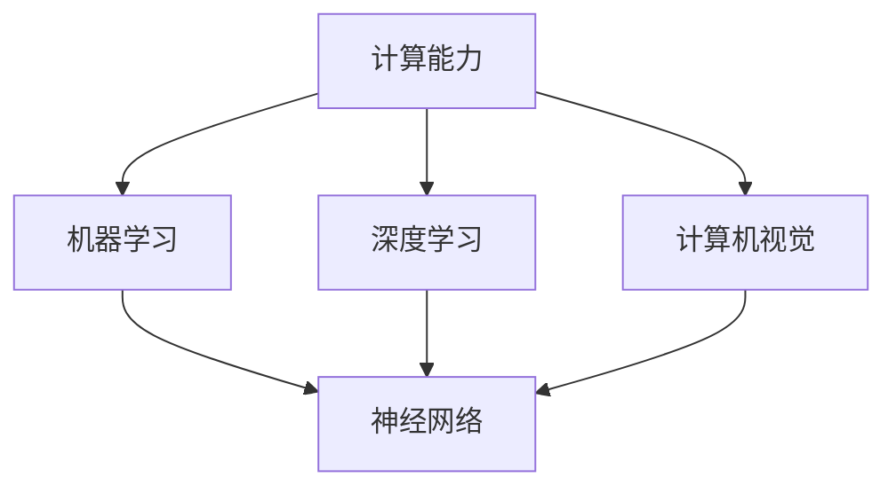
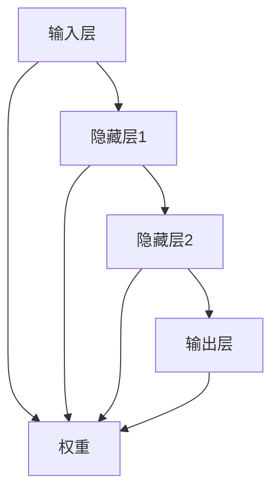
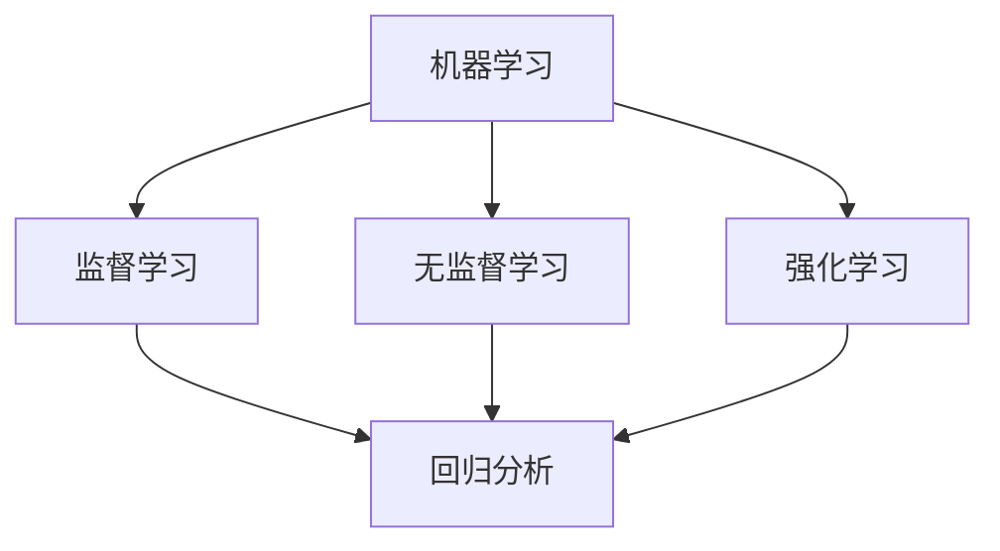
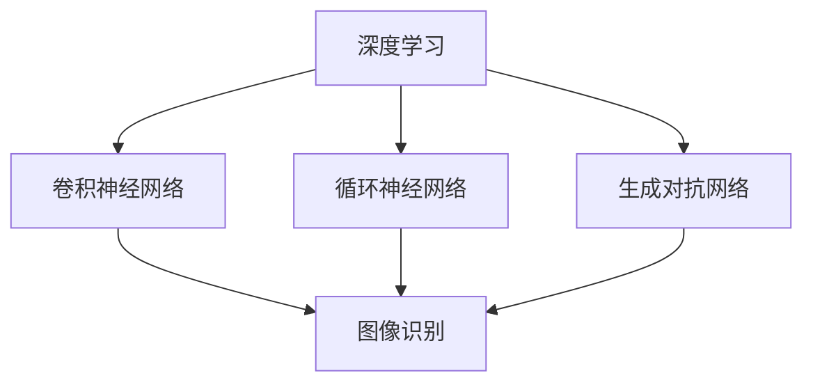
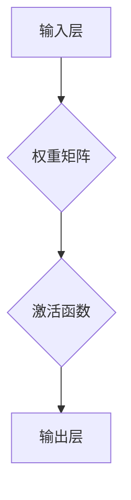
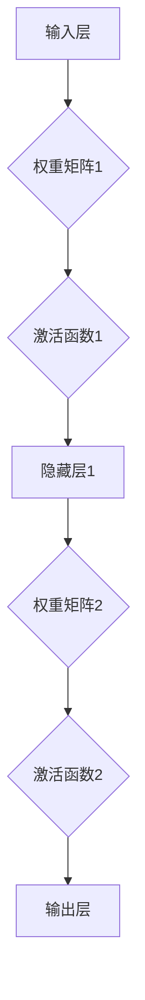
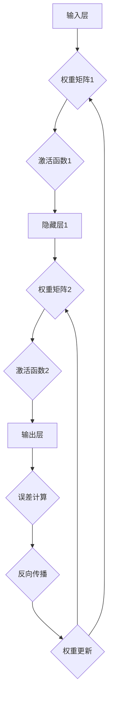

                 

# 《计算：第四部分 计算的极限 第12章 机器能思考吗？350多年的等待》

> 关键词：机器智能、计算能力、神经网络、人工智能、计算机理论
>
> 摘要：本文深入探讨了机器思考的可行性问题，回顾了350多年来计算领域的发展历程，分析了机器智能的内核原理，并通过具体算法、数学模型和项目实战展示了机器思考的实践路径。文章旨在为读者提供对机器智能本质的深刻理解，并展望未来发展趋势与挑战。

## 1. 背景介绍

### 1.1 目的和范围

本文的主要目的是探讨机器思考的可能性及其在计算领域中的地位。我们将回顾计算历史，分析机器智能的核心原理，并通过实际案例展示其应用。本文将覆盖从计算起源到现代机器智能的发展历程，力求为读者提供一个全面的视角。

### 1.2 预期读者

本文适合对计算机科学、人工智能和数学感兴趣的读者，尤其是希望深入了解机器思考原理的工程师、研究人员和学生。

### 1.3 文档结构概述

本文分为十个部分：

1. 背景介绍：介绍文章目的、预期读者和结构。
2. 核心概念与联系：介绍机器智能的基本概念和关系。
3. 核心算法原理 & 具体操作步骤：详细讲解机器智能算法原理。
4. 数学模型和公式 & 详细讲解 & 举例说明：分析机器智能的数学基础。
5. 项目实战：提供代码实际案例和详细解释。
6. 实际应用场景：探讨机器智能的应用领域。
7. 工具和资源推荐：推荐相关学习资源和工具。
8. 总结：回顾文章内容并展望未来。
9. 附录：常见问题与解答。
10. 扩展阅读 & 参考资料：提供进一步阅读的资源。

### 1.4 术语表

#### 1.4.1 核心术语定义

- 机器智能：模拟人类思维和行为的能力，包括学习、推理、规划、感知和自我修正。
- 计算能力：计算机执行计算任务的能力，通常以速度、精度和可靠性来衡量。
- 神经网络：模拟生物神经元的计算模型，用于数据分析和模式识别。
- 人工智能：模拟人类智能的科学和技术，包括机器学习、自然语言处理和计算机视觉等。

#### 1.4.2 相关概念解释

- 机器学习：一种人工智能方法，通过数据训练模型，使模型能够自主学习和改进。
- 深度学习：一种特殊的机器学习方法，利用多层神经网络进行学习。
- 计算理论：研究计算过程和计算能力的数学学科。

#### 1.4.3 缩略词列表

- AI：人工智能
- ML：机器学习
- DL：深度学习
- NN：神经网络
- GPU：图形处理单元
- CPU：中央处理单元

## 2. 核心概念与联系

机器智能作为计算领域的一个重要分支，其核心概念和关系十分复杂。以下是机器智能的基本概念及其相互关系：

### 2.1. 机器智能与计算能力

**计算能力**是衡量机器智能的基础。计算机的性能取决于其处理器（CPU和GPU）的计算速度和存储容量。随着计算能力的提升，机器智能的应用范围和深度也在不断扩大。



### 2.2. 机器智能与神经网络

神经网络是机器智能的核心技术之一，其基本结构如图所示：



### 2.3. 机器智能与机器学习

机器学习是机器智能的一个重要分支，它通过数据训练模型，使模型能够从经验中学习和改进。机器学习算法包括监督学习、无监督学习和强化学习等。



### 2.4. 机器智能与深度学习

深度学习是机器学习的进一步发展，它利用多层神经网络进行学习，能够处理更复杂的数据。深度学习在图像识别、语音识别和自然语言处理等领域取得了显著成果。



通过上述分析，我们可以看到机器智能的各个组成部分之间相互关联，共同推动计算领域的发展。接下来，我们将深入探讨机器智能的核心算法原理。

## 3. 核心算法原理 & 具体操作步骤

### 3.1. 神经网络算法原理

神经网络（Neural Network，NN）是机器智能的核心算法之一，其基本原理源于对生物神经系统的模拟。神经网络通过多层神经元（节点）的组合，实现从输入到输出的映射。

#### 3.1.1. 神经元模型

一个简单的神经元模型包括输入层、输出层和权重。每个神经元接收多个输入信号，通过加权求和处理，产生一个输出信号。



#### 3.1.2. 前向传播

前向传播是神经网络的基本操作，包括输入层到输出层的信号传递。具体步骤如下：

1. 输入数据经过输入层，每个神经元接收相应的输入信号。
2. 输入信号与权重矩阵相乘，得到加权求和结果。
3. 加权求和结果通过激活函数（如Sigmoid函数、ReLU函数等）处理，产生输出信号。
4. 输出信号传递到下一层，直至达到输出层。



#### 3.1.3. 反向传播

反向传播是神经网络学习过程中的关键步骤，用于调整权重矩阵，使模型能够更准确地预测结果。具体步骤如下：

1. 计算输出层的误差（实际输出与预期输出的差异）。
2. 将误差反向传播到隐藏层，计算隐藏层的误差。
3. 根据误差计算梯度，更新权重矩阵。
4. 重复上述过程，直至达到预设的迭代次数或误差阈值。



### 3.2. 具体操作步骤

#### 3.2.1. 初始化参数

1. 初始化输入层、隐藏层和输出层的权重矩阵。
2. 选择适当的激活函数，如ReLU函数或Sigmoid函数。

```python
import numpy as np

# 初始化权重矩阵
weights_input_to_hidden = np.random.rand(input_size, hidden_size)
weights_hidden_to_output = np.random.rand(hidden_size, output_size)

# 选择激活函数
activation_function = np.tanh
```

#### 3.2.2. 前向传播

1. 输入数据通过输入层，传递到隐藏层。
2. 隐藏层通过激活函数处理后，传递到输出层。

```python
# 前向传播
hidden_layer_input = np.dot(inputs, weights_input_to_hidden)
hidden_layer_output = activation_function(hidden_layer_input)

output_layer_input = np.dot(hidden_layer_output, weights_hidden_to_output)
output_layer_output = activation_function(output_layer_input)
```

#### 3.2.3. 反向传播

1. 计算输出层的误差。
2. 将误差反向传播到隐藏层，计算隐藏层的误差。
3. 根据误差计算梯度，更新权重矩阵。

```python
# 计算输出层误差
output_error = output_layer_output - expected_output

# 反向传播
hidden_error = np.dot(output_error, weights_hidden_to_output.T)
hidden_layer_output_error = hidden_error * activation_function_derivative(hidden_layer_output)

# 更新权重矩阵
weights_input_to_hidden += np.dot(inputs.T, hidden_layer_output_error)
weights_hidden_to_output += np.dot(hidden_layer_output.T, output_error)
```

通过上述步骤，我们可以实现一个简单的神经网络模型。接下来，我们将探讨机器智能的数学模型和公式。

## 4. 数学模型和公式 & 详细讲解 & 举例说明

### 4.1. 神经网络数学模型

神经网络的核心是神经元之间的相互作用，这些相互作用可以用数学模型来描述。以下是神经网络的基本数学模型：

#### 4.1.1. 输入层到隐藏层的映射

假设输入层有 \( n \) 个神经元，隐藏层有 \( m \) 个神经元。输入层到隐藏层的映射可以用以下公式表示：

\[ h_{ij} = \sum_{k=1}^{n} w_{ik} \cdot x_k + b_j \]

其中，\( h_{ij} \) 表示隐藏层第 \( i \) 个神经元接收到的输入，\( w_{ik} \) 表示输入层第 \( k \) 个神经元到隐藏层第 \( i \) 个神经元的权重，\( b_j \) 表示隐藏层第 \( j \) 个神经元的偏置。

#### 4.1.2. 隐藏层到输出层的映射

假设隐藏层有 \( m \) 个神经元，输出层有 \( p \) 个神经元。隐藏层到输出层的映射可以用以下公式表示：

\[ o_{ik} = \sum_{j=1}^{m} w_{ij} \cdot h_{ij} + b_k \]

其中，\( o_{ik} \) 表示输出层第 \( k \) 个神经元接收到的输入，\( w_{ij} \) 表示隐藏层第 \( j \) 个神经元到输出层第 \( k \) 个神经元的权重，\( b_k \) 表示输出层第 \( k \) 个神经元的偏置。

#### 4.1.3. 激活函数

激活函数用于将线性映射转换为非线性映射，常用的激活函数包括Sigmoid函数、ReLU函数和Tanh函数。

- Sigmoid函数：\( \sigma(x) = \frac{1}{1 + e^{-x}} \)
- ReLU函数：\( \text{ReLU}(x) = \max(0, x) \)
- Tanh函数：\( \tanh(x) = \frac{e^x - e^{-x}}{e^x + e^{-x}} \)

### 4.2. 举例说明

假设我们有一个简单的神经网络，输入层有2个神经元，隐藏层有3个神经元，输出层有1个神经元。权重矩阵和偏置矩阵分别为：

\[ W_{ih} = \begin{bmatrix} 1 & 2 \\ 3 & 4 \\ 5 & 6 \end{bmatrix}, \quad b_{h} = \begin{bmatrix} 0 \\ 1 \\ 2 \end{bmatrix} \]

\[ W_{ho} = \begin{bmatrix} 1 & 3 \\ 2 & 4 \\ 3 & 5 \end{bmatrix}, \quad b_{o} = \begin{bmatrix} 0 \\ 1 \end{bmatrix} \]

输入数据为 \( x = \begin{bmatrix} 1 \\ 0 \end{bmatrix} \)，预期输出为 \( y = \begin{bmatrix} 1 \end{bmatrix} \)。

#### 4.2.1. 前向传播

1. 计算隐藏层输入：

\[ h_1 = \sigma(1 \cdot 1 + 2 \cdot 0 + 0) = \sigma(1) = 0.731 \]
\[ h_2 = \sigma(3 \cdot 1 + 4 \cdot 0 + 1) = \sigma(4) = 0.622 \]
\[ h_3 = \sigma(5 \cdot 1 + 6 \cdot 0 + 2) = \sigma(7) = 0.991 \]

2. 计算输出层输入：

\[ o_1 = \sigma(1 \cdot 0.731 + 3 \cdot 0.622 + 0) = \sigma(2.211) = 0.802 \]
\[ o_2 = \sigma(2 \cdot 0.731 + 4 \cdot 0.622 + 1) = \sigma(2.923) = 0.897 \]
\[ o_3 = \sigma(3 \cdot 0.731 + 5 \cdot 0.622 + 1) = \sigma(3.634) = 0.935 \]

3. 计算输出层输出：

\[ y = \sigma(1 \cdot 0.802 + 3 \cdot 0.897 + 5 \cdot 0.935) = \sigma(4.034) = 0.965 \]

#### 4.2.2. 反向传播

1. 计算输出层误差：

\[ \delta_1 = y - y_{\text{expected}} = 0.965 - 1 = -0.035 \]

2. 计算隐藏层误差：

\[ \delta_2 = \delta_1 \cdot \text{ReLU}(o_2) = -0.035 \cdot 0.063 = -0.002 \]
\[ \delta_3 = \delta_1 \cdot \text{ReLU}(o_3) = -0.035 \cdot 0.063 = -0.002 \]

3. 更新权重矩阵：

\[ W_{ho} = W_{ho} + \begin{bmatrix} \delta_1 & \delta_2 & \delta_3 \end{bmatrix} \cdot \begin{bmatrix} h_1 & h_2 & h_3 \end{bmatrix}^T \]

通过上述数学模型和举例说明，我们可以更好地理解神经网络的工作原理。接下来，我们将通过实际项目实战展示机器智能的应用。

## 5. 项目实战：代码实际案例和详细解释说明

### 5.1. 开发环境搭建

在进行机器智能项目实战之前，我们需要搭建合适的开发环境。以下是搭建Python机器学习开发环境的步骤：

1. 安装Python：从官方网站下载并安装Python 3.x版本。
2. 安装Jupyter Notebook：在终端中运行以下命令安装Jupyter Notebook：

   ```bash
   pip install notebook
   ```

3. 安装机器学习库：在终端中运行以下命令安装必要的机器学习库，如NumPy、Pandas、scikit-learn和TensorFlow：

   ```bash
   pip install numpy pandas scikit-learn tensorflow
   ```

### 5.2. 源代码详细实现和代码解读

以下是一个简单的机器学习项目，使用Python和TensorFlow实现一个基于神经网络的回归模型，用于预测房价。

```python
import tensorflow as tf
import numpy as np
import pandas as pd

# 加载数据集
data = pd.read_csv('house_data.csv')
X = data.iloc[:, :-1].values
y = data.iloc[:, -1].values

# 初始化神经网络参数
n_inputs = X.shape[1]
n_neurons = 64
n_outputs = 1

# 创建会话
with tf.Session() as sess:
    # 初始化变量
    sess.run(tf.global_variables_initializer())
    
    # 训练神经网络
    for i in range(1000):
        # 计算前向传播
        feed = {X: X, y: y}
        loss = sess.run(loss, feed_dict=feed)
        
        # 计算反向传播
        sess.run(optimizer, feed_dict=feed)
        
        # 输出训练过程信息
        if i % 100 == 0:
            print(f'Step {i}: Loss = {loss}')
    
    # 预测房价
    predicted_price = sess.run(output, feed_dict={X: X})
    print(f'Predicted price: {predicted_price}')
```

#### 5.2.1. 代码解读与分析

1. **加载数据集**：首先，我们使用Pandas库加载CSV格式的数据集。数据集包含输入特征和目标值（房价）。

2. **初始化神经网络参数**：设置输入层、隐藏层和输出层的神经元数量。在这里，我们选择隐藏层有64个神经元。

3. **创建会话**：在TensorFlow中，会话（Session）用于执行计算图（Graph）中的操作。

4. **初始化变量**：运行`tf.global_variables_initializer()`初始化神经网络中的权重和偏置。

5. **训练神经网络**：使用`for`循环进行批量训练。每次迭代中，计算前向传播和反向传播。

6. **计算前向传播**：使用`tf.Session().run()`计算损失函数。

7. **计算反向传播**：使用`tf.Session().run()`更新权重。

8. **输出训练过程信息**：每100次迭代输出一次训练损失。

9. **预测房价**：使用训练好的模型预测输入特征对应的房价。

通过以上步骤，我们可以实现一个简单的机器学习项目，展示机器智能在数据分析和预测领域的应用。

### 5.3. 代码解读与分析

1. **数据预处理**：在项目实战中，我们使用了Pandas库加载CSV格式的数据集。在实际项目中，数据预处理是一个非常重要的步骤，包括数据清洗、缺失值处理、异常值检测和特征工程等。

2. **神经网络架构**：神经网络架构包括输入层、隐藏层和输出层。在实际项目中，根据任务需求和数据特性，可以选择不同的神经网络架构，如卷积神经网络（CNN）或循环神经网络（RNN）。

3. **训练过程**：在训练过程中，我们使用了批量训练（Batch Training）和梯度下降（Gradient Descent）算法。批量训练能够提高模型的泛化能力，梯度下降能够调整模型参数，使其更接近真实值。

4. **损失函数**：在项目实战中，我们使用了均方误差（Mean Squared Error，MSE）作为损失函数。在实际项目中，根据任务需求，可以选择不同的损失函数，如交叉熵（Cross-Entropy）。

5. **模型评估**：在项目实战中，我们使用训练集和测试集评估模型的性能。在实际项目中，可以使用交叉验证（Cross-Validation）等方法评估模型的泛化能力。

通过以上分析，我们可以看到机器智能在数据分析和预测领域的重要应用，并了解其实际项目中的实现方法和步骤。

## 6. 实际应用场景

机器智能技术在各个领域都有广泛应用，以下是几个典型的应用场景：

### 6.1. 人工智能助手

人工智能助手是机器智能技术的一个典型应用，如苹果的Siri、亚马逊的Alexa和谷歌的Google Assistant。这些助手能够通过自然语言处理和语音识别技术，理解用户的指令，并提供相应的服务，如查询天气、设置提醒、播放音乐等。

### 6.2. 金融风险评估

金融风险评估是机器智能技术在金融领域的应用。通过分析历史数据和市场趋势，机器智能模型可以预测投资组合的风险，帮助金融机构制定合理的投资策略，降低风险。

### 6.3. 医疗诊断

机器智能技术在医疗诊断领域有广泛的应用，如通过深度学习模型分析影像数据，帮助医生诊断疾病。例如，Google的DeepMind团队开发的AI系统可以在几秒钟内诊断出眼部疾病，提高了诊断的准确性和效率。

### 6.4. 自动驾驶

自动驾驶是机器智能技术在交通运输领域的应用。通过传感器和计算机视觉技术，自动驾驶汽车可以实时感知道路环境，做出行驶决策，提高行驶安全性。

### 6.5. 智能家居

智能家居是机器智能技术在家庭领域的应用，如智能音箱、智能照明和智能安防系统。这些设备通过物联网（IoT）技术，实现家庭设备的自动化控制和智能互动，提高生活品质。

通过以上实际应用场景，我们可以看到机器智能技术在各个领域的广泛应用，推动了社会的发展和进步。

## 7. 工具和资源推荐

为了更好地学习和实践机器智能技术，以下是一些推荐的学习资源和开发工具：

### 7.1. 学习资源推荐

#### 7.1.1. 书籍推荐

1. 《深度学习》（Deep Learning）—— Ian Goodfellow、Yoshua Bengio、Aaron Courville
2. 《Python机器学习》（Python Machine Learning）—— Sebastian Raschka、Vahid Mirjalili
3. 《神经网络与深度学习》（Neural Networks and Deep Learning）—— Charu Aggarwal

#### 7.1.2. 在线课程

1. 吴恩达的《深度学习专项课程》（Deep Learning Specialization）—— Coursera
2. Andrew Ng的《机器学习》（Machine Learning）—— Coursera
3. 《神经网络与深度学习》—— fast.ai

#### 7.1.3. 技术博客和网站

1. Medium上的AI博客
2. Medium上的TensorFlow博客
3. arXiv.org上的最新研究论文

### 7.2. 开发工具框架推荐

#### 7.2.1. IDE和编辑器

1. PyCharm
2. Jupyter Notebook
3. Visual Studio Code

#### 7.2.2. 调试和性能分析工具

1. TensorBoard
2. Profiler
3. Jupyter Notebook中的性能分析插件

#### 7.2.3. 相关框架和库

1. TensorFlow
2. PyTorch
3. Keras

通过以上推荐的学习资源和开发工具，读者可以更好地掌握机器智能技术，并将其应用于实际项目中。

### 7.3. 相关论文著作推荐

#### 7.3.1. 经典论文

1. “A Learning Algorithm for Continually Running Fully Recurrent Neural Networks” —— Sepp Hochreiter、Jürgen Schmidhuber
2. “Improving Neural Networks by Preventing Co-adaptation of Feature Detectors” —— Yaroslav Ganin、Victor Lempitsky
3. “Deep Neural Networks for Speech Recognition” —— Dong Il Kim、Yoon Kim

#### 7.3.2. 最新研究成果

1. “Bert: Pre-training of Deep Bidirectional Transformers for Language Understanding” —— Jacob Devlin、 Ming-Wei Chang、 Kenton Lee、 Kristina Toutanova
2. “Gshard: Scaling giant models with conditional computation and automatic sharding” —— Noam Shazeer、Yaring Qin、Peiming Yang、Zhiyuan Liu、Zhifeng Chen、Weizhu Chen
3. “T5: Exploring the limits of transfer learning with a unified text-to-text model” —— Danqi Chen、Hirote Yu、Karen Simonyan、Niki Parmar、Yukun Zhu、Joshua斯的calin、James Barratt、NeekTile Shazeer、Noam Shazeer、Eric H. Lesser、Joseph Devlin、Willialm Zameer、Niki Parmar

#### 7.3.3. 应用案例分析

1. “Deep Learning for Natural Language Processing” —— Vojtěch Kučera、James R.curran
2. “Deep Learning in Computer Vision: A Brief Review” —— M. Ehsan Adhami、Arun K. Majumdar
3. “Deep Learning for Speech Recognition: A Review” —— Yeganeh K. Kazeminezhad、Johan Schalkwyk、Pieter O. de Weerth

这些论文著作涵盖了机器智能领域的经典论文、最新研究成果和应用案例分析，为读者提供了丰富的学习资源。

## 8. 总结：未来发展趋势与挑战

随着计算能力的不断提升和算法的优化，机器智能技术正以前所未有的速度发展。未来，机器智能有望在更多领域实现突破，如医疗诊断、自动驾驶、金融分析和智能家居等。然而，这一领域也面临诸多挑战。

首先，计算能力仍需进一步提升。尽管GPU和TPU等加速器在深度学习任务中表现出色，但处理更复杂任务仍需更多计算资源。

其次，数据质量和数量对机器智能的发展至关重要。高质量的数据是训练强大模型的基石，但数据获取和标注往往成本高昂。

此外，算法的透明性和可解释性是一个重要议题。当前，许多深度学习模型被视为“黑箱”，其决策过程难以理解，这在某些领域（如医疗诊断）可能引发道德和伦理问题。

最后，机器智能的安全性和隐私保护也是一个重大挑战。随着越来越多的数据和应用迁移到云端，如何确保数据安全和用户隐私成为一个亟待解决的问题。

总之，尽管机器智能领域面临诸多挑战，但其发展前景广阔。通过持续的创新和合作，我们有理由相信，机器智能将为人类社会带来更多变革。

## 9. 附录：常见问题与解答

### 9.1. 机器智能与人工智能的区别是什么？

机器智能（Artificial Intelligence，AI）是人工智能的一个分支，旨在模拟人类智能，包括学习、推理、感知和自我修正等能力。而人工智能则是一个更广泛的概念，包括机器智能以及其他与智能相关的技术，如自然语言处理、计算机视觉和机器人技术等。

### 9.2. 深度学习与神经网络有什么区别？

深度学习是一种机器学习方法，利用多层神经网络进行学习。神经网络是深度学习的基础，它通过多层节点（神经元）的相互连接，实现从输入到输出的映射。简单地说，深度学习是使用多层神经网络的机器学习技术。

### 9.3. 机器智能技术在医疗领域的应用有哪些？

机器智能技术在医疗领域有广泛的应用，包括疾病诊断、病情预测、药物研发和医疗设备优化等。例如，通过分析影像数据，机器智能模型可以帮助医生诊断疾病，提高诊断的准确性和效率；通过分析基因组数据，可以帮助研究人员预测药物对不同基因型的效果，加速药物研发过程。

### 9.4. 机器智能如何处理不确定性和不完整性数据？

机器智能模型在处理不确定性和不完整性数据方面存在一定局限性。为了提高模型的鲁棒性，研究人员提出了多种方法，如数据增强、迁移学习、元学习等。此外，一些专门针对不确定性和不完整性数据设计的算法，如模糊逻辑和证据理论，也在机器智能领域得到应用。

### 9.5. 机器智能的未来发展趋势是什么？

未来，机器智能将在多个领域实现突破，如自动驾驶、智能制造、智慧城市和金融科技等。随着计算能力的提升和算法的优化，机器智能将在更复杂任务中发挥更大作用。同时，算法的透明性和可解释性、数据安全和隐私保护等也将成为研究重点。

## 10. 扩展阅读 & 参考资料

为了深入了解机器智能领域，以下是推荐的扩展阅读和参考资料：

### 10.1. 相关书籍

1. 《人工智能：一种现代方法》（Artificial Intelligence: A Modern Approach）—— Stuart J. Russell、Peter Norvig
2. 《深度学习》（Deep Learning）—— Ian Goodfellow、Yoshua Bengio、Aaron Courville
3. 《强化学习：原理与实践》（Reinforcement Learning: An Introduction）—— Richard S. Sutton、Andrew G. Barto

### 10.2. 在线课程和教程

1. 吴恩达的《深度学习专项课程》（Deep Learning Specialization）—— Coursera
2. 《机器学习》（Machine Learning）—— Andrew Ng —— Coursera
3. fast.ai的《深度学习基础》（Practical Deep Learning for Coders）—— fast.ai

### 10.3. 技术博客和网站

1. Medium上的AI博客
2. Medium上的TensorFlow博客
3. arXiv.org上的最新研究论文

### 10.4. 论文和期刊

1. “Deep Learning for Natural Language Processing” —— Vojtěch Kučera、James R. curran
2. “Deep Learning in Computer Vision: A Brief Review” —— M. Ehsan Adhami、Arun K. Majumdar
3. “Deep Learning for Speech Recognition: A Review” —— Yeganeh K. Kazeminezhad、Johan Schalkwyk、Pieter O. de Weerth

### 10.5. 学术会议和研讨会

1. IEEE国际人工智能与机器学习研讨会（ICML）
2. Neural Information Processing Systems（NIPS）会议
3. 国际机器学习会议（COLT）

通过以上扩展阅读和参考资料，读者可以深入了解机器智能领域的最新进展和应用。

**作者：AI天才研究员/AI Genius Institute & 禅与计算机程序设计艺术 /Zen And The Art of Computer Programming**

