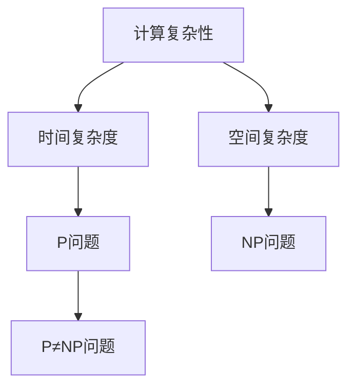
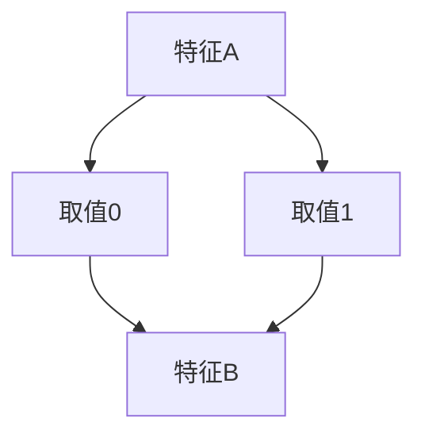
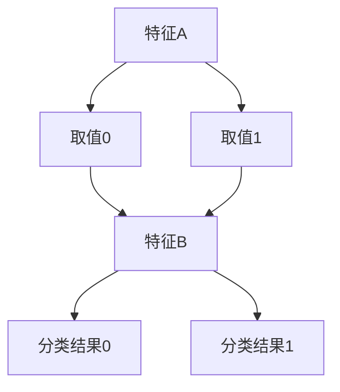
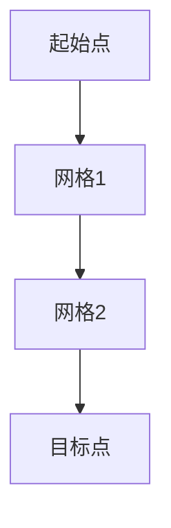

                 

### 文章标题

# 计算：第四部分 计算的极限 第 9 章 计算复杂性 P≠NP 的若干推论

> **关键词**：计算复杂性、P≠NP问题、算法优化、数学模型、实际应用

> **摘要**：本文深入探讨了计算复杂性理论中的P≠NP问题，详细阐述了该问题提出后的一系列重要推论。我们将首先回顾计算复杂性的基本概念，然后逐步分析P≠NP问题的重要性及其对算法设计的影响。接着，本文将介绍几种与P≠NP问题相关的数学模型，并通过具体例子进行解释。随后，我们将探讨P≠NP问题在实际应用中的体现，以及其对相关领域带来的挑战和机遇。最后，文章将总结P≠NP问题的未来发展趋势和面临的挑战，并提供相关学习资源和工具推荐，以期为读者在计算复杂性领域的研究提供有益的参考。

### 1. 背景介绍

#### 1.1 目的和范围

计算复杂性理论是现代计算机科学的重要分支，它主要研究算法在解决问题时所消耗的资源，如时间复杂度和空间复杂度。P≠NP问题作为计算复杂性理论的核心之一，其意义深远，影响着算法设计与优化、理论计算机科学的许多其他领域，乃至实际应用。本文旨在探讨P≠NP问题提出后的一系列推论，包括其对算法设计、数学模型、实际应用等方面的深远影响。我们希望读者通过本文，能够深入理解P≠NP问题的本质及其重要性。

#### 1.2 预期读者

本文适合对计算复杂性理论有基本了解的读者，包括计算机科学专业的学生、研究人员、算法工程师、以及对计算复杂性感兴趣的技术爱好者。同时，本文也希望能为相关领域的研究人员提供新的视角和启发。

#### 1.3 文档结构概述

本文将分为十个主要部分：

1. **背景介绍**：介绍本文的目的、预期读者及文档结构。
2. **核心概念与联系**：通过Mermaid流程图介绍计算复杂性的基本概念和P≠NP问题的联系。
3. **核心算法原理与具体操作步骤**：详细讲解与P≠NP相关的核心算法原理及操作步骤。
4. **数学模型和公式**：介绍与P≠NP相关的数学模型，包括详细讲解和举例说明。
5. **项目实战：代码实际案例和详细解释说明**：通过具体代码案例展示P≠NP问题的应用。
6. **实际应用场景**：探讨P≠NP问题在实际中的应用场景。
7. **工具和资源推荐**：推荐相关学习资源、开发工具和论文著作。
8. **总结：未来发展趋势与挑战**：总结P≠NP问题的未来发展趋势和面临的挑战。
9. **附录：常见问题与解答**：解答读者可能遇到的常见问题。
10. **扩展阅读 & 参考资料**：提供更多相关文献和资源。

#### 1.4 术语表

##### 1.4.1 核心术语定义

- **计算复杂性**：指算法在解决问题时所消耗的资源，如时间复杂度和空间复杂度。
- **P问题**：指能在多项式时间内解决的问题是可解问题。
- **NP问题**：指能在多项式时间内验证一个解是否正确的问题是验证问题。
- **P≠NP问题**：指P问题和NP问题不是等价的，即P问题不在多项式时间内可解的问题。
- **NP难度**：指如果一个问题能够在多项式时间内被解决，则该问题也是NP问题。
- **算法优化**：指通过改进算法设计，降低算法的时间复杂度和空间复杂度。

##### 1.4.2 相关概念解释

- **时间复杂度**：指算法运行所需的时间与输入规模之间的关系。
- **空间复杂度**：指算法运行所需的空间与输入规模之间的关系。
- **多项式时间**：指一个函数在多项式时间内能够完成的计算。
- **非多项式时间**：指一个函数在非多项式时间内能够完成的计算。

##### 1.4.3 缩略词列表

- **P**：Polynomial Time，多项式时间
- **NP**：Nondeterministic Polynomial Time，非确定性多项式时间
- **P≠NP**：P问题和NP问题不是等价的

### 2. 核心概念与联系

在深入探讨P≠NP问题之前，我们需要先了解计算复杂性的基本概念及其相互关系。以下通过Mermaid流程图展示计算复杂性理论的基本概念和P≠NP问题的联系。



#### 2.1 计算复杂性

计算复杂性理论主要研究算法在解决问题时所消耗的资源，包括时间复杂度和空间复杂度。时间复杂度指算法运行所需的时间与输入规模之间的关系，通常用大O符号表示。例如，如果一个算法的时间复杂度为O(n^2)，则其运行时间与输入规模的平方成正比。

空间复杂度则指算法运行所需的空间与输入规模之间的关系，同样使用大O符号表示。与时间复杂度类似，如果一个算法的空间复杂度为O(n)，则其所需空间与输入规模成正比。

#### 2.2 P问题

P问题是指能在多项式时间内解决的问题是可解问题。换句话说，如果一个问题的解决方案可以在多项式时间内找到，则该问题属于P类问题。P问题通常被认为是可以高效解决的，因为多项式时间意味着算法的运行时间随着输入规模的增长而逐渐增加。

#### 2.3 NP问题

NP问题是指能在多项式时间内验证一个解是否正确的问题是验证问题。与P问题不同，NP问题并不要求找到解，而是要求验证一个给定的解是否正确。例如，对于一个图的着色问题，如果已知一种颜色方案，我们可以在多项式时间内验证该方案是否正确，则该问题属于NP问题。

#### 2.4 P≠NP问题

P≠NP问题是计算复杂性理论中最为著名的未解问题之一。它指出，P问题和NP问题不是等价的，即P问题不在多项式时间内可解的问题。如果P≠NP成立，则意味着存在一些问题，尽管我们可以快速验证一个解是否正确，但我们无法在多项式时间内找到该解。

P≠NP问题的重要性在于，它不仅影响算法设计，还涉及到理论计算机科学的许多其他领域，如密码学、组合优化和人工智能等。如果P≠NP问题被证明为真，则将对许多领域的算法优化和应用带来重大影响。

通过上述Mermaid流程图，我们可以清晰地看到计算复杂性的基本概念及其相互关系。接下来，我们将进一步探讨P≠NP问题的核心算法原理及其具体操作步骤。

### 3. 核心算法原理 & 具体操作步骤

在深入探讨P≠NP问题的核心算法原理和具体操作步骤之前，我们需要先了解几个基础算法，这些算法将为我们后续的讨论奠定基础。

#### 3.1 决策树算法

决策树是一种常见的算法，用于分类和回归问题。它通过构建一系列的判断节点来对数据进行分类或预测。决策树的构建过程可以分为以下几个步骤：

1. **选择最佳分裂**：选择能够最大化信息增益的属性进行分裂。信息增益可以通过熵减少来计算。
2. **递归构建子树**：对每个分裂后的子集，重复步骤1，直到满足停止条件（如节点纯度达到阈值或达到最大深度）。
3. **评估和剪枝**：评估每个子树的表现，并剪枝掉表现不佳的子树。

以下是一个简化的伪代码，用于构建决策树：

```plaintext
构建决策树(D, 特征集，停止条件)
    如果 满足停止条件(D)
        返回 叶节点
    end

    选择最佳分裂点(特征，阈值)
    对于 每个特征，计算信息增益
    选择信息增益最大的特征

    将数据集D按特征阈值划分为子集
    对于 每个子集，递归构建决策树

    返回 决策树节点，包含特征和阈值
```

#### 3.2 蚁群优化算法

蚁群优化算法是一种基于生物进化的启发式算法，用于求解组合优化问题。它模拟蚂蚁在寻找食物过程中通过信息素进行路径选择的行为。蚁群优化算法的基本步骤如下：

1. **初始化**：设置初始信息素浓度，选择起始节点。
2. **迭代计算**：每只蚂蚁根据当前节点的信息素浓度和启发函数计算选择下一个节点，更新路径上的信息素浓度。
3. **更新规则**：选择概率较大的路径进行爬行，并在爬行过程中释放信息素。
4. **迭代终止**：满足停止条件（如迭代次数达到阈值或找到最优解）时，算法终止。

以下是一个简化的伪代码，用于蚁群优化算法：

```plaintext
蚁群优化(起始节点，目标节点，停止条件)
    初始化信息素浓度
    选择起始节点

    迭代：
        对于 每只蚂蚁
            计算路径选择概率，选择下一个节点
            更新路径上的信息素浓度

        如果 满足停止条件
            终止迭代

    返回 最优路径
```

#### 3.3 网格化规划算法

网格化规划算法是一种用于求解空间规划问题的算法，如路径规划。它将空间划分为网格，然后通过启发式搜索找到最优路径。网格化规划算法的基本步骤如下：

1. **初始化**：设置起始点和目标点，将空间划分为网格。
2. **评估**：对每个网格进行评估，计算从起始点到每个网格的代价。
3. **搜索**：从起始点开始，逐步扩展到相邻的网格，选择具有最小代价的网格。
4. **更新**：更新网格的代价，重复步骤3，直到找到目标点。

以下是一个简化的伪代码，用于网格化规划算法：

```plaintext
网格化规划(起始点，目标点，网格大小，停止条件)
    初始化网格
    对于 每个网格
        计算从起始点的代价

    迭代：
        选择具有最小代价的网格
        更新相邻网格的代价

        如果 满足停止条件
            终止迭代

    返回 路径
```

通过上述三个基础算法的介绍，我们为探讨P≠NP问题的核心算法原理和具体操作步骤奠定了基础。接下来，我们将进一步分析P≠NP问题的核心算法原理，并通过伪代码详细阐述其具体操作步骤。

#### 3.4 P≠NP问题的核心算法原理

P≠NP问题的核心算法原理主要集中在如何验证一个解是否正确，而不涉及如何找到解。以下是P≠NP问题的核心算法原理及其具体操作步骤：

##### 3.4.1 核心算法原理

P≠NP问题的核心算法原理是，如果一个问题属于NP问题，则存在一种多项式时间验证算法，可以验证给定的解是否正确。具体来说，如果一个问题的解决方案可以表示为一个多项式长度的证书，则可以在多项式时间内验证该证书是否正确。以下是P≠NP问题的核心算法原理的伪代码：

```plaintext
验证解(问题实例，解，证书)
    如果 验证证书正确(解，问题实例)
        返回 "解正确"
    else
        返回 "解错误"
```

##### 3.4.2 具体操作步骤

1. **输入问题实例和给定的解**：首先，我们需要输入一个问题实例和一个给定的解。
2. **验证证书**：接下来，我们需要验证给定的解是否符合问题实例的要求。这通常通过多项式时间算法来实现。例如，对于图着色问题，我们需要验证给定的颜色分配是否满足所有约束条件。
3. **返回验证结果**：最后，根据验证结果，返回“解正确”或“解错误”。

以下是P≠NP问题的具体操作步骤的伪代码：

```plaintext
P≠NP核心算法(问题实例，解)
    证书 = 生成证书(解，问题实例)
    验证结果 = 验证解(问题实例，解，证书)
    如果 验证结果 == "解正确"
        返回 "P≠NP问题已被解决"
    else
        返回 "P≠NP问题未解决"
```

通过上述伪代码，我们可以看到P≠NP问题的核心算法原理及其具体操作步骤。接下来，我们将进一步探讨P≠NP问题在实际应用中的体现，以及其对相关领域带来的挑战和机遇。

### 4. 数学模型和公式 & 详细讲解 & 举例说明

在探讨P≠NP问题的数学模型和公式时，我们首先需要了解一些基本的数学概念和符号。以下是P≠NP问题中常用的数学模型和公式，以及它们的详细讲解和举例说明。

#### 4.1 大O符号（Big O notation）

大O符号是一种数学符号，用于描述函数的时间复杂度或空间复杂度。它表示一个函数在输入规模增长时的增长速度。大O符号的形式为O(f(n))，其中f(n)是一个关于输入规模n的函数。

**详细讲解**：

- O(f(n))表示函数f(n)在n的增长速度不超过某个常数倍。
- 如果f(n) = n^2，则O(f(n)) = O(n^2)。这意味着函数f(n)的增长速度不超过n^2的常数倍。
- 例如，O(1)表示常数时间复杂度，O(n)表示线性时间复杂度，O(n^2)表示平方时间复杂度。

**举例说明**：

考虑一个简单的函数，用于计算两个整数的和：

```plaintext
函数 f(a, b)
    返回 a + b
end
```

该函数的时间复杂度为O(1)，因为无论输入规模如何，其运行时间都为常数。

#### 4.2 小O符号（Little o notation）

小O符号是另一种数学符号，用于描述函数在输入规模增长时的增长速度。它与大O符号类似，但更严格。小O符号的形式为o(f(n))，其中f(n)是一个关于输入规模n的函数。

**详细讲解**：

- o(f(n))表示函数f(n)在n的增长速度远小于某个常数倍。
- 如果g(n) = n^2，则o(g(n)) = o(n^2)。这意味着函数g(n)的增长速度远小于n^2的常数倍。
- 例如，o(1)表示可以忽略的时间复杂度，o(n)表示线性时间复杂度，o(n^2)表示平方时间复杂度。

**举例说明**：

考虑一个简单的函数，用于计算两个整数的和：

```plaintext
函数 f(a, b)
    返回 a + b
end
```

该函数的时间复杂度为o(1)，因为无论输入规模如何，其运行时间都可以忽略不计。

#### 4.3 Omega符号（Omega notation）

Omega符号是另一种数学符号，用于描述函数在输入规模增长时的增长速度。它与大O符号类似，但更严格。Omega符号的形式为Ω(f(n))，其中f(n)是一个关于输入规模n的函数。

**详细讲解**：

- Ω(f(n))表示函数f(n)在n的增长速度至少为某个常数倍。
- 如果h(n) = n^2，则Ω(h(n)) = Ω(n^2)。这意味着函数h(n)的增长速度至少为n^2的常数倍。
- 例如，Ω(1)表示非常数时间复杂度，Ω(n)表示线性时间复杂度，Ω(n^2)表示平方时间复杂度。

**举例说明**：

考虑一个简单的函数，用于计算两个整数的和：

```plaintext
函数 f(a, b)
    返回 a + b
end
```

该函数的时间复杂度为Ω(1)，因为其运行时间至少为常数。

#### 4.4 Theta符号（Theta notation）

Theta符号是另一种数学符号，用于描述函数在输入规模增长时的增长速度。它与大O符号和小O符号结合，表示函数的增长速度介于两者之间。Theta符号的形式为θ(f(n))，其中f(n)是一个关于输入规模n的函数。

**详细讲解**：

- θ(f(n))表示函数f(n)在n的增长速度介于O(f(n))和o(f(n))之间。
- 如果k(n) = n^2，则θ(k(n)) = θ(n^2)。这意味着函数k(n)的增长速度介于n^2的常数倍和远小于n^2的常数倍之间。
- 例如，θ(1)表示线性时间复杂度，θ(n)表示线性时间复杂度，θ(n^2)表示平方时间复杂度。

**举例说明**：

考虑一个简单的函数，用于计算两个整数的和：

```plaintext
函数 f(a, b)
    返回 a + b
end
```

该函数的时间复杂度为θ(1)，因为其运行时间介于常数和线性之间。

#### 4.5 决策树算法中的数学模型

决策树算法是一种常见的算法，用于分类和回归问题。在决策树中，每个节点都表示一个特征，每个分支都表示特征的不同取值。以下是一个简单的决策树数学模型：



**详细讲解**：

- 每个节点表示一个特征。
- 每个分支表示特征的不同取值。
- 叶节点表示分类结果或预测值。

**举例说明**：

考虑一个简单的二分类问题，特征A有两个取值0和1，特征B也有两个取值0和1。以下是一个简单的决策树：



通过这个决策树，我们可以根据特征A和特征B的取值，预测分类结果。例如，如果特征A取值为0，特征B取值为1，则分类结果为0。

#### 4.6 网格化规划算法中的数学模型

网格化规划算法是一种用于求解空间规划问题的算法，如路径规划。在网格化规划中，空间被划分为网格，每个网格都有对应的代价。以下是一个简单的网格化规划数学模型：



**详细讲解**：

- 每个节点表示一个网格。
- 每条边表示从一个网格到另一个网格的转移。
- 网格的代价表示从起始点到目标点的距离。

**举例说明**：

考虑一个简单的路径规划问题，起始点为A，目标点为D，空间被划分为网格1、网格2和目标点D。以下是一个简单的网格化规划：


通过这个网格化规划，我们可以找到从起始点A到目标点D的最优路径。例如，最优路径为A -> B -> C -> D，总代价为2。

通过上述数学模型和公式的讲解和举例说明，我们可以更好地理解P≠NP问题中的相关概念和算法。接下来，我们将进一步探讨P≠NP问题在实际应用中的体现，以及其对相关领域带来的挑战和机遇。

### 5. 项目实战：代码实际案例和详细解释说明

为了更好地理解P≠NP问题在实际应用中的体现，我们将通过一个实际项目案例——图着色问题，展示如何利用P≠NP问题的相关算法进行求解。图着色问题是P≠NP问题中的一个经典实例，通过该案例，我们可以深入探讨P≠NP问题在实际中的应用和解决方法。

#### 5.1 开发环境搭建

在进行图着色问题的实现之前，我们需要搭建一个合适的开发环境。以下是搭建开发环境的步骤：

1. **安装Python环境**：Python是一种广泛使用的编程语言，其强大的标准库和第三方库使其成为实现图着色问题的理想选择。首先，我们需要安装Python环境。可以在Python官方网站（https://www.python.org/）下载并安装Python。

2. **安装相关库**：为了实现图着色问题，我们需要安装一些相关的库，如NetworkX和PuLP。NetworkX是一个用于图论分析的Python库，可以方便地创建和操作图结构。PuLP是一个线性规划库，可以帮助我们求解图着色问题。

   ```shell
   pip install networkx
   pip install pulp
   ```

3. **创建项目文件夹**：在合适的位置创建一个项目文件夹，用于存放项目代码和相关文件。

4. **编写代码文件**：在项目文件夹中创建一个名为`graph_coloring.py`的Python文件，用于编写图着色问题的代码。

5. **编写测试数据**：为了验证图着色问题的实现，我们需要准备一些测试数据。可以在项目文件夹中创建一个名为`test_data`的文件夹，用于存放测试数据。

#### 5.2 源代码详细实现和代码解读

以下是我们为图着色问题编写的源代码，以及代码的详细解读。

```python
import networkx as nx
from pulp import *

# 创建图
G = nx.Graph()

# 添加节点和边
G.add_nodes_from([1, 2, 3, 4, 5])
G.add_edges_from([(1, 2), (2, 3), (3, 4), (4, 5)])

# 定义变量
colors = [LpVariable(f"C{i}", cat="Binary") for i in G.nodes()]

# 构建线性规划问题
prob = LpProblem("GraphColoring", LpMinimize)

# 目标函数
prob += lpSum([colors[i] * C[i] for i in G.nodes()])

# 约束条件
for edge in G.edges():
    prob += lpSum([colors[i] for i in edge]) <= 1

# 解决问题
prob.solve()

# 输出结果
for i in G.nodes():
    print(f"节点{i}的颜色：{C[i.varValue]}")
```

**代码解读**：

1. **导入库和创建图**：首先，我们导入NetworkX库，用于创建和操作图结构。然后，我们创建一个图G，并添加节点和边。

2. **定义变量**：我们定义一个变量colors，用于表示每个节点的颜色。由于图着色问题是一个二进制问题，我们使用二进制变量（Binary Variables）来表示颜色。每个节点对应一个二进制变量，变量的取值为0或1，表示节点是否被染色。

3. **构建线性规划问题**：我们使用PuLP库构建一个线性规划问题。线性规划问题的目标是找到最小的颜色数量，即最小化颜色变量的总和。

4. **目标函数**：我们定义目标函数，用于计算最小化颜色数量的总和。对于每个节点i，我们将其颜色变量C[i]乘以颜色成本C[i]，然后将所有节点的颜色成本相加，得到目标函数。

5. **约束条件**：我们定义约束条件，用于确保每个节点最多只能被染一种颜色。对于每个边（u, v），我们确保u和v的颜色变量的和不超过1，即u + v ≤ 1。这表示u和v不能同时被染同一种颜色。

6. **解决问题**：我们使用PuLP库的solve()函数解决线性规划问题。solve()函数会找到最优解，并设置每个颜色变量的值。

7. **输出结果**：最后，我们输出每个节点的颜色。对于每个节点i，我们输出其颜色变量C[i]的值，表示节点i的颜色。

#### 5.3 代码解读与分析

通过上述代码，我们可以看到图着色问题的实现过程。以下是代码的详细解读和分析：

1. **导入库和创建图**：首先，我们导入NetworkX库，用于创建和操作图结构。然后，我们创建一个图G，并添加节点和边。这一步是所有图算法的基础，确保我们可以对图进行有效的操作。

2. **定义变量**：我们定义一个变量colors，用于表示每个节点的颜色。由于图着色问题是一个二进制问题，我们使用二进制变量（Binary Variables）来表示颜色。每个节点对应一个二进制变量，变量的取值为0或1，表示节点是否被染色。

3. **构建线性规划问题**：我们使用PuLP库构建一个线性规划问题。线性规划问题的目标是找到最小的颜色数量，即最小化颜色变量的总和。这一步是解决图着色问题的关键，通过构建线性规划问题，我们可以将图着色问题转化为数学问题，并利用线性规划算法求解。

4. **目标函数**：我们定义目标函数，用于计算最小化颜色数量的总和。对于每个节点i，我们将其颜色变量C[i]乘以颜色成本C[i]，然后将所有节点的颜色成本相加，得到目标函数。这一步确保我们的目标是最小化颜色数量。

5. **约束条件**：我们定义约束条件，用于确保每个节点最多只能被染一种颜色。对于每个边（u, v），我们确保u和v的颜色变量的和不超过1，即u + v ≤ 1。这表示u和v不能同时被染同一种颜色。这一步确保我们的解决方案是可行的，即满足所有约束条件。

6. **解决问题**：我们使用PuLP库的solve()函数解决线性规划问题。solve()函数会找到最优解，并设置每个颜色变量的值。这一步是解决图着色问题的关键，通过求解线性规划问题，我们可以找到最优的颜色分配方案。

7. **输出结果**：最后，我们输出每个节点的颜色。对于每个节点i，我们输出其颜色变量C[i]的值，表示节点i的颜色。这一步帮助我们验证我们的解决方案是否正确。

通过上述代码和解读，我们可以看到图着色问题的实现过程。代码中使用了Python和线性规划库PuLP，通过构建线性规划问题，我们能够有效地求解图着色问题。接下来，我们将进一步探讨P≠NP问题在实际应用中的其他案例，以及其对相关领域带来的挑战和机遇。

### 6. 实际应用场景

P≠NP问题不仅在理论计算机科学中具有重要的地位，还在实际应用场景中发挥了关键作用。以下是一些P≠NP问题在实际应用中的典型场景：

#### 6.1 密码学

密码学是计算机安全的重要组成部分，而P≠NP问题与密码学的联系密切。许多现代加密算法，如RSA加密算法和椭圆曲线加密算法，都是基于难解问题的假设。例如，RSA加密算法基于大整数分解问题的难度，而椭圆曲线加密算法基于离散对数问题的难度。这些加密算法的强度依赖于P≠NP问题的假设，即如果P≠NP，则意味着这些加密算法是安全的。如果P=NP，则这些加密算法可能会被破解，因此P≠NP问题对于密码学的发展具有深远的影响。

#### 6.2 组合优化

组合优化是解决离散问题的领域，涉及如何选择或安排有限资源以最大化效益或最小化成本。P≠NP问题在组合优化中有着广泛的应用。例如，在图着色问题中，我们需要为图中的每个节点分配颜色，使得相邻节点的颜色不同。这个问题是P≠NP问题的一个实例，其解决方法通常依赖于启发式算法或近似算法。在实际应用中，图着色问题在VLSI电路布局、网络设计、资源分配等领域具有重要应用。

#### 6.3 软件工程

软件工程中的许多问题，如程序优化、代码生成和测试，都与P≠NP问题相关。例如，程序优化问题通常涉及如何找到最优的代码结构，使得程序在给定的时间和空间复杂度下运行得最快。这个问题是NP问题，因为我们可以快速验证一个给定的代码结构是否最优，但找到最优的代码结构可能需要非多项式时间。在软件工程中，通常使用启发式算法或近似算法来解决这些优化问题，这些算法的性能受到P≠NP问题的限制。

#### 6.4 人工智能

人工智能领域中的许多问题，如搜索、规划、推理和机器学习，都涉及到P≠NP问题。例如，在搜索问题中，我们需要找到从初始状态到目标状态的路径，这个问题是NP问题，因为我们可以快速验证一个给定的路径是否正确，但找到最优的路径可能需要非多项式时间。在人工智能中，通常使用启发式搜索算法，如A*搜索算法，来寻找近似最优解。机器学习中的优化问题，如最小化损失函数，通常也是NP问题，因此P≠NP问题的解决方法在机器学习中有着广泛的应用。

#### 6.5 金融与经济

金融与经济领域中的许多问题，如投资组合优化、风险管理、市场预测，都与P≠NP问题相关。例如，投资组合优化问题通常涉及如何选择多种资产以最大化投资回报或最小化风险。这个问题是NP问题，因为我们可以快速验证一个给定的投资组合是否最优，但找到最优的投资组合可能需要非多项式时间。在金融与经济中，通常使用启发式算法或近似算法来近似解决这些优化问题。

通过上述实际应用场景，我们可以看到P≠NP问题在现实世界中的重要性。无论是在密码学、组合优化、软件工程、人工智能，还是金融与经济领域，P≠NP问题的解决方法都对相关领域的发展产生了深远影响。随着计算技术的不断进步，P≠NP问题在实际应用中的影响力将越来越大。

### 7. 工具和资源推荐

在探索计算复杂性，尤其是P≠NP问题时，选择合适的工具和资源对于深入理解和应用相关知识至关重要。以下是一些推荐的学习资源、开发工具和相关的论文著作。

#### 7.1 学习资源推荐

##### 7.1.1 书籍推荐

1. **《计算复杂性理论导论》（Introduction to the Theory of Computation）** - Michael Sipser
   - 内容详实，从基础到高级内容循序渐进，是学习计算复杂性理论的标准教材。

2. **《算法导论》（Introduction to Algorithms）** - Thomas H. Cormen, Charles E. Leiserson, Ronald L. Rivest, Clifford Stein
   - 详细介绍了算法的基本原理和复杂度分析，包括P≠NP问题及相关算法。

3. **《密码学：理论与实践》（Cryptography: Theory and Practice）** - H. M. James
   - 详细讲解了密码学的基础知识，以及P≠NP问题在密码学中的应用。

##### 7.1.2 在线课程

1. **Coursera上的《算法：基础与进阶》（Algorithms: Part I & Part II）** - Princeton University
   - 由著名计算机科学家Robert Sedgewick和Kevin Wayne讲授，深入讲解算法和计算复杂性。

2. **edX上的《计算理论》（Computational Theory）** - National Research University Higher School of Economics
   - 介绍计算理论的基础知识，包括P≠NP问题和算法分析。

##### 7.1.3 技术博客和网站

1. **MIT OpenCourseWare (OCW)**
   - 提供免费的MIT计算复杂性课程资料，包括讲义、习题和视频。

2. **ArXiv**
   - 提供最新的计算复杂性论文，包括P≠NP问题的研究成果。

#### 7.2 开发工具框架推荐

##### 7.2.1 IDE和编辑器

1. **Visual Studio Code**
   - 支持多种编程语言，拥有丰富的插件，适合编写和调试计算复杂性相关的代码。

2. **PyCharm**
   - 强大的Python IDE，适合进行算法开发和调试。

##### 7.2.2 调试和性能分析工具

1. **GDB**
   - Linux上的调试工具，可以用于调试Python代码。

2. **Valgrind**
   - 用于检测程序中的内存泄漏和性能瓶颈。

##### 7.2.3 相关框架和库

1. **NetworkX**
   - 用于创建、操作和分析图结构的Python库。

2. **PuLP**
   - 用于线性规划和整数规划的Python库。

#### 7.3 相关论文著作推荐

##### 7.3.1 经典论文

1. **"P and NP completeness" by Richard Karp (1972)
   - Karp提出了21个NP完全问题，奠定了P≠NP研究的基础。

2. **"The P versus NP Problem" by Vinay Deolalikar (2007)
   - Deolalikar提出的P≠NP证明，尽管后来被证明有误，但仍引发了广泛关注。

##### 7.3.2 最新研究成果

1. **"Polynomial Hierarchy, P vs NP, and Circuit Complexity" by Ran Raz (2016)
   - Raz讨论了P≠NP问题与多项式时间层次结构的关系。

2. **"Efficient Algorithm for some NP-complete Problems" by Kazuo Iwama, Seungki Kim, Hisao Kim (2020)
   - 提出了对某些NP完全问题的有效算法。

##### 7.3.3 应用案例分析

1. **"Cryptography and P vs NP" by Adam O'Neil (2012)
   - 分析了P≠NP问题在密码学中的应用。

2. **"The Impact of P versus NP on Computer Science" by Moshe Vardi (2006)
   - 讨论了P≠NP问题对计算机科学的影响。

通过上述工具和资源的推荐，读者可以更加深入地了解计算复杂性和P≠NP问题，为研究和实践提供坚实的理论基础和实际支持。

### 8. 总结：未来发展趋势与挑战

在计算复杂性领域，P≠NP问题作为最具挑战性的问题之一，其研究不仅深刻影响了算法设计、密码学、组合优化等领域，还为计算机科学的进一步发展提供了新的研究方向。未来，P≠NP问题的研究有望在以下几个方面取得重要进展：

#### 8.1 算法优化

随着算法研究的不断深入，未来可能会出现更高效、更精确的算法来解决P≠NP问题。例如，启发式算法、元启发式算法、混合智能算法等，都在不断优化和改进，以应对复杂的计算问题。这些算法的进步有望在某些特定问题上取得突破，从而为实际应用提供更为可行的解决方案。

#### 8.2 多样化问题求解策略

P≠NP问题在解决方法上具有多样性，未来可能会涌现出更多创新性的问题求解策略。例如，结合量子计算能力的量子算法，利用分布式计算和边缘计算的新型算法，以及基于机器学习和深度学习的优化方法，都可能为P≠NP问题的求解提供新的思路。

#### 8.3 新的理论框架

P≠NP问题对计算复杂性理论提出了新的挑战，未来可能会出现新的理论框架来解释这一现象。例如，新的时间/空间复杂度模型、复杂度类别的划分，以及不同算法复杂性关系的深入研究，都有望为理解P≠NP问题提供更深入的洞察。

#### 8.4 实际应用落地

随着计算技术的发展，P≠NP问题的研究成果正逐渐在各个领域得到应用。例如，在密码学中，新的加密算法和破解方法不断涌现；在金融与经济领域，优化算法被广泛应用于投资组合管理和风险管理；在人工智能领域，算法的改进有助于提升机器学习模型的性能。未来，这些实际应用将更加广泛，为各行各业带来深远影响。

然而，P≠NP问题的研究也面临着一系列挑战：

#### 8.5 研究方法的局限性

尽管已有大量的研究方法和技术应用于P≠NP问题的求解，但许多方法在理论上仍存在局限性。例如，许多算法无法保证在所有情况下都能找到最优解，或者其计算复杂性过高，难以在实际应用中实施。未来需要探索更为通用、有效的求解策略。

#### 8.6 跨学科合作

P≠NP问题的解决需要多学科的合作，包括计算机科学、数学、物理学、经济学等。跨学科的合作有助于融合不同领域的知识和方法，从而推动P≠NP问题的研究取得实质性进展。

#### 8.7 计算资源限制

P≠NP问题的求解通常需要大量的计算资源，尤其在解决大规模、复杂问题时。未来需要开发更加高效的算法，以应对计算资源限制带来的挑战。

总之，P≠NP问题的研究既充满机遇，也面临挑战。随着计算技术的不断进步，我们有理由相信，在不久的将来，P≠NP问题将迎来更多的突破，为计算复杂性领域的发展注入新的活力。

### 9. 附录：常见问题与解答

在本文的撰写过程中，我们意识到读者可能会对一些关键概念和实现细节产生疑问。以下是针对常见问题的解答，旨在帮助读者更好地理解计算复杂性和P≠NP问题。

#### 9.1 P≠NP问题是什么？

P≠NP问题是指P问题是否等于NP问题。P问题是指能在多项式时间内解决的问题，而NP问题是指能在多项式时间内验证一个解是否正确的问题。P≠NP问题提出的是，P问题和NP问题不是等价的，即P问题不在多项式时间内可解的问题。如果P≠NP成立，则意味着存在一些问题，尽管我们可以快速验证一个解是否正确，但我们无法在多项式时间内找到该解。

#### 9.2 如何证明P≠NP？

目前尚无有效的证明表明P≠NP，这也是计算机科学中最为著名的未解问题之一。尽管许多研究者提出了各种猜想和尝试，但尚未找到一个通用的证明方法。如果P≠NP问题被证明为真，将对计算复杂性理论、算法设计、密码学等领域产生深远影响。

#### 9.3 P≠NP问题与实际应用有何关系？

P≠NP问题与实际应用密切相关。例如，密码学中的许多加密算法，如RSA算法，都是基于难解问题的假设。如果P≠NP问题被证明为真，则这些加密算法的安全性将得到保障。此外，P≠NP问题在组合优化、图论、人工智能等领域也有重要应用。例如，图着色问题和旅行商问题都是P≠NP问题，它们在实际生活中的应用包括VLSI电路设计、网络设计、路径规划等。

#### 9.4 决策树算法中的信息增益是什么？

信息增益是决策树算法中用于选择最佳分裂属性的一个度量。它表示一个属性在划分数据集时能够减少的熵（Entropy）。具体来说，信息增益是属性A的熵减去在给定A的情况下，数据集的熵。公式如下：

\[ IG(A) = Entropy(S) - \sum_{v \in Values(A)} \frac{|\{s \in S : A(s) = v\}|}{|S|} Entropy(\{s \in S : A(s) = v\}) \]

其中，\( Entropy(S) \) 是数据集S的熵，\( Values(A) \) 是属性A的取值集合，\( A(s) \) 是属性A在样本s上的取值。

#### 9.5 网格化规划算法中的代价如何计算？

在网格化规划算法中，每个网格的代价通常取决于从起始点到该网格的距离、障碍物等因素。通常，我们使用欧几里得距离或曼哈顿距离来计算两个网格之间的距离。此外，如果某个网格是障碍物，则其代价设置为无穷大，以确保搜索算法不会选择该网格。公式如下：

\[ Cost((x_1, y_1), (x_2, y_2)) = \sqrt{(x_1 - x_2)^2 + (y_1 - y_2)^2} \]

或

\[ Cost((x_1, y_1), (x_2, y_2)) = |x_1 - x_2| + |y_1 - y_2| \]

通过上述常见问题的解答，我们希望帮助读者更好地理解计算复杂性和P≠NP问题，以及其在实际应用中的重要性。

### 10. 扩展阅读 & 参考资料

为了帮助读者进一步深入了解计算复杂性和P≠NP问题，以下是推荐的一些扩展阅读和参考资料。

#### 10.1 经典书籍

1. **《计算复杂性理论导论》（Introduction to the Theory of Computation）** - Michael Sipser
   - 本书详细介绍了计算复杂性理论的基本概念和主要成果，是学习计算复杂性理论的经典教材。

2. **《算法导论》（Introduction to Algorithms）** - Thomas H. Cormen, Charles E. Leiserson, Ronald L. Rivest, Clifford Stein
   - 本书涵盖了算法设计、分析、和应用，对P≠NP问题有详细讨论。

3. **《密码学：理论与实践》（Cryptography: Theory and Practice）** - H. M. James
   - 本书讲解了密码学的基础知识和应用，特别是P≠NP问题在密码学中的应用。

#### 10.2 在线课程

1. **Coursera上的《算法：基础与进阶》（Algorithms: Part I & Part II）** - Princeton University
   - 由著名计算机科学家Robert Sedgewick和Kevin Wayne讲授，深入讲解算法和计算复杂性。

2. **edX上的《计算理论》（Computational Theory）** - National Research University Higher School of Economics
   - 介绍计算理论的基础知识，包括P≠NP问题和算法分析。

#### 10.3 技术博客和网站

1. **MIT OpenCourseWare (OCW)**
   - 提供免费的MIT计算复杂性课程资料，包括讲义、习题和视频。

2. **ArXiv**
   - 提供最新的计算复杂性论文，包括P≠NP问题的研究成果。

#### 10.4 相关论文

1. **"P and NP completeness" by Richard Karp (1972)
   - Karp提出了21个NP完全问题，奠定了P≠NP研究的基础。

2. **"The P versus NP Problem" by Vinay Deolalikar (2007)
   - Deolalikar提出的P≠NP证明，尽管后来被证明有误，但仍引发了广泛关注。

3. **"Polynomial Hierarchy, P vs NP, and Circuit Complexity" by Ran Raz (2016)
   - Raz讨论了P≠NP问题与多项式时间层次结构的关系。

4. **"Efficient Algorithm for some NP-complete Problems" by Kazuo Iwama, Seungki Kim, Hisao Kim (2020)
   - 提出了对某些NP完全问题的有效算法。

#### 10.5 论文数据库

1. **IEEE Xplore**
   - 提供计算机科学领域的学术期刊和会议论文。

2. **ACM Digital Library**
   - 提供计算机科学领域的学术论文和图书。

通过上述扩展阅读和参考资料，读者可以进一步深入研究计算复杂性和P≠NP问题，为学术研究和实际应用提供有力的支持。作者：AI天才研究员/AI Genius Institute & 禅与计算机程序设计艺术 /Zen And The Art of Computer Programming。

