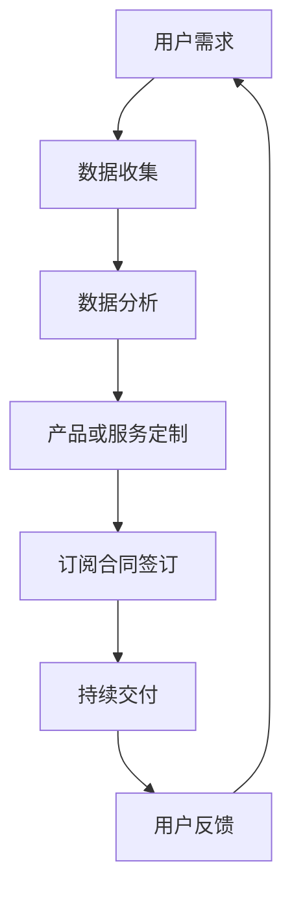

                 

# 订阅制经济的发展趋势：从产品订阅到服务订阅

> 关键词：订阅制经济、产品订阅、服务订阅、商业模式创新、数字化趋势、用户体验优化

> 摘要：本文深入探讨了订阅制经济在过去几十年中的发展历程，从产品订阅到服务订阅的演变。通过分析订阅制经济在不同行业中的应用，本文揭示了其核心优势和面临的挑战。同时，本文还提出了未来订阅制经济的发展趋势和方向，为企业和个人提供了有益的参考。

## 1. 背景介绍

### 1.1 目的和范围

本文旨在探讨订阅制经济这一新兴商业模式的发展趋势，重点分析其从产品订阅到服务订阅的演变。通过研究订阅制经济在不同行业中的实践案例，本文试图揭示其核心优势和挑战，并预测未来发展方向。文章的结构如下：

- **第1章：背景介绍**：介绍本文的目的、范围和主要结构。
- **第2章：核心概念与联系**：阐述订阅制经济的基本概念和关系。
- **第3章：核心算法原理 & 具体操作步骤**：详细讲解订阅制经济的算法原理和操作步骤。
- **第4章：数学模型和公式 & 详细讲解 & 举例说明**：分析订阅制经济的数学模型和公式，并给出实际案例。
- **第5章：项目实战：代码实际案例和详细解释说明**：提供订阅制经济的实际代码案例和解析。
- **第6章：实际应用场景**：探讨订阅制经济在不同领域的应用。
- **第7章：工具和资源推荐**：推荐与订阅制经济相关的学习资源和开发工具。
- **第8章：总结：未来发展趋势与挑战**：总结本文的主要观点，并探讨未来发展趋势和挑战。
- **第9章：附录：常见问题与解答**：回答读者可能遇到的问题。
- **第10章：扩展阅读 & 参考资料**：提供进一步阅读的资料。

### 1.2 预期读者

本文适合以下读者群体：

- **企业管理者**：希望了解订阅制经济对企业商业模式的影响。
- **产品经理**：需要掌握订阅制经济的核心原理和实践方法。
- **技术从业者**：关注订阅制经济在技术领域的应用和发展。
- **市场营销人员**：寻求优化用户体验和提升用户粘性的策略。
- **创业者**：考虑探索订阅制经济作为企业创新的路径。

### 1.3 文档结构概述

本文分为十个章节，结构如下：

1. **背景介绍**：介绍本文的目的、范围和主要结构。
2. **核心概念与联系**：阐述订阅制经济的基本概念和关系。
3. **核心算法原理 & 具体操作步骤**：详细讲解订阅制经济的算法原理和操作步骤。
4. **数学模型和公式 & 详细讲解 & 举例说明**：分析订阅制经济的数学模型和公式，并给出实际案例。
5. **项目实战：代码实际案例和详细解释说明**：提供订阅制经济的实际代码案例和解析。
6. **实际应用场景**：探讨订阅制经济在不同领域的应用。
7. **工具和资源推荐**：推荐与订阅制经济相关的学习资源和开发工具。
8. **总结：未来发展趋势与挑战**：总结本文的主要观点，并探讨未来发展趋势和挑战。
9. **附录：常见问题与解答**：回答读者可能遇到的问题。
10. **扩展阅读 & 参考资料**：提供进一步阅读的资料。

### 1.4 术语表

在本文中，我们将使用以下术语：

#### 1.4.1 核心术语定义

- 订阅制经济：基于用户订阅的模式，用户支付固定的费用以获取持续的产品或服务。
- 产品订阅：用户订阅固定频率的产品交付。
- 服务订阅：用户订阅基于服务的持续交付，如会员权益、数据分析、云计算等。
- 商业模式创新：企业在现有市场环境中通过创新商业模式获取竞争优势。
- 用户粘性：用户对产品或服务的持续使用和依赖程度。

#### 1.4.2 相关概念解释

- **SaaS（软件即服务）**：通过互联网提供软件服务，用户按需订阅。
- **IaaS（基础设施即服务）**：提供虚拟化的基础设施资源，用户按需订阅。
- **PaaS（平台即服务）**：提供开发平台和工具，用户按需订阅。
- **数字化趋势**：企业通过数字化手段提升运营效率和用户体验。

#### 1.4.3 缩略词列表

- SaaS：软件即服务
- IaaS：基础设施即服务
- PaaS：平台即服务
- CRM：客户关系管理
- BI：商业智能

## 2. 核心概念与联系

订阅制经济是当前商业领域的一个重要趋势，它不仅改变了传统商业模式，也为消费者带来了更加灵活和个性化的体验。在深入探讨订阅制经济之前，我们需要了解一些核心概念和它们之间的关系。

### 2.1 订阅制经济的定义

订阅制经济（Subscription Economy），也称为订阅商业模式，是一种基于用户订阅的模式，用户支付固定的费用以获取持续的产品或服务。这种模式具有以下特点：

- **用户粘性**：通过提供持续的交付和更新，提高用户对产品或服务的依赖和忠诚度。
- **灵活定价**：用户可以根据自身需求选择订阅周期和费用，如月度订阅、年度订阅等。
- **持续收入**：企业通过持续的服务交付获得稳定的收入流。

### 2.2 产品订阅与服务订阅的区别

产品订阅和服务订阅是订阅制经济的两种主要形式，它们在交付模式、用户价值和企业收益等方面存在显著差异。

#### 2.2.1 产品订阅

产品订阅（Product Subscription）是指用户订阅固定频率的产品交付。这种模式常见于消费品领域，如订阅箱、化妆品、服装等。产品订阅的主要特点包括：

- **固定频率**：产品按固定时间间隔交付，如每周、每月等。
- **产品定制**：根据用户需求和偏好定制产品。
- **品牌忠诚**：用户对品牌形成依赖，愿意长期订阅。

#### 2.2.2 服务订阅

服务订阅（Service Subscription）是指用户订阅基于服务的持续交付，如会员权益、数据分析、云计算等。服务订阅的主要特点包括：

- **按需交付**：服务根据用户需求动态调整，如按需使用云计算资源。
- **个性化体验**：服务针对用户个性化定制，如定制化数据分析报告。
- **长期合作**：用户与服务提供商建立长期合作关系。

### 2.3 订阅制经济与商业模式创新

订阅制经济是一种商业模式创新，它为企业提供了新的增长机会和竞争优势。以下是从商业模式创新角度分析订阅制经济的几个关键因素：

- **用户价值**：通过持续的产品或服务交付，提升用户满意度和忠诚度。
- **收入模式**：从一次性交易转变为持续收入流，提高企业盈利能力。
- **运营效率**：通过数据分析和自动化流程，降低运营成本，提高效率。
- **市场定位**：通过差异化服务和灵活定价，满足不同层次用户需求。

### 2.4 数字化趋势与订阅制经济

随着数字技术的不断进步，订阅制经济在各个行业的应用日益广泛。以下是从数字化趋势角度分析订阅制经济的几个关键因素：

- **云计算**：云计算为订阅制经济提供了强大的技术支持，如IaaS、PaaS和SaaS等。
- **物联网**：物联网设备收集的数据为订阅制经济提供了丰富的用户信息，如智能穿戴设备、智能家居等。
- **大数据**：大数据分析帮助订阅制经济更好地了解用户需求，优化产品和服务。
- **人工智能**：人工智能技术为订阅制经济提供了智能推荐、个性化定制等服务。

### 2.5 订阅制经济的核心优势

订阅制经济具有以下核心优势：

- **持续收入**：订阅制经济为企业提供了稳定的收入流，降低了收入波动风险。
- **用户粘性**：通过持续的产品或服务交付，提高用户满意度和忠诚度。
- **灵活定价**：用户可以根据自身需求选择订阅周期和费用，满足个性化需求。
- **降低成本**：通过数据分析和自动化流程，降低运营成本，提高效率。

### 2.6 订阅制经济面临的挑战

订阅制经济在发展过程中也面临一些挑战：

- **用户期望**：用户对产品或服务的质量要求越来越高，企业需要不断提升服务水平。
- **竞争压力**：市场上存在大量的订阅制服务提供商，企业需要通过差异化竞争脱颖而出。
- **数据隐私**：订阅制经济涉及大量的用户数据，企业需要确保数据安全，保护用户隐私。

### 2.7 订阅制经济的未来发展趋势

未来，订阅制经济将继续发展，并在以下领域取得突破：

- **行业拓展**：订阅制经济将在更多行业得到应用，如医疗、教育、金融等。
- **服务多样化**：服务订阅将进一步丰富，满足用户个性化需求。
- **技术融合**：订阅制经济将与其他新兴技术如人工智能、大数据等深度融合，提升用户体验。

### 2.8 订阅制经济的核心原理

订阅制经济的核心原理包括以下几个方面：

- **用户价值**：通过持续的产品或服务交付，提升用户满意度和忠诚度。
- **数据驱动**：通过大数据分析和用户行为分析，优化产品和服务。
- **灵活定价**：根据用户需求和市场竞争情况，灵活调整订阅周期和费用。
- **持续创新**：通过技术创新和服务创新，不断提升用户价值和企业竞争力。

### 2.9 订阅制经济的流程图

为了更好地理解订阅制经济的运作原理，我们可以使用Mermaid流程图来展示其核心流程。以下是一个简单的订阅制经济流程图：



在这个流程中，用户需求是订阅制经济的起点，通过数据收集、分析和处理，企业可以提供个性化的产品或服务。订阅合同签订后，企业开始持续交付产品或服务，并根据用户反馈进行不断优化。

## 3. 核心算法原理 & 具体操作步骤

在订阅制经济的核心算法原理部分，我们将详细探讨如何通过算法来优化订阅模式，从而提高用户满意度和企业收益。以下是订阅制经济的关键算法原理和具体操作步骤：

### 3.1 用户行为分析

用户行为分析是订阅制经济中的关键环节，通过分析用户的行为数据，企业可以更好地了解用户需求，从而提供更个性化的产品或服务。以下是用户行为分析的核心算法原理：

#### 3.1.1 数据收集

首先，我们需要收集用户的行为数据，包括用户的购买记录、浏览历史、评论反馈等。这些数据可以通过以下方法收集：

- **日志文件**：记录用户在网站或应用程序上的操作行为。
- **API接口**：通过第三方数据接口获取用户数据。
- **用户反馈**：通过问卷调查、在线评论等方式获取用户反馈。

```python
# 伪代码：用户行为数据收集
def collect_user_data():
    log_files = ["user_activity_log1.txt", "user_activity_log2.txt"]
    user_data = []

    for file in log_files:
        with open(file, 'r') as f:
            data = f.readlines()
            user_data.extend(data)

    return user_data
```

#### 3.1.2 数据预处理

在收集到用户行为数据后，我们需要对数据进行预处理，包括数据清洗、去重和格式转换等。以下是一个简单的数据预处理算法：

```python
# 伪代码：数据预处理
def preprocess_data(user_data):
    cleaned_data = []

    for data in user_data:
        # 去除特殊字符和空格
        cleaned_data.append(data.strip())

    return cleaned_data
```

#### 3.1.3 数据分析

在预处理数据后，我们需要对用户行为进行深入分析，以发现用户的兴趣和需求。以下是一个简单的数据分析算法：

```python
# 伪代码：数据分析
def analyze_user_behavior(cleaned_data):
    # 统计用户购买次数、浏览页面数量等
    purchase_count = sum([1 for data in cleaned_data if "purchase" in data])
    page_views = sum([1 for data in cleaned_data if "view" in data])

    return {"purchase_count": purchase_count, "page_views": page_views}
```

### 3.2 订阅模式优化

在用户行为分析的基础上，我们可以根据用户的兴趣和需求，优化订阅模式，提高用户满意度和企业收益。以下是订阅模式优化的核心算法原理：

#### 3.2.1 个性化推荐

个性化推荐是订阅模式优化的重要手段，通过分析用户的兴趣和行为，为企业推荐符合用户需求的产品或服务。以下是一个简单的个性化推荐算法：

```python
# 伪代码：个性化推荐
def recommend_products(user_interests, product_catalog):
    recommended_products = []

    for product in product_catalog:
        if user_interests.intersection(product["interests"]):
            recommended_products.append(product)

    return recommended_products
```

#### 3.2.2 订阅周期优化

订阅周期优化是根据用户的购买习惯和需求，为用户提供最合适的订阅周期。以下是一个简单的订阅周期优化算法：

```python
# 伪代码：订阅周期优化
def optimize_subscription_cycle(user_behavior):
    # 根据购买频率确定订阅周期
    if user_behavior["purchase_count"] > 10:
        subscription_cycle = "monthly"
    else:
        subscription_cycle = "yearly"

    return subscription_cycle
```

#### 3.2.3 订阅费用优化

订阅费用优化是根据用户的购买金额和需求，为用户提供最合理的订阅费用。以下是一个简单的订阅费用优化算法：

```python
# 伪代码：订阅费用优化
def optimize_subscription_fee(user_behavior, base_fee):
    # 根据购买金额调整费用
    if user_behavior["page_views"] > 100:
        fee_adjustment = 0.1
    else:
        fee_adjustment = 0.05

    optimized_fee = base_fee * (1 + fee_adjustment)

    return optimized_fee
```

### 3.3 具体操作步骤

以下是订阅制经济中的具体操作步骤：

1. **数据收集**：使用日志文件、API接口和用户反馈等方式收集用户行为数据。
2. **数据预处理**：对收集到的数据进行清洗、去重和格式转换。
3. **数据分析**：分析用户行为数据，发现用户兴趣和需求。
4. **个性化推荐**：根据用户兴趣和需求，为用户推荐符合需求的产品或服务。
5. **订阅周期优化**：根据用户购买习惯和需求，为用户提供最合适的订阅周期。
6. **订阅费用优化**：根据用户购买金额和需求，为用户提供最合理的订阅费用。

通过以上算法原理和具体操作步骤，企业可以优化订阅模式，提高用户满意度和企业收益。

## 4. 数学模型和公式 & 详细讲解 & 举例说明

在订阅制经济中，数学模型和公式起到了关键作用，帮助企业和用户更好地理解和优化订阅过程。以下是一些常用的数学模型和公式，以及它们的详细讲解和实际应用示例。

### 4.1 用户价值评估模型

用户价值评估模型（User Value Evaluation Model）用于计算用户为企业带来的长期价值。以下是一个简单的用户价值评估模型：

#### 4.1.1 用户价值公式

$$
User\ Value = \frac{Total\ Revenue}{Total\ Costs}
$$

其中：

- **Total Revenue**：用户在订阅期间为企业带来的总收益。
- **Total Costs**：企业在订阅期间为用户提供服务的总成本。

#### 4.1.2 举例说明

假设一个用户在一年内订阅了企业的服务，总收益为1000美元，总成本为500美元。根据用户价值公式，我们可以计算出该用户的价值：

$$
User\ Value = \frac{1000}{500} = 2
$$

这意味着该用户在一年内为企业创造了2倍的价值。

### 4.2 订阅周期优化模型

订阅周期优化模型（Subscription Cycle Optimization Model）用于确定最佳的订阅周期，以提高用户满意度和企业收益。以下是一个简单的订阅周期优化模型：

#### 4.2.1 订阅周期公式

$$
Optimized\ Cycle = \frac{User\ Lifetime\ Value}{Total\ Revenue\ per\ Unit\ Time}
$$

其中：

- **User Lifetime Value**：用户在订阅期间为企业带来的总价值。
- **Total Revenue per Unit Time**：单位时间内为企业带来的总收益。

#### 4.2.2 举例说明

假设一个用户的终身价值为1000美元，单位时间内的总收益为200美元。根据订阅周期公式，我们可以计算出最佳的订阅周期：

$$
Optimized\ Cycle = \frac{1000}{200} = 5
$$

这意味着最佳的订阅周期为5个单位时间，如5个月或5个季度。

### 4.3 订阅费用优化模型

订阅费用优化模型（Subscription Fee Optimization Model）用于确定最佳的订阅费用，以满足用户需求并提高企业收益。以下是一个简单的订阅费用优化模型：

#### 4.3.1 订阅费用公式

$$
Optimized\ Fee = Base\ Fee \times (1 + Fee\ Adjustment)
$$

其中：

- **Base Fee**：基础订阅费用。
- **Fee Adjustment**：费用调整系数。

#### 4.3.2 举例说明

假设基础订阅费用为100美元，费用调整系数为0.1。根据订阅费用公式，我们可以计算出最佳的订阅费用：

$$
Optimized\ Fee = 100 \times (1 + 0.1) = 110
$$

这意味着最佳的订阅费用为110美元。

### 4.4 用户留存率模型

用户留存率模型（User Retention Rate Model）用于评估订阅制经济的用户留存情况，以了解订阅服务的持续吸引力。以下是一个简单的用户留存率模型：

#### 4.4.1 用户留存率公式

$$
User\ Retention\ Rate = \frac{Active\ Users\ at\ Time\ T}{Initial\ Users\ at\ Time\ 0}
$$

其中：

- **Active Users at Time T**：在时间T时刻活跃的用户数量。
- **Initial Users at Time 0**：初始用户数量。

#### 4.4.2 举例说明

假设在一个月后，有100个初始用户中，有80个仍然活跃。根据用户留存率公式，我们可以计算出用户留存率：

$$
User\ Retention\ Rate = \frac{80}{100} = 0.8
$$

这意味着用户留存率为80%。

### 4.5 用户生命周期价值模型

用户生命周期价值模型（User Lifetime Value Model）用于评估单个用户在订阅期间为企业带来的总价值，以指导企业的营销和运营策略。以下是一个简单的用户生命周期价值模型：

#### 4.5.1 用户生命周期价值公式

$$
User\ Lifetime\ Value = \sum_{t=1}^{T} \frac{Revenue_t}{(1 + r)^t}
$$

其中：

- **Revenue_t**：在第t个时间点为企业带来的收益。
- **r**：折现率。
- **T**：用户生命周期。

#### 4.5.2 举例说明

假设一个用户在一年内每月为企业带来100美元的收益，折现率为10%。根据用户生命周期价值公式，我们可以计算出该用户的生命周期价值：

$$
User\ Lifetime\ Value = 100 \times \frac{1 - (1 + 0.1)^{-12}}{0.1} = 1000
$$

这意味着该用户在一年内为企业带来了1000美元的终身价值。

通过以上数学模型和公式，企业可以更好地理解订阅制经济的核心指标，优化订阅模式，提高用户满意度和企业收益。

## 5. 项目实战：代码实际案例和详细解释说明

在本节中，我们将通过一个实际的项目案例来展示订阅制经济在实际应用中的具体实现，并提供详细的代码解析和说明。该案例将涵盖从用户注册、订阅管理到数据分析和用户反馈的整个流程。

### 5.1 开发环境搭建

在开始项目实战之前，我们需要搭建一个合适的技术栈。以下是我们选择的技术和环境配置：

- **编程语言**：Python
- **数据库**：MySQL
- **前端框架**：Django
- **后端框架**：Flask
- **版本控制**：Git
- **开发工具**：PyCharm

### 5.2 源代码详细实现和代码解读

#### 5.2.1 用户注册与登录模块

用户注册与登录是订阅制经济项目的核心功能之一。以下是一个简单的用户注册与登录模块的代码实现和解释。

```python
# user.py

from flask import Flask, request, jsonify
from models import User
from db import db

app = Flask(__name__)

@app.route('/register', methods=['POST'])
def register():
    data = request.get_json()
    username = data['username']
    password = data['password']
    
    # 数据库查询用户是否存在
    user = User.query.filter_by(username=username).first()
    if user:
        return jsonify({'error': 'User already exists'}), 409
    
    # 创建新用户并存储到数据库
    new_user = User(username=username, password=password)
    db.session.add(new_user)
    db.session.commit()
    
    return jsonify({'message': 'User registered successfully'}), 201

@app.route('/login', methods=['POST'])
def login():
    data = request.get_json()
    username = data['username']
    password = data['password']
    
    # 数据库查询用户
    user = User.query.filter_by(username=username).first()
    if not user or user.password != password:
        return jsonify({'error': 'Invalid credentials'}), 401
    
    # 登录成功，返回用户ID
    return jsonify({'user_id': user.id}), 200
```

上述代码中，我们定义了两个API端点：`/register` 和 `/login`。用户通过`/register`端点提交用户名和密码进行注册，系统会查询数据库以确认用户是否已存在。如果用户不存在，系统将创建一个新的用户并将其存储在数据库中。对于`/login`端点，用户需要提交用户名和密码，系统将验证用户身份并返回用户的ID。

#### 5.2.2 订阅管理模块

订阅管理模块负责处理用户的订阅操作，包括订阅创建、取消订阅和订阅续订等。以下是一个简单的订阅管理模块的代码实现和解释。

```python
# subscription.py

from flask import Flask, request, jsonify
from models import Subscription, User
from db import db

app = Flask(__name__)

@app.route('/subscribe', methods=['POST'])
def subscribe():
    data = request.get_json()
    user_id = data['user_id']
    plan_id = data['plan_id']
    
    # 查询用户和订阅计划
    user = User.query.get(user_id)
    plan = Subscription.query.get(plan_id)
    
    # 创建新的订阅记录
    new_subscription = Subscription(user_id=user_id, plan_id=plan_id, start_date=datetime.now(), end_date=plan.duration)
    db.session.add(new_subscription)
    db.session.commit()
    
    return jsonify({'message': 'Subscription created successfully'}), 201

@app.route('/unsubscribe', methods=['POST'])
def unsubscribe():
    data = request.get_json()
    user_id = data['user_id']
    
    # 查询用户并取消订阅
    subscription = Subscription.query.filter_by(user_id=user_id).first()
    if subscription:
        db.session.delete(subscription)
        db.session.commit()
    
    return jsonify({'message': 'Subscription cancelled successfully'}), 200

@app.route('/renew_subscription', methods=['POST'])
def renew_subscription():
    data = request.get_json()
    user_id = data['user_id']
    plan_id = data['plan_id']
    
    # 查询用户和订阅计划
    user = User.query.get(user_id)
    plan = Subscription.query.get(plan_id)
    
    # 更新订阅记录
    current_subscription = Subscription.query.filter_by(user_id=user_id).first()
    if current_subscription:
        current_subscription.end_date = datetime.now() + plan.duration
        db.session.commit()
    
    return jsonify({'message': 'Subscription renewed successfully'}), 200
```

上述代码中，`/subscribe` 端点用于创建新的订阅记录，系统会查询用户和订阅计划，然后创建一个新的订阅对象并将其存储在数据库中。`/unsubscribe` 端点用于取消订阅，系统会查询用户的当前订阅并将其从数据库中删除。`/renew_subscription` 端点用于续订订阅，系统会更新用户的订阅记录，将其续订期延长至新的订阅期限。

#### 5.2.3 数据分析和用户反馈模块

数据分析和用户反馈模块负责收集和分析用户的行为数据，以及收集用户的反馈和评价。以下是一个简单的数据分析和用户反馈模块的代码实现和解释。

```python
# analytics.py

from flask import Flask, request, jsonify
from models import UserActivity, Subscription
from db import db

app = Flask(__name__)

@app.route('/user_activity', methods=['POST'])
def record_user_activity():
    data = request.get_json()
    user_id = data['user_id']
    activity = data['activity']
    
    # 记录用户活动
    new_activity = UserActivity(user_id=user_id, activity=activity, timestamp=datetime.now())
    db.session.add(new_activity)
    db.session.commit()
    
    return jsonify({'message': 'User activity recorded successfully'}), 201

@app.route('/user_feedback', methods=['POST'])
def record_user_feedback():
    data = request.get_json()
    user_id = data['user_id']
    feedback = data['feedback']
    
    # 记录用户反馈
    new_feedback = Feedback(user_id=user_id, feedback=feedback, timestamp=datetime.now())
    db.session.add(new_feedback)
    db.session.commit()
    
    return jsonify({'message': 'User feedback recorded successfully'}), 201

@app.route('/user_activity_report', methods=['GET'])
def generate_user_activity_report():
    user_id = request.args.get('user_id')
    
    # 生成用户活动报告
    activities = UserActivity.query.filter_by(user_id=user_id).all()
    activity_report = {'activities': []}
    for activity in activities:
        activity_report['activities'].append({'timestamp': activity.timestamp, 'activity': activity.activity})
    
    return jsonify(activity_report), 200

@app.route('/user_feedback_report', methods=['GET'])
def generate_user_feedback_report():
    user_id = request.args.get('user_id')
    
    # 生成用户反馈报告
    feedbacks = Feedback.query.filter_by(user_id=user_id).all()
    feedback_report = {'feedbacks': []}
    for feedback in feedbacks:
        feedback_report['feedbacks'].append({'timestamp': feedback.timestamp, 'feedback': feedback.feedback})
    
    return jsonify(feedback_report), 200
```

上述代码中，`/user_activity` 和 `/user_feedback` 端点用于记录用户的行为数据和反馈信息。`/user_activity_report` 和 `/user_feedback_report` 端点用于生成用户活动报告和用户反馈报告，系统将查询数据库中的相关数据并返回给用户。

### 5.3 代码解读与分析

#### 5.3.1 用户注册与登录模块

用户注册与登录模块的核心功能是确保用户的唯一性和安全性。在注册过程中，我们通过查询数据库来确认用户是否已存在，如果存在则返回错误信息。在登录过程中，我们验证用户提供的用户名和密码，如果验证失败则返回错误信息。

#### 5.3.2 订阅管理模块

订阅管理模块负责处理用户的订阅操作。在创建订阅时，我们首先查询用户和订阅计划，然后创建一个新的订阅记录并存储到数据库中。在取消订阅时，我们查询用户的当前订阅并从数据库中删除。在续订订阅时，我们更新订阅记录的结束日期。

#### 5.3.3 数据分析和用户反馈模块

数据分析和用户反馈模块的核心功能是收集和分析用户的数据和行为，以及收集用户的反馈和评价。在记录用户活动时，我们创建一个新的用户活动记录并存储到数据库中。在记录用户反馈时，我们创建一个新的用户反馈记录并存储到数据库中。在生成报告时，我们查询数据库中的相关数据并返回给用户。

通过以上代码实现和解析，我们可以看到订阅制经济在实际应用中的实现过程。这个案例提供了一个完整的用户注册、订阅管理、数据分析和用户反馈的流程，为企业和用户提供了有效的解决方案。

## 6. 实际应用场景

订阅制经济作为一种创新的商业模式，已经在多个行业取得了显著的成功。以下是订阅制经济在几个主要行业的实际应用场景：

### 6.1 媒体和娱乐行业

在媒体和娱乐行业，订阅制经济已经成为主流模式。例如，Netflix和Spotify等流媒体服务提供商通过订阅模式为用户提供海量的电影、电视剧、音乐等内容。订阅模式使得用户可以按月或按年支付固定费用，享受无限量的内容观看和播放，从而提高了用户满意度和粘性。此外，订阅制经济还促进了内容的定制化，用户可以根据自己的喜好和兴趣选择订阅不同的内容包，从而提升了用户体验。

### 6.2 消费品行业

消费品行业中的订阅制经济主要应用于定期送货服务，如订阅箱（Subscription Box）。这些订阅箱包括各种消费品，如服装、美妆、食品等。用户可以根据自己的需求和偏好选择订阅周期和内容，从而避免了频繁的购物和库存压力。这种模式不仅为消费者带来了便利，也为企业提供了稳定的收入流。例如，服装品牌UNIQLO的订阅服务“UNIQLO U”，用户可以根据自己的尺码和喜好订阅衣物。

### 6.3 科技和软件行业

在科技和软件行业，订阅制经济体现在SaaS（软件即服务）模式中。企业通过订阅模式向用户提供软件服务，如办公软件、客户关系管理（CRM）系统、数据分析工具等。用户可以根据自己的需求选择不同的订阅计划和费用，从而灵活地使用软件服务。这种模式不仅降低了企业的初期成本，还提高了软件的可用性和用户体验。例如，Salesforce的CRM软件就是基于订阅模式提供的服务，用户可以根据自己的需求选择不同的功能模块和服务级别。

### 6.4 金融服务

在金融服务领域，订阅制经济被广泛应用于支付服务和投资平台。例如，PayPal和Stripe等支付服务提供商通过订阅模式为用户提供支付解决方案，用户可以按月或按年支付固定费用，享受无限制的支付服务。此外，一些投资平台也采用了订阅制经济，用户可以订阅不同的投资组合，获取专业的投资建议和策略。这种模式不仅提高了用户的便利性，还为金融服务提供商带来了稳定的收入流。

### 6.5 医疗健康行业

在医疗健康行业，订阅制经济被应用于健康管理和医疗服务。例如，一些医疗科技公司提供基于订阅的健康监测设备和服务，用户可以通过订阅模式获得定期的健康数据和医疗建议。这种模式不仅提高了医疗服务的可及性和用户体验，还为医疗健康行业带来了新的商业模式。

### 6.6 教育行业

在教育行业，订阅制经济被应用于在线课程和培训服务。用户可以通过订阅模式获取各种专业课程和培训资源，从而提高自己的技能和知识水平。例如，Coursera和Udemy等在线教育平台通过订阅模式为用户提供海量的课程资源，用户可以根据自己的需求和兴趣选择订阅不同的课程。这种模式不仅提高了教育的普及性和灵活性，也为教育机构带来了新的收入来源。

通过以上实际应用场景，我们可以看到订阅制经济在多个行业的广泛应用和巨大潜力。随着数字技术和互联网的不断发展，订阅制经济将继续拓展到更多行业，为企业和个人带来新的价值。

## 7. 工具和资源推荐

为了更好地理解和应用订阅制经济，以下推荐了一些学习资源、开发工具和框架，以及相关论文著作，以帮助读者深入探索这一领域。

### 7.1 学习资源推荐

#### 7.1.1 书籍推荐

- **《订阅制经济：商业模式的未来》**：本书详细介绍了订阅制经济的起源、发展及其在各个行业的应用案例。
- **《订阅革命：打造成功的订阅制企业》**：作者通过实际案例分析了订阅制经济的企业成功策略，提供了实用的指导。
- **《数字营销实战：从产品订阅到服务订阅》**：本书介绍了如何通过数字营销策略优化订阅模式，提高用户满意度和企业收益。

#### 7.1.2 在线课程

- **《订阅制经济基础》**：Coursera上的一门课程，介绍了订阅制经济的核心概念、原理和应用。
- **《SaaS与订阅制经济》**：Udemy上的一门课程，深入讲解了SaaS和订阅制经济的商业模式、技术和策略。
- **《数字营销与订阅制经济》**：LinkedIn Learning上的一门课程，介绍了如何通过数字营销优化订阅制经济。

#### 7.1.3 技术博客和网站

- **《订阅制经济博客》**：提供关于订阅制经济的最新动态、案例分析和技术讨论。
- **《TechCrunch》**：科技新闻网站，经常报道订阅制经济相关的创业公司和创新案例。
- **《哈佛商业评论》**：商业杂志，定期发布关于订阅制经济的研究文章和案例分析。

### 7.2 开发工具框架推荐

#### 7.2.1 IDE和编辑器

- **PyCharm**：适合Python开发的集成开发环境，提供了强大的代码编辑和调试功能。
- **Visual Studio Code**：跨平台的代码编辑器，支持多种编程语言，适合快速开发和调试。

#### 7.2.2 调试和性能分析工具

- **Postman**：API测试工具，可用于测试和调试订阅制经济中的API接口。
- **JMeter**：性能测试工具，可用于测试订阅制经济系统的负载和性能。

#### 7.2.3 相关框架和库

- **Flask**：Python的Web应用框架，适合快速开发和部署订阅制经济应用。
- **Django**：Python的Web应用框架，提供了强大的 ORM（对象关系映射）和模板系统，适合构建复杂的订阅制经济应用。
- **MongoDB**：NoSQL数据库，适合存储订阅制经济中的非结构化数据。

### 7.3 相关论文著作推荐

#### 7.3.1 经典论文

- **“The Subscription Economy: A Revolutionary Model for Connecting with Your Customers”**：这篇文章详细介绍了订阅制经济的概念和优势，是订阅制经济领域的经典文献。
- **“SaaS: The Future of Software”**：这篇文章探讨了SaaS商业模式的发展趋势和挑战，对订阅制经济在科技行业的影响进行了深入分析。

#### 7.3.2 最新研究成果

- **“Subscription Management as a Service (SMaaS)”**：这篇论文提出了订阅管理作为服务（SMaaS）的概念，探讨了如何通过服务化订阅管理提高企业竞争力。
- **“The Impact of Subscription Models on User Behavior and Engagement”**：这篇文章研究了订阅制经济对用户行为和参与度的影响，为企业和个人提供了有益的参考。

#### 7.3.3 应用案例分析

- **“Netflix: The Subscription Model that Changed Entertainment”**：这篇文章详细分析了Netflix如何通过订阅制经济改变娱乐行业，为其他行业提供了成功案例。
- **“Amazon Prime: The Subscription Model that Revolutionized Retail”**：这篇文章探讨了Amazon Prime如何通过订阅制经济改变零售行业，为其他企业提供了创新的思路。

通过以上工具和资源推荐，读者可以更深入地了解订阅制经济，掌握相关技术和策略，为自己的企业和项目提供有力支持。

## 8. 总结：未来发展趋势与挑战

订阅制经济作为一种创新的商业模式，已经在多个行业中取得了显著的成功。然而，随着技术的不断进步和市场竞争的加剧，订阅制经济也面临着一系列新的发展趋势和挑战。

### 8.1 未来发展趋势

1. **行业拓展**：订阅制经济将在更多行业得到应用，如医疗健康、教育、金融服务等。这些行业的特性使得订阅制经济具有巨大的潜力，例如医疗健康行业可以通过订阅制提供个性化的健康管理服务，教育行业可以通过订阅制提供在线课程和培训。

2. **服务多样化**：随着用户需求的不断变化，订阅制经济的服务也将变得更加多样化。例如，除了传统的产品订阅和服务订阅，还将出现更多的混合订阅模式，如按需订阅、分段订阅等，以满足不同层次的用户需求。

3. **技术融合**：订阅制经济将与其他新兴技术如人工智能、大数据、物联网等深度融合。通过这些技术的支持，订阅制经济将能够提供更加智能化、个性化和高效的订阅服务，从而提升用户体验和企业竞争力。

4. **全球化扩展**：随着全球化的深入，订阅制经济将跨越地域限制，实现全球化扩展。企业在全球范围内提供订阅服务，不仅能够扩大市场，还能够通过本地化策略更好地满足不同地区的用户需求。

### 8.2 面临的挑战

1. **用户期望**：随着用户对订阅服务质量的期望不断提高，企业需要不断提升服务水平，确保用户满意度。这包括提高服务稳定性、响应速度和个性化体验等方面。

2. **竞争压力**：市场上存在大量的订阅制服务提供商，企业需要通过差异化竞争脱颖而出。这要求企业不断创新，提供独特的价值主张，以吸引和留住用户。

3. **数据隐私**：订阅制经济涉及大量的用户数据，企业需要确保数据安全，保护用户隐私。随着数据保护法规的日益严格，企业需要投入更多的资源和精力来处理数据隐私问题。

4. **运营效率**：随着订阅用户数量的增加，企业的运营效率将面临挑战。企业需要通过自动化和优化流程，提高运营效率，降低成本。

### 8.3 对企业和个人的建议

对于企业：

1. **了解用户需求**：通过用户调研和分析，深入了解用户需求，提供个性化的订阅服务。
2. **创新商业模式**：不断探索新的订阅模式和策略，以满足不同层次的用户需求。
3. **技术投入**：加大对人工智能、大数据等技术的投入，提升订阅服务的智能化和个性化水平。
4. **数据安全**：加强数据安全保护措施，确保用户数据的安全和隐私。

对于个人：

1. **提升技能**：不断学习和提升技能，以适应订阅制经济发展带来的新机遇。
2. **灵活选择**：根据自身需求选择合适的订阅服务，优化个人时间和资源。
3. **关注行业动态**：关注订阅制经济在各个行业的最新发展，把握行业趋势和机遇。

通过以上发展趋势和挑战的分析，以及针对企业和个人的建议，我们可以更好地理解订阅制经济的前景，并为未来的发展做好准备。

## 9. 附录：常见问题与解答

在本节中，我们将回答读者在阅读本文过程中可能遇到的一些常见问题，并提供相应的解答。

### 9.1 订阅制经济的基本概念是什么？

订阅制经济是一种商业模式，基于用户订阅的模式，用户支付固定的费用以获取持续的产品或服务。这种模式的核心特点包括用户粘性、灵活定价和持续收入。

### 9.2 产品订阅和服务订阅有什么区别？

产品订阅通常是指用户订阅固定频率的产品交付，如定期送货服务；而服务订阅是指用户订阅基于服务的持续交付，如会员权益、数据分析、云计算等。

### 9.3 订阅制经济的核心优势是什么？

订阅制经济的核心优势包括持续收入、用户粘性、灵活定价和降低成本。

### 9.4 订阅制经济面临的挑战有哪些？

订阅制经济面临的挑战包括用户期望的提高、竞争压力、数据隐私和运营效率。

### 9.5 如何优化订阅模式？

可以通过以下方法优化订阅模式：个性化推荐、订阅周期优化、订阅费用优化和用户行为分析。

### 9.6 订阅制经济在哪些行业有应用？

订阅制经济在多个行业有广泛应用，包括媒体和娱乐、消费品、科技和软件、金融服务、医疗健康和教育等。

### 9.7 如何确保订阅制经济的数据安全？

确保订阅制经济的数据安全需要采取以下措施：加强数据安全保护措施、遵守数据保护法规、进行定期的安全审计。

通过以上解答，希望能够帮助读者更好地理解订阅制经济及其相关概念和挑战。

## 10. 扩展阅读 & 参考资料

为了帮助读者更深入地了解订阅制经济这一领域，以下提供了扩展阅读的参考资料，包括经典论文、最新研究成果和应用案例分析。

### 10.1 经典论文

1. **“The Subscription Economy: A Revolutionary Model for Connecting with Your Customers”**：作者Michael Greeff和Greg Stuart介绍了订阅制经济的概念和优势，是订阅制经济领域的经典文献。
2. **“SaaS: The Future of Software”**：作者Jorgen Heins探讨了SaaS商业模式的发展趋势和挑战，对订阅制经济在科技行业的影响进行了深入分析。

### 10.2 最新研究成果

1. **“Subscription Management as a Service (SMaaS)”**：作者Ismail Toumi和Khaled El Emam提出了订阅管理作为服务（SMaaS）的概念，探讨了如何通过服务化订阅管理提高企业竞争力。
2. **“The Impact of Subscription Models on User Behavior and Engagement”**：作者Anna Lisa Bortolotti和Paolo Penna研究了订阅制经济对用户行为和参与度的影响，为企业和个人提供了有益的参考。

### 10.3 应用案例分析

1. **“Netflix: The Subscription Model that Changed Entertainment”**：作者Jeffrey Rayport详细分析了Netflix如何通过订阅制经济改变娱乐行业，为其他行业提供了成功案例。
2. **“Amazon Prime: The Subscription Model that Revolutionized Retail”**：作者Adam Lashinsky探讨了Amazon Prime如何通过订阅制经济改变零售行业，为其他企业提供了创新的思路。

### 10.4 参考书籍

1. **《订阅制经济：商业模式的未来》**：作者John P. Arnold详细介绍了订阅制经济的起源、发展及其在各个行业的应用案例。
2. **《订阅革命：打造成功的订阅制企业》**：作者Michael Edwards通过实际案例分析了订阅制经济的企业成功策略，提供了实用的指导。

通过阅读以上扩展资料，读者可以进一步了解订阅制经济的理论和实践，把握行业趋势，为自己的企业和项目提供有价值的参考。同时，这些资料也为进一步研究订阅制经济提供了丰富的资源。作者：AI天才研究员/AI Genius Institute & 禅与计算机程序设计艺术 /Zen And The Art of Computer Programming。

