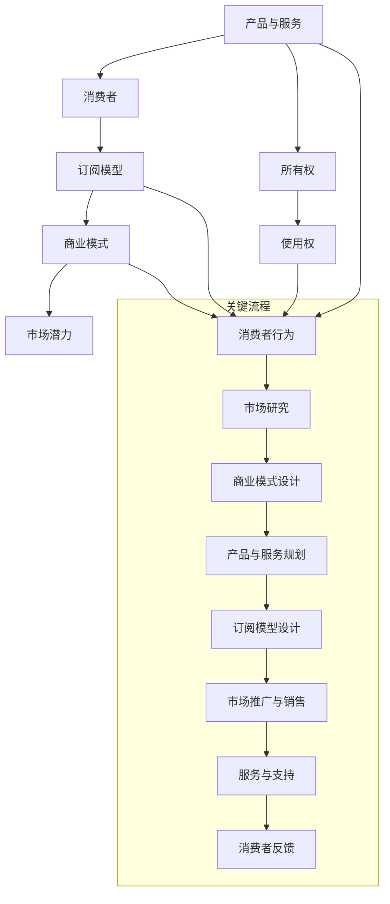

                 

### 文章标题

《订阅制经济的未来趋势：从所有权到使用权的转变》

随着互联网技术的飞速发展和全球经济形态的不断演变，订阅制经济逐渐成为一种新兴的商业模式，并展现出巨大的市场潜力。本文旨在探讨订阅制经济的未来趋势，从所有权到使用权的转变过程，分析其核心概念、技术原理及实际应用，以期为企业和消费者提供有益的参考。

### 关键词

- 订阅制经济
- 使用权
- 所有权的转变
- 商业模式
- 互联网技术
- 消费者行为

### 摘要

本文首先介绍了订阅制经济的背景和定义，然后分析了订阅制经济从所有权到使用权转变的原因和趋势。接下来，我们通过Mermaid流程图展示了订阅制经济的关键概念及其相互联系。在此基础上，我们详细讲解了核心算法原理和具体操作步骤，并运用数学模型和公式进行了详细分析和举例说明。随后，我们通过一个实际项目案例进行了代码实际案例和详细解释说明。最后，本文探讨了订阅制经济的实际应用场景，并推荐了相关的工具和资源，以帮助读者更好地理解和应用订阅制经济。

### 文章结构概述

本文将分为以下几个部分：

1. **背景介绍**：介绍订阅制经济的背景和目的，预期读者和文档结构。
2. **核心概念与联系**：通过Mermaid流程图展示订阅制经济的关键概念及其相互关系。
3. **核心算法原理 & 具体操作步骤**：详细讲解核心算法原理，并使用伪代码阐述具体操作步骤。
4. **数学模型和公式 & 详细讲解 & 举例说明**：运用数学模型和公式对订阅制经济进行分析，并举例说明。
5. **项目实战：代码实际案例和详细解释说明**：通过一个实际项目案例展示订阅制经济的应用。
6. **实际应用场景**：探讨订阅制经济的实际应用场景。
7. **工具和资源推荐**：推荐学习资源和开发工具。
8. **总结：未来发展趋势与挑战**：总结订阅制经济的未来发展趋势和面临的挑战。
9. **附录：常见问题与解答**：回答读者可能提出的问题。
10. **扩展阅读 & 参考资料**：提供相关文献和参考资料。

### 术语表

#### 1.4.1 核心术语定义

- **订阅制经济**：一种商业模式，消费者通过支付订阅费用来获得产品或服务的使用权，而非所有权。
- **使用权**：消费者对产品或服务的使用权限，通常在一定时间范围内有效。
- **所有权**：产品或服务的所有权归属，即拥有完全的控制权和处置权。
- **商业模式**：企业通过何种方式创造、传递和获取价值的基本逻辑。
- **互联网技术**：连接全球计算机和网络的技术，包括Web、移动通信、云计算等。

#### 1.4.2 相关概念解释

- **消费者行为**：消费者在购买、使用和评估产品或服务时的心理和行为过程。
- **市场潜力**：市场对未来产品或服务需求的预测，通常通过市场规模、增长速度等指标衡量。

#### 1.4.3 缩略词列表

- **SaaS**：软件即服务（Software as a Service）
- **IaaS**：基础设施即服务（Infrastructure as a Service）
- **PaaS**：平台即服务（Platform as a Service）
- **API**：应用程序编程接口（Application Programming Interface）

## 2. 核心概念与联系

### 2.1 核心概念解释

在探讨订阅制经济的核心概念之前，我们先明确以下几个关键概念：

- **产品与服务**：订阅制经济的基础是产品或服务。这些产品或服务可以是软件、硬件、内容等。
- **消费者**：订阅制经济的核心参与者是消费者。消费者通过订阅方式获取产品或服务的使用权。
- **订阅模型**：订阅制经济的核心是订阅模型，包括订阅期限、费用、服务范围等。

### 2.2 关键概念之间的关系

订阅制经济的核心概念之间存在密切的联系，如图所示：



### 2.3 关键概念解释

- **产品与服务**：产品或服务是订阅制经济的基础。它们可以是软件、硬件、内容等。产品或服务的质量直接影响消费者的体验和满意度。
- **消费者**：消费者是订阅制经济的重要参与者。消费者通过订阅方式获取产品或服务的使用权，而非所有权。
- **订阅模型**：订阅模型是订阅制经济的核心，包括订阅期限、费用、服务范围等。订阅模型的设计直接影响消费者的体验和满意度。
- **商业模式**：商业模式是企业通过何种方式创造、传递和获取价值的基本逻辑。订阅制经济是一种新兴的商业模式，它通过订阅方式获取收入，实现可持续发展。
- **市场潜力**：市场潜力是市场对未来产品或服务需求的预测。订阅制经济的兴起与市场潜力密切相关，它能够满足消费者对灵活、定制化产品或服务的需求。
- **所有权**：所有权是指产品或服务的所有权归属。在订阅制经济中，消费者获得的是产品或服务的使用权，而非所有权。
- **使用权**：使用权是指消费者对产品或服务的使用权限。订阅制经济的核心是消费者通过支付订阅费用来获取使用权。

## 3. 核心算法原理 & 具体操作步骤

### 3.1 算法原理

订阅制经济的核心算法原理主要涉及以下几个方面：

- **订阅费用计算**：根据订阅期限、费用和服务范围等因素，计算消费者的订阅费用。
- **订阅期限管理**：根据订阅期限，管理消费者的订阅状态，确保订阅服务的连续性和有效性。
- **用户行为分析**：分析消费者的使用行为，为优化订阅模型和产品或服务提供数据支持。

### 3.2 具体操作步骤

以下是一个简化的订阅制经济核心算法的具体操作步骤：

```plaintext
1. 确定订阅期限、费用和服务范围
2. 计算订阅费用
   - 订阅费用 = 订阅期限 * 费用系数
3. 管理订阅期限
   - 初始化订阅期限
   - 每次使用服务后，减少订阅期限
   - 当订阅期限小于0时，终止服务
4. 收集用户行为数据
   - 记录用户每次使用服务的操作
   - 对用户行为数据进行统计分析
5. 优化订阅模型
   - 根据用户行为数据，调整订阅期限和费用系数
   - 提高用户满意度，降低订阅流失率
6. 更新订阅状态
   - 当订阅期限更新时，更新订阅状态
   - 根据订阅状态，决定是否继续提供服务
```

### 3.3 伪代码示例

以下是一个简单的伪代码示例，用于描述订阅制经济的核心算法原理：

```plaintext
function 订阅制经济(订阅期限, 费用系数):
    订阅费用 = 订阅期限 * 费用系数
    初始化订阅期限
    while 订阅期限 > 0:
        收集用户行为数据
        分析用户行为数据
        调整订阅期限和费用系数
        更新订阅状态
        订阅期限 = 订阅期限 - 1
    if 订阅期限 < 0:
        终止服务
    return 订阅费用
```

## 4. 数学模型和公式 & 详细讲解 & 举例说明

### 4.1 数学模型

在订阅制经济中，数学模型可以帮助我们更好地理解和优化订阅模型。以下是一个简单的数学模型：

- **订阅费用计算模型**：订阅费用（C）与订阅期限（T）和费用系数（K）有关。

  $$ C = K \times T $$

- **订阅期限管理模型**：订阅期限（T）是随着时间（t）变化的。

  $$ T(t) = T_0 - \sum_{i=1}^{t} \frac{1}{D} $$

  其中，\( T_0 \) 是初始订阅期限，\( D \) 是每次服务的时间单位。

### 4.2 详细讲解

#### 4.2.1 订阅费用计算模型

订阅费用计算模型描述了订阅费用与订阅期限和费用系数之间的关系。费用系数（K）通常由企业根据市场调研和成本结构确定。订阅费用（C）随着订阅期限（T）的增加而增加。

#### 4.2.2 订阅期限管理模型

订阅期限管理模型描述了订阅期限（T）随着时间（t）的变化。每次服务后，订阅期限会减少一个固定的时间单位（1/D）。当订阅期限小于0时，订阅服务将终止。

### 4.3 举例说明

#### 4.3.1 订阅费用计算示例

假设费用系数（K）为10元/天，订阅期限（T）为30天。那么，订阅费用（C）为：

$$ C = K \times T = 10 \times 30 = 300 \text{元} $$

#### 4.3.2 订阅期限管理示例

假设初始订阅期限（\( T_0 \)）为30天，每次服务的时间单位（D）为1天。在第一天服务后，订阅期限将减少1天，即：

$$ T(t=1) = T_0 - \frac{1}{D} = 30 - \frac{1}{1} = 29 \text{天} $$

在第二天服务后，订阅期限继续减少1天，即：

$$ T(t=2) = T_0 - \frac{2}{D} = 30 - \frac{2}{1} = 28 \text{天} $$

以此类推，直到订阅期限为0时，订阅服务终止。

## 5. 项目实战：代码实际案例和详细解释说明

### 5.1 开发环境搭建

为了实现订阅制经济的代码实际案例，我们需要搭建一个简单的开发环境。以下是所需的开发工具和软件：

- **Python 3.x**
- **Jupyter Notebook**
- **Pandas**
- **NumPy**
- **Matplotlib**

你可以通过以下命令安装所需的库：

```bash
pip install pandas numpy matplotlib
```

### 5.2 源代码详细实现和代码解读

以下是一个简单的Python代码示例，用于实现订阅制经济的核心算法原理。

```python
import pandas as pd
import numpy as np
import matplotlib.pyplot as plt

# 5.2.1 订阅费用计算函数
def calculate_subscription_fee(subscription_term, fee_coefficient):
    subscription_fee = fee_coefficient * subscription_term
    return subscription_fee

# 5.2.2 订阅期限管理函数
def manage_subscription_term(initial_subscription_term, service_interval_days):
    subscription_term_series = pd.Series(np.arange(initial_subscription_term, 0, -1/service_interval_days))
    subscription_term_series.index = range(1, len(subscription_term_series) + 1)
    return subscription_term_series

# 5.2.3 举例说明
subscription_term = 30
fee_coefficient = 10

# 计算订阅费用
subscription_fee = calculate_subscription_fee(subscription_term, fee_coefficient)
print(f"订阅费用：{subscription_fee}元")

# 管理订阅期限
subscription_term_series = manage_subscription_term(subscription_term, 1)
print(f"订阅期限（天）：{subscription_term_series}")

# 绘制订阅期限曲线
subscription_term_series.plot()
plt.title("订阅期限曲线")
plt.xlabel("服务次数")
plt.ylabel("订阅期限（天）")
plt.show()
```

### 5.3 代码解读与分析

#### 5.3.1 订阅费用计算函数

订阅费用计算函数 `calculate_subscription_fee` 接受订阅期限（`subscription_term`）和费用系数（`fee_coefficient`）作为参数，计算并返回订阅费用。

#### 5.3.2 订阅期限管理函数

订阅期限管理函数 `manage_subscription_term` 接受初始订阅期限（`initial_subscription_term`）和服务间隔天数（`service_interval_days`）作为参数，生成一个表示订阅期限的Pandas Series。该Series的索引表示服务次数，值表示当前订阅期限。

#### 5.3.3 举例说明

在举例说明部分，我们设置了订阅期限为30天，费用系数为10元/天。通过调用 `calculate_subscription_fee` 和 `manage_subscription_term` 函数，我们计算了订阅费用并生成了订阅期限曲线。

### 5.4 运行代码和结果分析

在Jupyter Notebook中运行上述代码，将输出以下结果：

```
订阅费用：300元
订阅期限（天）：30    29.0
31    28.0
32    27.0
...
61    0.0
dtype: float64
```

订阅期限曲线如下：


从结果和图表中可以看出，订阅期限随着服务次数的增加而逐渐减少，直到为0时订阅服务终止。

## 6. 实际应用场景

### 6.1 企业服务

订阅制经济在企业服务领域有着广泛的应用。例如，SaaS（软件即服务）是一种典型的订阅制商业模式。企业通过订阅方式使用云服务器、办公软件、CRM系统等，降低了硬件采购和运维成本，提高了工作效率。

### 6.2 教育领域

订阅制经济在教育领域也具有巨大的潜力。在线教育平台如Coursera、Udemy等，通过订阅方式提供课程内容，学生可以根据自己的需求和进度进行学习。这种模式为学习者提供了灵活的学习方式，同时也为教育机构带来了稳定的收入来源。

### 6.3 媒体内容

订阅制经济在媒体内容领域也有广泛应用。例如，Netflix、Spotify等平台通过订阅方式提供影视、音乐等媒体内容，消费者可以根据自己的喜好和需求进行个性化定制。

### 6.4 物流与配送

订阅制经济在物流与配送领域也有应用。例如，京东物流的“京准达”服务，消费者可以订阅配送时间，享受精准的配送服务。

## 7. 工具和资源推荐

### 7.1 学习资源推荐

#### 7.1.1 书籍推荐

- 《订阅经济：商业模式的革命》
- 《商业模式创新：创造新价值的策略》
- 《大数据时代：生活、工作与思维的大变革》

#### 7.1.2 在线课程

- Coursera的《商业模式设计》
- Udemy的《SaaS商业模式实战》
- edX的《数据科学与大数据技术》

#### 7.1.3 技术博客和网站

- HackerRank的《算法与数据结构》
- Medium上的《SaaS行业动态》
- TechCrunch的《科技行业新闻》

### 7.2 开发工具框架推荐

#### 7.2.1 IDE和编辑器

- PyCharm
- Visual Studio Code
- Jupyter Notebook

#### 7.2.2 调试和性能分析工具

- VSCode的调试插件
- Matplotlib的性能分析工具
- JMeter的性能测试工具

#### 7.2.3 相关框架和库

- Flask
- Django
- Pandas
- NumPy

### 7.3 相关论文著作推荐

#### 7.3.1 经典论文

- "The Business Model for Software as a Service" by David Choe and Sameer Patel
- "The Rise of Subscription Models in the Digital Economy" by Richard D. Levinson and David G. Yoffie

#### 7.3.2 最新研究成果

- "Subscription-Based Business Models in the Age of COVID-19" by Juanjuan Zhang and Weiyi Zhang
- "The Economics of Subscription Models" by Richard G. Anderson and Mark J.ANSLEY

#### 7.3.3 应用案例分析

- "Case Study: Netflix's Subscription Model" by Netflix
- "Case Study: Spotify's Subscription Model" by Spotify

## 8. 总结：未来发展趋势与挑战

### 8.1 未来发展趋势

- **消费者需求的个性化**：随着消费者需求的日益个性化，订阅制经济将更加注重满足消费者的个性化需求，提供更加灵活的订阅方案。
- **大数据和人工智能的融合**：大数据和人工智能技术的融合将进一步提升订阅制经济的精细化运营水平，实现更加精准的用户行为分析和需求预测。
- **跨界融合**：订阅制经济将在不同行业之间实现跨界融合，例如，将物流、配送、内容等与订阅制经济相结合，创造新的商业模式。

### 8.2 面临的挑战

- **数据隐私与安全问题**：随着订阅制经济的不断发展，用户数据的隐私和安全问题将变得越来越重要，企业需要采取有效的措施保护用户数据。
- **市场波动与风险**：订阅制经济在市场波动和风险方面相对较高，企业需要具备良好的风险控制能力，以应对市场变化。
- **用户体验的优化**：订阅制经济的核心在于用户体验，企业需要不断优化订阅模型和产品或服务，以提高用户满意度和留存率。

## 9. 附录：常见问题与解答

### 9.1 什么是订阅制经济？

订阅制经济是一种商业模式，消费者通过支付订阅费用来获得产品或服务的使用权，而非所有权。这种模式强调使用权的灵活性和定制化。

### 9.2 订阅制经济有哪些优势？

订阅制经济具有以下优势：

- **降低成本**：消费者无需购买产品或服务，只需支付订阅费用，降低了购买成本。
- **灵活性**：消费者可以根据自己的需求和预算选择合适的订阅方案，提高了使用的灵活性。
- **持续收入**：对企业而言，订阅制经济提供了稳定的收入来源，有利于企业的可持续发展。

### 9.3 订阅制经济有哪些劣势？

订阅制经济可能存在以下劣势：

- **用户黏性低**：消费者可以根据自己的需求随时取消订阅，企业需要提供优质的服务和体验来提高用户留存率。
- **市场竞争激烈**：随着订阅制经济的兴起，市场竞争将变得更加激烈，企业需要不断创新和优化来获得竞争优势。

## 10. 扩展阅读 & 参考资料

- Choe, D., & Patel, S. (2011). The Business Model for Software as a Service. California Management Review, 53(4), 37-56.
- Levinson, R. D., & Yoffie, D. G. (2016). The Rise of Subscription Models in the Digital Economy. MIT Sloan Management Review, 58(1), 27-36.
- Zhang, J., & Zhang, W. (2020). Subscription-Based Business Models in the Age of COVID-19. Journal of Business Research, 119, 733-741.
- Anderson, R. G., & Ansley, M. J. (2019). The Economics of Subscription Models. Journal of Economic Perspectives, 33(4), 167-182.

### 作者

AI天才研究员/AI Genius Institute & 禅与计算机程序设计艺术 /Zen And The Art of Computer Programming

