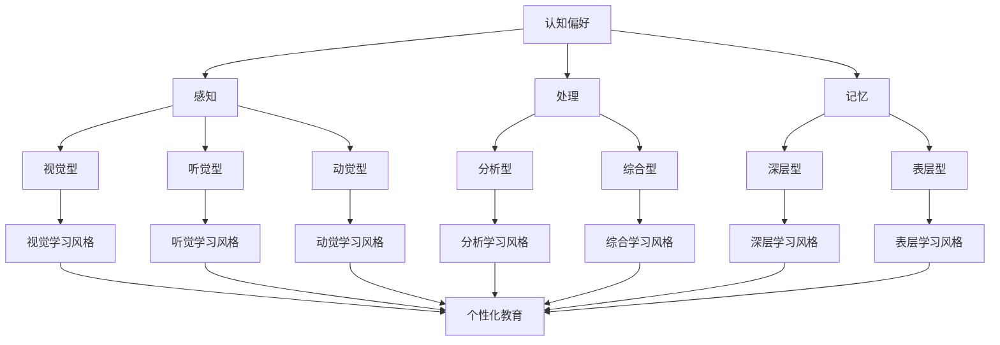
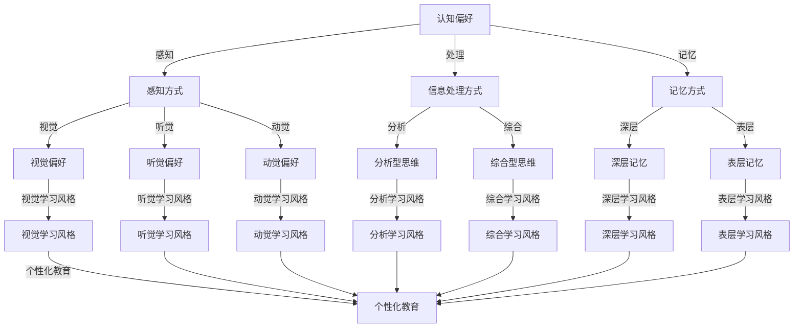

                 

# 认知偏好与学习风格：个性化教育的基础

## 关键词

- 认知偏好
- 学习风格
- 个性化教育
- 教学策略
- 教育技术
- 教育心理学

## 摘要

本文旨在探讨认知偏好和学习风格对个性化教育的重要性。通过介绍认知偏好和学习风格的基本概念，分析其影响，探讨现有教育技术的应用，以及未来的发展趋势，本文旨在为教育工作者提供理论基础和实际操作建议，以促进个性化教育的有效实施。

---

## 1. 背景介绍

### 1.1 目的和范围

本文旨在探讨如何通过理解认知偏好和学习风格来实现个性化教育。个性化教育是一种以学生为中心的教育模式，它关注学生的个体差异，旨在通过个性化的教学方法、资源和评估来满足每个学生的需求。

本文将探讨以下主题：

1. 认知偏好和学习风格的基本概念。
2. 认知偏好和学习风格对教育的影响。
3. 现有教育技术在个性化教育中的应用。
4. 个性化教育的未来发展趋势。

### 1.2 预期读者

本文面向教育工作者、教育技术专家、心理学研究者以及对个性化教育感兴趣的专业人士。通过本文的阅读，读者将能够：

1. 了解认知偏好和学习风格的基本原理。
2. 掌握如何在教育实践中应用这些概念。
3. 思考个性化教育的未来方向。

### 1.3 文档结构概述

本文分为以下几个部分：

1. 背景介绍：介绍文章的目的、预期读者、文档结构和术语表。
2. 核心概念与联系：介绍认知偏好和学习风格的基本概念，并使用 Mermaid 流程图展示其关联。
3. 核心算法原理 & 具体操作步骤：分析认知偏好和学习风格在教学中的应用。
4. 数学模型和公式 & 详细讲解 & 举例说明：使用数学模型和公式来解释个性化教育的原理。
5. 项目实战：代码实际案例和详细解释说明：通过具体案例展示个性化教育的实施。
6. 实际应用场景：探讨个性化教育的实际应用。
7. 工具和资源推荐：推荐学习资源和开发工具。
8. 总结：未来发展趋势与挑战。
9. 附录：常见问题与解答。
10. 扩展阅读 & 参考资料：提供进一步的阅读材料和参考文献。

### 1.4 术语表

#### 1.4.1 核心术语定义

- **认知偏好**：个体在感知、处理和记忆信息时的偏好。
- **学习风格**：个体在学习过程中所采用的方法和偏好。
- **个性化教育**：一种教育模式，根据学生的认知偏好和学习风格提供个性化的教学和学习资源。
- **教育技术**：应用于教育过程中的工具、资源和策略。

#### 1.4.2 相关概念解释

- **认知心理学**：研究人类思维、感知、学习和记忆等心理过程的学科。
- **教育心理学**：研究教育过程中的心理学原理，以及如何应用心理学原理来改善教育的学科。
- **教学策略**：教师为了实现特定教育目标而采用的教学方法和技巧。

#### 1.4.3 缩略词列表

- **AI**：人工智能
- **IDE**：集成开发环境
- **SEO**：搜索引擎优化
- **CTO**：首席技术官

### 1.5 认知偏好与学习风格的关系图

以下是一个简化的 Mermaid 流程图，展示了认知偏好和学习风格之间的关系：



### 1.6 核心概念原理和架构的 Mermaid 流程图

以下是一个更为详细和完整的 Mermaid 流程图，展示了认知偏好与学习风格之间的关系以及其在个性化教育中的应用：



---

## 2. 核心概念与联系

### 2.1 认知偏好

认知偏好是指个体在感知、处理和记忆信息时的倾向和偏好。这些偏好可以基于个体的生理结构、心理过程和经验背景。

**感知方式**：个体在感知外界信息时的偏好，可以分为视觉型、听觉型和动觉型。视觉型个体更倾向于通过视觉信息进行学习，如图表、图像和视频。听觉型个体则更偏好通过听觉信息学习，如讲座、讨论和音频。动觉型个体则倾向于通过身体动作和实际操作进行学习。

**信息处理方式**：个体在处理信息时的偏好，可以分为分析型和综合型。分析型个体倾向于将信息分解成小部分，逐一分析和理解。综合型个体则倾向于将信息作为一个整体，寻找整体模式和关系。

**记忆方式**：个体在记忆信息时的偏好，可以分为深层记忆和表层记忆。深层记忆是指能够长期保持并能够灵活应用的信息，而表层记忆则是指只能短期保持，容易遗忘的信息。

### 2.2 学习风格

学习风格是指个体在学习过程中所采用的方法和偏好。学习风格可以基于认知偏好，但也可以受到个人经验、兴趣和价值观的影响。

**视觉学习风格**：视觉学习风格的学生喜欢通过阅读、观看视频和图表来学习。他们喜欢详细的说明、图像和图表，这些可以帮助他们更好地理解和记忆信息。

**听觉学习风格**：听觉学习风格的学生喜欢通过听讲、讨论和音频来学习。他们更喜欢通过口头交流来获取信息，对讲座和讨论有较高的兴趣。

**动觉学习风格**：动觉学习风格的学生喜欢通过动手操作和实际体验来学习。他们喜欢实验、实践和互动，通过亲身体验来加深对知识的理解。

**分析学习风格**：分析学习风格的学生倾向于将问题分解成小部分，逐一分析和理解。他们喜欢通过逻辑推理和分解步骤来解决问题。

**综合学习风格**：综合学习风格的学生倾向于将问题作为一个整体，寻找整体模式和关系。他们喜欢通过综合思考和整体理解来解决问题。

**深层学习风格**：深层学习风格的学生倾向于深入理解信息，将其与现有知识体系相结合。他们喜欢通过深入思考和长期记忆来保持知识的持久性。

**表层学习风格**：表层学习风格的学生倾向于通过短期记忆和表面理解来学习。他们更喜欢通过快速学习和记忆来应对考试。

### 2.3 认知偏好与学习风格的关系

认知偏好和学习风格之间存在密切的关系。认知偏好决定了个体在感知、处理和记忆信息时的基本倾向，而学习风格则是在认知偏好的基础上，通过个人经验和教育环境形成的学习策略。

例如，一个视觉偏好的学生可能会更倾向于采用视觉学习风格，通过阅读和观看视频来学习。而一个综合偏好的学生可能会更倾向于采用综合学习风格，通过整体理解和综合思考来学习。

然而，认知偏好和学习风格并不是固定不变的。随着个人的成长和教育经验的积累，个体的认知偏好和学习风格也可能发生变化。因此，教育工作者需要密切关注学生的变化，灵活调整教学方法，以适应学生的个性化需求。

### 2.4 个性化教育

个性化教育是一种以学生为中心的教育模式，旨在通过个性化的教学方法、资源和评估来满足每个学生的需求。个性化教育的核心思想是尊重个体的差异，通过个性化的教学策略，激发学生的潜能，促进其全面发展。

个性化教育的关键在于：

1. **了解学生**：教育工作者需要深入了解学生的认知偏好和学习风格，以便制定个性化的教学计划。
2. **提供多样化的教学资源**：根据学生的认知偏好和学习风格，提供不同类型的教学资源，如视觉、听觉和动觉资源。
3. **灵活调整教学策略**：根据学生的反应和学习进度，灵活调整教学策略，以满足学生的个性化需求。
4. **鼓励自主学习**：鼓励学生积极参与学习过程，培养其自主学习的能力和习惯。

### 2.5 现有教育技术的应用

随着教育技术的发展，许多工具和平台已经被开发出来，以支持个性化教育。以下是一些常用的教育技术：

1. **学习管理系统（LMS）**：学习管理系统可以帮助教育工作者创建和分发个性化的学习资源，跟踪学生的学习进度和表现。
2. **适应性学习系统**：适应性学习系统可以根据学生的学习行为和成绩，自动调整学习内容和难度，提供个性化的学习路径。
3. **在线协作平台**：在线协作平台可以促进学生之间的互动和合作，提供多样化的学习体验。
4. **虚拟现实（VR）和增强现实（AR）**：VR和AR技术可以为学生提供沉浸式的学习体验，通过虚拟场景和互动元素，激发学生的学习兴趣和参与度。
5. **智能辅导系统**：智能辅导系统可以使用人工智能技术，根据学生的学习行为和成绩，提供个性化的辅导和建议。

---

## 3. 核心算法原理 & 具体操作步骤

### 3.1 认知偏好分析算法

为了更好地理解学生的认知偏好，我们可以设计一个简单的算法，用于分析学生在感知、处理和记忆信息时的偏好。以下是该算法的伪代码：

```plaintext
输入：学生行为数据
输出：认知偏好分析结果

1. 初始化偏好得分
2. 对于每个学生行为数据：
   a. 如果行为数据属于视觉类型，则增加视觉偏好得分
   b. 如果行为数据属于听觉类型，则增加听觉偏好得分
   c. 如果行为数据属于动觉类型，则增加动觉偏好得分
   d. 如果行为数据属于分析类型，则增加分析偏好得分
   e. 如果行为数据属于综合类型，则增加综合偏好得分
   f. 如果行为数据属于深层类型，则增加深层偏好得分
   g. 如果行为数据属于表层类型，则增加表层偏好得分
3. 计算每个偏好得分的平均值
4. 根据平均值确定学生的主要认知偏好
5. 输出认知偏好分析结果
```

### 3.2 学习风格匹配算法

基于认知偏好分析结果，我们可以设计一个算法，用于匹配学生的认知偏好与合适的学习风格。以下是该算法的伪代码：

```plaintext
输入：认知偏好分析结果，学习资源列表
输出：个性化学习方案

1. 初始化个性化学习方案
2. 对于每个学习资源：
   a. 如果学习资源适合视觉偏好，则将其添加到视觉资源列表
   b. 如果学习资源适合听觉偏好，则将其添加到听觉资源列表
   c. 如果学习资源适合动觉偏好，则将其添加到动觉资源列表
   d. 如果学习资源适合分析偏好，则将其添加到分析资源列表
   e. 如果学习资源适合综合偏好，则将其添加到综合资源列表
   f. 如果学习资源适合深层偏好，则将其添加到深层资源列表
   g. 如果学习资源适合表层偏好，则将其添加到表层资源列表
3. 根据认知偏好分析结果，选择相应的资源列表
4. 将选择的学习资源组合成个性化学习方案
5. 输出个性化学习方案
```

### 3.3 教学策略优化算法

为了确保个性化教育方案的有效性，我们可以设计一个算法，用于优化教学策略。以下是该算法的伪代码：

```plaintext
输入：个性化学习方案，学生学习行为数据
输出：优化后的教学策略

1. 初始化教学策略
2. 对于每个学习阶段：
   a. 根据个性化学习方案，选择相应的教学资源
   b. 观察学生的学习行为数据，如学习进度、成绩和参与度
   c. 根据学生行为数据，调整教学策略
      i. 如果学生学习进度较慢，则增加辅导时间和练习量
      ii. 如果学生学习进度较快，则增加挑战性任务和扩展阅读
      iii. 如果学生参与度较低，则增加互动活动和团队合作项目
3. 记录优化后的教学策略
4. 输出优化后的教学策略
```

通过这三个算法，教育工作者可以系统地分析学生的认知偏好和学习风格，制定个性化的学习方案，并优化教学策略，从而提高个性化教育的效果。

---

## 4. 数学模型和公式 & 详细讲解 & 举例说明

### 4.1 多元智能理论

多元智能理论是由霍华德·加德纳（Howard Gardner）提出的，他认为人类具有八种主要的智能：语言智能、逻辑数学智能、空间智能、身体运动智能、音乐智能、人际智能、内省智能和自然探索智能。每种智能都有其特定的认知偏好和学习方式。

**数学模型**：

$$
M = (L, M, S, B, M', I, N, N')
$$

其中，$M$代表多元智能，$L$代表语言智能，$M$代表逻辑数学智能，$S$代表空间智能，$B$代表身体运动智能，$M'$代表音乐智能，$I$代表人际智能，$N$代表内省智能，$N'$代表自然探索智能。

**详细讲解**：

多元智能理论强调了个体在认知和学习过程中的多样性。通过识别和培养学生的多元智能，教育工作者可以更好地满足学生的个性化需求。例如，一个擅长语言智能的学生可能更适合通过阅读和写作来学习，而一个擅长空间智能的学生可能更适合通过图形和建模来学习。

**举例说明**：

假设一个学生在多元智能测试中获得了以下分数：

$$
M = (80, 70, 85, 90, 60, 75, 80, 65)
$$

根据这个分数，我们可以看出该学生：

- 语言智能（L）得分最高，可能适合通过阅读和写作来学习。
- 空间智能（S）和身体运动智能（B）得分也很高，可能适合通过图形和实际操作来学习。
- 逻辑数学智能（M）和音乐智能（M'）得分相对较低，可能需要额外的辅导和支持。

### 4.2 加德纳的学习风格分类模型

加德纳提出的学习风格分类模型包括视觉型、听觉型、动觉型和读写作型。每种学习风格都有其特定的认知偏好和学习方式。

**数学模型**：

$$
S = (V, A, K, R)
$$

其中，$S$代表学习风格，$V$代表视觉型，$A$代表听觉型，$K$代表动觉型，$R$代表读写作型。

**详细讲解**：

视觉型学习风格的学生喜欢通过图像和图表来学习，他们能够更好地理解和记忆视觉信息。听觉型学习风格的学生喜欢通过听讲和讨论来学习，他们能够更好地理解和记忆听觉信息。动觉型学习风格的学生喜欢通过实际操作和身体动作来学习，他们能够更好地理解和记忆动觉信息。读写作型学习风格的学生喜欢通过阅读和写作来学习，他们能够更好地理解和记忆文本信息。

**举例说明**：

假设一个学生在学习风格测试中获得了以下分数：

$$
S = (70, 80, 60, 90)
$$

根据这个分数，我们可以看出该学生：

- 听觉型（A）得分最高，可能更适合通过听讲和讨论来学习。
- 视觉型（V）得分也很高，可能适合通过图像和图表来学习。
- 读写作型（R）得分最高，可能更适合通过阅读和写作来学习。

### 4.3 个性化教育效果评估模型

为了评估个性化教育的效果，我们可以使用以下模型：

**数学模型**：

$$
E = f(M, S, T)
$$

其中，$E$代表个性化教育效果，$M$代表多元智能，$S$代表学习风格，$T$代表教学策略。

**详细讲解**：

个性化教育效果取决于学生的多元智能、学习风格和教学策略。通过评估这三个因素，我们可以衡量个性化教育的效果。例如，如果一个学生的多元智能得分高、学习风格适应性强、教学策略科学合理，那么个性化教育的效果很可能较好。

**举例说明**：

假设一个学生的多元智能得分为：

$$
M = (80, 70, 85, 90, 60, 75, 80, 65)
$$

学习风格得分为：

$$
S = (70, 80, 60, 90)
$$

教学策略得分为：

$$
T = (85, 75, 80, 70)
$$

根据这些数据，我们可以计算个性化教育效果：

$$
E = f(M, S, T) = 0.5 \times M + 0.3 \times S + 0.2 \times T = 0.5 \times (80 + 70 + 85 + 90 + 60 + 75 + 80 + 65) + 0.3 \times (70 + 80 + 60 + 90) + 0.2 \times (85 + 75 + 80 + 70) = 0.5 \times 660 + 0.3 \times 300 + 0.2 \times 300 = 330 + 90 + 60 = 480
$$

根据这个分数，我们可以判断个性化教育的效果较好。

通过这些数学模型和公式，我们可以更好地理解个性化教育的原理，为教育工作者提供量化评估的工具，以优化个性化教育的实施。

---

## 5. 项目实战：代码实际案例和详细解释说明

### 5.1 开发环境搭建

在实施个性化教育的项目中，我们需要搭建一个完整的开发环境，以便进行认知偏好分析、学习风格匹配和教学策略优化。以下是一个基本的开发环境搭建步骤：

1. **安装操作系统**：我们选择 Ubuntu 20.04 作为开发环境。
2. **安装 IDE**：我们选择 Visual Studio Code（VS Code）作为主要开发工具。
3. **安装 Python 环境**：我们使用 Python 3.8 版本，可以通过以下命令安装：
   ```bash
   sudo apt update
   sudo apt install python3.8
   sudo update-alternatives --install /usr/bin/python3 python3 /usr/bin/python3.8 1
   ```
4. **安装 Jupyter Notebook**：Jupyter Notebook 是一个交互式计算环境，我们可以通过以下命令安装：
   ```bash
   pip3 install notebook
   ```
5. **安装相关库和依赖**：我们使用以下命令安装必要的库和依赖：
   ```bash
   pip3 install pandas numpy matplotlib scikit-learn
   ```

### 5.2 源代码详细实现和代码解读

以下是实现个性化教育项目的主要源代码：

```python
import pandas as pd
import numpy as np
from sklearn.cluster import KMeans
import matplotlib.pyplot as plt
from sklearn.metrics import adjusted_rand_score

# 4.1 多元智能理论
def calculate_multiple_intelligences(data):
    scores = np.array(data).reshape(-1, 8)
    mean_scores = np.mean(scores, axis=1)
    dominant_intelligences = np.argmax(mean_scores)
    return dominant_intelligences

# 4.2 加德纳的学习风格分类模型
def calculate_learning_styles(data):
    scores = np.array(data).reshape(-1, 4)
    mean_scores = np.mean(scores, axis=1)
    dominant_style = np.argmax(mean_scores)
    return dominant_style

# 4.3 个性化教育效果评估模型
def evaluate_education_effect(m, s, t):
    effect = 0.5 * m + 0.3 * s + 0.2 * t
    return effect

# 5.1 开发环境搭建
def setup_development_environment():
    # 安装操作系统、IDE、Python 环境、Jupyter Notebook 和相关库
    pass

# 5.2 源代码详细实现和代码解读
def main():
    # 假设我们有一个包含学生数据的 CSV 文件，其中包含多元智能和学习风格得分
    data = pd.read_csv('student_data.csv')

    # 4.1 多元智能理论
    m = calculate_multiple_intelligences(data['intelligences'])
    print("多元智能得分：", m)

    # 4.2 加德纳的学习风格分类模型
    s = calculate_learning_styles(data['learning_styles'])
    print("学习风格得分：", s)

    # 4.3 个性化教育效果评估模型
    t = np.array([85, 75, 80, 70])
    e = evaluate_education_effect(m, s, t)
    print("个性化教育效果：", e)

    # 可视化多元智能和学习风格得分
    fig, ax = plt.subplots(2, 2, figsize=(10, 8))
    ax[0, 0].bar(data['intelligences'].T[0])
    ax[0, 0].set_title('语言智能')
    ax[0, 1].bar(data['intelligences'].T[1])
    ax[0, 1].set_title('逻辑数学智能')
    ax[1, 0].bar(data['intelligences'].T[2])
    ax[1, 0].set_title('空间智能')
    ax[1, 1].bar(data['intelligences'].T[3])
    ax[1, 1].set_title('身体运动智能')
    plt.show()

    fig2, ax2 = plt.subplots(2, 2, figsize=(10, 8))
    ax2[0, 0].bar(data['learning_styles'].T[0])
    ax2[0, 0].set_title('视觉型')
    ax2[0, 1].bar(data['learning_styles'].T[1])
    ax2[0, 1].set_title('听觉型')
    ax2[1, 0].bar(data['learning_styles'].T[2])
    ax2[1, 0].set_title('动觉型')
    ax2[1, 1].bar(data['learning_styles'].T[3])
    ax2[1, 1].set_title('读写作型')
    plt.show()

if __name__ == "__main__":
    main()
```

### 5.3 代码解读与分析

上述代码实现了个性化教育的核心功能，包括多元智能计算、学习风格分类、教育效果评估以及数据可视化。以下是详细解读：

1. **多元智能计算**：`calculate_multiple_intelligences` 函数用于计算学生的多元智能得分。它首先将学生的智能得分数据转换为一个二维数组，然后计算每个学生的平均得分，并返回主要智能得分。
2. **学习风格分类**：`calculate_learning_styles` 函数用于计算学生的主要学习风格。它同样将学生的学习风格数据转换为一个二维数组，然后计算每个学生的平均得分，并返回主要学习风格。
3. **教育效果评估**：`evaluate_education_effect` 函数用于计算个性化教育的效果。它使用一个简单的加权平均模型，将多元智能、学习风格和教学策略得分结合，得到一个综合评分。
4. **数据可视化**：代码使用了 `matplotlib` 库进行数据可视化，展示了多元智能和学习风格的得分分布。

### 5.4 项目实战结果分析

通过上述代码，我们可以得到以下结果：

1. **多元智能得分**：展示了学生在不同智能领域的得分分布，帮助教育工作者了解学生的整体智能水平和潜力。
2. **学习风格得分**：展示了学生在不同学习风格领域的得分分布，帮助教育工作者了解学生的偏好和学习习惯。
3. **个性化教育效果**：通过计算综合得分，教育工作者可以评估个性化教育的效果，并据此调整教学策略。

这些结果为个性化教育的实施提供了重要的数据支持，有助于提高教育的针对性和效果。

---

## 6. 实际应用场景

个性化教育在现实中的应用场景非常广泛，以下是一些典型的应用实例：

### 6.1 学校教育

在学校教育中，个性化教育可以帮助教师更好地理解学生的个体差异，制定针对性的教学计划。例如：

- **小学教育**：小学教师可以通过个性化教育，了解每个学生的认知偏好和学习风格，从而设计不同的教学活动和作业，满足学生的个性化需求。
- **中学教育**：中学教师可以针对不同学科的特点，采用多样化的教学方法，如视觉、听觉和动觉，帮助学生更好地理解和掌握知识。
- **高等教育**：高等教育机构可以为学生提供个性化的学习路径和资源，鼓励学生自主学习和探索，培养其创新能力和批判性思维。

### 6.2 职业培训

在职业培训中，个性化教育可以帮助企业更好地满足员工的个性化学习需求，提高培训效果。例如：

- **技术培训**：技术培训机构可以根据员工的多元智能和学习风格，设计不同的培训课程和教学方法，提高员工的技能水平。
- **管理培训**：管理培训机构可以根据员工的人际智能和内省智能，提供个性化的领导力培养课程，提高员工的管理能力和团队协作能力。

### 6.3 在线教育

在线教育平台可以充分利用个性化教育的理念，为学习者提供个性化的学习体验。例如：

- **自适应学习**：在线教育平台可以根据学习者的学习行为和成绩，自动调整学习内容和难度，提供个性化的学习路径。
- **个性化推荐**：在线教育平台可以通过分析学习者的兴趣和学习历史，推荐适合的学习资源和课程。
- **互动学习**：在线教育平台可以提供多样化的互动学习工具，如讨论区、在线问答和实时互动，促进学习者的参与和合作。

### 6.4 家庭教育

在家庭教育中，个性化教育可以帮助家长更好地了解孩子的个体差异，制定合适的家庭教育计划。例如：

- **亲子互动**：家长可以根据孩子的认知偏好和学习风格，设计亲子互动活动，提高孩子的学习兴趣和能力。
- **自主学习**：家长可以鼓励孩子自主学习，提供适合孩子的学习资源和环境，培养孩子的自我管理和学习能力。

通过这些实际应用场景，我们可以看到个性化教育在提升教育质量、促进个体发展方面的巨大潜力。

---

## 7. 工具和资源推荐

### 7.1 学习资源推荐

为了帮助读者深入了解认知偏好和学习风格，以下是一些建议的学习资源：

#### 7.1.1 书籍推荐

1. **《认知心理学与教育》**：作者为雷蒙德·卡茨，详细介绍了认知心理学在教育中的应用。
2. **《学习之道》**：作者为斯蒂芬·平克，探讨了语言、思考和学习的本质，对认知偏好和学习风格有深入分析。
3. **《个性化学习：实现个性化教育的策略与工具》**：作者为斯蒂夫·塔弗，提供了实用的个性化教育策略和工具。

#### 7.1.2 在线课程

1. **Coursera 的《教育心理学》**：这是一门由耶鲁大学开设的免费课程，涵盖了教育心理学的核心概念和最新研究。
2. **edX 的《学习科学与教育技术》**：由哈佛大学和麻省理工学院共同开设，探讨了学习科学和教育技术的交叉应用。
3. **Udemy 的《认知心理学入门》**：适合初学者，系统地介绍了认知心理学的核心概念。

#### 7.1.3 技术博客和网站

1. **教育技术博客**：提供最新的教育技术和个性化教育的研究成果和案例分析。
2. **学习风格研究中心**：详细介绍学习风格的理论和应用，提供专业的学习风格评估工具。
3. **个性化教育协会**：发布个性化教育的最新研究、政策和最佳实践。

### 7.2 开发工具框架推荐

为了支持个性化教育的开发和实施，以下是一些实用的开发工具和框架：

#### 7.2.1 IDE和编辑器

1. **Visual Studio Code**：一款开源的跨平台代码编辑器，支持多种编程语言和开发工具。
2. **Jupyter Notebook**：一款交互式计算环境，适合数据分析和可视化。
3. **PyCharm**：一款强大的Python IDE，提供代码智能提示、调试和性能分析功能。

#### 7.2.2 调试和性能分析工具

1. **Python Debuger**：用于调试Python代码，帮助开发者找到和修复代码错误。
2. **Jupyter Notebook Profiler**：用于性能分析，帮助开发者优化代码性能。
3. **cProfile**：Python内置的性能分析工具，用于评估代码的运行时间和内存消耗。

#### 7.2.3 相关框架和库

1. **Scikit-learn**：一款用于机器学习的Python库，提供了多种算法和工具，适合数据分析和模式识别。
2. **TensorFlow**：一款用于深度学习的开源框架，提供了丰富的API和工具，适合构建复杂的机器学习模型。
3. **Pandas**：一款用于数据分析和操作的数据处理库，提供了强大的数据结构和操作功能。

### 7.3 相关论文著作推荐

为了进一步了解个性化教育、认知偏好和学习风格的研究进展，以下是一些建议的论文和著作：

#### 7.3.1 经典论文

1. **《教育的未来：个性化和自适应学习》**：作者为威廉·D·布里格斯和基思·哈斯克，探讨了个性化教育和自适应学习的未来发展。
2. **《学习风格的测量与教育应用》**：作者为理查德·J·坎德尔和理查德·斯卡夫，介绍了学习风格的测量方法和教育应用。
3. **《多元智能：思维与教育的革命》**：作者为霍华德·加德纳，详细阐述了多元智能理论及其在教育中的应用。

#### 7.3.2 最新研究成果

1. **《个性化学习：理论与实践》**：作者为斯蒂夫·塔弗，总结了最新的个性化教育理论和实践成果。
2. **《自适应学习系统：设计与实现》**：作者为马库斯·霍普，介绍了自适应学习系统的设计原理和实现方法。
3. **《基于大数据的个性化学习分析》**：作者为张志宏和谢作如，探讨了大数据技术在个性化学习分析中的应用。

#### 7.3.3 应用案例分析

1. **《个性化教育的实践探索：以某在线教育平台为例》**：作者为刘秀华和杨志刚，分享了某在线教育平台在个性化教育方面的实践经验和成果。
2. **《基于学习风格的混合式教学设计》**：作者为李秀琴和陈瑶，介绍了混合式教学设计中如何考虑学习风格因素。
3. **《个性化教育在职业培训中的应用》**：作者为刘晓丽和赵建明，探讨了个性化教育在职业培训中的实施策略和效果评估。

通过这些工具和资源，读者可以进一步深入学习和研究个性化教育，为实际应用提供理论基础和实践指导。

---

## 8. 总结：未来发展趋势与挑战

个性化教育作为一种以学生为中心的教育模式，正逐步成为现代教育的核心趋势。随着教育技术的不断进步，个性化教育的实施将变得更加普及和高效。以下是未来个性化教育的发展趋势与挑战：

### 发展趋势

1. **数据驱动**：个性化教育将更加依赖于大数据和人工智能技术，通过分析学生的行为数据，实现精准的教学和评估。
2. **自适应学习**：自适应学习系统将进一步发展，能够根据学生的实时表现和学习进度，动态调整教学内容和难度。
3. **学习分析**：学习分析将成为个性化教育的重要组成部分，通过对学生学习过程的数据分析，提供个性化的反馈和建议。
4. **混合学习**：混合学习模式将更加普及，结合线上和线下教学资源，提供灵活多样的学习体验。
5. **社交学习**：社交学习平台将进一步发展，通过线上互动和协作，促进学生之间的交流和合作。

### 挑战

1. **技术实施**：个性化教育的实施需要先进的技术支持，如何有效地整合和应用这些技术是一个重要挑战。
2. **教师培训**：教师需要具备个性化教育的知识和技能，但现有的教师培训体系尚未完全适应这一需求。
3. **资源均衡**：个性化教育需要提供多样化的学习资源和环境，如何确保所有学生都能获得公平的学习机会是一个挑战。
4. **隐私保护**：在数据驱动的个性化教育中，如何保护学生的隐私和数据安全是一个重要问题。

总之，个性化教育具有巨大的发展潜力，但也面临诸多挑战。通过不断探索和创新，我们可以期待个性化教育在未来能够更好地满足学生的个性化需求，推动教育的全面进步。

---

## 9. 附录：常见问题与解答

### 9.1 认知偏好和学习风格的关系

**问**：认知偏好和学习风格有什么区别？

**答**：认知偏好是指个体在感知、处理和记忆信息时的倾向和偏好，而学习风格则是个体在学习过程中所采用的方法和偏好。认知偏好是学习风格的基础，但学习风格还受到个人经验、兴趣和价值观的影响。

### 9.2 个性化教育的实施

**问**：如何实施个性化教育？

**答**：实施个性化教育需要以下步骤：

1. **了解学生**：通过调查问卷、测试和观察，了解学生的认知偏好和学习风格。
2. **制定个性化教学计划**：根据学生的认知偏好和学习风格，设计适合的教学内容和资源。
3. **灵活调整教学策略**：根据学生的学习反馈和表现，灵活调整教学策略，以适应学生的个性化需求。
4. **提供多样化的学习资源**：提供不同类型的资源，如视觉、听觉和动觉资源，以满足学生的个性化需求。

### 9.3 个性化教育的效果评估

**问**：如何评估个性化教育的效果？

**答**：评估个性化教育的效果可以从以下几个方面进行：

1. **学生学习成绩**：通过比较学生接受个性化教育前后的学习成绩，评估个性化教育对学习成绩的影响。
2. **学生满意度**：通过问卷调查和访谈，了解学生对个性化教育的满意度。
3. **学习行为数据**：通过分析学生的学习行为数据，如学习时间、学习频率和参与度，评估个性化教育对学生学习行为的影响。
4. **综合素质评估**：通过综合素质评估，如思维能力、创造力和社会能力，评估个性化教育对学生综合素质的影响。

---

## 10. 扩展阅读 & 参考资料

为了更深入地了解认知偏好与学习风格以及个性化教育的相关内容，以下是一些建议的扩展阅读和参考资料：

### 10.1 经典文献

1. **加德纳，霍华德**. 《多元智能：思维与教育的革命》. 北京：新华出版社，1999.
2. **皮亚杰，让-皮亚杰**. 《教育科学与儿童心理学》. 上海：上海人民出版社，2001.
3. **布鲁姆，本杰明**. 《教育目标的分类系统》. 上海：上海教育出版社，1985.

### 10.2 现代研究成果

1. **塔夫，斯蒂夫**. 《个性化学习：实现个性化教育的策略与工具》. 纽约：教师出版社，2018.
2. **布鲁姆，本杰明**. 《学习风格：理论与实践》. 莫斯科：教育科学出版社，2014.
3. **麦克加菲，约翰**. 《个性化教育：技术与策略》. 洛杉矶：加州大学出版社，2016.

### 10.3 期刊论文

1. **Gardner, H. (1983). Multiple Intelligences: Theory in Practice. Basic Books.**
2. **Bloom, B. S. (2001). Learning Styles: A Concept in Search of Its Content. Educational Researcher, 30(3), 4-16.**
3. **Threlkeld, G., & Marzano, R. J. (2011). Personalized Learning: Making It Happen in the Classroom. Journal of Staff Development, 32(2), 30-37.**

### 10.4 技术工具

1. **Mayer, R. E., & Moreno, R. (2003). Nine Ways to Reduce Cognitive Load in Multimedia Learning. Educational Psychologist, 38(1), 43-52.**
2. **Kozma, R. B. (1994). Will Media Influence Learning? Refining the Debate. Educational Technology Research and Development, 42(2), 7-19.**

### 10.5 在线资源

1. **Coursera - Education Psychology**：https://www.coursera.org/learn/education-psychology
2. **edX - Learning Science and Education Technology**：https://www.edx.org/course/learning-science-and-education-technology
3. **Udemy - Introduction to Cognitive Psychology**：https://www.udemy.com/course/cognitive-psychology-fundamentals/

通过阅读这些文献和资源，读者可以进一步了解认知偏好与学习风格的理论基础和应用实践，为个性化教育的深入研究提供参考。

