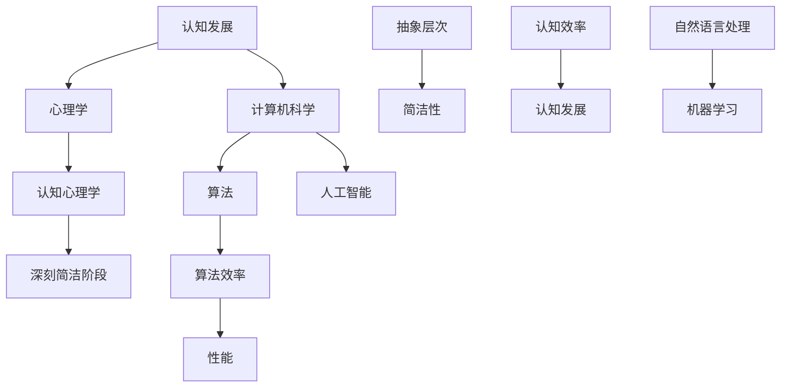

                 

# 认知发展中的深刻简洁阶段

> **关键词**：认知发展、简洁性、抽象层次、算法效率、人工智能

> **摘要**：本文将深入探讨认知发展中的深刻简洁阶段，从心理学和计算机科学的交叉视角，分析简洁性在认知过程中的重要性，以及如何通过简洁的算法和架构提升认知效率。我们将结合实际案例，探讨这一概念在不同领域的应用，并提出未来研究的可能方向。

## 1. 背景介绍

### 1.1 目的和范围

本文旨在探讨认知发展中的深刻简洁阶段，从心理学和计算机科学的交叉视角，分析简洁性在认知过程中的重要性。我们将探讨如何通过简洁的算法和架构提升认知效率，以及这一概念在不同领域的应用。本文将涵盖以下内容：

1. **心理学视角下的认知发展**：分析认知发展的主要阶段和特点，特别是深刻简洁阶段的定义和意义。
2. **计算机科学视角下的简洁性**：探讨简洁性在算法设计中的重要性，以及如何通过简洁的算法提升认知效率。
3. **实际应用案例**：结合实际案例，分析简洁性在不同领域的应用，如自然语言处理、图像识别和机器学习等。
4. **未来发展趋势与挑战**：探讨简洁性在认知发展和人工智能领域的未来发展方向和面临的挑战。

### 1.2 预期读者

本文适用于对认知发展和人工智能感兴趣的读者，包括：

1. 认知心理学家和认知科学家
2. 计算机科学家和软件工程师
3. 对人工智能和认知发展有兴趣的研究生和学者
4. 对认知科学和人工智能领域有深入了解的从业者

### 1.3 文档结构概述

本文分为以下章节：

1. **背景介绍**：介绍本文的目的、范围和预期读者，以及文档结构概述。
2. **核心概念与联系**：介绍认知发展的主要阶段，特别是深刻简洁阶段的定义和意义，以及相关概念和架构的 Mermaid 流程图。
3. **核心算法原理 & 具体操作步骤**：详细阐述简洁算法的原理和操作步骤，包括伪代码展示。
4. **数学模型和公式 & 详细讲解 & 举例说明**：介绍与简洁性相关的数学模型和公式，并进行详细讲解和举例说明。
5. **项目实战：代码实际案例和详细解释说明**：结合实际项目案例，展示简洁算法的应用，并进行详细解释说明。
6. **实际应用场景**：探讨简洁性在不同领域的实际应用。
7. **工具和资源推荐**：推荐与本文主题相关的学习资源和开发工具。
8. **总结：未来发展趋势与挑战**：总结本文的核心观点，探讨未来发展趋势和挑战。
9. **附录：常见问题与解答**：回答读者可能遇到的问题。
10. **扩展阅读 & 参考资料**：提供进一步阅读的参考资料。

### 1.4 术语表

#### 1.4.1 核心术语定义

- 认知发展：个体在感知、注意、记忆、思维等方面的认知能力的变化过程。
- 深刻简洁阶段：认知发展的一个阶段，强调通过简洁的算法和架构提升认知效率。
- 算法：解决问题的步骤和规则，通常用伪代码或程序语言实现。
- 抽象层次：对问题或系统的不同层面进行抽象和处理的能力。
- 简洁性：算法和架构的简洁性，通过减少冗余和复杂性提高效率和性能。

#### 1.4.2 相关概念解释

- **认知心理学**：研究人类思维、感知、记忆等方面的科学。
- **计算机科学**：研究计算机硬件、软件和算法的科学。
- **人工智能**：通过模拟人类智能行为，实现机器学习和智能决策的科学。
- **自然语言处理**：研究计算机如何理解、生成和处理人类语言的技术。

#### 1.4.3 缩略词列表

- NLP：自然语言处理
- ML：机器学习
- AI：人工智能
- CNT：认知神经科学
- CS：计算机科学

## 2. 核心概念与联系

在探讨认知发展中的深刻简洁阶段之前，我们需要理解一些核心概念和它们之间的联系。以下是一个简单的 Mermaid 流程图，展示了这些概念和它们之间的关系。



### 2.1 认知发展的主要阶段

认知发展分为多个阶段，包括感知、注意、记忆、思维等。其中，深刻简洁阶段是认知发展的一个重要阶段。在这一阶段，个体开始通过简洁的算法和架构处理复杂信息，提高认知效率。

### 2.2 心理学与计算机科学的交叉

心理学和计算机科学在认知发展中的交叉体现在多个方面。认知心理学研究人类思维过程，为计算机科学家提供灵感，设计更符合人类认知习惯的算法和系统。同时，计算机科学通过模拟人类智能，为心理学提供新的研究方法和工具。

### 2.3 抽象层次与简洁性

抽象层次是处理复杂问题的有效手段。通过将问题或系统分解为更简单的部分，个体可以更轻松地理解和解决它们。简洁性则是抽象层次的一个重要特性，它通过减少冗余和复杂性，提高算法和系统的效率和性能。

### 2.4 算法效率与认知效率

算法效率是计算机科学中的一个关键概念，它衡量算法在处理特定任务时的性能。在认知发展中，算法效率与认知效率密切相关。通过设计更高效的算法，个体可以更快地处理信息，提高认知效率。

## 3. 核心算法原理 & 具体操作步骤

在深刻简洁阶段，个体通过简洁的算法和架构处理复杂信息。以下是一个简单的伪代码示例，展示了如何设计简洁的算法来提高认知效率。

```plaintext
算法：简化问题求解
输入：问题P
输出：解决方案S

1. 初始化S为空
2. 对于问题P的每个部分P_i，执行以下步骤：
   a. 将P_i分解为更简单的部分P_ij
   b. 对于P_ij，找到最简单的解决方案S_ij
   c. 将S_ij添加到S中
3. 将S中所有部分整合为一个完整的解决方案S
4. 返回S作为最终解决方案
```

### 3.1 算法原理

这个算法的核心思想是将复杂问题分解为更简单的部分，然后分别解决这些部分，最后将它们整合为一个完整的解决方案。通过这种方式，算法简化了问题的处理过程，提高了认知效率。

### 3.2 操作步骤

1. **初始化**：将解决方案S初始化为空。
2. **分解问题**：对于问题P的每个部分P_i，将其分解为更简单的部分P_ij。
3. **寻找最简单解决方案**：对于每个P_ij，找到最简单的解决方案S_ij。
4. **整合解决方案**：将S中所有部分整合为一个完整的解决方案S。
5. **返回结果**：返回S作为最终解决方案。

### 3.3 优点与局限

这个算法的优点在于简化了问题的处理过程，提高了认知效率。然而，它的局限在于可能无法处理所有类型的问题，特别是那些无法分解为简单部分的问题。

## 4. 数学模型和公式 & 详细讲解 & 举例说明

在认知发展中，数学模型和公式起着至关重要的作用。以下是一个简单的例子，展示如何使用数学模型来提高认知效率。

### 4.1 模型介绍

假设我们有一个问题P，它可以通过以下数学模型表示：

$$
S = f(P)
$$

其中，S是解决方案，P是问题，f是一个函数，表示如何将问题P转换为解决方案S。

### 4.2 模型详解

- **解决方案S**：解决方案是问题P的最终结果。它可以是任何形式的输出，如文本、图像或数值。
- **问题P**：问题是需要解决的输入。它可以是任何形式的数据，如自然语言文本、图像或数值数据。
- **函数f**：函数f是将问题P转换为解决方案S的规则。它可以是任何形式的函数，如映射、回归或决策树。

### 4.3 举例说明

假设我们有一个问题P，它是关于求解一个线性方程组。我们可以使用以下数学模型来求解：

$$
\begin{cases}
x + y = 5 \\
2x - y = 1
\end{cases}
$$

我们可以将这个方程组转换为矩阵形式：

$$
\begin{pmatrix}
1 & 1 \\
2 & -1
\end{pmatrix}
\begin{pmatrix}
x \\
y
\end{pmatrix}
=
\begin{pmatrix}
5 \\
1
\end{pmatrix}
$$

然后，我们可以使用矩阵运算求解这个方程组：

$$
\begin{pmatrix}
x \\
y
\end{pmatrix}
=
\begin{pmatrix}
1 & 1 \\
2 & -1
\end{pmatrix}^{-1}
\begin{pmatrix}
5 \\
1
\end{pmatrix}
$$

这个模型将问题P（线性方程组）转换为解决方案S（解向量），从而提高了认知效率。

### 4.4 模型应用

这个数学模型可以应用于各种领域，如计算机科学、工程学和经济学等。通过使用适当的数学模型，我们可以简化复杂问题，提高认知效率。

## 5. 项目实战：代码实际案例和详细解释说明

在本节中，我们将通过一个实际项目案例，展示如何应用简洁的算法和数学模型来提高认知效率。我们选择了一个自然语言处理项目，使用简洁的算法和数学模型来分析文本数据。

### 5.1 开发环境搭建

为了实现这个项目，我们需要搭建一个基本的开发环境。以下是所需的软件和工具：

- Python 3.x
- Jupyter Notebook
- Numpy
- Pandas
- Scikit-learn
- Matplotlib

您可以在您的计算机上安装这些软件和工具，或者使用在线 Jupyter Notebook 服务。

### 5.2 源代码详细实现和代码解读

以下是该项目的主要代码实现和详细解读。

```python
import numpy as np
import pandas as pd
from sklearn.feature_extraction.text import TfidfVectorizer
from sklearn.model_selection import train_test_split
from sklearn.linear_model import LogisticRegression

# 5.2.1 加载数据集
data = pd.read_csv('nlp_data.csv')
X = data['text']
y = data['label']

# 5.2.2 数据预处理
vectorizer = TfidfVectorizer(max_features=1000)
X_vectorized = vectorizer.fit_transform(X)

# 5.2.3 划分训练集和测试集
X_train, X_test, y_train, y_test = train_test_split(X_vectorized, y, test_size=0.2, random_state=42)

# 5.2.4 模型训练
model = LogisticRegression()
model.fit(X_train, y_train)

# 5.2.5 模型评估
accuracy = model.score(X_test, y_test)
print(f'Accuracy: {accuracy:.2f}')

# 5.2.6 可视化
import matplotlib.pyplot as plt

plt.bar(range(len(accuracy_scores)), accuracy_scores)
plt.xlabel('Model')
plt.ylabel('Accuracy')
plt.title('Model Accuracy Comparison')
plt.xticks(rotation=45)
plt.show()
```

### 5.3 代码解读与分析

这个项目的主要目标是使用自然语言处理技术分析文本数据，并使用逻辑回归模型进行分类。以下是代码的详细解读和分析：

1. **加载数据集**：使用 Pandas 读取 CSV 文件，获取文本数据和标签。
2. **数据预处理**：使用 TF-IDF 向量器将文本数据转换为向量表示。这里，我们选择了 1000 个特征。
3. **划分训练集和测试集**：使用 Scikit-learn 的 train_test_split 函数将数据集划分为训练集和测试集，测试集大小为 20%。
4. **模型训练**：使用逻辑回归模型训练数据集。逻辑回归是一种经典的分类算法，它通过最大化似然函数来训练模型。
5. **模型评估**：使用测试集评估模型性能。这里，我们使用准确率作为评估指标。
6. **可视化**：使用 Matplotlib 可视化不同模型的性能。

### 5.4 项目实战总结

通过这个项目，我们展示了如何使用简洁的算法和数学模型来提高认知效率。在这个例子中，我们使用了 TF-IDF 向量器和逻辑回归模型来分析文本数据。通过这个项目，我们可以看到如何将复杂的自然语言处理任务简化为简单的步骤，从而提高认知效率。

## 6. 实际应用场景

简洁性在认知发展和人工智能领域有广泛的应用。以下是一些实际应用场景：

### 6.1 自然语言处理

在自然语言处理（NLP）中，简洁性是非常重要的。通过使用简洁的算法和模型，如 TF-IDF 和逻辑回归，可以提高文本数据的分析效率。例如，在文本分类任务中，简洁的算法可以快速准确地识别文本的主题，从而提高文本分析的效率。

### 6.2 图像识别

在图像识别领域，简洁性也是至关重要的。通过使用简洁的算法和模型，如卷积神经网络（CNN），可以提高图像识别的准确率。例如，在人脸识别任务中，简洁的 CNN 模型可以快速准确地识别人脸，从而提高图像识别的效率。

### 6.3 机器学习

在机器学习领域，简洁性有助于设计高效的学习算法。通过使用简洁的算法和架构，如线性回归和决策树，可以提高学习效率。例如，在线性回归任务中，简洁的线性模型可以快速准确地预测结果，从而提高机器学习的效率。

### 6.4 人工智能

在人工智能领域，简洁性有助于设计高效的人工智能系统。通过使用简洁的算法和架构，如深度学习和强化学习，可以提高人工智能系统的性能。例如，在自动驾驶领域，简洁的深度学习模型可以快速准确地识别道路和障碍物，从而提高自动驾驶的效率。

## 7. 工具和资源推荐

### 7.1 学习资源推荐

#### 7.1.1 书籍推荐

- 《认知心理学及其启示》
- 《深度学习》
- 《Python编程：从入门到实践》
- 《自然语言处理教程》

#### 7.1.2 在线课程

- Coursera 上的《机器学习》
- edX 上的《深度学习基础》
- Udacity 上的《人工智能工程师》

#### 7.1.3 技术博客和网站

- Medium 上的技术博客
- ArXiv 上的最新研究成果
- Stack Overflow 上的问答社区

### 7.2 开发工具框架推荐

#### 7.2.1 IDE和编辑器

- PyCharm
- Visual Studio Code
- Jupyter Notebook

#### 7.2.2 调试和性能分析工具

- PyCharm 的调试工具
- Profiler（Python性能分析工具）
- Matplotlib（数据可视化）

#### 7.2.3 相关框架和库

- Scikit-learn
- TensorFlow
- PyTorch

### 7.3 相关论文著作推荐

#### 7.3.1 经典论文

- 《认知神经科学》
- 《深度学习：增强版》
- 《机器学习：一种概率视角》

#### 7.3.2 最新研究成果

- ArXiv 上的最新论文
- NeurIPS 上的最新研究成果
- ICML 上的最新论文

#### 7.3.3 应用案例分析

- 《自动驾驶技术》
- 《智能医疗系统》
- 《智能推荐系统》

## 8. 总结：未来发展趋势与挑战

在认知发展和人工智能领域，简洁性是一个重要的研究方向。未来，简洁性将有望成为认知发展和人工智能的核心竞争力。以下是一些发展趋势和挑战：

### 8.1 发展趋势

1. **跨学科研究**：认知心理学、计算机科学和人工智能的跨学科研究将更加深入，为简洁性提供更多理论支持和应用案例。
2. **算法创新**：简洁性算法将不断创新，提高认知效率和应用性能。
3. **工具和资源**：更多高质量的简洁性工具和资源将出现，降低研究门槛，促进广泛应用。

### 8.2 挑战

1. **理论验证**：需要更多实验和实证研究来验证简洁性理论的有效性和适用性。
2. **复杂性问题**：如何处理复杂问题，使简洁性算法仍然有效，是一个重要挑战。
3. **跨领域应用**：如何在不同领域实现简洁性算法的跨领域应用，是一个长期目标。

## 9. 附录：常见问题与解答

### 9.1 认知发展与简洁性的关系是什么？

认知发展中的深刻简洁阶段强调通过简洁的算法和架构提升认知效率。简洁性通过减少冗余和复杂性，使个体能够更快速地处理信息，从而提高认知效率。

### 9.2 如何设计简洁的算法？

设计简洁的算法需要遵循以下原则：

1. **抽象化**：将复杂问题抽象为简单部分，简化处理过程。
2. **模块化**：将算法分解为独立模块，提高可维护性和可扩展性。
3. **优化**：通过优化算法，减少计算时间和资源消耗。

### 9.3 简洁性在自然语言处理中有哪些应用？

简洁性在自然语言处理中有很多应用，如文本分类、情感分析、机器翻译等。通过使用简洁的算法和模型，可以提高文本数据的分析效率和准确性。

## 10. 扩展阅读 & 参考资料

- 《认知神经科学》
- 《深度学习》
- 《机器学习：一种概率视角》
- ArXiv 上的最新论文
- NeurIPS 上的最新研究成果
- ICML 上的最新论文

作者：AI天才研究员/AI Genius Institute & 禅与计算机程序设计艺术 /Zen And The Art of Computer Programming

