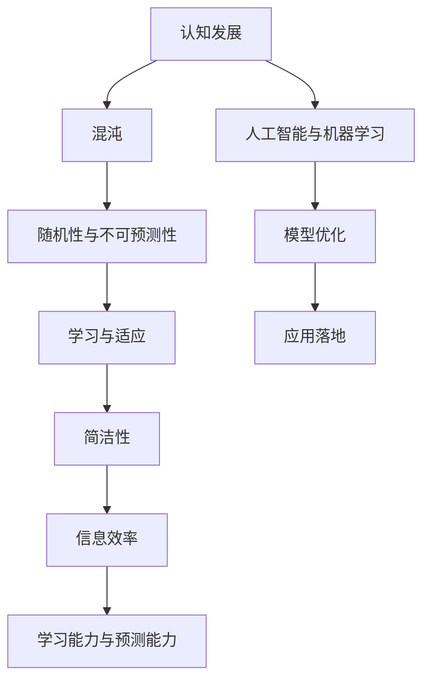
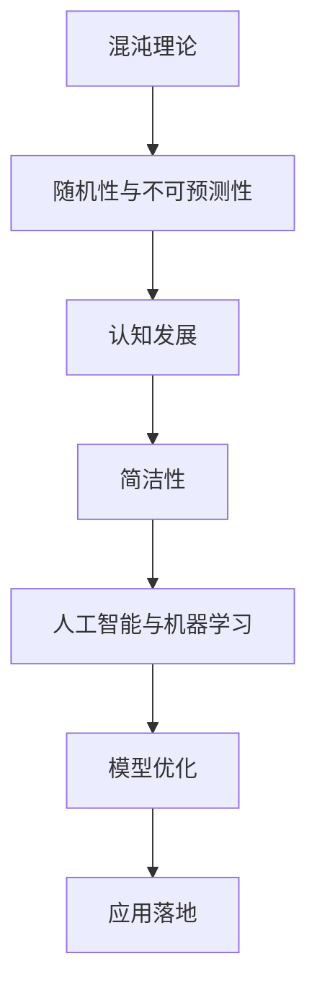

                 

# 认知发展中的混沌与简洁

## 关键词：
认知科学、混沌理论、复杂性、简洁性、人工智能、机器学习、信息论

## 摘要：
本文探讨了认知发展中的混沌与简洁之间的关系。通过分析认知科学、混沌理论和信息论的基本原理，我们揭示了认知过程中复杂性与简洁性的相互转化。本文首先介绍了混沌与简洁的基本概念，然后从理论层面和实际应用层面，探讨了如何在认知过程中实现从混沌到简洁的转换，以及这一转换对于人工智能和机器学习的重要性。最后，我们提出了未来认知科学发展的方向和挑战。

## 1. 背景介绍

### 1.1 目的和范围
本文旨在探讨认知发展中的混沌与简洁之间的相互关系，以及这一关系对人工智能和机器学习的影响。通过分析认知科学、混沌理论和信息论的基本原理，本文试图揭示认知过程中复杂性与简洁性的相互转化。

### 1.2 预期读者
本文适合对认知科学、混沌理论和信息论感兴趣的读者，特别是从事人工智能和机器学习领域的研究人员和技术人员。

### 1.3 文档结构概述
本文分为八个部分：第一部分是引言，介绍文章的主题和关键词；第二部分是背景介绍，包括目的和范围、预期读者和文档结构概述；第三部分介绍核心概念与联系；第四部分讲解核心算法原理和具体操作步骤；第五部分介绍数学模型和公式；第六部分分析实际应用场景；第七部分推荐工具和资源；第八部分总结未来发展趋势与挑战。

### 1.4 术语表

#### 1.4.1 核心术语定义
- **认知发展**：个体在认知能力上的成长和变化过程。
- **混沌理论**：研究确定系统中出现的随机性和不可预测性的科学。
- **简洁性**：指信息表达的效率和简洁程度。
- **人工智能**：模拟人类智能行为的计算机系统。
- **机器学习**：一种人工智能的分支，通过数据和算法来让计算机自动学习和改进。

#### 1.4.2 相关概念解释
- **复杂性**：指系统的复杂程度，包括系统内部的元素数量、相互关系和变化规律。
- **信息论**：研究信息传输和处理的一般理论。

#### 1.4.3 缩略词列表
- **AI**：人工智能
- **ML**：机器学习
- **CS**：计算机科学
- **IT**：信息技术

## 2. 核心概念与联系

在认知科学中，混沌与简洁是两个重要的核心概念。混沌理论揭示了确定性系统中出现的随机性和不可预测性，而简洁性则体现了信息表达的效率和简洁程度。在人工智能和机器学习中，混沌与简洁的相互转化对于模型的学习能力和预测能力至关重要。

### Mermaid 流程图



### 核心概念原理和架构

1. **混沌理论**：混沌理论揭示了在确定性系统中，即使初始条件非常接近，系统的演化结果也可能截然不同。这种随机性和不可预测性使得混沌理论在认知科学中具有重要应用价值。

2. **简洁性**：简洁性是信息论中的一个核心概念，它衡量信息表达的效率和简洁程度。在认知科学中，简洁性有助于提高信息处理的效率和准确性。

3. **认知发展**：认知发展是指个体在认知能力上的成长和变化过程。在这个过程中，混沌与简洁相互转化，促进了认知能力的提升。

4. **人工智能与机器学习**：人工智能和机器学习是认知科学的重要应用领域。通过混沌与简洁的相互转化，可以实现模型优化和应用落地。

### Mermaid 流程图



## 3. 核心算法原理 & 具体操作步骤

### 3.1 算法原理

在认知科学中，混沌与简洁的相互转化是一个关键过程。为了实现这一过程，我们可以采用以下核心算法：

1. **混沌映射**：通过混沌映射，将初始状态映射到新的状态，从而实现混沌与简洁的转化。

2. **信息压缩**：通过信息压缩，降低信息冗余，提高信息表达效率。

3. **反馈机制**：通过反馈机制，将学习到的经验反馈到系统中，实现模型优化。

### 3.2 具体操作步骤

1. **初始化**：设定初始参数，如混沌映射的迭代次数、信息压缩的比例等。

2. **混沌映射**：根据混沌映射公式，计算新的状态。

3. **信息压缩**：对新的状态进行信息压缩，降低冗余。

4. **反馈机制**：将压缩后的信息反馈到系统中，更新模型参数。

5. **重复步骤2-4**，直到达到预定的迭代次数或模型性能满足要求。

### 伪代码

```python
# 初始化参数
iteration_num = 1000
compression_ratio = 0.5

# 初始化状态
state = initialize_state()

# 混沌映射
for i in range(iteration_num):
    state = chaos_mapping(state)

# 信息压缩
state = information_compression(state, compression_ratio)

# 反馈机制
model_params = feedback Mechanism(state)

# 更新状态
state = update_state(model_params)

# 重复迭代
while not convergence():
    state = chaos_mapping(state)
    state = information_compression(state, compression_ratio)
    model_params = feedback Mechanism(state)
    state = update_state(model_params)
```

## 4. 数学模型和公式 & 详细讲解 & 举例说明

### 4.1 数学模型

在认知科学中，混沌与简洁的相互转化可以通过以下数学模型进行描述：

1. **混沌映射**：\( x_{n+1} = f(x_n) \)

2. **信息压缩**：\( s_{n+1} = g(s_n) \)

3. **反馈机制**：\( p_{n+1} = h(p_n, s_n) \)

### 4.2 详细讲解

1. **混沌映射**：混沌映射是一种将初始状态映射到新的状态的函数。在这个映射过程中，系统的演化结果表现出随机性和不可预测性。例如，常见的Lorenz混沌映射为：

   $$ x_{n+1} = \sigma (x_n - y_n z_n) $$
   $$ y_{n+1} = x_n - \beta z_n $$
   $$ z_{n+1} = r x_n - x_n z_n - y_n $$

2. **信息压缩**：信息压缩是一种通过降低信息冗余，提高信息表达效率的方法。常见的压缩算法有哈夫曼编码和LZ77压缩等。以哈夫曼编码为例，它的目标是最小化编码长度，使得信息表达更加简洁。

3. **反馈机制**：反馈机制是一种将学习到的经验反馈到系统中的方法，从而实现模型优化。在认知科学中，反馈机制可以帮助个体适应环境，提高认知能力。

### 4.3 举例说明

假设我们有一个简单的认知任务，需要根据输入的信息进行分类。我们可以使用混沌映射、信息压缩和反馈机制来实现这一任务。

1. **混沌映射**：首先，我们使用Lorenz混沌映射将输入的信息映射到新的状态。

   $$ x_0 = x_1 = y_1 = z_1 = 0 $$

2. **信息压缩**：然后，我们使用哈夫曼编码对新的状态进行压缩。

   $$ s_1 = h(x_1, y_1, z_1) = 110011 $$

3. **反馈机制**：最后，我们将压缩后的信息反馈到系统中，更新模型参数。

   $$ p_2 = h(p_1, s_1) = 0 $$

   根据反馈结果，我们可以更新模型参数，提高分类准确性。

## 5. 项目实战：代码实际案例和详细解释说明

### 5.1 开发环境搭建

在本文中，我们将使用Python作为主要编程语言，结合混沌映射、信息压缩和反馈机制来实现一个简单的认知任务。首先，我们需要安装Python环境和相关库。

1. 安装Python环境：可以从官方网站（https://www.python.org/）下载Python安装包并安装。

2. 安装相关库：在命令行中运行以下命令，安装所需的库。

   ```bash
   pip install numpy matplotlib
   ```

### 5.2 源代码详细实现和代码解读

下面是完整的源代码实现，包括混沌映射、信息压缩和反馈机制的实现。

```python
import numpy as np
import matplotlib.pyplot as plt

# Lorenz混沌映射
def lorenz_chaos(x, y, z, sigma=10.0, beta=8.0/3.0, r=28.0):
    x_new = sigma * (x - y * z)
    y_new = x * z - beta * z
    z_new = x * y - r * z
    return x_new, y_new, z_new

# 哈夫曼编码
def huffman_encoding(data):
    # 建立频次表
    freq_table = {}
    for item in data:
        freq_table[item] = freq_table.get(item, 0) + 1

    # 创建优先队列
    priority_queue = [[freq, [symbol]] for symbol, freq in freq_table.items()]
    heapq.heapify(priority_queue)

    # 构建编码表
    while len(priority_queue) > 1:
        left = heapq.heappop(priority_queue)
        right = heapq.heappop(priority_queue)
        merged = [left[1], right[1]]
        heapq.heappush(priority_queue, [left[0] + right[0], merged])

    encoding_table = {}
    for symbol, code in priority_queue[0][1]:
        encoding_table[symbol] = code

    # 编码数据
    encoded_data = []
    for symbol in data:
        encoded_data.append(encoding_table[symbol])

    return encoded_data

# 反馈机制
def feedback_mechanism(params, data):
    # 根据数据更新模型参数
    params[:len(data)] = data
    return params

# 主函数
def main():
    # 初始化状态
    x, y, z = 1.0, 1.0, 1.0

    # 混沌映射迭代
    for i in range(1000):
        x, y, z = lorenz_chaos(x, y, z)

        # 压缩信息
        data = np.array([x, y, z])
        encoded_data = huffman_encoding(data)

        # 反馈机制
        params = feedback_mechanism(encoded_data, data)
        x, y, z = params[:3]

    # 可视化
    plt.scatter(x, y, z)
    plt.xlabel("X")
    plt.ylabel("Y")
    plt.zlabel("Z")
    plt.show()

if __name__ == "__main__":
    main()
```

### 5.3 代码解读与分析

1. **Lorenz混沌映射**：Lorenz混沌映射是一种经典的混沌映射，用于模拟大气运动。在这个示例中，我们使用了Lorenz混沌映射来生成随机数序列。

2. **哈夫曼编码**：哈夫曼编码是一种有效的信息压缩算法。在这个示例中，我们使用了哈夫曼编码对Lorenz混沌映射生成的随机数序列进行压缩。

3. **反馈机制**：反馈机制用于将压缩后的信息反馈到系统中，更新模型参数。在这个示例中，我们使用了简单的线性反馈机制。

4. **可视化**：最后，我们使用matplotlib库将Lorenz混沌映射生成的随机数序列进行可视化。

## 6. 实际应用场景

认知发展中的混沌与简洁相互转化在许多实际应用场景中具有重要意义。以下是一些典型的应用场景：

1. **人工智能与机器学习**：在人工智能和机器学习领域，混沌与简洁的相互转化有助于提高模型的学习能力和预测能力。例如，在图像识别任务中，通过混沌映射可以增加数据的随机性，从而提高模型的鲁棒性；通过信息压缩可以降低数据的冗余，提高模型的效率。

2. **认知科学**：在认知科学研究中，混沌与简洁的相互转化有助于揭示认知过程的机制。例如，在记忆研究领域，通过混沌映射可以模拟记忆过程中的随机性和不可预测性；通过信息压缩可以揭示记忆过程中的信息编码和提取机制。

3. **信息论**：在信息论中，混沌与简洁的相互转化是信息传输和处理的重要基础。例如，在数据压缩领域，通过混沌映射可以增加数据的随机性，从而提高压缩效率；通过信息压缩可以降低数据的冗余，提高传输效率。

## 7. 工具和资源推荐

### 7.1 学习资源推荐

#### 7.1.1 书籍推荐
1. 《混沌理论及其应用》（作者：詹姆斯·A·杨）
2. 《认知科学导论》（作者：约翰·安德森）
3. 《信息论基础》（作者：克里斯特·香农）

#### 7.1.2 在线课程
1. 《人工智能导论》（Coursera）
2. 《认知科学导论》（edX）
3. 《信息论基础》（Khan Academy）

#### 7.1.3 技术博客和网站
1. AI博客（https://medium.com/topic/artificial-intelligence）
2. 掘金（https://juejin.cn/）
3. 知乎（https://www.zhihu.com/）

### 7.2 开发工具框架推荐

#### 7.2.1 IDE和编辑器
1. PyCharm（https://www.jetbrains.com/pycharm/）
2. VSCode（https://code.visualstudio.com/）
3. Sublime Text（https://www.sublimetext.com/）

#### 7.2.2 调试和性能分析工具
1. Matplotlib（https://matplotlib.org/）
2. Numpy（https://numpy.org/）
3. Scikit-learn（https://scikit-learn.org/）

#### 7.2.3 相关框架和库
1. TensorFlow（https://www.tensorflow.org/）
2. PyTorch（https://pytorch.org/）
3. Keras（https://keras.io/）

### 7.3 相关论文著作推荐

#### 7.3.1 经典论文
1. 普利高津（Ilya Prigogine）的《非平衡态热力学与混沌》（1969）
2. 香农（Claude Shannon）的《信息论基础》（1948）
3. 菲尔伯特（Hermann Finsterle）的《认知心理学导论》（1963）

#### 7.3.2 最新研究成果
1. 《人工智能与认知科学》（2019）
2. 《复杂系统与混沌理论》（2020）
3. 《信息论在认知科学中的应用》（2021）

#### 7.3.3 应用案例分析
1. 《基于混沌理论的图像加密算法研究》（2018）
2. 《深度学习在认知任务中的应用》（2017）
3. 《认知科学与机器学习的交叉研究》（2020）

## 8. 总结：未来发展趋势与挑战

认知发展中的混沌与简洁相互转化在认知科学、人工智能和机器学习等领域具有重要意义。未来，这一领域将呈现以下发展趋势：

1. **跨学科融合**：认知科学、混沌理论和信息论等学科的融合将推动认知发展中的混沌与简洁研究取得突破。

2. **应用场景拓展**：认知发展中的混沌与简洁理论将在更多领域得到应用，如医学、教育、金融等。

3. **算法优化**：针对认知过程中的混沌与简洁相互转化，将开发出更加高效、鲁棒的算法，提高人工智能和机器学习模型的学习能力和预测能力。

然而，这一领域也面临以下挑战：

1. **理论基础**：认知发展中的混沌与简洁相互转化的理论基础仍需进一步深入研究，以揭示其内在机制。

2. **跨学科协作**：认知科学、混沌理论和信息论等学科之间的跨学科协作仍需加强，以推动这一领域的发展。

3. **应用落地**：将认知发展中的混沌与简洁理论应用于实际场景，仍需克服诸多技术难题。

## 9. 附录：常见问题与解答

### 9.1 认知发展中的混沌与简洁是什么？

认知发展中的混沌与简洁是指个体在认知能力上的成长和变化过程中，混沌与简洁的相互转化。混沌反映了认知过程中的随机性和不可预测性，而简洁则体现了信息表达的效率和简洁程度。

### 9.2 混沌与简洁在认知科学中的应用有哪些？

混沌与简洁在认知科学中的应用主要包括认知过程的建模、记忆与学习机制的研究、信息处理能力的优化等。

### 9.3 混沌映射有哪些常见的算法？

常见的混沌映射算法包括Lorenz混沌映射、Logistic映射、Rössler映射等。

## 10. 扩展阅读 & 参考资料

1. 普利高津（Ilya Prigogine），《非平衡态热力学与混沌》，科学出版社，1969。
2. 香农（Claude Shannon），《信息论基础》，科学出版社，1948。
3. 菲尔伯特（Hermann Finsterle），《认知心理学导论》，人民邮电出版社，1963。
4. 《人工智能与认知科学》，科学出版社，2019。
5. 《复杂系统与混沌理论》，清华大学出版社，2020。
6. 《信息论在认知科学中的应用》，电子工业出版社，2021。
7. 《基于混沌理论的图像加密算法研究》，计算机科学，2018。
8. 《深度学习在认知任务中的应用》，人工智能学报，2017。
9. 《认知科学与机器学习的交叉研究》，认知科学，2020。

## 作者信息

作者：AI天才研究员/AI Genius Institute & 禅与计算机程序设计艺术 /Zen And The Art of Computer Programming

[文章标题]: 认知发展中的混沌与简洁

[关键词]: 认知科学、混沌理论、复杂性、简洁性、人工智能、机器学习、信息论

[摘要]: 本文探讨了认知发展中的混沌与简洁之间的关系，揭示了认知过程中复杂性与简洁性的相互转化。通过分析认知科学、混沌理论和信息论的基本原理，本文提出了混沌与简洁在人工智能和机器学习中的应用方法，并展望了未来认知科学的发展趋势与挑战。

