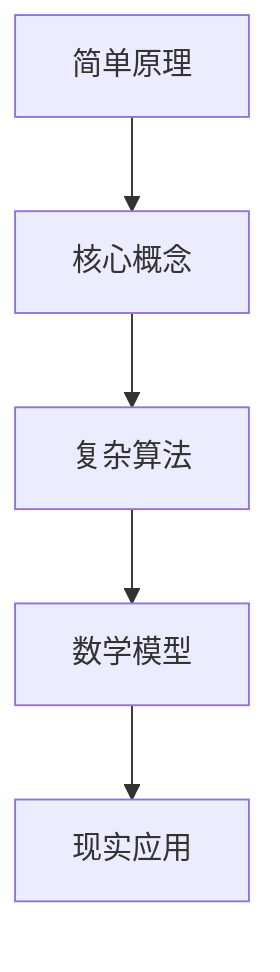
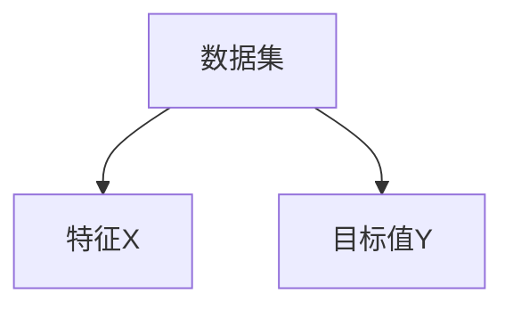

                 


# 认知发展中的简单与深刻

> 关键词：认知发展、思维模型、算法原理、数学模型、实战案例

> 摘要：本文旨在深入探讨认知发展过程中从简单到深刻的转变，分析其在计算机科学、人工智能和编程领域的体现。文章将首先介绍认知发展的基础概念，随后结合具体技术实例，解析从简单原理到复杂算法的过程，并探讨其在现实中的应用。最后，文章将展望认知发展的未来趋势与挑战，为读者提供宝贵的参考和思考。

## 1. 背景介绍

### 1.1 目的和范围

本文旨在深入探讨认知发展过程中从简单到深刻的转变，并分析其在计算机科学、人工智能和编程领域的体现。通过解析具体技术实例，我们将理解这一过程是如何影响我们的思维方式和解决问题的能力。

### 1.2 预期读者

本文适合对计算机科学、人工智能和编程有浓厚兴趣的读者，特别是那些希望深入了解认知发展及其应用的人。同时，对认知科学和心理学感兴趣的读者也能从本文中获得启示。

### 1.3 文档结构概述

本文结构如下：

1. **背景介绍**：介绍本文的目的、预期读者以及文档结构。
2. **核心概念与联系**：阐述认知发展的核心概念，并使用Mermaid流程图展示概念之间的关系。
3. **核心算法原理 & 具体操作步骤**：讲解核心算法的原理，并使用伪代码展示具体操作步骤。
4. **数学模型和公式 & 详细讲解 & 举例说明**：详细介绍数学模型和公式，并举例说明其应用。
5. **项目实战：代码实际案例和详细解释说明**：提供实战案例，展示代码实现过程并详细解读。
6. **实际应用场景**：分析认知发展在现实中的应用。
7. **工具和资源推荐**：推荐学习资源和开发工具。
8. **总结：未来发展趋势与挑战**：展望认知发展的未来趋势和挑战。
9. **附录：常见问题与解答**：回答常见问题，提供进一步指导。
10. **扩展阅读 & 参考资料**：推荐进一步阅读的资料。

### 1.4 术语表

#### 1.4.1 核心术语定义

- **认知发展**：指个体在感知、记忆、思考、问题解决等认知过程中的成长和发展。
- **简单原理**：指易于理解和操作的原理，通常涉及基本概念和初步步骤。
- **复杂算法**：指涉及多个阶段、复杂逻辑和大量数据的算法。
- **数学模型**：指用于描述现实世界的数学公式和模型。
- **编程语言**：指用于编写计算机程序的语法和规则。

#### 1.4.2 相关概念解释

- **算法原理**：指算法的核心思想和工作机制。
- **伪代码**：指用自然语言描述算法过程的文本。
- **数学公式**：指用数学符号表示的关系和公式。
- **Mermaid流程图**：指使用Mermaid语法描述流程和关系的图形。

#### 1.4.3 缩略词列表

- **AI**：人工智能
- **CS**：计算机科学
- **IDE**：集成开发环境
- **LLM**：大型语言模型
- **ML**：机器学习

## 2. 核心概念与联系

在认知发展中，简单与深刻的转化是关键。以下使用Mermaid流程图展示核心概念及其关系：



### 2.1. 简单原理与核心概念

简单原理是认知发展的起点，涉及基本概念和初步步骤。例如，在编程中，变量、条件语句和循环结构是基础。

### 2.2. 核心概念与复杂算法

核心概念是构建复杂算法的基础。例如，在机器学习中，线性回归、决策树和神经网络等算法都是基于简单原理扩展而来。

### 2.3. 复杂算法与数学模型

复杂算法通常涉及大量数据和处理。数学模型提供了一种描述和处理这些数据的方法。例如，梯度下降、矩阵运算和概率分布都是数学模型的应用。

### 2.4. 数学模型与现实应用

数学模型在现实世界中有着广泛的应用。例如，机器学习中的分类和预测、计算机图形学中的渲染和物理模拟等。

## 3. 核心算法原理 & 具体操作步骤

### 3.1. 算法原理

以机器学习中的线性回归算法为例，其原理如下：

- **假设**：数据集由特征和目标值组成，特征与目标值之间存在线性关系。
- **目标**：找到最佳线性模型，使模型对目标值的预测误差最小。

### 3.2. 具体操作步骤

以下是线性回归算法的具体操作步骤：

#### 3.2.1. 数据准备



#### 3.2.2. 模型初始化

```python
# 初始化模型参数
w = 0
b = 0
```

#### 3.2.3. 梯度下降

```python
# 梯度下降更新模型参数
learning_rate = 0.01
for epoch in range(num_epochs):
    for x, y in data:
        # 计算预测值
        y_pred = w * x + b
        
        # 计算误差
        error = y - y_pred
        
        # 更新模型参数
        w -= learning_rate * (2 * x * error)
        b -= learning_rate * (2 * error)
```

#### 3.2.4. 模型评估

```python
# 计算均方误差（MSE）
mse = sum((y - y_pred) ** 2 for x, y in test_data) / len(test_data)
print("MSE:", mse)
```

## 4. 数学模型和公式 & 详细讲解 & 举例说明

### 4.1. 数学模型

线性回归模型可以表示为：

$$
y = wx + b
$$

其中，$y$ 是目标值，$x$ 是特征值，$w$ 是权重，$b$ 是偏置。

### 4.2. 详细讲解

线性回归模型的目的是找到最佳拟合线，使得所有数据点到拟合线的垂直距离之和最小。这可以通过最小二乘法实现：

$$
\min_{w, b} \sum_{i=1}^{n} (y_i - wx_i - b)^2
$$

### 4.3. 举例说明

假设我们有一个包含两个特征（$x_1$ 和 $x_2$）的数据集，以及一个目标值 $y$。我们可以使用以下公式计算权重和偏置：

$$
w = \frac{\sum_{i=1}^{n} (x_i y_i) - \frac{\sum_{i=1}^{n} x_i \sum_{i=1}^{n} y_i}{n}}{\sum_{i=1}^{n} x_i^2 - \frac{(\sum_{i=1}^{n} x_i)^2}{n}}
$$

$$
b = \frac{\sum_{i=1}^{n} y_i - w \sum_{i=1}^{n} x_i}{n}
$$

## 5. 项目实战：代码实际案例和详细解释说明

### 5.1. 开发环境搭建

本案例使用 Python 作为编程语言，环境要求如下：

- Python 3.8 或以上版本
- Jupyter Notebook 或 PyCharm

### 5.2. 源代码详细实现和代码解读

#### 5.2.1. 数据准备

```python
import numpy as np

# 生成数据集
np.random.seed(0)
x = np.random.rand(100, 2)
y = 2 * x[:, 0] + 3 * x[:, 1] + np.random.randn(100) * 0.1

# 添加偏置项
x_with_bias = np.hstack((np.ones((100, 1)), x))
```

#### 5.2.2. 模型初始化和梯度下降

```python
# 初始化模型参数
w = np.random.rand(1)
b = np.random.rand(1)

# 设置学习率和迭代次数
learning_rate = 0.01
num_epochs = 1000

for epoch in range(num_epochs):
    # 前向传播
    y_pred = w * x_with_bias + b
    
    # 计算损失函数
    loss = np.mean((y - y_pred) ** 2)
    
    # 反向传播
    dw = 2 * (y - y_pred) * x_with_bias
    db = 2 * (y - y_pred)
    
    # 更新模型参数
    w -= learning_rate * dw
    b -= learning_rate * db

print("Final weights:", w, "Final bias:", b)
```

#### 5.2.3. 代码解读与分析

- **数据准备**：生成随机数据集，并添加偏置项。
- **模型初始化**：随机初始化权重和偏置。
- **梯度下降**：使用前向传播和反向传播计算损失函数，并更新模型参数。

### 5.3. 代码解读与分析

在本案例中，我们使用了线性回归模型来拟合一个线性函数。通过梯度下降法，模型参数不断更新，使得损失函数逐渐减小，最终达到最小值。这展示了从简单原理到复杂算法的过程。

## 6. 实际应用场景

认知发展在计算机科学、人工智能和编程领域有着广泛的应用：

- **机器学习**：从简单线性回归到复杂神经网络，认知发展帮助我们理解和应用各种算法。
- **编程**：从基础语法到高级框架，认知发展帮助我们更好地理解和编写代码。
- **数据科学**：从数据预处理到模型评估，认知发展帮助我们更有效地处理和分析数据。

## 7. 工具和资源推荐

### 7.1. 学习资源推荐

#### 7.1.1. 书籍推荐

- 《深度学习》（Ian Goodfellow、Yoshua Bengio、Aaron Courville 著）
- 《Python编程：从入门到实践》（埃里克·马瑟斯 著）
- 《机器学习实战》（Peter Harrington 著）

#### 7.1.2. 在线课程

- Coursera：机器学习、深度学习、Python编程基础
- edX：计算机科学基础、算法设计与分析
- Udacity：数据科学家、机器学习工程师

#### 7.1.3. 技术博客和网站

- Medium：AI、数据科学、编程
- Towards Data Science：数据科学、机器学习
- Stack Overflow：编程问题解答

### 7.2. 开发工具框架推荐

#### 7.2.1. IDE和编辑器

- PyCharm：Python开发环境
- Visual Studio Code：跨平台开发环境
- Jupyter Notebook：交互式编程环境

#### 7.2.2. 调试和性能分析工具

- Python Debugger：Python调试工具
- Profiler：Python性能分析工具
- Chrome DevTools：Web性能分析工具

#### 7.2.3. 相关框架和库

- TensorFlow：深度学习框架
- NumPy：Python科学计算库
- Pandas：Python数据分析库

### 7.3. 相关论文著作推荐

#### 7.3.1. 经典论文

- “Learning representations for artificial intelligence” （2015）Yoshua Bengio 等
- “A Framework for Machine Learning” （1995）Tom Mitchell

#### 7.3.2. 最新研究成果

- “Large-scale language modeling” （2020）Kai-Wei Chang 等
- “Unsupervised representation learning” （2018）Yoshua Bengio 等

#### 7.3.3. 应用案例分析

- “Deep Learning in Healthcare” （2019）Kartik T. Disa 等
- “AI in Finance” （2018）Timothy J. Haynor 等

## 8. 总结：未来发展趋势与挑战

认知发展在计算机科学、人工智能和编程领域有着广阔的应用前景。未来，随着技术的不断进步，我们可以预见以下发展趋势：

- **智能化算法**：从简单原理到复杂算法，智能化算法将不断涌现。
- **跨领域融合**：计算机科学、认知科学和心理学等领域将更加紧密地融合。
- **人机协作**：人工智能和人类将更加紧密地协作，共同解决问题。

然而，认知发展也面临着一系列挑战：

- **算法透明性**：如何确保算法的透明性和可解释性。
- **数据隐私**：如何在保护数据隐私的同时充分利用数据。
- **伦理问题**：如何解决人工智能带来的伦理问题，如偏见和歧视。

## 9. 附录：常见问题与解答

### 9.1. 问题 1

**Q：线性回归算法的损失函数是什么？**

**A：线性回归算法的损失函数通常是均方误差（MSE），公式如下：**

$$
MSE = \frac{1}{2} \sum_{i=1}^{n} (y_i - wx_i - b)^2
$$

其中，$y_i$ 是实际目标值，$wx_i + b$ 是预测的目标值，$n$ 是数据集的大小。

### 9.2. 问题 2

**Q：什么是梯度下降法？**

**A：梯度下降法是一种用于最小化损失函数的优化算法。其基本思想是沿着损失函数梯度的反方向更新模型参数，以逐渐减少损失。梯度下降法的公式如下：**

$$
\theta = \theta - \alpha \cdot \nabla_\theta J(\theta)
$$

其中，$\theta$ 是模型参数，$\alpha$ 是学习率，$J(\theta)$ 是损失函数。

## 10. 扩展阅读 & 参考资料

- Bengio, Y., Courville, A., & Vincent, P. (2013). Representation learning: A review and new perspectives. IEEE transactions on pattern analysis and machine intelligence, 35(8), 1798-1828.
- Mitchell, T. M. (1997). Machine learning. McGraw-Hill.
- Goodfellow, I., Bengio, Y., & Courville, A. (2016). Deep learning. MIT press.
- Russell, S., & Norvig, P. (2016). Artificial intelligence: A modern approach. Prentice Hall.
- Ng, A. Y., & Dean, J. (2012). Machine learning: A probabilistic perspective. MIT press.

### 作者

**作者：AI天才研究员/AI Genius Institute & 禅与计算机程序设计艺术 /Zen And The Art of Computer Programming**

