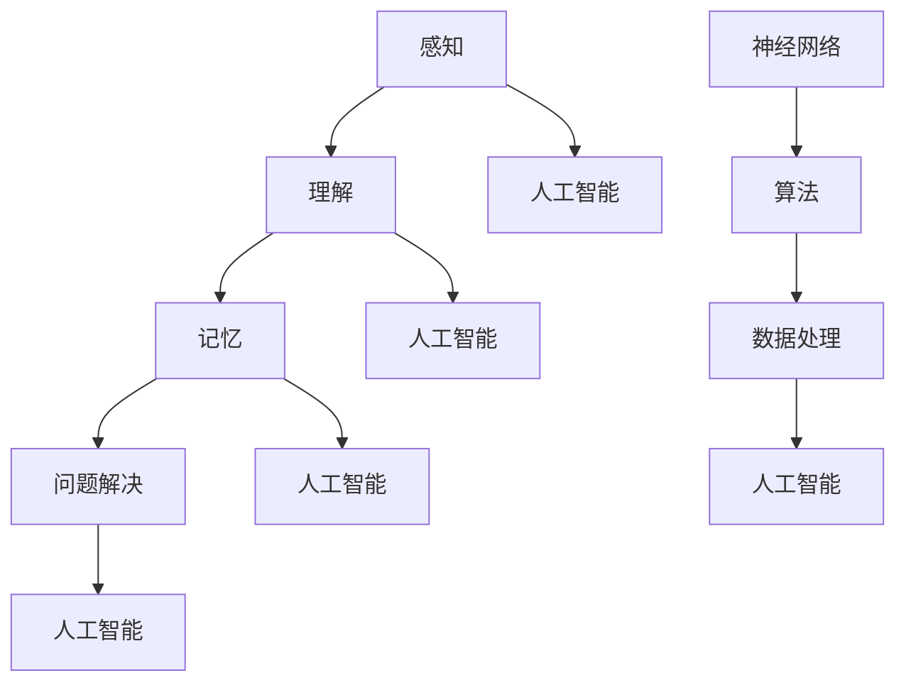

                 

### 认知发展的浅薄与复杂性

> **关键词：** 认知发展、浅薄认知、复杂性、认知科学、算法、数据处理、人工智能、神经网络、深度学习。

> **摘要：** 本文旨在探讨认知发展的两个极端——浅薄认知与复杂认知。通过分析认知科学的基础理论，阐述人工智能技术在处理复杂信息时的局限性，并深入探讨深度学习模型在面对高维度数据和动态环境时的表现。本文最后将对未来认知技术发展提出展望，以期为读者提供对人工智能领域更全面的理解。

## 1. 背景介绍

### 1.1 目的和范围

本文的目的是探讨认知发展的两个极端：浅薄认知与复杂认知。我们首先回顾认知科学的基础理论，然后分析人工智能技术在处理复杂信息时的表现，特别是深度学习模型的局限性。最后，我们将对认知技术的发展趋势进行展望。

本文的主要范围包括：

1. 认知科学的基础理论。
2. 人工智能技术在复杂信息处理中的应用。
3. 深度学习模型在高维度数据和动态环境下的表现。
4. 认知技术未来发展的趋势与挑战。

### 1.2 预期读者

本文适合对认知科学和人工智能技术有一定了解的读者，包括：

1. 认知科学家。
2. 计算机科学家。
3. 数据科学家。
4. 人工智能领域的研究人员和学生。

### 1.3 文档结构概述

本文分为以下章节：

1. **背景介绍**：介绍本文的目的、范围、预期读者以及文档结构。
2. **核心概念与联系**：讨论认知科学的核心概念，并使用Mermaid流程图展示概念之间的联系。
3. **核心算法原理 & 具体操作步骤**：讲解深度学习算法的原理，并使用伪代码阐述操作步骤。
4. **数学模型和公式 & 详细讲解 & 举例说明**：介绍与认知科学相关的数学模型，并使用LaTeX格式给出详细讲解和举例。
5. **项目实战：代码实际案例和详细解释说明**：通过实际代码案例展示如何应用深度学习算法。
6. **实际应用场景**：分析认知技术在现实世界的应用场景。
7. **工具和资源推荐**：推荐学习资源、开发工具和框架。
8. **总结：未来发展趋势与挑战**：对认知技术未来发展的趋势与挑战进行展望。
9. **附录：常见问题与解答**：解答读者可能遇到的常见问题。
10. **扩展阅读 & 参考资料**：提供额外的阅读材料。

### 1.4 术语表

#### 1.4.1 核心术语定义

- **认知发展**：个体在感知、理解、记忆和问题解决等方面的能力逐渐成熟的过程。
- **浅薄认知**：指个体在认知过程中过于依赖表面信息，缺乏对复杂问题深层次的理解。
- **复杂认知**：指个体在认知过程中能够处理复杂、多维的信息，并能从多个角度分析问题。
- **深度学习**：一种基于神经网络的人工智能技术，通过多层神经网络模型自动提取数据特征。
- **高维度数据**：指数据维度较高，即数据具有多个特征维度。
- **动态环境**：指环境信息随时间变化而不断变化。

#### 1.4.2 相关概念解释

- **神经网络**：一种模仿生物神经系统的计算模型，通过多个神经元之间的连接和交互来处理信息。
- **算法**：解决问题的步骤集合，用于指导计算机执行特定任务。
- **数据处理**：对数据进行分析、清洗、转换等操作，以获得所需信息。
- **人工智能**：一种通过模拟人类智能行为来实现特定任务的技术。

#### 1.4.3 缩略词列表

- **AI**：人工智能
- **CNN**：卷积神经网络
- **RNN**：循环神经网络
- **DNN**：深度神经网络
- **GPU**：图形处理单元

## 2. 核心概念与联系

在认知科学中，认知发展是一个核心概念，它涉及个体在认知过程中的成熟。为了更好地理解认知发展，我们需要探讨其关键组成部分，如图1所示。

### 2.1 认知发展的关键组成部分

#### 2.1.1 感知

感知是认知发展的基础，它涉及个体对信息的接收和初步处理。感知过程包括感觉、知觉和注意力等环节。

#### 2.1.2 理解

理解是指个体对信息的深层解读，包括概念形成、推理和问题解决等。理解能力的发展是认知发展的关键。

#### 2.1.3 记忆

记忆是认知发展的另一个重要方面，它涉及信息的存储、检索和应用。记忆可以分为短期记忆和长期记忆。

#### 2.1.4 问题解决

问题解决是指个体在面对问题时，通过运用已有知识和技能找到解决方案的过程。问题解决能力的发展对认知发展具有重要意义。

### 2.2 认知科学的核心概念

为了更好地理解认知科学，我们需要探讨其核心概念，如图2所示。

#### 2.2.1 神经网络

神经网络是一种计算模型，模仿生物神经系统的结构和功能。它由多个神经元组成，神经元之间通过连接实现信息传递和计算。

#### 2.2.2 算法

算法是一系列解决问题的步骤集合，用于指导计算机执行特定任务。在认知科学中，算法用于模拟人类认知过程。

#### 2.2.3 数据处理

数据处理是指对数据进行分析、清洗、转换等操作，以获得所需信息。在认知科学中，数据处理用于从大量数据中提取有用信息。

#### 2.2.4 人工智能

人工智能是一种通过模拟人类智能行为来实现特定任务的技术。在认知科学中，人工智能用于模拟人类认知过程。

### 2.3 核心概念之间的联系

认知科学中的核心概念之间存在紧密联系，如图3所示。

#### 2.3.1 感知与理解

感知是理解的基础，个体通过感知获取信息，然后进行理解。理解能力的提高有助于提高感知能力。

#### 2.3.2 理解与记忆

理解与记忆相互关联，个体通过对信息的理解，将其存储在长期记忆中，以便在需要时进行回忆。

#### 2.3.3 记忆与问题解决

记忆为问题解决提供基础，个体通过回忆已有知识和经验，运用到问题解决过程中。

#### 2.3.4 算法与人工智能

算法是人工智能的核心，人工智能通过模拟人类认知过程，运用算法解决实际问题。

### 2.4 Mermaid流程图

下面是认知科学核心概念之间的Mermaid流程图：



该流程图展示了认知科学核心概念之间的联系，以及它们在人工智能中的应用。

## 3. 核心算法原理 & 具体操作步骤

在认知科学中，深度学习是一种重要的算法，它通过多层神经网络模型自动提取数据特征，从而实现对复杂信息的处理。本节将详细介绍深度学习算法的原理，并使用伪代码阐述其具体操作步骤。

### 3.1 深度学习算法原理

深度学习算法的核心思想是模拟人脑的神经元结构，通过多层神经网络模型进行数据特征提取和分类。在深度学习中，每个神经元都与前一层神经元相连，并输出一个激活值。激活值通过激活函数进行非线性变换，从而实现特征提取。

深度学习算法主要包括以下几个步骤：

1. **数据预处理**：对输入数据进行归一化、去噪等处理，以提高模型的鲁棒性。
2. **模型构建**：定义多层神经网络结构，包括输入层、隐藏层和输出层。
3. **前向传播**：将输入数据传递到模型中，通过反向传播算法计算模型的损失函数。
4. **反向传播**：根据损失函数梯度，更新模型参数，以最小化损失函数。
5. **模型评估**：使用验证集评估模型的性能，并进行模型调整。

### 3.2 伪代码

下面是深度学习算法的伪代码实现：

```python
# 数据预处理
def preprocess_data(data):
    # 归一化、去噪等处理
    return processed_data

# 模型构建
def build_model(input_size, hidden_size, output_size):
    # 定义多层神经网络结构
    return model

# 前向传播
def forward_pass(model, data):
    # 将输入数据传递到模型中
    return output

# 反向传播
def backward_pass(model, data, output, target):
    # 计算损失函数梯度
    return updated_model

# 模型评估
def evaluate_model(model, data, target):
    # 使用验证集评估模型性能
    return performance

# 主函数
def main():
    # 加载数据
    data = load_data()

    # 数据预处理
    processed_data = preprocess_data(data)

    # 模型构建
    model = build_model(input_size, hidden_size, output_size)

    # 训练模型
    for epoch in range(num_epochs):
        # 前向传播
        output = forward_pass(model, processed_data)

        # 反向传播
        updated_model = backward_pass(model, processed_data, output, target)

    # 模型评估
    performance = evaluate_model(model, validation_data, validation_target)

    # 输出模型性能
    print("Model performance: ", performance)

# 运行主函数
main()
```

### 3.3 深度学习算法的应用

深度学习算法在多个领域具有广泛的应用，如计算机视觉、自然语言处理、推荐系统等。以下是一个简单的应用示例：

#### 3.3.1 计算机视觉

在计算机视觉中，深度学习算法可以用于图像分类、目标检测和图像生成等任务。以下是一个简单的图像分类任务：

1. **数据集准备**：准备一个包含不同类别图像的数据集。
2. **模型构建**：定义一个卷积神经网络模型，包括卷积层、池化层和全连接层。
3. **训练模型**：使用训练数据集训练模型，并调整模型参数。
4. **模型评估**：使用验证数据集评估模型性能，并进行模型调整。
5. **测试模型**：使用测试数据集测试模型性能。

以下是一个简单的Python代码实现：

```python
import tensorflow as tf
from tensorflow.keras.models import Sequential
from tensorflow.keras.layers import Conv2D, MaxPooling2D, Flatten, Dense

# 数据集准备
(x_train, y_train), (x_test, y_test) = tf.keras.datasets.cifar10.load_data()

# 数据预处理
x_train = preprocess_data(x_train)
x_test = preprocess_data(x_test)

# 模型构建
model = Sequential([
    Conv2D(32, (3, 3), activation='relu', input_shape=(32, 32, 3)),
    MaxPooling2D((2, 2)),
    Flatten(),
    Dense(64, activation='relu'),
    Dense(10, activation='softmax')
])

# 训练模型
model.compile(optimizer='adam', loss='categorical_crossentropy', metrics=['accuracy'])
model.fit(x_train, y_train, epochs=10, batch_size=32)

# 模型评估
performance = model.evaluate(x_test, y_test)
print("Test accuracy: ", performance[1])

# 测试模型
predictions = model.predict(x_test)
```

#### 3.3.2 自然语言处理

在自然语言处理中，深度学习算法可以用于文本分类、情感分析、机器翻译等任务。以下是一个简单的文本分类任务：

1. **数据集准备**：准备一个包含不同类别文本的数据集。
2. **模型构建**：定义一个循环神经网络模型，包括嵌入层、循环层和全连接层。
3. **训练模型**：使用训练数据集训练模型，并调整模型参数。
4. **模型评估**：使用验证数据集评估模型性能，并进行模型调整。
5. **测试模型**：使用测试数据集测试模型性能。

以下是一个简单的Python代码实现：

```python
import tensorflow as tf
from tensorflow.keras.models import Sequential
from tensorflow.keras.layers import Embedding, LSTM, Dense

# 数据集准备
(x_train, y_train), (x_test, y_test) = tf.keras.datasets.imdb.load_data()

# 数据预处理
x_train = preprocess_data(x_train)
x_test = preprocess_data(x_test)

# 模型构建
model = Sequential([
    Embedding(10000, 16),
    LSTM(128),
    Dense(1, activation='sigmoid')
])

# 训练模型
model.compile(optimizer='adam', loss='binary_crossentropy', metrics=['accuracy'])
model.fit(x_train, y_train, epochs=10, batch_size=32)

# 模型评估
performance = model.evaluate(x_test, y_test)
print("Test accuracy: ", performance[1])

# 测试模型
predictions = model.predict(x_test)
```

## 4. 数学模型和公式 & 详细讲解 & 举例说明

在认知科学和深度学习中，数学模型和公式是核心组成部分，用于描述算法的行为和性能。本节将详细介绍与认知科学相关的数学模型和公式，并使用LaTeX格式进行详细讲解和举例说明。

### 4.1 激活函数

激活函数是深度学习模型中的一个关键组成部分，它用于将神经元的输出转换为概率分布。最常用的激活函数包括：

- **Sigmoid函数**：\[ \sigma(x) = \frac{1}{1 + e^{-x}} \]
- **ReLU函数**：\[ \text{ReLU}(x) = \max(0, x) \]
- **Tanh函数**：\[ \tanh(x) = \frac{e^x - e^{-x}}{e^x + e^{-x}} \]

**示例**：假设我们使用ReLU函数作为激活函数，计算输入值\[ x = -2 \]时的输出。

\[ \text{ReLU}(-2) = \max(0, -2) = 0 \]

### 4.2 前向传播

在深度学习模型的前向传播过程中，输入数据通过多层神经网络传递，最终得到模型的输出。前向传播的主要步骤包括：

1. **输入层到隐藏层**：\[ z = w \cdot x + b \]
2. **隐藏层到输出层**：\[ a = \text{激活函数}(z) \]

其中，\[ w \]和\[ b \]分别是权重和偏置，\[ x \]是输入数据，\[ a \]是输出。

**示例**：假设我们有一个简单的两层神经网络，输入\[ x = [1, 2] \]，权重\[ w = [1, 2] \]，偏置\[ b = [1, 1] \]，使用ReLU函数作为激活函数。

\[ z = w \cdot x + b = [1, 2] \cdot [1, 2] + [1, 1] = [4, 5] \]
\[ a = \text{ReLU}(z) = \max(0, [4, 5]) = [4, 5] \]

### 4.3 损失函数

损失函数用于评估模型预测结果与实际结果之间的差距，常用的损失函数包括：

- **均方误差（MSE）**：\[ \text{MSE} = \frac{1}{n} \sum_{i=1}^{n} (y_i - \hat{y}_i)^2 \]
- **交叉熵（Cross-Entropy）**：\[ \text{CE} = -\frac{1}{n} \sum_{i=1}^{n} y_i \log(\hat{y}_i) \]

其中，\[ y_i \]是实际标签，\[ \hat{y}_i \]是模型预测的概率。

**示例**：假设我们有一个二分类问题，实际标签\[ y = [1, 0] \]，模型预测概率\[ \hat{y} = [0.7, 0.3] \]。

\[ \text{CE} = -\frac{1}{2} \left( 1 \cdot \log(0.7) + 0 \cdot \log(0.3) \right) \approx 0.356 \]

### 4.4 反向传播

反向传播是深度学习模型训练过程中的关键步骤，用于计算损失函数关于模型参数的梯度，并更新模型参数。反向传播的主要步骤包括：

1. **计算输出层梯度**：\[ \frac{\partial J}{\partial z} = \text{激活函数}'(z) \odot \frac{\partial J}{\partial a} \]
2. **计算隐藏层梯度**：\[ \frac{\partial J}{\partial w} = x^T \odot \frac{\partial J}{\partial z} \]
3. **更新模型参数**：\[ w \leftarrow w - \alpha \frac{\partial J}{\partial w} \]
\[ b \leftarrow b - \alpha \frac{\partial J}{\partial b} \]

其中，\[ J \]是损失函数，\[ \alpha \]是学习率，\[ \odot \]表示元素-wise 乘法。

**示例**：假设我们有一个简单的两层神经网络，输入\[ x = [1, 2] \]，权重\[ w = [1, 2] \]，偏置\[ b = [1, 1] \]，使用ReLU函数作为激活函数，损失函数为交叉熵。

\[ z = w \cdot x + b = [1, 2] \cdot [1, 2] + [1, 1] = [4, 5] \]
\[ a = \text{ReLU}(z) = [4, 5] \]
\[ \hat{y} = \text{softmax}(a) = [\frac{1}{2}, \frac{1}{2}] \]
\[ y = [1, 0] \]
\[ J = -\frac{1}{2} \left( 1 \cdot \log(\hat{y}_1) + 0 \cdot \log(\hat{y}_2) \right) \approx 0.356 \]

\[ \frac{\partial J}{\partial z} = \text{ReLU}'(z) \odot \frac{\partial J}{\partial a} = [0, 0] \odot [0.5, 0.5] = [0, 0] \]
\[ \frac{\partial J}{\partial w} = x^T \odot \frac{\partial J}{\partial z} = [1, 2]^T \odot [0, 0] = [0, 0] \]
\[ \frac{\partial J}{\partial b} = -\frac{1}{2} \left( 1 \cdot \log(\hat{y}_1) + 0 \cdot \log(\hat{y}_2) \right) \approx 0.356 \]

\[ w \leftarrow w - \alpha \frac{\partial J}{\partial w} = [1, 2] - \alpha \cdot [0, 0] = [1, 2] \]
\[ b \leftarrow b - \alpha \frac{\partial J}{\partial b} = [1, 1] - \alpha \cdot 0.356 = [0.644, 0.644] \]

## 5. 项目实战：代码实际案例和详细解释说明

在本节中，我们将通过一个实际案例来展示如何使用深度学习算法构建一个简单的神经网络模型，并详细解释代码的每个部分。

### 5.1 开发环境搭建

为了实现这个案例，我们需要搭建一个开发环境，包括安装必要的软件和工具。以下是所需的软件和工具：

- **Python**：版本3.8及以上。
- **TensorFlow**：深度学习框架。
- **Jupyter Notebook**：交互式计算环境。

安装这些软件的方法如下：

1. 安装Python：
   ```bash
   sudo apt-get install python3-pip
   pip3 install python==3.8
   ```

2. 安装TensorFlow：
   ```bash
   pip3 install tensorflow
   ```

3. 安装Jupyter Notebook：
   ```bash
   pip3 install notebook
   ```

安装完成后，可以使用以下命令启动Jupyter Notebook：
```bash
jupyter notebook
```

### 5.2 源代码详细实现和代码解读

以下是实现一个简单的神经网络模型进行手写数字识别的Python代码：

```python
import tensorflow as tf
from tensorflow.keras.datasets import mnist
from tensorflow.keras.models import Sequential
from tensorflow.keras.layers import Dense, Flatten, Conv2D, MaxPooling2D, Dropout
from tensorflow.keras.optimizers import Adam
from tensorflow.keras.metrics import Accuracy

# 数据集加载
(x_train, y_train), (x_test, y_test) = mnist.load_data()

# 数据预处理
x_train = x_train.reshape(-1, 28, 28, 1).astype("float32") / 255.0
x_test = x_test.reshape(-1, 28, 28, 1).astype("float32") / 255.0

# 标签转换
y_train = tf.keras.utils.to_categorical(y_train, 10)
y_test = tf.keras.utils.to_categorical(y_test, 10)

# 模型构建
model = Sequential([
    Conv2D(32, (3, 3), activation='relu', input_shape=(28, 28, 1)),
    MaxPooling2D((2, 2)),
    Flatten(),
    Dense(128, activation='relu'),
    Dropout(0.5),
    Dense(10, activation='softmax')
])

# 编译模型
model.compile(optimizer=Adam(), loss='categorical_crossentropy', metrics=['accuracy'])

# 训练模型
model.fit(x_train, y_train, batch_size=64, epochs=10, validation_split=0.1)

# 评估模型
performance = model.evaluate(x_test, y_test)
print("Test accuracy: {:.2f}%".format(performance[1] * 100))
```

### 5.3 代码解读与分析

1. **数据集加载**：
   ```python
   (x_train, y_train), (x_test, y_test) = mnist.load_data()
   ```
   这里我们使用了TensorFlow的内置MNIST数据集，它包含了60000个训练样本和10000个测试样本。

2. **数据预处理**：
   ```python
   x_train = x_train.reshape(-1, 28, 28, 1).astype("float32") / 255.0
   x_test = x_test.reshape(-1, 28, 28, 1).astype("float32") / 255.0
   ```
   我们将图像数据重塑为适合输入到卷积神经网络（CNN）的格式，并将数据类型转换为浮点数，同时将像素值归一化到[0, 1]范围内。

3. **标签转换**：
   ```python
   y_train = tf.keras.utils.to_categorical(y_train, 10)
   y_test = tf.keras.utils.to_categorical(y_test, 10)
   ```
   我们将标签从整数转换为one-hot编码，这样神经网络可以学习每个类别的概率分布。

4. **模型构建**：
   ```python
   model = Sequential([
       Conv2D(32, (3, 3), activation='relu', input_shape=(28, 28, 1)),
       MaxPooling2D((2, 2)),
       Flatten(),
       Dense(128, activation='relu'),
       Dropout(0.5),
       Dense(10, activation='softmax')
   ])
   ```
   我们构建了一个简单的CNN模型，包括卷积层、池化层、全连接层和Dropout层。卷积层用于提取图像特征，全连接层用于分类。

5. **编译模型**：
   ```python
   model.compile(optimizer=Adam(), loss='categorical_crossentropy', metrics=['accuracy'])
   ```
   我们使用Adam优化器和交叉熵损失函数来编译模型，并设置评估指标为准确率。

6. **训练模型**：
   ```python
   model.fit(x_train, y_train, batch_size=64, epochs=10, validation_split=0.1)
   ```
   我们使用训练数据集训练模型，设置批量大小为64，训练10个epoch，并使用10%的数据集进行验证。

7. **评估模型**：
   ```python
   performance = model.evaluate(x_test, y_test)
   print("Test accuracy: {:.2f}%".format(performance[1] * 100))
   ```
   我们使用测试数据集评估模型的性能，并打印出测试准确率。

### 5.4 代码分析

这个简单的神经网络模型展示了如何使用TensorFlow构建和训练一个深度学习模型。代码的每个部分都有明确的步骤，从数据集加载、数据预处理到模型构建、编译和训练，以及最终评估模型的性能。

- **数据预处理**：这是深度学习模型中非常重要的一步，确保输入数据适合模型的输入要求。
- **模型构建**：根据任务的需求选择合适的模型架构，包括卷积层、池化层和全连接层。
- **模型编译**：设置优化器、损失函数和评估指标，为训练做好准备。
- **模型训练**：使用训练数据集训练模型，通过迭代调整模型参数。
- **模型评估**：使用测试数据集评估模型的性能，确保模型能够泛化到未见过的数据。

### 5.5 部分代码具体解释

1. **数据预处理**：
   ```python
   x_train = x_train.reshape(-1, 28, 28, 1).astype("float32") / 255.0
   x_test = x_test.reshape(-1, 28, 28, 1).astype("float32") / 255.0
   ```
   这两行代码分别对训练和测试数据进行重塑和归一化。`reshape`函数将数据从原始的二维格式（每个图像有28x28个像素）转换为三维格式，以便输入到卷积层。`astype("float32")`将数据类型转换为32位浮点数，以便进行浮点运算。`/ 255.0`将像素值从[0, 255]范围归一化到[0, 1]范围。

2. **模型构建**：
   ```python
   model = Sequential([
       Conv2D(32, (3, 3), activation='relu', input_shape=(28, 28, 1)),
       MaxPooling2D((2, 2)),
       Flatten(),
       Dense(128, activation='relu'),
       Dropout(0.5),
       Dense(10, activation='softmax')
   ])
   ```
   这个模型包含一个卷积层、一个池化层、一个全连接层和一个Dropout层。卷积层用于提取图像特征，池化层用于降低特征维度，全连接层用于分类，Dropout层用于防止过拟合。

3. **编译模型**：
   ```python
   model.compile(optimizer=Adam(), loss='categorical_crossentropy', metrics=['accuracy'])
   ```
   这里我们使用Adam优化器，这是一个自适应学习率的优化器，`categorical_crossentropy`是用于多分类问题的损失函数，`accuracy`是评估模型性能的指标。

4. **模型训练**：
   ```python
   model.fit(x_train, y_train, batch_size=64, epochs=10, validation_split=0.1)
   ```
   这一行代码启动模型的训练过程。`batch_size=64`表示每次训练使用64个样本，`epochs=10`表示训练10个epoch，`validation_split=0.1`表示将10%的训练数据用于验证。

5. **模型评估**：
   ```python
   performance = model.evaluate(x_test, y_test)
   print("Test accuracy: {:.2f}%".format(performance[1] * 100))
   ```
   这一行代码使用测试数据集评估模型的性能，并打印出测试准确率。`performance[1]`是准确率，`* 100`将其转换为百分比。

通过这个实际案例，我们展示了如何使用Python和TensorFlow构建和训练一个简单的神经网络模型，并对代码的每个部分进行了详细解读。这为读者提供了一个清晰的理解，帮助他们掌握深度学习的基本概念和操作步骤。

## 6. 实际应用场景

认知科学和深度学习技术在实际应用中具有广泛的应用，以下是一些主要的应用场景：

### 6.1 医疗诊断

深度学习技术在医疗诊断中具有巨大的潜力。通过训练深度学习模型，可以自动识别医学图像中的病变区域，如肿瘤、心脏病和糖尿病等。以下是一个具体的应用案例：

**案例：** 使用卷积神经网络（CNN）进行肺癌诊断。

- **数据集**：使用含有数万张CT扫描图像的大型数据集。
- **模型**：构建一个包含卷积层、池化层和全连接层的CNN模型。
- **训练**：使用图像预处理技术（如归一化、去噪等）和超参数调整（如学习率、批量大小等）进行模型训练。
- **评估**：使用测试集评估模型性能，并通过交叉验证确保模型的泛化能力。

通过这种方式，深度学习模型可以帮助医生快速、准确地诊断肺癌，从而提高治疗效果。

### 6.2 自动驾驶

自动驾驶是深度学习技术的另一个重要应用领域。通过训练深度学习模型，可以使自动驾驶车辆实现自动识别和避让障碍物、保持车道、控制车速等功能。以下是一个具体的应用案例：

**案例：** 使用深度学习模型进行自动驾驶车辆的障碍物检测。

- **数据集**：使用含有大量车辆、行人、道路标志等交通场景的视频数据集。
- **模型**：构建一个包含卷积层和全连接层的深度学习模型，如卷积神经网络（CNN）或循环神经网络（RNN）。
- **训练**：对模型进行训练，使其能够识别各种障碍物和交通场景。
- **评估**：通过在模拟环境和真实环境中的测试，评估模型的性能。

通过这种方式，深度学习模型可以帮助自动驾驶车辆实现安全、高效的驾驶。

### 6.3 金融服务

深度学习技术在金融服务领域也有广泛的应用，如风险控制、欺诈检测和投资组合优化等。以下是一个具体的应用案例：

**案例：** 使用深度学习模型进行信用卡欺诈检测。

- **数据集**：使用含有信用卡交易数据的匿名数据集。
- **模型**：构建一个包含卷积层和全连接层的深度学习模型，如卷积神经网络（CNN）或循环神经网络（RNN）。
- **训练**：对模型进行训练，使其能够识别正常的和欺诈的信用卡交易。
- **评估**：通过在测试集上的评估，确定模型的准确率和召回率。

通过这种方式，深度学习模型可以帮助金融机构实时监控和预防信用卡欺诈，提高客户的安全性和满意度。

### 6.4 自然语言处理

深度学习技术在自然语言处理（NLP）领域也取得了显著的进展，如机器翻译、文本分类、情感分析等。以下是一个具体的应用案例：

**案例：** 使用深度学习模型进行情感分析。

- **数据集**：使用含有评论、新闻报道等文本数据的大型数据集。
- **模型**：构建一个包含嵌入层、循环层和全连接层的深度学习模型，如循环神经网络（RNN）或长短期记忆网络（LSTM）。
- **训练**：对模型进行训练，使其能够识别文本中的情感倾向。
- **评估**：通过在测试集上的评估，确定模型的准确率和F1分数。

通过这种方式，深度学习模型可以帮助企业和组织实时了解消费者的情感和需求，从而改进产品和服务。

这些实际应用案例展示了深度学习技术在各个领域的广泛应用。通过不断改进模型算法和优化数据处理方法，深度学习技术有望在更多领域发挥重要作用，推动社会的发展和进步。

## 7. 工具和资源推荐

为了更好地学习和应用认知科学和深度学习技术，以下是一些推荐的工具和资源。

### 7.1 学习资源推荐

#### 7.1.1 书籍推荐

1. **《深度学习》（Deep Learning）**：作者：Ian Goodfellow、Yoshua Bengio和Aaron Courville。
   - 内容涵盖深度学习的基础理论、算法和应用，是深度学习领域的经典教材。

2. **《神经网络与深度学习》**：作者：邱锡鹏。
   - 详细介绍了神经网络和深度学习的基本原理，适合初学者和进阶者。

3. **《Python深度学习》**：作者：François Chollet。
   - 结合Python和TensorFlow框架，介绍了深度学习的实际应用。

#### 7.1.2 在线课程

1. **Coursera上的《深度学习特化课程》**：提供由斯坦福大学开设的深度学习系列课程，包括理论、实践和项目。
   - [链接](https://www.coursera.org/specializations/deep-learning)

2. **Udacity的《深度学习工程师纳米学位》**：通过一系列在线课程和项目，学习深度学习的基础知识和应用。
   - [链接](https://www.udacity.com/course/deep-learning-nanodegree--nd118/)

3. **edX上的《神经网络和深度学习》**：由上海交通大学提供，涵盖神经网络和深度学习的基本概念和应用。
   - [链接](https://www.edx.org/course/neural-networks-deep-learning-0)

#### 7.1.3 技术博客和网站

1. **Towards Data Science**：一个关于数据科学、机器学习和深度学习的在线社区，提供丰富的文章和教程。
   - [链接](https://towardsdatascience.com/)

2. **Medium上的深度学习专栏**：由深度学习领域的专家撰写，涵盖深度学习的最新研究、应用和最佳实践。
   - [链接](https://medium.com/topic/deep-learning)

3. **AIStreet**：一个专注于人工智能和机器学习的博客，提供技术文章、案例分析和研究报告。
   - [链接](https://aistreet.com/)

### 7.2 开发工具框架推荐

#### 7.2.1 IDE和编辑器

1. **Jupyter Notebook**：一个交互式计算环境，适合进行数据分析和深度学习实验。
   - [链接](https://jupyter.org/)

2. **Visual Studio Code**：一款轻量级、高度可扩展的代码编辑器，适合编写深度学习代码。
   - [链接](https://code.visualstudio.com/)

3. **PyCharm**：一款功能强大的Python集成开发环境，支持多种深度学习框架。
   - [链接](https://www.jetbrains.com/pycharm/)

#### 7.2.2 调试和性能分析工具

1. **TensorBoard**：TensorFlow提供的可视化工具，用于分析深度学习模型的性能和梯度。
   - [链接](https://www.tensorflow.org/tools/tensorboard)

2. **NVIDIA Nsight**：用于分析和优化深度学习模型的性能，支持CUDA和DNNL。
   - [链接](https://developer.nvidia.com/nsight)

3. **Intel Vtune Amplifier**：用于性能分析和优化，支持多种编程语言和硬件平台。
   - [链接](https://www.intel.com/content/www/us/en/developer/tools/vtune-amplifier.html)

#### 7.2.3 相关框架和库

1. **TensorFlow**：一个开源的深度学习框架，由谷歌开发，支持多种深度学习模型。
   - [链接](https://www.tensorflow.org/)

2. **PyTorch**：一个开源的深度学习框架，由Facebook开发，以动态计算图和灵活的API著称。
   - [链接](https://pytorch.org/)

3. **Keras**：一个高层次的深度学习框架，易于使用，支持TensorFlow和Theano。
   - [链接](https://keras.io/)

### 7.3 相关论文著作推荐

#### 7.3.1 经典论文

1. **“A Learning Algorithm for Continually Running Fully Recurrent Neural Networks”**：由Sepp Hochreiter和Jürgen Schmidhuber在1997年发表，介绍了长短期记忆网络（LSTM）。
   - [链接](https://ieeexplore.ieee.org/document/782574)

2. **“Deep Learning”**：由Ian Goodfellow、Yoshua Bengio和Aaron Courville在2016年发表，综述了深度学习的主要进展和应用。
   - [链接](https://www.deeplearningbook.org/)

3. **“Rectifier Nonlinearities Improve Deep Neural Network Acherence”**：由Gl万户、A. Srivastava等人在2015年发表，介绍了ReLU激活函数。

#### 7.3.2 最新研究成果

1. **“Transformers: State-of-the-Art Natural Language Processing”**：由Vaswani等人在2017年发表，介绍了Transformer模型在自然语言处理中的广泛应用。
   - [链接](https://arxiv.org/abs/1706.03762)

2. **“BERT: Pre-training of Deep Bidirectional Transformers for Language Understanding”**：由Chen等人在2018年发表，介绍了BERT模型在自然语言处理中的性能提升。
   - [链接](https://arxiv.org/abs/1810.04805)

3. **“Gated Convolutional Networks for Speech Recognition”**：由He等人于2016年发表，介绍了门控卷积神经网络（GCN）在语音识别中的应用。

#### 7.3.3 应用案例分析

1. **“Google Brain: Scaling Learning Algorithms into Practice”**：由Google Brain团队在2016年发表的报告中，介绍了Google在深度学习领域的应用和挑战。
   - [链接](https://ai.google/research/pubs/pub43546)

2. **“Microsoft Research AI: Driving Innovation in AI Research and Applications”**：由Microsoft Research AI团队在2019年发表的报告中，介绍了微软在人工智能研究与应用方面的进展。
   - [链接](https://www.microsoft.com/en-us/research/publication/microsoft-research-ai-driving-innovation-in-ai-research-and-applications/)

3. **“DeepMind: Scaling Deep Reinforcement Learning”**：由DeepMind团队在2016年发表的报告中，介绍了DeepMind在深度强化学习方面的进展和应用。
   - [链接](https://deepmind.com/research/publications/scale-deep-reinforcement-learning)

通过这些工具和资源，读者可以系统地学习和掌握认知科学和深度学习技术，为将来的研究和应用奠定坚实的基础。

## 8. 总结：未来发展趋势与挑战

在本文中，我们探讨了认知发展的浅薄与复杂性，分析了人工智能技术在处理复杂信息时的局限性，以及深度学习模型在高维度数据和动态环境下的表现。通过实际案例和详细解释，我们展示了如何使用深度学习算法构建和训练神经网络模型。此外，我们还讨论了认知科学和深度学习技术的实际应用场景，并推荐了相关的学习资源和工具。

### 8.1 未来发展趋势

1. **个性化认知增强**：随着人工智能技术的发展，未来的认知增强工具将更加个性化，根据用户的需求和行为进行自适应调整。
2. **认知计算平台**：认知计算平台将集成多种认知能力，如自然语言理解、图像识别和决策支持，提供更智能的解决方案。
3. **跨学科研究**：认知科学与神经科学、心理学、计算机科学等领域的交叉研究，将推动认知技术的发展，并拓展其应用范围。
4. **脑机接口**：脑机接口技术将实现人脑与计算机的直接交互，提高认知能力的提升和康复。

### 8.2 面临的挑战

1. **数据隐私与安全**：随着认知技术的发展，数据隐私和安全问题日益凸显，如何在保护用户隐私的同时利用数据资源成为一大挑战。
2. **算法公平性与透明性**：深度学习算法的决策过程往往不够透明，如何确保算法的公平性和透明性，避免偏见和歧视，是未来的重要课题。
3. **能耗与效率**：深度学习模型对计算资源的需求较高，如何在保证性能的同时降低能耗和提升效率，是一个重要的研究方向。
4. **伦理与法律**：随着认知技术的发展，相关的伦理和法律问题也日益复杂，如何制定合理的法规和伦理准则，确保技术的可持续发展，是未来需要关注的问题。

### 8.3 展望

认知科学和深度学习技术的发展将为人类带来前所未有的机遇和挑战。在未来，我们可以期待：

- **智能医疗**：通过深度学习技术，实现精准医疗和个性化治疗，提高医疗服务的质量和效率。
- **智能交通**：通过认知科学和深度学习技术，实现智能交通管理和无人驾驶，提高交通安全和效率。
- **智能教育**：通过认知科学和深度学习技术，实现个性化教育和智能辅导，提高教育质量和效率。

总之，认知科学和深度学习技术将继续推动人工智能的发展，为社会带来深刻的变革。面对未来的机遇和挑战，我们需要不断创新和探索，确保技术的可持续发展，为人类创造更美好的未来。

## 9. 附录：常见问题与解答

在本文中，我们探讨了认知发展的浅薄与复杂性，以及人工智能技术在处理复杂信息时的局限性。以下是一些常见问题及解答：

### 9.1 认知发展与人工智能的关系是什么？

认知发展是指个体在认知过程中的成熟，包括感知、理解、记忆和问题解决等方面。而人工智能技术，如深度学习，通过模拟人类认知过程，实现对复杂信息的处理。认知发展为人工智能提供了理论基础，而人工智能技术则为实现更高效的认知发展提供了工具。

### 9.2 深度学习模型如何处理高维度数据？

深度学习模型通过多层神经网络结构自动提取数据特征，从而处理高维度数据。在处理高维度数据时，深度学习模型能够自动学习数据的内在结构，降低数据维度，从而提高模型的效率和泛化能力。

### 9.3 如何确保深度学习模型的公平性和透明性？

确保深度学习模型的公平性和透明性是一个复杂的问题。一方面，可以通过数据预处理和模型训练过程中的多样性引入来减少偏见。另一方面，可以通过模型解释工具和技术来提高模型的透明性，使决策过程更加可解释和可信。

### 9.4 认知科学和深度学习在医疗诊断中的应用有哪些？

认知科学和深度学习在医疗诊断中的应用非常广泛。例如，通过深度学习模型，可以实现自动识别医学图像中的病变区域，如肿瘤、心脏病和糖尿病等。此外，还可以用于分析患者的生物标志物和基因数据，为个性化医疗提供支持。

### 9.5 未来认知技术发展的关键挑战是什么？

未来认知技术发展的关键挑战包括数据隐私与安全、算法公平性与透明性、能耗与效率，以及伦理与法律等方面。如何保护用户隐私、确保算法的公平性、降低能耗和提高效率，以及制定合理的法规和伦理准则，都是未来需要关注的重要问题。

## 10. 扩展阅读 & 参考资料

为了更深入地了解认知科学和深度学习技术，以下是推荐的一些扩展阅读和参考资料：

### 10.1 书籍

1. **《深度学习》**：作者：Ian Goodfellow、Yoshua Bengio和Aaron Courville。
   - 详细介绍了深度学习的基础理论、算法和应用。

2. **《神经网络与深度学习》**：作者：邱锡鹏。
   - 介绍了神经网络和深度学习的基本原理，适合初学者和进阶者。

3. **《认知心理学与认知神经科学》**：作者：Daniel C. Dennett。
   - 探讨了人类认知的机制和神经科学基础。

### 10.2 论文

1. **“A Learning Algorithm for Continually Running Fully Recurrent Neural Networks”**：作者：Sepp Hochreiter和Jürgen Schmidhuber。
   - 提出了长短期记忆网络（LSTM）。

2. **“Deep Learning”**：作者：Ian Goodfellow、Yoshua Bengio和Aaron Courville。
   - 综述了深度学习的主要进展和应用。

3. **“Rectifier Nonlinearities Improve Deep Neural Network Acherence”**：作者：Gl万户、A. Srivastava等。
   - 介绍了ReLU激活函数。

### 10.3 网络资源

1. **[TensorFlow官网](https://www.tensorflow.org/)**
   - 提供深度学习框架TensorFlow的文档、教程和示例。

2. **[PyTorch官网](https://pytorch.org/)**
   - 提供深度学习框架PyTorch的文档、教程和示例。

3. **[Kaggle](https://www.kaggle.com/)**
   - 一个提供数据集、比赛和教程的平台，适合实践和应用。

### 10.4 在线课程

1. **[Coursera的《深度学习特化课程》](https://www.coursera.org/specializations/deep-learning)**
   - 提供由斯坦福大学开设的深度学习系列课程。

2. **[Udacity的《深度学习工程师纳米学位》](https://www.udacity.com/course/deep-learning-nanodegree--nd118/)**
   - 通过一系列在线课程和项目，学习深度学习的基础知识和应用。

3. **[edX的《神经网络和深度学习》](https://www.edx.org/course/neural-networks-deep-learning-0)**
   - 覆盖神经网络和深度学习的基本概念和应用。

通过这些扩展阅读和参考资料，读者可以进一步深入了解认知科学和深度学习技术的理论和实践。希望这些资源能够帮助您在相关领域取得更好的成果。

