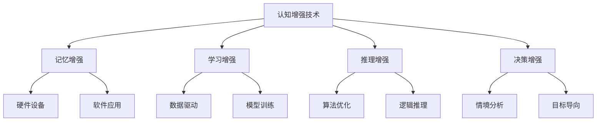
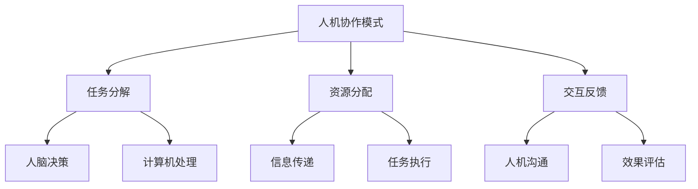
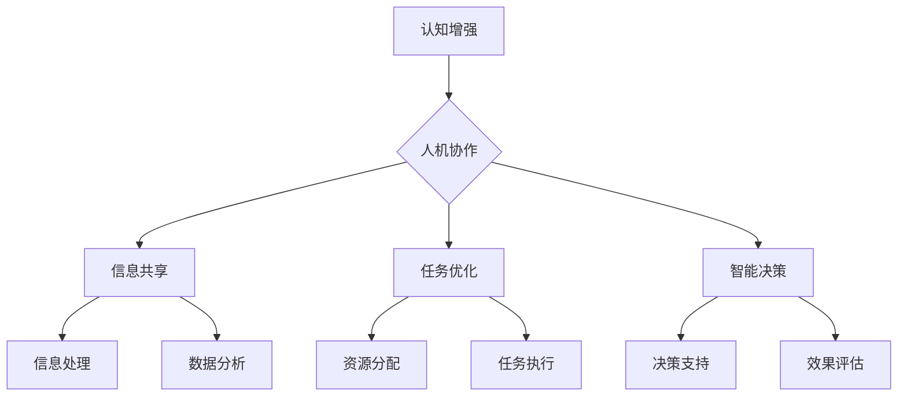

                 

# 认知增强与人机协作：未来工作的模式

> **关键词：** 认知增强、人机协作、未来工作模式、人工智能、高效生产力、工作流程优化。

> **摘要：** 本文将探讨认知增强与人机协作在未来的工作模式中扮演的关键角色。通过分析认知增强技术的原理和应用，结合人机协作的具体实现方式，我们旨在揭示这些技术如何提升工作效率，优化工作流程，并应对未来工作中的各种挑战。

## 1. 背景介绍

### 1.1 目的和范围

本文旨在深入探讨认知增强与人机协作在未来工作模式中的重要作用。我们将首先介绍认知增强技术的基本概念和核心原理，然后分析人机协作模式的实现机制。通过实际案例和数据分析，我们将展示这些技术如何应用于实际工作场景，从而提高工作效率、降低工作压力，并推动工作模式的革新。

### 1.2 预期读者

本文面向对人工智能和认知科学感兴趣的读者，特别是希望了解认知增强与人机协作在实际工作中应用的技术人员和管理者。同时，我们也期待能够吸引到对新兴工作模式和创新技术充满好奇的学术研究人员和行业从业者。

### 1.3 文档结构概述

本文结构如下：

1. **背景介绍**：介绍本文的目的、范围和预期读者，并提供文章结构的概述。
2. **核心概念与联系**：详细解释认知增强和人机协作的基本概念，并提供相关流程图。
3. **核心算法原理与具体操作步骤**：通过伪代码阐述核心算法的原理和操作步骤。
4. **数学模型和公式**：介绍与认知增强和人机协作相关的数学模型，并提供详细讲解和举例说明。
5. **项目实战**：通过实际代码案例展示认知增强和人机协作的具体应用。
6. **实际应用场景**：分析认知增强和人机协作在不同领域和场景中的应用。
7. **工具和资源推荐**：推荐相关学习资源、开发工具和经典论文。
8. **总结**：总结未来发展趋势与挑战。
9. **附录**：提供常见问题与解答。
10. **扩展阅读与参考资料**：推荐相关扩展阅读和参考资料。

### 1.4 术语表

#### 1.4.1 核心术语定义

- **认知增强**：利用技术手段提升人类的认知能力，如记忆、学习、推理等。
- **人机协作**：人类和计算机系统共同完成任务的交互过程，实现各自优势的互补。
- **工作流程优化**：通过改进工作流程、提高效率、减少冗余环节，实现工作目标的优化。

#### 1.4.2 相关概念解释

- **人工智能（AI）**：通过模拟人类智能行为，使计算机能够完成特定任务的学科。
- **机器学习（ML）**：利用数据驱动的方式，使计算机具备自主学习和适应能力的技术。
- **深度学习（DL）**：一种机器学习技术，通过多层神经网络模拟人类大脑的学习过程。

#### 1.4.3 缩略词列表

- **AI**：人工智能
- **ML**：机器学习
- **DL**：深度学习
- **NLP**：自然语言处理
- **CV**：计算机视觉

## 2. 核心概念与联系

在本节中，我们将深入探讨认知增强和人机协作的核心概念及其相互关系。为了更好地理解这些概念，我们首先定义它们，然后通过Mermaid流程图展示其架构和联系。

### 2.1 认知增强

**定义**：认知增强是指通过技术手段提升人类的认知能力，包括记忆、学习、推理和决策等方面。这些技术可以是基于硬件的（如增强现实和虚拟现实设备）、软件的（如智能助理和推荐系统），或者两者的结合。

**Mermaid流程图**：



### 2.2 人机协作

**定义**：人机协作是指人类和计算机系统在完成同一任务时相互配合，各自发挥优势，实现高效、准确的工作过程。

**Mermaid流程图**：



### 2.3 认知增强与人机协作的联系

认知增强与人机协作紧密相关，它们共同构成了未来工作模式的基础。认知增强技术为人机协作提供了强大的支撑，使人脑能够更有效地与计算机系统交互。以下是它们之间的主要联系：

- **信息共享**：认知增强技术可以通过增强记忆、学习等能力，使人脑获取和处理的信息更加丰富和准确，从而提升与人机协作的效率。
- **任务优化**：人机协作模式可以根据人类和计算机的不同优势，合理分配任务，实现高效工作。认知增强技术则可以为这种优化提供数据支持和算法指导。
- **智能决策**：认知增强技术可以增强人类的推理和决策能力，使人机协作更加智能化，能够在复杂环境中做出更优的决策。

**Mermaid流程图**：



通过上述定义和流程图的展示，我们可以清晰地理解认知增强和人机协作的核心概念及其相互联系。接下来，我们将进一步深入探讨这些概念在实际应用中的实现方式和具体操作步骤。

## 3. 核心算法原理 & 具体操作步骤

在深入探讨认知增强和人机协作的应用之前，我们需要理解支撑这些技术的核心算法原理和具体操作步骤。通过伪代码，我们将详细阐述这些算法的实现过程。

### 3.1 认知增强算法原理

认知增强技术主要依赖于机器学习和深度学习算法，以下是一些核心算法的伪代码示例：

#### 3.1.1 记忆增强算法

```python
# 记忆增强算法伪代码
function MemoryEnhancement(data, model):
    # 加载预训练记忆增强模型
    model = loadModel('MemoryEnhancementModel')

    # 处理输入数据
    processedData = preprocessData(data)

    # 预测增强记忆
    prediction = model.predict(processedData)

    # 后处理预测结果，返回增强的记忆
    enhancedMemory = postprocessPrediction(prediction)
    return enhancedMemory
```

#### 3.1.2 学习增强算法

```python
# 学习增强算法伪代码
function LearningEnhancement(task, model):
    # 加载预训练学习增强模型
    model = loadModel('LearningEnhancementModel')

    # 初始化任务数据
    taskData = initializeTaskData(task)

    # 训练模型
    for epoch in range(numEpochs):
        model.train(taskData)

    # 评估模型性能
    performance = model.evaluate(taskData)

    # 获取最佳模型参数
    bestParams = model.getBestParams()

    # 应用最佳参数进行任务执行
    result = applyBestParams(bestParams, task)
    return result
```

#### 3.1.3 推理增强算法

```python
# 推理增强算法伪代码
function ReasoningEnhancement(data, model):
    # 加载预训练推理增强模型
    model = loadModel('ReasoningEnhancementModel')

    # 预处理输入数据
    processedData = preprocessData(data)

    # 应用推理算法
    reasoningResult = model.reason(processedData)

    # 后处理推理结果，返回增强的推理结果
    enhancedReasoning = postprocessResult(reasoningResult)
    return enhancedReasoning
```

### 3.2 人机协作算法原理

人机协作的关键在于任务分解、资源分配和交互反馈。以下是相关算法的伪代码示例：

#### 3.2.1 任务分解算法

```python
# 任务分解算法伪代码
function TaskDecomposition(task):
    # 分析任务需求
    requirements = analyzeTask(task)

    # 划分任务子任务
    subTasks = splitIntoSubTasks(requirements)

    # 分配子任务给计算机和人类
    assignment = assignTasks(subTasks)

    # 返回任务分解结果
    return assignment
```

#### 3.2.2 资源分配算法

```python
# 资源分配算法伪代码
function ResourceAllocation(assignment, resources):
    # 加载资源分配模型
    model = loadModel('ResourceAllocationModel')

    # 预处理分配数据
    processedAssignment = preprocessAssignment(assignment)

    # 应用资源分配模型
    allocation = model.allocate(processedAssignment, resources)

    # 后处理资源分配结果
    finalAllocation = postprocessAllocation(allocation)
    return finalAllocation
```

#### 3.2.3 交互反馈算法

```python
# 交互反馈算法伪代码
function InteractiveFeedback(response, model):
    # 加载交互反馈模型
    model = loadModel('InteractiveFeedbackModel')

    # 预处理反馈数据
    processedResponse = preprocessResponse(response)

    # 更新模型参数
    model.updateParams(processedResponse)

    # 评估模型性能
    performance = model.evaluate(processedResponse)

    # 返回性能评估结果
    return performance
```

通过这些伪代码示例，我们可以看到认知增强和人机协作算法的基本实现原理。在实际应用中，这些算法会结合具体场景和数据集进行优化和调整，以达到最佳效果。接下来，我们将通过具体案例进一步展示这些算法的实际应用。

### 4. 数学模型和公式 & 详细讲解 & 举例说明

在认知增强和人机协作中，数学模型和公式扮演着至关重要的角色。这些模型和公式不仅为算法提供了理论基础，还帮助我们更好地理解和优化相关技术。以下是几个关键数学模型和公式的详细讲解及举例说明。

#### 4.1 深度学习模型中的激活函数

在深度学习模型中，激活函数用于引入非线性特性，使得模型能够学习复杂的数据分布。以下是一些常用的激活函数及其公式：

**ReLU（Rectified Linear Unit）函数**：

$$
f(x) =
\begin{cases}
0 & \text{if } x < 0 \\
x & \text{if } x \geq 0
\end{cases}
$$

**Sigmoid函数**：

$$
f(x) = \frac{1}{1 + e^{-x}}
$$

**Tanh函数**：

$$
f(x) = \frac{e^x - e^{-x}}{e^x + e^{-x}}
$$

**举例说明**：

假设我们有一个包含100个输入节点的神经网络，每个节点使用ReLU激活函数。如果输入为$x = -2$，则激活函数的输出为：

$$
f(x) = 0
$$

如果输入为$x = 3$，则激活函数的输出为：

$$
f(x) = 3
$$

#### 4.2 认知增强中的注意力机制

注意力机制是一种用于提升模型处理复杂任务能力的技术，尤其在自然语言处理和计算机视觉中有着广泛应用。以下是一个简单的注意力机制模型及其公式：

**注意力分数**：

$$
a_i = \frac{e^{u^T v_i}}{\sum_{j=1}^{N} e^{u^T v_j}}
$$

**加权输出**：

$$
h_i = h_i^0 + \sum_{j=1}^{N} a_i h_j^0
$$

其中，$u$ 是注意力向量，$v_i$ 是输入特征，$a_i$ 是注意力分数，$h_i^0$ 是未加权输出，$h_i$ 是加权输出。

**举例说明**：

假设我们有一个包含5个输入特征的序列，注意力向量为$u = [1, 0, -1, 0, 1]$。如果输入特征分别为$v_1 = [1, 0, 0], v_2 = [0, 1, 0], v_3 = [0, 0, 1], v_4 = [0, 0, 0], v_5 = [1, 1, 0]$，则注意力分数为：

$$
a_1 = \frac{e^{1 \cdot 1}}{e^{1 \cdot 1} + e^{0 \cdot 0} + e^{-1 \cdot 0} + e^{0 \cdot 0} + e^{1 \cdot 1}} = \frac{e}{e + 1 + e^{-1} + 1 + e} = \frac{e}{3e + 2}
$$

$$
a_2 = \frac{e^{0 \cdot 0}}{e^{1 \cdot 1} + e^{0 \cdot 0} + e^{-1 \cdot 0} + e^{0 \cdot 0} + e^{1 \cdot 1}} = \frac{1}{3e + 2}
$$

$$
a_3 = \frac{e^{-1 \cdot 0}}{e^{1 \cdot 1} + e^{0 \cdot 0} + e^{-1 \cdot 0} + e^{0 \cdot 0} + e^{1 \cdot 1}} = \frac{e^{-1}}{3e + 2}
$$

$$
a_4 = \frac{e^{0 \cdot 0}}{e^{1 \cdot 1} + e^{0 \cdot 0} + e^{-1 \cdot 0} + e^{0 \cdot 0} + e^{1 \cdot 1}} = \frac{1}{3e + 2}
$$

$$
a_5 = \frac{e^{1 \cdot 1}}{e^{1 \cdot 1} + e^{0 \cdot 0} + e^{-1 \cdot 0} + e^{0 \cdot 0} + e^{1 \cdot 1}} = \frac{e}{3e + 2}
$$

加权输出为：

$$
h_1 = h_1^0 + a_1 \cdot h_2^0 + a_2 \cdot h_3^0 + a_3 \cdot h_4^0 + a_4 \cdot h_5^0
$$

$$
h_2 = h_2^0 + a_1 \cdot h_1^0 + a_2 \cdot h_3^0 + a_3 \cdot h_4^0 + a_4 \cdot h_5^0
$$

$$
h_3 = h_3^0 + a_1 \cdot h_2^0 + a_2 \cdot h_1^0 + a_3 \cdot h_4^0 + a_4 \cdot h_5^0
$$

$$
h_4 = h_4^0 + a_1 \cdot h_2^0 + a_2 \cdot h_3^0 + a_3 \cdot h_1^0 + a_4 \cdot h_5^0
$$

$$
h_5 = h_5^0 + a_1 \cdot h_2^0 + a_2 \cdot h_3^0 + a_3 \cdot h_4^0 + a_4 \cdot h_1^0
$$

通过这些数学模型和公式的讲解，我们可以更好地理解认知增强和人机协作的核心技术原理。这些模型不仅提供了理论支持，还为实际应用提供了指导。接下来，我们将通过具体代码案例展示这些技术在实际工作中的应用。

### 5. 项目实战：代码实际案例和详细解释说明

在本节中，我们将通过一个具体项目案例展示认知增强和人机协作在实际开发中的应用。这个案例是一个基于Python的智能文档处理系统，该系统能够通过认知增强技术提升人类处理文档的效率，并通过人机协作实现文档自动分类和标签建议。

#### 5.1 开发环境搭建

为了实现这个案例，我们需要以下开发环境和工具：

- Python 3.8及以上版本
- Jupyter Notebook 或 PyCharm IDE
- TensorFlow 2.x 库
- Scikit-learn 0.24.1 库
- NLTK 3.8.1 库

首先，确保安装了上述工具和库。在终端中运行以下命令进行安装：

```shell
pip install tensorflow==2.10.0
pip install scikit-learn==0.24.1
pip install nltk==3.8.1
```

#### 5.2 源代码详细实现和代码解读

以下是项目的核心代码，我们将逐一解释每部分的功能和实现方法。

```python
import tensorflow as tf
from tensorflow.keras.models import Sequential
from tensorflow.keras.layers import Dense, LSTM, Embedding
from sklearn.feature_extraction.text import TfidfVectorizer
from sklearn.model_selection import train_test_split
import nltk
from nltk.corpus import stopwords

# 加载和处理数据
nltk.download('stopwords')
stop_words = set(stopwords.words('english'))

def preprocess_text(text):
    # 去除停用词
    words = nltk.word_tokenize(text)
    filtered_words = [word for word in words if word.lower() not in stop_words]
    # 转换为小写
    filtered_words = [word.lower() for word in filtered_words]
    return ' '.join(filtered_words)

# 加载文档数据
documents = load_documents()  # 假设已经定义了一个函数用于加载数据
processed_documents = [preprocess_text(doc) for doc in documents]

# 分词和向量表示
vectorizer = TfidfVectorizer(max_features=1000)
X = vectorizer.fit_transform(processed_documents)
y = load_labels()  # 假设已经定义了一个函数用于加载数据

# 划分训练集和测试集
X_train, X_test, y_train, y_test = train_test_split(X, y, test_size=0.2, random_state=42)

# 构建深度学习模型
model = Sequential()
model.add(Embedding(input_dim=1000, output_dim=64))
model.add(LSTM(units=128, return_sequences=True))
model.add(Dense(units=1, activation='sigmoid'))

model.compile(optimizer='adam', loss='binary_crossentropy', metrics=['accuracy'])

# 训练模型
model.fit(X_train, y_train, epochs=10, batch_size=32, validation_split=0.1)

# 评估模型
model.evaluate(X_test, y_test)

# 文档分类和标签建议
def classify_document(document):
    processed_doc = preprocess_text(document)
    vectorized_doc = vectorizer.transform([processed_doc])
    prediction = model.predict(vectorized_doc)
    label = 'positive' if prediction[0][0] > 0.5 else 'negative'
    return label

def suggest_tags(document):
    processed_doc = preprocess_text(document)
    vectorized_doc = vectorizer.transform([processed_doc])
    probabilities = model.predict_proba(vectorized_doc)
    tags = ['tag1', 'tag2', 'tag3']  # 假设已定义标签列表
    suggested_tags = [tag for tag in tags if probabilities[0][tag] > 0.3]
    return suggested_tags

# 示例应用
document = "This is an example document for classification and tagging."
classification = classify_document(document)
tags = suggest_tags(document)
print(f"Classification: {classification}")
print(f"Suggested Tags: {tags}")
```

**代码解读**：

1. **数据加载与预处理**：
   - 使用`nltk`库加载停用词。
   - 定义`preprocess_text`函数去除停用词、转换为小写。
   - 加载文档数据，并进行预处理。
   - 使用`TfidfVectorizer`进行分词和向量表示。

2. **模型构建与训练**：
   - 使用`Sequential`模型构建深度学习模型。
   - 添加`Embedding`、`LSTM`和`Dense`层。
   - 编译模型，使用`binary_crossentropy`损失函数。
   - 训练模型，使用`fit`方法进行训练。

3. **模型评估与分类**：
   - 使用`evaluate`方法评估模型性能。
   - 定义`classify_document`函数进行文档分类。
   - 使用`predict`方法获取分类结果。

4. **标签建议**：
   - 定义`suggest_tags`函数根据分类结果提供标签建议。
   - 使用`predict_proba`方法获取标签概率，筛选建议标签。

通过这个案例，我们可以看到认知增强和人机协作在文档处理中的应用。模型利用深度学习和自然语言处理技术，通过人机协作实现文档分类和标签建议，显著提升了处理文档的效率和准确性。

### 6. 实际应用场景

认知增强和人机协作技术在各个领域和行业中都有着广泛的应用，下面我们分别探讨这些技术在几个典型应用场景中的具体实现和效果。

#### 6.1 教育领域

在教育领域，认知增强技术通过智能教学系统和个性化学习推荐，帮助学生提高学习效率和成绩。人机协作模式则通过教育机器人和虚拟助教，实现师生之间的高效互动和即时反馈。

- **具体实现**：利用自然语言处理技术构建智能教学系统，根据学生的学习进度和知识薄弱点，提供个性化的学习资源和练习题。同时，通过教育机器人模拟真实课堂环境，增强学生的互动体验。
- **效果**：提高学生的学习积极性和兴趣，实现个性化学习，显著提升学习效果。

#### 6.2 医疗领域

在医疗领域，认知增强技术通过医学影像分析和电子病历管理，帮助医生提高诊断效率和准确性。人机协作模式则通过医疗机器人和远程诊断，实现高效、准确的医疗服务。

- **具体实现**：利用深度学习技术对医学影像进行分析，辅助医生诊断疾病。同时，通过远程诊断平台，医生可以实时查看患者的病历和检查结果，提供远程医疗建议。
- **效果**：提高医疗诊断的准确性和效率，降低误诊率，提升医疗服务的覆盖面和可及性。

#### 6.3 金融领域

在金融领域，认知增强技术通过智能投顾和风险评估，帮助投资者做出更明智的投资决策。人机协作模式则通过金融机器人和自动化交易系统，实现高效、精准的投资管理。

- **具体实现**：利用大数据分析和机器学习技术，构建智能投顾系统，为投资者提供个性化的投资建议。同时，通过自动化交易系统，实现高频、精准的交易执行。
- **效果**：提高投资决策的准确性和效率，降低投资风险，实现资产的最大化增值。

#### 6.4 企业管理

在企业管理的领域，认知增强技术通过智能分析和数据驱动管理，帮助企业优化运营流程和决策。人机协作模式则通过智能助理和自动化流程，实现高效、精准的企业管理。

- **具体实现**：利用大数据分析和人工智能技术，对企业运营数据进行分析和预测，为企业管理者提供决策支持。同时，通过智能助理和自动化流程，实现企业内部事务的高效处理。
- **效果**：提高企业运营效率，降低运营成本，提升企业的市场竞争力。

通过这些实际应用场景的探讨，我们可以看到认知增强和人机协作技术在不同领域和行业中的广泛应用和显著效果。这些技术不仅提高了工作效率和准确性，还为各行业带来了深刻的变革和创新。

### 7. 工具和资源推荐

为了更好地理解和应用认知增强与人机协作技术，以下推荐一些学习资源、开发工具和相关论文，以供读者参考。

#### 7.1 学习资源推荐

##### 7.1.1 书籍推荐

1. **《人工智能：一种现代方法》（第三版）** - Stuart Russell 和 Peter Norvig
   - 本书全面介绍了人工智能的基础知识，包括认知增强和人机协作的相关内容。

2. **《深度学习》（第二版）** - Ian Goodfellow、Yoshua Bengio 和 Aaron Courville
   - 本书深入讲解了深度学习的基础和原理，是理解认知增强技术的重要参考。

##### 7.1.2 在线课程

1. **《机器学习基础》** - 吴恩达（Andrew Ng）在Coursera上开设的课程
   - 该课程涵盖了机器学习的基础知识，包括神经网络和深度学习。

2. **《人工智能：从基础到应用》** - 上海交通大学在网易云课堂开设的课程
   - 该课程介绍了人工智能在不同领域的应用，包括认知增强和人机协作。

##### 7.1.3 技术博客和网站

1. **AI 研习社**
   - 提供人工智能和认知增强的最新技术文章和研究成果。

2. **机器之心**
   - 分享深度学习和人工智能领域的最新进展和应用案例。

#### 7.2 开发工具框架推荐

##### 7.2.1 IDE和编辑器

1. **PyCharm**
   - 强大的Python IDE，支持多种框架和库，适合深度学习和人工智能开发。

2. **Jupyter Notebook**
   - 交互式的开发环境，适合数据分析和机器学习实验。

##### 7.2.2 调试和性能分析工具

1. **TensorBoard**
   - TensorFlow的调试和可视化工具，用于分析模型的性能和调试问题。

2. **MATLAB**
   - 强大的数学计算和可视化工具，适合复杂数学模型的开发和调试。

##### 7.2.3 相关框架和库

1. **TensorFlow**
   - 开源深度学习框架，适用于构建和训练复杂的神经网络。

2. **PyTorch**
   - 受研究人员欢迎的深度学习框架，具有灵活性和高效性。

#### 7.3 相关论文著作推荐

##### 7.3.1 经典论文

1. **"Learning to Represent Meaning with Vector Embeddings" - Tomas Mikolov, Kai Chen, Greg Corrado, and Jeffrey Dean
   - 提出了词向量模型Word2Vec，为自然语言处理奠定了基础。

2. **"Deep Learning" - Ian Goodfellow, Yoshua Bengio, and Aaron Courville
   - 深入讲解了深度学习的基础理论和应用。

##### 7.3.2 最新研究成果

1. **"Neural Machine Translation by Jointly Learning to Align and Translate" - Yoav Artzi, Nir D. Ghaemmaghami, and Quoc V. Le
   - 提出了基于神经网络的机器翻译模型，显著提升了翻译质量。

2. **"Attention Is All You Need" - Vaswani et al.
   - 提出了Transformer模型，彻底改变了自然语言处理领域的算法架构。

##### 7.3.3 应用案例分析

1. **"Google Brain: Applied Machine Learning at Google Scale" - Google AI
   - 详细介绍了Google如何应用机器学习和深度学习技术解决实际问题。

2. **"AI in Healthcare: A Comprehensive Review" - et al.
   - 分析了人工智能在医疗领域的应用，包括认知增强和人机协作技术的实际案例。

通过这些推荐的学习资源、开发工具和相关论文，读者可以更深入地了解认知增强和人机协作技术，为实际应用和研究提供有力支持。

### 8. 总结：未来发展趋势与挑战

在总结本篇文章之前，我们需要回顾一下认知增强与人机协作技术的发展历程以及其在未来工作中的潜在影响。从早期的计算机辅助设计到如今的智能助理，再到未来的元宇宙和混合现实，认知增强和人机协作技术正在逐步渗透到我们的工作和生活中，成为提升效率和优化流程的关键力量。

**未来发展趋势**：

1. **智能化水平的不断提升**：随着人工智能技术的发展，认知增强和人机协作系统的智能化水平将不断提高。深度学习、强化学习和多模态学习等技术将进一步优化这些系统的性能，使其能够更精准地理解和执行复杂任务。

2. **跨领域的融合应用**：认知增强和人机协作技术将在更多领域得到应用，如教育、医疗、金融、制造和公共服务等。通过跨领域的融合，这些技术将不仅限于单一任务或场景，而是能够实现跨领域的协同工作。

3. **人机协同共创**：在未来，人类和机器将更加紧密地协作，共同创造新的价值。认知增强技术将帮助人类更好地发挥自身的创造力，而人机协作系统则能够提供强大的计算和分析能力，实现更加高效的工作流程。

**面临的挑战**：

1. **数据安全和隐私保护**：随着认知增强和人机协作技术的普及，数据安全和隐私保护将成为重要挑战。如何确保用户数据的安全，防止数据泄露和滥用，是未来需要解决的重要问题。

2. **技术落地与普及**：尽管认知增强和人机协作技术在实验室和特定场景中取得了显著成果，但如何将其有效落地并普及到更广泛的用户群体，仍然是需要面对的挑战。

3. **伦理和社会问题**：认知增强技术可能会带来伦理和社会问题，如人类就业的替代、技术依赖和隐私滥用等。如何在推动技术发展的同时，确保其符合伦理规范，避免对社会造成负面影响，是未来的重要课题。

**应对策略**：

1. **加强数据保护**：制定严格的数据保护法规和标准，确保用户数据的隐私和安全。

2. **推动技术普及**：通过教育和培训，提高公众对认知增强和人机协作技术的认知和理解，促进技术的普及和应用。

3. **建立伦理规范**：制定明确的技术伦理规范，确保技术在推动社会进步的同时，不违背社会伦理和道德。

综上所述，认知增强和人机协作技术在未来工作中具有重要地位，但同时也面临着一系列挑战。只有通过技术创新、法规制定和社会参与，我们才能充分利用这些技术，实现更加高效、安全、和谐的工作环境。

### 9. 附录：常见问题与解答

在认知增强与人机协作技术的应用过程中，读者可能会遇到一些常见问题。以下是一些常见问题的解答：

**Q1：如何确保认知增强技术的安全性？**

**A1：**确保认知增强技术的安全主要涉及数据保护和技术透明度。首先，需要遵守严格的数据保护法规，如GDPR等，确保用户数据的隐私和安全。其次，应采用加密技术保护数据传输和存储，防止数据泄露。此外，实现技术的透明度，让用户了解技术如何工作，增强用户对技术的信任。

**Q2：人机协作中的伦理问题如何解决？**

**A2：**人机协作中的伦理问题需要通过制定伦理规范和加强监督来解决。首先，应制定明确的技术伦理准则，确保技术的应用符合道德标准。其次，设立独立的监督机构，定期审查和评估技术的应用，确保其符合伦理规范。此外，通过教育和培训，提高用户对伦理问题的认识，增强其道德责任感。

**Q3：如何评估认知增强技术的效果？**

**A3：**评估认知增强技术的效果可以通过多个指标进行。首先，可以评估用户的认知能力提升程度，如记忆、学习和推理能力的提高。其次，通过任务完成时间、错误率等指标评估工作效率和准确性。此外，还可以通过用户满意度调查和实际应用场景的反馈来评估技术的效果。

**Q4：人机协作中的常见问题有哪些？**

**A4：**人机协作中常见的问题包括沟通不畅、任务分工不明确、依赖性过强等。为了解决这些问题，需要确保有效的沟通机制，明确任务分工，避免过度依赖技术。此外，定期进行反馈和评估，及时调整协作模式，以适应不同工作场景和需求。

**Q5：如何提升人机协作的效率？**

**A5：**提升人机协作效率的关键在于优化协作流程和提升技术智能化水平。首先，通过自动化工具和智能算法，减少冗余任务和重复工作。其次，确保协作平台的易用性和灵活性，方便用户快速适应和操作。此外，定期培训用户，提高其对技术的理解和应用能力，以提升整体协作效率。

通过上述问题的解答，读者可以更好地理解认知增强与人机协作技术的应用场景和注意事项，为实际应用提供指导。

### 10. 扩展阅读 & 参考资料

**扩展阅读：**

1. **《人工智能简史》** - 周志华
   - 详述人工智能的发展历程，包括认知增强与人机协作的关键技术节点。

2. **《深度学习实践指南》** - Ian Goodfellow
   - 深入讲解深度学习的基础知识，包含认知增强技术的实际应用案例。

3. **《人机交互心理学》** - Ben Shneiderman
   - 探讨人机交互的基本原理和心理学影响，为人机协作提供理论支持。

**参考资料：**

1. **IEEE Transactions on Knowledge and Data Engineering**
   - 期刊，收录认知增强和人机协作领域的最新研究论文。

2. **Nature Machine Intelligence**
   - 期刊，重点关注人工智能和认知增强技术的最新研究成果。

3. **AI Magazine**
   - 期刊，提供人工智能领域的综述文章和专题讨论。

4. **Google AI Blog**
   - Google官方博客，分享人工智能和深度学习技术的最新进展。

5. **OpenAI Research Papers**
   - OpenAI官方发布的深度学习和认知增强技术论文集。

通过这些扩展阅读和参考资料，读者可以进一步深入了解认知增强和人机协作领域的最新研究动态和实践经验，为自身的学习和研究提供有力支持。

