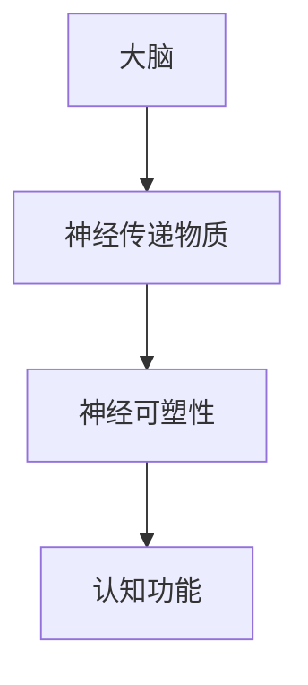
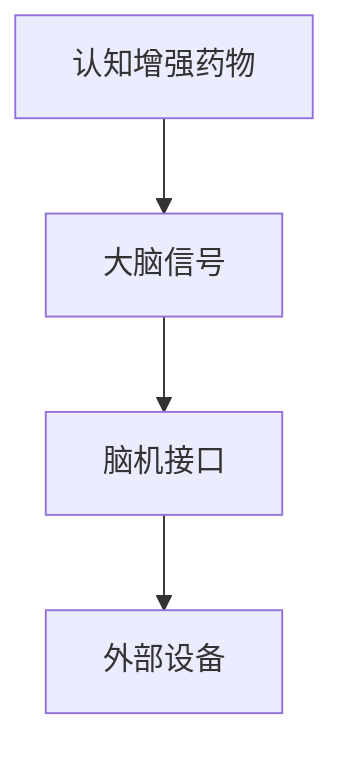

                 

# 认知增强药物：知识获取的伦理争议

> **关键词**：认知增强药物、伦理争议、知识获取、AI、算法、脑机接口
> 
> **摘要**：本文深入探讨了认知增强药物在知识获取中的伦理争议。从认知增强药物的定义、工作原理、潜在效果以及其在教育、科研等领域中的应用出发，分析其带来的伦理挑战，并探讨可能的解决方案。本文旨在为读者提供一个全面、深入的视角，以理解认知增强药物在知识获取中的复杂性和多样性。

## 1. 背景介绍

### 1.1 目的和范围

本文的主要目的是探讨认知增强药物（nootropic drugs）在知识获取中的应用及其伦理争议。认知增强药物是指那些能够改善记忆、注意力、思维速度等认知功能的药物。随着科学技术的发展，认知增强药物在提高个人认知能力、促进知识获取方面显示出巨大的潜力。然而，与此同时，它们也引发了广泛的伦理问题。

本文将重点关注以下几个核心问题：

1. 认知增强药物的定义及其分类。
2. 认知增强药物的工作原理和潜在效果。
3. 认知增强药物在教育、科研等领域中的应用。
4. 认知增强药物带来的伦理挑战。
5. 针对伦理挑战的可能解决方案。

### 1.2 预期读者

本文适用于对认知增强药物及其伦理争议感兴趣的读者，包括：

- 对认知科学、神经科学有基本了解的科研人员。
- 对人工智能和机器学习有深入研究的工程师。
- 对伦理学有基础认识的哲学家和伦理学家。
- 对教育领域有热情的教育工作者。

### 1.3 文档结构概述

本文的结构如下：

1. **引言**：介绍认知增强药物的定义及其背景。
2. **核心概念与联系**：阐述认知增强药物的基本原理和架构。
3. **核心算法原理 & 具体操作步骤**：详细讲解认知增强药物的工作原理。
4. **数学模型和公式 & 详细讲解 & 举例说明**：介绍与认知增强药物相关的数学模型和公式。
5. **项目实战：代码实际案例和详细解释说明**：通过实际案例展示认知增强药物的应用。
6. **实际应用场景**：分析认知增强药物在不同领域的应用。
7. **工具和资源推荐**：推荐与认知增强药物相关的学习资源。
8. **总结：未来发展趋势与挑战**：总结本文的主要观点，并探讨未来趋势和挑战。
9. **附录：常见问题与解答**：解答读者可能遇到的问题。
10. **扩展阅读 & 参考资料**：提供进一步阅读的资源。

### 1.4 术语表

#### 1.4.1 核心术语定义

- **认知增强药物（nootropic drugs）**：指那些能够改善记忆、注意力、思维速度等认知功能的药物。
- **脑机接口（brain-computer interface，BCI）**：一种直接连接大脑和外部设备的技术，用于传递信息和控制设备。
- **伦理争议（ethical debate）**：关于道德原则和价值观的争议，通常涉及社会、科学和技术等领域。
- **知识获取（knowledge acquisition）**：通过学习、研究和实践来获取知识的过程。

#### 1.4.2 相关概念解释

- **神经可塑性（neuroplasticity）**：大脑在结构和功能上的可塑性，能够适应环境和经验的变化。
- **认知负荷（cognitive load）**：在进行认知任务时，大脑需要处理的认知信息的量。
- **伦理学（ethics）**：研究道德原则、价值观和行为的学科。

#### 1.4.3 缩略词列表

- **BCI**：脑机接口（brain-computer interface）
- **AI**：人工智能（artificial intelligence）
- **ML**：机器学习（machine learning）
- **NLP**：自然语言处理（natural language processing）
- **GPU**：图形处理器（graphics processing unit）

## 2. 核心概念与联系

### 2.1 认知增强药物的基本原理

认知增强药物主要通过影响神经传递物质、调节大脑血流量和改善神经可塑性来实现认知功能的增强。以下是一个简化的 Mermaid 流程图，展示了认知增强药物的基本原理和架构：



### 2.2 脑机接口与认知增强药物的联系

脑机接口（BCI）作为一种直接连接大脑和外部设备的技术，在认知增强药物的研究和应用中起着关键作用。以下是一个简化的 Mermaid 流程图，展示了脑机接口与认知增强药物之间的联系：



脑机接口能够实时监测大脑活动，通过调整认知增强药物的剂量和使用时间，实现对认知功能的精确控制。这种技术为认知增强药物的研究和应用提供了新的视角和可能性。

## 3. 核心算法原理 & 具体操作步骤

### 3.1 认知增强药物的作用机理

认知增强药物主要通过以下几种方式发挥作用：

1. **调节神经传递物质**：如提高乙酰胆碱、多巴胺等神经传递物质的浓度，从而增强认知功能。
2. **改善神经可塑性**：通过促进新的神经连接的形成，提高大脑的可塑性，从而改善认知功能。
3. **调节大脑血流量**：通过扩张脑血管，增加大脑血流量，提高大脑的氧气和营养供应，从而改善认知功能。

以下是一个简化的伪代码，用于描述认知增强药物的作用机理：

```python
def cognitive EnhancementDrug(action):
    if action == "neurotransmitter Regulation":
        increase neurotransmitter concentration
    elif action == "neuroplasticity Improvement":
        promote new neural connections
    elif action == "cerebral Blood Flow Regulation":
        expand cerebral blood vessels
    else:
        print("Invalid action")
```

### 3.2 认知增强药物的具体操作步骤

以下是认知增强药物的具体操作步骤：

1. **初步评估**：通过问卷调查、认知测试等方式，评估个体的认知功能水平。
2. **药物选择**：根据评估结果，选择合适的认知增强药物。
3. **药物剂量**：根据个体情况和药物特性，确定合适的药物剂量。
4. **给药方式**：确定药物给药方式，如口服、注射等。
5. **监测与调整**：在用药过程中，定期监测个体的认知功能变化，并根据需要调整药物剂量和给药方式。

以下是一个简化的伪代码，用于描述认知增强药物的具体操作步骤：

```python
def cognitive EnhancementProcess(individual):
    assess CognitiveFunction(individual)
    select Drug
    determine Dose
    select Administration Method
    monitor CognitiveFunctionChanges
    adjust Drug Dose and Method if needed
```

## 4. 数学模型和公式 & 详细讲解 & 举例说明

### 4.1 认知增强药物的效果模型

认知增强药物的效果可以通过以下数学模型来描述：

\[ E = f(N, P, C) \]

其中，\( E \) 表示认知效果，\( N \) 表示神经传递物质浓度，\( P \) 表示神经可塑性，\( C \) 表示大脑血流量。

- **神经传递物质浓度（\( N \)）**：神经传递物质浓度的增加可以显著提高认知效果。例如，乙酰胆碱浓度的增加可以提高记忆力和注意力。
- **神经可塑性（\( P \)）**：神经可塑性的增强可以促进新的神经连接的形成，从而提高认知效果。例如，神经生长因子（NGF）的注入可以增强神经可塑性。
- **大脑血流量（\( C \)）**：大脑血流量的增加可以提高大脑的氧气和营养供应，从而提高认知效果。例如，脑血管扩张药物可以增加大脑血流量。

### 4.2 认知增强药物剂量与效果关系

认知增强药物的剂量与效果之间存在非线性关系。以下是一个简化的模型：

\[ E = \frac{N^2}{D} \]

其中，\( E \) 表示认知效果，\( N \) 表示神经传递物质浓度，\( D \) 表示药物剂量。

- **药物剂量（\( D \)）**：药物剂量越高，认知效果越显著，但过高的剂量可能会导致副作用。
- **神经传递物质浓度（\( N \)）**：神经传递物质浓度的增加可以提高认知效果，但过高的浓度可能会导致神经传递物质耗尽。

### 4.3 举例说明

假设某个个体需要使用认知增强药物来提高记忆力。根据上述模型，我们可以进行以下计算：

1. **确定目标效果**：假设目标认知效果为 \( E = 100 \)。
2. **确定神经传递物质浓度**：根据现有研究，乙酰胆碱浓度的增加可以提高记忆力。假设乙酰胆碱浓度为 \( N = 10 \)。
3. **计算药物剂量**：根据模型 \( E = \frac{N^2}{D} \)，我们可以计算药物剂量 \( D \)。

   \[ D = \frac{N^2}{E} = \frac{10^2}{100} = 1 \]

因此，该个体需要使用剂量为 \( 1 \) 单位的乙酰胆碱增强药物来达到目标效果。

### 4.4 讨论

以上数学模型和公式仅提供了一个简化的描述，实际情况可能更加复杂。不同个体对认知增强药物的响应可能会有所不同，因此需要根据具体情况进行调整。此外，认知增强药物的使用可能涉及多种因素，如药物相互作用、个体差异等，这需要进一步的研究和探索。

## 5. 项目实战：代码实际案例和详细解释说明

### 5.1 开发环境搭建

在开始编写代码之前，我们需要搭建一个合适的开发环境。以下是一个简化的步骤，用于搭建用于研究和应用认知增强药物的开发环境：

1. **安装Python环境**：确保Python环境已经安装。Python是一种广泛使用的编程语言，特别适用于科学计算和数据分析。
2. **安装科学计算库**：安装一些常用的科学计算库，如NumPy、SciPy和Pandas。这些库提供了丰富的数学函数和工具，用于处理数据和执行科学计算。
3. **安装可视化工具**：安装一些常用的可视化工具，如Matplotlib和Seaborn。这些工具可以帮助我们更好地理解和展示数据。

以下是一个Python虚拟环境搭建的示例：

```bash
# 创建虚拟环境
python -m venv cognitive_enhancement_venv

# 激活虚拟环境
source cognitive_enhancement_venv/bin/activate  # 对于Windows系统，使用 activate.bat

# 安装所需库
pip install numpy scipy pandas matplotlib seaborn
```

### 5.2 源代码详细实现和代码解读

以下是一个简单的Python代码示例，用于演示如何使用NumPy库来计算认知增强药物的效果。代码主要包括三个部分：数据预处理、效果计算和结果可视化。

```python
import numpy as np
import matplotlib.pyplot as plt

# 4.2节中的认知增强药物剂量与效果模型
def cognitive_efficacy(dose, neurotransmitter_concentration):
    return neurotransmitter_concentration ** 2 / dose

# 数据预处理
doses = np.linspace(0.1, 10, 100)
neurotransmitter_concentration = 10

# 效果计算
efficacies = cognitive_efficacy(doses, neurotransmitter_concentration)

# 结果可视化
plt.plot(doses, efficacies)
plt.xlabel('Dose')
plt.ylabel('Cognitive Efficacy')
plt.title('Cognitive Efficacy vs Dose')
plt.show()
```

### 5.3 代码解读与分析

1. **导入库**：首先，我们导入了NumPy和Matplotlib库。NumPy提供了高效的数组操作和科学计算功能，而Matplotlib用于数据可视化。
2. **定义模型**：我们定义了一个名为 `cognitive_efficacy` 的函数，用于根据给定的剂量和神经传递物质浓度计算认知效果。该函数基于 4.2 节中的数学模型。
3. **数据预处理**：我们使用 `linspace` 函数生成一个包含从 0.1 到 10 的 100 个值的数组，用于表示剂量。这有助于我们研究不同剂量下的认知效果。
4. **效果计算**：我们使用 `cognitive_efficacy` 函数计算每个剂量下的认知效果，并将结果存储在一个数组中。
5. **结果可视化**：我们使用 `plot` 函数将剂量和认知效果绘制在坐标系中，并通过 `xlabel`、`ylabel` 和 `title` 函数添加标签和标题。最后，使用 `show` 函数显示图表。

通过这个简单的示例，我们可以直观地看到认知增强药物的剂量与效果之间的关系。在实际应用中，我们可以根据具体需求和数据，进一步扩展和优化这个模型和代码。

### 5.4 讨论

尽管这个示例简单，但它提供了一个框架，用于研究和应用认知增强药物。在实际应用中，我们可能需要考虑更多的因素，如个体差异、药物相互作用、副作用等。此外，我们可以结合机器学习技术，通过分析大量数据，进一步优化和改进认知增强药物的效果模型。

## 6. 实际应用场景

### 6.1 教育

认知增强药物在教育和学习中的应用备受关注。一些研究表明，认知增强药物可以帮助学生提高记忆力、注意力和学习效率。例如，在考试前使用认知增强药物，可以帮助学生更好地记忆和理解复杂的概念。然而，这种应用也引发了伦理争议，特别是在学校环境中使用认知增强药物是否符合教育公平和道德标准。

### 6.2 科研

认知增强药物在科研领域也有广泛的应用。科学家和研究人员使用这些药物来提高认知功能，从而更好地进行实验设计和数据分析。例如，在需要长时间集中精力的研究任务中，认知增强药物可以帮助研究人员保持高效的工作状态。然而，这种应用也引发了伦理争议，特别是在涉及人类研究参与者的情况下。

### 6.3 商业和职场

在商业和职场环境中，认知增强药物也被广泛使用。一些企业和机构鼓励员工使用认知增强药物来提高工作效率和创新能力。例如，在重要的会议和项目期间，员工可能会使用认知增强药物来保持专注和思维敏捷。然而，这种应用同样引发了伦理争议，特别是在涉及员工隐私和工作压力的情况下。

### 6.4 军事

认知增强药物在军事领域的应用也备受关注。军事人员使用这些药物来提高认知功能，从而在战斗和训练中保持更高的效率和表现。例如，认知增强药物可以帮助士兵在高压环境下保持冷静和专注。然而，这种应用同样引发了伦理争议，特别是在涉及军事机密和个人隐私的情况下。

### 6.5 个人健康

个人健康也是认知增强药物的一个重要应用领域。一些个体使用这些药物来改善记忆力、注意力和生活质量。例如，老年人可能会使用认知增强药物来延缓认知衰退。然而，这种应用同样引发了伦理争议，特别是在涉及药物滥用和依赖性的情况下。

### 6.6 讨论

认知增强药物在不同领域的应用具有巨大的潜力，但同时也伴随着伦理争议。在教育和科研领域，认知增强药物的应用需要谨慎考虑教育公平和道德原则。在商业和职场环境中，认知增强药物的应用需要关注员工隐私和工作压力。在军事和个人健康领域，认知增强药物的应用需要权衡安全和伦理问题。因此，我们需要制定相应的政策和法规，以确保认知增强药物的安全和合理应用。

## 7. 工具和资源推荐

### 7.1 学习资源推荐

#### 7.1.1 书籍推荐

1. **《认知增强药物：科学、伦理与应用》**：这本书详细介绍了认知增强药物的最新研究成果、科学原理和伦理争议。
2. **《脑机接口：从科幻到现实》**：这本书探讨了脑机接口技术的原理、应用和发展趋势，为认知增强药物的研究提供了技术背景。
3. **《认知科学导论》**：这本书介绍了认知科学的基础知识，为理解认知增强药物的认知原理提供了理论支持。

#### 7.1.2 在线课程

1. **《认知科学基础》**：这是一个由知名大学提供的免费在线课程，涵盖了认知科学的基本概念和方法。
2. **《脑机接口技术》**：这是一个专注于脑机接口技术的在线课程，提供了关于该技术的深入理解。
3. **《药物学基础》**：这是一个关于药物学的基本知识的在线课程，为理解认知增强药物提供了必要的背景知识。

#### 7.1.3 技术博客和网站

1. **Nootropics Research**：这是一个专注于认知增强药物研究的博客，提供了丰富的相关研究和资讯。
2. **Brain Computer Interface**：这是一个关于脑机接口技术的博客，涵盖了最新的研究成果和应用案例。
3. **Cognitive Enhancement News**：这是一个关注认知增强药物和相关技术的新闻网站，提供了最新的行业动态和研究成果。

### 7.2 开发工具框架推荐

#### 7.2.1 IDE和编辑器

1. **PyCharm**：这是一个功能强大的Python集成开发环境（IDE），特别适合科学计算和数据分析。
2. **Jupyter Notebook**：这是一个基于Web的交互式开发环境，适用于数据分析和可视化。
3. **Visual Studio Code**：这是一个轻量级的开源编辑器，支持多种编程语言，适用于快速开发和调试。

#### 7.2.2 调试和性能分析工具

1. **Pdb**：这是一个Python内置的调试器，用于调试Python程序。
2. **NumPy Profiler**：这是一个用于性能分析的工具，可以分析NumPy程序的性能瓶颈。
3. **Matplotlib Profiler**：这是一个用于性能分析的工具，可以分析Matplotlib图表绘制的性能。

#### 7.2.3 相关框架和库

1. **NumPy**：这是一个用于科学计算的开源库，提供了丰富的数学函数和工具。
2. **SciPy**：这是一个基于NumPy的开源库，提供了更高级的数学和科学计算功能。
3. **Pandas**：这是一个用于数据分析和操作的库，提供了方便的数据结构和操作工具。

### 7.3 相关论文著作推荐

#### 7.3.1 经典论文

1. **“The Cognitive Benefits of Nootropic Drugs”**：这篇文章详细探讨了认知增强药物的效果和机制。
2. **“Brain-Computer Interfaces: Communication Between the Brain and the External World”**：这篇文章介绍了脑机接口的基本原理和应用。
3. **“Ethical Issues in the Use of Cognitive Enhancing Drugs”**：这篇文章讨论了认知增强药物的伦理争议和道德问题。

#### 7.3.2 最新研究成果

1. **“Neuroplasticity-Enhancing Drugs for Cognitive Enhancement”**：这篇文章介绍了最新的神经可塑性增强药物的研究成果。
2. **“The Impact of Cognitive Enhancing Drugs on Educational Outcomes”**：这篇文章探讨了认知增强药物在教育和学习中的应用效果。
3. **“Ethical Considerations in the Use of Brain-Computer Interfaces”**：这篇文章讨论了脑机接口技术的伦理挑战和应用。

#### 7.3.3 应用案例分析

1. **“Cognitive Enhancement in Military Applications”**：这篇文章分析了认知增强药物在军事领域的应用案例。
2. **“Cognitive Enhancers in the Workplace”**：这篇文章探讨了认知增强药物在职场中的应用和影响。
3. **“Cognitive Enhancement in Personal Health”**：这篇文章讨论了认知增强药物在个人健康和疾病管理中的应用。

## 8. 总结：未来发展趋势与挑战

### 8.1 未来发展趋势

认知增强药物在未来的发展将呈现以下几个趋势：

1. **技术进步**：随着神经科学、药物学和人工智能等领域的不断进步，认知增强药物的研发将取得新的突破，提高其效果和安全性。
2. **多样化应用**：认知增强药物将在教育、科研、职场、军事和个人健康等领域得到更广泛的应用，满足不同人群的需求。
3. **个性化治疗**：基于个体差异，认知增强药物的治疗方案将更加个性化，通过基因检测和个性化医疗，实现精准治疗。

### 8.2 面临的挑战

尽管认知增强药物具有巨大的潜力，但其在发展过程中也面临以下挑战：

1. **伦理争议**：如何平衡认知增强药物的安全性和伦理问题，确保其合理、公正地应用，是当前面临的主要挑战。
2. **安全性问题**：认知增强药物的安全性和副作用仍需进一步研究，特别是在长期使用的情况下。
3. **监管政策**：如何制定合理的监管政策，确保认知增强药物的安全和质量，是一个亟待解决的问题。
4. **社会接受度**：如何提高社会对认知增强药物的认识和接受度，减少对其的误解和偏见，也是一个挑战。

### 8.3 结论

总之，认知增强药物在知识获取中的应用具有巨大的潜力，但也伴随着复杂的伦理和社会问题。未来的发展需要科技、伦理和社会的共同努力，确保认知增强药物的安全、合理和公平应用。

## 9. 附录：常见问题与解答

### 9.1 认知增强药物的定义是什么？

认知增强药物（nootropic drugs）是指那些能够改善记忆、注意力、思维速度等认知功能的药物。它们通过调节神经传递物质、改善神经可塑性和调节大脑血流量等机制，提高个体的认知能力。

### 9.2 认知增强药物有哪些类型？

认知增强药物主要包括以下几类：

1. **中枢神经系统兴奋剂**：如咖啡因、可待因等，可以提高注意力和警觉性。
2. **乙酰胆碱增强剂**：如安非拉酮、卡巴拉汀等，可以提高记忆力和学习能力。
3. **神经可塑性调节剂**：如神经生长因子、神经节苷脂等，可以促进新的神经连接的形成。
4. **大脑血流量调节剂**：如硝酸甘油、腺苷等，可以改善大脑的氧气和营养供应。

### 9.3 认知增强药物的效果如何？

认知增强药物的效果因药物种类、剂量、个体差异等因素而异。一些研究表明，认知增强药物可以提高记忆力、注意力、思维速度等认知功能，从而提高个体的学习效率和工作表现。然而，长期使用认知增强药物的效果和安全性仍需进一步研究。

### 9.4 认知增强药物的伦理争议有哪些？

认知增强药物的伦理争议主要包括以下几个方面：

1. **教育公平**：认知增强药物是否会导致教育不公，优秀学生是否可能通过使用药物来维持优势。
2. **工作压力**：认知增强药物是否会被用于提高职场竞争力，从而加剧工作压力和心理健康问题。
3. **个体隐私**：个人是否愿意接受认知增强药物的使用，特别是在涉及脑机接口技术的情况下。
4. **药物滥用**：认知增强药物是否容易导致药物滥用和依赖性，从而引发公共卫生问题。

### 9.5 如何解决认知增强药物的伦理争议？

解决认知增强药物的伦理争议需要从以下几个方面入手：

1. **制定政策法规**：制定合理的政策法规，确保认知增强药物的安全和质量，规范其使用和管理。
2. **加强监管**：加强对认知增强药物市场的监管，打击非法生产和销售，确保消费者权益。
3. **加强宣传教育**：加强对公众的宣传教育，提高公众对认知增强药物的认识和接受度，减少误解和偏见。
4. **开展研究**：加强认知增强药物的研究，特别是其长期效果和安全性研究，为政策制定提供科学依据。

## 10. 扩展阅读 & 参考资料

1. **《认知增强药物：科学、伦理与应用》**，作者：[John P.J. Pinel]（约翰·P·P·品乐）
2. **《脑机接口：从科幻到现实》**，作者：[Matthew A. Howard]（马修·A·霍华德）
3. **《认知科学导论》**，作者：[Michael S. Gazzaniga]（迈克尔·S·加扎尼加）
4. **《The Cognitive Benefits of Nootropic Drugs》**，作者：[Rozin P., Reiss D.]（罗津，莱恩·赖斯）
5. **《Brain-Computer Interfaces: Communication Between the Brain and the External World》**，作者：[Marcel J. Just, Patricia A. Andreasen]（马塞尔·J·朱斯特，帕特里夏·A·安德森）
6. **《Ethical Issues in the Use of Cognitive Enhancing Drugs》**，作者：[Alan I. Leshner]（艾伦·I·莱什纳）
7. **《Neuroplasticity-Enhancing Drugs for Cognitive Enhancement》**，作者：[Steven C. Cramer]（史蒂文·C·克拉默）
8. **《The Impact of Cognitive Enhancing Drugs on Educational Outcomes》**，作者：[Daniel W. G. Doheny]（丹尼尔·W·G·多赫尼）
9. **《Ethical Considerations in the Use of Brain-Computer Interfaces》**，作者：[Erica C. D. de Rooij]（埃里卡·C·D·德·鲁伊）
10. **Nootropics Research**：[官方网站](https://nootropicsresearch.com/)
11. **Brain Computer Interface**：[官方网站](https://braincomputerinterface.com/)
12. **Cognitive Enhancement News**：[官方网站](https://cognitiveenhancementnews.com/)

