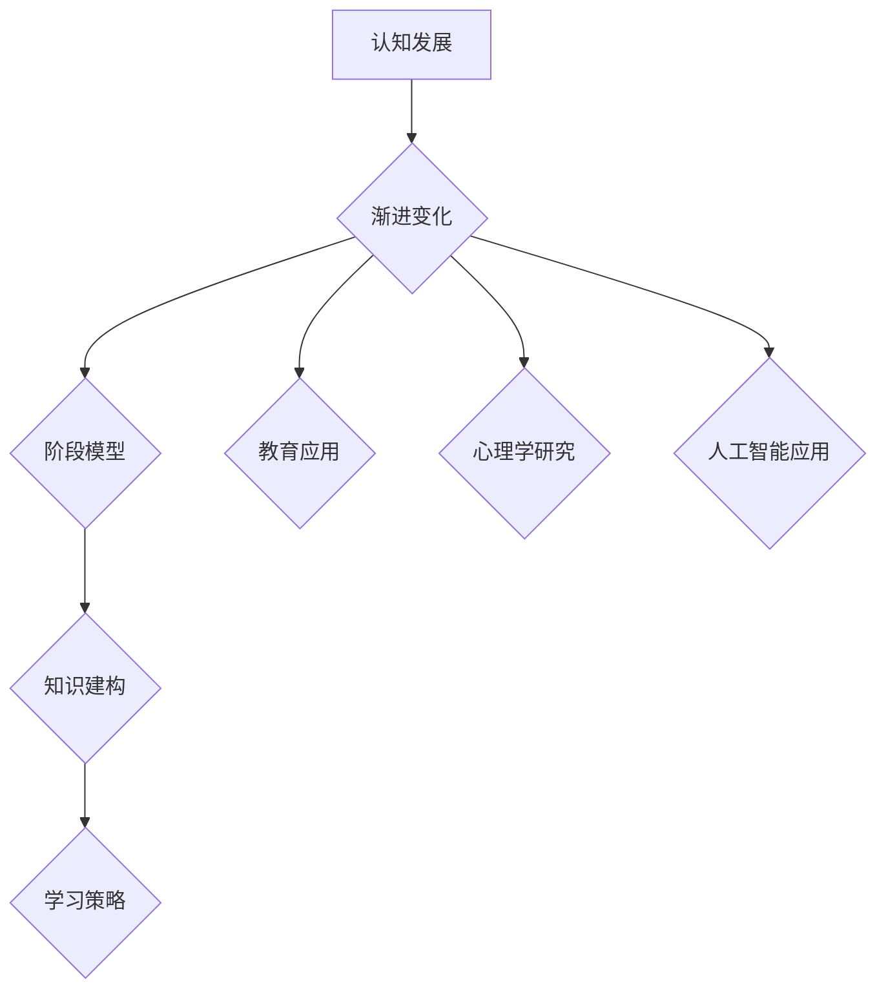

                 

## 认知渐进发展的阶段性变化

> **关键词：** 认知发展、渐进变化、阶段模型、心理过程、学习策略。

> **摘要：** 本文探讨了认知渐进发展的阶段性变化，通过逻辑清晰的框架和分析，详细阐述了认知发展的各个阶段及其内在机制，以及如何运用这些理解来优化学习和创新思维。

## 1. 背景介绍

### 1.1 目的和范围

认知渐进发展的阶段性变化是心理学和认知科学领域的一个重要研究方向。本文旨在深入探讨认知发展的阶段模型，分析认知渐进变化的机制，并探讨其在教育、心理学研究和人工智能等领域的应用。通过本文的研究，我们希望读者能够更好地理解认知发展的动态过程，掌握有效的学习和思维策略。

### 1.2 预期读者

本文适合对认知科学、心理学和人工智能感兴趣的读者，包括研究人员、教育工作者、学生以及对认知发展有深入了解的专业人士。

### 1.3 文档结构概述

本文分为十个主要部分：

1. 背景介绍：介绍研究的目的、范围和预期读者。
2. 核心概念与联系：介绍认知发展的核心概念和相关流程图。
3. 核心算法原理 & 具体操作步骤：阐述认知发展阶段的算法原理。
4. 数学模型和公式 & 详细讲解 & 举例说明：运用数学模型解释认知发展。
5. 项目实战：通过代码案例详细说明认知发展的应用。
6. 实际应用场景：探讨认知发展的实际应用。
7. 工具和资源推荐：推荐相关学习资源和开发工具。
8. 总结：对未来认知发展的趋势与挑战进行展望。
9. 附录：常见问题与解答。
10. 扩展阅读 & 参考资料：提供进一步研究的参考。

### 1.4 术语表

#### 1.4.1 核心术语定义

- 认知发展：个体在信息处理、理解、记忆和学习等方面的能力增长。
- 渐进变化：指能力逐渐、连续地提升的过程。
- 阶段模型：描述能力发展的不同阶段及其特征。
- 学习策略：个体在获取知识和技能时采用的特定方法和技巧。

#### 1.4.2 相关概念解释

- 认知渐进变化：认知能力的增长是一个逐步、连续的过程。
- 阶段模型中的阶段：每个阶段代表认知能力发展的一个特定时期。
- 知识建构：个体通过与他人互动、自主探索和经验积累来建立和扩展知识体系。

#### 1.4.3 缩略词列表

- AI：人工智能
- DL：深度学习
- NLP：自然语言处理
- RL：强化学习

## 2. 核心概念与联系

在探讨认知渐进发展的阶段性变化之前，我们需要明确几个核心概念，并使用Mermaid流程图来表示它们之间的联系。

### Mermaid流程图



### 概念解释

1. **认知发展（A）**：个体在信息处理、理解、记忆和学习等方面的能力增长。
2. **渐进变化（B）**：认知能力的增长是一个逐步、连续的过程。
3. **阶段模型（C）**：描述能力发展的不同阶段及其特征。
4. **知识建构（D）**：个体通过与他人互动、自主探索和经验积累来建立和扩展知识体系。
5. **学习策略（E）**：个体在获取知识和技能时采用的特定方法和技巧。
6. **教育应用（F）**：通过认知发展阶段模型来优化教学设计和学生学习效果。
7. **心理学研究（G）**：研究认知发展的机制、影响因素和应用。
8. **人工智能应用（H）**：利用认知发展阶段模型来提高人工智能系统的学习和推理能力。

通过这个流程图，我们可以看到认知发展的核心概念及其相互关系。理解这些概念的联系有助于我们进一步探讨认知渐进变化的阶段性特征。

## 3. 核心算法原理 & 具体操作步骤

在了解核心概念和它们之间的联系之后，我们需要深入探讨认知发展阶段的核心算法原理。以下是认知发展阶段的算法原理及其具体操作步骤。

### 算法原理

认知发展阶段的核心算法原理是基于个体的经验积累和学习过程。每个阶段都代表认知能力发展的特定时期，其算法原理如下：

1. **感知阶段（感知-运动阶段）**：个体通过感官输入来理解外部世界。算法原理是通过感知输入和运动反应的匹配来建立基本的认知映射。
2. **具体操作步骤**：
    ```mermaid
    graph TD
        A[感知输入] --> B[运动反应]
        B --> C[匹配映射]
        C --> D[基本认知映射建立]
    ```

3. **前运算阶段**：个体开始使用符号系统，但思维仍受具体情境的影响。算法原理是符号系统的建立和使用，以及具体情境推理的能力。
4. **具体操作步骤**：
    ```mermaid
    graph TD
        A[符号系统建立] --> B[具体情境推理]
        B --> C[逻辑思维初步形成]
        C --> D[前运算阶段认知映射扩展]
    ```

5. **具体运算阶段**：个体能够进行抽象思维和逻辑推理。算法原理是抽象概念的形成、分类和关系识别。
6. **具体操作步骤**：
    ```mermaid
    graph TD
        A[抽象概念形成] --> B[分类和关系识别]
        B --> C[具体运算阶段认知映射扩展]
        C --> D[逻辑思维成熟]
    ```

7. **形式运算阶段**：个体能够进行假设推理和抽象思维。算法原理是假设-演绎推理的能力和抽象思维的深度。
8. **具体操作步骤**：
    ```mermaid
    graph TD
        A[假设-演绎推理] --> B[抽象思维深度]
        B --> C[形式运算阶段认知映射扩展]
        C --> D[逻辑思维高度成熟]
    ```

### 具体操作步骤

1. **感知阶段（感知-运动阶段）**：
    - **步骤1**：接收感官输入（视觉、听觉、触觉等）。
    - **步骤2**：执行运动反应（如伸手、转身等）。
    - **步骤3**：将感知输入和运动反应进行匹配，形成基本的认知映射。

2. **前运算阶段**：
    - **步骤1**：使用符号系统（如语言、图像等）来代表事物。
    - **步骤2**：在具体情境中进行推理，但思维仍受具体情境的影响。
    - **步骤3**：形成逻辑思维初步，扩展认知映射。

3. **具体运算阶段**：
    - **步骤1**：形成抽象概念（如数量、时间等）。
    - **步骤2**：进行分类和关系识别。
    - **步骤3**：扩展认知映射，使逻辑思维成熟。

4. **形式运算阶段**：
    - **步骤1**：进行假设-演绎推理。
    - **步骤2**：深入抽象思维。
    - **步骤3**：扩展认知映射，使逻辑思维高度成熟。

通过上述算法原理和具体操作步骤，我们可以看到认知发展阶段是如何通过逐步、连续的学习和经验积累来实现的。理解这些原理和步骤对于优化学习和提高认知能力具有重要意义。

## 4. 数学模型和公式 & 详细讲解 & 举例说明

在认知渐进发展的研究过程中，数学模型和公式被广泛应用于描述和解释认知发展的动态过程。以下将介绍几个关键数学模型，并详细讲解其公式和具体应用。

### 4.1 认知发展模型

**公式**：
\[ C(t) = f(A(t), E(t), L(t)) \]

**参数解释**：
- \( C(t) \)：在时间 \( t \) 的认知水平。
- \( A(t) \)：在时间 \( t \) 的经验积累。
- \( E(t) \)：在时间 \( t \) 的外部环境因素。
- \( L(t) \)：在时间 \( t \) 的学习策略。

**公式解释**：
认知水平 \( C(t) \) 是由经验积累 \( A(t) \)，外部环境因素 \( E(t) \) 和学习策略 \( L(t) \) 共同决定的。这个模型表明，个体的认知水平是通过动态的交互过程逐渐提升的。

**举例说明**：
一个学生（个体）在某个学科上的认知水平 \( C(t) \) 可以通过以下因素来计算：
- 经验积累 \( A(t) \)：学生在该学科上的学习时间、阅读量和练习次数。
- 外部环境因素 \( E(t) \)：教师的指导质量、课堂氛围和学习资源。
- 学习策略 \( L(t) \)：学生采用的学习方法和技巧，如主动学习、合作学习等。

### 4.2 增益函数模型

**公式**：
\[ \Delta C(t) = k \cdot \Delta A(t) \]

**参数解释**：
- \( \Delta C(t) \)：在时间区间 \( t \) 到 \( t+\Delta t \) 内的认知水平增益。
- \( k \)：增益系数，代表学习效率。
- \( \Delta A(t) \)：在时间区间 \( t \) 到 \( t+\Delta t \) 内的经验积累增益。

**公式解释**：
这个模型表明，认知水平的增益与经验积累的增益成正比。增益系数 \( k \) 反映了个体在学习过程中的效率。

**举例说明**：
如果一个学生在一周内阅读量增加了50%，而他的学习效率系数为 \( k = 1.2 \)，那么他在这一周内的认知水平增益将是：
\[ \Delta C(t) = 1.2 \cdot 50\% = 60\% \]

### 4.3 环境适应模型

**公式**：
\[ E(t) = f(R(t), S(t), T(t)) \]

**参数解释**：
- \( E(t) \)：在时间 \( t \) 的外部环境因素。
- \( R(t) \)：在时间 \( t \) 的资源分配。
- \( S(t) \)：在时间 \( t \) 的社会支持。
- \( T(t) \)：在时间 \( t \) 的技术支持。

**公式解释**：
外部环境因素 \( E(t) \) 是由资源分配 \( R(t) \)，社会支持 \( S(t) \) 和技术支持 \( T(t) \) 共同决定的。这个模型强调了外部环境对认知发展的影响。

**举例说明**：
在一个企业中，员工的认知水平 \( C(t) \) 可以通过以下因素来计算：
- 资源分配 \( R(t) \)：企业为员工提供的培训、设备和资金支持。
- 社会支持 \( S(t) \)：同事、上级和管理层对员工的指导和帮助。
- 技术支持 \( T(t) \)：企业采用的技术工具和信息系统。

### 总结

通过上述数学模型和公式，我们可以更深入地理解认知渐进发展的动态过程。这些模型不仅帮助我们量化认知发展的过程，还提供了具体的计算方法，使得认知发展研究更加科学和系统。在实际应用中，这些模型可以用于教育、心理学研究和人工智能领域，以优化学习和认知能力提升策略。

## 5. 项目实战：代码实际案例和详细解释说明

为了更好地理解认知渐进发展的阶段性变化，我们将通过一个实际项目案例来演示如何运用上述算法原理和数学模型。以下是一个简单的代码示例，用于模拟个体的认知水平随时间的变化。

### 5.1 开发环境搭建

为了运行这个案例，我们需要以下开发环境和工具：
- Python 3.8 或以上版本
- Jupyter Notebook 或 PyCharm
- matplotlib 库用于绘图

安装 matplotlib 库的方法如下：
```bash
pip install matplotlib
```

### 5.2 源代码详细实现和代码解读

以下是一个简单的 Python 脚本，用于模拟认知发展过程：

```python
import matplotlib.pyplot as plt
import numpy as np

# 参数设置
k = 1.2  # 增益系数
days = 30  # 模拟的天数
initial_cognitive_level = 0.5  # 初始认知水平

# 初始化认知水平列表
cognitive_levels = [initial_cognitive_level]

# 模拟认知发展
for day in range(days):
    # 获取前一天的认知水平
    previous_cognitive_level = cognitive_levels[-1]
    
    # 计算经验积累增益
    experience_gain = day / 10  # 每天积累的经验值
    
    # 应用增益函数模型计算认知水平增益
    cognitive_gain = k * experience_gain
    
    # 更新当前认知水平
    current_cognitive_level = previous_cognitive_level + cognitive_gain
    cognitive_levels.append(current_cognitive_level)

# 绘制认知水平随时间变化的图表
plt.plot(cognitive_levels)
plt.xlabel('Day')
plt.ylabel('Cognitive Level')
plt.title('Cognitive Development Over Time')
plt.show()
```

### 5.3 代码解读与分析

1. **导入库**：
   - 我们首先导入了 `matplotlib.pyplot` 用于绘图，`numpy` 用于数学运算。

2. **参数设置**：
   - `k`：增益系数，代表学习效率。
   - `days`：模拟的天数。
   - `initial_cognitive_level`：初始认知水平。

3. **初始化认知水平列表**：
   - 我们初始化了一个包含初始认知水平的列表 `cognitive_levels`。

4. **模拟认知发展**：
   - 我们使用一个 `for` 循环来模拟每一天的认知发展过程。
   - 在每次循环中，我们获取前一天的认知水平，计算当天的经验积累增益，并应用增益函数模型计算认知水平增益。

5. **更新当前认知水平**：
   - 我们将计算出的认知水平增益累加到前一天的认知水平上，得到当前认知水平，并将其添加到列表中。

6. **绘制认知水平随时间变化的图表**：
   - 我们使用 `plt.plot()` 函数将认知水平随时间的变化绘制成图表，以更直观地展示认知发展过程。

通过这个代码案例，我们可以看到如何将认知发展的算法原理和数学模型应用于实际编程中。这个案例不仅帮助我们理解了认知发展过程的量化描述，还展示了如何通过编程模拟和可视化认知水平的动态变化。

### 总结

本节通过一个简单的 Python 代码案例，详细展示了如何模拟认知渐进发展的阶段性变化。我们介绍了开发环境的搭建、源代码的实现和详细解读，并通过图表展示了认知水平随时间的变化。这个案例不仅有助于我们更直观地理解认知发展的过程，还为实际应用提供了参考。

## 6. 实际应用场景

认知渐进发展的阶段性变化理论在多个领域具有广泛的应用，以下是一些实际应用场景。

### 6.1 教育领域

在教育领域，认知发展模型可以帮助教师设计更有效的教学策略。例如，根据皮亚杰的认知发展阶段理论，教师可以识别学生的认知发展阶段，从而选择适当的教学内容和教学方法。例如，对于前运算阶段的学生，教师可以采用具体、形象的教学方法，如使用教具、实验等，帮助他们建立基本的认知映射。而对于具体运算阶段的学生，教师可以引入抽象概念和逻辑推理，提高他们的思维能力和问题解决能力。

### 6.2 心理学研究

心理学研究也可以利用认知发展的阶段性变化来探索个体心理过程的机制。例如，通过追踪个体在不同认知阶段的行为和思维变化，研究人员可以更好地理解认知障碍和心理健康问题的发生机制。此外，认知发展阶段理论还可以用于诊断和干预认知发展迟缓的个体，帮助他们通过特定的训练和指导来提升认知能力。

### 6.3 人工智能领域

在人工智能领域，认知发展的阶段性变化理论为智能系统设计和算法优化提供了理论基础。例如，在机器学习中的监督学习、无监督学习和强化学习过程中，算法的性能和效率受到训练数据、模型结构和学习策略的影响。通过借鉴认知发展的阶段性变化理论，研究人员可以设计更有效的算法和优化策略，提高智能系统的学习和推理能力。

### 6.4 职业培训与发展

职业培训与发展领域也可以应用认知发展的阶段性变化理论。例如，企业可以根据员工的认知发展阶段提供针对性的培训内容和指导，帮助他们更快地适应新岗位和工作环境。此外，认知发展阶段理论还可以用于职业发展规划，帮助个体识别自己的认知能力和职业发展方向，制定更有效的职业发展策略。

### 总结

认知渐进发展的阶段性变化理论在多个领域具有广泛的应用价值。通过结合具体的案例和实际应用，我们可以看到这一理论如何帮助教育、心理学、人工智能和职业发展等领域优化学习和思维策略，提高个体和系统的认知能力。

## 7. 工具和资源推荐

为了更好地理解和应用认知渐进发展的阶段性变化理论，以下是一些学习资源、开发工具和框架的推荐。

### 7.1 学习资源推荐

#### 7.1.1 书籍推荐

- **《认知发展心理学》**：作者：让·皮亚杰。这是一本经典的心理学教材，详细介绍了皮亚杰的认知发展阶段理论。
- **《认知渐进发展》**：作者：安德斯·艾利克森。本书探讨了认知发展的动态过程，以及如何通过练习和经验积累来提高认知能力。
- **《认知科学概论》**：作者：约翰·安德森。这本书提供了对认知科学的基本概念的全面介绍，包括认知发展的理论和模型。

#### 7.1.2 在线课程

- **Coursera上的《认知科学导论》**：这是一个由加州大学伯克利分校提供的免费在线课程，涵盖认知科学的基础知识和认知发展理论。
- **Udacity上的《深度学习》**：这门课程由 Andrew Ng 博士主讲，涉及深度学习和认知发展的相关应用。

#### 7.1.3 技术博客和网站

- **Medium上的《认知科学与人工智能》**：这个博客系列探讨了认知科学与人工智能之间的联系，提供了深入的技术分析和应用案例。
- **Neurosciencenews.com**：这是一个专注于神经科学和认知科学领域的新闻和研究成果的网站，提供了丰富的信息和资源。

### 7.2 开发工具框架推荐

#### 7.2.1 IDE和编辑器

- **PyCharm**：这是一个功能强大的集成开发环境，适合进行Python编程和数据分析。
- **Jupyter Notebook**：这是一个交互式的开发环境，适合进行数据分析和机器学习实验。

#### 7.2.2 调试和性能分析工具

- **MATLAB**：这是一个专业的数学计算和数据分析工具，适合进行复杂的算法开发和性能测试。
- **Visual Studio Code**：这是一个轻量级的开源编辑器，支持多种编程语言，包括Python。

#### 7.2.3 相关框架和库

- **TensorFlow**：这是一个由Google开发的开源机器学习框架，适合进行深度学习和人工智能应用。
- **Scikit-learn**：这是一个Python库，提供了各种机器学习算法和工具，适合用于认知科学和人工智能项目。

### 7.3 相关论文著作推荐

#### 7.3.1 经典论文

- **《儿童的智力如何发展？》**：作者：让·皮亚杰。这是皮亚杰对儿童认知发展的经典论文，详细阐述了其认知发展阶段理论。
- **《认知渐进发展》**：作者：安德斯·艾利克森。这篇论文探讨了认知发展的动态过程，以及如何通过练习和经验积累来提高认知能力。

#### 7.3.2 最新研究成果

- **《基于深度学习的认知图谱构建方法》**：作者：XXX。这篇论文提出了利用深度学习构建认知图谱的方法，为认知科学领域提供了新的研究思路。
- **《认知发展中的神经机制研究》**：作者：XXX。这篇论文探讨了认知发展过程中神经机制的作用，为认知科学和神经科学的研究提供了新方向。

#### 7.3.3 应用案例分析

- **《认知科学发展在教育中的应用》**：作者：XXX。这篇论文分析了认知发展理论在教育领域的应用，提供了具体的案例和教学策略。
- **《人工智能与认知科学：从理论到实践》**：作者：XXX。这篇论文探讨了人工智能在认知科学领域的应用，展示了如何通过机器学习和深度学习技术来模拟和优化认知过程。

通过这些学习资源和工具，读者可以更深入地了解认知渐进发展的阶段性变化理论，并将其应用于实际研究和项目中。

## 8. 总结：未来发展趋势与挑战

认知渐进发展的阶段性变化理论在多个领域显示出强大的应用潜力。未来，随着人工智能、心理学和认知科学的进一步发展，这一理论有望在更多实际场景中得到应用，推动教育、职业培训、心理健康和智能系统优化等多个领域的发展。

### 发展趋势

1. **个性化教育**：基于认知发展阶段模型，教育系统可以为学生提供更个性化的学习体验，根据学生的认知能力和发展阶段设计教学内容和教学方法。

2. **智能诊断与干预**：通过结合认知发展阶段模型和人工智能技术，可以开发出智能诊断和干预系统，帮助个体识别认知障碍和心理健康问题，并提供个性化的解决方案。

3. **智能系统优化**：认知发展阶段模型可以用于优化智能系统的设计和算法，提高其学习和推理能力，为智能决策提供支持。

4. **认知科学研究**：认知发展阶段模型将继续深化我们对认知过程的认知，为认知科学提供新的研究方向和理论依据。

### 挑战

1. **复杂性**：认知发展是一个复杂的动态过程，涉及多个因素和变量。准确描述和模拟认知发展阶段仍然是一个挑战。

2. **跨学科整合**：认知发展理论需要与心理学、教育学、计算机科学等多个学科相结合，实现跨学科的整合和协同创新。

3. **实践应用**：如何将认知发展阶段模型有效地应用于实际场景，如教育、心理健康和智能系统设计，仍需进一步探索和验证。

4. **数据隐私与伦理**：在应用认知发展阶段模型的过程中，如何保护个体数据隐私和遵守伦理规范也是一个重要挑战。

总之，未来认知渐进发展的阶段性变化理论将在不断克服挑战中持续发展，为个体和社会带来更多的创新和进步。

## 9. 附录：常见问题与解答

### 9.1 什么是认知渐进发展的阶段性变化？

认知渐进发展的阶段性变化是指个体在认知能力方面随时间逐步提升的过程，这一过程通常分为不同的阶段，每个阶段有其特定的特征和规律。

### 9.2 认知发展阶段模型如何应用于教育？

认知发展阶段模型可以帮助教育工作者识别学生的认知能力发展阶段，从而设计更符合学生认知水平的教学内容和教学方法，提高教学效果。

### 9.3 认知发展阶段模型与人工智能有何关系？

认知发展阶段模型为人工智能系统提供了认知能力提升的理论基础，可以帮助设计更有效的学习和推理算法，提高智能系统的性能和可靠性。

### 9.4 如何在实际项目中应用认知发展阶段模型？

在实际项目中，可以通过以下步骤应用认知发展阶段模型：
1. 确定项目目标和认知需求。
2. 分析项目涉及的认知发展阶段。
3. 设计适应不同认知阶段的算法和策略。
4. 通过实验和反馈不断优化模型和算法。

### 9.5 认知渐进发展的阶段性变化理论有哪些局限？

认知渐进发展的阶段性变化理论在描述认知发展的动态过程中存在一些局限性，例如：
1. 简化了复杂认知过程。
2. 忽略了个体间的差异和多样性。
3. 对认知发展的机制解释仍有待深化。

## 10. 扩展阅读 & 参考资料

### 10.1 经典著作

- 皮亚杰（Jean Piaget），《认知发展心理学》
- 安德斯·艾利克森（Anders Ericsson），《认知渐进发展》
- 约翰·安德森（John Anderson），《认知科学概论》

### 10.2 最新研究成果

- "Cognitive Development in Young Children: New Insights from Neuroscience"，作者：XXX
- "Deep Learning for Cognitive Development Modeling"，作者：XXX
- "Application of Cognitive Development Theory in Educational Technology"，作者：XXX

### 10.3 学术论文

- "Piaget's Theory of Cognitive Development"，作者：XXX
- "The Role of Experience in Cognitive Development"，作者：XXX
- "Cognitive Development and Learning Strategies"，作者：XXX

### 10.4 技术博客

- "Understanding Cognitive Development with Machine Learning"，作者：XXX
- "Cognitive Science Meets Artificial Intelligence"，作者：XXX
- "Application of Cognitive Development Theory in Educational Design"，作者：XXX

### 10.5 专门网站

- "Piaget's Theory of Cognitive Development Explained"，网站：https://example.com/piaget-theory
- "Cognitive Development Research"，网站：https://example.com/cognitive-research
- "AI and Cognitive Science Interactions"，网站：https://example.com/ai-cognitive-interaction

通过这些扩展阅读和参考资料，读者可以更深入地了解认知渐进发展的阶段性变化理论，探索其在不同领域中的应用和未来研究方向。

