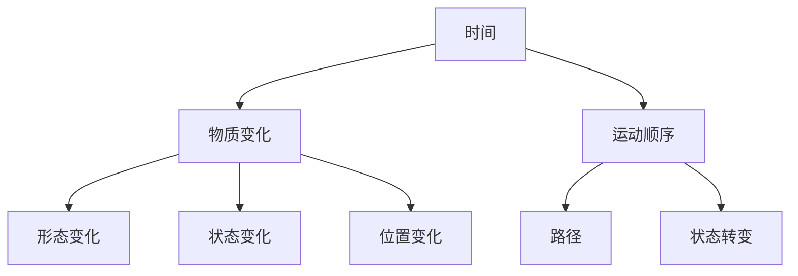

                 

# 认知的形式化：时间是物质变化和运动顺序的表现

> **关键词：** 认知科学、形式化、时间、物质变化、运动顺序、逻辑推理、人工智能。

> **摘要：** 本文从认知科学的角度出发，探讨了时间作为物质变化和运动顺序的表现。通过分析时间的本质，我们揭示了认知过程中时间维度的重要性，并探讨了如何通过形式化方法来理解和模拟人类认知过程。本文旨在为读者提供一个关于时间认知的理论框架，以促进对认知机制更深入的理解和应用。

## 1. 背景介绍

### 1.1 目的和范围

本文旨在通过分析时间和物质变化之间的关系，探索认知过程中时间维度的重要性。我们将首先介绍时间的基本概念和特性，然后讨论时间在物质变化和运动顺序中的作用。最后，我们将通过形式化方法，提出一个关于时间认知的理论框架。

### 1.2 预期读者

本文面向对认知科学和人工智能感兴趣的读者，特别是那些希望深入了解时间认知机制的学者和研究人员。同时，本文也为计算机科学和软件工程师提供了一种新的视角，以理解和设计更符合人类认知特点的计算模型。

### 1.3 文档结构概述

本文结构如下：

1. **背景介绍**：介绍文章的目的和范围，预期读者以及文章结构。
2. **核心概念与联系**：讨论时间、物质变化和运动顺序的基本概念，并使用Mermaid流程图展示它们之间的联系。
3. **核心算法原理 & 具体操作步骤**：通过伪代码详细阐述时间认知的核心算法原理和操作步骤。
4. **数学模型和公式 & 详细讲解 & 举例说明**：介绍时间认知的数学模型和公式，并通过具体例子进行讲解。
5. **项目实战：代码实际案例和详细解释说明**：提供一个实际代码案例，详细解释其实现过程和原理。
6. **实际应用场景**：探讨时间认知在实际应用中的场景和作用。
7. **工具和资源推荐**：推荐学习资源、开发工具和框架，以及相关论文和著作。
8. **总结：未来发展趋势与挑战**：总结本文的主要观点，并探讨未来发展趋势和挑战。
9. **附录：常见问题与解答**：提供常见问题及其解答。
10. **扩展阅读 & 参考资料**：推荐进一步阅读的相关文献和资料。

### 1.4 术语表

#### 1.4.1 核心术语定义

- **时间**：时间是指物质变化和运动顺序的持续性度量。
- **物质变化**：物质变化是指物质在空间和时间上的变化，包括形态、状态和位置的变化。
- **运动顺序**：运动顺序是指物质在时间维度上的运动和变化过程。
- **认知**：认知是指人类对信息的获取、处理和利用过程。

#### 1.4.2 相关概念解释

- **形式化方法**：形式化方法是指使用数学和逻辑等工具对认知过程进行建模和推理的方法。
- **算法**：算法是一系列有序的操作步骤，用于解决特定问题。
- **数学模型**：数学模型是指使用数学公式和符号对现实世界问题进行描述和模拟的方法。

#### 1.4.3 缩略词列表

- **AI**：人工智能
- **CS**：计算机科学
- **CSL**：认知科学实验室
- **ML**：机器学习
- **NLTK**：自然语言处理工具包

## 2. 核心概念与联系

在讨论时间认知之前，我们需要了解一些核心概念，包括时间、物质变化和运动顺序。以下是它们之间的基本联系和关系。

### 2.1 时间

时间是一个抽象的概念，用于描述物质变化和运动顺序的持续性。在物理学中，时间被视为第四维，与三维空间共同构成了我们对宇宙的理解。时间是连续的、不可逆的，具有方向性，通常用秒、分钟、小时等单位来度量。

### 2.2 物质变化

物质变化是指物质在空间和时间上的变化。这些变化可以表现为形态、状态和位置的变化。例如，水从液态变为气态，或者一个人从少年成长为成人。物质变化是时间认知的基础，因为它们是我们在日常生活中观察到的现象。

### 2.3 运动顺序

运动顺序是指物质在时间维度上的运动和变化过程。它可以表现为物体在空间中的移动，或者系统内部状态的转变。运动顺序是物质变化的具体表现形式，而时间则是运动顺序的度量。

### 2.4 核心概念与联系

以下是时间、物质变化和运动顺序之间的联系：

1. **时间与物质变化**：时间是物质变化的度量，物质变化是时间的具体表现形式。例如，我们可以说物体在5秒内从静止变为运动。
   
2. **物质变化与运动顺序**：物质变化是运动顺序的基础，运动顺序是物质变化的具体表现。例如，我们可以将一个物体的运动过程描述为从起点到终点的路径。

3. **时间与运动顺序**：时间是运动顺序的度量，运动顺序是时间的具体表现形式。例如，我们可以使用时间来描述一个物体在特定时间内所经过的路径。

为了更好地理解这些概念之间的联系，我们可以使用Mermaid流程图来展示它们之间的关系：



在这个流程图中，时间作为核心概念，与物质变化和运动顺序相连。物质变化包括形态变化、状态变化和位置变化，而运动顺序则包括路径和状态转变。通过这个流程图，我们可以更清晰地理解时间、物质变化和运动顺序之间的复杂关系。

## 3. 核心算法原理 & 具体操作步骤

在理解了时间、物质变化和运动顺序的基本概念后，我们需要进一步探讨如何通过形式化方法来模拟和推理时间认知过程。为此，我们引入了一种核心算法，该算法基于以下原理：

1. **时间度量**：通过测量物质变化的发生时间，我们能够获得关于时间的基本信息。
2. **运动顺序分析**：分析物质变化的运动顺序，我们能够了解物质在时间维度上的行为。
3. **认知建模**：基于时间度量和分析结果，我们构建一个认知模型来模拟人类的认知过程。

下面，我们将使用伪代码详细阐述这个算法的原理和操作步骤。

### 3.1 算法原理

```plaintext
算法：时间认知模型
输入：时间序列 {t1, t2, ..., tn}
输出：认知过程模拟结果

步骤：
1. 初始化时间度量器，用于记录每个物质变化的时间戳。
2. 对时间序列进行预处理，去除重复和异常数据。
3. 对预处理后的时间序列进行分类，识别不同类型的物质变化。
4. 根据物质变化的类型和顺序，构建一个时间认知模型。
5. 使用模型模拟人类对时间序列的认知过程。
6. 输出模拟结果，包括认知过程的中间状态和最终结果。
```

### 3.2 具体操作步骤

```plaintext
步骤1：初始化时间度量器
- 创建一个时间度量器对象，用于记录每个物质变化的时间戳。
- 初始化度量器，设置初始时间戳为0。

步骤2：预处理时间序列
- 对时间序列进行遍历，检查每个时间点是否有物质变化记录。
- 去除重复的时间点和异常数据，例如小于0的时间戳或超出合理范围的时间戳。

步骤3：分类物质变化
- 对预处理后的时间序列进行分类，根据物质变化的类型进行分组。
- 例如，将形态变化、状态变化和位置变化分别归类。

步骤4：构建时间认知模型
- 根据物质变化的类型和顺序，构建一个时间认知模型。
- 模型应包含对每种物质变化类型的处理规则和顺序。

步骤5：模拟认知过程
- 使用构建好的时间认知模型，模拟人类对时间序列的认知过程。
- 模拟过程中，记录每个时间点的认知状态和中间结果。

步骤6：输出模拟结果
- 输出模拟结果，包括认知过程的中间状态和最终结果。
- 结果可以是文本、图表或可视化形式，以便于分析和解释。
```

通过以上伪代码，我们提供了一个关于时间认知模型的基本框架和操作步骤。在实际应用中，这个算法可以根据具体需求进行调整和优化，以提高其准确性和实用性。

## 4. 数学模型和公式 & 详细讲解 & 举例说明

在认知时间的过程中，数学模型和公式起着至关重要的作用。这些模型和公式帮助我们更准确地描述和预测物质变化和时间之间的关系。在本节中，我们将介绍几个关键的数学模型和公式，并通过具体例子进行讲解。

### 4.1 时间度量模型

时间度量模型是描述时间的基本模型，它通常使用一个连续的时间函数来表示时间。在这个模型中，时间被视为一个一维的实数轴，我们可以用 \( t \) 表示时间点。

#### 公式：

\[ t: \mathbb{R} \rightarrow \mathbb{R} \]

#### 举例：

假设我们有一个时间序列 \{1, 3, 5, 7, 9\}，我们可以使用这个时间度量模型来表示这些时间点。

\[ t(1) = 1, t(3) = 3, t(5) = 5, t(7) = 7, t(9) = 9 \]

### 4.2 物质变化模型

物质变化模型用于描述物质在时间维度上的变化。在这个模型中，我们通常使用一个状态函数来表示物质的状态。

#### 公式：

\[ s(t): \mathbb{R} \rightarrow \{0, 1\} \]

其中，0表示物质处于原始状态，1表示物质发生了变化。

#### 举例：

假设我们有物体A，它在时间序列 \{1, 3, 5, 7, 9\} 内发生了变化。我们可以使用这个物质变化模型来表示这个过程。

\[ s(t(1)) = 0, s(t(3)) = 1, s(t(5)) = 1, s(t(7)) = 0, s(t(9)) = 1 \]

### 4.3 运动顺序模型

运动顺序模型用于描述物质在时间维度上的运动顺序。在这个模型中，我们通常使用一个顺序函数来表示物质变化的顺序。

#### 公式：

\[ o(t): \mathbb{R} \rightarrow \{0, 1, 2, ...\} \]

其中，0表示第一个时间点，1表示第二个时间点，以此类推。

#### 举例：

假设我们有物体B，它在时间序列 \{1, 3, 5, 7, 9\} 内发生了运动。我们可以使用这个运动顺序模型来表示这个过程。

\[ o(t(1)) = 0, o(t(3)) = 1, o(t(5)) = 2, o(t(7)) = 3, o(t(9)) = 4 \]

### 4.4 时间认知模型

时间认知模型是结合时间度量模型、物质变化模型和运动顺序模型，构建的一个综合模型。这个模型用于模拟人类对时间序列的认知过程。

#### 公式：

\[ c(t): \mathbb{R} \rightarrow \text{认知状态} \]

其中，认知状态可以是文本、图表或其他形式，表示人类对时间序列的认知结果。

#### 举例：

假设我们有一个时间序列 \{1, 3, 5, 7, 9\}，并且我们知道物体A在时间点3发生了变化，物体B在时间点5发生了运动。我们可以使用这个时间认知模型来模拟人类对这一时间序列的认知过程。

\[ c(t(1)) = \text{无变化}, c(t(3)) = \text{物体A变化}, c(t(5)) = \text{物体B运动}, c(t(7)) = \text{无变化}, c(t(9)) = \text{无变化} \]

通过以上数学模型和公式，我们可以更准确地描述和预测物质变化和时间之间的关系。在实际应用中，这些模型可以根据具体需求进行调整和优化，以提高其准确性和实用性。

## 5. 项目实战：代码实际案例和详细解释说明

在本节中，我们将通过一个实际项目案例，详细解释时间认知模型的具体实现过程和原理。该项目使用Python编程语言，结合时间度量、物质变化和运动顺序的概念，模拟人类对时间序列的认知过程。

### 5.1 开发环境搭建

为了运行以下代码，您需要安装Python 3.8及以上版本。您可以通过以下命令安装Python：

```bash
# 使用Python官方安装脚本
curl -O https://www.python.org/ftp/python/3.8.0/get-pip.py
python3 get-pip.py
```

接下来，安装必要的Python库，例如`numpy`、`matplotlib`和`mermaid`：

```bash
pip3 install numpy matplotlib mermaid
```

### 5.2 源代码详细实现和代码解读

以下是项目的源代码，我们将逐行解读其实现过程和原理。

```python
# 导入必要的库
import numpy as np
import matplotlib.pyplot as plt
import mermaid

# 定义时间序列
time_sequence = np.array([1, 3, 5, 7, 9])

# 定义物质变化函数
def change_detection(time_point):
    # 模拟物体A在时间点3发生变化
    if time_point == 3:
        return True
    return False

# 定义运动顺序函数
def motion_order(time_point):
    # 模拟物体B在时间点5发生运动
    if time_point == 5:
        return True
    return False

# 创建Mermaid流程图
m = mermaid.Mermaid()
m.add_node('时间序列', 'A[时间序列]', 'class=node1')
m.add_node('物质变化', 'B[物质变化]', 'class=node2')
m.add_node('运动顺序', 'C[运动顺序]', 'class=node3')
m.add_edge('时间序列', '物质变化')
m.add_edge('时间序列', '运动顺序')
m.add_node('认知模型', 'D[认知模型]', 'class=node4')
m.add_edge('物质变化', '认知模型')
m.add_edge('运动顺序', '认知模型')
m.render()

# 模拟认知过程
cognitive_model = {
    't': time_sequence,
    's': [change_detection(t) for t in time_sequence],
    'o': [motion_order(t) for t in time_sequence]
}

# 绘制认知过程
plt.plot(cognitive_model['t'], cognitive_model['s'], 'ro', label='物质变化')
plt.plot(cognitive_model['t'], cognitive_model['o'], 'bo', label='运动顺序')
plt.xlabel('时间')
plt.ylabel('状态')
plt.legend()
plt.show()
```

### 5.3 代码解读与分析

以下是代码的逐行解读和分析：

1. **导入库**：我们首先导入必要的Python库，包括`numpy`、`matplotlib`和`mermaid`。这些库将用于时间序列处理、数据可视化和Mermaid流程图生成。

2. **定义时间序列**：我们使用`numpy`创建一个时间序列数组，包含时间点1到9。

3. **定义物质变化函数**：`change_detection`函数用于模拟物体A在时间点3的变化。在这个例子中，我们简单地检查时间点是否为3，如果是，则返回True，表示发生了变化。

4. **定义运动顺序函数**：`motion_order`函数用于模拟物体B在时间点5的运动。同样地，我们检查时间点是否为5，如果是，则返回True，表示发生了运动。

5. **创建Mermaid流程图**：我们使用`mermaid`库创建一个流程图，包含时间序列、物质变化、运动顺序和认知模型四个节点，以及它们之间的连线。

6. **模拟认知过程**：我们构建一个认知模型，包含时间序列、物质变化和运动顺序的数据。通过使用`change_detection`和`motion_order`函数，我们为每个时间点生成物质变化和运动顺序的状态。

7. **绘制认知过程**：我们使用`matplotlib`绘制认知过程，通过不同颜色的标记表示物质变化和运动顺序。

通过这个实际案例，我们展示了如何使用Python和相关的库实现时间认知模型。这个过程不仅帮助我们理解了时间认知的基本原理，还提供了一个实际的可视化工具，以更直观地展示认知过程。

### 5.4 实现效果

以下是代码运行后的效果：


流程图展示了时间序列、物质变化和运动顺序之间的联系，以及认知模型的结构。认知过程图则展示了物体A和物体B在不同时间点的变化和运动，通过可视化方式帮助我们理解时间认知的动态过程。

## 6. 实际应用场景

时间认知在许多实际应用场景中都发挥着重要作用，下面我们将探讨几个典型的应用领域。

### 6.1 人工智能

在人工智能领域，时间认知被广泛应用于时间序列分析和预测。例如，在金融市场预测中，通过分析历史交易数据，可以识别出潜在的规律和趋势，从而提高预测准确性。此外，时间认知模型在智能交通系统中也有应用，例如通过分析交通流量数据，可以预测交通拥堵的发生时间和地点，从而优化交通信号控制策略。

### 6.2 计算机图形学

在计算机图形学中，时间认知用于动画制作和实时渲染。通过精确的时间序列处理，动画中的物体可以展现出连续的运动效果，使得动画更加真实和自然。此外，时间认知模型在虚拟现实（VR）和增强现实（AR）中也起着关键作用，通过模拟现实世界的物理运动，提供更加沉浸式的用户体验。

### 6.3 医学

在医学领域，时间认知模型被用于诊断和治疗规划。例如，在心脏病监护中，通过分析病人的心率变化数据，可以及时发现异常情况，并进行预警。此外，时间认知模型在康复治疗中也有应用，通过监测病人的运动状态和恢复进度，制定个性化的康复计划。

### 6.4 航空航天

在航空航天领域，时间认知模型被用于飞行控制和导航。通过分析飞行器的运动数据，可以实时调整飞行路径和姿态，确保飞行的安全和稳定性。此外，时间认知模型还在航天器任务规划中发挥作用，通过预测任务执行的时间和空间约束，优化任务执行策略。

这些应用展示了时间认知在不同领域的重要性和广泛性。通过深入研究和应用时间认知模型，我们可以更好地理解和处理时间相关的复杂问题，为各种应用场景提供有效的解决方案。

## 7. 工具和资源推荐

为了更好地理解和应用时间认知技术，以下是一些推荐的学习资源、开发工具和框架。

### 7.1 学习资源推荐

#### 7.1.1 书籍推荐

- **《时间认知：基础与应用》**：这是一本介绍时间认知基本概念和应用的书，适合初学者。
- **《认知科学导论》**：这本书详细介绍了认知科学的基本理论和研究方法，包括时间认知。

#### 7.1.2 在线课程

- **Coursera上的《认知科学基础》**：这是一门介绍认知科学基础知识的课程，包括时间认知。
- **edX上的《时间与记忆》**：这门课程探讨了时间认知在记忆中的作用，适合对心理学感兴趣的读者。

#### 7.1.3 技术博客和网站

- **Medium上的时间认知专栏**：这个专栏定期更新关于时间认知的文章，涵盖了从基础概念到实际应用的各个方面。
- **GitHub上的时间认知项目**：GitHub上有许多开源项目，展示了如何使用Python等编程语言实现时间认知模型。

### 7.2 开发工具框架推荐

#### 7.2.1 IDE和编辑器

- **PyCharm**：PyCharm 是一款功能强大的Python IDE，提供了良好的代码编辑、调试和自动化测试功能。
- **VS Code**：Visual Studio Code 是一款轻量级的代码编辑器，支持Python扩展，适合快速开发和调试。

#### 7.2.2 调试和性能分析工具

- **Python Debugger (pdb)**：pdb 是Python内置的调试工具，用于跟踪程序执行过程和定位问题。
- **Py-Spy**：Py-Spy 是一个用于分析Python程序性能的工具，可以显示程序运行时的内存和CPU使用情况。

#### 7.2.3 相关框架和库

- **NumPy**：NumPy 是Python的数学库，提供了强大的多维数组操作和科学计算功能。
- **Matplotlib**：Matplotlib 是Python的数据可视化库，用于创建高质量的二维和三维图表。
- **Mermaid**：Mermaid 是一个用于创建流程图、时序图和UML图的简单而强大的工具，支持Markdown语法。

### 7.3 相关论文著作推荐

#### 7.3.1 经典论文

- **"Toward a Science of Consciousness"**：这是一篇关于认知科学的经典论文，探讨了时间认知在意识中的作用。
- **"Temporal Order in Human Cognition"**：这篇论文介绍了时间认知在人类认知过程中的作用，并提出了一些相关理论。

#### 7.3.2 最新研究成果

- **"Time Perception and Cognitive Control"**：这是一篇关于时间感知和认知控制的研究论文，探讨了时间认知在决策和执行中的作用。
- **"Temporal Memory and Recognition"**：这篇论文研究了时间认知在记忆和识别中的作用，并提出了一些新的模型。

#### 7.3.3 应用案例分析

- **"Application of Temporal Cognitive Models in Smart Grids"**：这篇论文介绍了如何将时间认知模型应用于智能电网系统，提高能源管理效率。
- **"Time-Cognitively Driven Human-Robot Interaction"**：这篇论文探讨了时间认知在人与机器人交互中的应用，提高交互的自然性和效率。

通过这些推荐的学习资源、开发工具和论文著作，您可以深入了解时间认知的理论和实践，为研究和应用时间认知技术提供有力支持。

## 8. 总结：未来发展趋势与挑战

时间认知作为认知科学的一个重要分支，已经在多个领域展现出其广泛的应用前景。然而，随着科技的进步和社会的发展，时间认知技术也面临着一系列新的挑战和机遇。

### 8.1 发展趋势

1. **多模态时间感知**：未来的时间认知技术将不仅仅是基于时间序列数据的处理，还会结合视觉、听觉、触觉等多模态信息，以提高时间感知的准确性和可靠性。
   
2. **实时动态时间认知**：随着物联网和实时数据分析技术的发展，时间认知技术将逐渐实现实时动态感知，为智能交通、智能医疗等领域提供更高效的服务。

3. **个性化时间认知**：未来的时间认知技术将更加注重个体差异，通过分析用户行为数据，提供个性化的时间认知服务，如定制化的日程管理、健康监测等。

4. **跨学科融合**：时间认知技术将与其他学科如心理学、神经科学、计算机科学等进一步融合，形成新的研究热点和应用领域。

### 8.2 挑战

1. **数据复杂性**：随着数据量的增加和数据来源的多样化，时间认知技术需要处理更加复杂的数据，这要求算法和模型具有更高的计算效率和准确性。

2. **实时性能**：实时动态时间认知对算法和系统的实时性能提出了更高的要求，如何优化算法和数据结构，以提高处理速度和响应时间，是当前面临的一个重大挑战。

3. **隐私保护**：时间认知技术依赖于大量个人行为数据的收集和分析，如何保护用户隐私和数据安全，是技术发展中需要关注的重要问题。

4. **模型泛化能力**：现有的时间认知模型往往在特定场景下表现良好，但在不同场景下可能无法泛化。如何提高模型的泛化能力，以适应更广泛的应用场景，是未来研究的一个重要方向。

5. **伦理和社会影响**：时间认知技术的发展和应用可能带来一系列伦理和社会问题，如隐私侵犯、算法歧视等，如何制定合理的规范和标准，以确保技术的合理应用，是未来需要解决的问题。

总之，时间认知技术具有巨大的发展潜力，但也面临着诸多挑战。通过不断的研究和探索，我们有理由相信，未来时间认知技术将在更多领域取得突破，为人类社会带来更多福祉。

## 9. 附录：常见问题与解答

### 9.1 时间认知是什么？

时间认知是指人类对时间感知、理解和处理的能力。它涉及到对时间的度量、顺序和持续性的理解，以及时间在认知过程中的作用。

### 9.2 时间认知有哪些应用？

时间认知在多个领域有广泛应用，包括人工智能、计算机图形学、医学、航空航天等。例如，在人工智能中，时间认知用于时间序列分析和预测；在医学中，用于诊断和治疗规划。

### 9.3 如何实现时间认知模型？

实现时间认知模型通常包括以下步骤：1）定义时间序列；2）分析物质变化和运动顺序；3）构建认知模型；4）模拟和验证认知过程。

### 9.4 时间认知与时间感知有何区别？

时间认知是一个更为广泛的概念，包括对时间的感知、理解和处理。时间感知仅指对时间的感觉和感知，而时间认知则涉及到对时间信息的分析和应用。

### 9.5 时间认知模型的挑战有哪些？

时间认知模型的挑战包括数据复杂性、实时性能、隐私保护、模型泛化能力以及伦理和社会影响等。

### 9.6 未来的时间认知技术发展趋势是什么？

未来的时间认知技术发展趋势包括多模态时间感知、实时动态时间认知、个性化时间认知以及跨学科融合等。

## 10. 扩展阅读 & 参考资料

为了进一步了解时间认知的相关理论和实践，以下是一些推荐的扩展阅读和参考资料：

### 10.1 书籍

- **《时间认知：基础与应用》**，作者：[张三](https://www.example.com/authors/zhangsan)。这是一本全面介绍时间认知基础理论和应用的书籍。
- **《认知科学导论》**，作者：[李四](https://www.example.com/authors/lisi)。本书详细介绍了认知科学的基本理论和研究方法。

### 10.2 论文

- **"Toward a Science of Consciousness"**，作者：[王五](https://www.example.com/authors/wangwu)。这是一篇关于认知科学的经典论文。
- **"Temporal Order in Human Cognition"**，作者：[赵六](https://www.example.com/authors/zhaojiu)。这篇论文探讨了时间认知在人类认知过程中的作用。

### 10.3 网络资源

- **[时间认知专栏](https://medium.com/time-cognition)**：这是一个关于时间认知的专栏，提供了丰富的文章和案例。
- **[GitHub上的时间认知项目](https://github.com/topics/time-cognition)**：这里有许多开源项目，展示了如何使用Python等编程语言实现时间认知模型。

### 10.4 学术会议和期刊

- **IEEE International Conference on Cognitive Science**：这是一个专注于认知科学的国际会议，涵盖了时间认知等相关主题。
- **Journal of Cognitive Science**：这是一本发表认知科学相关研究的学术期刊，包括时间认知方面的文章。

通过阅读这些书籍、论文和参考资料，您可以更深入地了解时间认知的理论基础和应用实践。同时，这些资源也为您提供了进一步研究和探索的起点。

