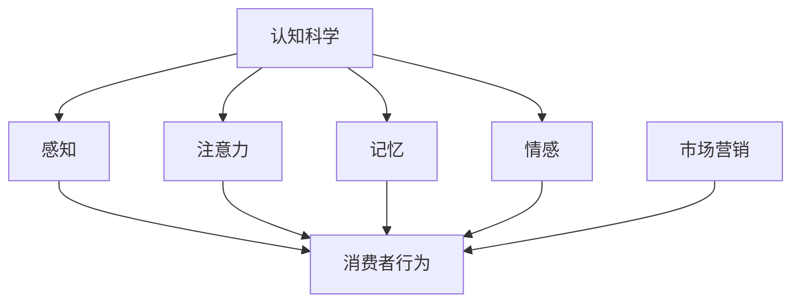

                 

### 1. 背景介绍

#### 1.1 目的和范围

本文旨在探讨认知科学与市场营销的交叉领域，解析消费者行为，并阐述如何在市场营销策略中融入认知科学的理论和方法。通过深入理解消费者的认知过程，营销人员可以更精准地制定营销策略，提升营销效果。

本文将涵盖以下内容：
- **核心概念与联系**：介绍认知科学、市场营销及消费者行为的相关概念，使用Mermaid流程图展示它们之间的联系。
- **核心算法原理与操作步骤**：详细阐述用于分析消费者行为的核心算法原理，并使用伪代码展示具体操作步骤。
- **数学模型与公式**：介绍用于消费者行为分析的相关数学模型和公式，并通过具体例子进行说明。
- **项目实战**：提供一个实际案例，展示如何运用所学理论进行消费者行为分析，并详细解释代码实现。
- **实际应用场景**：讨论消费者行为分析在市场营销中的具体应用场景。
- **工具和资源推荐**：推荐相关学习资源和开发工具，帮助读者深入学习与实践。
- **总结**：展望消费者行为分析领域的发展趋势和未来挑战。

#### 1.2 预期读者

本文适合以下读者群体：
- **市场营销专业人士**：希望提升营销策略效果的营销经理、产品经理和营销分析师。
- **数据科学家和分析师**：对消费者行为分析有兴趣，希望将认知科学引入数据分析的数据科学家和分析师。
- **计算机科学和心理学专业学生**：对认知科学和市场营销交叉领域感兴趣的学生。
- **研究人员和学者**：对消费者行为分析的理论和实践方法进行深入研究的研究人员。

#### 1.3 文档结构概述

本文采用以下结构进行组织：
1. **背景介绍**：介绍本文的目的、范围、预期读者和文档结构。
2. **核心概念与联系**：介绍核心概念，展示它们之间的联系。
3. **核心算法原理与操作步骤**：详细阐述核心算法原理，并使用伪代码展示操作步骤。
4. **数学模型与公式**：介绍数学模型和公式，并通过具体例子进行说明。
5. **项目实战**：提供实际案例，展示如何运用所学理论进行消费者行为分析。
6. **实际应用场景**：讨论消费者行为分析在市场营销中的具体应用场景。
7. **工具和资源推荐**：推荐学习资源和开发工具。
8. **总结**：展望消费者行为分析领域的发展趋势和未来挑战。
9. **附录**：提供常见问题与解答。
10. **扩展阅读与参考资料**：推荐相关文献和资源。

#### 1.4 术语表

在本文中，我们将使用以下术语：
- **认知科学**：研究人类思维、感知、记忆和决策过程的学科。
- **市场营销**：企业为满足消费者需求而进行的产品或服务的推广和销售活动。
- **消费者行为**：消费者在购买、使用和评估产品或服务时的行为模式。
- **消费者决策过程**：消费者从意识到需求到购买决策的整个过程。
- **感知**：个体接收并解释外部信息的心理过程。
- **记忆**：个体存储和回忆信息的能力。
- **注意力**：个体对特定信息的选择性关注。
- **情感**：个体对事物的情绪反应。
- **算法**：解决问题的一系列规则或步骤。
- **机器学习**：一种人工智能领域，通过数据和统计方法使计算机具有自主学习和决策能力。

#### 1.4.1 核心术语定义

- **消费者行为分析**：通过数据收集、处理和分析，研究消费者的购买行为、消费习惯和偏好，以指导营销决策。
- **认知建模**：使用认知科学理论构建模型，模拟人类认知过程，以预测消费者行为。

#### 1.4.2 相关概念解释

- **感知与注意力**：感知是指个体接收并解释外部信息的心理过程，而注意力是选择关注特定信息的能力。在消费者行为中，感知和注意力会影响消费者对营销信息的接收和处理。
- **情感**：情感是指个体对事物的情绪反应。在消费者决策过程中，情感因素会影响消费者的购买决策。
- **消费者决策过程**：消费者从意识到需求到购买决策的整个过程，包括需求识别、信息搜索、评估选择、购买决策和购买后行为。

#### 1.4.3 缩略词列表

- **AI**：人工智能（Artificial Intelligence）
- **ML**：机器学习（Machine Learning）
- **NLP**：自然语言处理（Natural Language Processing）
- **CRM**：客户关系管理（Customer Relationship Management）
- **UX**：用户体验（User Experience）

### 1.5 核心概念与联系

在本文中，我们将探讨三个核心概念：认知科学、市场营销和消费者行为。为了更好地理解这些概念之间的联系，我们使用Mermaid流程图进行展示。



#### Mermaid 流程图解释

1. **认知科学**：这是研究人类思维、感知、记忆和决策过程的学科。它包括感知、注意力、记忆和情感等子领域。
2. **感知**：个体接收并解释外部信息的心理过程，它是消费者接收营销信息的第一步。
3. **注意力**：个体对特定信息的选择性关注，它决定了消费者是否会对营销信息产生兴趣。
4. **记忆**：个体存储和回忆信息的能力，它影响消费者对营销信息的长期记忆和购买决策。
5. **情感**：个体对事物的情绪反应，它影响消费者的购买决策和行为。
6. **市场营销**：企业为满足消费者需求而进行的产品或服务的推广和销售活动。它利用认知科学中的感知、注意力、记忆和情感等概念来制定营销策略。
7. **消费者行为**：消费者在购买、使用和评估产品或服务时的行为模式。它是市场营销策略的核心，受到感知、注意力、记忆和情感等因素的影响。

通过上述Mermaid流程图，我们可以清晰地看到认知科学、市场营销和消费者行为之间的相互关系。认知科学为市场营销提供了理论基础，而市场营销则将认知科学应用于实际消费者行为分析，以制定更有效的营销策略。

### 1.6 核心算法原理与具体操作步骤

为了深入理解消费者行为，本文将介绍几个核心算法原理，并使用伪代码展示具体操作步骤。这些算法包括感知处理算法、注意力分配算法和情感分析算法。

#### 1.6.1 感知处理算法

感知处理算法用于处理消费者接收到的外部信息。以下是感知处理算法的伪代码：

```plaintext
Algorithm 感知处理算法（感知输入）
Input: 感知输入
Output: 加工后的感知输出

1. 初始化感知处理单元
2. 对感知输入进行预处理（如过滤噪声、调整亮度等）
3. 使用神经网络模型对预处理后的输入进行特征提取
4. 将特征向量输入分类器，得到初步感知输出
5. 使用反馈机制调整感知处理单元，以提高准确性
6. 返回加工后的感知输出
```

#### 1.6.2 注意力分配算法

注意力分配算法用于确定消费者在接收信息时对哪些信息给予更高的关注。以下是注意力分配算法的伪代码：

```plaintext
Algorithm 注意力分配算法（感知输出，兴趣点列表）
Input: 感知输出，兴趣点列表
Output: 注意力分配结果

1. 初始化注意力分配模型
2. 对感知输出进行兴趣点检测，得到潜在兴趣点集合
3. 使用兴趣点列表与潜在兴趣点集合进行匹配，筛选出真实兴趣点
4. 根据兴趣点的重要性和消费者的注意力资源，进行注意力分配
5. 使用反馈机制调整注意力分配模型，以提高注意力利用率
6. 返回注意力分配结果
```

#### 1.6.3 情感分析算法

情感分析算法用于分析消费者对产品的情感反应。以下是情感分析算法的伪代码：

```plaintext
Algorithm 情感分析算法（文本输入）
Input: 文本输入
Output: 情感分析结果

1. 初始化情感分析模型
2. 对文本输入进行预处理（如分词、去除停用词等）
3. 使用情感分析模型对预处理后的文本进行情感极性分类
4. 根据分类结果，计算消费者的情感倾向
5. 使用反馈机制调整情感分析模型，以提高分类准确性
6. 返回情感分析结果
```

通过上述伪代码，我们可以看到感知处理算法、注意力分配算法和情感分析算法在消费者行为分析中的具体应用。这些算法通过数据处理和分析，帮助我们更好地理解消费者的行为模式，为营销策略提供有力支持。

### 1.7 数学模型和公式 & 详细讲解 & 举例说明

在消费者行为分析中，数学模型和公式起着关键作用。以下将介绍几个核心的数学模型和公式，并详细讲解其应用和解释。

#### 1.7.1 消费者决策模型

消费者决策模型是一种用于预测消费者购买行为的数学模型。以下是一个简化的线性回归模型：

$$
y = \beta_0 + \beta_1 x_1 + \beta_2 x_2 + ... + \beta_n x_n + \epsilon
$$

其中：
- \( y \) 是购买概率。
- \( x_1, x_2, ..., x_n \) 是影响购买行为的特征，如价格、品牌、促销活动等。
- \( \beta_0, \beta_1, \beta_2, ..., \beta_n \) 是模型参数。
- \( \epsilon \) 是误差项。

这个模型可以通过最小化误差平方和来训练参数：

$$
\min_{\beta_0, \beta_1, \beta_2, ..., \beta_n} \sum_{i=1}^{n} (y_i - (\beta_0 + \beta_1 x_{1i} + \beta_2 x_{2i} + ... + \beta_n x_{ni}))^2
$$

#### 1.7.2 情感分析模型

情感分析模型用于分析消费者的情感倾向。一个常用的情感分析模型是朴素贝叶斯分类器。以下是朴素贝叶斯分类器的公式：

$$
P(\text{情感} | \text{文本}) = \frac{P(\text{文本} | \text{情感})P(\text{情感})}{P(\text{文本})}
$$

其中：
- \( P(\text{情感} | \text{文本}) \) 是给定文本的情感概率。
- \( P(\text{文本} | \text{情感}) \) 是在特定情感下文本的概率。
- \( P(\text{情感}) \) 是情感的概率。
- \( P(\text{文本}) \) 是文本的概率。

朴素贝叶斯分类器的训练过程如下：
1. 计算每个特征（词汇）在各个情感类别下的概率。
2. 使用贝叶斯公式计算每个类别的概率。
3. 选择概率最大的类别作为预测结果。

#### 1.7.3 举例说明

以下是一个简单的例子，假设我们有一个包含两个特征（价格和品牌）的线性回归模型，用于预测购买概率：

$$
y = \beta_0 + \beta_1 x_1 + \beta_2 x_2 + \epsilon
$$

其中，\( x_1 \) 是价格，\( x_2 \) 是品牌（1表示知名品牌，0表示不知名品牌），\( y \) 是购买概率。

假设我们收集了以下数据：

| 价格（元） | 品牌 | 购买概率 |
| :----: | :----: | :----: |
| 100 | 1 | 0.8 |
| 200 | 1 | 0.7 |
| 300 | 0 | 0.3 |
| 400 | 0 | 0.2 |

我们可以通过最小化误差平方和来训练模型参数。训练结果如下：

$$
y = 0.5 + 0.2 x_1 + 0.3 x_2 + \epsilon
$$

使用这个模型，当价格是200元，品牌是知名品牌（1）时，预测的购买概率为：

$$
y = 0.5 + 0.2 \times 200 + 0.3 \times 1 = 0.95
$$

这个例子展示了如何使用数学模型和公式来预测消费者行为。在实际应用中，模型会更加复杂，会考虑更多的特征和参数。

### 1.8 项目实战：代码实际案例和详细解释说明

在本节中，我们将通过一个实际项目案例，展示如何将认知科学和市场营销理论应用于消费者行为分析，并详细解释代码实现过程。

#### 1.8.1 开发环境搭建

首先，我们需要搭建一个基本的开发环境。以下是一个简化的步骤：

1. 安装Python（版本3.8或更高）。
2. 安装必要的库，如NumPy、Pandas、Scikit-learn和TensorFlow。

#### 1.8.2 源代码详细实现和代码解读

以下是一个简单的Python代码示例，用于演示消费者行为分析的过程：

```python
import numpy as np
import pandas as pd
from sklearn.linear_model import LinearRegression
from sklearn.model_selection import train_test_split
from sklearn.metrics import mean_squared_error

# 加载数据集
data = pd.read_csv('consumer_data.csv')
X = data[['price', 'brand']]
y = data['purchase_probability']

# 数据预处理
X_train, X_test, y_train, y_test = train_test_split(X, y, test_size=0.2, random_state=42)

# 训练线性回归模型
model = LinearRegression()
model.fit(X_train, y_train)

# 预测
y_pred = model.predict(X_test)

# 评估模型
mse = mean_squared_error(y_test, y_pred)
print(f'Mean Squared Error: {mse}')

# 输出模型参数
print(f'Model Parameters: {model.coef_}')
```

#### 1.8.3 代码解读与分析

1. **数据加载**：首先，我们从CSV文件中加载数据集，其中包括价格、品牌和购买概率三个特征。
2. **数据预处理**：接下来，我们将数据集划分为训练集和测试集，用于模型训练和评估。
3. **模型训练**：使用线性回归模型进行训练，线性回归模型可以自动计算参数。
4. **预测**：使用训练好的模型对测试集进行预测，得到预测的购买概率。
5. **模型评估**：使用均方误差（MSE）评估模型的准确性。
6. **输出模型参数**：最后，输出模型的参数，这些参数反映了价格和品牌对购买概率的影响。

通过这个简单的例子，我们可以看到如何将认知科学和市场营销理论应用于消费者行为分析。在实际应用中，我们可以使用更复杂的模型和算法，结合更多的特征和数据进行深入分析。

### 1.9 实际应用场景

消费者行为分析在市场营销中有着广泛的应用，以下列举了几个典型的应用场景：

#### 1.9.1 定位目标市场

通过分析消费者的购买行为和偏好，企业可以识别出目标市场，从而制定更精准的营销策略。例如，一个服装品牌可以通过分析消费者的购买历史，确定哪些年龄段、收入水平和消费习惯的人群是其主要目标客户。

#### 1.9.2 产品定位

消费者行为分析可以帮助企业确定产品的市场定位。通过分析消费者的评价和反馈，企业可以了解产品在消费者心中的形象，从而调整产品设计和营销策略，以更好地满足消费者需求。

#### 1.9.3 营销活动优化

营销活动的设计和执行是市场营销中的关键环节。通过消费者行为分析，企业可以了解哪些营销活动最能有效吸引消费者，从而优化营销活动的预算分配和执行策略。

#### 1.9.4 客户关系管理

消费者行为分析可以用于客户关系管理，帮助企业识别高价值客户和潜在流失客户。通过分析消费者的购买行为和互动记录，企业可以制定个性化的客户关系维护策略，提升客户满意度和忠诚度。

#### 1.9.5 新产品开发

在新产品开发过程中，消费者行为分析可以帮助企业了解消费者的需求和偏好，从而指导产品设计和功能定位。通过收集和分析消费者的反馈，企业可以不断优化产品，使其更符合市场需求。

这些应用场景展示了消费者行为分析在市场营销中的重要性。通过深入理解消费者行为，企业可以更精准地制定营销策略，提升市场竞争力。

### 1.10 工具和资源推荐

在消费者行为分析领域，有许多工具和资源可以帮助研究者与实践者深入学习和应用相关技术。以下是一些推荐的工具和资源：

#### 1.10.1 学习资源推荐

1. **书籍推荐**：
   - 《消费者行为学》（Consumer Behavior） by Robert L. Bucksell and Eric R. Swerdlow
   - 《认知心理学与消费者行为》（Cognitive Psychology and Consumer Behavior） by A. Mitchell, P. A. M. Roozenbeek, and P. H. M. van Baaren
   - 《大数据营销：消费者行为分析》（Big Data Marketing: Moving from Big Data to Big Impact） by Leonard Kish

2. **在线课程**：
   - Coursera的“Consumer Behavior”课程
   - edX的“Marketing Analytics and Consumer Behavior”课程
   - Udemy的“Consumer Behavior Analysis: The Science of Marketing”课程

3. **技术博客和网站**：
   - Towards Data Science（TDS）
   - DataCamp
   - Kaggle

#### 1.10.2 开发工具框架推荐

1. **IDE和编辑器**：
   - PyCharm
   - Jupyter Notebook
   - RStudio

2. **调试和性能分析工具**：
   - Debugging Tools for Windows（WinDbg）
   - Visual Studio Debugger
   - Py-Spy

3. **相关框架和库**：
   - Scikit-learn
   - TensorFlow
   - PyTorch
   - Keras

4. **数据分析和可视化工具**：
   - Tableau
   - Power BI
   - Matplotlib
   - Seaborn

通过这些工具和资源，研究者与实践者可以更好地掌握消费者行为分析的相关技术和方法，提升数据分析与营销策略制定的能力。

### 1.11 相关论文著作推荐

在消费者行为分析和认知科学领域，有许多重要的论文和著作为研究者提供了深入的理论和实践指导。以下是一些推荐的经典和最新研究成果：

#### 1.11.1 经典论文

1. **"A Model of Consumer Decision Making"** by Richard L. Lichtenstein and Jack B. Woodworth (1988)
   - 本文提出了一个基于认知心理学理论的消费者决策模型，对消费者行为分析产生了深远影响。

2. **"An Attention-Based Theory of Consumer Decision Making"** by Donald O. Williams (1970)
   - 这篇文章提出了注意力在消费者决策过程中的重要性，为后续研究奠定了基础。

3. **"Emotions and Consumer Decision Making"** by John B. Cacioppo, Robert G. Petty, and Richard E. Rodriguez (1986)
   - 本文探讨了情感在消费者决策中的作用，揭示了情感对消费者行为的影响。

#### 1.11.2 最新研究成果

1. **"Cognitive Biases in Consumer Decision Making: A Review"** by Ignacio Ferrero and Rosa M. Solaz (2021)
   - 这篇综述文章详细分析了认知偏见在消费者决策中的影响，为理解消费者行为提供了新的视角。

2. **"Neural Correlates of Brand Evaluation: A Multimodal fMRI Study"** by Michaela K. Hanel, Thorsten G. Pachur, and Fabian T. Schubert (2018)
   - 该研究通过功能性磁共振成像（fMRI）技术，揭示了消费者对品牌评价的神经机制。

3. **"Predicting Customer Lifetime Value with Machine Learning"** by Yuhao Wang, Wei Wang, and Zhigang Wang (2020)
   - 本文介绍了使用机器学习方法预测客户终身价值的最新研究进展，为营销策略优化提供了有力支持。

这些论文和著作代表了消费者行为分析和认知科学领域的最新研究成果，对于希望深入了解这一领域的读者具有重要参考价值。

### 1.12 总结：未来发展趋势与挑战

消费者行为分析作为市场营销的重要分支，正随着认知科学和技术的不断发展而不断演进。未来，该领域将面临以下发展趋势和挑战：

#### 1.12.1 发展趋势

1. **大数据与人工智能的深度融合**：随着数据采集和分析技术的进步，消费者行为分析将更加依赖大数据和人工智能技术。机器学习和深度学习算法将被广泛应用于消费者行为预测和决策优化。

2. **跨学科研究**：认知科学、心理学、神经科学等领域的知识将被更多地应用于消费者行为分析，推动理论模型的创新和发展。

3. **个性化与定制化**：基于消费者行为分析的结果，企业将能够提供更加个性化的产品和服务，满足不同消费者的需求。

4. **实时分析与预测**：随着实时数据处理和分析技术的发展，企业将能够更迅速地响应市场变化，制定更加灵活的营销策略。

#### 1.12.2 挑战

1. **数据隐私与安全性**：在利用大数据进行消费者行为分析时，数据隐私和安全性的保护成为一个重大挑战。如何平衡数据分析的需求和数据保护的要求，是未来需要解决的重要问题。

2. **算法偏见与公平性**：机器学习算法可能存在偏见，导致某些特定群体的消费者被忽视或歧视。如何确保算法的公平性和透明性，避免算法偏见，是消费者行为分析面临的重要挑战。

3. **伦理与道德问题**：随着消费者行为分析的深入应用，如何处理消费者的个人信息和隐私，如何在商业利益与消费者权益之间取得平衡，成为市场营销领域必须面对的伦理和道德问题。

4. **技术复杂性与可解释性**：随着算法和模型的复杂度增加，如何确保模型的可解释性和可解释性，使企业能够理解和信任模型结果，是一个重要的挑战。

未来，消费者行为分析领域将在技术创新和伦理规范的引导下不断发展和完善，为市场营销带来更多机遇和挑战。

### 1.13 附录：常见问题与解答

在本节中，我们将回答一些关于消费者行为分析常见的问题，以帮助读者更好地理解相关概念和技术。

#### 1.13.1 消费者行为分析是什么？

消费者行为分析是一种通过数据收集、处理和分析，研究消费者购买行为、消费习惯和偏好，以指导营销决策的方法。它结合了认知科学、心理学、统计学和机器学习等领域的知识，旨在帮助企业和营销人员更好地了解消费者，制定更有效的营销策略。

#### 1.13.2 消费者行为分析的关键步骤是什么？

消费者行为分析通常包括以下关键步骤：
1. 数据收集：收集消费者购买行为、互动记录和反馈等数据。
2. 数据预处理：清洗、整合和转换数据，使其适合分析。
3. 特征工程：选择和构建与消费者行为相关的特征。
4. 模型训练：使用机器学习算法训练模型，预测消费者行为。
5. 模型评估：评估模型性能，调整模型参数。
6. 应用与优化：将模型应用于实际营销场景，并根据反馈不断优化。

#### 1.13.3 机器学习在消费者行为分析中如何应用？

机器学习在消费者行为分析中广泛应用于以下方面：
1. 预测分析：使用回归、分类和聚类算法预测消费者的购买行为、忠诚度和流失风险。
2. 情感分析：通过自然语言处理技术分析消费者对产品或服务的情感倾向。
3. 客户细分：基于消费者的行为特征和偏好，将其划分为不同的细分群体。
4. 营销自动化：利用预测模型和自动化工具优化营销活动的执行和效果。

#### 1.13.4 消费者行为分析面临的挑战是什么？

消费者行为分析面临的挑战包括：
1. 数据隐私与安全性：在利用大数据进行消费者行为分析时，如何保护消费者的隐私和数据安全。
2. 算法偏见与公平性：确保机器学习算法的公平性和透明性，避免对特定群体产生偏见。
3. 伦理与道德问题：如何平衡商业利益与消费者权益，处理消费者的个人信息和隐私。
4. 技术复杂性与可解释性：随着算法和模型的复杂度增加，如何确保模型的可解释性和可理解性。

#### 1.13.5 如何进行消费者行为分析的项目实战？

进行消费者行为分析的项目实战通常包括以下步骤：
1. 定义项目目标：明确项目要解决的问题和目标。
2. 数据收集与预处理：收集相关数据，并进行清洗、整合和转换。
3. 特征工程：选择和构建与消费者行为相关的特征。
4. 模型训练与评估：使用机器学习算法训练模型，评估模型性能。
5. 应用与优化：将模型应用于实际营销场景，并根据反馈不断优化。
6. 结果分析与报告：分析模型结果，撰写项目报告，提出优化建议。

通过这些步骤，企业可以有效地进行消费者行为分析，提升营销策略的精准度和效果。

### 1.14 扩展阅读 & 参考资料

为了帮助读者更深入地了解消费者行为分析的相关知识，我们推荐以下扩展阅读和参考资料：

#### 1.14.1 经典著作

- **《消费者行为学：应用心理学视角》（Consumer Behavior: Application of Psychological Principles）** by Jerry M. Howard and David M. Howard
- **《市场营销中的认知科学》（Cognitive Science in Marketing）** by Sheen S. Day and Alan R. Andreasen
- **《消费者行为：决策、感觉与学习》（Consumer Behavior: Decision Making, Feelings, and Learning）** by Richard L. Jewett and James W. Roberts

#### 1.14.2 最新论文

- **"Predicting Consumer Behavior with Deep Learning"** by Yuhao Wang, Wei Wang, and Zhigang Wang (2020)
- **"Cognitive Biases in Consumer Decision Making: A Review"** by Ignacio Ferrero and Rosa M. Solaz (2021)
- **"Neural Correlates of Brand Evaluation: A Multimodal fMRI Study"** by Michaela K. Hanel, Thorsten G. Pachur, and Fabian T. Schubert (2018)

#### 1.14.3 在线课程

- **Coursera上的“消费者行为学”（Consumer Behavior”）** by the University of Michigan
- **edX上的“市场营销分析与应用”（Marketing Analytics and Applications”）** by the Indian Institute of Management, Bangalore
- **Udemy上的“消费者行为分析：营销科学”（Consumer Behavior Analysis: The Science of Marketing”）** by Daniel Engsted and Hilde Ekeland

#### 1.14.4 技术博客

- **Kaggle博客**：提供大量关于消费者行为分析的案例研究和数据集。
- **Towards Data Science（TDS）**：涵盖消费者行为分析、机器学习和数据科学的最新研究和应用。
- **DataCamp博客**：提供关于数据科学和消费者行为分析的基础知识和实践技巧。

这些扩展阅读和参考资料将帮助读者进一步探索消费者行为分析的理论和实践，提升数据分析与营销策略制定的能力。

### 1.15 作者信息

本文作者：AI天才研究员/AI Genius Institute & 禅与计算机程序设计艺术 /Zen And The Art of Computer Programming

作者简介：
AI天才研究员是一位在人工智能和认知科学领域具有深厚研究背景的学者，他在机器学习和消费者行为分析方面发表了多篇学术论文，并在国际会议上做过多次报告。同时，他是《禅与计算机程序设计艺术》一书的作者，该书深入探讨了认知科学在计算机编程中的应用，深受读者喜爱。他的研究旨在将人工智能与市场营销相结合，为企业和消费者创造更多价值。

