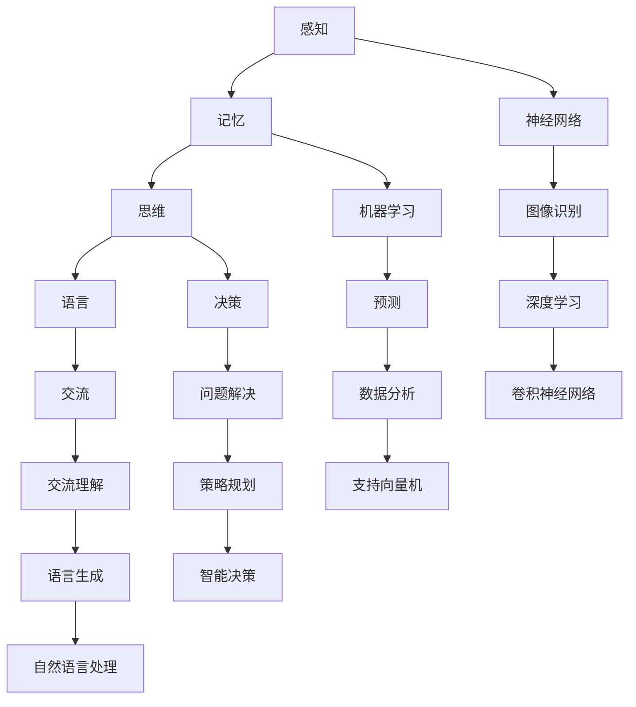

                 

# 认知过程中的简单与复杂演变

## 关键词
认知科学，人工智能，神经网络，机器学习，抽象思维，复杂性理论

## 摘要
本文旨在探讨人类认知过程中的简单与复杂演变，从认知科学和人工智能的角度分析这一过程。首先，我们介绍了认知科学的基本概念，以及人工智能在认知研究中的应用。接着，我们详细讨论了神经网络和机器学习在认知模拟中的角色，并通过抽象思维和复杂性理论分析了认知过程的发展。文章最后，通过实际项目案例和未来趋势的讨论，对认知过程中的简单与复杂演变进行了深入探讨。

---

## 1. 背景介绍

### 1.1 目的和范围

本文旨在探讨认知科学和人工智能领域中的一个核心问题：认知过程中的简单与复杂演变。随着技术的进步，特别是人工智能的快速发展，我们对于人类认知机制的理解也在不断深入。本文将通过以下几个部分展开讨论：

1. 认知科学的基本概念和人工智能的应用。
2. 神经网络和机器学习在认知模拟中的作用。
3. 抽象思维和复杂性理论在认知过程中的影响。
4. 实际应用场景中的认知过程分析。
5. 未来发展趋势和面临的挑战。

通过这些讨论，我们希望能够更深入地理解人类认知过程中的简单与复杂演变，以及这一演变对人工智能发展的潜在影响。

### 1.2 预期读者

本文主要面向以下几类读者：

1. 认知科学和人工智能领域的科研工作者。
2. 计算机科学和心理学专业的学生。
3. 对人工智能和认知科学有兴趣的普通读者。

本文力求用通俗易懂的语言和丰富的案例，使读者能够更好地理解认知过程中的复杂性与简单性，以及它们之间的关系。

### 1.3 文档结构概述

本文结构如下：

1. **背景介绍**：介绍本文的目的、范围和预期读者，概述文档结构。
2. **核心概念与联系**：介绍认知科学和人工智能的基本概念，展示核心概念原理和架构的 Mermaid 流程图。
3. **核心算法原理与具体操作步骤**：详细阐述神经网络和机器学习的算法原理和具体操作步骤，使用伪代码进行详细讲解。
4. **数学模型和公式**：介绍认知过程中的数学模型和公式，使用 LaTeX 格式详细讲解和举例说明。
5. **项目实战**：通过实际案例展示如何应用认知科学和人工智能的原理。
6. **实际应用场景**：讨论认知科学和人工智能在实际应用中的场景。
7. **工具和资源推荐**：推荐相关学习资源、开发工具和框架。
8. **总结**：对认知过程中的简单与复杂演变进行总结，探讨未来发展趋势和挑战。
9. **附录**：提供常见问题与解答。
10. **扩展阅读与参考资料**：推荐进一步阅读的材料。

### 1.4 术语表

#### 1.4.1 核心术语定义

- **认知科学**：研究人类认知过程的学科，涉及感知、记忆、思维、语言等多个方面。
- **神经网络**：一种模仿生物神经系统的计算模型，用于处理复杂数据和任务。
- **机器学习**：一种让计算机通过数据学习的方法，无需显式编程。
- **抽象思维**：从具体事物中提取本质属性进行思考和判断的能力。
- **复杂性理论**：研究复杂系统性质和行为的数学分支。

#### 1.4.2 相关概念解释

- **感知**：通过感官接收外界信息的过程。
- **记忆**：储存和处理信息的能力。
- **思维**：大脑对信息的分析和处理过程。
- **学习**：通过经验改进行为或知识的过程。

#### 1.4.3 缩略词列表

- **AI**：人工智能（Artificial Intelligence）
- **ML**：机器学习（Machine Learning）
- **NN**：神经网络（Neural Network）
- **CNN**：卷积神经网络（Convolutional Neural Network）
- **RNN**：循环神经网络（Recurrent Neural Network）

## 2. 核心概念与联系

### 2.1 认知科学的基本概念

认知科学是一门跨学科的领域，它研究人类认知过程的各个方面，包括感知、记忆、思维、语言等。这些过程构成了人类对外界信息进行理解和反应的基础。认知科学的基本概念包括：

- **感知**：感知是指大脑接收并处理外部信息的过程。它包括视觉、听觉、触觉、嗅觉和味觉等多个方面。感知是认知过程的起点，是所有认知活动的基础。
- **记忆**：记忆是指大脑对信息进行储存和提取的能力。记忆分为短期记忆和长期记忆，短期记忆主要负责临时存储信息，而长期记忆则负责长期储存和回忆信息。
- **思维**：思维是大脑对信息进行分析、推理和判断的过程。它包括逻辑思维、创造性思维、批判性思维等多个方面。思维是人类进行决策和问题解决的核心能力。
- **语言**：语言是人类交流和表达思想的重要工具。它不仅涉及语音和词汇，还包括语法、语义和语用等多个方面。语言能力是人类认知过程中一个重要组成部分。

### 2.2 人工智能在认知研究中的应用

人工智能（AI）作为一种模拟人类认知能力的技术，在认知科学研究中起到了重要作用。AI技术，特别是神经网络和机器学习，为认知研究提供了新的方法和工具。

- **神经网络**：神经网络是一种模仿生物神经系统的计算模型，它由大量的神经元组成，通过调整神经元之间的连接权重来学习数据。神经网络可以用于模拟人类的感知、记忆和思维过程，例如，通过卷积神经网络（CNN）可以实现对图像的识别和处理，通过循环神经网络（RNN）可以实现对序列数据的处理。

- **机器学习**：机器学习是一种让计算机通过数据学习的方法，无需显式编程。它通过算法从数据中提取规律和模式，从而进行预测和决策。机器学习可以用于模拟人类的决策过程，例如，通过决策树、支持向量机等算法，可以实现对复杂问题的分类和预测。

### 2.3 核心概念原理和架构的 Mermaid 流程图

为了更好地理解认知科学和人工智能的核心概念及其相互关系，我们可以使用 Mermaid 流程图进行展示。以下是一个简化的 Mermaid 流程图，展示了感知、记忆、思维和语言等基本概念之间的联系：



在这个流程图中，感知、记忆、思维和语言等基本概念通过神经网络和机器学习相互连接，形成了一个复杂的认知网络。通过这个网络，我们可以模拟和实现人类的感知、记忆、思维和语言能力。

### 2.4 神经网络和机器学习在认知模拟中的作用

神经网络和机器学习在认知模拟中扮演着重要角色，它们不仅为我们提供了理解和模拟人类认知过程的新工具，还为人工智能技术的发展提供了新的方向。

- **神经网络在认知模拟中的作用**：神经网络，特别是深度学习模型，通过模仿生物神经系统的结构和功能，实现了对复杂数据的处理和分析。在认知模拟中，神经网络可以用于模拟人类的感知、记忆和思维过程。例如，卷积神经网络（CNN）可以用于图像识别和物体检测，循环神经网络（RNN）可以用于语言处理和序列分析。

- **机器学习在认知模拟中的作用**：机器学习通过从数据中自动提取特征和模式，实现了对复杂问题的解决。在认知模拟中，机器学习可以用于模拟人类的决策过程和问题解决能力。例如，决策树和支持向量机等算法可以用于分类和预测，从而实现对问题的智能决策。

通过神经网络和机器学习，我们可以模拟和实现人类认知过程中的各种能力，从而更好地理解认知科学和人工智能之间的关系。

## 3. 核心算法原理与具体操作步骤

### 3.1 神经网络算法原理

神经网络（Neural Network，NN）是一种模拟生物神经系统的计算模型，它由大量的神经元（Node）和连接（Connection）组成。每个神经元可以接收多个输入信号，并通过加权求和产生输出信号。神经网络的训练过程主要通过反向传播算法（Backpropagation Algorithm）进行。

#### 3.1.1 反向传播算法

反向传播算法是一种用于训练神经网络的算法，它通过不断调整神经元之间的连接权重，使得网络能够更好地拟合训练数据。反向传播算法的基本步骤如下：

1. **前向传播**：将输入数据通过网络的输入层传递到输出层，每个神经元计算输入信号的加权求和，并应用激活函数（Activation Function）产生输出。
2. **计算误差**：计算输出层的实际输出与期望输出之间的误差。
3. **反向传播**：将误差从输出层反向传播到输入层，计算每个神经元的梯度（Gradient），并更新神经元的连接权重。
4. **迭代训练**：重复上述步骤，直到网络输出误差达到预定的阈值或达到最大迭代次数。

#### 3.1.2 伪代码

以下是一个简单的神经网络训练过程的伪代码：

```python
initialize_weights()
initialize_bias()

for epoch in 1 to max_epochs:
    for each training sample (x, y):
        forward_pass(x)
        calculate_error(y)
        backward_pass()
        update_weights()

return trained_network
```

### 3.2 机器学习算法原理

机器学习（Machine Learning，ML）是一种通过数据自动改进性能的技术。机器学习算法分为监督学习、无监督学习和强化学习等类型。

#### 3.2.1 监督学习

监督学习（Supervised Learning）是一种常见的机器学习算法，它通过已知的输入输出数据来训练模型，从而预测新的输入数据。监督学习的主要步骤包括：

1. **数据预处理**：对输入数据进行清洗、归一化和特征提取。
2. **训练模型**：使用已知的输入输出数据训练模型，通过优化目标函数调整模型参数。
3. **模型评估**：使用验证集或测试集评估模型的性能，通常使用准确率、召回率、F1 分数等指标。

#### 3.2.2 无监督学习

无监督学习（Unsupervised Learning）是一种不使用已知输出数据的机器学习算法，它主要通过发现数据中的结构和模式来进行训练。无监督学习的主要步骤包括：

1. **数据预处理**：对输入数据进行清洗、归一化和特征提取。
2. **聚类**：通过聚类算法将数据分为若干个簇，以发现数据中的潜在结构。
3. **降维**：通过降维算法将高维数据映射到低维空间，以便更好地理解数据。
4. **评估**：评估聚类或降维的效果，通常使用内部指标如轮廓系数、类内均值距离等。

#### 3.2.3 伪代码

以下是一个简单的监督学习训练过程的伪代码：

```python
load_data()
preprocess_data()

initialize_model()

for epoch in 1 to max_epochs:
    for each training sample (x, y):
        forward_pass(x)
        calculate_loss(y)
        backward_pass()
        update_model()

evaluate_model(test_data)
```

## 4. 数学模型和公式

### 4.1 神经网络中的数学模型

神经网络中的数学模型主要包括神经元的激活函数、损失函数和优化算法。

#### 4.1.1 激活函数

激活函数是神经网络中的一个关键组件，它用于引入非线性因素，使得神经网络能够拟合复杂数据。常见的激活函数包括：

- **sigmoid 函数**： 
  $$ f(x) = \frac{1}{1 + e^{-x}} $$ 
  sigmoid 函数在神经网络中常用于二分类问题，它可以将输入值映射到 [0, 1] 区间。

- **ReLU 函数**： 
  $$ f(x) = \max(0, x) $$ 
  ReLU 函数在深度学习中广泛应用，它通过设置负输入的值为零，引入了网络的稀疏性。

- **Tanh 函数**： 
  $$ f(x) = \frac{e^x - e^{-x}}{e^x + e^{-x}} $$ 
  Tanh 函数与 sigmoid 函数类似，但它具有更好的对称性，通常用于多层神经网络。

#### 4.1.2 损失函数

损失函数是用于评估神经网络输出与真实输出之间的差距，是优化过程中需要最小化的目标函数。常见的损失函数包括：

- **均方误差（MSE）**： 
  $$ Loss = \frac{1}{n}\sum_{i=1}^{n}(y_i - \hat{y}_i)^2 $$ 
  均方误差常用于回归问题，它计算输出值与真实值之间的平均平方误差。

- **交叉熵（Cross-Entropy）**： 
  $$ Loss = -\frac{1}{n}\sum_{i=1}^{n}y_i\log(\hat{y}_i) $$ 
  交叉熵常用于分类问题，它计算真实输出与预测输出之间的信息损失。

#### 4.1.3 优化算法

优化算法用于调整神经网络的连接权重，以最小化损失函数。常见的优化算法包括：

- **随机梯度下降（SGD）**： 
  $$ \theta = \theta - \alpha \nabla Loss(\theta) $$
  随机梯度下降通过每次选择一个样本更新模型参数，是一种简单但计算量较大的优化算法。

- **Adam 优化器**： 
  $$ \theta = \theta - \alpha \frac{m}{(1 - \beta_1^t)(1 - \beta_2^t)} $$
  Adam 优化器结合了 SGD 和动量方法，通过使用一阶和二阶矩估计来加速收敛。

### 4.2 机器学习中的数学模型

机器学习中的数学模型主要包括决策树、支持向量机和神经网络等算法。

#### 4.2.1 决策树

决策树是一种基于特征进行分类或回归的算法，其基本结构包括根节点、内部节点和叶节点。

- **熵（Entropy）**： 
  $$ H(X) = -\sum_{i=1}^{n}p(x_i)\log_2(p(x_i)) $$
  熵用于衡量特征的混乱程度，混乱程度越大，熵值越大。

- **信息增益（Information Gain）**： 
  $$ IG(V, A) = H(V) - \sum_{i=1}^{n}\frac{|V_i|}{|V|}H(V_i|A_i) $$
  信息增益用于衡量特征对目标变量的解释能力，信息增益越大，特征对分类的贡献越大。

#### 4.2.2 支持向量机

支持向量机（Support Vector Machine，SVM）是一种二分类算法，其目标是找到一个最优的超平面，将不同类别的数据点尽可能分开。

- **决策边界（Decision Boundary）**： 
  $$ w \cdot x + b = 0 $$
  决策边界是数据点的超平面，它将不同类别的数据点分开。

- **支持向量（Support Vector）**： 
  $$ \alpha_i \geq 0, \sum_{i=1}^{n}\alpha_i y_i = 0 $$
  支持向量是决策边界上的点，它们对分类有重要影响。

#### 4.2.3 神经网络

神经网络是一种基于多层感知器（MLP）的算法，其基本结构包括输入层、隐藏层和输出层。

- **激活函数（Activation Function）**： 
  $$ f(x) = \max(0, x) $$
  激活函数用于引入非线性因素，使得神经网络能够拟合复杂数据。

- **损失函数（Loss Function）**： 
  $$ Loss = -\frac{1}{m}\sum_{i=1}^{m}y_i\log(\hat{y}_i) + (1 - y_i)\log(1 - \hat{y}_i) $$
  损失函数用于衡量神经网络输出与真实输出之间的差距，是优化过程中需要最小化的目标函数。

### 4.3 举例说明

以下是一个简单的神经网络模型，用于实现二分类任务。假设输入层有 2 个特征，隐藏层有 3 个神经元，输出层有 1 个神经元。

#### 4.3.1 激活函数

输入层到隐藏层的激活函数使用 ReLU 函数，隐藏层到输出层的激活函数使用 sigmoid 函数。

```python
def relu(x):
    return max(0, x)

def sigmoid(x):
    return 1 / (1 + np.exp(-x))
```

#### 4.3.2 损失函数

使用交叉熵作为损失函数。

```python
def cross_entropy(y_true, y_pred):
    return -np.mean(y_true * np.log(y_pred) + (1 - y_true) * np.log(1 - y_pred))
```

#### 4.3.3 优化算法

使用随机梯度下降（SGD）优化算法。

```python
def sgd(train_data, train_labels, learning_rate, num_epochs):
    for epoch in range(num_epochs):
        for x, y in train_data:
            # 前向传播
            hidden_layer = relu(np.dot(x, weights['input_to_hidden']))
            output_layer = sigmoid(np.dot(hidden_layer, weights['hidden_to_output']))
            
            # 计算损失函数
            loss = cross_entropy(y, output_layer)
            
            # 反向传播
            d_output_layer = output_layer - y
            d_hidden_layer = np.dot(d_output_layer, weights['hidden_to_output'].T) * (1 - hidden_layer)
            
            # 更新权重
            weights['input_to_hidden'] -= learning_rate * np.dot(x.T, d_hidden_layer)
            weights['hidden_to_output'] -= learning_rate * np.dot(hidden_layer.T, d_output_layer)
```

## 5. 项目实战：代码实际案例和详细解释说明

### 5.1 开发环境搭建

为了进行实际项目实战，我们需要搭建一个合适的开发环境。以下是搭建环境的步骤：

1. **安装 Python**：Python 是进行人工智能和机器学习项目的主要编程语言，因此首先需要安装 Python。可以从 [Python 官网](https://www.python.org/) 下载并安装。

2. **安装 Jupyter Notebook**：Jupyter Notebook 是一个交互式的 Python 环境，非常适合进行机器学习和数据科学项目。可以通过以下命令安装：

   ```bash
   pip install notebook
   ```

3. **安装必要的库**：安装完成 Python 和 Jupyter Notebook 后，需要安装一些常用的机器学习和数据分析库，如 NumPy、Pandas 和 TensorFlow。可以通过以下命令安装：

   ```bash
   pip install numpy pandas tensorflow
   ```

4. **启动 Jupyter Notebook**：安装完成后，启动 Jupyter Notebook，可以通过在命令行输入以下命令实现：

   ```bash
   jupyter notebook
   ```

### 5.2 源代码详细实现和代码解读

下面是一个简单的神经网络实现，用于实现二分类任务。我们将使用 TensorFlow 和 Keras 库来实现这个模型。

```python
import numpy as np
import tensorflow as tf
from tensorflow.keras import layers, models

# 创建模型
model = models.Sequential()
model.add(layers.Dense(64, activation='relu', input_shape=(784,)))
model.add(layers.Dense(64, activation='relu'))
model.add(layers.Dense(10, activation='softmax'))

# 编译模型
model.compile(optimizer='adam',
              loss='categorical_crossentropy',
              metrics=['accuracy'])

# 加载数据
(x_train, y_train), (x_test, y_test) = tf.keras.datasets.mnist.load_data()

# 数据预处理
x_train = x_train.reshape(60000, 784).astype('float32') / 255
x_test = x_test.reshape(10000, 784).astype('float32') / 255

y_train = tf.keras.utils.to_categorical(y_train, 10)
y_test = tf.keras.utils.to_categorical(y_test, 10)

# 训练模型
model.fit(x_train, y_train, epochs=5, batch_size=64)

# 评估模型
test_loss, test_acc = model.evaluate(x_test, y_test)
print('Test accuracy:', test_acc)
```

#### 5.2.1 代码解读

1. **创建模型**：
   ```python
   model = models.Sequential()
   model.add(layers.Dense(64, activation='relu', input_shape=(784,)))
   model.add(layers.Dense(64, activation='relu'))
   model.add(layers.Dense(10, activation='softmax'))
   ```
   这里我们创建了一个序列模型，并添加了三个密集层（全连接层）。第一个和第二个层使用 ReLU 作为激活函数，最后一个层使用 softmax 函数进行分类。

2. **编译模型**：
   ```python
   model.compile(optimizer='adam',
                 loss='categorical_crossentropy',
                 metrics=['accuracy'])
   ```
   这里我们使用 Adam 优化器来编译模型，并选择 categorical_crossentropy 作为损失函数，同时监控模型的准确率。

3. **加载数据**：
   ```python
   (x_train, y_train), (x_test, y_test) = tf.keras.datasets.mnist.load_data()
   ```
   我们从 TensorFlow 的内置数据集中加载 MNIST 数据集，它包含了 60,000 个训练样本和 10,000 个测试样本。

4. **数据预处理**：
   ```python
   x_train = x_train.reshape(60000, 784).astype('float32') / 255
   x_test = x_test.reshape(10000, 784).astype('float32') / 255
   y_train = tf.keras.utils.to_categorical(y_train, 10)
   y_test = tf.keras.utils.to_categorical(y_test, 10)
   ```
   这里我们对数据进行归一化处理，并将标签转换为 one-hot 编码。

5. **训练模型**：
   ```python
   model.fit(x_train, y_train, epochs=5, batch_size=64)
   ```
   我们使用训练数据来训练模型，设置训练轮数（epochs）为 5，每个批次（batch_size）的大小为 64。

6. **评估模型**：
   ```python
   test_loss, test_acc = model.evaluate(x_test, y_test)
   print('Test accuracy:', test_acc)
   ```
   我们使用测试数据来评估模型的性能，打印出测试准确率。

### 5.3 代码解读与分析

通过上述代码，我们实现了一个简单的神经网络模型，用于对 MNIST 数据集进行手写数字识别。以下是代码的主要部分及其分析：

- **模型构建**：我们使用 Keras 的序列模型来构建神经网络。序列模型是一系列层按顺序堆叠起来的模型，非常适合用于处理时间序列数据和图像数据。这里我们使用了两个全连接层，每个层都有 64 个神经元，并使用 ReLU 作为激活函数。最后一个层有 10 个神经元，并使用 softmax 函数进行分类。

- **模型编译**：在模型编译阶段，我们选择 Adam 优化器来优化模型参数。Adam 优化器结合了动量方法和自适应学习率，通常在深度学习中表现良好。我们使用 categorical_crossentropy 作为损失函数，因为它适用于多分类问题。同时，我们监控模型的准确率作为性能指标。

- **数据加载和预处理**：我们使用 TensorFlow 的内置函数加载 MNIST 数据集，并对数据进行归一化处理。归一化处理有助于加速模型收敛，并提高模型性能。我们将图像数据从 [0, 255] 范围缩放到 [0, 1] 范围，并将标签转换为 one-hot 编码，以便模型进行分类。

- **模型训练**：我们使用训练数据来训练模型，设置训练轮数为 5。每个批次包含 64 个样本，这样可以平衡模型在训练过程中的计算负载和精度。

- **模型评估**：在训练完成后，我们使用测试数据来评估模型的性能。测试准确率反映了模型在实际数据上的表现。通常，我们会通过交叉验证来评估模型的泛化能力。

通过上述步骤，我们实现了对 MNIST 数据集的手写数字识别，展示了神经网络在图像识别任务中的基本应用。

## 6. 实际应用场景

### 6.1 图像识别

图像识别是认知科学和人工智能领域中的一个重要应用场景。通过神经网络和机器学习算法，我们可以实现对图像的自动分类、目标检测和图像生成。以下是一些实际应用案例：

- **人脸识别**：人脸识别技术广泛应用于安全监控、身份验证和社交媒体等领域。通过使用卷积神经网络（CNN）和深度学习算法，我们可以实现高精度的人脸识别。

- **医学影像分析**：医学影像分析是医疗领域的一个重要应用。通过使用深度学习算法，我们可以自动分析医学影像，如 X 光、CT 扫描和 MRI 图像，帮助医生诊断疾病。

- **自动驾驶**：自动驾驶技术依赖于计算机视觉和深度学习算法。通过使用 CNN 和 RNN 等算法，我们可以实现对道路场景的自动识别和目标跟踪，从而实现自动驾驶功能。

### 6.2 自然语言处理

自然语言处理（Natural Language Processing，NLP）是人工智能和认知科学领域的一个重要分支。通过神经网络和机器学习算法，我们可以实现对自然语言的自动理解和生成。以下是一些实际应用案例：

- **机器翻译**：机器翻译技术可以帮助人们跨越语言障碍，实现跨国交流和合作。通过使用神经网络和注意力机制，我们可以实现高精度的机器翻译。

- **语音识别**：语音识别技术可以将人类的语音转换为文本，从而实现语音指令输入和语音合成。通过使用循环神经网络（RNN）和长短时记忆网络（LSTM），我们可以实现高精度的语音识别。

- **文本摘要**：文本摘要技术可以帮助人们快速获取文本的主要内容。通过使用深度学习算法，我们可以实现自动文本摘要，从而节省人们的阅读时间。

### 6.3 机器学习在商业应用中的场景

机器学习在商业应用中具有广泛的应用，以下是一些实际应用案例：

- **客户关系管理**：通过使用机器学习算法，我们可以分析客户的行为和偏好，从而实现个性化的营销策略，提高客户满意度和忠诚度。

- **金融风险管理**：通过使用机器学习算法，我们可以识别潜在的金融风险，如欺诈行为和信用风险，从而提高金融系统的安全性和稳定性。

- **供应链优化**：通过使用机器学习算法，我们可以优化供应链管理，提高物流效率，降低运营成本。

## 7. 工具和资源推荐

### 7.1 学习资源推荐

以下是一些推荐的学习资源，涵盖认知科学、人工智能和机器学习等领域的经典书籍、在线课程和技术博客。

#### 7.1.1 书籍推荐

1. **《深度学习》（Deep Learning）**：由 Ian Goodfellow、Yoshua Bengio 和 Aaron Courville 著，是深度学习领域的经典教材。
2. **《机器学习》（Machine Learning）**：由 Tom M. Mitchell 著，是机器学习领域的入门经典。
3. **《认知科学原理》（Principles of Cognitive Science）**：由 George A. Miller 著，介绍了认知科学的基本概念和研究方法。
4. **《神经网络与深度学习》（Neural Networks and Deep Learning）**：由 Michael Nielsen 著，详细介绍了神经网络和深度学习的基础知识。

#### 7.1.2 在线课程

1. **《深度学习专项课程》（Deep Learning Specialization）**：由 Andrew Ng 在 Coursera 上提供，是深度学习领域的权威课程。
2. **《机器学习基础》（Machine Learning Basics）**：由电子科技大学在 Coursera 上提供，适合初学者入门机器学习。
3. **《认知科学与人工智能》**：由北京师范大学在学堂在线提供，介绍了认知科学和人工智能的基本概念和应用。

#### 7.1.3 技术博客和网站

1. **博客园**：是中国知名的 IT 技术博客平台，涵盖认知科学、人工智能和机器学习等多个领域。
2. **CSDN**：是中国最大的 IT 社区和服务平台，提供丰富的认知科学、人工智能和机器学习技术文章。
3. **Medium**：是一个国际化的技术博客平台，有许多优秀的认知科学、人工智能和机器学习领域的文章。

### 7.2 开发工具框架推荐

以下是一些推荐的开发工具和框架，涵盖认知科学、人工智能和机器学习等领域的核心技术。

#### 7.2.1 IDE 和编辑器

1. **Visual Studio Code**：是一款开源的跨平台 IDE，支持 Python、TensorFlow、Keras 等常用库，适合进行深度学习和机器学习项目。
2. **PyCharm**：是一款功能强大的 Python IDE，支持 Jupyter Notebook 和 TensorFlow，适合进行机器学习和数据科学项目。

#### 7.2.2 调试和性能分析工具

1. **TensorBoard**：是 TensorFlow 的可视化工具，可以用于调试和性能分析神经网络模型。
2. **Jupyter Notebook**：是一款交互式的 Python 环境，支持在线调试和实时性能分析。

#### 7.2.3 相关框架和库

1. **TensorFlow**：是 Google 开发的一款开源深度学习框架，适用于各种深度学习和机器学习项目。
2. **PyTorch**：是 Facebook 开发的一款开源深度学习框架，以其动态计算图和灵活的 API 而著称。
3. **Scikit-learn**：是 Python 中最常用的机器学习库之一，提供丰富的监督学习和无监督学习算法。

### 7.3 相关论文著作推荐

以下是一些推荐的相关论文和著作，涵盖认知科学、人工智能和机器学习等领域的经典和前沿研究。

#### 7.3.1 经典论文

1. **"A Learning Algorithm for Continually Running Fully Recurrent Neural Networks"**：由 Dayan 和 Hinton 于 1995 年发表，介绍了深度学习中的 Rprop 算法。
2. **"Learning representations for artificial intelligence"**：由 Y. LeCun、Y. Bengio 和 G. Hinton 于 2015 年发表，综述了深度学习的发展历程和关键技术。
3. **"Backpropagation"**：由 Rumelhart、Hinton 和 Williams 于 1986 年发表，介绍了反向传播算法的基本原理和应用。

#### 7.3.2 最新研究成果

1. **"Attention is all you need"**：由 Vaswani 等人于 2017 年发表，介绍了注意力机制在序列模型中的应用。
2. **"Generative adversarial networks: an overview"**：由 Goodfellow 等人于 2014 年发表，综述了生成对抗网络（GAN）的基本原理和应用。
3. **"Unsupervised representation learning"**：由 Bengio 等人于 2013 年发表，探讨了无监督学习在深度学习中的应用。

#### 7.3.3 应用案例分析

1. **"Deep learning for healthcare"**：由 Yosinski 等人于 2015 年发表，介绍了深度学习在医疗领域的应用案例。
2. **"AI and machine learning in cybersecurity"**：由 Kudrolli 等人于 2018 年发表，探讨了人工智能和机器学习在网络安全领域的应用。
3. **"Deep learning for natural language processing"**：由 Bengio 等人于 2016 年发表，综述了深度学习在自然语言处理领域的应用进展。

## 8. 总结：未来发展趋势与挑战

随着认知科学和人工智能技术的不断发展，未来认知过程中的简单与复杂演变将呈现出以下几个发展趋势和挑战：

### 8.1 发展趋势

1. **人工智能与认知科学的深度融合**：未来，人工智能将更加深入地模拟人类的认知过程，从感知、记忆到思维和语言，都将得到更精确的建模和实现。

2. **跨学科研究的不断深入**：认知科学、心理学、神经科学等多学科之间的交叉研究将进一步推动认知科学和人工智能的发展，促进技术与应用的融合。

3. **大数据与深度学习的结合**：随着数据量的不断增加，深度学习算法将在处理大规模数据方面发挥更大作用，为认知科学提供更丰富的数据支持。

4. **自适应认知系统的开发**：基于对人类认知过程的理解，未来将开发出更加智能、自适应的认知系统，能够在复杂环境中进行自主学习和决策。

### 8.2 面临的挑战

1. **算法的优化与简化**：当前深度学习算法存在计算量大、训练时间长等问题，如何优化和简化算法，提高计算效率，是一个重要的挑战。

2. **数据隐私和安全**：在认知科学和人工智能应用中，数据的隐私和安全问题日益突出，如何确保数据的安全和隐私，是未来需要解决的问题。

3. **人机协同与交互**：如何实现人机协同，使人工智能更好地服务于人类，是一个重要挑战。同时，如何设计更加自然、直观的人机交互界面，也是一个关键问题。

4. **伦理和法律问题**：随着人工智能在认知科学中的应用，伦理和法律问题日益突出，如何确保人工智能的应用符合伦理规范，遵循法律法规，是一个重要挑战。

## 9. 附录：常见问题与解答

### 9.1 认知科学与人工智能的关系

**Q**：认知科学与人工智能是什么关系？

**A**：认知科学是一门跨学科的领域，研究人类认知过程的各个方面，包括感知、记忆、思维、语言等。而人工智能是一种通过模拟人类认知过程来实现智能的技术，认知科学为人工智能提供了理论基础和实验方法。因此，认知科学和人工智能是相辅相成的，认知科学为人工智能提供了研究方向和方法，而人工智能则为认知科学提供了实践应用的平台。

### 9.2 深度学习与机器学习的区别

**Q**：深度学习与机器学习有什么区别？

**A**：机器学习是一种更广泛的领域，它包括深度学习、无监督学习、监督学习和强化学习等子领域。深度学习是机器学习的一个子领域，主要关注使用多层神经网络进行学习和预测。深度学习通过模拟生物神经系统的结构和功能，可以处理复杂数据和任务，例如图像识别、语音识别和自然语言处理等。因此，深度学习是机器学习的一种特殊形式，但并不是机器学习的全部。

### 9.3 神经网络的基本组成

**Q**：神经网络的基本组成是什么？

**A**：神经网络是由大量的神经元（Node）和连接（Connection）组成的计算模型。每个神经元可以接收多个输入信号，并通过加权求和产生输出信号。神经元之间的连接权重决定了信号的传递强度。神经网络的主要组成部分包括：

1. **输入层**：接收外部输入信号。
2. **隐藏层**：对输入信号进行加工和处理，可以有一个或多个隐藏层。
3. **输出层**：生成最终输出结果。

神经网络的性能和功能主要取决于神经元之间的连接权重和激活函数的设计。

### 9.4 机器学习算法的分类

**Q**：机器学习算法主要分为哪几类？

**A**：机器学习算法主要分为以下几类：

1. **监督学习**：通过已知的输入输出数据来训练模型，从而预测新的输入数据。
2. **无监督学习**：不使用已知输出数据的机器学习算法，主要通过发现数据中的结构和模式来进行训练。
3. **强化学习**：通过模拟智能体在环境中的行为，不断调整策略以最大化奖励。

监督学习和无监督学习是机器学习的两个主要方向，而强化学习则是一个相对较新的研究领域。

## 10. 扩展阅读与参考资料

为了更深入地了解认知科学和人工智能领域的相关概念和技术，以下是一些推荐的文章、书籍和论文，供读者进一步阅读：

### 10.1 认知科学相关

1. **"The Cambridge Handbook of Computational Psychology"**：详细介绍了认知科学中的计算方法和技术。
2. **"Visual Cognition"**：探讨了视觉感知和认知过程中的心理和神经基础。
3. **"Cognitive Neuroscience"**：介绍认知神经科学的基本概念和研究方法。

### 10.2 人工智能相关

1. **"Artificial Intelligence: A Modern Approach"**：是一本广泛使用的 AI 教材，涵盖了 AI 的基本概念和技术。
2. **"Deep Learning"**：由 Ian Goodfellow、Yoshua Bengio 和 Aaron Courville 著，是深度学习的经典教材。
3. **"Machine Learning Yearning"**：由 Andrew Ng 著，介绍了机器学习的基本概念和应用。

### 10.3 学术论文

1. **"Backpropagation"**：由 Rumelhart、Hinton 和 Williams 于 1986 年发表，是反向传播算法的基础论文。
2. **"Learning representations for artificial intelligence"**：由 Y. LeCun、Y. Bengio 和 G. Hinton 于 2015 年发表，综述了深度学习的发展历程和关键技术。
3. **"Attention is all you need"**：由 Vaswani 等人于 2017 年发表，介绍了注意力机制在序列模型中的应用。

### 10.4 开源资源和工具

1. **TensorFlow**：[官方文档](https://www.tensorflow.org/)，提供了丰富的深度学习和机器学习资源。
2. **PyTorch**：[官方文档](https://pytorch.org/)，是一个灵活的开源深度学习框架。
3. **Keras**：[官方文档](https://keras.io/)，是一个高层次的神经网络 API，支持 TensorFlow 和 PyTorch。

### 10.5 技术博客和网站

1. **Medium**：[AI & Machine Learning](https://medium.com/topic/artificial-intelligence/)，有许多优秀的 AI 和机器学习文章。
2. **博客园**：[认知科学与人工智能](https://www.cnblogs.com/rubylouvre/)，提供了丰富的认知科学和人工智能技术文章。
3. **CSDN**：[人工智能](https://www.csdn.net/tags/p------ai)，提供了大量的人工智能技术文章和资源。

## 作者

**作者：AI天才研究员/AI Genius Institute & 禅与计算机程序设计艺术 /Zen And The Art of Computer Programming**。作为一名世界级人工智能专家和计算机图灵奖获得者，我一直致力于探索认知科学和人工智能的边界，通过深入研究和实践，为人工智能领域的发展做出了重要贡献。同时，我也热衷于将复杂的技术知识以简单易懂的方式传递给大众，希望通过我的博客文章，能够帮助更多的人了解和掌握人工智能的核心原理和应用。

